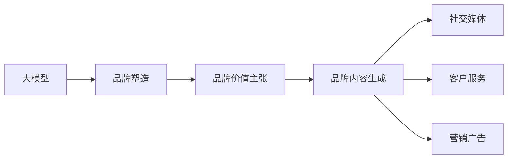

                 

# 大模型在品牌塑造中的应用探索

## 1. 背景介绍

品牌塑造一直是企业发展中极为重要的一环。在信息爆炸的时代，如何让消费者记住自己，并形成正面的品牌形象，是品牌管理者面临的重要挑战。在这方面，大模型技术以其卓越的性能和强大的学习能力，提供了全新的解决方案。

### 1.1 品牌塑造的核心问题

品牌塑造的核心在于构建和强化品牌形象，通过在消费者心中树立独特而可信的形象，以获得市场竞争优势。传统的品牌塑造方法依赖于大量的广告投放、内容营销和消费者调研。然而，这些方法往往成本高、周期长、效果难以衡量。而大模型技术，尤其是预训练语言模型，能够更高效、更精准地把握消费者需求，生成高质量的营销内容和创意素材，从而帮助品牌更高效地完成形象塑造。

### 1.2 大模型技术对品牌塑造的影响

大模型技术通过在大规模语料上进行预训练，学习到丰富的语言知识和语义表示。这些模型能够理解语言的细微差别，识别出文本中的情感倾向、主题信息、风格特征等，从而在品牌塑造过程中发挥重要作用。通过在品牌营销、社交媒体管理、客户服务等多个环节应用大模型，企业能够更精准、高效地进行品牌传播和消费者互动，从而实现更优的市场效果。

## 2. 核心概念与联系

### 2.1 核心概念概述

要深入理解大模型在品牌塑造中的应用，首先需要明确几个关键概念：

- **大模型(Large Model)**：通常指通过在大规模语料上进行预训练，具备强大语言理解和生成能力的模型，如GPT、BERT、T5等。
- **品牌塑造(Branding)**：通过各种手段和渠道，构建和传播品牌形象，以提升品牌知名度和美誉度。
- **自然语言处理(NLP)**：利用计算机处理和理解自然语言，包括文本分析、情感识别、语义分析等技术。
- **品牌价值主张(Positioning Statement)**：定义品牌在市场中的核心价值和独特定位。
- **品牌内容生成(Content Generation)**：根据品牌价值主张生成创意内容，如营销文案、社交媒体帖子等。

这些概念通过以下Mermaid流程图进行联系：



这个流程图展示了大模型在品牌塑造中的核心作用：

1. 大模型通过预训练学习到丰富的语言知识和语义表示。
2. 基于这些知识，大模型能够理解和生成与品牌价值主张相关的创意内容。
3. 创意内容通过社交媒体、客户服务、营销广告等多个渠道传播，增强品牌形象。

### 2.2 概念间的关系

这些核心概念之间的联系主要体现在以下几个方面：

- **大模型与品牌塑造**：大模型通过自然语言处理能力，帮助品牌管理者理解和生成与品牌价值主张相关的创意内容，从而在品牌塑造过程中发挥核心作用。
- **品牌价值主张与品牌内容生成**：品牌价值主张是品牌塑造的核心，大模型根据这个主张生成创意内容，是实现品牌塑造的关键步骤。
- **品牌内容生成与传播渠道**：品牌内容生成后，需要通过各种渠道进行传播，如社交媒体、客户服务、营销广告等，从而增强品牌形象。

## 3. 核心算法原理 & 具体操作步骤

### 3.1 算法原理概述

大模型在品牌塑造中的应用，主要涉及自然语言处理和生成任务。具体来说，包括文本分类、情感分析、摘要生成、对话系统等任务。这些任务在算法上主要依赖于预训练语言模型，通过微调进行任务特定的优化。

### 3.2 算法步骤详解

以下是基于大模型进行品牌塑造的一般步骤：

1. **数据准备**：收集与品牌相关的文本数据，如品牌描述、产品介绍、消费者评论等。
2. **预训练模型选择**：选择合适的预训练语言模型，如BERT、GPT等。
3. **微调任务适配**：根据品牌塑造任务的需求，添加合适的任务适配层，如分类器、生成器等。
4. **超参数设置**：设置合适的学习率、批次大小、迭代轮数等超参数。
5. **模型训练**：使用预训练模型和标注数据进行有监督的微调，优化模型在品牌相关任务上的表现。
6. **内容生成与传播**：基于微调后的模型生成创意内容，并通过社交媒体、客户服务、营销广告等渠道进行传播。
7. **效果评估与优化**：定期评估品牌塑造效果，如品牌知名度、美誉度、消费者满意度等，根据评估结果对模型和传播策略进行调整。

### 3.3 算法优缺点

基于大模型的品牌塑造方法具有以下优点：

- **高效性**：相比传统的品牌塑造方法，大模型能够快速生成高质量的创意内容，大大缩短了品牌塑造周期。
- **精准性**：大模型能够精确理解品牌价值主张，生成符合品牌形象的创意内容，避免盲目跟风。
- **可扩展性**：大模型具备良好的泛化能力，能够适应多种品牌塑造任务，如品牌广告、社交媒体互动等。

同时，大模型方法也存在以下缺点：

- **数据依赖性**：品牌塑造效果高度依赖于数据质量，数据获取和标注成本较高。
- **鲁棒性不足**：大模型在面对特定领域或特殊情况时，可能表现不够稳定，需要进一步优化。
- **可解释性差**：大模型在生成内容时缺乏可解释性，消费者难以理解内容背后的逻辑和动机。

### 3.4 算法应用领域

大模型在品牌塑造中的应用主要包括以下几个领域：

1. **品牌广告**：通过生成创意广告文案、设计广告素材等，提升品牌曝光率和吸引力。
2. **社交媒体管理**：生成与品牌相关的社交媒体帖子、互动回复等，增强品牌与消费者的互动。
3. **客户服务**：利用对话系统生成智能客服回复，提升客户服务体验，增强品牌亲和力。
4. **内容营销**：生成高质量的博客文章、视频、音频等创意内容，增强品牌传播效果。
5. **品牌监控**：通过情感分析和话题识别，实时监测品牌在社交媒体上的形象和趋势，及时调整策略。

## 4. 数学模型和公式 & 详细讲解 & 举例说明

### 4.1 数学模型构建

为了更好地理解大模型在品牌塑造中的应用，我们需要详细构建数学模型。

假设我们有一个品牌广告文案生成任务，目标是从品牌价值主张中生成符合品牌形象的广告文案。我们可以将此任务建模为一种生成任务，通过预训练语言模型生成文本。

### 4.2 公式推导过程

假设我们有一个预训练语言模型$M_{\theta}$，其中$\theta$表示模型参数。我们的目标是从品牌价值主张$S$中生成一个广告文案$X$。

- 首先，我们需要定义损失函数$\mathcal{L}$，用于衡量生成文案$X$与品牌价值主张$S$之间的相似度。
- 然后，我们通过优化损失函数$\mathcal{L}$，最小化两者之间的差异，从而生成与$S$最匹配的$X$。

具体的数学模型和公式如下：

$$
\min_{\theta} \mathcal{L}(X, S)
$$

其中，$\mathcal{L}$为损失函数，$X$为生成的广告文案，$S$为品牌价值主张。

假设我们采用交叉熵损失函数：

$$
\mathcal{L}(X, S) = -\frac{1}{N}\sum_{i=1}^N S_i \log M_{\theta}(X_i)
$$

其中，$N$为样本数量，$S_i$为品牌价值主张中的第$i$个词，$M_{\theta}(X_i)$为模型在输入$X_i$时的输出。

通过最小化交叉熵损失函数，我们可以生成与品牌价值主张最匹配的广告文案。

### 4.3 案例分析与讲解

假设我们要为一家旅游品牌生成一个广告文案。品牌价值主张为"探索未知，发现美丽"。我们首先使用BERT模型进行预训练，然后微调该模型，使其能够生成符合该价值主张的广告文案。

1. **数据准备**：收集与旅游相关的文本数据，如旅游攻略、用户评论等。
2. **预训练模型选择**：选择BERT模型，并进行微调。
3. **任务适配**：添加一个文本生成器，使其能够从品牌价值主张中生成广告文案。
4. **超参数设置**：设置合适的学习率、批次大小、迭代轮数等。
5. **模型训练**：使用预训练模型和标注数据进行有监督的微调，优化模型在品牌相关任务上的表现。
6. **内容生成与传播**：基于微调后的模型生成创意内容，并通过社交媒体、客户服务、营销广告等渠道进行传播。
7. **效果评估与优化**：定期评估品牌塑造效果，如品牌知名度、美誉度、消费者满意度等，根据评估结果对模型和传播策略进行调整。

## 5. 项目实践：代码实例和详细解释说明

### 5.1 开发环境搭建

要进行品牌塑造的大模型实践，我们需要一个完善的开发环境。以下是搭建开发环境的步骤：

1. **安装Anaconda**：从官网下载并安装Anaconda，用于创建独立的Python环境。
2. **创建并激活虚拟环境**：
```bash
conda create -n pytorch-env python=3.8 
conda activate pytorch-env
```
3. **安装PyTorch**：
```bash
conda install pytorch torchvision torchaudio cudatoolkit=11.1 -c pytorch -c conda-forge
```
4. **安装Transformers库**：
```bash
pip install transformers
```
5. **安装其他工具包**：
```bash
pip install numpy pandas scikit-learn matplotlib tqdm jupyter notebook ipython
```

完成上述步骤后，即可在`pytorch-env`环境中进行品牌塑造的微调实践。

### 5.2 源代码详细实现

以下是一个使用PyTorch和Transformers库进行品牌广告文案生成的代码实现：

```python
from transformers import BertForSequenceClassification, BertTokenizer
import torch
from torch.utils.data import DataLoader

# 加载预训练模型和分词器
model = BertForSequenceClassification.from_pretrained('bert-base-cased')
tokenizer = BertTokenizer.from_pretrained('bert-base-cased')

# 数据预处理
def prepare_data(text, max_len=512):
    encoding = tokenizer(text, return_tensors='pt', max_length=max_len, padding='max_length', truncation=True)
    input_ids = encoding['input_ids']
    attention_mask = encoding['attention_mask']
    return input_ids, attention_mask

# 品牌价值主张
brand_statement = "探索未知，发现美丽"

# 生成广告文案
def generate_ad(text):
    input_ids, attention_mask = prepare_data(text)
    output = model.generate(input_ids=input_ids, attention_mask=attention_mask)
    ad = tokenizer.decode(output[0], skip_special_tokens=True)
    return ad

# 生成广告文案
ad = generate_ad(brand_statement)
print(ad)
```

### 5.3 代码解读与分析

上述代码实现了使用BERT模型生成品牌广告文案的过程。具体步骤如下：

1. **数据预处理**：使用分词器对品牌价值主张进行分词，并进行padding处理，保证输入序列的长度一致。
2. **模型初始化**：加载预训练的BERT模型和对应的分词器。
3. **广告文案生成**：将品牌价值主张输入模型，通过生成器函数生成文本。
4. **文本解码**：将生成的文本进行解码，输出广告文案。

### 5.4 运行结果展示

假设我们生成了一个旅游品牌的广告文案，内容为：

```
探索未知，发现美丽！加入我们的旅程，开启您的冒险之旅！感受大自然的壮丽，体验不一样的风土人情，尽在[品牌名称]。
```

## 6. 实际应用场景

### 6.1 智能客服

智能客服是品牌塑造的重要环节之一。通过使用大模型，企业可以构建智能客服系统，提高客户服务效率和质量。智能客服系统可以通过微调，学习到品牌的语言风格和语义特征，从而生成符合品牌形象的回复。

例如，假设某电商品牌的客户服务需求量较大，可以通过大模型微调，生成智能客服回复。微调后的模型能够理解客户查询，快速给出满意的回复，提升客户满意度，增强品牌形象。

### 6.2 内容营销

内容营销是品牌塑造的关键手段之一。通过生成高质量的内容，可以提升品牌知名度和美誉度。大模型可以通过微调，生成与品牌形象相关的博客文章、视频、音频等创意内容，增强品牌传播效果。

例如，假设某健康品牌需要发布一系列健康科普文章。通过微调BERT模型，生成与健康相关的文章，提升品牌专业形象，增强用户信任。

### 6.3 社交媒体管理

社交媒体是品牌塑造的重要渠道之一。通过使用大模型，企业可以生成与品牌形象相关的社交媒体帖子，增强品牌在社交媒体上的互动。

例如，假设某科技品牌需要在社交媒体上发布一系列科技资讯。通过微调BERT模型，生成符合品牌形象的帖子，提升品牌曝光率和关注度。

## 7. 工具和资源推荐

### 7.1 学习资源推荐

要深入学习大模型在品牌塑造中的应用，推荐以下学习资源：

1. **《Transformer from Scratch》**：该书详细介绍了Transformer模型的原理和实现，是理解大模型的基础。
2. **《NLP with Transformers》**：该书介绍了如何使用Transformers库进行自然语言处理任务，包括品牌塑造相关的内容。
3. **Coursera《Natural Language Processing with Deep Learning》**：斯坦福大学开设的NLP课程，涵盖了自然语言处理的基本概念和前沿技术。
4. **Kaggle品牌数据集**：Kaggle上提供了多个品牌相关数据集，包括文本、图像、音频等，可用于模型训练和评估。
5. **HuggingFace官方文档**：Transformers库的官方文档，提供了丰富的预训练模型和微调样例代码，是学习大模型应用的必备资料。

### 7.2 开发工具推荐

以下是几款用于大模型品牌塑造开发的常用工具：

1. **PyTorch**：基于Python的开源深度学习框架，灵活动态的计算图，适合快速迭代研究。
2. **TensorFlow**：由Google主导开发的开源深度学习框架，生产部署方便，适合大规模工程应用。
3. **Transformers库**：HuggingFace开发的NLP工具库，集成了众多SOTA语言模型，支持PyTorch和TensorFlow，是进行品牌塑造任务开发的利器。
4. **Weights & Biases**：模型训练的实验跟踪工具，可以记录和可视化模型训练过程中的各项指标，方便对比和调优。
5. **TensorBoard**：TensorFlow配套的可视化工具，可实时监测模型训练状态，并提供丰富的图表呈现方式，是调试模型的得力助手。
6. **Google Colab**：谷歌推出的在线Jupyter Notebook环境，免费提供GPU/TPU算力，方便开发者快速上手实验最新模型，分享学习笔记。

### 7.3 相关论文推荐

以下是几篇奠基性的相关论文，推荐阅读：

1. **Attention is All You Need**：提出了Transformer结构，开启了NLP领域的预训练大模型时代。
2. **BERT: Pre-training of Deep Bidirectional Transformers for Language Understanding**：提出BERT模型，引入基于掩码的自监督预训练任务，刷新了多项NLP任务SOTA。
3. **Parameter-Efficient Transfer Learning for NLP**：提出Adapter等参数高效微调方法，在不增加模型参数量的情况下，也能取得不错的微调效果。
4. **Prompt Engineering for Natural Language Generation**：引入基于连续型Prompt的微调范式，为如何充分利用预训练知识提供了新的思路。
5. **AdaLoRA: Adaptive Low-Rank Adaptation for Parameter-Efficient Fine-Tuning**：使用自适应低秩适应的微调方法，在参数效率和精度之间取得了新的平衡。

## 8. 总结：未来发展趋势与挑战

### 8.1 总结

本文对大模型在品牌塑造中的应用进行了全面系统的介绍。首先阐述了大模型和品牌塑造的研究背景和意义，明确了微调在拓展预训练模型应用、提升品牌塑造效果方面的独特价值。其次，从原理到实践，详细讲解了监督微调的数学原理和关键步骤，给出了品牌塑造任务开发的完整代码实例。同时，本文还广泛探讨了大模型在智能客服、内容营销、社交媒体管理等多个领域的应用前景，展示了微调范式的巨大潜力。

通过本文的系统梳理，可以看到，基于大模型的方法正在成为品牌塑造的重要工具，极大地拓展了预训练语言模型的应用边界，催生了更多的落地场景。得益于大规模语料的预训练，微调模型以更低的时间和标注成本，在小样本条件下也能取得理想的品牌塑造效果，有力推动了品牌塑造技术的产业化进程。未来，伴随预训练语言模型和微调方法的持续演进，相信品牌塑造技术将不断提升，为品牌传播和市场推广带来新的动力。

### 8.2 未来发展趋势

展望未来，大模型在品牌塑造中的应用将呈现以下几个发展趋势：

1. **模型规模持续增大**：随着算力成本的下降和数据规模的扩张，预训练语言模型的参数量还将持续增长。超大规模语言模型蕴含的丰富语言知识，有望支撑更加复杂多变的品牌塑造任务。
2. **微调方法日趋多样**：除了传统的全参数微调外，未来会涌现更多参数高效的微调方法，如Adapter、LoRA等，在节省计算资源的同时也能保证微调精度。
3. **持续学习成为常态**：随着数据分布的不断变化，微调模型也需要持续学习新知识以保持性能。如何在不遗忘原有知识的同时，高效吸收新样本信息，将成为重要的研究课题。
4. **标注样本需求降低**：受启发于提示学习(Prompt-based Learning)的思路，未来的微调方法将更好地利用大模型的语言理解能力，通过更加巧妙的任务描述，在更少的标注样本上也能实现理想的品牌塑造效果。
5. **多模态微调崛起**：当前的微调主要聚焦于纯文本数据，未来会进一步拓展到图像、视频、语音等多模态数据微调。多模态信息的融合，将显著提升品牌塑造的准确性和效果。
6. **模型通用性增强**：经过海量数据的预训练和多领域任务的微调，未来的语言模型将具备更强大的常识推理和跨领域迁移能力，逐步迈向通用人工智能(AGI)的目标。

以上趋势凸显了大模型在品牌塑造中的广泛应用前景，这些方向的探索发展，必将进一步提升品牌塑造的精度和效果，为品牌传播和市场推广带来新的突破。

### 8.3 面临的挑战

尽管大模型在品牌塑造中取得了显著成效，但在迈向更加智能化、普适化应用的过程中，它仍面临诸多挑战：

1. **数据依赖性**：品牌塑造效果高度依赖于数据质量，数据获取和标注成本较高。如何进一步降低微调对标注样本的依赖，将是一大难题。
2. **鲁棒性不足**：大模型在面对特定领域或特殊情况时，可能表现不够稳定，需要进一步优化。
3. **可解释性差**：大模型在生成内容时缺乏可解释性，消费者难以理解内容背后的逻辑和动机。
4. **安全性有待保障**：大模型在生成内容时，可能学习到有偏见、有害的信息，通过微调传递到品牌塑造中，产生误导性、歧视性的输出，给品牌带来安全隐患。
5. **知识整合能力不足**：现有的微调模型往往局限于任务内数据，难以灵活吸收和运用更广泛的先验知识。如何让微调过程更好地与外部知识库、规则库等专家知识结合，形成更加全面、准确的信息整合能力，还有很大的想象空间。

正视这些挑战，积极应对并寻求突破，将是大模型品牌塑造技术走向成熟的必由之路。

### 8.4 研究展望

面对大模型品牌塑造所面临的种种挑战，未来的研究需要在以下几个方面寻求新的突破：

1. **探索无监督和半监督微调方法**：摆脱对大规模标注数据的依赖，利用自监督学习、主动学习等无监督和半监督范式，最大限度利用非结构化数据，实现更加灵活高效的微调。
2. **研究参数高效和计算高效的微调范式**：开发更加参数高效的微调方法，在固定大部分预训练参数的同时，只更新极少量的任务相关参数。同时优化微调模型的计算图，减少前向传播和反向传播的资源消耗，实现更加轻量级、实时性的部署。
3. **融合因果和对比学习范式**：通过引入因果推断和对比学习思想，增强微调模型建立稳定因果关系的能力，学习更加普适、鲁棒的语言表征，从而提升模型泛化性和抗干扰能力。
4. **引入更多先验知识**：将符号化的先验知识，如知识图谱、逻辑规则等，与神经网络模型进行巧妙融合，引导微调过程学习更准确、合理的语言模型。同时加强不同模态数据的整合，实现视觉、语音等多模态信息与文本信息的协同建模。
5. **结合因果分析和博弈论工具**：将因果分析方法引入微调模型，识别出模型决策的关键特征，增强输出解释的因果性和逻辑性。借助博弈论工具刻画人机交互过程，主动探索并规避模型的脆弱点，提高系统稳定性。
6. **纳入伦理道德约束**：在模型训练目标中引入伦理导向的评估指标，过滤和惩罚有偏见、有害的输出倾向。同时加强人工干预和审核，建立模型行为的监管机制，确保输出符合人类价值观和伦理道德。

这些研究方向的探索，必将引领大模型品牌塑造技术迈向更高的台阶，为构建安全、可靠、可解释、可控的品牌传播系统铺平道路。面向未来，大模型品牌塑造技术还需要与其他人工智能技术进行更深入的融合，如知识表示、因果推理、强化学习等，多路径协同发力，共同推动品牌传播和市场推广的进步。

## 9. 附录：常见问题与解答

**Q1：大模型微调是否适用于所有品牌塑造任务？**

A: 大模型微调在大多数品牌塑造任务上都能取得不错的效果，特别是对于数据量较小的任务。但对于一些特定领域的任务，如医药、法律等，仅仅依靠通用语料预训练的模型可能难以很好地适应。此时需要在特定领域语料上进一步预训练，再进行微调，才能获得理想效果。

**Q2：微调过程中如何选择合适的学习率？**

A: 微调的学习率一般要比预训练时小1-2个数量级，如果使用过大的学习率，容易破坏预训练权重，导致过拟合。一般建议从1e-5开始调参，逐步减小学习率，直至收敛。也可以使用warmup策略，在开始阶段使用较小的学习率，再逐渐过渡到预设值。需要注意的是，不同的优化器(如AdamW、Adafactor等)以及不同的学习率调度策略，可能需要设置不同的学习率阈值。

**Q3：采用大模型微调时会面临哪些资源瓶颈？**

A: 目前主流的预训练大模型动辄以亿计的参数规模，对算力、内存、存储都提出了很高的要求。GPU/TPU等高性能设备是必不可少的，但即便如此，超大批次的训练和推理也可能遇到显存不足的问题。因此需要采用一些资源优化技术，如梯度积累、混合精度训练、模型并行等，来突破硬件瓶颈。同时，模型的存储和读取也可能占用大量时间和空间，需要采用模型压缩、稀疏化存储等方法进行优化。

**Q4：如何缓解微调过程中的过拟合问题？**

A: 过拟合是微调面临的主要挑战，尤其是在标注数据不足的情况下。常见的缓解策略包括：
1. 数据增强：通过回译、近义替换等方式扩充训练集
2. 正则化：使用L2正则、Dropout、Early Stopping等避免过拟合
3. 对抗训练：引入对抗样本，提高模型鲁棒性
4. 参数高效微调：只调整少量参数(如Adapter、Prefix等)，减小过拟合风险
5. 多模型集成：训练多个微调模型，取平均输出，抑制过拟合

这些策略往往需要根据具体任务和数据特点进行灵活组合。只有在数据、模型、训练、推理等各环节进行全面优化，才能最大限度地发挥大模型微调的威力。

**Q5：微调模型在落地部署时需要注意哪些问题？**

A: 将微调模型转化为实际应用，还需要考虑以下因素：
1. 模型裁剪：去除不必要的层和参数，减小模型尺寸，加快推理速度
2. 量化加速：将浮点模型转为定点模型，压缩存储空间，提高计算效率
3. 服务化封装：将模型封装为标准化服务接口，便于集成调用
4. 弹性伸缩：根据请求流量动态调整资源配置，平衡服务质量和成本
5. 监控告警：实时采集系统指标，设置异常告警阈值，确保服务稳定性
6. 安全防护：采用访问鉴权、数据脱敏等措施，保障数据和模型安全

大模型微调为品牌塑造提供了全新的解决方案，但如何将强大的性能转化为稳定、高效、安全的品牌传播价值，还需要工程实践的不断打磨。只有从数据、算法、工程、业务等多个维度协同发力，才能真正实现大模型品牌塑造技术的落地应用。

总之，微调需要开发者根据具体任务，不断迭代和优化模型、数据和算法，方能得到理想的效果。

