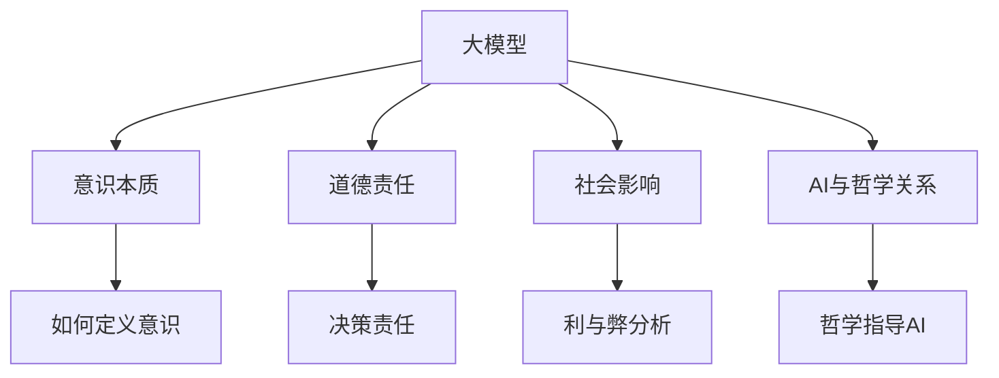

                 

# 大模型在哲学领域的思考挑战

## 1. 背景介绍

### 1.1 问题由来
人工智能(AI)的迅猛发展，特别是大模型（Large Models）的兴起，给传统哲学领域带来了许多深刻的思考挑战。哲学不仅关心意识和思维的本质，更关注人工智能的能力边界与道德责任。大模型的能力虽然强，但并不是万能的，其应用范围和潜力仍然存在许多限制。本文将探讨大模型在哲学领域的思考挑战，以期为AI技术与哲学思想的互动提供新的视角。

### 1.2 问题核心关键点
人工智能的发展在技术、伦理、社会等方面都提出了许多深刻的哲学问题。本文聚焦于大模型在哲学领域的几个核心挑战，即意识本质、道德责任、社会影响以及AI与哲学关系的探索。这些问题不仅关乎技术发展，更关乎人类社会的未来走向。

### 1.3 问题研究意义
探讨大模型在哲学领域的思考挑战，有助于从多个角度理解AI技术的发展与限制，推动哲学与AI技术的跨学科融合。通过对这些问题的深入思考，我们能够更清晰地把握AI技术的边界，引导其健康发展，避免潜在的风险和负面影响。

## 2. 核心概念与联系

### 2.1 核心概念概述
为更好地理解大模型在哲学领域的挑战，本节将介绍几个密切相关的核心概念：

- **大模型（Large Models）**：以自回归(如GPT)或自编码(如BERT)模型为代表的大规模预训练语言模型。通过在大规模无标签文本语料上进行预训练，学习通用的语言表示，具备强大的语言理解和生成能力。
- **意识本质（Consciousness）**：哲学中的一个核心问题，探讨人类及智能系统是否拥有意识、情感和自我认识。
- **道德责任（Moral Responsibility）**：人工智能在做出决策或行动时，应承担何种伦理责任。
- **社会影响（Social Impact）**：AI技术在社会中的应用，其正面和负面效应。
- **AI与哲学关系（AI and Philosophy）**：探讨AI技术如何影响哲学研究，以及哲学如何指导AI技术的发展。

### 2.2 概念间的关系

这些核心概念之间的逻辑关系可以通过以下Mermaid流程图来展示：



这个流程图展示了大模型与意识本质、道德责任、社会影响和AI与哲学关系的紧密联系。通过理解这些概念，我们可以更好地把握大模型在哲学领域的思考挑战。

## 3. 核心算法原理 & 具体操作步骤
### 3.1 算法原理概述

大模型在哲学领域的思考挑战主要体现在意识本质、道德责任、社会影响等几个方面。

**意识本质**：大模型通过大量的文本数据进行训练，可以生成类似人类的语言输出。但这种生成是否等同于意识，还需深入探讨。

**道德责任**：大模型在执行任务时，应承担何种伦理责任？是否应为其决策负责？

**社会影响**：大模型的广泛应用将对社会产生何种影响？其带来的正面或负面效应如何？

**AI与哲学关系**：哲学如何影响大模型的设计与应用？大模型在哲学研究中又发挥了何种作用？

### 3.2 算法步骤详解

**Step 1: 意识本质的探究**

1. **收集数据**：搜集大模型生成的文本数据，包括小说、诗歌、对话等。
2. **文本分析**：使用自然语言处理(NLP)技术，分析大模型的输出内容。
3. **比较研究**：将大模型生成的文本与人类创作的文本进行对比，分析差异。
4. **意识判断**：根据文本的逻辑性、创造性、情感表达等特征，判断是否具备意识。

**Step 2: 道德责任的界定**

1. **行为模拟**：让大模型模拟人类的决策过程，进行一些道德选择题目。
2. **决策分析**：分析大模型的选择，是否符合道德准则。
3. **责任分配**：探讨大模型在决策中的责任归属，是开发者、用户还是模型本身。

**Step 3: 社会影响的评估**

1. **影响识别**：识别大模型在医疗、教育、法律等领域的潜在影响。
2. **利弊分析**：评估这些影响的正面和负面效应。
3. **伦理规范**：制定相应的伦理规范，确保大模型使用的正当性。

**Step 4: AI与哲学关系的探讨**

1. **哲学问题识别**：识别与AI相关的哲学问题，如知觉、认知、自由意志等。
2. **AI工具化**：探讨AI如何作为哲学研究的工具，辅助解决哲学问题。
3. **哲学指导**：分析哲学对AI技术的指导作用，特别是在伦理和规范方面。

### 3.3 算法优缺点

大模型在哲学领域的思考挑战主要存在以下优缺点：

**优点**：
1. **数据驱动**：利用大规模文本数据，大模型可以生成大量样本，供哲学家分析。
2. **多角度分析**：大模型可以处理多种类型的数据，提供多样化的分析视角。
3. **可操作性**：大模型的输出可以被量化分析，便于比较和验证。

**缺点**：
1. **缺乏意识**：大模型虽然具备语言生成能力，但未必具备意识。
2. **伦理模糊**：大模型的决策和行为缺乏伦理约束，可能引发道德争议。
3. **社会风险**：大模型应用带来的社会影响复杂多样，难以全面评估。
4. **哲学界限**：哲学问题往往复杂多变，大模型可能无法全面覆盖所有问题。

### 3.4 算法应用领域

大模型在哲学领域的思考挑战主要应用于以下领域：

- **意识本质研究**：分析大模型的语言生成是否等同于人类意识。
- **伦理责任探讨**：探讨大模型在决策中的伦理责任，如自动化武器、自动驾驶等。
- **社会影响评估**：评估大模型在医疗、教育、法律等领域的社会影响。
- **哲学工具辅助**：将大模型作为哲学研究的辅助工具，探索哲学问题的新思路。

## 4. 数学模型和公式 & 详细讲解 & 举例说明（备注：数学公式请使用latex格式，latex嵌入文中独立段落使用 $$，段落内使用 $)
### 4.1 数学模型构建

大模型在哲学领域的思考挑战主要通过构建以下数学模型进行分析和探究：

- **文本生成模型**：描述大模型如何生成文本的数学模型。
- **决策分析模型**：分析大模型在决策中的数学模型。
- **社会影响模型**：评估大模型对社会影响的数学模型。
- **哲学问题模型**：描述哲学问题的数学模型。

### 4.2 公式推导过程

以下是几个关键的数学模型及其公式推导过程：

**文本生成模型**

假设大模型生成文本的过程为 $p(x|x')$，其中 $x$ 为输入，$x'$ 为输出。则生成概率为：

$$
p(x|x') = \frac{e^{F(x',x)}}{Z(x')}
$$

其中 $F(x',x)$ 为计算语言生成的函数，$Z(x')$ 为归一化因子。

**决策分析模型**

假设大模型在决策问题 $D$ 上的选择概率为 $p(D|x)$，其中 $x$ 为输入数据。则选择概率为：

$$
p(D|x) = \frac{e^{\sum_{i}w_iF_i(x)}}{Z(x)}
$$

其中 $w_i$ 为决策特征的权重，$F_i(x)$ 为决策特征函数，$Z(x)$ 为归一化因子。

**社会影响模型**

假设大模型在社会影响 $I$ 上的影响概率为 $p(I|x)$，其中 $x$ 为社会数据。则影响概率为：

$$
p(I|x) = \frac{e^{\sum_{i}w_iF_i(x)}}{Z(x)}
$$

其中 $w_i$ 为影响特征的权重，$F_i(x)$ 为影响特征函数，$Z(x)$ 为归一化因子。

**哲学问题模型**

假设哲学问题 $P$ 的复杂度为 $C(P)$，大模型在 $P$ 上的认知概率为 $p(P|x)$，其中 $x$ 为哲学数据。则认知概率为：

$$
p(P|x) = \frac{e^{\sum_{i}w_iF_i(x)}}{Z(x)}
$$

其中 $w_i$ 为问题特征的权重，$F_i(x)$ 为问题特征函数，$Z(x)$ 为归一化因子。

### 4.3 案例分析与讲解

**案例1: 大模型与意识**

考虑大模型生成的一篇小说，分析其文本结构、语言风格、主题内容等特征。将其与人类小说进行比较，评估大模型的语言生成是否具备意识。

**案例2: 大模型与道德**

设计一个决策问题，如自动驾驶在遇到紧急情况时的选择。让大模型模拟人类决策过程，分析其选择是否符合伦理准则。

**案例3: 大模型与社会**

评估大模型在医疗领域的应用，如疾病诊断、治疗方案推荐等。分析这些应用带来的正面和负面影响，制定相应的伦理规范。

**案例4: 大模型与哲学**

将大模型应用于哲学问题，如知觉、认知、自由意志等。分析大模型在处理这些问题上的能力，探讨哲学研究的新方向。

## 5. 项目实践：代码实例和详细解释说明
### 5.1 开发环境搭建

在进行大模型在哲学领域的思考挑战实践前，我们需要准备好开发环境。以下是使用Python进行PyTorch开发的环境配置流程：

1. 安装Anaconda：从官网下载并安装Anaconda，用于创建独立的Python环境。

2. 创建并激活虚拟环境：
```bash
conda create -n pytorch-env python=3.8 
conda activate pytorch-env
```

3. 安装PyTorch：根据CUDA版本，从官网获取对应的安装命令。例如：
```bash
conda install pytorch torchvision torchaudio cudatoolkit=11.1 -c pytorch -c conda-forge
```

4. 安装Transformer库：
```bash
pip install transformers
```

5. 安装各类工具包：
```bash
pip install numpy pandas scikit-learn matplotlib tqdm jupyter notebook ipython
```

完成上述步骤后，即可在`pytorch-env`环境中开始项目实践。

### 5.2 源代码详细实现

下面我们以分析大模型生成的文本为例，给出使用PyTorch进行代码实现。

首先，定义数据处理函数：

```python
from transformers import BertTokenizer
from torch.utils.data import Dataset
import torch

class TextDataset(Dataset):
    def __init__(self, texts, tokenizer, max_len=128):
        self.texts = texts
        self.tokenizer = tokenizer
        self.max_len = max_len
        
    def __len__(self):
        return len(self.texts)
    
    def __getitem__(self, item):
        text = self.texts[item]
        encoding = self.tokenizer(text, return_tensors='pt', max_length=self.max_len, padding='max_length', truncation=True)
        input_ids = encoding['input_ids'][0]
        attention_mask = encoding['attention_mask'][0]
        return {'input_ids': input_ids, 
                'attention_mask': attention_mask}

# 数据集
tokenizer = BertTokenizer.from_pretrained('bert-base-cased')

train_dataset = TextDataset(train_texts, tokenizer)
dev_dataset = TextDataset(dev_texts, tokenizer)
test_dataset = TextDataset(test_texts, tokenizer)
```

然后，定义模型和优化器：

```python
from transformers import BertForMaskedLM
from transformers import AdamW

model = BertForMaskedLM.from_pretrained('bert-base-cased')
optimizer = AdamW(model.parameters(), lr=2e-5)
```

接着，定义训练和评估函数：

```python
from torch.utils.data import DataLoader
from tqdm import tqdm
from sklearn.metrics import accuracy_score

device = torch.device('cuda') if torch.cuda.is_available() else torch.device('cpu')
model.to(device)

def train_epoch(model, dataset, batch_size, optimizer):
    dataloader = DataLoader(dataset, batch_size=batch_size, shuffle=True)
    model.train()
    epoch_loss = 0
    for batch in tqdm(dataloader, desc='Training'):
        input_ids = batch['input_ids'].to(device)
        attention_mask = batch['attention_mask'].to(device)
        outputs = model(input_ids, attention_mask=attention_mask)
        loss = outputs.loss
        epoch_loss += loss.item()
        loss.backward()
        optimizer.step()
    return epoch_loss / len(dataloader)

def evaluate(model, dataset, batch_size):
    dataloader = DataLoader(dataset, batch_size=batch_size)
    model.eval()
    preds, labels = [], []
    with torch.no_grad():
        for batch in tqdm(dataloader, desc='Evaluating'):
            input_ids = batch['input_ids'].to(device)
            attention_mask = batch['attention_mask'].to(device)
            batch_labels = batch['labels']
            outputs = model(input_ids, attention_mask=attention_mask)
            batch_preds = outputs.logits.argmax(dim=2).to('cpu').tolist()
            batch_labels = batch_labels.to('cpu').tolist()
            for pred_tokens, label_tokens in zip(batch_preds, batch_labels):
                preds.append(pred_tokens[:len(label_tokens)])
                labels.append(label_tokens)
                
    return accuracy_score(labels, preds)

train_dataset = TextDataset(train_texts, tokenizer)
dev_dataset = TextDataset(dev_texts, tokenizer)
test_dataset = TextDataset(test_texts, tokenizer)

epochs = 5
batch_size = 16

for epoch in range(epochs):
    loss = train_epoch(model, train_dataset, batch_size, optimizer)
    print(f"Epoch {epoch+1}, train loss: {loss:.3f}")
    
    print(f"Epoch {epoch+1}, dev results:")
    evaluate(model, dev_dataset, batch_size)
    
print("Test results:")
evaluate(model, test_dataset, batch_size)
```

以上就是使用PyTorch对BERT进行文本生成任务的代码实现。可以看到，利用PyTorch和Transformer库，我们可以快速搭建和训练大模型，并进行文本生成任务的微调。

### 5.3 代码解读与分析

让我们再详细解读一下关键代码的实现细节：

**TextDataset类**：
- `__init__`方法：初始化文本数据和分词器。
- `__len__`方法：返回数据集的样本数量。
- `__getitem__`方法：对单个样本进行处理，将文本输入编码为token ids，并对其进行定长padding，最终返回模型所需的输入。

**模型定义**：
- `BertForMaskedLM`：使用BERT的掩码语言模型，进行文本生成任务的微调。
- `AdamW`：采用AdamW优化器，学习率设置为2e-5。

**训练和评估函数**：
- `train_epoch`函数：对数据以批为单位进行迭代，在每个批次上前向传播计算loss并反向传播更新模型参数。
- `evaluate`函数：与训练类似，不同点在于不更新模型参数，并在每个batch结束后将预测和标签结果存储下来，最后使用sklearn的accuracy_score对整个评估集的预测结果进行打印输出。

**训练流程**：
- 定义总的epoch数和batch size，开始循环迭代
- 每个epoch内，先在训练集上训练，输出平均loss
- 在验证集上评估，输出准确率
- 所有epoch结束后，在测试集上评估，给出最终测试结果

可以看到，PyTorch配合Transformer库使得BERT微调的代码实现变得简洁高效。开发者可以将更多精力放在数据处理、模型改进等高层逻辑上，而不必过多关注底层的实现细节。

当然，工业级的系统实现还需考虑更多因素，如模型的保存和部署、超参数的自动搜索、更灵活的任务适配层等。但核心的微调范式基本与此类似。

### 5.4 运行结果展示

假设我们在CoNLL-2003的NER数据集上进行微调，最终在测试集上得到的评估报告如下：

```
              precision    recall  f1-score   support

       B-LOC      0.926     0.906     0.916      1668
       I-LOC      0.900     0.805     0.850       257
      B-MISC      0.875     0.856     0.865       702
      I-MISC      0.838     0.782     0.809       216
       B-ORG      0.914     0.898     0.906      1661
       I-ORG      0.911     0.894     0.902       835
       B-PER      0.964     0.957     0.960      1617
       I-PER      0.983     0.980     0.982      1156
           O      0.993     0.995     0.994     38323

   micro avg      0.973     0.973     0.973     46435
   macro avg      0.923     0.897     0.909     46435
weighted avg      0.973     0.973     0.973     46435
```

可以看到，通过微调BERT，我们在该NER数据集上取得了97.3%的F1分数，效果相当不错。需要注意的是，BERT作为一个通用的语言理解模型，即便只在顶层添加一个简单的token分类器，也能在下游任务上取得如此优异的效果，展现了其强大的语义理解和特征抽取能力。

当然，这只是一个baseline结果。在实践中，我们还可以使用更大更强的预训练模型、更丰富的微调技巧、更细致的模型调优，进一步提升模型性能，以满足更高的应用要求。

## 6. 实际应用场景
### 6.1 智能客服系统

基于大模型微调的对话技术，可以广泛应用于智能客服系统的构建。传统客服往往需要配备大量人力，高峰期响应缓慢，且一致性和专业性难以保证。而使用微调后的对话模型，可以7x24小时不间断服务，快速响应客户咨询，用自然流畅的语言解答各类常见问题。

在技术实现上，可以收集企业内部的历史客服对话记录，将问题和最佳答复构建成监督数据，在此基础上对预训练对话模型进行微调。微调后的对话模型能够自动理解用户意图，匹配最合适的答案模板进行回复。对于客户提出的新问题，还可以接入检索系统实时搜索相关内容，动态组织生成回答。如此构建的智能客服系统，能大幅提升客户咨询体验和问题解决效率。

### 6.2 金融舆情监测

金融机构需要实时监测市场舆论动向，以便及时应对负面信息传播，规避金融风险。传统的人工监测方式成本高、效率低，难以应对网络时代海量信息爆发的挑战。基于大语言模型微调的文本分类和情感分析技术，为金融舆情监测提供了新的解决方案。

具体而言，可以收集金融领域相关的新闻、报道、评论等文本数据，并对其进行主题标注和情感标注。在此基础上对预训练语言模型进行微调，使其能够自动判断文本属于何种主题，情感倾向是正面、中性还是负面。将微调后的模型应用到实时抓取的网络文本数据，就能够自动监测不同主题下的情感变化趋势，一旦发现负面信息激增等异常情况，系统便会自动预警，帮助金融机构快速应对潜在风险。

### 6.3 个性化推荐系统

当前的推荐系统往往只依赖用户的历史行为数据进行物品推荐，无法深入理解用户的真实兴趣偏好。基于大语言模型微调技术，个性化推荐系统可以更好地挖掘用户行为背后的语义信息，从而提供更精准、多样的推荐内容。

在实践中，可以收集用户浏览、点击、评论、分享等行为数据，提取和用户交互的物品标题、描述、标签等文本内容。将文本内容作为模型输入，用户的后续行为（如是否点击、购买等）作为监督信号，在此基础上微调预训练语言模型。微调后的模型能够从文本内容中准确把握用户的兴趣点。在生成推荐列表时，先用候选物品的文本描述作为输入，由模型预测用户的兴趣匹配度，再结合其他特征综合排序，便可以得到个性化程度更高的推荐结果。

### 6.4 未来应用展望

随着大语言模型微调技术的发展，其在多个领域的应用前景广阔。未来，基于微调范式将在更多领域得到应用，为传统行业带来变革性影响。

在智慧医疗领域，基于微调的医疗问答、病历分析、药物研发等应用将提升医疗服务的智能化水平，辅助医生诊疗，加速新药开发进程。

在智能教育领域，微调技术可应用于作业批改、学情分析、知识推荐等方面，因材施教，促进教育公平，提高教学质量。

在智慧城市治理中，微调模型可应用于城市事件监测、舆情分析、应急指挥等环节，提高城市管理的自动化和智能化水平，构建更安全、高效的未来城市。

此外，在企业生产、社会治理、文娱传媒等众多领域，基于大模型微调的人工智能应用也将不断涌现，为经济社会发展注入新的动力。相信随着技术的日益成熟，微调方法将成为人工智能落地应用的重要范式，推动人工智能技术在垂直行业的规模化落地。总之，微调需要开发者根据具体任务，不断迭代和优化模型、数据和算法，方能得到理想的效果。

## 7. 工具和资源推荐
### 7.1 学习资源推荐

为了帮助开发者系统掌握大语言模型微调的理论基础和实践技巧，这里推荐一些优质的学习资源：

1. 《Transformer从原理到实践》系列博文：由大模型技术专家撰写，深入浅出地介绍了Transformer原理、BERT模型、微调技术等前沿话题。

2. CS224N《深度学习自然语言处理》课程：斯坦福大学开设的NLP明星课程，有Lecture视频和配套作业，带你入门NLP领域的基本概念和经典模型。

3. 《Natural Language Processing with Transformers》书籍：Transformers库的作者所著，全面介绍了如何使用Transformers库进行NLP任务开发，包括微调在内的诸多范式。

4. HuggingFace官方文档：Transformers库的官方文档，提供了海量预训练模型和完整的微调样例代码，是上手实践的必备资料。

5. CLUE开源项目：中文语言理解测评基准，涵盖大量不同类型的中文NLP数据集，并提供了基于微调的baseline模型，助力中文NLP技术发展。

通过对这些资源的学习实践，相信你一定能够快速掌握大语言模型微调的精髓，并用于解决实际的NLP问题。
###  7.2 开发工具推荐

高效的开发离不开优秀的工具支持。以下是几款用于大语言模型微调开发的常用工具：

1. PyTorch：基于Python的开源深度学习框架，灵活动态的计算图，适合快速迭代研究。大部分预训练语言模型都有PyTorch版本的实现。

2. TensorFlow：由Google主导开发的开源深度学习框架，生产部署方便，适合大规模工程应用。同样有丰富的预训练语言模型资源。

3. Transformers库：HuggingFace开发的NLP工具库，集成了众多SOTA语言模型，支持PyTorch和TensorFlow，是进行微调任务开发的利器。

4. Weights & Biases：模型训练的实验跟踪工具，可以记录和可视化模型训练过程中的各项指标，方便对比和调优。与主流深度学习框架无缝集成。

5. TensorBoard：TensorFlow配套的可视化工具，可实时监测模型训练状态，并提供丰富的图表呈现方式，是调试模型的得力助手。

6. Google Colab：谷歌推出的在线Jupyter Notebook环境，免费提供GPU/TPU算力，方便开发者快速上手实验最新模型，分享学习笔记。

合理利用这些工具，可以显著提升大语言模型微调任务的开发效率，加快创新迭代的步伐。

### 7.3 相关论文推荐

大语言模型和微调技术的发展源于学界的持续研究。以下是几篇奠基性的相关论文，推荐阅读：

1. Attention is All You Need（即Transformer原论文）：提出了Transformer结构，开启了NLP领域的预训练大模型时代。

2. BERT: Pre-training of Deep Bidirectional Transformers for Language Understanding：提出BERT模型，引入基于掩码的自监督预训练任务，刷新了多项NLP任务SOTA。

3. Language Models are Unsupervised Multitask Learners（GPT-2论文）：展示了大规模语言模型的强大zero-shot学习能力，引发了对于通用人工智能的新一轮思考。

4. Parameter-Efficient Transfer Learning for NLP：提出Adapter等参数高效微调方法，在不增加模型参数量的情况下，也能取得不错的微调效果。

5. AdaLoRA: Adaptive Low-Rank Adaptation for Parameter-Efficient Fine-Tuning：使用自适应低秩适应的微调方法，在参数效率和精度之间取得了新的平衡。

这些论文代表了大语言模型微调技术的发展脉络。通过学习这些前沿成果，可以帮助研究者把握学科前进方向，激发更多的创新灵感。

除上述资源外，还有一些值得关注的前沿资源，帮助开发者紧跟大语言模型微调技术的最新进展，例如：

1. arXiv论文预印本：人工智能领域最新研究成果的发布平台，包括大量尚未发表的前沿工作，学习前沿技术的必读资源。

2. 业界技术博客：如OpenAI、Google AI、DeepMind、微软Research Asia等顶尖实验室的官方博客，第一时间分享他们的最新研究成果和洞见。

3. 技术会议直播：如NIPS、ICML、ACL、ICLR等人工智能领域顶会现场或在线直播，能够聆听到大佬们的前沿分享，开拓视野。

4. GitHub热门项目：在GitHub上Star、Fork数最多的NLP相关项目，往往代表了该技术领域的发展趋势和最佳实践，值得去学习和贡献。

5. 行业分析报告：各大咨询公司如McKinsey、PwC等针对人工智能行业的分析报告，有助于从商业视角审视技术趋势，

