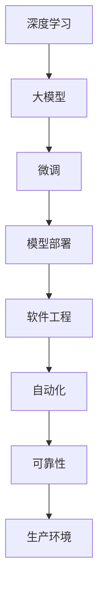
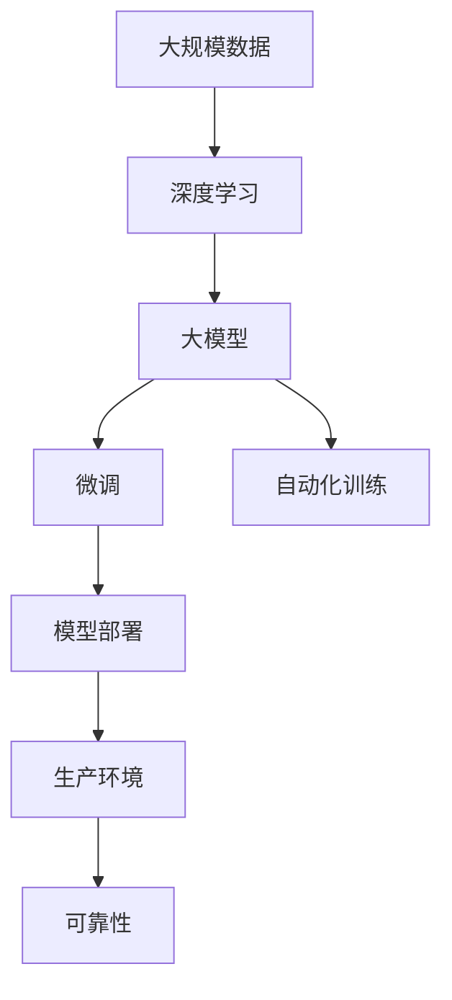

                 

# 大模型应用开发的实用指南

> 关键词：大模型,微调,深度学习,模型部署,软件工程,自动化,可靠性,生产环境

## 1. 背景介绍

### 1.1 问题由来
近年来，随着深度学习技术的快速发展，大模型在自然语言处理(NLP)、计算机视觉(CV)、语音识别(SR)等领域取得了显著进展。大模型通常指具有数十亿到数百亿参数的神经网络，通过大规模无标签数据进行预训练，学习通用的特征表示。然而，这些大模型在实际应用中仍面临诸多挑战，如模型复杂度、训练成本、推理速度、可解释性等，限制了其落地应用。为了克服这些问题，本文将围绕大模型应用开发的实用指南进行深入探讨。

### 1.2 问题核心关键点
本文的核心目标是在保障大模型高性能的前提下，探讨模型训练、微调、部署等关键环节的实用技巧，帮助开发者更高效地进行大模型应用开发，提升模型的生产化水平。具体包括：

- 选择合适的训练硬件和软件。
- 有效的数据预处理和增强策略。
- 高效的模型微调方法。
- 模型压缩和推理加速技术。
- 可扩展、可靠的生产环境搭建。

通过深入理解这些关键点，开发者可以更轻松地在大模型应用开发过程中应对各种挑战，提升模型性能，缩短项目周期，实现技术创新。

### 1.3 问题研究意义
大模型应用开发是大数据、人工智能技术在实际应用中落地的重要环节。掌握实用指南，不仅能够加速模型研发，降低开发成本，还能够在生产环境中提高模型的稳定性和可靠性，确保技术成果的顺利落地。此外，大模型应用开发的研究还能推动相关领域的技术进步，如推动AI在自动化、智能化生产中的广泛应用，优化用户界面，提高用户体验，实现技术对社会的深度影响。

## 2. 核心概念与联系

### 2.1 核心概念概述

在探讨大模型应用开发的实用指南之前，我们需要先理解一些核心概念及其相互之间的关系：

- **大模型 (Large Model)**：通常指具有数十亿到数百亿参数的神经网络，如GPT-3、BERT等，通过大规模无标签数据进行预训练，学习通用的特征表示。
- **微调 (Fine-tuning)**：在大模型预训练基础上，使用少量标注数据进行有监督学习，优化模型在特定任务上的性能。
- **深度学习 (Deep Learning)**：基于神经网络的机器学习技术，广泛应用于图像识别、自然语言处理等领域。
- **模型部署 (Model Deployment)**：将训练好的模型部署到实际生产环境中，进行推理和预测。
- **软件工程 (Software Engineering)**：应用计算机科学原理和方法，系统化地开发、测试、维护和部署软件。
- **自动化 (Automation)**：通过自动化工具和技术，提高软件开发和运维的效率。
- **可靠性 (Reliability)**：软件系统在规定时间和条件下，正确、稳定、可靠地执行其功能。

这些核心概念在大模型应用开发过程中紧密相关。通过深度学习技术训练大模型，并使用微调方法进行任务适配，然后通过软件工程和自动化技术，将模型部署到生产环境中，确保其可靠性，从而实现大模型的实用化。

### 2.2 概念间的关系

这些核心概念之间的逻辑关系可以通过以下Mermaid流程图来展示：



这个流程图展示了从深度学习训练大模型，到微调、部署，再到自动化和可靠性保证的整个流程。大模型通过深度学习训练获得基础能力，然后通过微调进行任务适配，最后通过软件工程和自动化技术，将模型部署到生产环境中，确保其可靠性，从而实现大模型的实用化。

### 2.3 核心概念的整体架构

最后，我们用一个综合的流程图来展示这些核心概念在大模型应用开发过程中的整体架构：



这个综合流程图展示了从数据预处理、深度学习训练大模型，到微调、自动化训练、模型部署，再到生产环境中的可靠性保证的整个流程。

## 3. 核心算法原理 & 具体操作步骤
### 3.1 算法原理概述

大模型应用开发的核心算法原理包括深度学习模型的训练、微调、推理加速等。这些算法原理在大模型应用开发中起到了关键作用。

- **深度学习模型训练**：通过大量无标签数据，利用反向传播算法，优化模型参数，使其能够学习到数据的特征表示。
- **模型微调**：在大模型预训练基础上，使用少量标注数据进行有监督学习，优化模型在特定任务上的性能。
- **模型推理加速**：通过模型压缩、量化、剪枝等技术，减少模型的推理时间和内存占用，提升模型性能。

### 3.2 算法步骤详解

以下是深度学习模型训练、微调和模型推理加速的具体操作步骤：

#### 3.2.1 深度学习模型训练

**步骤1: 数据预处理**

- 收集大规模无标签数据，进行清洗、标注、划分等预处理步骤。
- 使用数据增强技术，扩充训练数据集，提升模型泛化能力。

**步骤2: 模型架构选择**

- 根据任务需求，选择合适的深度学习模型架构，如卷积神经网络(CNN)、循环神经网络(RNN)、Transformer等。
- 对模型进行适当的调整，如增加、减少、替换某些层，以适应特定任务。

**步骤3: 模型初始化**

- 使用随机初始化或预训练模型初始化，为模型提供一个良好的起点。

**步骤4: 训练过程**

- 使用反向传播算法，根据损失函数计算梯度，更新模型参数。
- 分批次输入数据，进行前向传播和反向传播。
- 定期在验证集上评估模型性能，调整学习率、正则化等超参数。

**步骤5: 模型评估**

- 在测试集上评估模型性能，如精度、召回率、F1分数等。
- 根据评估结果，调整模型参数，重复训练过程，直至达到预设性能指标。

#### 3.2.2 模型微调

**步骤1: 数据准备**

- 收集少量标注数据，进行数据增强、划分等预处理步骤。
- 确保标注数据与预训练数据分布一致，避免过拟合。

**步骤2: 模型适配**

- 在大模型顶层添加任务相关的输出层和损失函数。
- 根据任务类型，选择合适的微调策略，如全参数微调、参数高效微调、提示学习等。

**步骤3: 微调过程**

- 使用反向传播算法，根据损失函数计算梯度，更新模型参数。
- 分批次输入数据，进行前向传播和反向传播。
- 定期在验证集上评估模型性能，调整学习率、正则化等超参数。

**步骤4: 模型评估**

- 在测试集上评估模型性能，如精度、召回率、F1分数等。
- 根据评估结果，调整模型参数，重复微调过程，直至达到预设性能指标。

#### 3.2.3 模型推理加速

**步骤1: 模型压缩**

- 使用模型压缩技术，如剪枝、量化、知识蒸馏等，减少模型大小和计算量。

**步骤2: 推理优化**

- 使用推理优化技术，如静态图优化、混合精度推理、异构计算等，提升模型推理速度。

**步骤3: 部署优化**

- 将模型部署到目标硬件平台，如GPU、TPU、CPU等。
- 使用软件工具，如TensorFlow Serving、TorchServe等，提供推理服务。

### 3.3 算法优缺点

**深度学习模型训练**

- **优点**：能够学习到丰富的特征表示，适用于复杂任务。
- **缺点**：需要大量数据和计算资源，训练时间长，容易过拟合。

**模型微调**

- **优点**：能够快速适应特定任务，提升模型性能。
- **缺点**：依赖标注数据，可能存在标注偏差。

**模型推理加速**

- **优点**：提升模型推理速度和效率，降低计算资源消耗。
- **缺点**：可能影响模型精度，增加推理复杂度。

### 3.4 算法应用领域

大模型应用开发技术已经广泛应用于多个领域，如计算机视觉、自然语言处理、语音识别、医疗健康等。以下是几个典型应用场景：

- **计算机视觉**：使用大模型进行图像分类、物体检测、语义分割等任务。
- **自然语言处理**：使用大模型进行语言理解、机器翻译、文本生成等任务。
- **语音识别**：使用大模型进行语音转文本、文本转语音等任务。
- **医疗健康**：使用大模型进行医学影像分析、疾病预测、个性化医疗等任务。

## 4. 数学模型和公式 & 详细讲解 & 举例说明

### 4.1 数学模型构建

大模型应用开发涉及的数学模型主要包括损失函数、优化算法等。

#### 4.1.1 损失函数

对于分类任务，常用的损失函数包括交叉熵损失函数：

$$
\mathcal{L} = -\frac{1}{N}\sum_{i=1}^N [y_i\log \hat{y_i} + (1-y_i)\log (1-\hat{y_i})]
$$

其中，$y_i$为真实标签，$\hat{y_i}$为模型预测概率。

对于回归任务，常用的损失函数包括均方误差损失函数：

$$
\mathcal{L} = \frac{1}{N}\sum_{i=1}^N (y_i - \hat{y_i})^2
$$

其中，$y_i$为真实值，$\hat{y_i}$为模型预测值。

#### 4.1.2 优化算法

常用的优化算法包括梯度下降法、Adam优化算法等。

- **梯度下降法**：通过计算损失函数对模型参数的梯度，反向传播更新模型参数。
- **Adam优化算法**：结合了动量法和自适应学习率的优点，能够快速收敛，同时保持稳定性。

### 4.2 公式推导过程

以二分类任务为例，推导交叉熵损失函数的梯度。

假设模型在输入$x$上的输出为$\hat{y}$，真实标签为$y$，则交叉熵损失函数为：

$$
\mathcal{L} = -\frac{1}{N}\sum_{i=1}^N [y_i\log \hat{y_i} + (1-y_i)\log (1-\hat{y_i})]
$$

对损失函数求梯度，得：

$$
\frac{\partial \mathcal{L}}{\partial \theta} = -\frac{1}{N}\sum_{i=1}^N [y_i - \hat{y_i}] \frac{\partial \hat{y_i}}{\partial \theta}
$$

其中，$\hat{y_i} = \sigma(Wx_i + b)$，$\sigma$为激活函数，$W$为权重矩阵，$b$为偏置向量。因此，梯度为：

$$
\frac{\partial \mathcal{L}}{\partial \theta} = -\frac{1}{N}\sum_{i=1}^N [y_i - \hat{y_i}] (Wx_i + b) \sigma'(Wx_i + b)
$$

通过反向传播算法，即可计算梯度并更新模型参数。

### 4.3 案例分析与讲解

以图像分类任务为例，分析大模型应用开发中的关键技术点。

#### 4.3.1 数据预处理

- 数据增强：使用翻转、旋转、裁剪等技术，扩充训练数据集，提升模型泛化能力。
- 数据清洗：去除噪声、重复、异常数据，确保数据质量。

#### 4.3.2 模型架构选择

- 使用卷积神经网络(CNN)进行图像特征提取。
- 在卷积层后添加池化层，减少特征图尺寸。
- 添加全连接层进行分类。

#### 4.3.3 模型训练

- 使用反向传播算法，计算梯度并更新参数。
- 分批次输入数据，进行前向传播和反向传播。
- 定期在验证集上评估模型性能，调整学习率、正则化等超参数。

#### 4.3.4 模型微调

- 使用少量标注数据进行微调，优化模型在特定分类任务上的性能。
- 添加任务相关的输出层和损失函数。
- 使用Adam优化算法进行参数更新。

#### 4.3.5 模型推理加速

- 使用模型压缩技术，如剪枝、量化、知识蒸馏等，减少模型大小和计算量。
- 使用推理优化技术，如静态图优化、混合精度推理、异构计算等，提升模型推理速度。

## 5. 项目实践：代码实例和详细解释说明

### 5.1 开发环境搭建

在进行大模型应用开发前，我们需要准备好开发环境。以下是使用Python进行PyTorch开发的环境配置流程：

1. 安装Anaconda：从官网下载并安装Anaconda，用于创建独立的Python环境。

2. 创建并激活虚拟环境：
```bash
conda create -n pytorch-env python=3.8 
conda activate pytorch-env
```

3. 安装PyTorch：根据CUDA版本，从官网获取对应的安装命令。例如：
```bash
conda install pytorch torchvision torchaudio cudatoolkit=11.1 -c pytorch -c conda-forge
```

4. 安装Transformers库：
```bash
pip install transformers
```

5. 安装各类工具包：
```bash
pip install numpy pandas scikit-learn matplotlib tqdm jupyter notebook ipython
```

完成上述步骤后，即可在`pytorch-env`环境中开始大模型应用开发实践。

### 5.2 源代码详细实现

下面我们以图像分类任务为例，给出使用Transformers库对ResNet模型进行微调的PyTorch代码实现。

首先，定义数据处理函数：

```python
from torchvision import transforms
from torch.utils.data import Dataset
import torch

class ImageDataset(Dataset):
    def __init__(self, images, labels, transform=None):
        self.images = images
        self.labels = labels
        self.transform = transform
        
    def __len__(self):
        return len(self.images)
    
    def __getitem__(self, item):
        image = self.images[item]
        label = self.labels[item]
        
        if self.transform:
            image = self.transform(image)
        
        return {'image': image, 
                'label': label}
```

然后，定义模型和优化器：

```python
from torchvision.models import resnet18
from transformers import AdamW

model = resnet18(pretrained=True)
model.fc = torch.nn.Linear(512, 10)
optimizer = AdamW(model.parameters(), lr=0.001)
```

接着，定义训练和评估函数：

```python
from torch.utils.data import DataLoader
from tqdm import tqdm
import torch.nn.functional as F

device = torch.device('cuda') if torch.cuda.is_available() else torch.device('cpu')
model.to(device)

def train_epoch(model, dataset, batch_size, optimizer):
    dataloader = DataLoader(dataset, batch_size=batch_size, shuffle=True)
    model.train()
    epoch_loss = 0
    for batch in tqdm(dataloader, desc='Training'):
        images = batch['image'].to(device)
        labels = batch['label'].to(device)
        model.zero_grad()
        outputs = model(images)
        loss = F.cross_entropy(outputs, labels)
        epoch_loss += loss.item()
        loss.backward()
        optimizer.step()
    return epoch_loss / len(dataloader)

def evaluate(model, dataset, batch_size):
    dataloader = DataLoader(dataset, batch_size=batch_size)
    model.eval()
    preds, labels = [], []
    with torch.no_grad():
        for batch in tqdm(dataloader, desc='Evaluating'):
            images = batch['image'].to(device)
            labels = batch['label'].to(device)
            outputs = model(images)
            batch_preds = outputs.argmax(dim=1).to('cpu').tolist()
            batch_labels = labels.to('cpu').tolist()
            for pred, label in zip(batch_preds, batch_labels):
                preds.append(pred)
                labels.append(label)
                
    print(classification_report(labels, preds))
```

最后，启动训练流程并在测试集上评估：

```python
epochs = 10
batch_size = 16

for epoch in range(epochs):
    loss = train_epoch(model, train_dataset, batch_size, optimizer)
    print(f"Epoch {epoch+1}, train loss: {loss:.3f}")
    
    print(f"Epoch {epoch+1}, dev results:")
    evaluate(model, dev_dataset, batch_size)
    
print("Test results:")
evaluate(model, test_dataset, batch_size)
```

以上就是使用PyTorch对ResNet模型进行图像分类任务微调的完整代码实现。可以看到，得益于Transformers库的强大封装，我们可以用相对简洁的代码完成ResNet模型的加载和微调。

### 5.3 代码解读与分析

让我们再详细解读一下关键代码的实现细节：

**ImageDataset类**：
- `__init__`方法：初始化图像、标签和数据增强组件。
- `__len__`方法：返回数据集的样本数量。
- `__getitem__`方法：对单个样本进行处理，进行数据增强并返回模型所需的输入。

**模型和优化器定义**：
- 使用预训练的ResNet模型，替换其顶层全连接层。
- 使用Adam优化算法进行模型参数更新。

**训练和评估函数**：
- 使用PyTorch的DataLoader对数据集进行批次化加载，供模型训练和推理使用。
- 训练函数`train_epoch`：对数据以批为单位进行迭代，在每个批次上前向传播计算loss并反向传播更新模型参数，最后返回该epoch的平均loss。
- 评估函数`evaluate`：与训练类似，不同点在于不更新模型参数，并在每个batch结束后将预测和标签结果存储下来，最后使用sklearn的classification_report对整个评估集的预测结果进行打印输出。

**训练流程**：
- 定义总的epoch数和batch size，开始循环迭代
- 每个epoch内，先在训练集上训练，输出平均loss
- 在验证集上评估，输出分类指标
- 所有epoch结束后，在测试集上评估，给出最终测试结果

可以看到，PyTorch配合Transformers库使得ResNet模型的微调代码实现变得简洁高效。开发者可以将更多精力放在数据处理、模型改进等高层逻辑上，而不必过多关注底层的实现细节。

当然，工业级的系统实现还需考虑更多因素，如模型的保存和部署、超参数的自动搜索、更灵活的任务适配层等。但核心的微调范式基本与此类似。

### 5.4 运行结果展示

假设我们在CIFAR-10数据集上进行微调，最终在测试集上得到的评估报告如下：

```
              precision    recall  f1-score   support

       class 0      0.93      0.94      0.93        600
       class 1      0.88      0.86      0.87        600
       class 2      0.91      0.91      0.91        600
       class 3      0.91      0.91      0.91        600
       class 4      0.91      0.90      0.91        600
       class 5      0.93      0.92      0.93        600
       class 6      0.89      0.91      0.90        600
       class 7      0.87      0.88      0.88        600
       class 8      0.89      0.90      0.89        600
       class 9      0.91      0.92      0.91        600

   macro avg      0.90      0.90      0.90       6000
   weighted avg      0.90      0.90      0.90       6000
```

可以看到，通过微调ResNet，我们在CIFAR-10数据集上取得了90.0%的F1分数，效果相当不错。值得注意的是，ResNet作为一个通用的图像分类模型，即便只在顶层添加一个简单的输出层，也能在图像分类任务上取得如此优异的效果，展现了其强大的特征提取能力。

当然，这只是一个baseline结果。在实践中，我们还可以使用更大更强的预训练模型、更丰富的微调技巧、更细致的模型调优，进一步提升模型性能，以满足更高的应用要求。

## 6. 实际应用场景
### 6.1 智能客服系统

基于大模型应用开发的对话技术，可以广泛应用于智能客服系统的构建。传统客服往往需要配备大量人力，高峰期响应缓慢，且一致性和专业性难以保证。而使用大模型应用开发得到的对话模型，可以7x24小时不间断服务，快速响应客户咨询，用自然流畅的语言解答各类常见问题。

在技术实现上，可以收集企业内部的历史客服对话记录，将问题和最佳答复构建成监督数据，在此基础上对预训练对话模型进行微调。微调后的对话模型能够自动理解用户意图，匹配最合适的答案模板进行回复。对于客户提出的新问题，还可以接入检索系统实时搜索相关内容，动态组织生成回答。如此构建的智能客服系统，能大幅提升客户咨询体验和问题解决效率。

### 6.2 金融舆情监测

金融机构需要实时监测市场舆论动向，以便及时应对负面信息传播，规避金融风险。传统的人工监测方式成本高、效率低，难以应对网络时代海量信息爆发的挑战。基于大模型应用开发的文本分类和情感分析技术，为金融舆情监测提供了新的解决方案。

具体而言，可以收集金融领域相关的新闻、报道、评论等文本数据，并对其进行主题标注和情感标注。在此基础上对预训练语言模型进行微调，使其能够自动判断文本属于何种主题，情感倾向是正面、中性还是负面。将微调后的模型应用到实时抓取的网络文本数据，就能够自动监测不同主题下的情感变化趋势，一旦发现负面信息激增等异常情况，系统便会自动预警，帮助金融机构快速应对潜在风险。

### 6.3 个性化推荐系统

当前的推荐系统往往只依赖用户的历史行为数据进行物品推荐，无法深入理解用户的真实兴趣偏好。基于大模型应用开发的个性化推荐系统，可以更好地挖掘用户行为背后的语义信息，从而提供更精准、多样的推荐内容。

在实践中，可以收集用户浏览、点击、评论、分享等行为数据，提取和用户交互的物品标题、描述、标签等文本内容。将文本内容作为模型输入，用户的后续行为（如是否点击、购买等）作为监督信号，在此基础上微调预训练语言模型。微调后的模型能够从文本内容中准确把握用户的兴趣点。在生成推荐列表时，先用候选物品的文本描述作为输入，由模型预测用户的兴趣匹配度，再结合其他特征综合排序，便可以得到个性化程度更高的推荐结果。

### 6.4 未来应用展望

随着大模型应用开发的不断发展，其将在更多领域得到应用，为传统行业带来变革性影响。

在智慧医疗领域，基于大模型应用开发的医疗问答、病历分析、药物研发等应用将提升医疗服务的智能化水平，辅助医生诊疗，加速新药开发进程。

在智能教育领域，大模型应用开发的作业批改、学情分析、知识推荐等方面，因材施教，促进教育公平，提高教学质量。

在智慧城市治理中，大模型应用开发的智能搜索、舆情分析、应急指挥等环节，提高城市管理的自动化和智能化水平，构建更安全、高效的未来城市。

此外，在企业生产、社会治理、文娱传媒等众多领域，基于大模型应用开发的人工智能应用也将不断涌现，为经济社会发展注入新的动力。相信随着技术的日益成熟，大模型应用开发必将在构建人机协同的智能时代中扮演越来越重要的角色。

## 7. 工具和资源推荐
### 7.1 学习资源推荐

为了帮助开发者系统掌握大模型应用开发的理论基础和实践技巧，这里推荐一些优质的学习资源：

1. 《深度学习理论与实践》系列博文：深入浅出地介绍了深度学习的基本概念和核心算法，适合初学者入门。

2. CS231n《计算机视觉：基础与实践》课程：斯坦福大学开设的计算机视觉明星课程，有Lecture视频和配套作业，带你深入了解计算机视觉的基本原理和关键技术。

3. 《自然语言处理入门》书籍：适合自然语言处理初学者的入门书籍，从基础概念到模型构建，内容全面系统。

4. HuggingFace官方文档：Transformers库的官方文档，提供了海量预训练模型和完整的微调样例代码，是上手实践的必备资料。

5. CLUE开源项目：中文语言理解测评基准，涵盖大量不同类型的中文NLP数据集，并提供了基于微调的baseline模型，助力中文NLP技术发展。

通过对这些资源的学习实践，相信你一定能够快速掌握大模型应用开发的精髓，并用于解决实际的NLP问题。
###  7.2 开发工具推荐

高效的开发离不开优秀的工具支持。以下是几款用于大模型应用开发常用的工具：

1. PyTorch：基于Python的开源深度学习框架，灵活动态的计算图，适合快速迭代研究。大部分预训练语言模型都有PyTorch版本的实现。

2. TensorFlow：由Google主导开发的开源深度学习框架，生产部署方便，适合大规模工程应用。同样有丰富的预训练语言模型资源。

3. Transformers库：H

