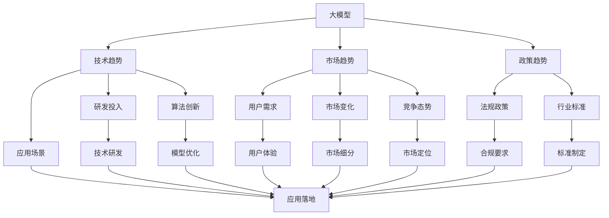

                 

# 大模型时代的创业者创业趋势洞察：技术趋势、市场趋势与政策趋势

> 关键词：大模型,技术趋势,市场趋势,政策趋势,人工智能,创业洞察

## 1. 背景介绍

### 1.1 问题由来

在过去几年里，人工智能（AI）尤其是大模型（Large Models）技术迅猛发展，正在彻底改变各行各业的生态。技术的进步带来了前所未有的机遇，也孕育着巨大的挑战。对于创业者而言，如何抓住这些趋势，顺势而为，将技术优势转化为商业成功，成为了核心问题。

本文将围绕大模型时代的创业者创业趋势展开深入探讨，通过分析技术趋势、市场趋势和政策趋势，为创业者提供全面且系统的创业洞察。

## 2. 核心概念与联系

### 2.1 核心概念概述

为更好地理解大模型时代的创业趋势，我们首先梳理几个关键概念及其之间的联系：

1. **大模型**（Large Models）：基于自回归（如GPT-3）或自编码（如BERT）结构训练的庞大模型，具有强大的语言生成和理解能力。大模型的关键特征包括：模型参数量庞大、计算资源需求高、训练和推理成本昂贵。

2. **技术趋势**：涵盖前沿技术进展、开发工具创新、科研突破等，推动技术不断迭代和进步，影响市场应用。

3. **市场趋势**：包括行业应用发展、用户需求变化、竞争格局演进等，是大模型商业化过程中的重要参考。

4. **政策趋势**：涉及法律法规、政策导向、行业标准等，影响大模型的研发、应用和商业化。

5. **创业洞察**：基于对技术、市场、政策多方面趋势的分析，为创业者提供有价值的创业方向和机会识别。

这些概念共同构成了大模型时代的创业生态系统，彼此之间相互作用，推动着行业的不断进步。

### 2.2 核心概念之间的关系

通过以下 Mermaid 流程图展示这些核心概念之间的联系：



这个流程图展示了从大模型到技术、市场和政策趋势的相互影响关系。

## 3. 核心算法原理 & 具体操作步骤
### 3.1 算法原理概述

在大模型时代，基于大模型的微调（Fine-Tuning）成为了关键的创业技术趋势。微调指的是在大模型的基础上，使用特定任务的数据集进行有监督学习，优化模型参数，使其在特定任务上表现更佳。其原理如下：

1. **预训练**：在大规模无标签数据上进行自监督学习，学习通用的语言表示。
2. **微调**：使用下游任务的标注数据集进行有监督学习，调整模型参数，适应具体任务需求。

### 3.2 算法步骤详解

微调的具体操作步骤如下：

1. **准备数据集**：收集下游任务的标注数据集，并划分为训练集、验证集和测试集。
2. **加载预训练模型**：选择合适的大模型（如BERT、GPT-3等），并加载到计算环境中。
3. **设计任务适配层**：根据任务类型，在预训练模型的顶部添加必要的输出层和损失函数。
4. **设置超参数**：包括学习率、批大小、迭代轮数等，优化器选择AdamW等。
5. **执行训练**：在训练集上进行迭代训练，更新模型参数，每轮后评估验证集性能，避免过拟合。
6. **测试和评估**：在测试集上评估模型性能，对比微调前后的提升情况。
7. **部署应用**：将微调后的模型集成到实际应用系统中，进行推理和预测。

### 3.3 算法优缺点

**优点**：
- 适用范围广，适用于多种NLP任务，如分类、生成等。
- 训练速度快，能够在少量标注数据上取得显著性能提升。
- 可迁移性高，适应不同领域和任务需求。

**缺点**：
- 数据需求高，标注数据集获取成本较高。
- 模型复杂度高，训练和推理资源消耗大。
- 模型泛化能力有限，易受数据分布偏差影响。

### 3.4 算法应用领域

微调技术在大模型时代的应用非常广泛，涵盖了以下领域：

- **自然语言处理（NLP）**：文本分类、命名实体识别、机器翻译、对话系统等。
- **图像处理**：图像生成、图像分类、目标检测等。
- **语音识别**：语音识别、语音生成等。
- **医疗健康**：疾病诊断、个性化医疗等。
- **金融科技**：信用评估、风险预测、情感分析等。

## 4. 数学模型和公式 & 详细讲解

### 4.1 数学模型构建

以二分类任务为例，微调模型的数学模型可以表示为：

$$
\theta^* = \mathop{\arg\min}_{\theta} \mathcal{L}(M_{\theta},D)
$$

其中，$M_{\theta}$ 为微调后的模型，$D$ 为下游任务的标注数据集，$\mathcal{L}$ 为损失函数，常用的有交叉熵损失。

### 4.2 公式推导过程

损失函数 $\mathcal{L}$ 的推导如下：

$$
\mathcal{L}(M_{\theta},D) = -\frac{1}{N} \sum_{i=1}^N \log(M_{\theta}(x_i) \cdot y_i + (1 - M_{\theta}(x_i)) \cdot (1 - y_i))
$$

其中，$x_i$ 为输入样本，$y_i$ 为标签，$M_{\theta}(x_i)$ 为模型对样本 $x_i$ 的预测概率。

### 4.3 案例分析与讲解

以命名实体识别（NER）任务为例，其微调的数学模型可以表示为：

$$
\theta^* = \mathop{\arg\min}_{\theta} \mathcal{L}(M_{\theta},D)
$$

其中，$D$ 为标注数据集，包含输入文本和对应的标签序列。

假设输入文本为 "John is a engineer from Shanghai University."，其标签序列为 ["B-PER", "I-PER", "B-MISC", "I-MISC", "B-LOC", "I-LOC"]。模型输出的概率分布如下：

$$
P(\text{B-PER}) = 0.9, P(\text{I-PER}) = 0.1, P(\text{B-MISC}) = 0.8, P(\text{I-MISC}) = 0.2, P(\text{B-LOC}) = 0.7, P(\text{I-LOC}) = 0.3
$$

损失函数为：

$$
\mathcal{L}(M_{\theta},D) = -\sum_{i=1}^N \log(M_{\theta}(x_i) \cdot y_i)
$$

其中，$y_i$ 为标签序列，$M_{\theta}(x_i)$ 为模型对样本 $x_i$ 的预测概率分布。

通过迭代优化，模型参数 $\theta$ 不断更新，最小化损失函数 $\mathcal{L}$，直至收敛，即可得到微调后的模型。

## 5. 项目实践：代码实例和详细解释说明

### 5.1 开发环境搭建

首先，需要准备相应的开发环境，以进行微调的实现。

1. **安装Python**：确保环境中已经安装了Python 3.8及以上版本。
2. **安装PyTorch**：使用以下命令安装：

   ```bash
   pip install torch torchvision torchaudio
   ```

3. **安装Transformer库**：使用以下命令安装：

   ```bash
   pip install transformers
   ```

4. **安装其他必要库**：包括numpy、pandas、scikit-learn、matplotlib、tqdm、jupyter notebook 等。

5. **配置环境**：确保所有依赖库都已经安装，并且环境变量配置正确。

### 5.2 源代码详细实现

以下是一个简单的命名实体识别（NER）任务微调代码实现：

```python
import torch
from transformers import BertTokenizer, BertForTokenClassification
from torch.utils.data import Dataset, DataLoader
from sklearn.metrics import classification_report

# 定义数据集类
class NERDataset(Dataset):
    def __init__(self, texts, tags, tokenizer, max_len=128):
        self.texts = texts
        self.tags = tags
        self.tokenizer = tokenizer
        self.max_len = max_len

    def __len__(self):
        return len(self.texts)

    def __getitem__(self, item):
        text = self.texts[item]
        tags = self.tags[item]

        encoding = self.tokenizer(text, return_tensors='pt', max_length=self.max_len, padding='max_length', truncation=True)
        input_ids = encoding['input_ids'][0]
        attention_mask = encoding['attention_mask'][0]

        # 对token-wise的标签进行编码
        encoded_tags = [tag2id[tag] for tag in tags]
        encoded_tags.extend([tag2id['O']] * (self.max_len - len(encoded_tags)))
        labels = torch.tensor(encoded_tags, dtype=torch.long)

        return {'input_ids': input_ids, 
                'attention_mask': attention_mask,
                'labels': labels}

# 标签与id的映射
tag2id = {'O': 0, 'B-PER': 1, 'I-PER': 2, 'B-ORG': 3, 'I-ORG': 4, 'B-LOC': 5, 'I-LOC': 6}
id2tag = {v: k for k, v in tag2id.items()}

# 创建dataset
tokenizer = BertTokenizer.from_pretrained('bert-base-cased')

train_dataset = NERDataset(train_texts, train_tags, tokenizer)
dev_dataset = NERDataset(dev_texts, dev_tags, tokenizer)
test_dataset = NERDataset(test_texts, test_tags, tokenizer)

# 定义模型和优化器
model = BertForTokenClassification.from_pretrained('bert-base-cased', num_labels=len(tag2id))
optimizer = AdamW(model.parameters(), lr=2e-5)

# 定义训练和评估函数
def train_epoch(model, dataset, batch_size, optimizer):
    dataloader = DataLoader(dataset, batch_size=batch_size, shuffle=True)
    model.train()
    epoch_loss = 0
    for batch in dataloader:
        input_ids = batch['input_ids'].to(device)
        attention_mask = batch['attention_mask'].to(device)
        labels = batch['labels'].to(device)
        model.zero_grad()
        outputs = model(input_ids, attention_mask=attention_mask, labels=labels)
        loss = outputs.loss
        epoch_loss += loss.item()
        loss.backward()
        optimizer.step()
    return epoch_loss / len(dataloader)

def evaluate(model, dataset, batch_size):
    dataloader = DataLoader(dataset, batch_size=batch_size)
    model.eval()
    preds, labels = [], []
    with torch.no_grad():
        for batch in dataloader:
            input_ids = batch['input_ids'].to(device)
            attention_mask = batch['attention_mask'].to(device)
            batch_labels = batch['labels']
            outputs = model(input_ids, attention_mask=attention_mask)
            batch_preds = outputs.logits.argmax(dim=2).to('cpu').tolist()
            batch_labels = batch_labels.to('cpu').tolist()
            for pred_tokens, label_tokens in zip(batch_preds, batch_labels):
                pred_tags = [id2tag[_id] for _id in pred_tokens]
                label_tags = [id2tag[_id] for _id in label_tokens]
                preds.append(pred_tags[:len(label_tags)])
                labels.append(label_tags)
                
    print(classification_report(labels, preds))

# 训练模型
epochs = 5
batch_size = 16

device = torch.device('cuda') if torch.cuda.is_available() else torch.device('cpu')
model.to(device)

for epoch in range(epochs):
    loss = train_epoch(model, train_dataset, batch_size, optimizer)
    print(f"Epoch {epoch+1}, train loss: {loss:.3f}")

    print(f"Epoch {epoch+1}, dev results:")
    evaluate(model, dev_dataset, batch_size)

print("Test results:")
evaluate(model, test_dataset, batch_size)
```

这段代码实现了一个简单的NER任务微调过程，使用了BertForTokenClassification模型和AdamW优化器。

### 5.3 代码解读与分析

在代码实现中，我们首先定义了数据集类 `NERDataset`，用于处理标注数据。接着，使用BertTokenizer对文本进行分词，将分词后的结果输入模型中进行微调。在训练过程中，使用AdamW优化器进行参数更新，并在验证集上评估模型性能。

通过运行上述代码，可以在训练集和验证集上进行微调，并在测试集上评估模型性能，从而得到最终的结果。

## 6. 实际应用场景

### 6.1 智能客服系统

智能客服系统是微调技术的典型应用场景之一。通过微调，可以使大模型具备快速理解用户意图、生成符合语境的回答的能力，提升客户咨询体验。

### 6.2 金融舆情监测

金融舆情监测需要快速分析海量文本数据，识别潜在风险。微调技术可以构建实时监测系统，自动分析和预警舆情变化。

### 6.3 个性化推荐系统

个性化推荐系统需要根据用户行为数据，生成个性化的推荐结果。微调技术可以通过用户输入和行为数据，训练模型预测用户兴趣，实现更加精准的推荐。

### 6.4 未来应用展望

未来，微调技术将在大模型时代发挥更大的作用，推动更多行业应用落地。

- **医疗健康**：通过微调，大模型可以辅助医生进行诊断和治疗方案推荐。
- **教育培训**：微调技术可以用于作业批改、智能教学等，提升教学质量。
- **智慧城市**：微调技术可以用于城市事件监测、应急响应等，提升城市治理效率。

## 7. 工具和资源推荐

### 7.1 学习资源推荐

1. **《Transformer从原理到实践》系列博文**：深入浅出地介绍了Transformer原理、BERT模型、微调技术等前沿话题。
2. **CS224N《深度学习自然语言处理》课程**：斯坦福大学开设的NLP明星课程，涵盖NLP的基本概念和经典模型。
3. **《Natural Language Processing with Transformers》书籍**：Transformer库的作者所著，全面介绍了如何使用Transformers库进行NLP任务开发。
4. **HuggingFace官方文档**：提供了丰富的预训练模型和微调样例代码，是上手实践的必备资料。
5. **CLUE开源项目**：中文语言理解测评基准，涵盖大量不同类型的中文NLP数据集，并提供了基于微调的baseline模型。

### 7.2 开发工具推荐

1. **PyTorch**：基于Python的开源深度学习框架，适合快速迭代研究。
2. **TensorFlow**：由Google主导开发的开源深度学习框架，生产部署方便。
3. **Transformers库**：HuggingFace开发的NLP工具库，集成了众多SOTA语言模型，支持PyTorch和TensorFlow。
4. **Weights & Biases**：模型训练的实验跟踪工具，记录和可视化模型训练过程中的各项指标。
5. **TensorBoard**：TensorFlow配套的可视化工具，实时监测模型训练状态，提供图表呈现方式。
6. **Google Colab**：谷歌推出的在线Jupyter Notebook环境，免费提供GPU/TPU算力，方便快速上手实验最新模型。

### 7.3 相关论文推荐

1. **Attention is All You Need**：提出了Transformer结构，开启了NLP领域的预训练大模型时代。
2. **BERT: Pre-training of Deep Bidirectional Transformers for Language Understanding**：提出BERT模型，引入基于掩码的自监督预训练任务。
3. **Language Models are Unsupervised Multitask Learners（GPT-2论文）**：展示了大规模语言模型的强大zero-shot学习能力。
4. **Parameter-Efficient Transfer Learning for NLP**：提出Adapter等参数高效微调方法，在固定参数量的情况下，取得不错的微调效果。
5. **Prefix-Tuning: Optimizing Continuous Prompts for Generation**：引入基于连续型Prompt的微调范式，提高模型泛化能力。
6. **AdaLoRA: Adaptive Low-Rank Adaptation for Parameter-Efficient Fine-Tuning**：使用自适应低秩适应的微调方法，提高模型参数效率。

## 8. 总结：未来发展趋势与挑战

### 8.1 研究成果总结

本文从技术趋势、市场趋势和政策趋势三个方面，全面剖析了大模型时代的创业者创业趋势。重点在于微调技术的应用和发展，从理论到实践，系统地介绍了微调技术的原理、操作步骤、优缺点和应用领域。

### 8.2 未来发展趋势

未来，大模型时代将呈现出以下趋势：

1. **模型规模继续增大**：预训练大模型将更庞大、更复杂，但计算资源的需求也将更高。
2. **微调方法多样化**：除了全参数微调外，更多参数高效和计算高效的微调方法将出现。
3. **持续学习成为常态**：模型需要不断学习新知识，避免灾难性遗忘，实现增量学习。
4. **数据需求降低**：受启发于提示学习，微调方法将更好地利用大模型的语言理解能力，降低对标注样本的依赖。
5. **多模态微调崛起**：视觉、语音等多模态数据的融合将提升模型的语言建模能力。
6. **通用性增强**：大模型将具备更强的常识推理和跨领域迁移能力，逐步迈向通用人工智能。

### 8.3 面临的挑战

尽管大模型时代充满机遇，但仍有诸多挑战需要克服：

1. **标注成本高**：微调过程依赖高质量标注数据，成本较高。
2. **模型鲁棒性不足**：模型泛化能力有限，易受数据分布偏差影响。
3. **推理效率低**：大模型推理速度慢、内存占用大。
4. **可解释性不足**：模型决策过程缺乏可解释性。
5. **安全性问题**：预训练模型可能学习到有害信息，产生误导性输出。
6. **知识整合能力不足**：模型无法灵活吸收外部知识，无法实现全面、准确的信息整合。

### 8.4 研究展望

未来，大模型时代的研究方向将更加广泛，涵盖以下方面：

1. **探索无监督和半监督微调方法**：降低标注数据依赖，利用自监督学习、主动学习等技术。
2. **开发参数高效和计算高效的微调范式**：提高模型微调效率，降低计算成本。
3. **引入因果推断和对比学习**：增强模型的泛化能力和鲁棒性。
4. **融合外部知识**：将符号化的先验知识与神经网络模型结合，提升模型知识整合能力。
5. **纳入伦理道德约束**：建立模型行为的监管机制，确保输出符合人类价值观和伦理道德。

通过多方面的努力和研究，大模型时代的创业者将迎来更多的机遇和挑战，推动人工智能技术的持续进步。

## 9. 附录：常见问题与解答

### 9.1 Q1: 大模型微调是否适用于所有NLP任务？

A: 大模型微调在大多数NLP任务上都能取得不错的效果，特别是对于数据量较小的任务。但对于一些特定领域的任务，仅靠通用语料预训练的模型可能难以很好地适应。此时需要在特定领域语料上进一步预训练，再进行微调，才能获得理想效果。

### 9.2 Q2: 如何选择合适的学习率？

A: 微调的学习率一般要比预训练时小1-2个数量级，如果使用过大的学习率，容易破坏预训练权重，导致过拟合。一般建议从1e-5开始调参，逐步减小学习率，直至收敛。也可以使用warmup策略，在开始阶段使用较小的学习率，再逐渐过渡到预设值。

### 9.3 Q3: 采用大模型微调时会面临哪些资源瓶颈？

A: 目前主流的预训练大模型动辄以亿计的参数规模，对算力、内存、存储都提出了很高的要求。GPU/TPU等高性能设备是必不可少的，但即便如此，超大批次的训练和推理也可能遇到显存不足的问题。因此需要采用一些资源优化技术，如梯度积累、混合精度训练、模型并行等，来突破硬件瓶颈。

### 9.4 Q4: 如何缓解微调过程中的过拟合问题？

A: 过拟合是微调面临的主要挑战，尤其是在标注数据不足的情况下。常见的缓解策略包括：

- 数据增强：通过回译、近义替换等方式扩充训练集。
- 正则化：使用L2正则、Dropout、Early Stopping等避免过拟合。
- 对抗训练：引入对抗样本，提高模型鲁棒性。
- 参数高效微调：只调整少量参数(如Adapter、Prefix等)，减小过拟合风险。
- 多模型集成：训练多个微调模型，取平均输出，抑制过拟合。

这些策略往往需要根据具体任务和数据特点进行灵活组合。只有在数据、模型、训练、推理等各环节进行全面优化，才能最大限度地发挥大模型微调的威力。

### 9.5 Q5: 微调模型在落地部署时需要注意哪些问题？

A: 将微调模型转化为实际应用，还需要考虑以下因素：

- 模型裁剪：去除不必要的层和参数，减小模型尺寸，加快推理速度。
- 量化加速：将浮点模型转为定点模型，压缩存储空间，提高计算效率。
- 服务化封装：将模型封装为标准化服务接口，便于集成调用。
- 弹性伸缩：根据请求流量动态调整资源配置，平衡服务质量和成本。
- 监控告警：实时采集系统指标，设置异常告警阈值，确保服务稳定性。
- 安全防护：采用访问鉴权、数据脱敏等措施，保障数据和模型安全。

大模型微调为NLP应用开启了广阔的想象空间，但如何将强大的性能转化为稳定、高效、安全的业务价值，还需要工程实践的不断打磨。

