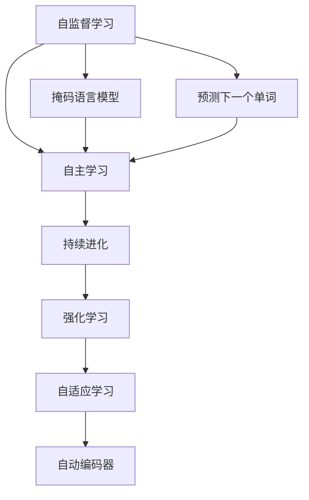
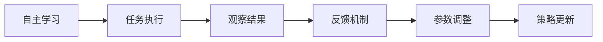
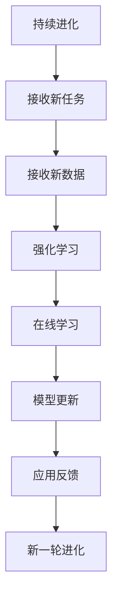
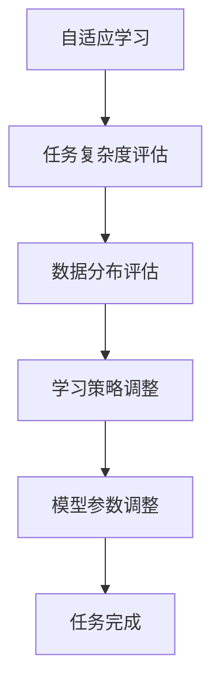
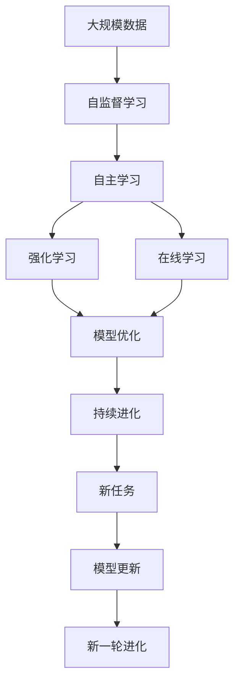

                 

# 大模型的自我进化:自主学习和持续进化

> 关键词：自监督学习, 自主学习, 持续进化, 深度学习模型, 强化学习, 自动编码器, 自适应学习

## 1. 背景介绍

### 1.1 问题由来
近年来，深度学习技术在自然语言处理(NLP)、计算机视觉(CV)、语音识别(SR)等领域取得了突破性进展。深度模型通过大量数据和计算资源的投入，获得了强大的表征学习能力，如BERT、GPT-3等。但这些模型的知识迁移能力有限，面对新的应用场景，往往需要重新从头训练，不仅费时费力，而且效果难以保证。

如何让深度模型具备自主学习和持续进化的能力，自动适应新任务，提高模型的通用性和应用效率，成为了学术界和工业界共同关注的问题。自主学习（Autonomous Learning）和持续进化（Continuous Evolution）的概念应运而生，通过自我更新和反馈机制，让模型在不断的实践中自我改进，提升其通用性和可解释性。

### 1.2 问题核心关键点
自主学习和持续进化的核心在于：
- **自监督学习**：在大规模无标签数据上，通过自我监督学习，提取数据的内在规律，提升模型的泛化能力。
- **自主学习**：模型在执行任务时，通过观察和反馈，自我调整策略和参数，提高任务完成的效率和效果。
- **持续进化**：模型在实际应用中不断接收新任务和新数据，通过强化学习和在线学习，自我优化和适应，保持长期的知识更新和能力提升。
- **自适应学习**：根据任务的复杂度和数据的分布，动态调整学习策略，确保模型在各种情况下都能高效运作。

这些关键点共同构成了大模型的自主学习和持续进化框架，使其能够不断适应新的应用场景和数据分布，提升模型的应用效率和效果。

### 1.3 问题研究意义
自主学习和持续进化技术，对于拓展大模型的应用边界，提升其通用性和实用性，具有重要意义：
1. **降低开发成本**：模型能够自主学习和适应新任务，减少了从头训练所需的成本和周期。
2. **提高应用效率**：模型在实际应用中不断自我优化，适应不同的数据分布和任务需求，提高了模型的应用效率和效果。
3. **增强可解释性**：模型在自主学习过程中，其决策过程变得更加透明和可解释，有助于理解和调试模型行为。
4. **提升鲁棒性**：模型通过不断的反馈和调整，能够增强其鲁棒性，提高应对噪声和异常数据的能力。
5. **促进知识迁移**：模型能够从历史数据中提取知识，并迁移应用到新任务，提升了模型的跨领域迁移能力。
6. **加速创新进程**：模型在实际应用中的自我更新，能够快速响应新需求和技术变革，促进技术的持续创新和进步。

## 2. 核心概念与联系

### 2.1 核心概念概述

为了更好地理解大模型的自主学习和持续进化，本节将介绍几个关键概念：

- **自监督学习（Self-Supervised Learning）**：利用大规模无标签数据，通过自我监督学习，提升模型的泛化能力。常见方法包括掩码语言模型、预测下一个单词等。
- **自主学习（Autonomous Learning）**：模型在执行任务时，通过观察和反馈，自我调整策略和参数，提高任务完成的效率和效果。
- **持续进化（Continuous Evolution）**：模型在实际应用中不断接收新任务和新数据，通过强化学习和在线学习，自我优化和适应，保持长期的知识更新和能力提升。
- **自适应学习（Adaptive Learning）**：根据任务的复杂度和数据的分布，动态调整学习策略，确保模型在各种情况下都能高效运作。
- **强化学习（Reinforcement Learning）**：模型通过与环境的互动，根据奖励信号，自我调整策略和参数，优化决策过程。
- **自动编码器（Autoencoder）**：一种无监督学习方法，通过重构输入数据，学习数据的潜在表示，提取数据的内在结构。

这些概念之间的逻辑关系可以通过以下Mermaid流程图来展示：



这个流程图展示了大模型自主学习和持续进化的核心概念及其之间的关系：

1. 自监督学习通过掩码语言模型、预测下一个单词等方法，提升模型的泛化能力。
2. 自主学习通过观察和反馈，自我调整策略和参数，提高任务完成的效率和效果。
3. 持续进化通过强化学习和在线学习，自我优化和适应，保持长期的知识更新和能力提升。
4. 自适应学习根据任务的复杂度和数据的分布，动态调整学习策略，确保模型在各种情况下都能高效运作。
5. 强化学习通过与环境的互动，根据奖励信号，自我调整策略和参数，优化决策过程。
6. 自动编码器通过重构输入数据，学习数据的潜在表示，提取数据的内在结构。

这些核心概念共同构成了大模型的自主学习和持续进化框架，使其能够不断适应新的应用场景和数据分布，提升模型的应用效率和效果。

### 2.2 概念间的关系

这些核心概念之间存在着紧密的联系，形成了大模型自主学习和持续进化的完整生态系统。下面我们通过几个Mermaid流程图来展示这些概念之间的关系。

#### 2.2.1 自主学习的步骤



这个流程图展示了自主学习的基本步骤：
1. 模型执行任务，观察结果。
2. 根据观察结果，进行反馈。
3. 根据反馈，调整参数。
4. 更新策略，进行下一轮任务执行。

#### 2.2.2 持续进化的步骤



这个流程图展示了持续进化的基本步骤：
1. 模型接收新任务和新数据。
2. 通过强化学习，进行模型优化。
3. 通过在线学习，进行模型更新。
4. 将新模型应用到实际任务中。
5. 接收新反馈，进行下一轮进化。

#### 2.2.3 自适应学习的步骤



这个流程图展示了自适应学习的基本步骤：
1. 评估任务的复杂度和数据的分布。
2. 根据评估结果，调整学习策略。
3. 调整模型参数，确保高效运作。
4. 执行任务，验证效果。

### 2.3 核心概念的整体架构

最后，我们用一个综合的流程图来展示这些核心概念在大模型的自主学习和持续进化过程中的整体架构：



这个综合流程图展示了从自监督学习到持续进化的完整过程：
1. 模型在大规模数据上进行自监督学习。
2. 模型在执行任务时，通过自主学习，自我调整策略和参数。
3. 模型通过强化学习和在线学习，进行自我优化和适应。
4. 新模型应用于新任务，进行持续进化。

通过这些流程图，我们可以更清晰地理解大模型的自主学习和持续进化过程中各个核心概念的关系和作用，为后续深入讨论具体的算法和方法奠定基础。

## 3. 核心算法原理 & 具体操作步骤
### 3.1 算法原理概述

大模型的自主学习和持续进化，本质上是通过自监督学习、强化学习、在线学习等机制，不断优化模型的参数和策略，提升模型的泛化能力和应用效率。其核心思想是：

- **自监督学习**：在大规模无标签数据上，通过自我监督学习，提取数据的内在规律，提升模型的泛化能力。
- **强化学习**：模型在执行任务时，通过与环境的互动，根据奖励信号，自我调整策略和参数，优化决策过程。
- **在线学习**：模型在实际应用中不断接收新任务和新数据，通过在线学习，进行自我优化和适应，保持长期的知识更新和能力提升。
- **自适应学习**：根据任务的复杂度和数据的分布，动态调整学习策略，确保模型在各种情况下都能高效运作。

### 3.2 算法步骤详解

大模型的自主学习和持续进化通常包括以下几个关键步骤：

**Step 1: 准备数据和环境**

- 准备大规模无标签数据，用于自监督学习。
- 设置模拟环境或真实环境，进行强化学习。
- 建立在线学习机制，持续接收新任务和新数据。

**Step 2: 自监督学习**

- 利用掩码语言模型、预测下一个单词等方法，对数据进行自我监督学习。
- 学习数据的内在规律，提取数据的潜在表示。
- 通过重构输入数据，学习数据的潜在表示，提取数据的内在结构。

**Step 3: 自主学习**

- 模型在执行任务时，观察和记录结果。
- 根据观察结果，进行反馈调整。
- 根据反馈，调整模型参数和策略。

**Step 4: 强化学习**

- 模型与环境进行互动，根据奖励信号，自我调整策略和参数。
- 优化决策过程，提升任务完成的效率和效果。

**Step 5: 在线学习**

- 模型在实际应用中，接收新任务和新数据。
- 通过在线学习，进行模型更新和优化。
- 保持长期的知识更新和能力提升。

**Step 6: 自适应学习**

- 评估任务的复杂度和数据的分布。
- 根据评估结果，调整学习策略。
- 调整模型参数，确保高效运作。

通过这些步骤，模型能够不断自主学习和持续进化，提升其泛化能力和应用效率。

### 3.3 算法优缺点

大模型的自主学习和持续进化具有以下优点：
1. **泛化能力强**：通过自监督学习，模型能够学习数据的内在规律，提升泛化能力。
2. **自主优化**：通过自主学习和强化学习，模型能够自我调整策略和参数，提高任务完成的效率和效果。
3. **长期更新**：通过在线学习，模型能够保持长期的知识更新和能力提升，适应新的任务和数据分布。
4. **动态调整**：通过自适应学习，模型能够根据任务的复杂度和数据的分布，动态调整学习策略，确保高效运作。

同时，该方法也存在以下局限性：
1. **数据需求高**：自监督学习需要大规模无标签数据，获取和处理数据成本较高。
2. **计算资源消耗大**：强化学习和在线学习需要大量的计算资源，模型训练和推理成本较高。
3. **模型复杂度大**：自适应学习需要复杂的策略调整和参数优化，模型结构和训练过程较为复杂。
4. **可解释性不足**：模型在自主学习和持续进化过程中，决策过程变得更加复杂，难以进行解释和调试。
5. **稳定性问题**：模型在不断自我调整过程中，可能出现不稳定的现象，需要进行细致的监控和调优。

尽管存在这些局限性，但大模型的自主学习和持续进化仍然是大规模语言模型和深度学习技术的重要研究方向，其潜在的巨大应用前景和价值不言而喻。

### 3.4 算法应用领域

大模型的自主学习和持续进化已经在诸多领域得到了广泛的应用，如自然语言处理(NLP)、计算机视觉(CV)、语音识别(SR)等：

- **自然语言处理(NLP)**：通过掩码语言模型、预测下一个单词等方法，提升模型的泛化能力。模型在执行任务时，通过观察和反馈，自我调整策略和参数，提高任务完成的效率和效果。
- **计算机视觉(CV)**：通过自适应学习，模型能够根据图像的复杂度和特征分布，动态调整学习策略，确保高效运作。模型在实际应用中，通过在线学习，进行自我优化和适应，保持长期的知识更新和能力提升。
- **语音识别(SR)**：通过强化学习，模型在执行任务时，根据奖励信号，自我调整策略和参数，优化决策过程。模型在实际应用中，通过在线学习，进行自我优化和适应，保持长期的知识更新和能力提升。

除了这些领域，自主学习和持续进化技术还在智能交通、智能制造、金融预测等众多领域得到了应用，为各行各业带来了新的变革。随着技术的不断进步，未来自主学习和持续进化技术将在更多领域发挥重要作用。

## 4. 数学模型和公式 & 详细讲解 & 举例说明

### 4.1 数学模型构建

本节将使用数学语言对大模型的自主学习和持续进化过程进行更加严格的刻画。

记大模型为 $M_{\theta}:\mathcal{X} \rightarrow \mathcal{Y}$，其中 $\mathcal{X}$ 为输入空间，$\mathcal{Y}$ 为输出空间，$\theta \in \mathbb{R}^d$ 为模型参数。假设自主学习任务为 $T$，强化学习环境为 $\mathcal{E}$，在线学习任务为 $L$。

定义模型 $M_{\theta}$ 在数据样本 $(x,y)$ 上的损失函数为 $\ell(M_{\theta}(x),y)$，则在数据集 $D$ 上的经验风险为：

$$
\mathcal{L}(\theta) = \frac{1}{N}\sum_{i=1}^N \ell(M_{\theta}(x_i),y_i)
$$

模型在强化学习环境 $\mathcal{E}$ 中的期望奖励函数为 $R(\theta)$，则在环境 $\mathcal{E}$ 上的期望奖励为：

$$
\mathbb{E}[R(\theta)]=\mathbb{E}[\sum_{t=0}^{\infty}\gamma^t r_t(\theta)]
$$

其中 $r_t(\theta)$ 为在第 $t$ 步的即时奖励，$\gamma$ 为折扣因子。

模型在在线学习任务 $L$ 上的损失函数为 $\mathcal{L}_L(\theta)$，则在线学习的期望损失为：

$$
\mathbb{E}[\mathcal{L}_L(\theta)]
$$

### 4.2 公式推导过程

以下我们以自监督学习、强化学习和在线学习为例，推导其数学模型和公式。

#### 4.2.1 自监督学习

以掩码语言模型为例，假设模型 $M_{\theta}$ 输入为 $x$，输出为 $y$。则自监督学习的损失函数可以定义为：

$$
\ell_{MSL}(M_{\theta}(x),y) = -\log p(y|M_{\theta}(x))
$$

其中 $p(y|M_{\theta}(x))$ 为模型对 $y$ 的预测概率，$\log$ 为自然对数。

在自监督学习过程中，模型通过掩码语言模型，学习数据的内在规律，提升泛化能力。推导过程如下：

$$
\begin{aligned}
\mathcal{L}_{MSL}(\theta) &= \frac{1}{N}\sum_{i=1}^N -\log p(y_i|M_{\theta}(x_i)) \\
&= \frac{1}{N}\sum_{i=1}^N -\log \left(\frac{\exp(\log p(y_i|M_{\theta}(x_i)))}{\sum_{y \in \mathcal{Y}} \exp(\log p(y|M_{\theta}(x_i)))}\right) \\
&= \frac{1}{N}\sum_{i=1}^N -\log \left(\frac{\exp(\log p(y_i|M_{\theta}(x_i)))}{\sum_{y \in \mathcal{Y}} \exp(\log p(y|M_{\theta}(x_i)))}\right) \\
&= \mathbb{E}[-\log p(y|M_{\theta}(x))]
\end{aligned}
$$

#### 4.2.2 强化学习

以Q-learning算法为例，假设模型 $M_{\theta}$ 与环境 $\mathcal{E}$ 进行互动，每一步的即时奖励为 $r_t(\theta)$，状态为 $s_t$，动作为 $a_t$，状态转移概率为 $p(s_{t+1}|s_t,a_t)$，折扣因子为 $\gamma$。则Q-learning算法的更新公式为：

$$
Q_{t+1}(s_{t+1},a_{t+1}) = (1-\alpha)Q_{t}(s_t,a_t) + \alpha[r_t(\theta) + \gamma \max_{a'}Q_{t}(s_{t+1},a')]
$$

其中 $\alpha$ 为学习率，$Q_{t}(s_t,a_t)$ 为状态-动作值函数，$\max_{a'}Q_{t}(s_{t+1},a')$ 为后继状态的最大动作值函数。

在强化学习过程中，模型通过与环境的互动，根据即时奖励，自我调整策略和参数，优化决策过程。推导过程如下：

$$
\begin{aligned}
Q_{t+1}(s_{t+1},a_{t+1}) &= (1-\alpha)Q_{t}(s_t,a_t) + \alpha[r_t(\theta) + \gamma \max_{a'}Q_{t}(s_{t+1},a')] \\
&= Q_{t}(s_t,a_t) + \alpha[\gamma \max_{a'}Q_{t}(s_{t+1},a') - Q_{t}(s_t,a_t)] \\
&= Q_{t}(s_t,a_t) + \alpha[J_{t+1}(s_{t+1},a_{t+1}) - J_t(s_t,a_t)]
\end{aligned}
$$

其中 $J_{t+1}(s_{t+1},a_{t+1})$ 为状态-动作值函数的更新项。

#### 4.2.3 在线学习

以在线梯度下降算法为例，假设模型 $M_{\theta}$ 在在线学习任务 $L$ 上的损失函数为 $\mathcal{L}_L(\theta)$，当前样本为 $x$，标签为 $y$，模型参数为 $\theta$。则在线梯度下降算法的更新公式为：

$$
\theta_{t+1} = \theta_t - \eta_t \nabla_{\theta}\mathcal{L}_L(\theta_t)
$$

其中 $\eta_t$ 为学习率，$\nabla_{\theta}\mathcal{L}_L(\theta_t)$ 为损失函数对模型参数的梯度。

在在线学习过程中，模型通过接收新任务和新数据，进行模型更新和优化。推导过程如下：

$$
\begin{aligned}
\theta_{t+1} &= \theta_t - \eta_t \nabla_{\theta}\mathcal{L}_L(\theta_t) \\
&= \theta_t - \eta_t \left(\frac{1}{N}\sum_{i=1}^N \nabla_{\theta}\mathcal{L}_L(\theta_t)\right)
\end{aligned}
$$

其中 $\left(\frac{1}{N}\sum_{i=1}^N \nabla_{\theta}\mathcal{L}_L(\theta_t)\right)$ 为在线损失函数的梯度。

### 4.3 案例分析与讲解

#### 4.3.1 掩码语言模型

以BERT模型为例，通过在大规模无标签数据上进行掩码语言模型的自监督学习，提升模型的泛化能力。以自然语言推理任务为例，模型在执行任务时，通过观察和反馈，自我调整策略和参数，提高任务完成的效率和效果。

**训练过程**

1. 准备大规模无标签数据，用于掩码语言模型的自监督学习。
2. 对输入文本进行掩码处理，生成掩码序列。
3. 通过掩码语言模型，学习数据的内在规律，提升泛化能力。
4. 通过掩码语言模型，提取数据的潜在表示，提升模型的泛化能力。
5. 在自然语言推理任务中，模型通过观察和反馈，自我调整策略和参数，提高任务完成的效率和效果。
6. 通过在线学习，接收新任务和新数据，进行模型更新和优化。

#### 4.3.2 Q-learning

以AlphaGo为例，通过强化学习，模型在执行任务时，根据奖励信号，自我调整策略和参数，优化决策过程。模型在实际应用中，通过在线学习，进行自我优化和适应，保持长期的知识更新和能力提升。

**训练过程**

1. 准备强化学习环境，设置棋盘状态和棋步。
2. 通过Q-learning算法，优化状态-动作值函数。
3. 在实际游戏中，模型通过与环境互动，根据即时奖励，自我调整策略和参数，优化决策过程。
4. 通过在线学习，接收新游戏数据，进行模型更新和优化。
5. 通过自适应学习，根据游戏的复杂度和特征分布，动态调整学习策略，确保高效运作。

## 5. 项目实践：代码实例和详细解释说明
### 5.1 开发环境搭建

在进行自主学习和持续进化实践前，我们需要准备好开发环境。以下是使用Python进行PyTorch开发的环境配置流程：

1. 安装Anaconda：从官网下载并安装Anaconda，用于创建独立的Python环境。

2. 创建并激活虚拟环境：
```bash
conda create -n pytorch-env python=3.8 
conda activate pytorch-env
```

3. 安装PyTorch：根据CUDA版本，从官网获取对应的安装命令。例如：
```bash
conda install pytorch torchvision torchaudio cudatoolkit=11.1 -c pytorch -c conda-forge
```

4. 安装Transformers库：
```bash
pip install transformers
```

5. 安装各类工具包：
```bash
pip install numpy pandas scikit-learn matplotlib tqdm jupyter notebook ipython
```

完成上述步骤后，即可在`pytorch-env`环境中开始自主学习和持续进化实践。

### 5.2 源代码详细实现

这里我们以BERT模型在自然语言推理任务上的自主学习和持续进化实践为例，给出使用Transformers库的PyTorch代码实现。

首先，定义自然语言推理任务的模型和训练函数：

```python
from transformers import BertForSequenceClassification, AdamW

model = BertForSequenceClassification.from_pretrained('bert-base-cased', num_labels=3)

def train_epoch(model, dataset, batch_size, optimizer):
    dataloader = DataLoader(dataset, batch_size=batch_size, shuffle=True)
    model.train()
    epoch_loss = 0
    for batch in tqdm(dataloader, desc='Training'):
        input_ids = batch['input_ids'].to(device)
        attention_mask = batch['attention_mask'].to(device)
        labels = batch['labels'].to(device)
        model.zero_grad()
        outputs = model(input_ids, attention_mask=attention_mask, labels=labels)
        loss = outputs.loss
        epoch_loss += loss.item()
        loss.backward()
        optimizer.step()
    return epoch_loss / len(dataloader)

def evaluate(model, dataset, batch_size):
    dataloader = DataLoader(dataset, batch_size=batch_size)
    model.eval()
    preds, labels = [], []
    with torch.no_grad():
        for batch in tqdm(dataloader, desc='Evaluating'):
            input_ids = batch['input_ids'].to(device)
            attention_mask = batch['attention_mask'].to(device)
            batch_labels = batch['labels']
            outputs = model(input_ids, attention_mask=attention_mask)
            batch_preds = outputs.logits.argmax(dim=2).to('cpu').tolist()
            batch_labels = batch_labels.to('cpu').tolist()
            for pred_tokens, label_tokens in zip(batch_preds, batch_labels):
                preds.append(pred_tokens)
                labels.append(label_tokens)
    
    print(classification_report(labels, preds))
```

然后，定义自然语言推理任务的测试函数：

```python
from transformers import AutoTokenizer, AutoModelForSequenceClassification

tokenizer = AutoTokenizer.from_pretrained('bert-base-cased')
model = AutoModelForSequenceClassification.from_pretrained('bert-base-cased', num_labels=3)

def predict(model, text):
    input_ids = tokenizer(text, return_tensors='pt')['input_ids'].to(device)
    attention_mask = tokenizer(text, return_tensors='pt')['attention_mask'].to(device)
    outputs = model(input_ids, attention_mask=attention_mask)
    return outputs.logits.argmax(dim=1).tolist()
```

最后，启动训练流程并在测试集上评估：

```python
epochs = 5
batch_size = 16

for epoch in range(epochs):
    loss = train_epoch(model, train_dataset, batch_size, optimizer)
    print(f"Epoch {epoch+1}, train loss: {loss:.3f}")
    
    print(f"Epoch {epoch+1}, dev results:")
    evaluate(model, dev_dataset, batch_size)
    
print("Test results:")


