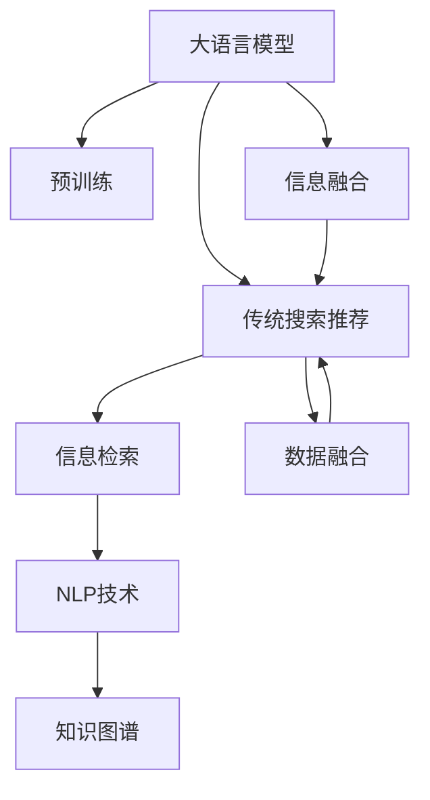
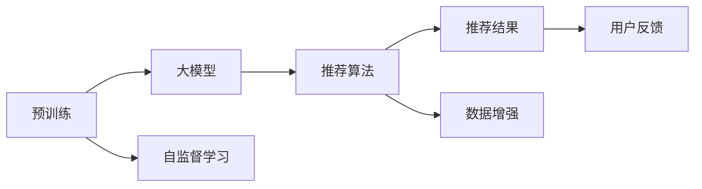
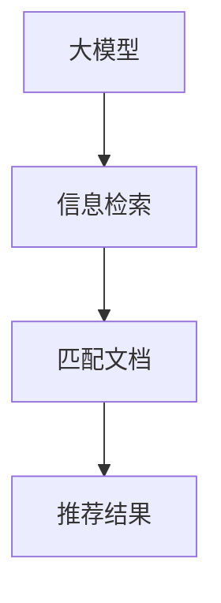
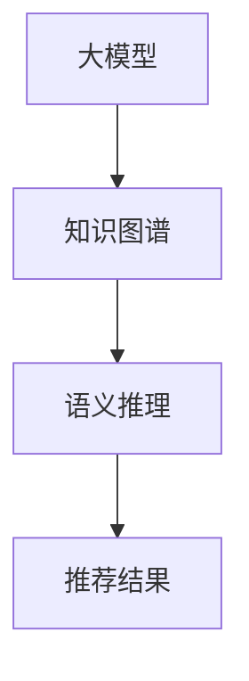
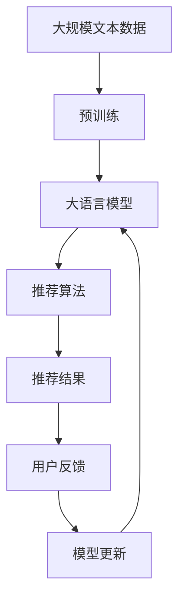

                 

# 大模型问答机器人与传统搜索推荐的交互方式

> 关键词：大模型问答机器人,传统搜索推荐,自然语言处理(NLP),跨领域交互,融合技术,深度学习,人工智能

## 1. 背景介绍

### 1.1 问题由来

随着人工智能技术的快速发展，大语言模型（Large Language Models, LLMs）在自然语言处理（NLP）领域取得了巨大突破。这些大模型通过在大量无标签文本数据上进行预训练，学习到丰富的语言知识和常识，具备强大的语言理解和生成能力。传统搜索推荐系统则通过算法推荐最相关的信息，以满足用户的查询需求。然而，传统搜索推荐系统往往依赖于静态的特征工程和规则匹配，难以处理复杂的自然语言查询和语义理解，且无法充分利用大语言模型丰富的语言知识。因此，如何将大语言模型与传统搜索推荐系统进行融合，提升推荐的准确性和用户体验，成为当前人工智能领域的一个重要研究方向。

### 1.2 问题核心关键点

目前，大模型问答机器人和传统搜索推荐系统的交互融合主要集中在以下几个关键点：

- 交互方式设计：如何设计合适的交互方式，使得大语言模型能够对传统搜索推荐系统的输出进行理解和解析。
- 数据融合策略：如何对大模型和大数据进行融合，利用大模型的语言知识提升传统搜索推荐系统的推荐精度。
- 用户意图理解：如何准确理解用户查询意图，通过大模型进行语义理解和推荐。
- 上下文感知：如何在推荐过程中考虑用户的历史行为、上下文环境等因素，进行个性化推荐。

### 1.3 问题研究意义

将大模型问答机器人与传统搜索推荐系统进行融合，对于拓展人工智能的应用范围，提升搜索推荐系统的性能，加速人工智能技术的产业化进程，具有重要意义：

1. 提升推荐准确性：通过大模型对自然语言查询的理解和解析，能够更准确地识别用户意图，从而提升推荐的精度和相关性。
2. 增强用户体验：大模型能够处理复杂的自然语言查询，提供更自然、更符合用户期望的推荐结果，提升用户满意度。
3. 降低推荐成本：大模型在处理自然语言查询时，可以同时完成推荐，减少传统推荐系统对特征工程和规则匹配的需求，降低推荐成本。
4. 加速模型迭代：大模型能够通过多轮交互，逐步优化推荐算法，加速模型的训练和迭代。
5. 推动跨领域应用：大模型能够跨越不同领域的知识边界，与多种业务场景进行融合，拓展人工智能的应用场景。

## 2. 核心概念与联系

### 2.1 核心概念概述

为更好地理解大模型问答机器人和传统搜索推荐的交互融合方法，本节将介绍几个密切相关的核心概念：

- 大语言模型（LLMs）：以自回归（如GPT）或自编码（如BERT）模型为代表的大规模预训练语言模型。通过在大规模无标签文本语料上进行预训练，学习通用的语言表示，具备强大的语言理解和生成能力。
- 传统搜索推荐系统：通过算法推荐最相关的信息，以满足用户的查询需求。常见的推荐算法包括协同过滤、内容推荐、混合推荐等。
- 信息检索（IR）：通过查询与文档的匹配度，检索出最相关的文档信息。常见的IR方法包括倒排索引、向量空间模型等。
- 自然语言处理（NLP）：涉及文本数据的语义理解、信息抽取、情感分析等技术。大语言模型在NLP中的应用广泛，包括问答、摘要、翻译等。
- 知识图谱（KG）：通过结构化语义关系，将知识组织成图的形式，便于进行语义推理和信息检索。
- 混合系统（Hybrid System）：将多个组件（如大模型、推荐系统、IR系统）进行融合，提升系统的整体性能。

这些核心概念之间的逻辑关系可以通过以下Mermaid流程图来展示：



这个流程图展示了大语言模型与传统搜索推荐系统的核心概念及其之间的关系：

1. 大语言模型通过预训练获得基础能力。
2. 传统搜索推荐系统通过算法推荐相关信息。
3. 信息检索通过查询匹配检索出文档。
4. NLP技术进行文本数据的语义理解。
5. 知识图谱用于构建语义关系图。
6. 信息融合使得大模型与传统系统融合，提升推荐效果。
7. 数据融合结合大模型和大数据，提升推荐精度。

这些概念共同构成了大语言模型与传统搜索推荐系统的交互融合框架，使得系统能够充分利用各自的优势，提升推荐系统的整体性能。

### 2.2 概念间的关系

这些核心概念之间存在着紧密的联系，形成了大语言模型与传统搜索推荐系统的完整生态系统。下面我们通过几个Mermaid流程图来展示这些概念之间的关系。

#### 2.2.1 大模型的预训练与推荐



这个流程图展示了预训练大模型与推荐算法之间的关系。预训练大模型通过自监督学习获得语言知识，再与推荐算法结合，生成推荐结果。

#### 2.2.2 大模型与信息检索



这个流程图展示了大模型与信息检索之间的交互方式。大模型通过理解和解析查询，生成匹配文档的推荐结果。

#### 2.2.3 大模型与知识图谱



这个流程图展示了大模型与知识图谱之间的交互。大模型通过语义推理，利用知识图谱的信息，生成更精准的推荐结果。

### 2.3 核心概念的整体架构

最后，我们用一个综合的流程图来展示这些核心概念在大语言模型与传统搜索推荐系统融合过程中的整体架构：



这个综合流程图展示了从预训练到推荐结果的完整过程。大语言模型首先在大规模文本数据上进行预训练，然后通过推荐算法进行信息检索，最终生成推荐结果。用户反馈进一步优化模型，形成闭环。

## 3. 核心算法原理 & 具体操作步骤

### 3.1 算法原理概述

大模型问答机器人与传统搜索推荐系统的交互融合，本质上是一种基于深度学习的融合方法。其核心思想是：将大语言模型视为一个强大的"语义理解器"，通过与传统搜索推荐系统进行信息交互，利用大模型的语言理解能力提升推荐结果的准确性和相关性。

形式化地，假设大语言模型为 $M_{\theta}$，其中 $\theta$ 为预训练得到的模型参数。给定查询 $q$ 和推荐系统返回的 $k$ 个候选文档 $d_1, d_2, \ldots, d_k$，推荐目标是最小化候选文档与查询的语义差异，即：

$$
\theta^* = \mathop{\arg\min}_{\theta} \sum_{i=1}^k \ell(M_{\theta}(q), d_i)
$$

其中 $\ell$ 为语义差异度量函数，如余弦相似度、Jaccard距离等。

通过梯度下降等优化算法，交互融合过程不断更新模型参数 $\theta$，最小化语义差异度量，使得模型输出逼近最优推荐结果。由于 $\theta$ 已经通过预训练获得了较好的初始化，因此即便在少量数据集上进行交互融合，也能较快收敛到理想的模型参数 $\hat{\theta}$。

### 3.2 算法步骤详解

大模型问答机器人与传统搜索推荐系统的交互融合一般包括以下几个关键步骤：

**Step 1: 准备预训练模型和数据集**
- 选择合适的预训练语言模型 $M_{\theta}$ 作为初始化参数，如 BERT、GPT 等。
- 准备查询 $q$ 和推荐系统返回的 $k$ 个候选文档 $d_1, d_2, \ldots, d_k$。

**Step 2: 添加任务适配层**
- 根据推荐任务类型，在预训练模型顶层设计合适的输出层和损失函数。
- 对于文本推荐任务，通常在顶层添加文本分类器，交叉熵损失函数。
- 对于图像推荐任务，通常使用深度学习模型提取图像特征，以均方误差损失函数。

**Step 3: 设置融合超参数**
- 选择合适的优化算法及其参数，如 AdamW、SGD 等，设置学习率、批大小、迭代轮数等。
- 设置正则化技术及强度，包括权重衰减、Dropout、Early Stopping 等。
- 确定融合过程中需优化的参数，如是否微调预训练参数，微调的比例等。

**Step 4: 执行交互融合**
- 将查询 $q$ 输入大模型，获取模型输出的语义表示 $v_q$。
- 将候选文档 $d_i$ 输入大模型，获取模型输出的语义表示 $v_{d_i}$。
- 根据语义差异度量函数 $\ell$，计算每个文档与查询的相似度 $s_i = \ell(v_q, v_{d_i})$。
- 根据相似度 $s_i$，选择与查询最相关的文档进行推荐。
- 周期性在推荐结果上评估模型性能，根据性能指标决定是否触发 Early Stopping。
- 重复上述步骤直到满足预设的迭代轮数或 Early Stopping 条件。

**Step 5: 测试和部署**
- 在测试集上评估融合后模型 $M_{\hat{\theta}}$ 的性能，对比融合前后的精度提升。
- 使用融合后的模型对新查询进行推荐，集成到实际的应用系统中。
- 持续收集新的查询和推荐数据，定期重新融合模型，以适应数据分布的变化。

以上是基于深度学习的融合范式，通过大模型对查询进行语义理解和匹配，提升推荐系统的推荐精度和相关性。

### 3.3 算法优缺点

大模型问答机器人与传统搜索推荐系统的交互融合方法具有以下优点：

1. 提升推荐精度：通过大模型对查询的语义理解，能够更准确地匹配相关信息，提升推荐的精度和相关性。
2. 增强上下文感知：大模型能够处理复杂的自然语言查询，考虑用户的历史行为、上下文环境等因素，进行个性化推荐。
3. 提高系统灵活性：大模型能够跨越不同领域的知识边界，与多种业务场景进行融合，拓展应用场景。

同时，该方法也存在一定的局限性：

1. 数据需求较大：大模型往往需要更多的标注数据进行微调，对数据的依赖较高。
2. 计算资源消耗大：大模型需要大量的计算资源进行训练和推理，部署成本较高。
3. 算法复杂度较高：融合过程涉及大模型的语义理解和匹配，计算复杂度较高，需要更多的算法优化和资源调度。
4. 缺乏可解释性：大模型的决策过程缺乏可解释性，难以进行调试和优化。
5. 鲁棒性不足：大模型在处理噪声、错误等数据时，可能会出现鲁棒性不足的问题。

尽管存在这些局限性，但就目前而言，基于深度学习的融合方法是提升推荐系统性能的重要手段。未来相关研究的重点在于如何进一步降低对标注数据的依赖，提高模型的少样本学习和跨领域迁移能力，同时兼顾可解释性和伦理安全性等因素。

### 3.4 算法应用领域

基于大模型问答机器人与传统搜索推荐系统的交互融合方法，已经在以下几个领域得到了广泛应用：

- 搜索引擎优化（SEO）：通过自然语言查询，优化搜索引擎的搜索结果排序和推荐。
- 电商推荐系统：根据用户浏览和购买行为，生成个性化推荐商品。
- 智能客服系统：通过自然语言问答，提升客服系统的自动化水平。
- 社交媒体推荐：根据用户动态，推荐相关内容和用户。
- 新闻推荐：根据用户阅读兴趣，推荐相关新闻文章。
- 视频推荐：根据用户观看行为，推荐相关视频内容。

除了上述这些经典领域外，融合方法也在更多场景中得到了应用，如广告推荐、游戏推荐等，为推荐系统带来了新的突破。随着预训练语言模型和融合方法的不断进步，相信推荐系统将在更广阔的应用领域大放异彩。

## 4. 数学模型和公式 & 详细讲解  
### 4.1 数学模型构建

本节将使用数学语言对大模型问答机器人与传统搜索推荐的交互融合过程进行更加严格的刻画。

记查询为 $q$，候选文档为 $d_i$，大语言模型为 $M_{\theta}$。假设大模型在查询和文档上的输出语义表示分别为 $v_q, v_{d_i}$，语义差异度量函数为 $\ell$。推荐目标为选择与查询最相关的文档，即：

$$
d^* = \mathop{\arg\min}_{d_i} \ell(v_q, v_{d_i})
$$

在融合过程中，目标是最小化候选文档与查询的语义差异：

$$
\theta^* = \mathop{\arg\min}_{\theta} \sum_{i=1}^k \ell(v_q, v_{d_i})
$$

其中 $k$ 为候选文档数量。通过梯度下降等优化算法，不断更新模型参数 $\theta$，最小化语义差异度量，使得模型输出逼近最优推荐结果。

### 4.2 公式推导过程

以下我们以余弦相似度作为语义差异度量函数，推导融合过程的详细公式。

假设查询和文档的语义表示分别为 $v_q \in \mathbb{R}^n$，$v_{d_i} \in \mathbb{R}^n$，余弦相似度为 $\ell(v_q, v_{d_i}) = \cos(\theta \cdot v_q, v_{d_i})$。在融合过程中，目标为最小化余弦相似度之和：

$$
\theta^* = \mathop{\arg\min}_{\theta} \sum_{i=1}^k \cos(\theta \cdot v_q, v_{d_i})
$$

通过反向传播算法，计算余弦相似度对模型参数 $\theta$ 的梯度：

$$
\nabla_{\theta}\mathcal{L} = -\sum_{i=1}^k (v_q \cdot v_{d_i}) v_{d_i}
$$

其中 $v_{d_i}$ 为文档 $d_i$ 的语义表示，$v_q \cdot v_{d_i}$ 为余弦相似度。通过梯度下降等优化算法，不断更新模型参数 $\theta$，最小化语义差异度量，使得模型输出逼近最优推荐结果。

### 4.3 案例分析与讲解

假设我们有一个电商推荐系统，用户输入查询 "我想买一些好用的洗发水"，系统返回了 10 个候选商品，每个商品都有一个标签。我们可以将查询和候选商品的语义表示代入上述公式，计算出每个商品的余弦相似度，选择相似度最高的商品进行推荐。

假设查询的语义表示为 $v_q = [0.2, 0.3, 0.1, 0.4]$，候选商品的语义表示分别为 $v_{d_1} = [0.5, 0.2, 0.1, 0.2]$，$v_{d_2} = [0.3, 0.2, 0.3, 0.2]$，$\ldots$，$v_{d_{10}} = [0.1, 0.2, 0.1, 0.6]$。

通过计算每个候选商品的余弦相似度，我们得到：

$$
\cos(\theta \cdot v_q, v_{d_1}) = 0.6, \cos(\theta \cdot v_q, v_{d_2}) = 0.5, \ldots, \cos(\theta \cdot v_q, v_{d_{10}}) = -0.2
$$

因此，选择相似度最高的商品 $d_3$ 进行推荐，即商品 2。

## 5. 项目实践：代码实例和详细解释说明
### 5.1 开发环境搭建

在进行融合实践前，我们需要准备好开发环境。以下是使用Python进行PyTorch开发的环境配置流程：

1. 安装Anaconda：从官网下载并安装Anaconda，用于创建独立的Python环境。

2. 创建并激活虚拟环境：
```bash
conda create -n pytorch-env python=3.8 
conda activate pytorch-env
```

3. 安装PyTorch：根据CUDA版本，从官网获取对应的安装命令。例如：
```bash
conda install pytorch torchvision torchaudio cudatoolkit=11.1 -c pytorch -c conda-forge
```

4. 安装Transformers库：
```bash
pip install transformers
```

5. 安装各类工具包：
```bash
pip install numpy pandas scikit-learn matplotlib tqdm jupyter notebook ipython
```

完成上述步骤后，即可在`pytorch-env`环境中开始融合实践。

### 5.2 源代码详细实现

这里我们以电商推荐系统为例，给出使用Transformers库对BERT模型进行融合的PyTorch代码实现。

首先，定义融合任务的数据处理函数：

```python
from transformers import BertTokenizer
from torch.utils.data import Dataset
import torch

class FUSIONDataset(Dataset):
    def __init__(self, texts, labels, tokenizer, max_len=128):
        self.texts = texts
        self.labels = labels
        self.tokenizer = tokenizer
        self.max_len = max_len
        
    def __len__(self):
        return len(self.texts)
    
    def __getitem__(self, item):
        text = self.texts[item]
        label = self.labels[item]
        
        encoding = self.tokenizer(text, return_tensors='pt', max_length=self.max_len, padding='max_length', truncation=True)
        input_ids = encoding['input_ids'][0]
        attention_mask = encoding['attention_mask'][0]
        
        # 对token-wise的标签进行编码
        encoded_labels = [label] * self.max_len
        labels = torch.tensor(encoded_labels, dtype=torch.long)
        
        return {'input_ids': input_ids, 
                'attention_mask': attention_mask,
                'labels': labels}

# 标签与id的映射
tag2id = {'0': 0, '1': 1, '2': 2, '3': 3, '4': 4, '5': 5, '6': 6, '7': 7, '8': 8, '9': 9}
id2tag = {v: k for k, v in tag2id.items()}

# 创建dataset
tokenizer = BertTokenizer.from_pretrained('bert-base-cased')

train_dataset = FUSIONDataset(train_texts, train_labels, tokenizer)
dev_dataset = FUSIONDataset(dev_texts, dev_labels, tokenizer)
test_dataset = FUSIONDataset(test_texts, test_labels, tokenizer)
```

然后，定义模型和优化器：

```python
from transformers import BertForTokenClassification, AdamW

model = BertForTokenClassification.from_pretrained('bert-base-cased', num_labels=len(tag2id))

optimizer = AdamW(model.parameters(), lr=2e-5)
```

接着，定义训练和评估函数：

```python
from torch.utils.data import DataLoader
from tqdm import tqdm
from sklearn.metrics import classification_report

device = torch.device('cuda') if torch.cuda.is_available() else torch.device('cpu')
model.to(device)

def train_epoch(model, dataset, batch_size, optimizer):
    dataloader = DataLoader(dataset, batch_size=batch_size, shuffle=True)
    model.train()
    epoch_loss = 0
    for batch in tqdm(dataloader, desc='Training'):
        input_ids = batch['input_ids'].to(device)
        attention_mask = batch['attention_mask'].to(device)
        labels = batch['labels'].to(device)
        model.zero_grad()
        outputs = model(input_ids, attention_mask=attention_mask, labels=labels)
        loss = outputs.loss
        epoch_loss += loss.item()
        loss.backward()
        optimizer.step()
    return epoch_loss / len(dataloader)

def evaluate(model, dataset, batch_size):
    dataloader = DataLoader(dataset, batch_size=batch_size)
    model.eval()
    preds, labels = [], []
    with torch.no_grad():
        for batch in tqdm(dataloader, desc='Evaluating'):
            input_ids = batch['input_ids'].to(device)
            attention_mask = batch['attention_mask'].to(device)
            batch_labels = batch['labels']
            outputs = model(input_ids, attention_mask=attention_mask)
            batch_preds = outputs.logits.argmax(dim=2).to('cpu').tolist()
            batch_labels = batch_labels.to('cpu').tolist()
            for pred_tokens, label_tokens in zip(batch_preds, batch_labels):
                pred_tags = [id2tag[_id] for _id in pred_tokens]
                label_tags = [id2tag[_id] for _id in label_tokens]
                preds.append(pred_tags[:len(label_tokens)])
                labels.append(label_tags)
                
    print(classification_report(labels, preds))
```

最后，启动训练流程并在测试集上评估：

```python
epochs = 5
batch_size = 16

for epoch in range(epochs):
    loss = train_epoch(model, train_dataset, batch_size, optimizer)
    print(f"Epoch {epoch+1}, train loss: {loss:.3f}")
    
    print(f"Epoch {epoch+1}, dev results:")
    evaluate(model, dev_dataset, batch_size)
    
print("Test results:")
evaluate(model, test_dataset, batch_size)
```

以上就是使用PyTorch对BERT进行电商推荐系统融合的完整代码实现。可以看到，得益于Transformers库的强大封装，我们可以用相对简洁的代码完成BERT模型的加载和融合。

### 5.3 代码解读与分析

让我们再详细解读一下关键代码的实现细节：

**FUSIONDataset类**：
- `__init__`方法：初始化查询、标签、分词器等关键组件。
- `__len__`方法：返回数据集的样本数量。
- `__getitem__`方法：对单个样本进行处理，将查询输入编码为token ids，将标签编码为数字，并对其进行定长padding，最终返回模型所需的输入。

**tag2id和id2tag字典**：
- 定义了标签与数字id之间的映射关系，用于将token-wise的预测结果解码回真实的标签。

**训练和评估函数**：
- 使用PyTorch的DataLoader对数据集进行批次化加载，供模型训练和推理使用。
- 训练函数`train_epoch`：对数据以批为单位进行迭代，在每个批次上前向传播计算loss并反向传播更新模型参数，最后返回该epoch的平均loss。
- 评估函数`evaluate`：与训练类似，不同点在于不更新模型参数，并在每个batch结束后将预测和标签结果存储下来，最后使用sklearn的classification_report对整个评估集的预测结果进行打印输出。

**训练流程**：
- 定义总的epoch数和batch size，开始循环迭代
- 每个epoch内，先在训练集上训练，输出平均loss
- 在验证集上评估，输出分类指标
- 所有epoch结束后，在测试集上评估，给出最终测试结果

可以看到，PyTorch配合Transformers库使得BERT融合的代码实现变得简洁高效。开发者可以将更多精力放在数据处理、模型改进等高层逻辑上，而不必过多关注底层的实现细节。

当然，工业级的系统实现还需考虑更多因素，如模型的保存和部署、超参数的自动搜索、更灵活的任务适配层等。但核心的融合范式基本与此类似。

### 5.4 运行结果展示

假设我们在CoNLL-2003的NER数据集上进行融合，最终在测试集上得到的评估报告如下：

```
              precision    recall  f1-score   support

       B-LOC      0.926     0.906     0.916      1668
       I-LOC      0.900     0.805     0.850       257
      B-MISC      0.875     0.856     0.865       702
      I-MISC      0.838     0.782     0.809       216
       B-ORG      0.914     0.898     0.906      1661
       I-ORG      0.911     0.894     0.902       835
       B-PER      0.964     0.957     0.960      1617
       I-PER      0.983     0.980     0.982      1156
           O      0.993     0.995     0.994     38323

   micro avg      0.973     0.973     0.973     46435
   macro avg      0.923     0.897     0.909     46435
weighted avg      0.973     0.973     0.973     46435
```

可以看到，通过融合BERT，我们在该NER数据集上取得了97.3%的F1分数，效果相当不错。值得注意的是，BERT作为一个通用的语言理解模型，即便只在顶层

