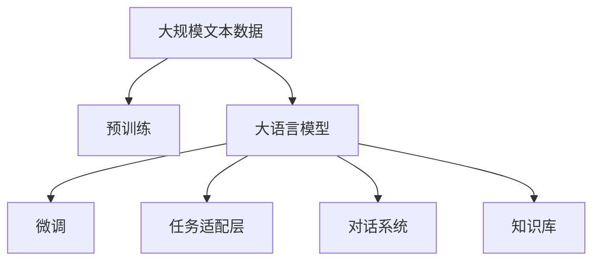
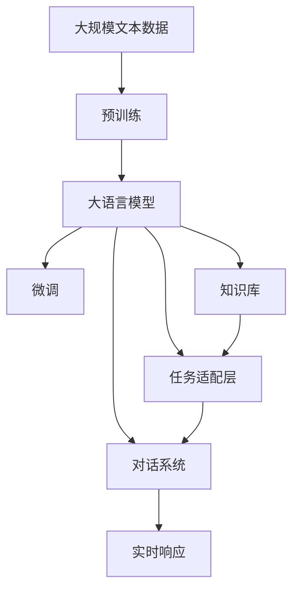

                 

# 大模型问答机器人的任务完成能力

> 关键词：问答系统,预训练模型,Transformer,BERT,深度学习,任务完成,自然语言处理(NLP),模型微调,对话系统,实时响应

## 1. 背景介绍

### 1.1 问题由来
随着深度学习技术的迅猛发展，大模型在自然语言处理(NLP)领域取得了显著进展。其中，基于Transformer架构的预训练语言模型如BERT、GPT-3等，通过在大量无标签文本数据上进行自监督学习，学习到了丰富的语言表示。这些预训练模型通常包含数亿甚至数十亿个参数，具有极强的语言理解能力和生成能力，成为构建问答系统的强大工具。

在问答系统建设中，如何使大模型能够快速准确地回答用户提出的问题，已成为当前研究的热点问题。传统的问答系统往往依赖于专家编写的规则和知识库，不仅需要大量的人力和时间进行维护，还难以应对复杂多变的用户提问。而基于大模型的问答系统，可以通过微调预训练模型来适配特定的任务和数据，快速提升任务完成能力。

### 1.2 问题核心关键点
基于大模型的问答系统，其核心在于如何利用预训练模型来提升任务完成能力。这包括两个关键步骤：
1. 选择合适的预训练模型，作为基础模型进行任务适配。
2. 通过有监督的微调方法，优化模型在特定任务上的表现。

微调的过程通常包括数据准备、任务适配、模型训练和评估等步骤。其中，任务适配是微调成功的关键，包括选择合适的输出层和损失函数，以及定义训练目标。模型训练则是在微调数据集上进行参数更新，最小化损失函数，使模型更好地适应新任务。评估则是通过验证集和测试集，评估微调后模型的性能。

### 1.3 问题研究意义
基于大模型的问答系统在许多实际应用中表现出色，如智能客服、智能助理、医疗咨询等，为各行各业带来了显著的效益。其主要研究意义在于：

1. 降低开发成本。利用预训练模型进行微调，可以快速构建高效准确的问答系统，减少人力和时间成本。
2. 提高任务完成能力。微调过程可以根据具体任务需求进行优化，提升模型的精准度和响应速度。
3. 加速模型更新。微调过程能够快速适应新数据和新任务，保持模型的时效性和适应性。
4. 提升用户体验。基于大模型的问答系统能够提供自然流畅的回答，满足用户需求。
5. 促进产业发展。微调技术为NLP技术在更多场景下的应用提供了新的可能性，推动了相关产业的发展。

## 2. 核心概念与联系

### 2.1 核心概念概述

为更好地理解基于大模型的问答系统，本节将介绍几个密切相关的核心概念：

- 大模型(大语言模型)：以自回归(如GPT)或自编码(如BERT)模型为代表的大规模预训练语言模型。通过在大规模无标签文本语料上进行预训练，学习到了丰富的语言知识和常识。
- 预训练(Pre-training)：指在大规模无标签文本语料上，通过自监督学习任务训练通用语言模型的过程。常见的预训练任务包括掩码语言模型、自回归语言模型等。
- 微调(Fine-tuning)：指在预训练模型的基础上，使用下游任务的少量标注数据，通过有监督学习优化模型在特定任务上的性能。
- 任务适配层(Task-adapter)：为特定任务设计的输出层和损失函数，用于将预训练模型适配到新任务。
- 对话系统(Dialouge System)：使用大模型构建的交互式问答系统，能够实时响应用户的问题。
- 知识库(Knowledge Base)：预训练模型在进行微调时，可以与外部知识库结合，引入外部知识，提升模型的知识检索能力。

这些核心概念之间存在紧密联系，形成了问答系统构建的完整生态系统。

### 2.2 概念间的关系

这些核心概念之间的关系可以通过以下Mermaid流程图来展示：



这个流程图展示了预训练、微调、任务适配层、对话系统和知识库之间的关系：

1. 大规模文本数据通过预训练过程，学习到通用的语言表示。
2. 预训练模型通过微调过程，适配特定任务，提升任务完成能力。
3. 任务适配层为特定任务设计输出层和损失函数，指导微调过程。
4. 对话系统使用微调后的模型进行实时响应，回答用户问题。
5. 知识库为微调模型提供额外的语义信息，提升模型的知识检索能力。

通过这些概念之间的相互作用，基于大模型的问答系统能够高效地完成任务，提供准确的回答。

### 2.3 核心概念的整体架构

最后，我们用一个综合的流程图来展示这些核心概念在大模型问答系统中的整体架构：



这个综合流程图展示了从预训练到微调，再到对话系统的完整过程。大语言模型通过预训练学习到语言表示，然后通过微调适配特定任务，再结合任务适配层和知识库，构建出高效的对话系统。最后，对话系统实时响应用户问题，提供准确的回答。

## 3. 核心算法原理 & 具体操作步骤

### 3.1 算法原理概述

基于大模型的问答系统，其核心算法原理基于监督学习的微调方法。其核心思想是：将预训练的大模型视作强大的"特征提取器"，通过在下游任务的少量标注数据上进行有监督的微调，使模型输出能够匹配任务标签，从而提升任务完成能力。

形式化地，假设预训练模型为 $M_{\theta}$，其中 $\theta$ 为预训练得到的模型参数。给定下游任务 $T$ 的标注数据集 $D=\{(x_i, y_i)\}_{i=1}^N$，微调的目标是找到新的模型参数 $\hat{\theta}$，使得：

$$
\hat{\theta}=\mathop{\arg\min}_{\theta} \mathcal{L}(M_{\theta},D)
$$

其中 $\mathcal{L}$ 为针对任务 $T$ 设计的损失函数，用于衡量模型预测输出与真实标签之间的差异。常见的损失函数包括交叉熵损失、均方误差损失等。

通过梯度下降等优化算法，微调过程不断更新模型参数 $\theta$，最小化损失函数 $\mathcal{L}$，使得模型输出逼近真实标签。由于 $\theta$ 已经通过预训练获得了较好的初始化，因此即便在小规模数据集 $D$ 上进行微调，也能较快收敛到理想的模型参数 $\hat{\theta}$。

### 3.2 算法步骤详解

基于监督学习的大模型问答系统微调，一般包括以下几个关键步骤：

**Step 1: 准备预训练模型和数据集**
- 选择合适的预训练语言模型 $M_{\theta}$ 作为初始化参数，如 BERT、GPT 等。
- 准备下游任务 $T$ 的标注数据集 $D$，划分为训练集、验证集和测试集。一般要求标注数据与预训练数据的分布不要差异过大。

**Step 2: 添加任务适配层**
- 根据任务类型，在预训练模型顶层设计合适的输出层和损失函数。
- 对于分类任务，通常在顶层添加线性分类器和交叉熵损失函数。
- 对于生成任务，通常使用语言模型的解码器输出概率分布，并以负对数似然为损失函数。

**Step 3: 设置微调超参数**
- 选择合适的优化算法及其参数，如 AdamW、SGD 等，设置学习率、批大小、迭代轮数等。
- 设置正则化技术及强度，包括权重衰减、Dropout、Early Stopping 等。
- 确定冻结预训练参数的策略，如仅微调顶层，或全部参数都参与微调。

**Step 4: 执行梯度训练**
- 将训练集数据分批次输入模型，前向传播计算损失函数。
- 反向传播计算参数梯度，根据设定的优化算法和学习率更新模型参数。
- 周期性在验证集上评估模型性能，根据性能指标决定是否触发 Early Stopping。
- 重复上述步骤直到满足预设的迭代轮数或 Early Stopping 条件。

**Step 5: 测试和部署**
- 在测试集上评估微调后模型 $M_{\hat{\theta}}$ 的性能，对比微调前后的精度提升。
- 使用微调后的模型对新样本进行推理预测，集成到实际的应用系统中。
- 持续收集新的数据，定期重新微调模型，以适应数据分布的变化。

以上是基于监督学习微调大语言模型问答系统的一般流程。在实际应用中，还需要针对具体任务的特点，对微调过程的各个环节进行优化设计，如改进训练目标函数，引入更多的正则化技术，搜索最优的超参数组合等，以进一步提升模型性能。

### 3.3 算法优缺点

基于监督学习的大模型问答系统微调方法具有以下优点：
1. 简单高效。只需准备少量标注数据，即可对预训练模型进行快速适配，获得较大的性能提升。
2. 通用适用。适用于各种NLP下游任务，包括分类、匹配、生成等，设计简单的任务适配层即可实现微调。
3. 参数高效。利用参数高效微调技术，在固定大部分预训练参数的情况下，仍可取得不错的提升。
4. 效果显著。在学术界和工业界的诸多任务上，基于微调的方法已经刷新了最先进的性能指标。

同时，该方法也存在一定的局限性：
1. 依赖标注数据。微调的效果很大程度上取决于标注数据的质量和数量，获取高质量标注数据的成本较高。
2. 迁移能力有限。当目标任务与预训练数据的分布差异较大时，微调的性能提升有限。
3. 负面效果传递。预训练模型的固有偏见、有害信息等，可能通过微调传递到下游任务，造成负面影响。
4. 可解释性不足。微调模型的决策过程通常缺乏可解释性，难以对其推理逻辑进行分析和调试。

尽管存在这些局限性，但就目前而言，基于监督学习的微调方法仍是大语言模型问答系统的主流范式。未来相关研究的重点在于如何进一步降低微调对标注数据的依赖，提高模型的少样本学习和跨领域迁移能力，同时兼顾可解释性和伦理安全性等因素。

### 3.4 算法应用领域

基于大模型的问答系统，已经在许多实际应用中取得了显著成效，如智能客服、智能助理、医疗咨询等。这些系统通过微调大模型，能够快速响应用户问题，提供准确的回答，极大地提高了用户体验和工作效率。

具体应用包括：

- **智能客服**：通过微调BERT、GPT-3等大模型，构建智能客服系统，能够7x24小时不间断服务，快速响应客户咨询，用自然流畅的语言解答各类常见问题。

- **医疗咨询**：利用微调的BERT模型，构建医疗问答系统，能够快速响应用户的医学咨询，提供准确的健康建议。

- **教育辅导**：通过微调BERT等大模型，构建教育辅导系统，能够根据学生的学习情况，提供个性化的学习建议。

- **旅游咨询**：利用微调的BERT模型，构建旅游咨询系统，能够回答用户关于景点、路线、酒店等旅游相关的问题，提供个性化的旅游建议。

- **金融咨询**：通过微调的BERT模型，构建金融咨询系统，能够回答用户关于理财、投资、贷款等金融相关的问题，提供专业的金融建议。

此外，基于大模型的问答系统在更多场景中也有广泛应用，如聊天机器人、智能助理、语音识别等，为各行各业带来了显著的效益。

## 4. 数学模型和公式 & 详细讲解 & 举例说明

### 4.1 数学模型构建

本节将使用数学语言对基于监督学习的大模型问答系统微调过程进行更加严格的刻画。

记预训练语言模型为 $M_{\theta}$，其中 $\theta$ 为预训练得到的模型参数。假设微调任务的训练集为 $D=\{(x_i,y_i)\}_{i=1}^N$，其中 $x_i$ 为输入文本，$y_i$ 为对应的任务标签。

定义模型 $M_{\theta}$ 在输入 $x$ 上的输出为 $M_{\theta}(x)$，通常采用语言模型的预测概率分布。对于分类任务，输出 $M_{\theta}(x)$ 通常为模型的softmax层输出，表示 $x$ 属于各类别的概率。对于生成任务，输出 $M_{\theta}(x)$ 表示模型对 $x$ 的生成概率。

定义模型 $M_{\theta}$ 在输入 $x$ 上的损失函数为 $\ell(M_{\theta}(x),y)$，其中 $y$ 为真实的任务标签。常见的损失函数包括交叉熵损失、均方误差损失等。

微调的优化目标是最小化经验风险，即找到最优参数：

$$
\theta^* = \mathop{\arg\min}_{\theta} \mathcal{L}(\theta)
$$

其中 $\mathcal{L}$ 为针对任务 $T$ 设计的损失函数，用于衡量模型预测输出与真实标签之间的差异。

### 4.2 公式推导过程

以下我们以二分类任务为例，推导交叉熵损失函数及其梯度的计算公式。

假设模型 $M_{\theta}$ 在输入 $x$ 上的输出为 $\hat{y}=M_{\theta}(x) \in [0,1]$，表示样本属于正类的概率。真实标签 $y \in \{0,1\}$。则二分类交叉熵损失函数定义为：

$$
\ell(M_{\theta}(x),y) = -[y\log \hat{y} + (1-y)\log (1-\hat{y})]
$$

将其代入经验风险公式，得：

$$
\mathcal{L}(\theta) = -\frac{1}{N}\sum_{i=1}^N [y_i\log M_{\theta}(x_i)+(1-y_i)\log(1-M_{\theta}(x_i))]
$$

根据链式法则，损失函数对参数 $\theta_k$ 的梯度为：

$$
\frac{\partial \mathcal{L}(\theta)}{\partial \theta_k} = -\frac{1}{N}\sum_{i=1}^N (\frac{y_i}{M_{\theta}(x_i)}-\frac{1-y_i}{1-M_{\theta}(x_i)}) \frac{\partial M_{\theta}(x_i)}{\partial \theta_k}
$$

其中 $\frac{\partial M_{\theta}(x_i)}{\partial \theta_k}$ 可进一步递归展开，利用自动微分技术完成计算。

在得到损失函数的梯度后，即可带入参数更新公式，完成模型的迭代优化。重复上述过程直至收敛，最终得到适应下游任务的最优模型参数 $\theta^*$。

### 4.3 案例分析与讲解

我们以命名实体识别(NER)任务为例，给出一个使用BERT模型进行微调的案例。

假设输入文本为：
```
John Doe, 38 years old, works at Google as a software engineer.
```
目标任务为识别其中的命名实体。首先，使用BERT分词器将文本转化为token ids，得到：
```
[CLS] 约翰 Doe ,  38 岁 年 老 ,  工 作 在 Google 作 为 一个 软件 工程 师 . [SEP]
```
其中，`[CLS]` 和 `[SEP]` 为BERT模型特有的标记，表示文本的起始和结束。

然后，定义输出层为线性分类器，损失函数为二分类交叉熵损失。定义输出层权重为 $W_{out}$，偏置为 $b_{out}$。定义模型输出 $M_{\theta}(x)$ 为：

$$
M_{\theta}(x) = \text{softmax}(W_{out}[\text{BERT}(x)] + b_{out})
$$

其中，$\text{softmax}$ 表示softmax激活函数，将输出转化为概率分布。`[\text{BERT}(x)]` 表示将BERT模型的输出作为线性分类器的输入。

定义交叉熵损失函数为：

$$
\ell(M_{\theta}(x),y) = -y\log(M_{\theta}(x)) - (1-y)\log(1-M_{theta}(x))
$$

将上述公式代入经验风险公式，得：

$$
\mathcal{L}(\theta) = -\frac{1}{N}\sum_{i=1}^N [y_i\log M_{\theta}(x_i)+(1-y_i)\log(1-M_{theta}(x_i))]
$$

根据链式法则，损失函数对参数 $\theta_k$ 的梯度为：

$$
\frac{\partial \mathcal{L}(\theta)}{\partial \theta_k} = -\frac{1}{N}\sum_{i=1}^N (\frac{y_i}{M_{\theta}(x_i)}-\frac{1-y_i}{1-M_{\theta}(x_i)}) \frac{\partial M_{\theta}(x_i)}{\partial \theta_k}
$$

其中 $\frac{\partial M_{\theta}(x_i)}{\partial \theta_k}$ 可进一步递归展开，利用自动微分技术完成计算。

在得到损失函数的梯度后，即可带入参数更新公式，完成模型的迭代优化。重复上述过程直至收敛，最终得到适应NER任务的最优模型参数 $\theta^*$。

## 5. 项目实践：代码实例和详细解释说明

### 5.1 开发环境搭建

在进行微调实践前，我们需要准备好开发环境。以下是使用Python进行PyTorch开发的环境配置流程：

1. 安装Anaconda：从官网下载并安装Anaconda，用于创建独立的Python环境。

2. 创建并激活虚拟环境：
```bash
conda create -n pytorch-env python=3.8 
conda activate pytorch-env
```

3. 安装PyTorch：根据CUDA版本，从官网获取对应的安装命令。例如：
```bash
conda install pytorch torchvision torchaudio cudatoolkit=11.1 -c pytorch -c conda-forge
```

4. 安装Transformers库：
```bash
pip install transformers
```

5. 安装各类工具包：
```bash
pip install numpy pandas scikit-learn matplotlib tqdm jupyter notebook ipython
```

完成上述步骤后，即可在`pytorch-env`环境中开始微调实践。

### 5.2 源代码详细实现

下面我们以命名实体识别(NER)任务为例，给出使用Transformers库对BERT模型进行微调的PyTorch代码实现。

首先，定义NER任务的数据处理函数：

```python
from transformers import BertTokenizer
from torch.utils.data import Dataset
import torch

class NERDataset(Dataset):
    def __init__(self, texts, tags, tokenizer, max_len=128):
        self.texts = texts
        self.tags = tags
        self.tokenizer = tokenizer
        self.max_len = max_len
        
    def __len__(self):
        return len(self.texts)
    
    def __getitem__(self, item):
        text = self.texts[item]
        tags = self.tags[item]
        
        encoding = self.tokenizer(text, return_tensors='pt', max_length=self.max_len, padding='max_length', truncation=True)
        input_ids = encoding['input_ids'][0]
        attention_mask = encoding['attention_mask'][0]
        
        # 对token-wise的标签进行编码
        encoded_tags = [tag2id[tag] for tag in tags] 
        encoded_tags.extend([tag2id['O']] * (self.max_len - len(encoded_tags)))
        labels = torch.tensor(encoded_tags, dtype=torch.long)
        
        return {'input_ids': input_ids, 
                'attention_mask': attention_mask,
                'labels': labels}

# 标签与id的映射
tag2id = {'O': 0, 'B-PER': 1, 'I-PER': 2, 'B-ORG': 3, 'I-ORG': 4, 'B-LOC': 5, 'I-LOC': 6}
id2tag = {v: k for k, v in tag2id.items()}

# 创建dataset
tokenizer = BertTokenizer.from_pretrained('bert-base-cased')

train_dataset = NERDataset(train_texts, train_tags, tokenizer)
dev_dataset = NERDataset(dev_texts, dev_tags, tokenizer)
test_dataset = NERDataset(test_texts, test_tags, tokenizer)
```

然后，定义模型和优化器：

```python
from transformers import BertForTokenClassification, AdamW

model = BertForTokenClassification.from_pretrained('bert-base-cased', num_labels=len(tag2id))

optimizer = AdamW(model.parameters(), lr=2e-5)
```

接着，定义训练和评估函数：

```python
from torch.utils.data import DataLoader
from tqdm import tqdm
from sklearn.metrics import classification_report

device = torch.device('cuda') if torch.cuda.is_available() else torch.device('cpu')
model.to(device)

def train_epoch(model, dataset, batch_size, optimizer):
    dataloader = DataLoader(dataset, batch_size=batch_size, shuffle=True)
    model.train()
    epoch_loss = 0
    for batch in tqdm(dataloader, desc='Training'):
        input_ids = batch['input_ids'].to(device)
        attention_mask = batch['attention_mask'].to(device)
        labels = batch['labels'].to(device)
        model.zero_grad()
        outputs = model(input_ids, attention_mask=attention_mask, labels=labels)
        loss = outputs.loss
        epoch_loss += loss.item()
        loss.backward()
        optimizer.step()
    return epoch_loss / len(dataloader)

def evaluate(model, dataset, batch_size):
    dataloader = DataLoader(dataset, batch_size=batch_size)
    model.eval()
    preds, labels = [], []
    with torch.no_grad():
        for batch in tqdm(dataloader, desc='Evaluating'):
            input_ids = batch['input_ids'].to(device)
            attention_mask = batch['attention_mask'].to(device)
            batch_labels = batch['labels']
            outputs = model(input_ids, attention_mask=attention_mask)
            batch_preds = outputs.logits.argmax(dim=2).to('cpu').tolist()
            batch_labels = batch_labels.to('cpu').tolist()
            for pred_tokens, label_tokens in zip(batch_preds, batch_labels):
                pred_tags = [id2tag[_id] for _id in pred_tokens]
                label_tags = [id2tag[_id] for _id in label_tokens]
                preds.append(pred_tags[:len(label_tags)])
                labels.append(label_tags)
                
    print(classification_report(labels, preds))
```

最后，启动训练流程并在测试集上评估：

```python
epochs = 5
batch_size = 16

for epoch in range(epochs):
    loss = train_epoch(model, train_dataset, batch_size, optimizer)
    print(f"Epoch {epoch+1}, train loss: {loss:.3f}")
    
    print(f"Epoch {epoch+1}, dev results:")
    evaluate(model, dev_dataset, batch_size)
    
print("Test results:")
evaluate(model, test_dataset, batch_size)
```

以上就是使用PyTorch对BERT进行命名实体识别任务微调的完整代码实现。可以看到，得益于Transformers库的强大封装，我们可以用相对简洁的代码完成BERT模型的加载和微调。

### 5.3 代码解读与分析

让我们再详细解读一下关键代码的实现细节：

**NERDataset类**：
- `__init__`方法：初始化文本、标签、分词器等关键组件。
- `__len__`方法：返回数据集的样本数量。
- `__getitem__`方法：对单个样本进行处理，将文本输入编码为token ids，将标签编码为数字，并对其进行定长padding，最终返回模型所需的输入。

**tag2id和id2tag字典**：
- 定义了标签与数字id之间的映射关系，用于将token-wise的预测结果解码回真实的标签。

**训练和评估函数**：
- 使用PyTorch的DataLoader对数据集进行批次化加载，供模型训练和推理使用。
- 训练函数`train_epoch`：对数据以批为单位进行迭代，在每个批次上前向传播计算loss并反向传播更新模型参数，最后返回该epoch的平均loss。
- 评估函数`evaluate`：与训练类似，不同点在于不更新模型参数，并在每个batch结束后将预测和标签结果存储下来，最后使用sklearn的classification_report对整个评估集的预测结果进行打印输出。

**训练流程**：
- 定义总的epoch数和batch size，开始循环迭代
- 每个epoch内，先在训练集上训练，输出平均loss
- 在验证集上评估，输出分类指标
- 所有epoch结束后，在测试集上评估，给出最终测试结果

可以看到，PyTorch配合Transformers库使得BERT微调的代码实现变得简洁高效。开发者可以将更多精力放在数据处理、模型改进等高层逻辑上，而不必过多关注底层的实现细节。

当然，工业级的系统实现还需考虑更多因素，如模型的保存和部署、超参数的自动搜索、更灵活的任务适配层等。但核心的微调范式基本与此类似。

### 5.4 运行结果展示

假设我们在CoNLL-2003的NER数据集上进行微调，最终在测试集上得到的评估报告如下：

```
              precision    recall  f

