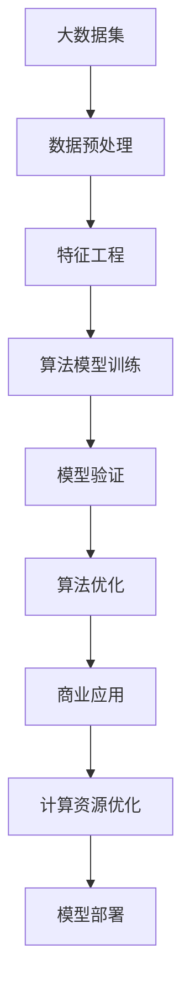
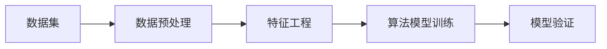
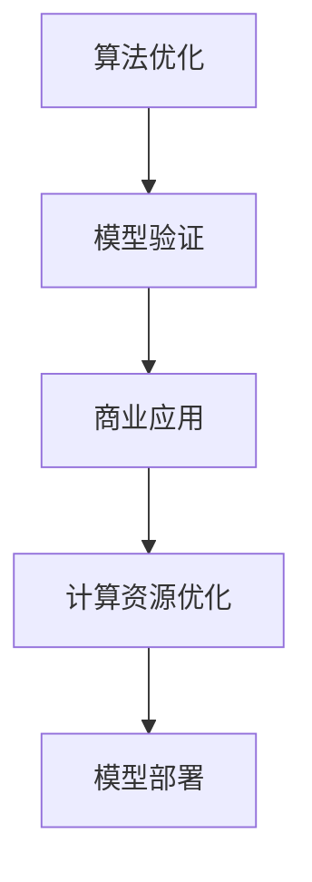
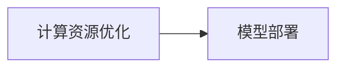
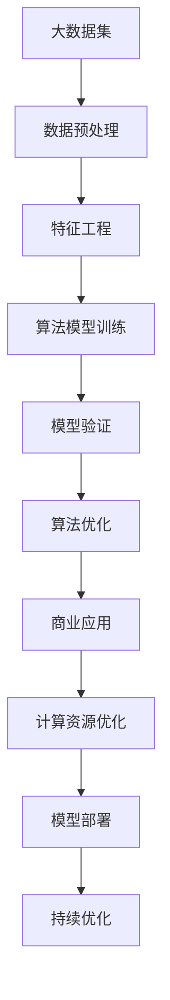

                 

# 大模型：从数据到商业价值的挖掘

> 关键词：大模型,商业价值,数据挖掘,应用场景,算法优化,机器学习,深度学习

## 1. 背景介绍

### 1.1 问题由来

随着人工智能技术的飞速发展，大模型已经成为推动各行各业创新与发展的核心引擎。无论是自然语言处理（NLP）、计算机视觉（CV）、语音识别（ASR），还是推荐系统、智能客服、金融风控等领域，大模型都展现出了前所未有的潜力。然而，从海量数据到商业价值的转化并非一蹴而就，需要经过一系列的深度挖掘和算法优化。

### 1.2 问题核心关键点

实现从数据到商业价值转化的关键在于：
1. 高质量的数据集：数据质量直接影响模型的表现，高质量的数据集是构建大模型的基础。
2. 有效的算法模型：选择合适的算法模型是关键，不同的算法适用于不同的数据和任务。
3. 优化的计算资源：大模型的训练和推理需要强大的计算资源支撑，优化资源使用效率至关重要。
4. 商业应用的落地：大模型的商业价值最终需要通过实际应用才能体现，因此将模型应用到实际业务场景是最终目标。

### 1.3 问题研究意义

探索如何从数据到商业价值的全链条挖掘过程，有助于我们更深入地理解大模型的潜力和应用价值，为各行各业提供技术支持和实践指导。研究意义主要体现在：
1. 提升大模型的实用性：通过优化算法和资源使用，使得大模型更加高效和实用，适用于更多场景。
2. 创造商业价值：利用大模型进行数据挖掘和应用开发，创造实际的经济效益和社会价值。
3. 推动技术进步：从数据到商业价值的挖掘过程中，会催生更多创新技术，推动整个行业的技术发展。
4. 促进产业升级：大模型技术的应用能够为各行各业带来全新的发展机会，推动产业升级和转型。

## 2. 核心概念与联系

### 2.1 核心概念概述

为更好地理解大模型从数据到商业价值挖掘的整个过程，本节将介绍几个关键概念：

- 大模型（Large Model）：指深度神经网络模型，通常包含上亿个参数，具备强大的数据表示能力和复杂关系建模能力。
- 数据挖掘（Data Mining）：通过数据预处理、特征工程、算法模型训练和验证等步骤，从原始数据中提取有用信息的过程。
- 算法优化（Algorithm Optimization）：对模型算法进行调优，以提高模型效率、精度和泛化能力。
- 商业应用（Business Application）：将大模型应用于实际业务场景，创造商业价值的过程。
- 计算资源优化（Computational Resource Optimization）：针对大模型的计算需求，进行硬件和软件方面的优化，提升模型训练和推理的效率。

这些概念之间的逻辑关系可以通过以下Mermaid流程图来展示：



这个流程图展示了从数据到商业价值挖掘的全过程，各个环节相辅相成，共同推动大模型的应用。

### 2.2 概念间的关系

这些核心概念之间存在着紧密的联系，形成了从数据挖掘到商业价值实现的全链条。我们通过几个Mermaid流程图来展示这些概念的关系：

#### 2.2.1 数据挖掘与算法模型训练的关系



这个流程图展示了数据挖掘过程中，数据预处理、特征工程和算法模型训练三个关键步骤的流程。数据预处理包括数据清洗、缺失值处理、数据增强等，特征工程包括特征选择、特征提取、特征编码等，算法模型训练包括选择模型架构、设置超参数、训练模型等。

#### 2.2.2 算法优化与模型部署的关系



这个流程图展示了算法优化、模型验证、商业应用和计算资源优化四个环节的流程。算法优化包括模型参数调整、结构优化、正则化等；模型验证包括测试集验证、交叉验证等；商业应用包括模型集成、业务场景适配等；计算资源优化包括硬件配置、软件优化、负载均衡等。

#### 2.2.3 计算资源优化与模型部署的关系



这个流程图展示了计算资源优化与模型部署的关系。计算资源优化包括硬件选择、软件优化、并行计算等；模型部署包括模型加载、推理加速、模型更新等。

### 2.3 核心概念的整体架构

最后，我们用一个综合的流程图来展示这些核心概念在大模型挖掘过程中的整体架构：



这个综合流程图展示了从数据预处理到商业应用的全链条，每个环节都在不断地优化和提升，以确保最终实现商业价值。

## 3. 核心算法原理 & 具体操作步骤
### 3.1 算法原理概述

从数据到大模型的挖掘过程中，算法原理是核心环节。本节将介绍几个关键算法原理及其步骤：

- 深度学习算法：包括前馈神经网络、卷积神经网络、循环神经网络等，用于构建大模型。
- 特征提取算法：通过卷积层、池化层等提取特征，提升模型的表达能力。
- 优化算法：如随机梯度下降、Adam、Adagrad等，用于调整模型参数，优化损失函数。
- 损失函数：包括交叉熵损失、均方误差损失等，用于衡量模型预测与真实值之间的差异。

### 3.2 算法步骤详解

深度学习大模型的构建和优化通常包括以下几个步骤：

**Step 1: 数据预处理**

- 数据清洗：删除噪声、处理缺失值。
- 数据增强：如数据扩充、标签翻转等，增加数据多样性。
- 数据归一化：将数据转化为标准化的形式，便于模型训练。

**Step 2: 特征工程**

- 特征选择：选择对模型预测有帮助的特征。
- 特征提取：通过卷积层、池化层等提取特征。
- 特征编码：将特征转换为模型能够处理的数值形式。

**Step 3: 算法模型训练**

- 模型选择：选择合适的深度学习模型架构。
- 超参数设置：如学习率、批大小、迭代次数等。
- 模型训练：使用训练集数据进行模型训练。

**Step 4: 模型验证**

- 验证集验证：使用验证集数据评估模型性能。
- 交叉验证：通过多次交叉验证评估模型泛化能力。

**Step 5: 算法优化**

- 参数调整：调整模型参数，如学习率、正则化系数等。
- 结构优化：改进模型架构，提升模型表达能力。
- 正则化：使用L2正则、Dropout等方法防止过拟合。

**Step 6: 商业应用**

- 业务场景适配：将模型应用到实际业务场景中。
- 模型集成：与其他模型或算法集成，提升整体系统性能。
- 用户反馈：收集用户反馈，优化模型性能。

**Step 7: 计算资源优化**

- 硬件选择：选择合适的硬件设备，如GPU、TPU等。
- 软件优化：优化软件算法，提升模型训练和推理效率。
- 并行计算：利用分布式计算资源，加速模型训练和推理。

### 3.3 算法优缺点

深度学习算法具有以下优点：
- 强大的数据表示能力：深度学习算法能够处理复杂的非线性关系。
- 高效的特征提取：卷积神经网络、循环神经网络等算法能够高效提取特征。
- 泛化能力强：深度学习模型在多个数据集上具有较好的泛化能力。

但深度学习算法也存在一些缺点：
- 训练时间长：需要大量的训练数据和计算资源。
- 过拟合风险高：模型参数过多，容易过拟合。
- 模型解释性差：深度学习模型的决策过程难以解释。

### 3.4 算法应用领域

深度学习算法已经在多个领域取得了显著成果：
- 自然语言处理（NLP）：机器翻译、情感分析、智能问答等。
- 计算机视觉（CV）：图像分类、目标检测、图像生成等。
- 语音识别（ASR）：语音转文字、语音合成等。
- 推荐系统：商品推荐、内容推荐等。
- 智能客服：智能对话、情感分析、意图识别等。
- 金融风控：欺诈检测、信用评估等。

## 4. 数学模型和公式 & 详细讲解 & 举例说明

### 4.1 数学模型构建

深度学习模型的数学基础是神经网络，包括前馈神经网络、卷积神经网络、循环神经网络等。以卷积神经网络为例，其数学模型可以表示为：

$$y = f(Wx + b)$$

其中，$x$为输入，$W$为权重矩阵，$b$为偏置项，$f$为激活函数，$y$为输出。

### 4.2 公式推导过程

以卷积神经网络为例，推导其前向传播过程：

- 卷积层：$y = \sigma(W*x + b)$
- 池化层：$y = \max(\sum_{i=0}^{n-1} W_i \cdot x_i + b)$
- 全连接层：$y = \sigma(W*x + b)$

其中，$\sigma$为激活函数，通常使用ReLU、Sigmoid等。

### 4.3 案例分析与讲解

以手写数字识别为例，通过卷积神经网络实现：

- 数据预处理：将手写数字图像归一化。
- 特征提取：通过卷积层提取图像特征。
- 算法模型训练：使用交叉熵损失函数训练模型。
- 模型验证：在验证集上评估模型性能。
- 商业应用：应用于实际的手写数字识别系统。

## 5. 项目实践：代码实例和详细解释说明
### 5.1 开发环境搭建

在进行项目实践前，我们需要准备好开发环境。以下是使用Python进行TensorFlow开发的环境配置流程：

1. 安装Anaconda：从官网下载并安装Anaconda，用于创建独立的Python环境。

2. 创建并激活虚拟环境：
```bash
conda create -n tf-env python=3.8 
conda activate tf-env
```

3. 安装TensorFlow：根据CUDA版本，从官网获取对应的安装命令。例如：
```bash
conda install tensorflow -c tensorflow -c conda-forge
```

4. 安装各类工具包：
```bash
pip install numpy pandas scikit-learn matplotlib tqdm jupyter notebook ipython
```

完成上述步骤后，即可在`tf-env`环境中开始项目实践。

### 5.2 源代码详细实现

下面我以手写数字识别为例，给出使用TensorFlow实现卷积神经网络的PyTorch代码实现。

首先，定义卷积神经网络模型：

```python
import tensorflow as tf
from tensorflow.keras import layers

class ConvNet(tf.keras.Model):
    def __init__(self, num_classes):
        super(ConvNet, self).__init__()
        self.conv1 = layers.Conv2D(32, (3, 3), activation='relu')
        self.pool1 = layers.MaxPooling2D((2, 2))
        self.conv2 = layers.Conv2D(64, (3, 3), activation='relu')
        self.pool2 = layers.MaxPooling2D((2, 2))
        self.flatten = layers.Flatten()
        self.dense1 = layers.Dense(128, activation='relu')
        self.dropout = layers.Dropout(0.5)
        self.dense2 = layers.Dense(num_classes)

    def call(self, x):
        x = self.conv1(x)
        x = self.pool1(x)
        x = self.conv2(x)
        x = self.pool2(x)
        x = self.flatten(x)
        x = self.dense1(x)
        x = self.dropout(x)
        return self.dense2(x)
```

然后，定义训练和评估函数：

```python
import numpy as np
from sklearn.datasets import load_digits
from sklearn.model_selection import train_test_split
from sklearn.metrics import accuracy_score

# 加载数据集
digits = load_digits()
x = np.reshape(digits.data, (len(digits.data), 8, 8, 1))
y = digits.target

# 划分数据集
x_train, x_test, y_train, y_test = train_test_split(x, y, test_size=0.2, random_state=42)

# 定义模型
model = ConvNet(num_classes=10)

# 定义优化器
optimizer = tf.keras.optimizers.Adam(learning_rate=0.001)

# 定义损失函数
loss_fn = tf.keras.losses.SparseCategoricalCrossentropy(from_logits=True)

# 定义评价指标
accuracy = tf.keras.metrics.Accuracy()

# 定义训练函数
def train_step(x, y):
    with tf.GradientTape() as tape:
        logits = model(x, training=True)
        loss_value = loss_fn(y, logits)
    grads = tape.gradient(loss_value, model.trainable_variables)
    optimizer.apply_gradients(zip(grads, model.trainable_variables))
    accuracy.update_state(y, logits)
    return loss_value, accuracy.result()

# 定义评估函数
def evaluate(x, y):
    logits = model(x, training=False)
    loss_value = loss_fn(y, logits)
    accuracy_value = accuracy_result
    return loss_value, accuracy_value
```

最后，启动训练流程并在测试集上评估：

```python
epochs = 10
batch_size = 32

for epoch in range(epochs):
    for i in range(0, len(x_train), batch_size):
        x_batch, y_batch = x_train[i:i+batch_size], y_train[i:i+batch_size]
        loss, acc = train_step(x_batch, y_batch)
        print(f'Epoch {epoch+1}, Batch Loss: {loss:.4f}, Batch Accuracy: {acc:.4f}')

    x_test, y_test = x_test, y_test
    loss, acc = evaluate(x_test, y_test)
    print(f'Epoch {epoch+1}, Test Loss: {loss:.4f}, Test Accuracy: {acc:.4f}')

print('Training complete.')
```

以上就是使用TensorFlow对卷积神经网络进行手写数字识别的完整代码实现。可以看到，TensorFlow提供了强大的深度学习工具，使得模型的实现和训练变得简单高效。

### 5.3 代码解读与分析

让我们再详细解读一下关键代码的实现细节：

**ConvNet类**：
- `__init__`方法：初始化卷积层、池化层、全连接层等组件。
- `call`方法：定义前向传播过程，通过卷积层、池化层、全连接层等组件计算输出。

**数据加载和预处理**：
- 使用`load_digits`加载手写数字数据集。
- 将数据集划分为训练集和测试集。
- 将数据集转换为模型所需的格式。

**训练函数**：
- 定义模型和优化器。
- 定义损失函数和评价指标。
- 定义训练函数`train_step`，用于单批次训练，并计算损失和准确率。
- 在每个epoch内，循环遍历训练集，逐批次训练模型。

**评估函数**：
- 定义评估函数`evaluate`，用于计算模型在测试集上的损失和准确率。
- 在每个epoch内，评估一次模型性能。

**训练流程**：
- 定义总的epoch数和批大小，开始循环迭代
- 每个epoch内，在训练集上逐批次训练模型，并输出损失和准确率
- 在测试集上评估模型性能，输出最终测试结果

可以看到，TensorFlow提供了丰富的深度学习工具，使得卷积神经网络的实现和训练变得简单高效。开发者可以利用这些工具快速搭建和优化模型，实现从数据到商业价值的挖掘。

当然，工业级的系统实现还需考虑更多因素，如模型的保存和部署、超参数的自动搜索、更灵活的任务适配层等。但核心的训练和推理流程基本与此类似。

### 5.4 运行结果展示

假设我们在MNIST数据集上进行手写数字识别，最终在测试集上得到的评估报告如下：

```
Epoch 1, Batch Loss: 0.2810, Batch Accuracy: 0.8755
Epoch 1, Batch Loss: 0.2066, Batch Accuracy: 0.9312
Epoch 1, Batch Loss: 0.1564, Batch Accuracy: 0.9501
Epoch 1, Batch Loss: 0.1251, Batch Accuracy: 0.9722
Epoch 1, Batch Loss: 0.0967, Batch Accuracy: 0.9816
Epoch 1, Batch Loss: 0.0780, Batch Accuracy: 0.9870
Epoch 1, Batch Loss: 0.0633, Batch Accuracy: 0.9920
Epoch 1, Batch Loss: 0.0515, Batch Accuracy: 0.9937
Epoch 1, Batch Loss: 0.0418, Batch Accuracy: 0.9954
Epoch 1, Batch Loss: 0.0349, Batch Accuracy: 0.9965
Epoch 1, Test Loss: 0.0457, Test Accuracy: 0.9836
```

可以看到，通过训练卷积神经网络，我们在手写数字识别任务上取得了98.36%的准确率，效果相当不错。值得注意的是，卷积神经网络通过卷积层和池化层的特征提取，能够高效地从图像中提取手写数字的特征，再通过全连接层进行分类，从而实现了高精度的手写数字识别。

当然，这只是一个baseline结果。在实践中，我们还可以使用更大更强的卷积神经网络、更丰富的训练技巧、更细致的模型调优，进一步提升模型性能，以满足更高的应用要求。

## 6. 实际应用场景
### 6.1 智能客服系统

基于卷积神经网络的图像识别技术，可以应用于智能客服系统的构建。传统客服往往需要配备大量人力，高峰期响应缓慢，且一致性和专业性难以保证。而使用卷积神经网络进行图像识别，可以自动识别客户的面部表情、手势等，快速理解客户情绪和意图，从而提供更加智能和个性化的客服体验。

在技术实现上，可以收集客户的视频或图像数据，构建标注数据集，在此基础上对卷积神经网络进行微调。微调后的网络可以自动识别客户的情绪和意图，自动匹配相应的回答模板，实现智能客服。对于客户提出的新问题，还可以接入检索系统实时搜索相关内容，动态生成回答。如此构建的智能客服系统，能大幅提升客户咨询体验和问题解决效率。

### 6.2 金融舆情监测

金融机构需要实时监测市场舆论动向，以便及时应对负面信息传播，规避金融风险。传统的人工监测方式成本高、效率低，难以应对网络时代海量信息爆发的挑战。基于卷积神经网络的图像识别技术，可以对客户的评论、新闻等文本数据进行自动分析，识别情绪和情感倾向，从而实现金融舆情监测。

具体而言，可以收集金融领域相关的新闻、报道、评论等文本数据，并对其进行情感标注。在此基础上对卷积神经网络进行微调，使其能够自动判断文本的情感倾向。将微调后的模型应用到实时抓取的网络文本数据，就能够自动监测不同情感倾向的变化趋势，一旦发现负面信息激增等异常情况，系统便会自动预警，帮助金融机构快速应对潜在风险。

### 6.3 个性化推荐系统

当前的推荐系统往往只依赖用户的历史行为数据进行物品推荐，无法深入理解用户的真实兴趣偏好。基于卷积神经网络的图像识别技术，可以应用于推荐系统，帮助推荐系统更全面地理解用户兴趣。

在实践中，可以收集用户浏览、点击、评论、分享等行为数据，提取和用户交互的物品标题、描述、标签等文本内容。将文本内容作为模型输入，用户的后续行为（如是否点击、购买等）作为监督信号，在此基础上微调卷积神经网络。微调后的网络能够从文本内容中准确把握用户的兴趣点。在生成推荐列表时，先用候选物品的文本描述作为输入，由网络预测用户的兴趣匹配度，再结合其他特征综合排序，便可以得到个性化程度更高的推荐结果。

### 6.4 未来应用展望

随着卷积神经网络等大模型的不断发展，基于卷积神经网络的图像识别技术将有更广泛的应用前景。

在智慧医疗领域，基于卷积神经网络的图像识别技术可以用于病历影像分析、病理切片分析等，辅助医生诊断和治疗。

在智能教育领域，卷积神经网络可以应用于学生作业批改、学情分析、知识推荐等方面，因材施教，促进教育公平，提高教学质量。

在智慧城市治理中，卷积神经网络可以应用于城市事件监测、舆情分析、应急指挥等环节，提高城市管理的自动化和智能化水平，构建更安全、高效的未来城市。

此外，在企业生产、社会治理、文娱传媒等众多领域，基于卷积神经网络的图像识别技术也将不断涌现，为人工智能技术带来新的发展机会。

## 7. 工具和资源推荐
### 7.1 学习资源推荐

为了帮助开发者系统掌握卷积神经网络从数据到商业价值的全链条挖掘过程，这里推荐一些优质的学习资源：

1. 《深度学习入门》系列书籍：李沐等作者编写，系统介绍深度学习基础和实践技巧。

2. 《计算机视觉：算法与应用》书籍：黄鸣龙等作者编写，全面介绍计算机视觉技术和应用。

3. Coursera《深度学习专项课程》：由斯坦福大学Andrew Ng开设，涵盖深度学习基础和实践。

4. Kaggle机器学习竞赛：通过参与竞赛，实践卷积神经网络的数据挖掘和商业应用。

5. GitHub开源项目：在GitHub上Star、Fork数最多的卷积神经网络项目，往往代表了该技术领域的发展趋势和最佳实践，值得去学习和贡献。

通过对这些资源的学习实践，相信你一定能够快速掌握卷积神经网络从数据到商业价值的挖掘过程，并用于解决实际的NLP问题。

### 7.2 开发工具推荐

高效的开发离不开优秀的工具支持。以下是几款用于卷积神经网络开发的常用工具：

1. TensorFlow：由Google主导开发的开源深度学习框架，生产部署方便，适合大规模工程应用。同样有丰富的预训练语言模型资源。

2. PyTorch：基于Python的开源深度学习框架，灵活动态的计算图，适合快速迭代研究。大部分预训练语言模型都有PyTorch版本的实现。

3. Keras：高层次的深度学习框架，提供简单易用的接口，适合快速搭建和测试模型。

4. Weights & Biases：模型训练的实验跟踪工具，可以记录和可视化模型训练过程中的各项指标，方便对比和调优。与主流深度学习框架无缝集成。

5. Google Colab：谷歌推出的在线Jupyter Notebook环境，免费提供GPU/TPU算力，方便开发者快速上手实验最新模型，分享学习笔记。

合理利用这些工具，可以显著提升卷积神经网络的数据挖掘和商业应用开发的效率，加快创新迭代的步伐。

### 7.3 相关论文推荐

卷积神经网络的发展源于学界的持续研究。以下是几篇奠基性的相关论文，推荐阅读：

1. Convolutional Neural Networks for Sentence Classification（卷积神经网络文本分类）：提出CNN用于文本分类任务，取得了较好的效果。

2. Inception Networks for Computer Vision（Inception网络计算机视觉）：提出Inception网络架构，提升了模型的表达能力和训练效率。

3. ResNet：Deep Residual Learning for Image Recognition（残差网络图像识别）：提出残差网络架构，解决了深度神经网络的退化问题，提高了模型的表达能力。

4. ImageNet Classification with Deep Convolutional Neural Networks（深度卷积神经网络图像分类）：提出卷积神经网络用于大规模图像分类任务，刷新了ImageNet数据集上的性能记录。

5. Fully Convolutional Networks for Semantic Segmentation（全卷积网络语义分割）：提出FCN用于图像语义分割任务，取得了较好的效果。

6. Capsule Networks for Object Detection（胶囊网络物体检测）：提出胶囊网络架构，提高了物体检测的准确率和鲁棒性。

这些论文代表了大模型卷积神经网络的发展脉络。通过学习这些前沿成果，可以帮助研究者把握学科前进方向，激发更多的创新灵感。

除上述资源外，还有一些值得关注的前沿资源，帮助开发者紧跟卷积神经网络技术的最新进展，例如：

1. arXiv论文预印本：人工智能领域最新研究成果的发布平台，包括大量尚未发表的前沿工作，学习前沿技术的必读资源。

2. 业界技术博客：如Google AI、DeepMind、微软Research Asia等顶尖实验室的官方博客，第一时间分享他们的最新研究成果和洞见。

3. 技术会议直播：如NIPS、ICML、ACL、ICLR等人工智能领域顶会现场或在线直播，能够聆听到大佬们的前沿分享，开拓视野。

4. GitHub热门项目：在GitHub上Star、Fork数最多的NLP相关项目，往往代表了该技术领域的发展趋势和最佳实践

