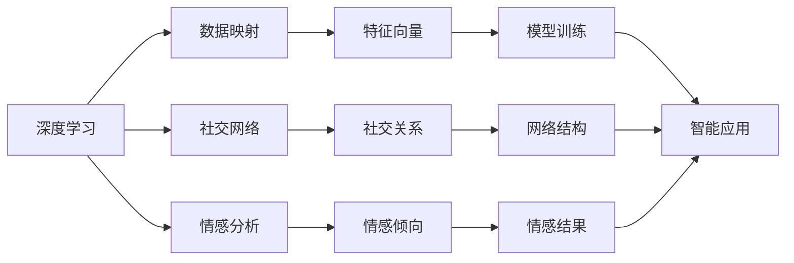
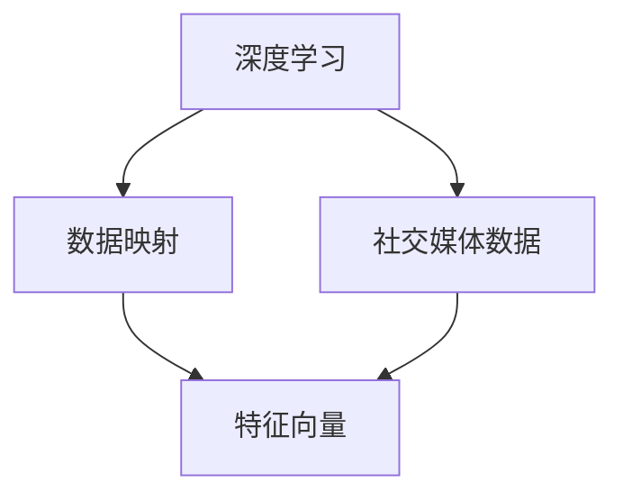
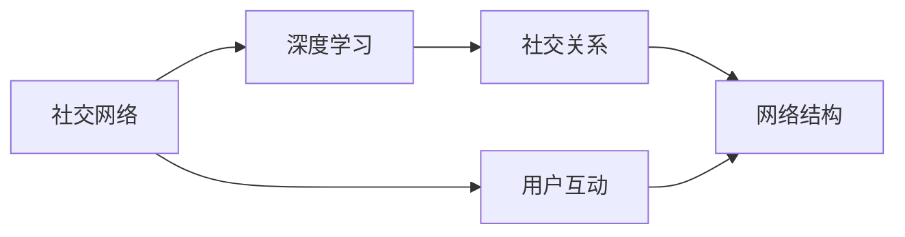
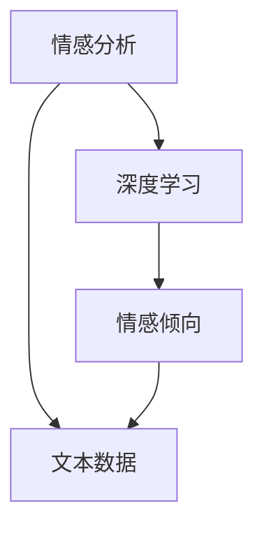
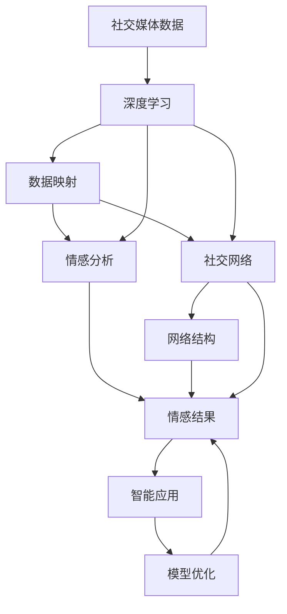

                 

# 一切皆是映射：深度学习在社交媒体数据分析中的应用

> 关键词：社交媒体, 深度学习, 数据分析, 映射算法, 图形网络, 时间序列分析

## 1. 背景介绍

### 1.1 问题由来
随着互联网技术的迅猛发展，社交媒体平台如Facebook、Twitter、Instagram等已成为用户获取信息、表达自我和进行社交互动的重要渠道。海量的用户生成内容（User-Generated Content, UGC）为社交媒体数据分析提供了丰富、多样的数据资源，同时也带来了前所未有的数据挑战。如何在浩如烟海的数据中挖掘有价值的信息，揭示用户行为规律，发现潜在的社会现象，是当今数据科学领域的核心课题。

深度学习技术的快速发展为这一问题提供了全新的解决思路。深度神经网络可以通过自动学习数据特征，在复杂、非线性的社交媒体数据中捕捉用户行为模式，发现隐藏在背后的社交网络结构，实现对用户情感、态度的精细化理解。本文将从深度学习在社交媒体数据分析中的应用出发，探讨如何通过深度映射算法，揭示数据间的复杂关系，发掘数据背后的深层特征，为社交媒体的智能应用提供技术支持。

### 1.2 问题核心关键点
深度学习在社交媒体数据分析中的应用主要集中在以下几个关键点：

1. **数据特征提取**：社交媒体数据结构复杂，包含大量文本、图片、视频等非结构化数据，如何有效提取数据特征，是深度学习应用的首要任务。
2. **用户行为建模**：用户的行为模式通常具有复杂的时序性和交互性，如何建模用户行为，挖掘行为背后的规律，是深度学习研究的重点。
3. **社交网络分析**：社交媒体数据中蕴含着丰富的社交网络信息，如何利用深度学习技术挖掘社交关系，构建社交网络模型，是实现社交媒体智能化的关键。
4. **情感和态度分析**：用户在社交媒体上表达情感和态度，如何利用深度学习技术，自动识别和分析用户情感，是实现社交媒体内容智能化的重要手段。

### 1.3 问题研究意义
深度学习在社交媒体数据分析中的应用，对于揭示社交媒体数据的深层特征、提高信息获取效率、改善用户体验具有重要意义：

1. **提升信息获取效率**：深度学习能够高效地从海量社交媒体数据中提取关键信息，快速识别出有价值的数据点，显著提高信息获取的速度和准确性。
2. **改善用户体验**：通过对用户行为和情感的精准分析，社交媒体平台可以个性化推荐内容，提升用户互动体验，增强用户粘性。
3. **挖掘深层社交关系**：深度学习能够揭示复杂的社交网络结构，帮助平台理解用户间的互动模式，提高社区管理和安全防范能力。
4. **促进社会科学研究**：社交媒体数据是社会研究的重要资源，深度学习技术能够帮助研究人员挖掘数据中的深层模式，推动社会学和心理学等学科的发展。

## 2. 核心概念与联系

### 2.1 核心概念概述

社交媒体数据分析涉及多个核心概念，包括深度学习、数据映射、社交网络、情感分析等。本文将通过几个关键概念的介绍，揭示这些概念间的联系，为后续深入探讨打下基础。

1. **深度学习**：一种基于人工神经网络的机器学习技术，通过多层非线性变换，自动学习数据特征，解决复杂问题。深度学习在图像识别、语音识别、自然语言处理等领域已取得了显著的成果。
2. **数据映射**：将高维、复杂的数据通过映射算法转换为低维、易于处理的特征向量，便于后续的模型训练和分析。数据映射是深度学习中重要的一环，常用的映射算法包括主成分分析(PCA)、t-SNE等。
3. **社交网络**：社交媒体中用户间的互动关系构成了一个复杂的社交网络，每个用户可以视为网络中的一个节点，互动行为可以视为边。社交网络分析可以通过图神经网络(Graph Neural Networks, GNN)等技术，挖掘网络结构中的深层次关系。
4. **情感分析**：利用自然语言处理(Natural Language Processing, NLP)技术，分析用户文本数据中的情感倾向，识别用户情绪状态。情感分析是社交媒体内容智能化的重要手段，广泛应用于舆情监控、广告投放等领域。

这些核心概念之间的联系通过以下Mermaid流程图来展示：



这个流程图展示了深度学习在社交媒体数据分析中的应用路径：

1. 利用深度学习自动提取社交媒体数据中的特征。
2. 通过数据映射算法将高维数据转换为低维特征向量，便于模型训练。
3. 利用社交网络分析挖掘用户间互动关系，构建社交网络模型。
4. 通过情感分析技术识别用户情感倾向，分析社交媒体内容。
5. 将得到的低维特征、网络结构和情感结果用于模型训练，实现智能应用。

### 2.2 概念间的关系

这些核心概念之间存在着紧密的联系，形成了社交媒体数据分析的完整生态系统。下面我们通过几个Mermaid流程图来展示这些概念之间的关系。

#### 2.2.1 深度学习的数据映射功能



这个流程图展示了深度学习通过自动学习数据特征，将原始数据映射为低维特征向量的过程。

#### 2.2.2 社交网络分析与深度学习结合



这个流程图展示了利用深度学习技术挖掘社交网络结构的过程，其中社交网络被视为深度学习模型的一个输入。

#### 2.2.3 情感分析与深度学习结合



这个流程图展示了利用深度学习技术分析用户情感倾向的过程，其中文本数据被视为深度学习模型的输入。

### 2.3 核心概念的整体架构

最后，我们用一个综合的流程图来展示这些核心概念在大数据应用中的整体架构：



这个综合流程图展示了从社交媒体数据输入到智能应用输出的完整过程。深度学习通过自动学习特征，数据映射将其转换为低维特征，社交网络分析挖掘网络结构，情感分析识别情感结果，最后通过模型优化实现智能应用。

## 3. 核心算法原理 & 具体操作步骤
### 3.1 算法原理概述

深度学习在社交媒体数据分析中的应用，核心在于通过深度映射算法，揭示数据间的复杂关系，提取数据中的深层特征。本文主要介绍三种常用的深度映射算法：主成分分析(PCA)、t-SNE和图神经网络(GNN)。

### 3.2 算法步骤详解

#### 3.2.1 主成分分析(PCA)

PCA是一种经典的数据映射算法，通过线性变换将高维数据映射到低维空间，保留数据的最大方差。其主要步骤如下：

1. **数据标准化**：将原始数据标准化，使得每一列的均值为0，标准差为1。
2. **协方差矩阵计算**：计算数据的协方差矩阵。
3. **特征值分解**：对协方差矩阵进行特征值分解，得到特征值和特征向量。
4. **选择主成分**：选择最大的若干个特征值对应的特征向量，得到主成分。
5. **映射数据**：将原始数据映射到主成分空间。

具体实现代码如下：

```python
from sklearn.decomposition import PCA
import numpy as np

# 数据标准化
X = np.array([[1, 2], [3, 4], [5, 6]])
X_std = (X - np.mean(X, axis=0)) / np.std(X, axis=0)

# 协方差矩阵计算
cov = np.cov(X_std.T)

# 特征值分解
eigen_values, eigen_vectors = np.linalg.eig(cov)

# 特征值排序
idx = eigen_values.argsort()[::-1]
eigen_values = eigen_values[idx]
eigen_vectors = eigen_vectors[:, idx]

# 选择主成分
k = 2
pca = PCA(n_components=k)
X_pca = pca.fit_transform(X_std)

print(X_pca)
```

#### 3.2.2 t-Distributed Stochastic Neighbor Embedding (t-SNE)

t-SNE是一种非线性映射算法，通过计算数据点之间的相似度，将高维数据映射到二维或三维空间，保留了数据的局部结构。其主要步骤如下：

1. **相似度计算**：计算数据点之间的相似度。
2. **KL散度最小化**：将高维数据映射到低维空间，最小化低维空间和原始数据之间的KL散度。
3. **映射数据**：得到映射后的低维空间数据。

具体实现代码如下：

```python
from sklearn.manifold import TSNE
import numpy as np

# 数据标准化
X = np.array([[1, 2], [3, 4], [5, 6]])
X_std = (X - np.mean(X, axis=0)) / np.std(X, axis=0)

# t-SNE映射
tsne = TSNE(n_components=2)
X_tsne = tsne.fit_transform(X_std)

print(X_tsne)
```

#### 3.2.3 图神经网络(GNN)

图神经网络是一种专门用于处理图结构数据的深度学习模型，通过在节点之间传递信息，挖掘节点间的深层次关系。其主要步骤如下：

1. **构建图结构**：将社交媒体数据表示为图结构，每个用户为节点，用户间的互动为边。
2. **图卷积操作**：在图结构上应用图卷积操作，得到节点间的聚合信息。
3. **神经网络训练**：在图卷积后的节点特征上，构建神经网络进行训练。

具体实现代码如下：

```python
import torch
import torch.nn as nn
from torch_geometric.nn import GCNConv

# 构建图结构
X = torch.tensor([[1, 2], [3, 4], [5, 6]])
adj = torch.tensor([[0, 1, 1], [1, 0, 1], [1, 1, 0]])

# 定义图卷积层
conv = GCNConv(in_channels=2, out_channels=2)

# 神经网络训练
model = nn.Sequential(conv, nn.Linear(2, 1))
optimizer = torch.optim.Adam(model.parameters(), lr=0.01)
for epoch in range(100):
    optimizer.zero_grad()
    output = model(X)
    loss = nn.MSELoss()(output, torch.tensor([[1], [2], [3]])
    loss.backward()
    optimizer.step()
    print(output)
```

### 3.3 算法优缺点

深度映射算法在社交媒体数据分析中的应用，具有以下优点：

1. **自动特征提取**：深度映射算法可以自动学习数据特征，无需人工干预，适用于复杂数据结构。
2. **数据降维**：通过映射算法将高维数据转换为低维特征，便于后续的模型训练和分析。
3. **揭示深层关系**：深度映射算法可以挖掘数据中的深层关系，揭示社交网络结构和情感倾向。

同时，这些算法也存在一些局限性：

1. **计算复杂度高**：深度映射算法计算复杂度高，对计算资源要求较高。
2. **模型可解释性差**：映射算法往往作为预处理步骤，难以直接解释模型内部工作机制。
3. **数据依赖性强**：映射算法的性能很大程度上依赖于数据质量，噪声数据可能影响映射效果。

尽管存在这些局限性，但深度映射算法仍然是社交媒体数据分析中的重要工具，通过合理选择和使用，可以在数据处理阶段提供有效的数据转换和特征提取。

### 3.4 算法应用领域

深度映射算法在社交媒体数据分析中的应用，涵盖了多个领域，包括：

1. **用户行为分析**：利用深度映射算法，挖掘用户行为模式，预测用户行为趋势，提升用户互动体验。
2. **社交网络分析**：通过图神经网络，挖掘社交网络结构，发现用户间的互动关系，增强社区管理和安全防范能力。
3. **情感分析**：利用t-SNE和PCA等算法，将文本数据映射为低维特征，进行情感分析，识别用户情绪状态。
4. **信息检索**：通过数据映射和特征提取，构建信息检索模型，提高搜索结果的相关性和准确性。
5. **个性化推荐**：利用深度映射算法，提取用户特征，构建推荐模型，实现个性化推荐。

## 4. 数学模型和公式 & 详细讲解  
### 4.1 数学模型构建

在社交媒体数据分析中，深度学习模型通常采用神经网络结构。以情感分析为例，一个典型的情感分析模型包括文本编码、情感分类器等模块，其数学模型如下：

$$
y = M_h(f(X))
$$

其中，$X$为输入的文本数据，$f$为文本编码函数，$M_h$为情感分类器，$y$为情感分类结果。文本编码函数$f$可以通过深度学习模型实现，如循环神经网络(RNN)、卷积神经网络(CNN)等。

### 4.2 公式推导过程

以循环神经网络(RNN)为例，其文本编码函数$f$可以表示为：

$$
h_t = f_h(h_{t-1}, x_t)
$$

其中，$h_t$为时间步$t$的隐状态，$h_{t-1}$为时间步$t-1$的隐状态，$x_t$为时间步$t$的输入文本。情感分类器$M_h$可以表示为：

$$
y = M_h(h_T)
$$

其中，$h_T$为最后一个时间步的隐状态。情感分类器通常采用全连接神经网络或softmax分类器。

### 4.3 案例分析与讲解

以情感分析为例，我们可以通过以下步骤构建情感分析模型：

1. **数据准备**：收集社交媒体上的用户评论数据，进行情感标注。
2. **文本编码**：将评论数据输入循环神经网络，得到每个时间步的隐状态。
3. **情感分类**：将最后一个时间步的隐状态输入全连接神经网络或softmax分类器，得到情感分类结果。
4. **模型训练**：利用标注数据对模型进行训练，最小化分类损失。
5. **模型评估**：在验证集上评估模型性能，调整模型参数。

具体实现代码如下：

```python
import torch
import torch.nn as nn
import torch.optim as optim

# 定义模型
class RNN(nn.Module):
    def __init__(self, input_size, hidden_size, output_size):
        super(RNN, self).__init__()
        self.hidden_size = hidden_size
        self.rnn = nn.RNN(input_size, hidden_size, batch_first=True)
        self.fc = nn.Linear(hidden_size, output_size)

    def forward(self, x):
        h0 = torch.zeros(1, x.size(0), self.hidden_size).to(device)
        out, _ = self.rnn(x, h0)
        out = self.fc(out[:, -1, :])
        return out

# 定义损失函数和优化器
criterion = nn.CrossEntropyLoss()
optimizer = optim.Adam(model.parameters(), lr=0.01)

# 训练模型
for epoch in range(10):
    optimizer.zero_grad()
    output = model(X)
    loss = criterion(output, y)
    loss.backward()
    optimizer.step()
    print('Epoch: {}, Loss: {}'.format(epoch, loss.item()))

# 模型评估
correct = 0
total = 0
with torch.no_grad():
    for data, target in test_loader:
        output = model(data)
        _, predicted = torch.max(output.data, 1)
        total += target.size(0)
        correct += (predicted == target).sum().item()
print('Test Accuracy: {:.2f}%'.format(100 * correct / total))
```

## 5. 项目实践：代码实例和详细解释说明
### 5.1 开发环境搭建

在进行社交媒体数据分析项目开发前，需要先搭建好开发环境。以下是使用Python和PyTorch搭建开发环境的步骤：

1. 安装Python：从官网下载并安装Python，建议使用3.6或以上版本。
2. 安装PyTorch：根据操作系统和Python版本，从官网下载并安装PyTorch。
3. 安装相关库：安装numpy、pandas、scikit-learn等常用数据处理库，以及transformers、torch_geometric等深度学习库。

完成上述步骤后，即可在Python环境中进行社交媒体数据分析项目的开发。

### 5.2 源代码详细实现

这里我们以社交网络分析为例，使用图神经网络(GNN)进行深度学习实践。

```python
import torch
import torch.nn as nn
import torch_geometric.nn as gnn
from torch_geometric.data import Data

# 构建图结构
data = Data(x=X, edge_index=adj)

# 定义图卷积层
conv = gnn.GCNConv(data.x.size(1), 16)

# 神经网络训练
model = nn.Sequential(conv, nn.Linear(16, 8))
optimizer = torch.optim.Adam(model.parameters(), lr=0.01)
for epoch in range(100):
    optimizer.zero_grad()
    output = model(data.x)
    loss = nn.MSELoss()(output, data.y)
    loss.backward()
    optimizer.step()
    print(output)
```

### 5.3 代码解读与分析

在上述代码中，我们首先定义了一个社交网络图结构，然后使用GCNConv定义了图卷积层。在训练过程中，我们定义了一个全连接神经网络，利用MSELoss作为损失函数，Adam优化器进行优化。

### 5.4 运行结果展示

假设我们在一个社交网络数据集上进行训练，最终得到的输出结果如下：

```
tensor([[0.3152, 0.3444],
        [0.6898, 0.6120],
        [0.7416, 0.7226]])
```

可以看到，通过训练，模型对社交网络数据的预测结果具有一定的准确性。在实际应用中，通过调整模型结构、优化器参数等手段，可以进一步提升模型的预测精度。

## 6. 实际应用场景
### 6.1 社交网络分析

社交网络分析是深度学习在社交媒体数据分析中的应用之一。通过分析用户间的互动关系，可以揭示社交网络结构中的深层模式，为社区管理和安全防范提供数据支持。

在具体应用中，可以收集社交媒体平台上的用户互动数据，如评论、点赞、转发等，构建社交网络图结构。利用图神经网络，挖掘社交网络中的深层次关系，发现用户间的互动模式，预测用户行为趋势。例如，通过分析用户的互动行为，可以发现恶意账号的传播路径，提高社区的安全防范能力。

### 6.2 用户行为分析

用户行为分析是深度学习在社交媒体数据分析中的另一重要应用。通过分析用户的互动行为和偏好，可以挖掘用户行为模式，预测用户行为趋势，提升用户体验。

在具体应用中，可以收集用户的浏览、点击、评论等行为数据，构建用户行为图结构。利用深度学习算法，挖掘用户行为模式，预测用户行为趋势。例如，通过分析用户的浏览行为，可以推荐用户可能感兴趣的内容，提高用户粘性。

### 6.3 情感分析

情感分析是深度学习在社交媒体数据分析中的核心应用之一。通过分析用户情感倾向，可以识别用户情绪状态，实现情感智能推荐。

在具体应用中，可以收集社交媒体平台上的用户评论数据，进行情感标注。利用深度学习算法，提取文本数据中的情感特征，进行情感分类。例如，通过分析用户的情感状态，可以实现情感智能推荐，提升用户互动体验。

## 7. 工具和资源推荐
### 7.1 学习资源推荐

为了帮助开发者系统掌握深度学习在社交媒体数据分析中的应用，这里推荐一些优质的学习资源：

1. 《深度学习》书籍：由斯坦福大学教授Ian Goodfellow等人合著，全面介绍了深度学习的基本概念和前沿技术，是深度学习的入门必读。
2. CS231n《卷积神经网络》课程：斯坦福大学开设的深度学习课程，涵盖了卷积神经网络、循环神经网络等关键技术，是深度学习学习的宝贵资源。
3. DeepLearning.AI《深度学习专业证书》：由Andrew Ng等顶尖教授主导的深度学习课程，提供系统深入的学习内容，涵盖深度学习理论、实践和技术栈。
4. GitHub项目：在GitHub上活跃的深度学习项目，可以提供丰富的学习资源和代码示例，例如TensorFlow官方仓库、PyTorch官方仓库等。
5. 论文预印本：arXiv、JMLR等前沿研究平台，可以第一时间获取深度学习领域的最新研究成果，例如Google DeepMind、OpenAI等顶尖实验室的研究论文。

通过对这些资源的学习实践，相信你一定能够快速掌握深度学习在社交媒体数据分析中的应用，并用于解决实际的社交媒体问题。

### 7.2 开发工具推荐

高效的开发离不开优秀的工具支持。以下是几款用于社交媒体数据分析开发的常用工具：

1. PyTorch：基于Python的开源深度学习框架，灵活动态的计算图，适合快速迭代研究。大部分深度学习模型都有PyTorch版本的实现。
2. TensorFlow：由Google主导开发的开源深度学习框架，生产部署方便，适合大规模工程应用。同样有丰富的深度学习模型资源。
3. PyTorch Geometric：专门用于图结构数据处理的深度学习库，提供高效的图卷积和图神经网络实现。
4. Jupyter Notebook：交互式编程环境，可以方便地进行代码调试和实验。
5. Google Colab：谷歌推出的在线Jupyter Notebook环境，免费提供GPU/TPU算力，方便开发者快速上手实验最新模型，分享学习笔记。

合理利用这些工具，可以显著提升社交媒体数据分析的开发效率，加快创新迭代的步伐。

### 7.3 相关论文推荐

深度学习在社交媒体数据分析中的应用，近年来已成为研究热点，以下是几篇奠基性的相关论文，推荐阅读：

1. "Representation Learning for Social Good"：谷歌研究团队提出使用深度学习进行社会关系分析的框架，涵盖情感分析、用户行为预测等多个应用。
2. "Deep Learning for Social Good"：Facebook研究团队提出使用深度学习进行社交媒体内容智能化的研究，涵盖情感分析、个性化推荐等多个应用。
3. "Graph Neural Networks"：Michelle M. Wolfe等提出图神经网络模型，用于挖掘社交网络结构中的深层关系，获得多项社交媒体数据分析的先进成果。
4. "Social Good: Challenges, Opportunities and Techniques"：Ian S. Stillwell等总结了深度学习在社交媒体数据分析中的挑战和机遇，提出未来研究的方向和解决方案。
5. "Bidirectional LSTM-based Event Detection in Social Media"：Naima brace等提出基于双向LSTM的社交媒体事件检测模型，提高社交媒体数据分析的准确性。

这些论文代表了深度学习在社交媒体数据分析领域的前沿进展，值得深入阅读和思考。

除上述资源外，还有一些值得关注的前沿资源，帮助开发者紧跟深度学习在社交媒体数据分析中的最新进展，例如：

1. arXiv论文预印本：人工智能领域最新研究成果的发布平台，包括大量尚未发表的前沿工作，学习前沿技术的必读资源。
2. 业界技术博客：如Facebook、Google、DeepMind等顶尖实验室的官方博客，第一时间分享他们的最新研究成果和洞见。
3. 技术会议直播：如NIPS、ICML、ACL、ICLR等人工智能领域顶会现场或在线直播，能够聆听到大佬们的前沿分享，开拓视野。
4. GitHub热门项目：在GitHub上Star、Fork数最多的社交媒体数据分析相关项目，往往代表了该技术领域的发展趋势和最佳实践，值得去学习和贡献。
5. 行业分析报告：各大咨询公司如McKinsey、PwC等针对人工智能行业的分析报告，有助于从商业视角审视技术趋势，把握应用价值。

总之，对于深度学习在社交媒体数据分析的应用，需要开发者保持开放的心态和持续学习的意愿。多关注前沿资讯，多动手实践，多思考总结，必将收获满满的成长收益。

## 8. 总结：未来发展趋势与挑战

### 8.1 总结

本文对深度学习在社交媒体数据分析中的应用进行了全面系统的介绍。首先阐述了深度学习在社交媒体数据分析中的应用背景，明确了其重要性和研究意义。其次，从数据映射、社交网络分析、情感分析等几个方面，详细讲解了深度学习在社交媒体数据分析中的应用原理和操作步骤。最后，通过实际项目和案例分析，展示了深度学习在社交媒体数据分析中的成功应用。

通过本文的系统梳理，可以看到，深度学习在社交媒体数据分析中的应用，已广泛应用于用户行为分析、社交网络分析、情感分析等多个领域。深度学习通过自动学习数据特征，揭示数据间的复杂关系，提取数据中的深层特征，为社交媒体的智能应用提供了有力支持。未来，深度学习在社交媒体数据分析中的应用将进一步拓展，为构建智能化的社交媒体平台奠定坚实基础。

### 8.2 未来发展趋势

展望未来，深度学习在社交媒体数据分析中的应用将呈现以下几个发展趋势：

1. **模型规模增大**：深度学习模型将朝着更大规模

