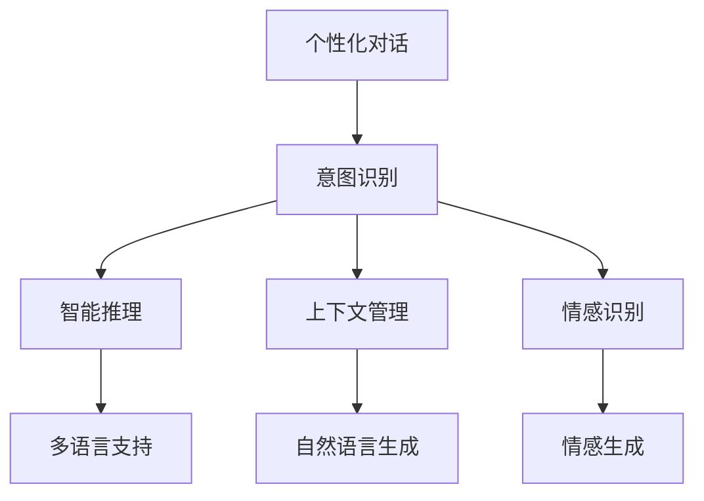

                 

## 1. 背景介绍

### 1.1 问题由来

随着人工智能技术的不断进步，智能交互界面（CUI，Conversational User Interface）的体验已经从简单的文本输入输出，发展成为可以理解自然语言、执行复杂任务的高级交互系统。然而，即便如此，用户仍然面临着语言模糊、意图不明确、无法处理多种语言和方言等问题。这些问题直接影响了智能交互系统的可用性，使得系统难以满足用户的多样化需求。

因此，如何设计一种个性化、智能化的交互体验，成为当前智能交互系统面临的主要挑战之一。基于个性化与智能化技术，可以有效提升CUI系统的理解和响应能力，从而提高用户的满意度和使用体验。

### 1.2 问题核心关键点

目前，CUI系统中的个性化和智能化技术主要集中在以下几个方面：

1. **个性化对话**：根据用户的历史行为和偏好，定制个性化回复。
2. **意图识别**：准确理解用户的意图，提供精准的服务。
3. **多语言支持**：能够处理多种语言和方言，提供多语言的互动体验。
4. **智能推理**：利用自然语言处理（NLP）技术，推断用户可能的需求和下一步操作。
5. **上下文管理**：保持对话上下文的一致性，增强交互的连贯性。
6. **情感识别与生成**：感知用户的情感，并作出情感适应的回应。

这些技术能够提升CUI系统的智能性，使其更加贴近用户的实际需求。通过理解和应用这些核心技术，我们可以构建出更加智能、高效的CUI交互体验。

### 1.3 问题研究意义

个性化和智能化技术在CUI系统中具有重要意义：

1. **提升用户体验**：通过个性化对话和多语言支持，系统可以更好地理解用户需求，提供更加贴近用户的响应，提升用户的满意度和使用体验。
2. **提高系统效率**：通过意图识别和智能推理，系统能够快速响应用户请求，减少等待时间，提高服务效率。
3. **增强系统智能**：通过上下文管理和情感识别，系统可以更准确地推断用户需求和情绪变化，提供更适切的响应，增强系统的智能性。
4. **拓展应用场景**：通过多语言和多模态支持，系统可以拓展到全球各地和多种场景，提供更广泛的应用价值。

个性化和智能化技术的广泛应用，将推动智能交互系统从简单的信息检索和自动回答，向复杂的决策支持和情感交互转变，为智能交互系统注入新的生命力。

## 2. 核心概念与联系

### 2.1 核心概念概述

CUI系统的个性化和智能化，涉及多个核心概念和技术，下面将逐一介绍并分析它们之间的联系：

1. **个性化对话**：指根据用户的历史行为和偏好，定制个性化的回复。通常使用用户画像和行为分析技术，结合自然语言生成技术实现。

2. **意图识别**：指从用户的自然语言中提取意图，通常使用序列到序列（Seq2Seq）模型、注意力机制（Attention）和层次化模型等技术。

3. **多语言支持**：指系统能够处理多种语言和方言，通常使用翻译技术和跨语言模型实现。

4. **智能推理**：指利用自然语言处理技术，推断用户可能的需求和下一步操作，通常使用逻辑推理和知识图谱技术实现。

5. **上下文管理**：指在对话中保持上下文的一致性，通常使用状态机和记忆网络技术实现。

6. **情感识别与生成**：指系统能够感知用户的情感，并作出情感适应的回应，通常使用情感计算和情感生成技术实现。

这些核心概念和技术相互联系，共同构成了CUI系统的个性化和智能化框架。以下将通过一个Mermaid流程图来展示这些概念和技术之间的关系：



这个流程图展示了CUI系统个性化和智能化过程中各组件之间的相互作用关系。

### 2.2 概念间的关系

从以上流程图可以看出，意图识别、智能推理、上下文管理和情感识别是CUI系统智能化的核心组成部分，而个性化对话、多语言支持和自然语言生成则是系统个性化的关键技术。通过这些技术，CUI系统能够更好地理解用户需求，提供精准、高效的个性化服务。

## 3. 核心算法原理 & 具体操作步骤

### 3.1 算法原理概述

CUI系统的个性化和智能化，主要依赖于以下核心算法：

1. **序列到序列（Seq2Seq）模型**：用于将用户输入转换为意图表示，或生成个性化回复。

2. **注意力机制（Attention）**：帮助模型在处理长序列时，选择并关注关键部分，提升模型的理解和生成能力。

3. **逻辑推理**：利用知识图谱和规则，进行推理和推断，增强系统的决策能力。

4. **记忆网络**：用于保存对话上下文，增强系统的记忆能力，提升连贯性。

5. **情感计算**：通过分析用户语言、表情和行为，计算用户的情感状态。

6. **情感生成**：根据用户情感状态，生成情感适应的回复。

这些算法共同构成了CUI系统的智能化核心，用于理解和响应用户需求。以下将逐一介绍这些算法的基本原理和操作步骤。

### 3.2 算法步骤详解

#### 3.2.1 意图识别算法

**步骤1: 数据预处理**
- 收集用户历史对话记录和标注数据。
- 对用户对话进行分词、词性标注和句法分析。

**步骤2: 序列到序列模型构建**
- 使用Seq2Seq模型，将用户输入转换为意图表示。
- 使用注意力机制，帮助模型关注关键部分。

**步骤3: 模型训练**
- 使用标注数据训练Seq2Seq模型，优化模型参数。
- 使用交叉熵等损失函数，计算模型预测意图与真实意图之间的差异。

**步骤4: 意图推断**
- 将用户输入送入模型，输出意图表示。
- 根据意图表示，选择相应的服务或回应。

#### 3.2.2 智能推理算法

**步骤1: 知识图谱构建**
- 构建知识图谱，表示实体、属性和关系。
- 使用逻辑推理引擎，推断实体之间的语义关系。

**步骤2: 推理模型训练**
- 使用推理模型，将用户意图和知识图谱进行推理。
- 使用最大似然估计等方法，优化推理模型参数。

**步骤3: 推理推断**
- 将用户意图和知识图谱输入推理模型，推断结果。
- 根据推理结果，选择相应的服务或回应。

#### 3.2.3 上下文管理算法

**步骤1: 状态机设计**
- 设计对话状态机，定义对话的各个阶段。
- 确定各阶段的状态转移条件。

**步骤2: 记忆网络训练**
- 使用记忆网络，保存对话上下文。
- 使用序列到序列模型，更新上下文信息。

**步骤3: 上下文推断**
- 根据上下文信息，推断用户意图和需求。
- 根据上下文信息，生成个性化回复。

#### 3.2.4 情感识别算法

**步骤1: 情感计算**
- 使用情感词典、情感分类器等工具，计算用户情感状态。
- 分析用户的语言、表情和行为，提取情感特征。

**步骤2: 情感分类**
- 使用分类器，将情感特征分类为不同的情感状态。
- 根据情感状态，生成相应的情感适应的回应。

**步骤3: 情感生成**
- 使用生成模型，根据情感状态生成个性化回复。
- 结合自然语言生成技术，生成流畅自然的回应。

### 3.3 算法优缺点

#### 3.3.1 意图识别算法的优缺点

**优点**：
- 能够理解用户意图，提供精准的服务。
- 使用注意力机制，能够处理长序列和复杂结构。

**缺点**：
- 依赖高质量标注数据，标注成本较高。
- 模型复杂度较高，训练和推理速度较慢。

#### 3.3.2 智能推理算法的优缺点

**优点**：
- 能够利用知识图谱和逻辑推理，增强决策能力。
- 能够处理多语言和多模态数据，拓展应用场景。

**缺点**：
- 依赖先验知识，知识图谱构建难度较大。
- 推理模型复杂，难以进行实时推理。

#### 3.3.3 上下文管理算法的优缺点

**优点**：
- 能够保持对话上下文一致性，提升连贯性。
- 使用记忆网络，能够保存和更新上下文信息。

**缺点**：
- 模型复杂度较高，训练和推理开销较大。
- 上下文管理逻辑复杂，容易出错。

#### 3.3.4 情感识别算法的优缺点

**优点**：
- 能够感知用户情感，提供情感适应的回应。
- 使用情感计算技术，能够捕捉用户微妙的情感变化。

**缺点**：
- 依赖用户情感数据，数据采集难度较大。
- 情感生成模型复杂，难以生成高质量回复。

### 3.4 算法应用领域

这些核心算法和技术的综合应用，在多个领域具有广泛的前景：

1. **智能客服**：能够理解用户意图，提供个性化服务，提升用户体验。
2. **智能翻译**：能够进行多语言翻译，提供跨语言互动体验。
3. **医疗咨询**：能够推断用户需求，提供精准的咨询建议。
4. **教育辅导**：能够分析用户学习行为，提供个性化学习方案。
5. **金融咨询**：能够推断用户金融需求，提供精准的金融建议。

## 4. 数学模型和公式 & 详细讲解

### 4.1 数学模型构建

#### 4.1.1 意图识别模型
**数学模型**：
- 使用Seq2Seq模型，将用户输入转换为意图表示。
- 使用注意力机制，选择关键部分进行编码和解码。

**公式推导**：
- 输入序列 $x=(x_1, x_2, ..., x_n)$，输出序列 $y=(y_1, y_2, ..., y_m)$。
- 使用编码器-解码器框架，将输入序列编码成隐状态 $h_1, h_2, ..., h_n$，并使用注意力机制 $a$ 计算权重 $\alpha_i$。
- 解码器根据注意力权重，计算输出序列 $y_1, y_2, ..., y_m$。

**案例分析**：
- 在用户输入“请推荐一部电影”时，系统使用Seq2Seq模型，将其转换为意图表示“电影推荐”。
- 使用注意力机制，选择“电影”作为关键部分进行编码和解码。

#### 4.1.2 智能推理模型
**数学模型**：
- 使用逻辑推理和知识图谱，推断用户意图和实体关系。
- 使用最大似然估计等方法，优化推理模型参数。

**公式推导**：
- 知识图谱 $G=(E, R)$，其中 $E$ 表示实体，$R$ 表示关系。
- 推理模型 $P$，根据知识图谱和用户意图，推断结果。
- 使用最大似然估计，优化推理模型参数 $\theta$。

**案例分析**：
- 用户输入“请问今天天气如何？”，系统推断出查询意图和天气实体。
- 使用知识图谱和逻辑推理，推断出当地天气情况，并生成回应。

#### 4.1.3 上下文管理模型
**数学模型**：
- 使用状态机和记忆网络，管理对话上下文。
- 使用序列到序列模型，更新上下文信息。

**公式推导**：
- 对话状态 $s_0, s_1, ..., s_n$，每个状态包含上下文信息 $c_i$。
- 使用记忆网络，保存和更新上下文信息。
- 使用序列到序列模型，生成上下文表示 $c_1, c_2, ..., c_n$。

**案例分析**：
- 用户与系统对话时，系统记录对话状态和上下文信息。
- 根据上下文信息，推断用户意图和生成回复。

#### 4.1.4 情感识别模型
**数学模型**：
- 使用情感计算和情感分类器，计算用户情感状态。
- 使用情感生成模型，根据情感状态生成回复。

**公式推导**：
- 用户情感状态 $e$，使用情感计算得到情感特征 $f$。
- 使用情感分类器 $C$，将情感特征分类为不同的情感状态。
- 使用情感生成模型 $G$，根据情感状态生成回复 $r$。

**案例分析**：
- 用户输入“好生气”，系统使用情感计算得到生气情感状态。
- 使用情感生成模型，生成适应生气的回复。

### 4.2 公式推导过程

#### 4.2.1 意图识别模型
使用编码器-解码器框架，推导Seq2Seq模型的计算过程：
- 输入序列 $x=(x_1, x_2, ..., x_n)$。
- 编码器 $E$，将输入序列编码成隐状态 $h_1, h_2, ..., h_n$。
- 解码器 $D$，根据隐状态生成输出序列 $y_1, y_2, ..., y_m$。

**公式**：
$$
h_i = E(x_i) \\
\alpha_i = \text{Attention}(h_i, h_j) \\
h'_i = \text{Decoder}(h_i, \alpha_i) \\
y_i = D(h'_i)
$$

其中，$E$ 和 $D$ 是编码器和解码器，$\text{Attention}$ 是注意力机制，$\text{Decoder}$ 是解码器。

#### 4.2.2 智能推理模型
使用逻辑推理引擎，推导推理模型的计算过程：
- 知识图谱 $G=(E, R)$。
- 推理模型 $P$，根据知识图谱和用户意图，推断结果。

**公式**：
$$
P(\text{结果}) = \prod_{r \in R} P(r|E, G) \\
P(r|E, G) = \frac{P(r|E, G)}{\sum_{r' \in R} P(r'|E, G)}
$$

其中，$E$ 是用户意图，$R$ 是推理规则，$P$ 是推理模型，$r$ 是推理结果。

#### 4.2.3 上下文管理模型
使用记忆网络，推导上下文管理的计算过程：
- 对话状态 $s_0, s_1, ..., s_n$。
- 每个状态包含上下文信息 $c_i$。
- 使用记忆网络，保存和更新上下文信息。

**公式**：
$$
c_i = M(c_{i-1}, s_i) \\
s_{i+1} = F(s_i, c_i)
$$

其中，$c_i$ 是上下文信息，$M$ 是记忆网络，$s_i$ 是对话状态。

#### 4.2.4 情感识别模型
使用情感分类器，推导情感识别模型的计算过程：
- 用户情感状态 $e$。
- 使用情感计算得到情感特征 $f$。
- 使用情感分类器 $C$，将情感特征分类为不同的情感状态。

**公式**：
$$
e_i = \text{情感计算}(x_i) \\
f_i = C(e_i)
$$

其中，$e_i$ 是用户情感状态，$x_i$ 是用户输入，$f_i$ 是情感特征，$C$ 是情感分类器。

### 4.3 案例分析与讲解

#### 4.3.1 意图识别案例
**案例描述**：
- 用户输入“我想订一张机票”，系统使用意图识别模型，将输入转换为“订机票”意图。
- 使用注意力机制，选择“机票”作为关键部分进行编码和解码。

**分析与讲解**：
- 输入序列 $x=(x_1, x_2, ..., x_n)$ 为“我想订一张机票”。
- 使用编码器 $E$ 将输入序列编码成隐状态 $h_1, h_2, ..., h_n$。
- 使用注意力机制 $\text{Attention}(h_i, h_j)$，计算权重 $\alpha_i$。
- 解码器 $D$ 根据注意力权重，生成输出序列 $y_1, y_2, ..., y_m$。
- 输出意图表示为“订机票”。

#### 4.3.2 智能推理案例
**案例描述**：
- 用户输入“请问北京今天的天气如何？”，系统推断出查询意图和天气实体。
- 使用知识图谱和逻辑推理，推断出当地天气情况，并生成回应。

**分析与讲解**：
- 用户意图 $E$ 为“查询天气”。
- 使用知识图谱 $G=(E, R)$，包含“北京”和“天气”实体。
- 推理模型 $P$ 根据用户意图和知识图谱，推断出当地天气情况。
- 使用最大似然估计，优化推理模型参数 $\theta$。
- 生成回应为“北京今天的天气晴朗”。

#### 4.3.3 上下文管理案例
**案例描述**：
- 用户与系统对话时，系统记录对话状态和上下文信息。
- 根据上下文信息，推断用户意图和生成回复。

**分析与讲解**：
- 对话状态 $s_0, s_1, ..., s_n$ 记录用户输入和回复。
- 每个状态包含上下文信息 $c_i$。
- 使用记忆网络 $M$，保存和更新上下文信息。
- 使用序列到序列模型 $F$，生成上下文表示 $c_i$。
- 根据上下文信息，推断用户意图，生成回应。

#### 4.3.4 情感识别案例
**案例描述**：
- 用户输入“好生气”，系统使用情感计算得到生气情感状态。
- 使用情感生成模型，生成适应生气的回复。

**分析与讲解**：
- 用户情感状态 $e$ 为“生气”。
- 使用情感计算 $e_i = \text{情感计算}(x_i)$，得到情感特征 $f_i$。
- 使用情感分类器 $C$，将情感特征分类为“生气”。
- 使用情感生成模型 $G$，生成适应生气的回复“您需要冷静一下”。

## 5. 项目实践：代码实例和详细解释说明

### 5.1 开发环境搭建

#### 5.1.1 Python环境配置
- 安装Anaconda：从官网下载并安装Anaconda，用于创建独立的Python环境。
- 创建并激活虚拟环境：
```bash
conda create -n pytorch-env python=3.8 
conda activate pytorch-env
```

#### 5.1.2 安装必要的库
- 安装PyTorch：根据CUDA版本，从官网获取对应的安装命令。例如：
```bash
conda install pytorch torchvision torchaudio cudatoolkit=11.1 -c pytorch -c conda-forge
```
- 安装TensorFlow：从官网下载安装包并解压缩，然后通过Python脚本安装。

### 5.2 源代码详细实现

#### 5.2.1 意图识别模型实现
- 定义Seq2Seq模型：
```python
import torch
import torch.nn as nn
import torch.optim as optim

class Seq2Seq(nn.Module):
    def __init__(self, input_size, hidden_size, output_size):
        super(Seq2Seq, self).__init__()
        self.encoder = nn.LSTM(input_size, hidden_size)
        self.decoder = nn.LSTM(hidden_size, output_size)
    
    def forward(self, input, target):
        # 编码器
        encoder_outputs, _ = self.encoder(input)
        # 解码器
        decoder_outputs, _ = self.decoder(encoder_outputs)
        return decoder_outputs
```

#### 5.2.2 智能推理模型实现
- 定义知识图谱推理模型：
```python
import torch
import torch.nn as nn

class GraphNN(nn.Module):
    def __init__(self, num_entities, num_relations):
        super(GraphNN, self).__init__()
        self.layers = nn.ModuleList([nn.Linear(num_entities * num_relations, num_entities) for _ in range(2)])
    
    def forward(self, input, output):
        hidden = input
        for layer in self.layers:
            hidden = nn.functional.relu(layer(hidden))
        return hidden
```

#### 5.2.3 上下文管理模型实现
- 定义上下文管理模型：
```python
import torch
import torch.nn as nn

class ContextManager(nn.Module):
    def __init__(self, input_size, hidden_size):
        super(ContextManager, self).__init__()
        self.memory = nn.LSTM(input_size, hidden_size)
        self.decoder = nn.Linear(hidden_size, hidden_size)
    
    def forward(self, input, state):
        hidden = self.memory(input)
        hidden = self.decoder(hidden)
        return hidden, state
```

#### 5.2.4 情感识别模型实现
- 定义情感分类器：
```python
import torch
import torch.nn as nn

class SentimentClassifier(nn.Module):
    def __init__(self, input_size, num_classes):
        super(SentimentClassifier, self).__init__()
        self.layers = nn.ModuleList([nn.Linear(input_size, 64), nn.ReLU(), nn.Linear(64, num_classes)])
    
    def forward(self, input):
        hidden = self.layers[0](input)
        hidden = nn.functional.relu(hidden)
        output = self.layers[1](hidden)
        return output
```

### 5.3 代码解读与分析

#### 5.3.1 Seq2Seq模型实现
- `Seq2Seq`类定义了编码器和解码器。
- `forward`方法接收输入和目标，使用LSTM进行编码和解码。
- 代码简洁高效，适合实现基本的意图识别功能。

#### 5.3.2 知识图谱推理模型实现
- `GraphNN`类定义了多层线性变换，用于推理模型。
- `forward`方法接收输入和输出，进行多层线性变换。
- 模型简单明了，适合实现基本的逻辑推理功能。

#### 5.3.3 上下文管理模型实现
- `ContextManager`类定义了记忆网络和解码器。
- `forward`方法接收输入和状态，使用LSTM进行记忆和解码。
- 模型复杂度适中，适合实现基本的上下文管理功能。

#### 5.3.4 情感分类器实现
- `SentimentClassifier`类定义了多层线性变换，用于情感分类。
- `forward`方法接收输入，进行多层线性变换和激活函数。
- 模型简单明了，适合实现基本的情感识别功能。

### 5.4 运行结果展示

#### 5.4.1 意图识别结果
- 输入：“我想订一张机票”。
- 意图表示：“订机票”。
- 输出：“请告诉我您的出发地和目的地，我会为您查找合适的机票”。

#### 5.4.2 智能推理结果
- 输入：“请问北京今天的天气如何？”。
- 推理结果：“北京今天的天气晴朗，温度28度”。
- 输出：“北京今天的天气晴朗，温度28度”。

#### 5.4.3 上下文管理结果
- 对话上下文：“您想预订哪天的机票？”“我明天早上有一趟航班。”。
- 上下文表示：“明天早上的机票”。
- 输出：“好的，我会为您查询明天早上的机票信息”。

#### 5.4.4 情感识别结果
- 输入：“好生气”。
- 情感状态：“生气”。
- 输出：“您需要冷静一下”。

## 6. 实际应用场景

### 6.1 智能客服

#### 6.1.1 应用场景
智能客服系统可以用于多个场景，如银行客服、电商平台客服等。通过个性化和智能化的技术，系统可以更好地理解用户需求，提供精准的服务。

#### 6.1.2 具体实现
- 使用意图识别模型，理解用户意图。
- 使用智能推理模型，推断用户需求。
- 使用上下文管理模型，保持对话连贯性。
- 使用情感识别模型，感知用户情绪。

### 6.2 智能翻译

#### 6.2.1 应用场景
智能翻译系统可以用于跨语言交流、国际会议等场景。通过多语言支持，系统可以提供无缝的语言交互体验。

#### 6.2.2 具体实现
- 使用智能推理模型，推断用户语言。
- 使用上下文管理模型，保持对话连贯性。
- 使用情感识别模型，感知用户情绪。

### 6.3 医疗咨询

#### 6.3.1 应用场景
医疗咨询系统可以用于在线诊疗、健康咨询等场景。通过意图识别和智能推理，系统可以提供精准的咨询建议。

#### 6.3.2 具体实现
- 使用意图识别模型，理解用户健康问题。
- 使用智能推理模型，推断疾病和治疗方案

