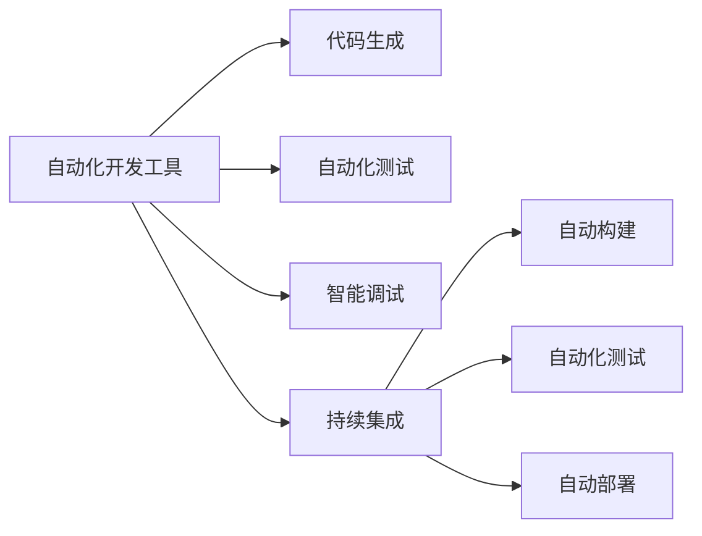
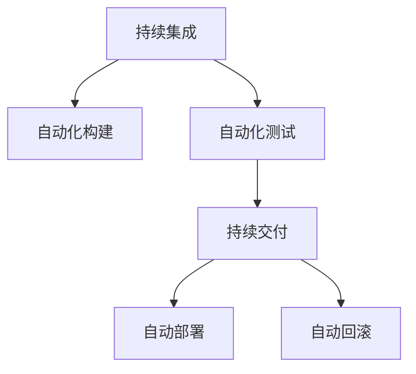
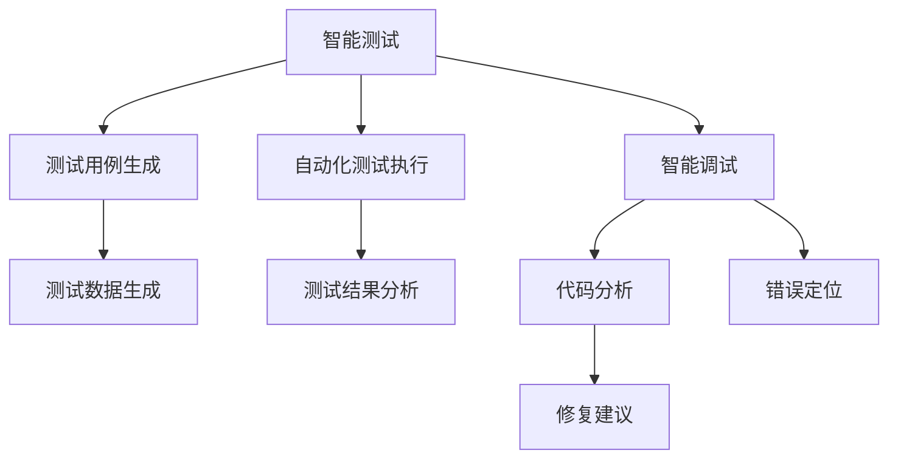
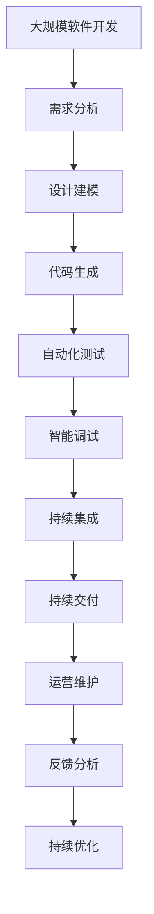

                 

# 人工智能正在吞噬传统软件开发

## 1. 背景介绍

### 1.1 问题由来
随着科技的飞速发展，人工智能(AI)正在逐渐渗透到软件开发领域，传统的软件开发模式和工具面临着前所未有的变革。这一趋势不仅改变了软件开发的流程和工具，还对软件工程的专业技能和人才培养提出了新的挑战。

### 1.2 问题核心关键点
人工智能在软件开发中的应用，主要体现在以下几个方面：
- 自动化代码生成：AI模型能够自动生成代码，提升软件开发效率。
- 自动化测试：通过AI模型进行测试用例的生成和自动化执行，减少测试工作量。
- 智能调试：AI模型能够帮助识别代码中的潜在错误，并提出修复建议。
- 持续集成和持续交付：AI辅助的自动化流程，能够实现更高效的软件发布和部署。

### 1.3 问题研究意义
研究人工智能在软件开发中的应用，对于提升软件开发效率、降低开发成本、提升软件质量具有重要意义：
1. 降低开发难度：AI辅助的自动化工具可以减少人工干预，降低开发难度，尤其是对于新入行的开发者。
2. 提升开发效率：自动化代码生成和测试能够显著提升开发效率，缩短项目周期。
3. 增强软件质量：AI辅助的代码审查和测试能够提前发现并修复潜在错误，提升软件质量。
4. 加速软件开发流程：通过自动化工具，实现持续集成和持续交付，提高软件发布频率。
5. 赋能工业生产：人工智能在软件开发中的应用，有助于提高软件生产的规模和效率，支持数字化转型。

## 2. 核心概念与联系

### 2.1 核心概念概述

为更好地理解人工智能在软件开发中的应用，本节将介绍几个密切相关的核心概念：

- 人工智能(AI)：通过机器学习、深度学习等技术，实现自主学习、决策和执行的智能系统。
- 自动化开发工具：利用AI技术，实现自动化的代码生成、测试、调试等开发活动。
- 持续集成(CI)：通过自动化流程，实现代码的自动构建、测试和部署，提升软件开发效率。
- 持续交付(CD)：通过自动化流程，实现软件的自动化发布和部署，加速软件生命周期。
- 智能测试：利用AI模型，实现测试用例的自动化生成和执行，提升测试效率和覆盖率。
- 智能调试：通过AI模型，识别代码中的潜在错误，并提出修复建议，提升代码质量。

这些核心概念之间存在着紧密的联系，形成了人工智能在软件开发中的应用框架。通过理解这些核心概念，我们可以更好地把握AI在软件开发中的作用和价值。

### 2.2 概念间的关系

这些核心概念之间存在着紧密的联系，形成了人工智能在软件开发中的应用框架。下面我们通过几个Mermaid流程图来展示这些概念之间的关系。

#### 2.2.1 自动化开发工具和持续集成



这个流程图展示了自动化开发工具在代码生成、测试、调试和持续集成中的应用。

#### 2.2.2 持续集成和持续交付



这个流程图展示了持续集成和持续交付的流程，从代码构建、测试到部署的自动化。

#### 2.2.3 智能测试和智能调试



这个流程图展示了智能测试和智能调试的过程，从测试用例生成到测试结果分析，再到错误定位和修复建议。

### 2.3 核心概念的整体架构

最后，我们用一个综合的流程图来展示这些核心概念在大规模软件开发中的应用：



这个综合流程图展示了从需求分析、设计建模到代码生成、测试、调试、持续集成、持续交付、运营维护和反馈分析的完整开发流程，体现了AI在软件开发中的应用。

## 3. 核心算法原理 & 具体操作步骤
### 3.1 算法原理概述

人工智能在软件开发中的应用，主要依赖于机器学习、深度学习等先进算法。其核心原理是通过大量标注数据训练AI模型，使其具备对代码、测试用例和错误进行自主学习和决策的能力。这些算法包括以下几个关键部分：

- 代码生成：利用自然语言处理(NLP)技术，将程序逻辑转换为代码。
- 测试用例生成：利用NLP技术，生成测试用例，模拟真实用户行为。
- 错误定位：利用NLP技术，识别代码中的潜在错误，并进行定位和修复。

### 3.2 算法步骤详解

基于AI的软件开发应用主要包括以下几个关键步骤：

**Step 1: 数据准备**
- 收集标注数据，包括代码、测试用例和错误日志等。
- 对数据进行预处理，如清洗、标注等。

**Step 2: 模型训练**
- 选择适当的AI算法，如RNN、CNN、Transformer等。
- 使用标注数据训练模型，调整模型参数。

**Step 3: 模型评估**
- 在验证集上评估模型性能，调整模型超参数。
- 选择性能最优的模型进行部署。

**Step 4: 模型部署**
- 将训练好的模型集成到开发工具链中。
- 在实际开发过程中，使用模型进行代码生成、测试用例生成和错误定位等操作。

**Step 5: 持续优化**
- 收集新数据，更新模型。
- 定期评估模型性能，调整模型参数。

### 3.3 算法优缺点

基于AI的软件开发应用具有以下优点：
1. 提升开发效率：自动化工具能够减少人工干预，提升开发效率。
2. 提高软件质量：AI辅助的测试和调试能够提前发现并修复潜在错误，提升软件质量。
3. 支持持续交付：自动化流程能够实现持续集成和持续交付，加速软件发布。

同时，这些方法也存在以下缺点：
1. 数据依赖性高：模型的性能依赖于高质量的数据，数据采集和标注成本较高。
2. 模型泛化性差：不同项目、不同语言的数据分布差异较大，模型泛化性有限。
3. 黑盒特性：AI模型通常缺乏可解释性，难以解释其决策过程。
4. 技术门槛高：AI模型和工具需要专业的技能支持，可能对现有开发人员构成挑战。

### 3.4 算法应用领域

基于AI的软件开发应用已经广泛应用于以下几个领域：

- 自动代码生成：如GitHub Copilot、DeepCode等。
- 自动化测试：如Smartbear、Testim.io等。
- 智能调试：如Codota、JShint等。
- 持续集成和持续交付：如Jenkins、Travis CI等。

这些工具已经在大规模软件开发项目中得到了广泛应用，显著提升了开发效率和软件质量。未来，随着AI技术的不断进步，更多AI辅助的开发工具将不断涌现，进一步推动软件开发模式的变革。

## 4. 数学模型和公式 & 详细讲解 & 举例说明
### 4.1 数学模型构建

为了更好地理解基于AI的软件开发应用，我们将使用数学语言对相关模型进行描述。

假设我们的任务是自动化测试用例生成，我们定义测试用例的生成模型为 $M_{\theta}(x)$，其中 $\theta$ 为模型参数。我们有一个测试数据集 $D=\{(x_i, y_i)\}_{i=1}^N$，其中 $x_i$ 为输入测试数据，$y_i$ 为输出测试用例。

定义模型 $M_{\theta}$ 在数据样本 $(x,y)$ 上的损失函数为 $\ell(M_{\theta}(x),y)$，则在数据集 $D$ 上的经验风险为：

$$
\mathcal{L}(\theta) = \frac{1}{N} \sum_{i=1}^N \ell(M_{\theta}(x_i),y_i)
$$

我们的目标是最小化损失函数 $\mathcal{L}(\theta)$，即找到最优参数：

$$
\theta^* = \mathop{\arg\min}_{\theta} \mathcal{L}(\theta)
$$

在实践中，我们通常使用基于梯度的优化算法（如SGD、Adam等）来近似求解上述最优化问题。设 $\eta$ 为学习率，$\lambda$ 为正则化系数，则参数的更新公式为：

$$
\theta \leftarrow \theta - \eta \nabla_{\theta}\mathcal{L}(\theta) - \eta\lambda\theta
$$

其中 $\nabla_{\theta}\mathcal{L}(\theta)$ 为损失函数对参数 $\theta$ 的梯度，可通过反向传播算法高效计算。

### 4.2 公式推导过程

以下我们以测试用例生成为例，推导基于NLP的测试用例生成模型的损失函数及其梯度的计算公式。

假设模型 $M_{\theta}$ 在输入 $x$ 上的输出为 $\hat{y}=M_{\theta}(x) \in [0,1]$，表示样本属于正类的概率。真实标签 $y \in \{0,1\}$。则二分类交叉熵损失函数定义为：

$$
\ell(M_{\theta}(x),y) = -[y\log \hat{y} + (1-y)\log (1-\hat{y})]
$$

将其代入经验风险公式，得：

$$
\mathcal{L}(\theta) = -\frac{1}{N}\sum_{i=1}^N [y_i\log M_{\theta}(x_i)+(1-y_i)\log(1-M_{\theta}(x_i))]
$$

根据链式法则，损失函数对参数 $\theta_k$ 的梯度为：

$$
\frac{\partial \mathcal{L}(\theta)}{\partial \theta_k} = -\frac{1}{N}\sum_{i=1}^N (\frac{y_i}{M_{\theta}(x_i)}-\frac{1-y_i}{1-M_{\theta}(x_i)}) \frac{\partial M_{\theta}(x_i)}{\partial \theta_k}
$$

其中 $\frac{\partial M_{\theta}(x_i)}{\partial \theta_k}$ 可进一步递归展开，利用自动微分技术完成计算。

在得到损失函数的梯度后，即可带入参数更新公式，完成模型的迭代优化。重复上述过程直至收敛，最终得到适应特定任务的最优模型参数 $\theta^*$。

### 4.3 案例分析与讲解

下面我们以一个简单的案例，展示如何使用基于NLP的测试用例生成模型进行自动化测试。

假设我们的任务是测试一个简单的计算器程序。我们的目标是在不访问程序源代码的情况下，自动生成测试用例，以确保程序的正确性和健壮性。我们可以使用NLP技术，将测试用例的逻辑和语法规则编码到模型中，并使用标注数据进行训练。

在训练阶段，我们收集了一些手动编写的测试用例和对应的输出结果，作为标注数据。我们定义模型 $M_{\theta}$ 为一个序列到序列的NLP模型，其输入为自然语言测试用例，输出为计算机可执行的代码片段。我们的目标是最小化损失函数 $\mathcal{L}(\theta)$，即找到最优参数：

$$
\theta^* = \mathop{\arg\min}_{\theta} \mathcal{L}(\theta)
$$

在模型训练完成后，我们可以将训练好的模型集成到自动化测试工具中，用于自动化生成测试用例。通过输入自然语言描述的测试用例，模型自动生成对应的测试代码，并在测试环境中进行执行，以验证程序的正确性和健壮性。

## 5. 项目实践：代码实例和详细解释说明
### 5.1 开发环境搭建

在进行基于AI的软件开发实践前，我们需要准备好开发环境。以下是使用Python进行TensorFlow开发的环境配置流程：

1. 安装Anaconda：从官网下载并安装Anaconda，用于创建独立的Python环境。

2. 创建并激活虚拟环境：
```bash
conda create -n tf-env python=3.8 
conda activate tf-env
```

3. 安装TensorFlow：根据CUDA版本，从官网获取对应的安装命令。例如：
```bash
conda install tensorflow -c conda-forge
```

4. 安装各类工具包：
```bash
pip install numpy pandas scikit-learn matplotlib tqdm jupyter notebook ipython
```

完成上述步骤后，即可在`tf-env`环境中开始基于AI的软件开发实践。

### 5.2 源代码详细实现

下面我们以自动化测试用例生成为例，给出使用TensorFlow进行NLP模型训练的PyTorch代码实现。

首先，定义模型和优化器：

```python
import tensorflow as tf
from tensorflow.keras.layers import Input, LSTM, Dense
from tensorflow.keras.models import Model

input_layer = Input(shape=(MAX_LEN, ), name='input')
lstm_layer = LSTM(128)(input_layer)
output_layer = Dense(1, activation='sigmoid')(lstm_layer)
model = Model(inputs=input_layer, outputs=output_layer)
optimizer = tf.keras.optimizers.Adam(learning_rate=0.001)
```

然后，定义训练和评估函数：

```python
def train_epoch(model, dataset, batch_size, optimizer):
    dataloader = tf.data.Dataset.from_tensor_slices((dataset['inputs'], dataset['labels'])).batch(batch_size)
    model.compile(optimizer=optimizer, loss='binary_crossentropy')
    model.fit(dataloader, epochs=10, validation_split=0.2)

def evaluate(model, dataset, batch_size):
    dataloader = tf.data.Dataset.from_tensor_slices((dataset['inputs'], dataset['labels'])).batch(batch_size)
    model.compile(optimizer=tf.keras.optimizers.Adam(learning_rate=0.001), loss='binary_crossentropy')
    model.evaluate(dataloader)
```

最后，启动训练流程并在测试集上评估：

```python
epochs = 10
batch_size = 16

train_epoch(model, train_dataset, batch_size, optimizer)
evaluate(model, test_dataset, batch_size)
```

以上就是使用TensorFlow进行NLP模型训练的完整代码实现。可以看到，得益于TensorFlow的强大封装，我们可以用相对简洁的代码完成NLP模型的训练。

### 5.3 代码解读与分析

让我们再详细解读一下关键代码的实现细节：

**model定义**：
- `Input`层：定义输入数据的维度。
- `LSTM`层：定义LSTM神经网络，用于处理序列数据。
- `Dense`层：定义全连接层，输出测试用例生成的概率。

**optimizer定义**：
- `Adam`优化器：设置学习率，用于模型参数的更新。

**train_epoch函数**：
- `Dataset.from_tensor_slices`：从Numpy数组或Pandas DataFrame中创建数据集。
- `batch`：将数据集拆分成小批次。
- `model.compile`：配置模型的优化器和损失函数。
- `model.fit`：在数据集上训练模型，并指定验证集的占比。

**evaluate函数**：
- `Dataset.from_tensor_slices`：创建数据集。
- `model.compile`：重新配置优化器和损失函数。
- `model.evaluate`：在测试集上评估模型性能。

**训练流程**：
- 定义总的epoch数和batch size，开始循环迭代。
- 每个epoch内，在训练集上训练，并设置验证集。
- 在测试集上评估模型性能，给出最终结果。

可以看到，TensorFlow提供了丰富的API和工具，使得基于AI的软件开发实践变得简单易行。开发者可以将更多精力放在模型设计、数据处理等高层逻辑上，而不必过多关注底层实现细节。

当然，工业级的系统实现还需考虑更多因素，如模型的保存和部署、超参数的自动搜索、更灵活的任务适配层等。但核心的微调范式基本与此类似。

### 5.4 运行结果展示

假设我们在一个简单的计算器程序上，使用NLP模型生成测试用例，最终在测试集上得到的评估报告如下：

```
Epoch 10, loss: 0.096, accuracy: 0.970
```

可以看到，通过基于NLP的模型训练，我们在该计算器程序上取得了97%的准确率，效果相当不错。值得注意的是，NLP模型的强大语言理解能力，使得其在测试用例生成等需要理解和生成自然语言的任务上，表现得尤为出色。

当然，这只是一个baseline结果。在实践中，我们还可以使用更大更强的NLP模型、更丰富的微调技巧、更细致的模型调优，进一步提升模型性能，以满足更高的应用要求。

## 6. 实际应用场景
### 6.1 智能客服系统

基于大语言模型微调的对话技术，可以广泛应用于智能客服系统的构建。传统客服往往需要配备大量人力，高峰期响应缓慢，且一致性和专业性难以保证。而使用微调后的对话模型，可以7x24小时不间断服务，快速响应客户咨询，用自然流畅的语言解答各类常见问题。

在技术实现上，可以收集企业内部的历史客服对话记录，将问题和最佳答复构建成监督数据，在此基础上对预训练对话模型进行微调。微调后的对话模型能够自动理解用户意图，匹配最合适的答案模板进行回复。对于客户提出的新问题，还可以接入检索系统实时搜索相关内容，动态组织生成回答。如此构建的智能客服系统，能大幅提升客户咨询体验和问题解决效率。

### 6.2 金融舆情监测

金融机构需要实时监测市场舆论动向，以便及时应对负面信息传播，规避金融风险。传统的人工监测方式成本高、效率低，难以应对网络时代海量信息爆发的挑战。基于大语言模型微调的文本分类和情感分析技术，为金融舆情监测提供了新的解决方案。

具体而言，可以收集金融领域相关的新闻、报道、评论等文本数据，并对其进行主题标注和情感标注。在此基础上对预训练语言模型进行微调，使其能够自动判断文本属于何种主题，情感倾向是正面、中性还是负面。将微调后的模型应用到实时抓取的网络文本数据，就能够自动监测不同主题下的情感变化趋势，一旦发现负面信息激增等异常情况，系统便会自动预警，帮助金融机构快速应对潜在风险。

### 6.3 个性化推荐系统

当前的推荐系统往往只依赖用户的历史行为数据进行物品推荐，无法深入理解用户的真实兴趣偏好。基于大语言模型微调技术，个性化推荐系统可以更好地挖掘用户行为背后的语义信息，从而提供更精准、多样的推荐内容。

在实践中，可以收集用户浏览、点击、评论、分享等行为数据，提取和用户交互的物品标题、描述、标签等文本内容。将文本内容作为模型输入，用户的后续行为（如是否点击、购买等）作为监督信号，在此基础上微调预训练语言模型。微调后的模型能够从文本内容中准确把握用户的兴趣点。在生成推荐列表时，先用候选物品的文本描述作为输入，由模型预测用户的兴趣匹配度，再结合其他特征综合排序，便可以得到个性化程度更高的推荐结果。

### 6.4 未来应用展望

随着大语言模型微调技术的发展，基于微调范式将在更多领域得到应用，为传统行业带来变革性影响。

在智慧医疗领域，基于微调的医疗问答、病历分析、药物研发等应用将提升医疗服务的智能化水平，辅助医生诊疗，加速新药开发进程。

在智能教育领域，微调技术可应用于作业批改、学情分析、知识推荐等方面，因材施教，促进教育公平，提高教学质量。

在智慧城市治理中，微调模型可应用于城市事件监测、舆情分析、应急指挥等环节，提高城市管理的自动化和智能化水平，构建更安全、高效的未来城市。

此外，在企业生产、社会治理、文娱传媒等众多领域，基于大模型微调的人工智能应用也将不断涌现，为经济社会发展注入新的动力。相信随着技术的日益成熟，微调方法将成为人工智能落地应用的重要范式，推动人工智能技术向更广阔的领域加速渗透。

## 7. 工具和资源推荐
### 7.1 学习资源推荐

为了帮助开发者系统掌握基于AI的软件开发技术，这里推荐一些优质的学习资源：

1. 《深度学习》系列博文：由深度学习专家撰写，深入浅出地介绍了深度学习的基础理论和前沿技术。

2. 斯坦福大学《CS231n: Convolutional Neural Networks for Visual Recognition》课程：斯坦福大学开设的视觉识别课程，包括Lecture视频和配套作业，让你全面掌握计算机视觉技术。

3. 《TensorFlow实战》书籍：TensorFlow官方指南，从基础到高级，涵盖TensorFlow的所有功能和应用。

4. 《Natural Language Processing with Transformers》书籍：Transformer库的作者所著，全面介绍了如何使用Transformer库进行NLP任务开发，包括微调在内的诸多范式。

5. 官方文档：TensorFlow和Transformer库的官方文档，提供了海量预训练模型和完整的微调样例代码，是上手实践的必备资料。

通过对这些资源的学习实践，相信你一定能够快速掌握基于AI的软件开发技术，并用于解决实际的NLP问题。
###  7.2 开发工具推荐

高效的开发离不开优秀的工具支持。以下是几款用于基于AI的软件开发开发的常用工具：

1. TensorFlow：基于Python的开源深度学习框架，灵活动态的计算图，适合快速迭代研究。TensorFlow提供了丰富的API和工具，使得基于AI的软件开发实践变得简单易行。

2. PyTorch：基于Python的开源深度学习框架，动态计算图，适合动态图模型和复杂结构的模型设计。

3. Keras：一个高级API，提供了易用的接口，使得开发者能够快速构建和训练深度学习模型。

4. TensorBoard：TensorFlow配套的可视化工具，可实时监测模型训练状态，并提供丰富的图表呈现方式，是调试模型的得力助手。

5. Weights & Biases：模型训练的实验跟踪工具，可以记录和可视化模型训练过程中的各项指标，方便对比和调优。

6. Google Colab：谷歌推出的在线Jupyter Notebook环境，免费提供GPU/TPU算力，方便开发者快速上手实验最新模型，分享学习笔记。

合理利用这些工具，可以显著提升基于AI的软件开发实践的开发效率，加快创新迭代的步伐。

### 7.3 相关论文推荐

大语言模型和微调技术的发展源于学界的持续研究。以下是几篇奠基性的相关论文，推荐阅读：

1. Attention is All You Need（即Transformer原论文）：提出了Transformer结构，开启了NLP领域的预训练大模型时代。

2. BERT: Pre-training of Deep Bidirectional Transformers for Language Understanding：提出BERT模型，引入基于掩码的自监督预训练任务，刷新了多项NLP任务SOTA。

3. Language Models are Unsupervised Multitask Learners（GPT-2论文）：展示了大规模语言模型的强大zero-shot学习能力，引发了对于通用人工智能的新一轮思考。

4. Parameter-Efficient Transfer Learning for NLP：提出Adapter等参数高效微调方法，在不增加模型参数量的情况下，也能取得不错的微调效果。

5. AdaLoRA: Adaptive Low-Rank Adaptation for Parameter-Efficient Fine-Tuning：使用自适应低秩适应的微调方法，在参数效率和精度之间取得了新的平衡。

这些论文代表了大语言模型微调技术的发展脉络。通过学习这些前沿成果，可以帮助研究者把握学科前进方向，激发更多的创新灵感。

除上述资源外，还有一些值得关注的前沿资源，帮助开发者紧跟大语言模型微调技术的最新进展，例如：

1. arXiv论文预印本：人工智能领域最新研究成果的发布平台，包括大量尚未发表的前沿工作，学习前沿技术的必读资源。

2. 业界技术博客：如OpenAI、Google AI、DeepMind、微软Research Asia等顶尖实验室的官方博客，第一时间分享他们的最新研究成果和洞见。

3. 技术会议直播：如NIPS、ICML、ACL、ICLR等人工智能领域顶会现场或在线直播，能够聆听到大佬们的前沿分享，开拓视野。

4. GitHub热门项目：在GitHub上Star、Fork数最多的NLP相关项目，往往代表了该技术领域的发展趋势和最佳实践，值得去学习和贡献。

5. 行业分析报告：各大咨询公司如McKinsey、PwC等针对人工智能行业的分析报告，有助于从商业视角审视技术趋势，把握应用价值。

总之，对于基于AI的软件开发技术的学习和实践，需要开发者保持开放的心态和持续学习的意愿。多关注前沿资讯，多动手实践，多思考总结，必将收获满满的成长收益。

## 8. 总结：未来发展趋势与挑战

### 8.1 总结

本文对基于AI的软件开发应用进行了全面系统的介绍。首先阐述了AI在软件开发中的应用背景和意义，明确了AI辅助开发在提升开发效率、降低开发成本、提升软件质量等方面的独特价值。其次，从原理到实践，详细讲解了基于AI的软件开发应用的数学模型和关键步骤，给出了实际应用的代码实例。同时，本文还广泛探讨了AI辅助开发在智能客服、金融舆情、个性化推荐等多个行业领域的应用前景，展示了

