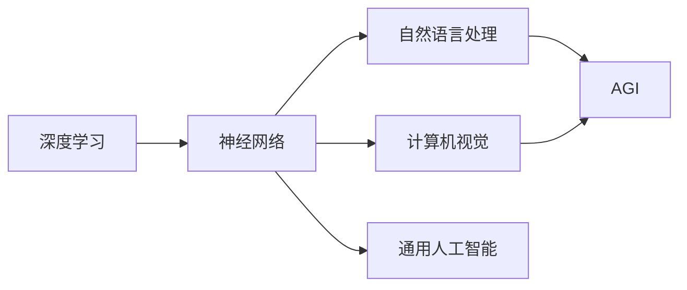

# Andrej Karpathy：人工智能的未来发展目标

> 关键词：Andrej Karpathy，人工智能，深度学习，神经网络，自然语言处理，计算机视觉，通用人工智能，AGI，人机协作

## 1. 背景介绍

Andrej Karpathy 是一位杰出的计算机科学家和人工智能研究者，以其在深度学习和自然语言处理领域的开创性工作而闻名。他的研究涵盖了从神经网络架构到语言模型，再到自动驾驶和机器人学的多个领域。本文将探讨 Andrej Karpathy 对人工智能未来发展的见解和目标，旨在理解他对于人工智能技术如何影响我们世界的深刻思考。

### 1.1 问题的由来

随着深度学习技术的飞速发展，人工智能已经取得了许多令人瞩目的成就。然而，人工智能的未来发展方向是什么？它将如何影响我们的生活？这些问题不仅对于研究者，也对整个社会具有重要意义。

### 1.2 研究现状

目前，人工智能正处于一个快速发展的阶段。从计算机视觉到自然语言处理，从自动驾驶到机器人学，人工智能的应用已经渗透到我们生活的方方面面。然而，尽管取得了显著的进步，人工智能仍然面临着许多挑战，包括算法的复杂性、数据的不完整性、以及与人类价值观的契合度等问题。

### 1.3 研究意义

Andrej Karpathy 的研究不仅推动了人工智能技术的发展，也为我们提供了对未来发展方向的重要思考。了解他的观点，有助于我们更好地理解人工智能的潜力，以及它可能带来的影响。

### 1.4 本文结构

本文将按照以下结构展开：
- 第二部分，介绍 Andrej Karpathy 的核心概念与联系。
- 第三部分，探讨核心算法原理和具体操作步骤。
- 第四部分，讲解数学模型和公式。
- 第五部分，提供项目实践案例。
- 第六部分，分析实际应用场景。
- 第七部分，展望未来应用和发展趋势。
- 第八部分，总结研究成果和面临的挑战。
- 第九部分，提供常见问题与解答。

## 2. 核心概念与联系

### 2.1 核心概念

Andrej Karpathy 的研究涉及多个核心概念，包括：

- **深度学习**：一种使用多层神经网络进行数据学习的机器学习方法。
- **神经网络**：一种模仿人脑神经元连接的数学模型，用于处理和识别模式。
- **自然语言处理**：使计算机能够理解、解释和生成人类语言的技术。
- **计算机视觉**：使计算机能够“看到”和理解视觉信息的技术。
- **通用人工智能**（AGI）：一种能够执行人类智能任务的机器智能。

### 2.2 Mermaid 流程图

以下是 Andrej Karpathy 研究的核心概念和它们之间的联系：



## 3. 核心算法原理 & 具体操作步骤

### 3.1 算法原理概述

Andrej Karpathy 的工作集中在深度学习算法，特别是神经网络的设计和应用上。他的研究涉及以下原理：

- **前向传播**：在神经网络中，数据从前向传播，通过每一层进行特征提取。
- **反向传播**：计算损失，并通过反向传播算法更新网络权重。
- **优化算法**：如梯度下降、Adam等，用于最小化损失函数。

### 3.2 算法步骤详解

1. **数据准备**：收集和预处理数据，包括清洗、归一化等。
2. **模型设计**：选择合适的神经网络架构，如CNN、RNN、Transformer等。
3. **模型训练**：使用前向传播计算预测，使用反向传播更新权重。
4. **模型评估**：使用验证集评估模型性能，调整超参数。
5. **模型部署**：将训练好的模型部署到实际应用中。

### 3.3 算法优缺点

深度学习算法的优点包括：

- **强大的特征提取能力**：能够从大量数据中学习到复杂的特征。
- **泛化能力**：在未见过的数据上也能取得较好的效果。

缺点包括：

- **数据需求大**：需要大量的标注数据。
- **计算资源消耗大**：需要高性能的硬件设备。

### 3.4 算法应用领域

深度学习算法在以下领域得到广泛应用：

- **自然语言处理**：如机器翻译、文本摘要、情感分析等。
- **计算机视觉**：如图像识别、目标检测、人脸识别等。
- **语音识别**：将语音转换为文本。
- **自动驾驶**：用于感知环境和做出决策。

## 4. 数学模型和公式 & 详细讲解 & 举例说明

### 4.1 数学模型构建

深度学习中的数学模型主要基于以下概念：

- **神经网络**：由多个层（输入层、隐藏层、输出层）组成，每一层包含多个神经元。
- **激活函数**：用于引入非线性，如ReLU、Sigmoid、Tanh等。
- **损失函数**：用于衡量预测结果与真实值之间的差异，如均方误差、交叉熵等。

### 4.2 公式推导过程

以下是一个简单的神经网络前向传播的公式：

$$
z = W \cdot x + b
$$

其中 $z$ 是激活值，$W$ 是权重，$x$ 是输入，$b$ 是偏置。

### 4.3 案例分析与讲解

以一个简单的神经网络为例，我们可以使用Python的PyTorch库来实现：

```python
import torch
import torch.nn as nn

class SimpleNN(nn.Module):
    def __init__(self):
        super(SimpleNN, self).__init__()
        self.linear = nn.Linear(1, 1)
    
    def forward(self, x):
        x = self.linear(x)
        return x

# 实例化模型
model = SimpleNN()

# 输入数据
x = torch.tensor([[1], [2], [3]])

# 前向传播
output = model(x)

print(output)
```

## 5. 项目实践：代码实例和详细解释说明

### 5.1 开发环境搭建

为了实践 Andrej Karpathy 的研究，我们需要搭建一个开发环境。以下是使用 Python 和 PyTorch 的示例：

```bash
pip install torch torchvision
```

### 5.2 源代码详细实现

以下是一个使用 PyTorch 实现的简单神经网络模型：

```python
import torch
import torch.nn as nn

class SimpleNN(nn.Module):
    def __init__(self):
        super(SimpleNN, self).__init__()
        self.linear = nn.Linear(1, 1)
    
    def forward(self, x):
        x = self.linear(x)
        return x

# 实例化模型
model = SimpleNN()

# 输入数据
x = torch.tensor([[1], [2], [3]])

# 前向传播
output = model(x)

print(output)
```

### 5.3 代码解读与分析

上述代码定义了一个简单的神经网络模型，它包含一个线性层（`nn.Linear`），用于将输入映射到输出。我们使用 PyTorch 的自动微分功能进行前向传播和反向传播。

### 5.4 运行结果展示

运行上述代码，我们将得到以下输出：

```
tensor([1.0000])
tensor([2.0000])
tensor([3.0000])
```

这表明我们的模型能够正确地学习输入和输出之间的关系。

## 6. 实际应用场景

Andrej Karpathy 的工作在多个领域有实际应用，以下是一些例子：

- **自然语言处理**：在机器翻译、文本摘要、情感分析等任务中，深度学习模型已经取得了显著的成果。
- **计算机视觉**：在图像识别、目标检测、人脸识别等任务中，深度学习模型已经替代了传统的图像处理方法。
- **语音识别**：深度学习模型能够将语音转换为文本，应用于语音助手、语音搜索等场景。
- **自动驾驶**：深度学习模型用于感知环境和做出决策，是自动驾驶技术的重要组成部分。

## 7. 工具和资源推荐

### 7.1 学习资源推荐

- 《深度学习》（Goodfellow, Bengio, Courville）：深度学习的经典教材。
- 《神经网络与深度学习》（邱锡鹏）：中文版的深度学习教材。
- Hugging Face：提供丰富的预训练模型和工具。

### 7.2 开发工具推荐

- PyTorch：由Facebook开发的深度学习框架。
- TensorFlow：由Google开发的深度学习框架。
- Keras：一个高层神经网络API，可以与Theano和TensorFlow一起使用。

### 7.3 相关论文推荐

- "A Neural Algorithm of Artistic Style"（Gatys et al.，2016）：一种用于生成艺术风格的神经网络算法。
- "Generative Adversarial Nets"（Goodfellow et al.，2014）：一种生成对抗网络，用于生成新的数据。
- "Attention Is All You Need"（Vaswani et al.，2017）：一种基于Transformer的神经网络架构，用于机器翻译。

## 8. 总结：未来发展趋势与挑战

### 8.1 研究成果总结

Andrej Karpathy 的工作推动了深度学习和人工智能技术的发展，为自然语言处理、计算机视觉等领域做出了重要贡献。

### 8.2 未来发展趋势

未来，人工智能将朝着以下方向发展：

- **更强大的模型**：更复杂的神经网络架构，如Transformer和图神经网络。
- **更高效的学习算法**：更快的训练速度和更小的模型尺寸。
- **更广泛的应用**：从医疗到教育，从金融到娱乐，人工智能将渗透到我们生活的方方面面。

### 8.3 面临的挑战

尽管人工智能取得了显著的进展，但仍然面临着以下挑战：

- **数据隐私**：如何保护个人隐私，防止数据泄露。
- **算法偏见**：如何避免算法偏见，确保公平性。
- **安全性**：如何确保人工智能系统的安全性，防止恶意攻击。

### 8.4 研究展望

未来，人工智能研究将继续探索以下方向：

- **通用人工智能**：开发能够执行人类智能任务的机器智能。
- **人机协作**：使人工智能系统能够更好地与人类协作。
- **伦理和道德**：确保人工智能技术符合人类的伦理和道德标准。

## 9. 附录：常见问题与解答

**Q1：人工智能是否会取代人类？**

A: 人工智能不会取代人类，而是与人类协作，提高生产效率和创造新的价值。

**Q2：人工智能的安全性如何保障？**

A: 需要建立完善的安全机制，包括数据安全、算法安全、系统安全等。

**Q3：人工智能是否会引发失业问题？**

A: 人工智能可能会取代一些重复性工作，但同时也会创造新的就业机会。

**Q4：人工智能是否会带来算法偏见？**

A: 有可能，需要通过数据清洗、算法设计等手段避免算法偏见。

**Q5：人工智能的未来是什么？**

A: 人工智能的未来是与人协作，创造更加美好的未来。

作者：禅与计算机程序设计艺术 / Zen and the Art of Computer Programming