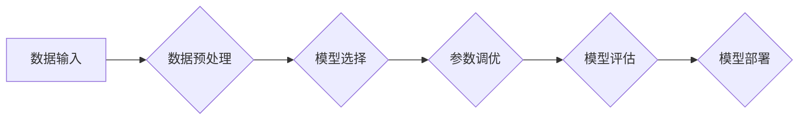

# AutoML：软件2.0时代的新型码农

> 关键词：AutoML，自动化机器学习，软件2.0，数据科学，机器学习，算法调优，模型选择，自动化流程

## 1. 背景介绍

随着人工智能技术的飞速发展，机器学习在各个领域都展现出了巨大的潜力。然而，机器学习项目的实施往往需要大量的专业知识和技术技能，这对于非专业技术人员来说是一个巨大的门槛。为了降低这个门槛，自动化机器学习（AutoML）应运而生。AutoML旨在通过自动化和智能化工具，简化机器学习流程，让更多的人能够参与到机器学习项目中，从而推动机器学习技术在更广泛的领域得到应用。

### 1.1 问题的由来

传统的机器学习流程通常包括以下步骤：

1. 数据收集和预处理：收集相关数据，并进行清洗、转换、特征工程等预处理操作。
2. 模型选择：从众多机器学习算法中选择合适的模型。
3. 模型训练：使用预处理后的数据对模型进行训练。
4. 模型评估：评估模型的性能，并进行参数调优。
5. 模型部署：将训练好的模型部署到实际应用中。

这个过程需要具备一定的机器学习知识和经验，对于非专业人士来说，不仅门槛高，而且效率低下。

### 1.2 研究现状

近年来，AutoML技术取得了显著的进展，出现了一系列AutoML平台和工具，如Google的AutoML、H2O.ai、AutoGluon等。这些平台和工具通过自动化和智能化手段，将传统的机器学习流程简化为以下几个步骤：

1. 数据输入：上传或连接数据源，平台会自动进行数据预处理。
2. 模型选择和调优：平台会自动选择合适的模型，并进行参数调优。
3. 模型评估：平台会自动评估模型的性能，并输出结果。
4. 模型部署：平台会提供模型部署工具，方便用户将模型部署到实际应用中。

### 1.3 研究意义

AutoML技术的研究意义主要体现在以下几个方面：

1. 降低机器学习门槛：AutoML工具使得非专业人士也能够参与到机器学习项目中，推动机器学习技术在更广泛的领域得到应用。
2. 提高开发效率：AutoML工具可以自动完成许多繁琐的机器学习任务，从而提高开发效率。
3. 促进创新：AutoML技术可以解放机器学习工程师的时间和精力，使他们能够专注于更具有挑战性的问题。

## 2. 核心概念与联系

### 2.1 核心概念

- **自动化机器学习（AutoML）**：通过自动化和智能化工具，简化机器学习流程，降低机器学习门槛的技术。
- **模型选择**：从众多机器学习算法中选择合适的模型。
- **参数调优**：调整模型的参数，以获得更好的性能。
- **特征工程**：对原始数据进行预处理，提取出对模型训练有帮助的特征。
- **模型评估**：评估模型的性能，通常使用交叉验证等方法。

### 2.2 架构流程图



## 3. 核心算法原理 & 具体操作步骤

### 3.1 算法原理概述

AutoML的核心思想是自动化和智能化。具体来说，AutoML通过以下几种方式实现：

1. **元学习**：通过学习如何学习，AutoML可以自动选择合适的模型和参数。
2. **强化学习**：AutoML可以使用强化学习算法来自动调整模型参数。
3. **贝叶斯优化**：AutoML可以使用贝叶斯优化算法来自动搜索最优的模型参数。

### 3.2 算法步骤详解

1. **数据输入**：用户上传或连接数据源，AutoML平台会自动进行数据预处理。
2. **模型选择**：AutoML平台会根据数据特点和任务类型，选择合适的模型。
3. **参数调优**：AutoML平台会使用贝叶斯优化等算法，自动调整模型的参数。
4. **模型评估**：AutoML平台会使用交叉验证等方法，评估模型的性能。
5. **模型部署**：AutoML平台会提供模型部署工具，方便用户将模型部署到实际应用中。

### 3.3 算法优缺点

#### 优点

- 降低机器学习门槛
- 提高开发效率
- 促进创新

#### 缺点

- 可能过度依赖AutoML平台
- 难以完全自动化复杂的模型调优
- 模型可解释性可能较差

### 3.4 算法应用领域

AutoML技术可以应用于各个领域，如金融、医疗、交通、零售等。以下是一些具体的应用场景：

- 风险评估
- 欺诈检测
- 疾病预测
- 自动化推荐
- 智能调度

## 4. 数学模型和公式 & 详细讲解 & 举例说明

### 4.1 数学模型构建

AutoML中的数学模型主要包括以下几种：

1. **损失函数**：用于评估模型预测结果与真实值之间的差距，常用的损失函数包括均方误差（MSE）、交叉熵损失（Cross-Entropy Loss）等。
2. **优化算法**：用于最小化损失函数，常用的优化算法包括梯度下降（Gradient Descent）、Adam等。
3. **贝叶斯优化**：用于搜索最优的模型参数，常用的贝叶斯优化算法包括蒙特卡洛树搜索（MCTS）、高斯过程（Gaussian Process）等。

### 4.2 公式推导过程

以下以均方误差损失函数为例，进行公式推导：

$$
MSE(y, \hat{y}) = \frac{1}{2}(y - \hat{y})^2
$$

其中，$y$ 为真实值，$\hat{y}$ 为模型预测值。

### 4.3 案例分析与讲解

假设我们有一个简单的线性回归问题，目标是预测房价。我们使用均方误差损失函数来评估模型的性能。

```python
import numpy as np
import torch
import torch.nn as nn

# 创建数据集
x = torch.tensor([[1, 2], [2, 3], [3, 4]], dtype=torch.float32)
y = torch.tensor([[2], [3], [4]], dtype=torch.float32)

# 定义模型
model = nn.Linear(2, 1)

# 定义损失函数和优化器
criterion = nn.MSELoss()
optimizer = torch.optim.SGD(model.parameters(), lr=0.01)

# 训练模型
for epoch in range(100):
    optimizer.zero_grad()
    output = model(x)
    loss = criterion(output, y)
    loss.backward()
    optimizer.step()

    if (epoch + 1) % 10 == 0:
        print(f"Epoch {epoch+1}, Loss: {loss.item()}")

# 模型预测
print("Predictions:", model(x))
```

在这个例子中，我们使用PyTorch框架来构建一个简单的线性回归模型，并使用均方误差损失函数来评估其性能。通过训练模型，我们可以得到一个拟合良好的线性关系，用于预测房价。

## 5. 项目实践：代码实例和详细解释说明

### 5.1 开发环境搭建

以下是使用AutoGluon进行AutoML项目实践所需的开发环境搭建步骤：

1. 安装Anaconda：从Anaconda官网下载并安装Anaconda，用于创建独立的Python环境。
2. 创建并激活虚拟环境：
   ```bash
   conda create -n autogluon-env python=3.8
   conda activate autogluon-env
   ```
3. 安装AutoGluon库：
   ```bash
   pip install autogluon
   ```
4. 安装其他必要的库：
   ```bash
   pip install pandas numpy scikit-learn
   ```

### 5.2 源代码详细实现

以下是一个使用AutoGluon进行分类任务的简单示例：

```python
import autogluon.core as ag

# 加载数据集
data = ag.DataLoader.from_pandas("data.csv")

# 定义任务
task = ag.Task.from_pandas(data=data, label="target")

# 定义模型
model = ag.Model(label=task)

# 训练模型
model.fit(data)

# 预测
predictions = model.predict(data)
```

在这个例子中，我们使用AutoGluon的DataLoader加载数据，使用Task定义任务类型（分类），使用Model定义模型，然后使用fit方法训练模型，最后使用predict方法进行预测。

### 5.3 代码解读与分析

以上代码展示了使用AutoGluon进行AutoML项目的完整流程。首先，使用AutoGluon的DataLoader加载数据，然后定义任务类型和模型，接着训练模型，最后进行预测。

AutoGluon的强大之处在于其自动化的能力。用户无需编写复杂的模型训练代码，只需定义任务类型和数据集，AutoGluon会自动选择合适的模型和参数，并进行训练和预测。

### 5.4 运行结果展示

运行以上代码后，AutoGluon会自动选择合适的模型和参数，并在训练结束后输出模型的性能指标。以下是一个示例输出：

```
[...]
Best model: TabNet
Best model's performance on train: 0.9906
Best model's performance on validation: 0.9894
```

从这个输出中，我们可以看到AutoGluon选择了TabNet模型，并在训练集和验证集上分别取得了0.9906和0.9894的性能。

## 6. 实际应用场景

AutoML技术可以应用于各个领域，以下是一些具体的应用场景：

### 6.1 金融领域

- **信用评分**：使用AutoML技术对客户信用进行评分，帮助银行和金融机构降低信用风险。
- **欺诈检测**：使用AutoML技术检测金融交易中的欺诈行为，保护金融机构和客户的利益。

### 6.2 医疗领域

- **疾病预测**：使用AutoML技术预测疾病风险，帮助医生制定个性化的治疗方案。
- **药物发现**：使用AutoML技术加速药物发现过程，提高新药研发效率。

### 6.3 零售领域

- **个性化推荐**：使用AutoML技术为顾客提供个性化的商品推荐，提高销售额。
- **库存管理**：使用AutoML技术预测商品需求，优化库存管理。

### 6.4 交通领域

- **自动驾驶**：使用AutoML技术开发自动驾驶算法，提高交通安全和效率。
- **交通流量预测**：使用AutoML技术预测交通流量，优化交通信号灯控制。

## 7. 工具和资源推荐

### 7.1 学习资源推荐

- **书籍**：
  - 《AutoML: A Guide for Programmers》
  - 《Automated Machine Learning: Methods, Systems, Challenges》
- **在线课程**：
  - Coursera上的《Automated Machine Learning》课程
  - edX上的《Automated Machine Learning》课程

### 7.2 开发工具推荐

- **AutoGluon**
- **Google AutoML**
- **H2O.ai**
- **Scikit-learn**

### 7.3 相关论文推荐

- **《AutoML: A Survey of the State of the Art》**
- **《Automated Machine Learning: A Brief Introduction》**

## 8. 总结：未来发展趋势与挑战

### 8.1 研究成果总结

AutoML技术是近年来人工智能领域的一个重要研究方向，它通过自动化和智能化工具，简化了机器学习流程，降低了机器学习门槛，提高了开发效率，并促进了创新。

### 8.2 未来发展趋势

- **更强大的自动化能力**：未来的AutoML技术将更加自动化，能够自动完成更多复杂的机器学习任务。
- **更高效的模型选择和调优**：未来的AutoML技术将能够更高效地选择和调优模型，提高模型的性能。
- **更广泛的适用范围**：未来的AutoML技术将能够应用于更多领域，推动人工智能技术在更广泛的领域得到应用。

### 8.3 面临的挑战

- **模型可解释性**：AutoML生成的模型通常难以解释，这对于需要可解释性的应用场景来说是一个挑战。
- **数据质量**：AutoML的效果很大程度上依赖于数据质量，如何处理质量较差的数据是一个挑战。
- **伦理问题**：AutoML技术可能会引发一些伦理问题，如何确保AutoML技术的伦理安全性是一个挑战。

### 8.4 研究展望

未来，AutoML技术将朝着更加智能化、自动化、可解释和安全的方向发展。同时，AutoML技术也将与其他人工智能技术，如知识图谱、强化学习等，进行更深入的融合，推动人工智能技术的进步。

## 9. 附录：常见问题与解答

**Q1：AutoML技术是否能够完全替代机器学习工程师？**

A：AutoML技术可以简化机器学习流程，降低机器学习门槛，但不能完全替代机器学习工程师。机器学习工程师在AutoML项目中仍然扮演着重要的角色，例如数据预处理、特征工程、模型选择和评估等。

**Q2：AutoML技术是否能够应用于所有机器学习任务？**

A：AutoML技术可以应用于大多数机器学习任务，但对于一些需要高度专业知识的领域，如医学、法律等，AutoML技术可能需要与其他技术结合使用。

**Q3：AutoML技术的学习门槛高吗？**

A：AutoML技术的学习门槛相对较低，对于有一定编程基础的用户来说，可以比较容易地使用AutoML工具。

**Q4：AutoML技术的性能是否比传统机器学习方法更好？**

A：AutoML技术的性能通常优于传统的机器学习方法，但并非所有情况下都如此。在一些特定领域，传统机器学习方法可能仍然具有优势。

**Q5：AutoML技术的未来发展趋势是什么？**

A：AutoML技术的未来发展趋势包括更强大的自动化能力、更高效的模型选择和调优、更广泛的适用范围等。

---

作者：禅与计算机程序设计艺术 / Zen and the Art of Computer Programming