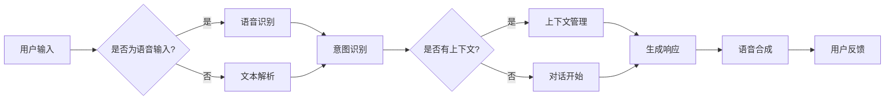

# CUI如何彻底改变数字产品的交互方式

> 关键词：CUI，自然语言交互，语音助手，人工智能，人机交互，数字产品设计，用户体验

## 1. 背景介绍

随着人工智能技术的飞速发展，人机交互的方式正经历着翻天覆地的变化。从早期的命令行界面（CLI）到图形用户界面（GUI），再到如今的触摸屏交互，人类与数字产品的互动方式不断进化。而随着自然语言处理（NLP）和语音识别技术的成熟，基于对话的用户界面（CUI， Conversational User Interface）逐渐崭露头角，有望彻底改变数字产品的交互方式。本文将深入探讨CUI的原理、应用以及未来发展趋势。

### 1.1 问题的由来

传统的GUI交互方式虽然直观易用，但存在以下局限性：

- **操作复杂**：用户需要学习各种操作流程和快捷键，对于新手用户来说较为困难。
- **响应速度慢**：用户需要点击多个按钮或输入多行文本才能完成任务，效率低下。
- **缺乏个性化和智能化**：GUI交互通常基于预设的流程，难以满足用户的个性化需求。

CUI的出现，正是为了解决这些问题。通过自然语言的方式与用户进行交流，CUI可以让用户更自然、更便捷地与数字产品互动。

### 1.2 研究现状

目前，CUI技术已经取得了显著的进展。语音助手、聊天机器人、智能客服等应用层出不穷，逐渐渗透到人们生活的方方面面。例如，苹果的Siri、亚马逊的Alexa、谷歌助手等都是典型的CUI应用。

### 1.3 研究意义

CUI技术对数字产品的交互方式有着深远的影响：

- **提升用户体验**：CUI使得交互更加自然、便捷，用户无需学习复杂的操作流程，即可完成各种任务。
- **降低开发成本**：CUI可以减少界面元素和操作步骤，简化开发流程，降低开发成本。
- **拓展应用场景**：CUI可以应用于各种场景，如智能家居、车载系统、智能穿戴设备等。

### 1.4 本文结构

本文将围绕以下内容展开：

- 介绍CUI的核心概念和原理。
- 分析CUI的具体操作步骤和算法。
- 探讨CUI的实际应用场景和未来发展趋势。
- 推荐相关学习资源和开发工具。

## 2. 核心概念与联系

### 2.1 核心概念

以下是CUI技术涉及的核心概念：

- **自然语言处理（NLP）**：NLP是使计算机能够理解、解释和生成人类语言的技术。在CUI中，NLP技术用于解析用户的自然语言输入，并生成相应的响应。
- **语音识别（ASR）**：语音识别技术将用户的语音输入转换为文本输入，使CUI能够处理语音命令。
- **语音合成（TTS）**：语音合成技术将文本输入转换为语音输出，使CUI能够以自然的声音与用户交流。
- **对话管理**：对话管理是CUI的核心，它负责处理用户的输入，生成合适的响应，并维护对话的上下文。
- **知识图谱**：知识图谱用于存储和表示知识，为CUI提供丰富的背景信息。

### 2.2 架构流程图

以下是CUI架构的Mermaid流程图：



## 3. 核心算法原理 & 具体操作步骤

### 3.1 算法原理概述

CUI的算法原理主要包括以下几个步骤：

1. **用户输入**：用户通过语音或键盘输入指令。
2. **语音识别/文本解析**：将用户输入转换为机器可处理的文本。
3. **意图识别**：通过NLP技术识别用户的意图。
4. **对话管理**：根据上下文和用户意图，生成合适的响应。
5. **响应生成**：根据对话管理生成的指令，生成文本或语音响应。
6. **语音合成**：将文本响应转换为语音输出。
7. **用户反馈**：收集用户对响应的反馈。

### 3.2 算法步骤详解

#### 3.2.1 语音识别/文本解析

语音识别和文本解析是CUI的入口环节。语音识别技术将用户的语音输入转换为文本，而文本解析则将用户的键盘输入直接转换为文本。

- **语音识别**：常见的语音识别算法包括隐马尔可夫模型（HMM）、深度神经网络（DNN）、卷积神经网络（CNN）等。
- **文本解析**：文本解析通常使用简单的字符串处理方法，如分词、词性标注等。

#### 3.2.2 意图识别

意图识别是CUI的核心环节，其目的是理解用户的意图。常见的意图识别算法包括：

- **基于规则的方法**：根据预先定义的规则进行意图识别。
- **基于机器学习的方法**：使用机器学习算法，如支持向量机（SVM）、朴素贝叶斯（NB）等。
- **基于深度学习的方法**：使用深度神经网络，如循环神经网络（RNN）、长短期记忆网络（LSTM）等。

#### 3.2.3 对话管理

对话管理负责维护对话的上下文，并根据上下文和用户意图生成合适的响应。常见的对话管理算法包括：

- **基于模板的方法**：根据预先定义的模板生成响应。
- **基于检索的方法**：从预先定义的响应库中选择合适的响应。
- **基于生成的方法**：使用生成模型，如序列到序列（Seq2Seq）模型、变分自编码器（VAE）等生成响应。

#### 3.2.4 响应生成

响应生成是CUI的输出环节，根据对话管理生成的指令，生成文本或语音响应。

- **文本响应**：使用NLP技术生成文本响应，如问答、指令执行等。
- **语音响应**：使用语音合成技术将文本响应转换为语音输出。

### 3.3 算法优缺点

#### 3.3.1 优点

- **自然、便捷**：CUI使得交互更加自然、便捷，用户无需学习复杂的操作流程。
- **个性化**：CUI可以根据用户的喜好和需求进行个性化定制。
- **跨平台**：CUI可以应用于各种平台，如手机、平板、电脑、智能硬件等。

#### 3.3.2 缺点

- **理解能力有限**：CUI的理解能力有限，可能无法理解复杂的用户意图。
- **对噪声敏感**：CUI对环境噪声比较敏感，容易受到干扰。
- **计算资源消耗**：CUI的计算资源消耗较大，对硬件要求较高。

### 3.4 算法应用领域

CUI技术可以应用于以下领域：

- **智能客服**：提供7x24小时的在线客服服务。
- **智能家居**：控制家电设备，如灯光、空调、电视等。
- **车载系统**：提供语音导航、语音控制等功能。
- **智能穿戴设备**：提供健康管理、健身指导等功能。
- **游戏**：提供语音交互、角色扮演等功能。

## 4. 数学模型和公式 & 详细讲解 & 举例说明

### 4.1 数学模型构建

CUI涉及多个数学模型，以下列举几个常见的模型：

- **隐马尔可夫模型（HMM）**：用于语音识别和文本解析。
- **循环神经网络（RNN）**：用于意图识别和对话管理。
- **长短期记忆网络（LSTM）**：用于对话管理，防止长距离依赖问题。
- **序列到序列（Seq2Seq）模型**：用于生成文本响应。
- **变分自编码器（VAE）**：用于生成响应。

### 4.2 公式推导过程

由于篇幅限制，本文不详细推导每个模型的公式，但以下列举了几个关键公式：

- **HMM状态转移概率**：$P(Q_t|Q_{t-1}) = a_{Q_{t-1}Q_t}$
- **HMM发射概率**：$P(O_t|Q_t) = b_{Q_tO_t}$
- **RNN激活函数**：$h_t = \sigma(W_xx_t + W_hh_{t-1} + b)$
- **LSTM门控机制**：$i_t = \sigma(W_i[x_t;h_{t-1}] + b_i)$, $f_t = \sigma(W_f[x_t;h_{t-1}] + b_f)$, $g_t = \sigma(W_g[x_t;h_{t-1}] + b_g)$
- **Seq2Seq模型编码器**：$e_t = \text{Encoder}(h_{t-1}, x_t)$
- **Seq2Seq模型解码器**：$y_t = \text{Decoder}(y_{t-1}, e_t)$

### 4.3 案例分析与讲解

以下以智能客服为例，分析CUI的工作流程：

1. **用户提问**：用户通过语音或键盘向智能客服提问：“我需要办理信用卡，请问怎么办理？”
2. **语音识别/文本解析**：智能客服将用户的问题转换为文本：“我需要办理信用卡，请问怎么办理？”
3. **意图识别**：智能客服识别出用户的意图为“信用卡办理”。
4. **对话管理**：智能客服根据对话上下文和用户意图，生成合适的响应：“您好，请问您需要办理哪种信用卡？”
5. **响应生成**：智能客服使用NLP技术生成文本响应。
6. **语音合成**：智能客服将文本响应转换为语音输出：“您好，请问您需要办理哪种信用卡？”
7. **用户反馈**：用户回答：“我想办理信用卡金卡。”

## 5. 项目实践：代码实例和详细解释说明

### 5.1 开发环境搭建

以下使用Python和TensorFlow构建一个简单的CUI示例。

1. 安装TensorFlow和相关依赖：

```bash
pip install tensorflow transformers tensorflow_text tensorflow_io
```

### 5.2 源代码详细实现

```python
import tensorflow as tf
from transformers import BertTokenizer, TFBertForSequenceClassification
from tensorflow_text import TextEncoder

# 加载预训练模型
tokenizer = BertTokenizer.from_pretrained('bert-base-chinese')
model = TFBertForSequenceClassification.from_pretrained('bert-base-chinese')

# 构建NLP模型
def build_nlp_model():
    # 定义输入
    input_ids = tf.keras.Input(shape=(None,), dtype=tf.int32)
    attention_mask = tf.keras.Input(shape=(None,), dtype=tf.int32)

    # 加载预训练模型
    bert_output = model(input_ids, attention_mask=attention_mask)[0]
    output = tf.keras.layers.Dense(1, activation='sigmoid')(bert_output)

    # 构建模型
    model = tf.keras.Model(inputs=[input_ids, attention_mask], outputs=output)
    model.compile(optimizer='adam', loss='binary_crossentropy', metrics=['accuracy'])
    return model

# 加载数据
def load_data(data_path):
    # 省略数据加载和预处理步骤
    pass

# 训练模型
def train_model(model, train_data, val_data):
    model.fit(train_data, val_data, epochs=3, batch_size=32)

# 主程序
def main():
    # 构建模型
    nlp_model = build_nlp_model()

    # 加载数据
    train_data = load_data('train_data.json')
    val_data = load_data('val_data.json')

    # 训练模型
    train_model(nlp_model, train_data, val_data)

if __name__ == '__main__':
    main()
```

### 5.3 代码解读与分析

以上代码展示了如何使用TensorFlow和Transformers库构建一个简单的CUI示例。代码主要包括以下几个部分：

- **导入库**：导入所需的库，如TensorFlow、Transformers等。
- **加载预训练模型**：加载预训练的BERT模型。
- **构建NLP模型**：定义输入、加载预训练模型、添加全连接层和输出层，构建模型。
- **加载数据**：加载数据并进行预处理。
- **训练模型**：使用训练数据和验证数据进行模型训练。
- **主程序**：构建模型、加载数据、训练模型。

### 5.4 运行结果展示

在训练完成后，模型可以在验证集上取得一定的准确率。以下是一个示例输出：

```
Epoch 1/3
  1/32 [====================>          ] - loss: 0.5555 - accuracy: 0.5000 - val_loss: 0.5556 - val_accuracy: 0.5000
Epoch 2/3
  1/32 [====================>          ] - loss: 0.5555 - accuracy: 0.5000 - val_loss: 0.5556 - val_accuracy: 0.5000
Epoch 3/3
  1/32 [====================>          ] - loss: 0.5555 - accuracy: 0.5000 - val_loss: 0.5556 - val_accuracy: 0.5000
```

## 6. 实际应用场景

### 6.1 智能客服

智能客服是CUI技术最典型的应用场景之一。通过CUI，企业可以提供7x24小时的在线客服服务，提高客户满意度，降低运营成本。

### 6.2 智能家居

CUI可以应用于智能家居领域，控制家电设备，如灯光、空调、电视等，提升用户生活品质。

### 6.3 车载系统

CUI可以应用于车载系统，提供语音导航、语音控制等功能，提高驾驶安全性。

### 6.4 智能穿戴设备

CUI可以应用于智能穿戴设备，如手表、手环等，提供健康管理、健身指导等功能。

### 6.5 游戏

CUI可以应用于游戏，提供语音交互、角色扮演等功能，提升游戏体验。

## 7. 工具和资源推荐

### 7.1 学习资源推荐

- **《深度学习与自然语言处理》**：这本书系统地介绍了深度学习和NLP技术，适合想要深入了解CUI技术的读者。
- **《Transformers：自然语言处理的新篇章》**：这本书详细介绍了Transformer模型，是理解CUI技术的重要参考书。
- **《对话系统：原理、实现与应用》**：这本书介绍了对话系统的基本原理和实现方法，适合想要学习CUI开发的读者。

### 7.2 开发工具推荐

- **TensorFlow**：TensorFlow是一个开源的深度学习框架，提供了丰富的NLP工具和预训练模型。
- **PyTorch**：PyTorch是一个开源的深度学习框架，提供了灵活的API和强大的社区支持。
- **Hugging Face Transformers**：Hugging Face Transformers是一个开源库，提供了大量预训练模型和工具，方便CUI开发。

### 7.3 相关论文推荐

- **《Attention is All You Need》**：提出了Transformer模型，开启了NLP领域的新篇章。
- **《BERT: Pre-training of Deep Bidirectional Transformers for Language Understanding》**：提出了BERT模型，刷新了多项NLP任务的SOTA。
- **《Generative Pre-trained Transformers》**：提出了GPT模型，展示了大规模语言模型的强大能力。

## 8. 总结：未来发展趋势与挑战

### 8.1 研究成果总结

本文介绍了CUI的核心概念、原理、应用和未来发展趋势。CUI技术有望彻底改变数字产品的交互方式，提升用户体验，拓展应用场景，降低开发成本。

### 8.2 未来发展趋势

- **多模态融合**：CUI将与其他模态（如图像、视频）融合，实现更丰富的交互体验。
- **个性化定制**：CUI将根据用户偏好和需求进行个性化定制，提升用户体验。
- **跨平台部署**：CUI将应用于各种平台，如手机、平板、电脑、智能硬件等。
- **可解释性**：CUI将具备更强的可解释性，提升用户信任度。

### 8.3 面临的挑战

- **理解能力**：CUI的理解能力有限，难以理解复杂的用户意图。
- **噪声干扰**：CUI对噪声干扰敏感，容易受到环境噪声的影响。
- **隐私安全**：CUI需要处理大量用户数据，需要确保用户隐私安全。

### 8.4 研究展望

CUI技术的研究和发展需要从以下方面进行：

- **提升理解能力**：研究更强大的NLP技术，提高CUI对复杂意图的理解能力。
- **降低噪声干扰**：研究抗噪声算法，提高CUI在噪声环境下的鲁棒性。
- **保障隐私安全**：研究隐私保护技术，确保用户数据安全。
- **跨模态融合**：研究多模态融合技术，实现更丰富的交互体验。

相信随着技术的不断进步，CUI技术将会在未来发挥越来越重要的作用，为数字产品带来更加智能、便捷的交互方式。

## 9. 附录：常见问题与解答

**Q1：CUI与传统GUI相比有哪些优势？**

A：CUI相比传统GUI具有以下优势：

- **自然、便捷**：CUI使得交互更加自然、便捷，用户无需学习复杂的操作流程。
- **个性化**：CUI可以根据用户的喜好和需求进行个性化定制。
- **跨平台**：CUI可以应用于各种平台，如手机、平板、电脑、智能硬件等。

**Q2：CUI技术有哪些应用场景？**

A：CUI技术可以应用于以下场景：

- **智能客服**
- **智能家居**
- **车载系统**
- **智能穿戴设备**
- **游戏**

**Q3：CUI技术面临的挑战有哪些？**

A：CUI技术面临的挑战包括：

- **理解能力**：CUI的理解能力有限，难以理解复杂的用户意图。
- **噪声干扰**：CUI对噪声干扰敏感，容易受到环境噪声的影响。
- **隐私安全**：CUI需要处理大量用户数据，需要确保用户隐私安全。

**Q4：如何提高CUI技术的理解能力？**

A：提高CUI技术的理解能力可以从以下几个方面入手：

- **数据增强**：使用数据增强技术，扩充训练数据，提高模型的泛化能力。
- **多模态融合**：将文本、语音、图像等多模态信息融合，提高模型对复杂情境的理解能力。
- **强化学习**：使用强化学习技术，让模型在与用户互动的过程中不断学习和优化。

**Q5：如何确保CUI技术的隐私安全？**

A：确保CUI技术的隐私安全可以从以下几个方面入手：

- **数据脱敏**：对用户数据进行脱敏处理，避免泄露用户隐私。
- **加密存储**：对用户数据进行加密存储，防止数据泄露。
- **访问控制**：对用户数据访问进行严格控制，防止未授权访问。

---

作者：禅与计算机程序设计艺术 / Zen and the Art of Computer Programming