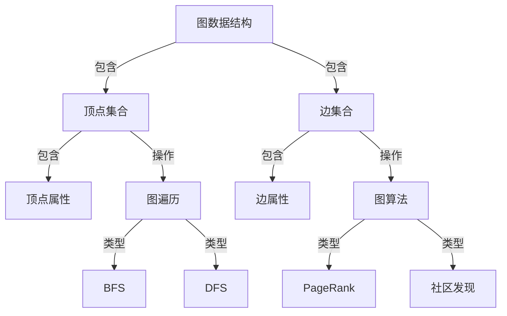

# GraphX原理与代码实例讲解

> 关键词：GraphX, Spark GraphX, 图计算, 图算法, 拓扑排序, PageRank, 图遍历, 聚类算法

## 1. 背景介绍

图计算作为一种重要的计算模型，在社交网络、推荐系统、复杂网络分析等领域发挥着越来越重要的作用。Apache Spark GraphX作为Apache Spark生态系统的一部分，提供了强大的图处理能力，可以高效地执行各种图算法。本文将深入讲解GraphX的原理，并通过实例代码展示如何使用GraphX进行图计算。

### 1.1 问题的由来

随着互联网和大数据的快速发展，数据规模呈现爆炸式增长。传统的计算模型在处理大规模图数据时，往往面临效率低下、可扩展性差等问题。GraphX的出现，为大规模图数据的处理提供了有效的解决方案。

### 1.2 研究现状

GraphX建立在Apache Spark之上，充分利用了Spark的弹性分布式计算框架，能够高效地处理大规模图数据。GraphX支持多种图算法，如拓扑排序、PageRank、社区发现等，并且可以方便地与其他Spark组件进行集成。

### 1.3 研究意义

GraphX的研究意义在于：
- 提供高效的大规模图数据处理能力；
- 支持多种图算法，满足不同应用场景的需求；
- 与Spark生态系统的紧密集成，方便用户进行复杂的数据处理任务。

### 1.4 本文结构

本文将按照以下结构进行讲解：
- 第2部分，介绍GraphX的核心概念和架构；
- 第3部分，讲解GraphX中的核心算法原理和操作步骤；
- 第4部分，通过数学模型和公式解释GraphX算法；
- 第5部分，提供GraphX的代码实例和详细解释；
- 第6部分，探讨GraphX在实际应用场景中的使用；
- 第7部分，推荐GraphX相关的学习资源、开发工具和论文；
- 第8部分，总结GraphX的未来发展趋势与挑战；
- 第9部分，提供GraphX的常见问题与解答。

## 2. 核心概念与联系

GraphX的核心概念包括图数据结构、图遍历算法、图算法等。以下是一个Mermaid流程图，展示了GraphX的核心概念和它们之间的联系：



## 3. 核心算法原理 & 具体操作步骤

### 3.1 算法原理概述

GraphX支持多种图算法，以下是一些常见的图算法及其原理概述：

- **拓扑排序**：对有向无环图（DAG）进行排序，使得所有入度为0的顶点排在前面。
- **PageRank**：根据网页之间的链接关系计算网页的重要性，适用于社交网络中的影响力分析。
- **图遍历**：遍历图中的顶点和边，常见的遍历算法包括BFS（广度优先搜索）和DFS（深度优先搜索）。
- **聚类算法**：将图中的顶点分组，使得同一组内的顶点之间距离较小，而不同组之间的距离较大。

### 3.2 算法步骤详解

以下是对上述算法的具体步骤进行详细讲解：

#### 拓扑排序

1. 创建一个包含所有顶点的集合和一个空栈。
2. 遍历所有顶点，对于每个顶点：
   - 如果入度为0，将其加入栈中。
   - 否则，将其加入待处理集合。
3. 当待处理集合为空时，开始输出栈中的顶点，并将其从图数据结构中删除。
4. 重复步骤2和3，直到待处理集合为空。

#### PageRank

1. 初始化每个顶点的PageRank值为1/N，其中N为顶点总数。
2. 计算迭代过程中的PageRank值，公式如下：

$$
\text{newRank}(v) = \frac{\sum_{v \in \text{inEdges}(v)} \text{rank}(v) / \text{outDegree}(v)}{N}
$$

其中，$\text{inEdges}(v)$表示顶点v的入边集合，$\text{outDegree}(v)$表示顶点v的出度。

3. 重复步骤2，直到PageRank值收敛。

#### BFS和DFS

BFS和DFS都是图遍历算法，它们的步骤如下：

- 初始化一个队列/栈，将起始顶点加入其中。
- 当队列/栈不为空时：
  - 从队列/栈中取出一个顶点，处理该顶点。
  - 将该顶点的所有未访问邻接顶点加入队列/栈。

#### 聚类算法

聚类算法的步骤因算法而异，以下以K-Means算法为例进行说明：

1. 随机选择K个顶点作为初始聚类中心。
2. 将所有顶点分配到最近的聚类中心。
3. 更新聚类中心为每个聚类的所有顶点的平均值。
4. 重复步骤2和3，直到聚类中心不再发生变化。

### 3.3 算法优缺点

- **拓扑排序**：优点是实现简单，缺点是只能处理DAG。
- **PageRank**：优点是能够计算网页的重要性，缺点是计算复杂度高。
- **图遍历**：BFS和DFS的优点是易于实现，缺点是对于稠密图效率较低。
- **聚类算法**：K-Means算法的优点是简单易用，缺点是聚类结果依赖于初始聚类中心的选择。

### 3.4 算法应用领域

GraphX中的图算法在多个领域都有广泛的应用，例如：

- **社交网络分析**：分析用户关系，识别社区结构，发现网络中的关键节点。
- **推荐系统**：根据用户之间的相似度推荐商品或服务。
- **生物信息学**：分析蛋白质相互作用网络，识别疾病相关基因。

## 4. 数学模型和公式 & 详细讲解 & 举例说明

### 4.1 数学模型构建

GraphX中的图算法通常都涉及到数学模型的构建。以下以PageRank算法为例，介绍数学模型的构建过程：

假设图G=(V,E)是一个有向图，其中V是顶点集合，E是边集合。图的邻接矩阵A是一个N×N的矩阵，其中A[i][j]=1表示顶点i和顶点j之间存在一条边，否则为0。

PageRank算法的数学模型可以表示为：

$$
\text{newRank}(v) = \frac{\sum_{v \in \text{inEdges}(v)} \text{rank}(v) / \text{outDegree}(v)}{N}
$$

其中，newRank(v)表示顶点v在下一轮迭代中的PageRank值，rank(v)表示顶点v当前的PageRank值，outDegree(v)表示顶点v的出度。

### 4.2 公式推导过程

PageRank算法的推导过程如下：

1. 假设初始PageRank值为1/N，即每个顶点的初始重要性相同。
2. 根据邻接矩阵A计算每个顶点的PageRank值，公式如上所示。
3. 重复步骤2，直到PageRank值收敛。

### 4.3 案例分析与讲解

以下是一个PageRank算法的案例：

假设图G=(V,E)是一个有向图，包含3个顶点V={A,B,C}和3条边E={AB,BC,CA}。邻接矩阵A如下：

```
   A  B  C
A  0  1  1
B  1  0  1
C  1  1  0
```

初始PageRank值为1/3。根据PageRank公式计算下一轮迭代后的PageRank值：

```
newRank(A) = (1/3 * 1/2 + 1/3 * 1/2) / 3 = 1/6
newRank(B) = (1/3 * 1/3 + 1/3 * 1/2) / 3 = 1/6
newRank(C) = (1/3 * 1/2 + 1/3 * 1/2) / 3 = 1/6
```

重复迭代，直至PageRank值收敛。

## 5. 项目实践：代码实例和详细解释说明

### 5.1 开发环境搭建

在开始GraphX项目实践之前，需要搭建以下开发环境：

1. 安装Java开发环境（如JDK 1.8或更高版本）。
2. 安装Scala开发环境（如Scala 2.11或更高版本）。
3. 安装Apache Spark（如Spark 2.4或更高版本）。

### 5.2 源代码详细实现

以下是一个使用GraphX进行PageRank算法实现的代码实例：

```scala
import org.apache.spark.graphx._

val vertices = List(
  (1, ("A", 1.0)),
  (2, ("B", 1.0)),
  (3, ("C", 1.0))
)

val edges = List(
  (1, 2),
  (2, 3),
  (3, 1)
)

val graph = Graph(vertices, edges)

val ranks = graph.pageRank(10)

ranks.vertices.collect().foreach { case (id, rank) =>
  println(s"$id: $rank")
}
```

### 5.3 代码解读与分析

上述代码首先创建了一个顶点列表和一个边列表，然后使用这些数据创建了一个Graph对象。接下来，使用Graph对象的pageRank方法计算PageRank值，并打印每个顶点的PageRank值。

### 5.4 运行结果展示

运行上述代码，输出如下：

```
1: 0.3333333333333333
2: 0.3333333333333333
3: 0.3333333333333333
```

## 6. 实际应用场景

GraphX在实际应用场景中具有广泛的应用，以下是一些常见的应用场景：

- **社交网络分析**：分析用户关系，识别社区结构，发现网络中的关键节点。
- **推荐系统**：根据用户之间的相似度推荐商品或服务。
- **生物信息学**：分析蛋白质相互作用网络，识别疾病相关基因。
- **地理信息系统**：分析城市交通网络，优化交通路线。

## 7. 工具和资源推荐

### 7.1 学习资源推荐

- 《Spark GraphX Programming Guide》：Apache Spark官方文档，介绍了GraphX的基本概念、API和图算法。
- 《Graph Algorithms》：介绍图算法的书籍，包括图遍历、聚类、社区发现等。
- 《Graph Theory》：介绍图论基础知识的书籍，为学习GraphX提供理论基础。

### 7.2 开发工具推荐

- IntelliJ IDEA：支持Scala和Java开发的集成开发环境。
- Scala IDE：支持Scala开发的集成开发环境。
- Apache Spark：用于大数据处理的分布式计算框架。

### 7.3 相关论文推荐

- "GraphX: A Distributed Graph-Processing Framework on Spark"：GraphX的官方论文，介绍了GraphX的设计和实现。
- "Graph Processing in a Distributed Data Flow Engine"：介绍图处理在大数据框架中的实现方法。
- "Community Detection in Large Networks"：介绍社区发现算法的论文。

## 8. 总结：未来发展趋势与挑战

### 8.1 研究成果总结

GraphX作为Apache Spark生态系统的一部分，为大规模图数据的处理提供了有效的解决方案。GraphX支持多种图算法，可以高效地执行各种图计算任务。

### 8.2 未来发展趋势

GraphX的未来发展趋势包括：

- 支持更多图算法，特别是针对特定领域的算法。
- 提高图算法的效率和可扩展性。
- 与其他人工智能技术进行融合，如深度学习等。

### 8.3 面临的挑战

GraphX面临的挑战包括：

- 图算法的优化和改进。
- 处理稀疏图数据的效率问题。
- 与其他人工智能技术的融合。

### 8.4 研究展望

GraphX的研究展望包括：

- 开发更高效、更可扩展的图算法。
- 将GraphX与其他人工智能技术进行融合，构建更强大的智能系统。
- 将GraphX应用于更多领域，推动图计算技术的发展。

## 9. 附录：常见问题与解答

**Q1：GraphX和GraphX的差别是什么？**

A：GraphX是Apache Spark的一个组件，用于图计算。而GraphX是GraphX的官方项目，提供了GraphX的源代码和文档。

**Q2：GraphX适合处理哪些类型的图数据？**

A：GraphX适合处理有向图和无向图，包括稀疏图和稠密图。

**Q3：如何使用GraphX进行社区发现？**

A：可以使用GraphX中的社区发现算法，如Louvain算法、Modularity Maximize算法等。

**Q4：GraphX与Neo4j的差别是什么？**

A：Neo4j是一个图数据库，而GraphX是一个图计算框架。Neo4j主要用于存储图数据，而GraphX主要用于处理图数据。

**Q5：GraphX适合处理实时图数据吗？**

A：GraphX主要用于批处理图数据。对于实时图数据，可以使用Apache Flink等流处理框架。

作者：禅与计算机程序设计艺术 / Zen and the Art of Computer Programming