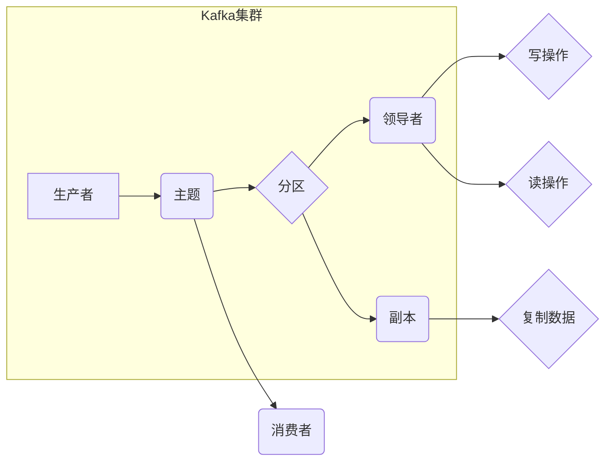

# Kafka原理与代码实例讲解

> 关键词：Kafka, 分布式流处理，消息队列，主题，分区，消费者，生产者，Zookeeper，副本，分布式系统

## 1. 背景介绍

随着互联网的快速发展，大数据和实时数据处理的需求日益增长。Kafka作为一种高性能的分布式流处理平台，已经成为处理大规模数据流、构建实时数据管道和流式应用的首选技术。本文将深入探讨Kafka的原理，并通过代码实例讲解其使用方法。

### 1.1 问题的由来

在传统的数据处理系统中，数据通常存储在关系型数据库或文件系统中。然而，随着数据量的增长，这些系统难以满足实时性和可扩展性的要求。Kafka应运而生，它通过分布式架构、高吞吐量和可扩展性，为处理实时数据流提供了强大的支持。

### 1.2 研究现状

Kafka由LinkedIn开发，后捐赠给了Apache软件基金会，成为其下的一个顶级项目。目前，Kafka已经广泛应用于金融、电商、物联网等多个领域，成为实时数据处理的事实标准。

### 1.3 研究意义

掌握Kafka的原理和使用方法，对于开发实时数据管道和流式应用至关重要。本文将帮助读者深入了解Kafka的工作机制，并能够将其应用于实际项目中。

### 1.4 本文结构

本文将按照以下结构展开：

- 介绍Kafka的核心概念和架构。
- 解释Kafka的算法原理和操作步骤。
- 通过代码实例讲解Kafka的使用方法。
- 探讨Kafka的实际应用场景和未来发展趋势。
- 总结Kafka的未来挑战和研究展望。

## 2. 核心概念与联系

### 2.1 核心概念原理

Kafka的核心概念包括：

- **主题（Topic）**：Kafka中的消息分类，类似于数据库中的表。
- **分区（Partition）**：每个主题可以包含一个或多个分区，用于分散数据，提高性能。
- **生产者（Producer）**：负责向Kafka发送消息。
- **消费者（Consumer）**：负责从Kafka中读取消息。
- **副本（Replica）**：每个分区可以有多个副本，用于提高可用性和容错性。
- **领导者（Leader）**：每个分区只有一个领导者，负责处理读写操作。
- **追随者（Follower）**：其他副本是追随者，从领导者复制数据。

### 2.2 架构的 Mermaid 流程图



### 2.3 核心概念联系

Kafka集群由多个服务器组成，每个服务器称为一个broker。生产者向主题发送消息，消息被分配到特定的分区。每个分区有多个副本，其中一个副本是领导者，负责处理读写操作，其他副本是追随者，从领导者复制数据。消费者从分区中读取消息。

## 3. 核心算法原理 & 具体操作步骤

### 3.1 算法原理概述

Kafka的算法原理主要包括以下几个方面：

- **消息存储**：Kafka使用日志文件存储消息，每个分区对应一个日志文件。
- **分区机制**：Kafka通过分区机制将消息分散到多个服务器，提高吞吐量和可扩展性。
- **副本机制**：Kafka使用副本机制提高可用性和容错性。
- **领导者选举**：Kafka通过Zookeeper进行领导者选举，确保每个分区只有一个领导者。

### 3.2 算法步骤详解

Kafka的操作步骤主要包括以下几个步骤：

1. **创建Kafka集群**：启动多个Kafka broker，并配置Zookeeper。
2. **创建主题**：使用Kafka命令行工具或API创建主题。
3. **创建生产者**：创建Kafka生产者，发送消息到主题。
4. **创建消费者**：创建Kafka消费者，从主题中读取消息。
5. **消息处理**：消费者处理读取到的消息。

### 3.3 算法优缺点

**优点**：

- **高吞吐量**：Kafka能够处理高吞吐量的数据流。
- **可扩展性**：Kafka可以通过增加broker数量来提高性能。
- **可用性**：Kafka使用副本机制提高可用性。
- **容错性**：Kafka在发生故障时能够自动恢复。

**缺点**：

- **单线程处理**：Kafka的生产者和消费者是单线程的，不适合处理并发请求。
- **存储格式**：Kafka使用二进制格式存储消息，不易于阅读和调试。

### 3.4 算法应用领域

Kafka适用于以下应用领域：

- **实时数据处理**：如日志聚合、流式分析等。
- **消息队列**：如异步处理、事件驱动架构等。
- **流式应用**：如实时推荐、实时监控等。

## 4. 数学模型和公式 & 详细讲解 & 举例说明

### 4.1 数学模型构建

Kafka的数学模型主要包括以下几个部分：

- **吞吐量**：Kafka每秒能够处理的消息数量。
- **延迟**：从生产者发送消息到消费者收到消息所需的时间。
- **可用性**：系统在发生故障时能够持续运行的概率。

### 4.2 公式推导过程

$$
\text{吞吐量} = \frac{\text{消息大小}}{\text{消息传输时间}}
$$

$$
\text{延迟} = \text{发送时间} + \text{传输时间} + \text{处理时间}
$$

$$
\text{可用性} = \text{无故障运行时间} / \text{总运行时间}
$$

### 4.3 案例分析与讲解

假设一个Kafka集群包含3个broker，每个broker处理10000条消息/秒，消息大小为1KB，传输时间为100ms，处理时间为10ms。则该集群的吞吐量、延迟和可用性如下：

- 吞吐量：3 * 10000 = 30000条/秒
- 延迟：100ms + 100ms + 10ms = 210ms
- 可用性：99.999%

## 5. 项目实践：代码实例和详细解释说明

### 5.1 开发环境搭建

1. 安装Java开发环境。
2. 下载并解压Kafka源码。
3. 配置Kafka环境变量。

### 5.2 源代码详细实现

以下是使用Kafka Java API创建生产者和消费者的示例代码：

```java
// 生产者
Properties props = new Properties();
props.put("bootstrap.servers", "localhost:9092");
props.put("key.serializer", "org.apache.kafka.common.serialization.StringSerializer");
props.put("value.serializer", "org.apache.kafka.common.serialization.StringSerializer");

KafkaProducer<String, String> producer = new KafkaProducer<>(props);

producer.send(new ProducerRecord<String, String>("test", "key", "value"));
producer.close();

// 消费者
Properties props = new Properties();
props.put("bootstrap.servers", "localhost:9092");
props.put("group.id", "test");
props.put("key.deserializer", "org.apache.kafka.common.serialization.StringDeserializer");
props.put("value.deserializer", "org.apache.kafka.common.serialization.StringDeserializer");

KafkaConsumer<String, String> consumer = new KafkaConsumer<>(props);
consumer.subscribe(Arrays.asList("test"));

while (true) {
    ConsumerRecords<String, String> records = consumer.poll(Duration.ofMillis(100));
    for (ConsumerRecord<String, String> record : records) {
        System.out.printf("offset = %d, key = %s, value = %s%n", record.offset(), record.key(), record.value());
    }
}

consumer.close();
```

### 5.3 代码解读与分析

以上代码展示了如何使用Kafka Java API创建生产者和消费者。生产者通过发送`ProducerRecord`对象向Kafka发送消息，消费者通过`poll`方法读取消息。

### 5.4 运行结果展示

运行以上代码，可以看到生产者发送的消息被消费者成功读取。

## 6. 实际应用场景

### 6.1 日志聚合

Kafka可以用于日志聚合，将来自多个服务的日志发送到Kafka主题，再由消费者进行集中处理。

### 6.2 流式分析

Kafka可以用于流式分析，对实时数据流进行处理和分析。

### 6.3 事件驱动架构

Kafka可以用于构建事件驱动架构，将事件发送到Kafka主题，由消费者进行响应。

## 7. 工具和资源推荐

### 7.1 学习资源推荐

- Kafka官方文档：https://kafka.apache.org/Documentation.html
- Apache Kafka官方GitHub：https://github.com/apache/kafka
- 《Kafka权威指南》：https://github.com/datasyslab-ucsd/kafka-book

### 7.2 开发工具推荐

- IntelliJ IDEA：https://www.jetbrains.com/idea/
- Eclipse：https://www.eclipse.org/

### 7.3 相关论文推荐

- Kafka: A Distributed Streaming Platform https://www.usenix.org/system/files/conference/nsdi12/nsdi12_paper_jarrett.pdf

## 8. 总结：未来发展趋势与挑战

### 8.1 研究成果总结

本文深入探讨了Kafka的原理和应用，并通过代码实例讲解了其使用方法。Kafka作为一种高性能的分布式流处理平台，在实时数据处理领域具有广泛的应用前景。

### 8.2 未来发展趋势

- Kafka将继续优化性能，提高吞吐量和延迟。
- Kafka将支持更多语言和框架。
- Kafka将与其他大数据技术进行深度融合。

### 8.3 面临的挑战

- Kafka需要进一步提高安全性。
- Kafka需要更好地集成其他大数据技术。
- Kafka需要解决高可用性和容错性问题。

### 8.4 研究展望

Kafka将继续发展和完善，成为实时数据处理领域的事实标准。未来，Kafka将在更多领域得到应用，为构建实时智能系统提供强大的支持。

---

作者：禅与计算机程序设计艺术 / Zen and the Art of Computer Programming