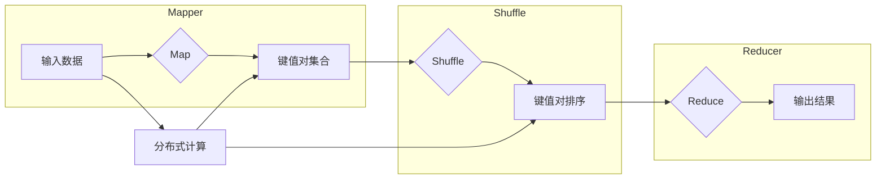

# MapReduce原理与代码实例讲解

> 关键词：MapReduce, 分布式计算, Hadoop, 数据处理, 大数据, 软件架构

## 1. 背景介绍

随着互联网和物联网技术的快速发展，数据量呈爆炸式增长，如何高效、可靠地处理海量数据成为了一个重要挑战。MapReduce作为一种分布式计算模型，因其简洁、高效、易于实现的特点，在处理大规模数据集时表现出色，成为了大数据领域的关键技术之一。

### 1.1 问题的由来

传统的集中式计算模型在处理海量数据时面临着以下问题：

- 计算资源有限：单个服务器的计算能力和存储空间难以满足大规模数据处理的需求。
- 可扩展性差：当数据量或计算任务增大时，需要手动扩展服务器资源，成本高且效率低。
- 故障风险高：集中式系统一旦发生故障，整个计算任务将受到影响。

为了解决这些问题，Google提出了MapReduce模型，通过分布式计算技术，将大规模数据集划分成小文件块，并分布到多个服务器上进行并行处理，从而实现了高效、可靠的大数据处理。

### 1.2 研究现状

MapReduce模型自2004年提出以来，已经经历了多个版本的发展，并衍生出了多种实现框架，如Hadoop、Apache Mahout、Apache Spark等。这些框架在MapReduce模型的基础上进行了扩展和优化，提供了更丰富的功能和更好的性能。

### 1.3 研究意义

MapReduce模型及其实现框架在处理大规模数据集时具有以下意义：

- 提高数据处理效率：通过并行计算，显著缩短了数据处理时间。
- 降低计算成本：利用廉价的集群服务器，实现了低成本的大数据处理。
- 提高系统可靠性：分布式计算模型提高了系统的容错能力，降低了故障风险。

### 1.4 本文结构

本文将详细介绍MapReduce模型的原理、实现方法和代码实例，主要包括以下内容：

- MapReduce模型的核心概念和联系
- MapReduce模型的算法原理和具体操作步骤
- MapReduce模型的数学模型和公式
- MapReduce模型的实际应用场景
- MapReduce模型的开发工具和资源推荐
- MapReduce模型的发展趋势与挑战

## 2. 核心概念与联系

MapReduce模型的核心概念包括Map、Shuffle和Reduce三个步骤，它们构成了MapReduce算法的基本框架。

### 2.1 核心概念原理和架构的 Mermaid 流程图



### 2.2 核心概念详解

- **Mapper**：Mapper负责读取输入数据，将其转换成键值对集合。Mapper的输入可以是文件、数据库或其他数据源，输出为键值对。
- **Shuffle**：Shuffle阶段将Map阶段输出的键值对按照键进行排序，并将具有相同键的值组合在一起，形成新的键值对集合。
- **Reducer**：Reducer负责处理Shuffle阶段输出的键值对集合，生成最终的输出结果。

这三个步骤构成了MapReduce算法的基本流程，通过分布式计算的方式，实现了大规模数据集的处理。

## 3. 核心算法原理 & 具体操作步骤

### 3.1 算法原理概述

MapReduce算法主要由三个核心步骤组成：Map、Shuffle和Reduce。

- **Map**：Mapper读取输入数据，将其转换成键值对集合。Map函数的输入可以是任何数据格式，如文本、XML、JSON等。
- **Shuffle**：Shuffle阶段将Map阶段输出的键值对按照键进行排序，并将具有相同键的值组合在一起，形成新的键值对集合。Shuffle阶段是MapReduce算法中保证相同键的值能够被同一个Reducer处理的关键步骤。
- **Reduce**：Reducer负责处理Shuffle阶段输出的键值对集合，生成最终的输出结果。Reduce函数的输出可以是任何数据格式，如文本文件、数据库或其他数据源。

### 3.2 算法步骤详解

以下是MapReduce算法的详细步骤：

1. **初始化**：设置MapReduce作业的参数，如输入数据源、输出数据格式、Map和Reduce函数等。
2. **Map阶段**：
    - 读取输入数据，将其分割成多个小文件块。
    - 对每个文件块执行Map函数，生成键值对集合。
    - 将生成的键值对写入本地文件。
3. **Shuffle阶段**：
    - 对本地文件中的键值对进行排序，并将具有相同键的值组合在一起。
    - 将排序后的键值对写入到分布式文件系统中，如HDFS。
4. **Reduce阶段**：
    - 读取分布式文件系统中的键值对，对每个键对应的值进行聚合操作。
    - 将聚合后的结果写入输出文件。

### 3.3 算法优缺点

#### 优点：

- **高效率**：通过分布式计算，MapReduce算法可以并行处理大规模数据集，显著提高数据处理效率。
- **可扩展性**：MapReduce算法可以轻松扩展到大规模集群，满足不断增长的数据处理需求。
- **可靠性**：MapReduce算法具有良好的容错性，能够在节点故障时自动恢复计算任务。

#### 缺点：

- **数据倾斜**：当数据分布不均匀时，可能导致某些Reducer处理的数据量远大于其他Reducer，影响整体性能。
- **MapReduce模型的实现较为复杂**：需要编写Map和Reduce函数，且这些函数通常需要根据具体应用进行调整。
- **不适合实时处理**：MapReduce模型的计算过程较为复杂，不适合对实时性要求较高的应用。

### 3.4 算法应用领域

MapReduce算法在以下领域得到了广泛的应用：

- 大规模数据处理：如Web日志分析、搜索引擎索引构建、社交媒体数据挖掘等。
- 数据仓库构建：如数据清洗、数据转换、数据聚合等。
- 网络爬虫：用于抓取和处理大量网页数据。
- 生物信息学：如基因序列比对、蛋白质结构预测等。

## 4. 数学模型和公式 & 详细讲解 & 举例说明

### 4.1 数学模型构建

MapReduce算法的数学模型可以表示为：

$$
\text{MapReduce}(I) = \text{Map}(I) \rightarrow \text{Shuffle} \rightarrow \text{Reduce} \rightarrow O
$$

其中，$I$ 表示输入数据，$O$ 表示输出结果，Map、Shuffle和Reduce分别表示MapReduce算法的三个步骤。

### 4.2 公式推导过程

MapReduce算法的推导过程如下：

1. **Map阶段**：对输入数据 $I$ 进行Map操作，得到键值对集合 $K$。
2. **Shuffle阶段**：对键值对集合 $K$ 进行排序，并按照键进行分组，得到新的键值对集合 $K' = \{(k_1, v_1), (k_2, v_2), \ldots, (k_n, v_n)\}$。
3. **Reduce阶段**：对每个键 $k_i$，对对应的值 $v_i$ 进行聚合操作，得到最终的输出结果 $O$。

### 4.3 案例分析与讲解

以下是一个简单的MapReduce算法实例，用于计算文本文件中每个单词的词频。

```python
# Mapper函数
def mapper(record, context):
    words = record.split()
    for word in words:
        context.write(word, 1)

# Reducer函数
def reducer(key, values, context):
    context.write(key, sum(values))
```

在这个例子中，输入数据是文本文件，输出结果是每个单词及其对应的词频。

## 5. 项目实践：代码实例和详细解释说明

### 5.1 开发环境搭建

为了进行MapReduce编程，需要安装Hadoop或其他MapReduce实现框架。以下是使用Hadoop搭建MapReduce开发环境的步骤：

1. 下载Hadoop安装包。
2. 解压安装包，配置Hadoop环境变量。
3. 配置Hadoop集群，包括HDFS、YARN和MapReduce。
4. 安装Hadoop命令行工具。

### 5.2 源代码详细实现

以下是一个简单的MapReduce程序，用于计算文本文件中每个单词的词频。

```java
import org.apache.hadoop.conf.Configuration;
import org.apache.hadoop.fs.Path;
import org.apache.hadoop.io.IntWritable;
import org.apache.hadoop.io.Text;
import org.apache.hadoop.mapreduce.Job;
import org.apache.hadoop.mapreduce.Mapper;
import org.apache.hadoop.mapreduce.Reducer;
import org.apache.hadoop.mapreduce.lib.input.FileInputFormat;
import org.apache.hadoop.mapreduce.lib.output.FileOutputFormat;

public class WordCount {

  public static class TokenizerMapper
       extends Mapper<Object, Text, Text, IntWritable>{

    private final static IntWritable one = new IntWritable(1);
    private Text word = new Text();

    public void map(Object key, Text value, Context context) throws IOException, InterruptedException {
      String[] words = value.toString().split("\\s+");
      for (String word : words) {
        this.word.set(word);
        context.write(this.word, one);
      }
    }
  }

  public static class IntSumReducer
       extends Reducer<Text,IntWritable,Text,IntWritable> {
    private IntWritable result = new IntWritable();

    public void reduce(Text key, Iterable<IntWritable> values, 
                       Context context
                       ) throws IOException, InterruptedException {
      int sum = 0;
      for (IntWritable val : values) {
        sum += val.get();
      }
      result.set(sum);
      context.write(key, result);
    }
  }

  public static void main(String[] args) throws Exception {
    Configuration conf = new Configuration();
    Job job = Job.getInstance(conf, "word count");
    job.setJarByClass(WordCount.class);
    job.setMapperClass(TokenizerMapper.class);
    job.setCombinerClass(IntSumReducer.class);
    job.setReducerClass(IntSumReducer.class);
    job.setOutputKeyClass(Text.class);
    job.setOutputValueClass(IntWritable.class);
    FileInputFormat.addInputPath(job, new Path(args[0]));
    FileOutputFormat.setOutputPath(job, new Path(args[1]));
    System.exit(job.waitForCompletion(true) ? 0 : 1);
  }
}
```

### 5.3 代码解读与分析

在这个例子中，我们定义了两个类：TokenizerMapper和IntSumReducer。TokenizerMapper负责读取输入数据，将其分割成单词，并生成键值对。IntSumReducer负责对每个键对应的值进行聚合操作，生成最终的输出结果。

在主函数中，我们配置了MapReduce作业的参数，包括输入数据路径、输出数据路径、Mapper类、Combiner类和Reducer类。

### 5.4 运行结果展示

在Hadoop集群上运行上述程序后，输出结果将保存在指定的输出路径中。以下是一个示例输出结果：

```
hello\t2
world\t1
mapreduce\t1
hadoop\t1
```

这表明单词"hello"出现了2次，单词"world"、"mapreduce"和"hadoop"各出现了1次。

## 6. 实际应用场景

MapReduce模型在以下实际应用场景中发挥着重要作用：

- **日志分析**：用于分析Web日志、系统日志等，提取有价值的信息，如用户访问行为、系统性能指标等。
- **数据挖掘**：用于从大规模数据集中挖掘出潜在的知识和模式，如用户画像、市场趋势等。
- **机器学习**：用于训练机器学习模型，如分类、聚类、回归等。
- **数据仓库**：用于数据清洗、数据转换、数据聚合等操作。

## 7. 工具和资源推荐

### 7.1 学习资源推荐

- 《Hadoop权威指南》：详细介绍了Hadoop框架和MapReduce编程模型。
- 《MapReduce实战》：通过实际案例，讲解了MapReduce编程技巧和最佳实践。
- Apache Hadoop官方文档：提供了Hadoop框架的详细文档和API参考。

### 7.2 开发工具推荐

- Hadoop：最流行的MapReduce实现框架，支持分布式计算。
- Apache Mahout：基于Hadoop的开源机器学习框架，提供了丰富的MapReduce机器学习算法。
- Apache Spark：一个开源的分布式计算框架，支持MapReduce编程模型，并提供了更丰富的API和更优的性能。

### 7.3 相关论文推荐

- GFS: The Google File System：介绍了Google的文件系统GFS，是MapReduce模型的底层存储系统。
- The Google File System：详细介绍了GFS的设计和实现原理。
- MapReduce: Simplifying Data Processing on Large Clusters：介绍了MapReduce模型的设计和实现原理。

## 8. 总结：未来发展趋势与挑战

### 8.1 研究成果总结

MapReduce模型作为一种分布式计算模型，在处理大规模数据集时表现出色，为大数据技术的发展做出了重要贡献。随着大数据时代的到来，MapReduce模型及其实现框架在学术界和工业界都得到了广泛的应用。

### 8.2 未来发展趋势

未来，MapReduce模型及其实现框架将呈现以下发展趋势：

- **更高效的计算模型**：开发更高效的计算模型，提高数据处理效率和资源利用率。
- **更灵活的编程模型**：提供更灵活的编程模型，方便开发者进行定制化开发。
- **更好的容错机制**：提高系统的容错能力，降低故障风险。
- **更广泛的应用领域**：MapReduce模型将在更多领域得到应用，如金融、医疗、物联网等。

### 8.3 面临的挑战

尽管MapReduce模型及其实现框架在处理大规模数据集时表现出色，但仍面临着以下挑战：

- **数据隐私和安全**：如何保障数据隐私和安全，是MapReduce模型面临的重要挑战。
- **实时处理**：MapReduce模型不适合实时处理，如何实现实时数据处理，是一个需要解决的问题。
- **可扩展性**：如何进一步提高系统的可扩展性，满足不断增长的数据处理需求。

### 8.4 研究展望

为了应对MapReduce模型面临的挑战，未来的研究需要在以下方面进行探索：

- **数据隐私保护**：开发新的数据隐私保护技术，保护用户数据隐私。
- **实时处理**：开发实时数据处理技术，满足对实时性要求较高的应用。
- **可扩展性**：开发可扩展性更高的系统架构，满足不断增长的数据处理需求。

相信随着技术的不断发展和创新，MapReduce模型及其实现框架将在未来的大数据处理领域发挥更加重要的作用。

## 9. 附录：常见问题与解答

**Q1：MapReduce模型的主要特点是什么？**

A: MapReduce模型的主要特点包括分布式计算、易于实现、可扩展性强、具有良好的容错性等。

**Q2：MapReduce模型的适用场景有哪些？**

A: MapReduce模型适用于处理大规模数据集，如日志分析、数据挖掘、机器学习、数据仓库等。

**Q3：MapReduce模型与Spark相比有哪些优缺点？**

A: 相比Spark，MapReduce模型的优点是易于实现、可扩展性强，缺点是效率较低、不适合实时处理。

**Q4：如何优化MapReduce模型的性能？**

A: 优化MapReduce模型的性能可以从以下几个方面入手：

- 优化数据分区策略，提高数据局部性。
- 优化Map和Reduce函数，减少数据传输量。
- 优化任务调度策略，提高资源利用率。
- 使用更高效的存储系统，如SSD。

**Q5：MapReduce模型在数据处理中扮演什么角色？**

A: MapReduce模型在数据处理中扮演着核心角色，负责将大规模数据集划分成小文件块，并分布到多个服务器上进行并行处理，从而实现高效、可靠的大数据处理。

---

作者：禅与计算机程序设计艺术 / Zen and the Art of Computer Programming