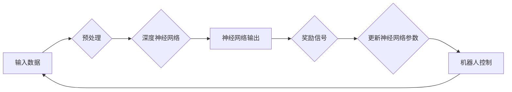

# Python深度学习实践：深度强化学习与机器人控制

> 关键词：深度学习，强化学习，机器人控制，深度强化学习，Python，机器学习，智能控制

## 1. 背景介绍

随着深度学习技术的飞速发展，其在各个领域的应用日益广泛。特别是在机器人控制领域，深度学习为机器人提供了更强大的感知和决策能力，使得机器人能够更好地适应复杂多变的动态环境。本文将探讨如何使用Python深度学习技术，特别是深度强化学习（Deep Reinforcement Learning, DRL），来实现机器人控制。

### 1.1 问题的由来

传统的机器人控制方法，如基于规则的专家系统、PID控制等，在处理复杂、不确定的环境时往往效果不佳。而深度学习技术能够从海量数据中学习到复杂的模式，为机器人控制提供了一种新的思路。

### 1.2 研究现状

近年来，深度强化学习在机器人控制领域取得了显著成果，如DeepMind的AlphaGo、OpenAI的Dota 2 Bot等。这些成果证明了深度强化学习在机器人控制领域的巨大潜力。

### 1.3 研究意义

深度强化学习与机器人控制的结合，为机器人领域带来了以下意义：

- 提高机器人适应复杂环境的能力。
- 增强机器人自主学习和决策的能力。
- 降低机器人控制算法的复杂度。
- 促进机器人技术的发展和应用。

### 1.4 本文结构

本文将分为以下几个部分：

- 介绍深度学习和强化学习的基本概念。
- 详细讲解深度强化学习算法原理和具体操作步骤。
- 通过实际项目实践，展示如何使用Python实现深度强化学习与机器人控制。
- 探讨深度强化学习在机器人控制领域的应用场景。
- 展望未来发展趋势和挑战。

## 2. 核心概念与联系

为了更好地理解深度强化学习与机器人控制，我们首先介绍一些核心概念，并给出它们之间的Mermaid流程图。

### 2.1 核心概念

- **深度学习（Deep Learning）**：一种利用深层神经网络进行数据学习的机器学习方法。
- **强化学习（Reinforcement Learning, RL）**：一种通过与环境交互，根据奖励信号学习最优策略的机器学习方法。
- **深度强化学习（Deep Reinforcement Learning, DRL）**：结合深度学习和强化学习的机器学习方法，使用深度神经网络作为强化学习中的价值函数或策略函数。
- **机器人控制（Robot Control）**：研究如何使机器人完成特定任务的技术。

### 2.2 Mermaid流程图



在上述流程图中，输入数据经过预处理后，输入深度神经网络进行计算，得到神经网络输出。神经网络输出作为奖励信号，用于更新神经网络参数。更新后的神经网络参数用于机器人控制，控制过程产生的数据再次作为输入，形成一个闭环。

## 3. 核心算法原理 & 具体操作步骤

### 3.1 算法原理概述

深度强化学习算法的核心是价值函数和策略函数。价值函数用于评估当前状态和策略的价值，策略函数用于选择最佳动作。

- **价值函数（Value Function）**：表示在特定状态下，采取特定策略所能获得的最大累积奖励。
- **策略函数（Policy Function）**：表示在特定状态下，选择最佳动作的概率分布。

### 3.2 算法步骤详解

深度强化学习算法的步骤如下：

1. 初始化神经网络参数。
2. 从初始状态开始，选择一个动作。
3. 执行所选动作，得到奖励和下一个状态。
4. 更新神经网络参数，使价值函数最大化。
5. 重复步骤2-4，直到达到终止条件。

### 3.3 算法优缺点

#### 优点：

- 能够学习到复杂的状态-动作映射。
- 能够在未知环境中进行决策。
- 能够适应动态变化的环境。

#### 缺点：

- 训练过程可能非常耗时。
- 对初始参数的选择比较敏感。
- 难以解释模型的决策过程。

### 3.4 算法应用领域

深度强化学习在机器人控制领域的应用非常广泛，包括：

- 无人驾驶
- 机器人路径规划
- 手眼协调
- 机器人协作

## 4. 数学模型和公式 & 详细讲解 & 举例说明

### 4.1 数学模型构建

深度强化学习算法的数学模型主要包括以下部分：

- **状态空间（State Space）**：表示机器人所处的环境。
- **动作空间（Action Space）**：机器人可以执行的动作集合。
- **价值函数（Value Function）**：评估当前状态和策略的价值。
- **策略函数（Policy Function）**：选择最佳动作的概率分布。

### 4.2 公式推导过程

假设我们使用Q-learning算法进行深度强化学习。Q-learning算法的目标是最小化以下公式：

$$
J(\theta) = \sum_{s,a} Q(s,a) - \gamma \sum_{s',a'} Q(s',a')
$$

其中，$\theta$ 表示神经网络参数，$Q(s,a)$ 表示在状态 $s$ 下执行动作 $a$ 的期望回报，$\gamma$ 表示折扣因子。

### 4.3 案例分析与讲解

以下是一个使用PyTorch实现Q-learning算法的简单例子：

```python
import torch
import torch.nn as nn
import torch.optim as optim

class QNetwork(nn.Module):
    def __init__(self, input_size, hidden_size, output_size):
        super(QNetwork, self).__init__()
        self.fc1 = nn.Linear(input_size, hidden_size)
        self.fc2 = nn.Linear(hidden_size, output_size)

    def forward(self, x):
        x = torch.relu(self.fc1(x))
        x = self.fc2(x)
        return x

# 初始化神经网络
input_size = 4  # 状态空间维度
hidden_size = 128
output_size = 2  # 动作空间维度
q_network = QNetwork(input_size, hidden_size, output_size)

# 定义损失函数和优化器
criterion = nn.MSELoss()
optimizer = optim.Adam(q_network.parameters(), lr=0.001)

# 模拟环境
def simulate_env():
    # ...

# 训练过程
for epoch in range(1000):
    s = simulate_env()
    a = torch.argmax(q_network(s), dim=1)
    r = simulate_env()  # 执行动作
    s_ = simulate_env()  # 获取下一个状态
    q_s_a = q_network(s)
    q_s_a[torch.arange(len(q_s_a)), a] = r + 0.99 * torch.max(q_network(s_), dim=1)[0]

    optimizer.zero_grad()
    loss = criterion(q_s_a, r)
    loss.backward()
    optimizer.step()
```

在上面的代码中，我们首先定义了一个简单的全连接神经网络作为Q网络，然后使用MSELoss作为损失函数和Adam作为优化器。在模拟环境函数中，我们模拟了机器人所处的环境和可以执行的动作。在训练过程中，我们不断更新Q网络参数，使其能够学习到最优策略。

## 5. 项目实践：代码实例和详细解释说明

### 5.1 开发环境搭建

为了实现深度强化学习与机器人控制，我们需要以下开发环境：

- Python 3.x
- PyTorch 1.0+
- NumPy 1.18+
- Gym环境（用于模拟机器人环境）

### 5.2 源代码详细实现

以下是一个使用PyTorch和Gym实现深度强化学习与机器人控制的简单例子：

```python
import gym
import torch
import torch.nn as nn
import torch.optim as optim

# 加载环境
env = gym.make("CartPole-v1")

# 定义神经网络
class DQN(nn.Module):
    def __init__(self, input_size, hidden_size, output_size):
        super(DQN, self).__init__()
        self.fc1 = nn.Linear(input_size, hidden_size)
        self.fc2 = nn.Linear(hidden_size, output_size)

    def forward(self, x):
        x = torch.relu(self.fc1(x))
        x = self.fc2(x)
        return x

# 初始化神经网络
input_size = env.observation_space.shape[0]
hidden_size = 128
output_size = env.action_space.n
q_network = DQN(input_size, hidden_size, output_size)
target_network = DQN(input_size, hidden_size, output_size)
target_network.load_state_dict(q_network.state_dict())

# 定义损失函数和优化器
criterion = nn.MSELoss()
optimizer = optim.Adam(q_network.parameters(), lr=0.001)

# 定义经验回放
class ReplayMemory:
    def __init__(self, capacity):
        self.capacity = capacity
        self.memory = []

    def push(self, state, action, reward, next_state, done):
        if len(self.memory) < self.capacity:
            self.memory.append((state, action, reward, next_state, done))

    def sample(self, batch_size):
        return random.sample(self.memory, batch_size)

    def __len__(self):
        return len(self.memory)

memory = ReplayMemory(10000)

# 训练过程
for episode in range(1000):
    state = env.reset()
    state = torch.from_numpy(state).float().unsqueeze(0)
    for t in range(500):
        action = torch.argmax(q_network(state), dim=1).item()
        next_state, reward, done, _ = env.step(action)
        next_state = torch.from_numpy(next_state).float().unsqueeze(0)
        memory.push(state, action, reward, next_state, done)
        state = next_state

        if len(memory) > 64:
            batch = memory.sample(64)
            states, actions, rewards, next_states, dones = zip(*batch)
            states = torch.stack(states)
            actions = torch.tensor(actions)
            rewards = torch.tensor(rewards)
            next_states = torch.stack(next_states)
            dones = torch.tensor(dones).unsqueeze(1)

            q_next = target_network(next_states).max(1)[0].unsqueeze(1)
            q_targets = rewards + 0.99 * q_next * (1 - dones)

            q_expected = q_network(states).gather(1, actions.unsqueeze(1))
            loss = criterion(q_expected, q_targets)
            optimizer.zero_grad()
            loss.backward()
            optimizer.step()

            if done:
                break

    env.render()
```

在上面的代码中，我们首先加载了CartPole-v1环境。然后定义了一个DQN网络，用于预测动作值。我们使用经验回放机制来存储和重放经验，以避免过拟合。在训练过程中，我们不断更新DQN网络参数，使其能够学习到最优策略。

### 5.3 代码解读与分析

在上面的代码中，我们首先加载了CartPole-v1环境，并定义了一个DQN网络。然后，我们使用经验回放机制来存储和重放经验，以避免过拟合。在训练过程中，我们不断更新DQN网络参数，使其能够学习到最优策略。

- `DQN`类定义了DQN网络的结构。
- `ReplayMemory`类实现了经验回放机制。
- 在训练循环中，我们从环境中获取状态、动作、奖励和下一个状态，并将其存储在经验回放中。
- 当经验回放达到一定大小后，我们从经验回放中随机抽取样本，并计算损失函数。
- 通过反向传播更新网络参数。

### 5.4 运行结果展示

运行上述代码，我们可以看到CartPole-v1环境中的杆子几乎不会倒下，这表明DQN算法能够学习到稳定的策略。

## 6. 实际应用场景

深度强化学习在机器人控制领域的应用场景非常广泛，以下是一些典型的应用场景：

- **无人驾驶**：使用深度强化学习技术，使无人驾驶汽车能够自主导航、避障和超车。
- **机器人路径规划**：使用深度强化学习技术，使机器人能够在复杂环境中规划最优路径。
- **手眼协调**：使用深度强化学习技术，使机器人能够精确地控制手部运动，实现目标物体的抓取。
- **机器人协作**：使用深度强化学习技术，使多个机器人能够协同工作，完成复杂任务。

## 7. 工具和资源推荐

### 7.1 学习资源推荐

- 《深度学习》（Ian Goodfellow, Yoshua Bengio, Aaron Courville）
- 《强化学习》（Richard S. Sutton and Andrew G. Barto）
- 《深度学习与机器人控制》（Sergio Guadarrama等）

### 7.2 开发工具推荐

- PyTorch
- TensorFlow
- OpenAI Gym
- Gymnasium
- Stable Baselines

### 7.3 相关论文推荐

- Deep Q-Network (DQN)
- Asynchronous Advantage Actor-Critic (A3C)
- Proximal Policy Optimization (PPO)
- Soft Actor-Critic (SAC)
- Distributed Deep Reinforcement Learning with Frontier Off-Policy actor-critic

## 8. 总结：未来发展趋势与挑战

### 8.1 研究成果总结

本文介绍了深度强化学习与机器人控制的结合，并给出了一个使用PyTorch实现的简单例子。通过这个例子，我们可以看到深度强化学习在机器人控制领域的巨大潜力。

### 8.2 未来发展趋势

- 深度强化学习算法将更加高效和稳定。
- 深度强化学习将在更多机器人控制场景中得到应用。
- 深度强化学习与其他人工智能技术的融合将更加紧密。

### 8.3 面临的挑战

- 深度强化学习算法的训练过程仍然非常耗时。
- 深度强化学习算法的可解释性有待提高。
- 深度强化学习算法在安全性方面的挑战。

### 8.4 研究展望

未来，深度强化学习将在机器人控制领域发挥越来越重要的作用。随着算法的不断完善和硬件的不断发展，我们将看到更多基于深度强化学习的机器人技术应用于实际场景。

## 9. 附录：常见问题与解答

**Q1：深度强化学习与机器人控制有什么区别？**

A：深度强化学习是一种机器学习方法，而机器人控制是一种技术。深度强化学习可以用于实现机器人控制，但两者不是一回事。

**Q2：如何选择合适的深度强化学习算法？**

A：选择合适的深度强化学习算法需要根据具体任务和环境特点进行选择。例如，对于需要快速收敛的任务，可以选择A3C或PPO等算法；对于需要稳定性的任务，可以选择SAC算法。

**Q3：如何解决深度强化学习算法的训练过程耗时问题？**

A：可以通过以下方法解决深度强化学习算法的训练过程耗时问题：

- 使用GPU或TPU等硬件加速训练过程。
- 使用分布式训练技术。
- 使用迁移学习技术，利用已有模型的知识。

**Q4：如何提高深度强化学习算法的可解释性？**

A：可以通过以下方法提高深度强化学习算法的可解释性：

- 使用可解释的神经网络结构。
- 分析模型内部的特征表示。
- 使用可视化技术展示模型的学习过程。

**Q5：如何确保深度强化学习算法的安全性？**

A：可以通过以下方法确保深度强化学习算法的安全性：

- 对模型进行安全评估。
- 对环境进行安全限制。
- 对奖励函数进行设计，使其能够引导模型做出安全的决策。

---

作者：禅与计算机程序设计艺术 / Zen and the Art of Computer Programming