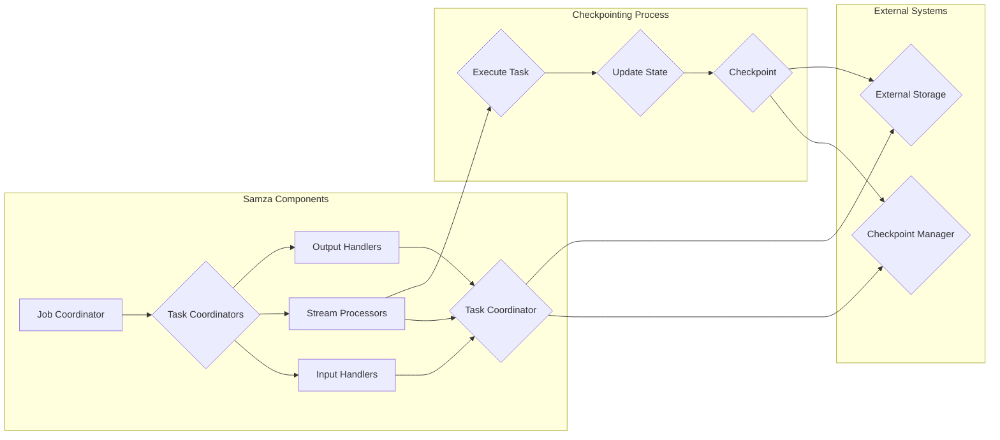

# Samza Checkpoint原理与代码实例讲解

> 关键词：Samza, Checkpoint, 流处理, Apache, 状态管理, 精确一次处理, 恢复机制

## 1. 背景介绍

随着大数据技术的飞速发展，流处理技术在处理实时数据方面发挥着越来越重要的作用。Apache Samza是一种高性能、高可用的流处理框架，它能够处理来自Kafka等消息队列的实时数据流，并支持精确一次处理语义。Checkpoint是Samza中实现状态管理和恢复机制的核心组件，对于确保系统在故障发生时的数据一致性至关重要。

本文将深入探讨Samza Checkpoint的原理，并通过代码实例讲解如何实现和配置Checkpoint功能。

## 2. 核心概念与联系

### 2.1 核心概念

#### Samza
Apache Samza是一个分布式流处理框架，它允许用户编写代码来处理来自Kafka等消息队列的实时数据流。Samza支持精确一次处理语义，确保每个事件只被处理一次。

#### Checkpoint
Checkpoint是Samza中用于状态管理的关键机制。它通过定期将任务的状态信息持久化到可靠的存储系统中，来实现任务的故障恢复。Checkpoint确保了即使在发生故障的情况下，也能够从最后一个Checkpoint状态恢复，保证数据处理的精确性。

### 2.2 架构图

以下是一个简单的Mermaid流程图，展示了Samza Checkpoint的基本架构：



- `Job Coordinator`负责创建和管理任务。
- `Task Coordinators`负责监控和管理特定任务的状态。
- `Input Handlers`负责从消息队列中读取数据。
- `Stream Processors`负责处理数据。
- `Output Handlers`负责将处理后的数据输出到其他系统。
- `Checkpoint Manager`负责协调Checkpoint过程。
- `External Storage`用于存储Checkpoint数据。

## 3. 核心算法原理 & 具体操作步骤

### 3.1 算法原理概述

Samza Checkpoint的工作原理如下：

1. `Stream Processors`在处理数据时，会不断地更新其内部状态。
2. `Task Coordinators`定期向`Checkpoint Manager`请求Checkpoint操作。
3. `Checkpoint Manager`协调`Stream Processors`和`External Storage`，将状态信息写入到持久化存储中。
4. 当系统发生故障时，`Job Coordinator`会根据存储的Checkpoint状态重新启动`Stream Processors`。
5. `Stream Processors`从Checkpoint状态恢复后，会继续处理数据流，确保精确一次处理语义。

### 3.2 算法步骤详解

1. **初始化Checkpoint存储**：在启动Samza应用程序之前，需要配置一个持久化存储系统，如HDFS、Amazon S3等。
2. **配置Checkpoint参数**：在Samza配置文件中，需要指定Checkpoint的存储路径、间隔时间等参数。
3. **执行Checkpoint操作**：`Task Coordinators`会根据配置的间隔时间，向`Checkpoint Manager`发送Checkpoint请求。
4. **持久化状态信息**：`Checkpoint Manager`协调`Stream Processors`和`External Storage`，将状态信息写入到持久化存储中。
5. **故障恢复**：在系统发生故障时，`Job Coordinator`会根据存储的Checkpoint状态重启`Stream Processors`。
6. **恢复状态**：`Stream Processors`从Checkpoint状态恢复后，会继续处理数据流。

### 3.3 算法优缺点

#### 优点

- **精确一次处理**：Checkpoint机制确保了即使在发生故障的情况下，也能够从最后一个Checkpoint状态恢复，保证数据处理的精确性。
- **高可用性**：Checkpoint机制能够提高系统的可用性，减少故障造成的损失。
- **可扩展性**：Checkpoint机制支持多种持久化存储系统，具有良好的可扩展性。

#### 缺点

- **性能开销**：Checkpoint操作需要消耗一定的计算资源和存储空间，可能会对系统性能产生一定影响。
- **复杂度**：Checkpoint机制涉及到多个组件的协调，实现起来相对复杂。

### 3.4 算法应用领域

Samza Checkpoint机制适用于以下应用领域：

- 实时数据处理：如电商网站的用户行为分析、金融交易分析等。
- 智能推荐系统：如电影推荐、商品推荐等。
- 实时监控：如系统性能监控、网络流量分析等。

## 4. 数学模型和公式 & 详细讲解 & 举例说明

### 4.1 数学模型构建

Samza Checkpoint机制可以使用以下数学模型进行描述：

$$
\text{Checkpoint State} = f(\text{Processor State}, \text{Timestamp})
$$

其中，`Processor State`表示`Stream Processor`的内部状态，`Timestamp`表示Checkpoint的时间戳。

### 4.2 公式推导过程

Checkpoint状态的更新过程可以表示为：

$$
\text{New Processor State} = g(\text{Current Processor State}, \text{New Data})
$$

$$
\text{Checkpoint State} = f(\text{New Processor State}, \text{Timestamp})
$$

其中，`g`函数表示`Stream Processor`的数据处理逻辑。

### 4.3 案例分析与讲解

假设有一个Samza应用程序，它从一个Kafka主题中读取实时日志数据，并计算每个日志条目的词频。以下是一个简单的例子：

```java
public class WordCountProcessor extends StreamProcessor<String, String, String> {

    private Map<String, Integer> wordCountMap = new ConcurrentHashMap<>();

    @Override
    public Collection<String> process(BoundedInput<String> input, Collection<TaskMessage<String>> messages, TaskContext context) {
        for (TaskMessage<String> message : messages) {
            String data = message.getData();
            String[] words = data.split(" ");
            for (String word : words) {
                wordCountMap.put(word, wordCountMap.getOrDefault(word, 0) + 1);
            }
        }
        return null;
    }

    @Override
    public void checkpointed(long timestamp, Checkpoint checkpoint) {
        checkpoint.setState(wordCountMap);
    }

    @Override
    public void recovered(Map<String, Integer> state) {
        wordCountMap = state;
    }
}
```

在这个例子中，`WordCountProcessor`类实现了`StreamProcessor`接口，并在`process`方法中处理输入数据。在`checkpointed`方法中，将词频映射`wordCountMap`作为Checkpoint状态保存。在`recovered`方法中，从Checkpoint状态恢复`wordCountMap`。

## 5. 项目实践：代码实例和详细解释说明

### 5.1 开发环境搭建

1. 安装Java开发环境（如JDK 8以上版本）。
2. 安装Apache Maven或SBT构建工具。
3. 创建Samza应用程序的Maven或SBT项目。

### 5.2 源代码详细实现

以下是一个简单的Samza应用程序示例，它使用Checkpoint机制：

```java
public class WordCountApplication {

    public static void main(String[] args) throws IOException {
        Properties props = new Properties();
        props.setProperty("job.name", "word-count");
        props.setProperty("streaming applications.checkpointDir", "/path/to/checkpoint/dir");
        props.setProperty("task.coordinator.system", "kafka");
        props.setProperty("task.coordinator.config", "/path/to/kafka/config");
        props.setProperty("stream.samza.checkpointManager", "org.apache.samza.checkpoint.file.SystemFileCheckpointManager");
        props.setProperty("stream.samza.checkpointDir", "/path/to/checkpoint/dir");
        props.setProperty("input.streams.log-input", "log-input");
        props.setProperty("input.samza.system", "kafka");
        props.setProperty("input.samza.consumer.factory", "org.apache.samza.system.kafka.KafkaConsumerFactory");
        props.setProperty("input.samza.consumer.broker.list", "localhost:9092");
        props.setProperty("input.samza.consumer.topic", "log-input");
        props.setProperty("input.samza.consumer.partition consumers", "1");
        props.setProperty("output.streams.word-count", "word-count");
        props.setProperty("output.samza.system", "kafka");
        props.setProperty("output.samza.producer.factory", "org.apache.samza.system.kafka.KafkaProducerFactory");
        props.setProperty("output.samza.producer.broker.list", "localhost:9092");
        props.setProperty("output.samza.producer.topic", "word-count");
        props.setProperty("output.samza.producer.partition.count", "1");

        StreamConfig config = new StreamConfig(props);
        config.setApplicationName("word-count");
        JobConfig jobConfig = new JobConfig(config);
        jobConfig.setName("word-count");
        jobConfig.setTaskClass(WordCountProcessor.class);
        jobConfig.addStream(new StreamConfig.StreamPartitionSpec("log-input", "word-count"));
        jobConfig.addStream(new StreamConfig.StreamPartitionSpec("word-count", "word-count"));
        jobConfig.setDefaultConsumerConfig(new ConsumerConfig());
        jobConfig.setDefaultProducerConfig(new ProducerConfig());

        SamzaContainer container = new SamzaContainer(new ContainerConfig(config));
        container.run();
    }
}
```

在这个例子中，我们配置了Checkpoint目录、Kafka配置、输入输出流等参数。通过设置`stream.samza.checkpointManager`和`stream.samza.checkpointDir`，启用Checkpoint功能。

### 5.3 代码解读与分析

在上述代码中，我们创建了一个名为`WordCountApplication`的应用程序。在`main`方法中，我们配置了Samza应用程序的各个组件，包括Checkpoint目录、Kafka配置、输入输出流等。通过设置`stream.samza.checkpointManager`和`stream.samza.checkpointDir`，启用Checkpoint功能。

### 5.4 运行结果展示

假设我们有一个Kafka主题`log-input`，其中包含日志数据。运行上述应用程序后，它会处理这些数据，并计算每个日志条目的词频。在发生故障时，Samza应用程序可以从最后一个Checkpoint状态恢复，保证数据处理的精确性。

## 6. 实际应用场景

### 6.1 实时数据处理

Samza Checkpoint机制适用于实时数据处理场景，如：

- 实时用户行为分析：通过对用户行为数据的实时处理，分析用户兴趣、购物偏好等，为个性化推荐系统提供支持。
- 实时交易分析：对金融交易数据进行实时分析，监控交易风险，及时响应异常交易行为。
- 实时网络流量分析：实时分析网络流量，识别异常流量，提高网络安全防护能力。

### 6.2 智能推荐系统

Samza Checkpoint机制可以用于智能推荐系统，如：

- 电影推荐：通过对用户观影数据的实时处理，分析用户观影偏好，为用户提供个性化的电影推荐。
- 商品推荐：对用户购物数据进行实时分析，推荐用户可能感兴趣的商品。
- 新闻推荐：对新闻数据进行实时分析，推荐用户可能感兴趣的新闻。

## 7. 工具和资源推荐

### 7.1 学习资源推荐

- Apache Samza官方文档：[https://samza.apache.org/documentation/latest/](https://samza.apache.org/documentation/latest/)
- Samza Checkpoint机制详解：[https://www.slideshare.net/mattklein/samza-checkpoint-mechanism-explained](https://www.slideshare.net/mattklein/samza-checkpoint-mechanism-explained)
- Apache Kafka官方文档：[https://kafka.apache.org/documentation/latest/](https://kafka.apache.org/documentation/latest/)

### 7.2 开发工具推荐

- Apache Maven：[https://maven.apache.org/](https://maven.apache.org/)
- IntelliJ IDEA：[https://www.jetbrains.com/idea/](https://www.jetbrains.com/idea/)
- Eclipse：[https://www.eclipse.org/downloads/](https://www.eclipse.org/downloads/)

### 7.3 相关论文推荐

- **Samza: Streaming Application Platform for Big Data**：介绍了Apache Samza的设计和实现。
- **Efficient and Scalable State Management for Distributed Stream Processing Systems**：探讨了分布式流处理系统中状态管理的挑战和解决方案。

## 8. 总结：未来发展趋势与挑战

### 8.1 研究成果总结

本文深入探讨了Samza Checkpoint的原理和实现，并通过代码实例讲解了如何配置和实现Checkpoint功能。Samza Checkpoint机制在确保数据一致性和系统可用性方面发挥着重要作用，是流处理框架中不可或缺的组件。

### 8.2 未来发展趋势

随着流处理技术的不断发展，Samza Checkpoint机制可能会呈现以下发展趋势：

- **支持更多持久化存储系统**：为了提高Checkpoint的可用性和灵活性，未来可能会支持更多类型的持久化存储系统，如Cassandra、Redis等。
- **集成更多监控和告警功能**：为了更好地监控Checkpoint过程，可能会集成更多的监控和告警功能，提高系统可靠性。
- **优化Checkpoint性能**：随着数据量和处理速度的不断提升，未来可能会对Checkpoint性能进行优化，降低对系统性能的影响。

### 8.3 面临的挑战

尽管Samza Checkpoint机制在流处理领域取得了显著的成果，但仍面临以下挑战：

- **资源消耗**：Checkpoint过程需要消耗一定的计算资源和存储空间，可能会对系统性能产生一定影响。
- **复杂度**：Checkpoint机制涉及到多个组件的协调，实现起来相对复杂，需要一定的技术积累。
- **数据一致性问题**：在分布式环境中，确保数据一致性和原子性是一个挑战。

### 8.4 研究展望

为了克服上述挑战，未来的研究可以从以下方向进行：

- **优化Checkpoint性能**：通过算法优化、硬件加速等方式，降低Checkpoint对系统性能的影响。
- **提高数据一致性**：在分布式环境中，确保数据一致性和原子性是一个挑战。未来的研究可以探索新的数据一致性协议，提高系统的可靠性。
- **简化实现**：通过设计更加简洁的接口和组件，降低Checkpoint机制的复杂度，提高可维护性。

通过不断的研究和优化，Samza Checkpoint机制将在流处理领域发挥更加重要的作用，推动流处理技术的发展。

## 9. 附录：常见问题与解答

**Q1：Samza Checkpoint是否适用于所有类型的流处理任务？**

A1：Samza Checkpoint适用于大多数流处理任务，但并不是所有类型的任务都受益于Checkpoint。例如，对于一些简单的计算任务，如果不需要持久化状态，则不需要使用Checkpoint。

**Q2：如何优化Checkpoint的性能？**

A2：为了优化Checkpoint的性能，可以考虑以下方法：

- 使用更高效的持久化存储系统。
- 减少Checkpoint的间隔时间。
- 优化Checkpoint数据结构，减小存储空间。

**Q3：如何处理Checkpoint过程中的数据损坏问题？**

A3：为了处理Checkpoint过程中的数据损坏问题，可以采取以下措施：

- 在写入Checkpoint数据前进行数据校验。
- 使用分布式文件系统（如HDFS）进行存储，提高数据可靠性。
- 在发生数据损坏时，可以从最近的Checkpoint状态进行恢复。

**Q4：如何保证Checkpoint的一致性和原子性？**

A4：为了保证Checkpoint的一致性和原子性，可以采取以下措施：

- 使用分布式锁或其他同步机制，确保同时只有一个任务执行Checkpoint操作。
- 在写入Checkpoint数据时，使用事务性操作，确保数据的一致性。
- 在发生故障时，从最后一个Checkpoint状态进行恢复，保证系统的原子性。

**Q5：如何监控Checkpoint过程？**

A5：为了监控Checkpoint过程，可以采取以下措施：

- 使用日志记录Checkpoint操作的相关信息。
- 使用监控系统（如Grafana、Prometheus）监控Checkpoint状态和性能指标。
- 定期检查Checkpoint数据的完整性。

作者：禅与计算机程序设计艺术 / Zen and the Art of Computer Programming