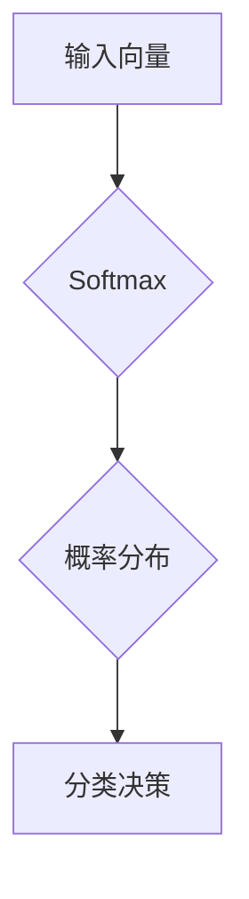

# Softmax瓶颈的挑战

> 关键词：Softmax, 概率分布，分类器，多分类问题，性能瓶颈，优化策略，深度学习

## 1. 背景介绍

Softmax函数是深度学习中常用的激活函数之一，尤其在多分类问题中扮演着核心角色。它能够将神经网络的输出转换为概率分布，从而用于分类决策。然而，Softmax函数在应用中也存在一些瓶颈，限制了其在特定场景下的性能。本文将深入探讨Softmax函数的原理、挑战以及优化策略，并展望其未来发展方向。

## 2. 核心概念与联系

### 2.1 Softmax函数原理

Softmax函数是一种将向量转换为概率分布的函数，其数学表达式为：

$$
\text{Softmax}(x_i) = \frac{e^{x_i}}{\sum_{j=1}^{K}e^{x_j}}
$$

其中 $x_i$ 是第 $i$ 个神经网络的输出，$K$ 是分类类别数。Softmax函数确保输出概率分布的总和为1，且每个类别的概率值介于0和1之间。

### 2.2 Softmax架构的Mermaid流程图



在上述流程图中，输入向量通过Softmax函数转换为概率分布，然后根据概率分布进行分类决策。

### 2.3 Softmax与分类器的联系

Softmax函数通常与分类器结合使用，如逻辑回归、神经网络等。它将模型的输出转换为概率分布，从而为分类决策提供依据。

## 3. 核心算法原理 & 具体操作步骤

### 3.1 算法原理概述

Softmax函数通过指数函数将神经网络的输出转换为概率值，确保每个类别的概率值在0和1之间，且总和为1。这种转换使得模型能够对多个类别进行预测，并为每个类别分配一个概率值。

### 3.2 算法步骤详解

1. **模型输出计算**：神经网络输出每个类别的特征向量。
2. **Softmax转换**：将特征向量输入Softmax函数，得到每个类别的概率值。
3. **分类决策**：根据概率分布进行分类决策，通常选择概率值最大的类别作为预测结果。

### 3.3 算法优缺点

**优点**：
- 简单易懂，易于实现。
- 能够处理多分类问题。
- 可以用于评估模型的分类能力。

**缺点**：
- 易受梯度消失问题影响，导致训练困难。
- 对于类别数量较多的情况，计算复杂度高。
- 当类别分布不均时，可能导致模型偏向于频率较高的类别。

### 3.4 算法应用领域

Softmax函数在以下领域得到广泛应用：

- 多分类问题：如文本分类、图像分类等。
- 评分预测：如风险评估、信用评分等。
- 排序问题：如新闻推荐、商品推荐等。

## 4. 数学模型和公式 & 详细讲解 & 举例说明

### 4.1 数学模型构建

Softmax函数的数学模型如下：

$$
\text{Softmax}(x_i) = \frac{e^{x_i}}{\sum_{j=1}^{K}e^{x_j}}
$$

其中 $x_i$ 是第 $i$ 个神经网络的输出，$K$ 是分类类别数。

### 4.2 公式推导过程

Softmax函数的推导过程如下：

1. **指数函数**：对每个神经网络的输出应用指数函数，得到每个类别的指数值。
2. **归一化**：将指数值除以所有指数值的和，得到每个类别的概率值。

### 4.3 案例分析与讲解

假设有一个神经网络，其输出为 [2.3, 3.2, 1.9]。使用Softmax函数进行概率分布计算：

$$
\text{Softmax}(2.3) = \frac{e^{2.3}}{e^{2.3} + e^{3.2} + e^{1.9}}
$$

计算得到每个类别的概率值，并选择概率值最大的类别作为预测结果。

## 5. 项目实践：代码实例和详细解释说明

### 5.1 开发环境搭建

为了演示Softmax函数的应用，我们需要搭建一个简单的神经网络环境。以下是使用Python和TensorFlow框架实现的代码：

```python
import tensorflow as tf

# 定义神经网络
model = tf.keras.Sequential([
    tf.keras.layers.Dense(10, activation='relu', input_shape=(100,)),
    tf.keras.layers.Dense(3, activation='softmax')
])

# 编译模型
model.compile(optimizer='adam', loss='categorical_crossentropy', metrics=['accuracy'])

# 训练模型
model.fit(x_train, y_train, epochs=10, batch_size=32)
```

### 5.2 源代码详细实现

在上面的代码中，我们定义了一个简单的神经网络，包含两个全连接层。第一个层使用ReLU激活函数，第二个层使用Softmax激活函数。使用交叉熵损失函数和Adam优化器进行模型训练。

### 5.3 代码解读与分析

- `tf.keras.Sequential`：创建一个序列模型，包含多个层。
- `tf.keras.layers.Dense`：创建一个全连接层，第一个层的输出形状为 (100,)，第二个层的输出形状为 (3,)。
- `activation='relu'`：第一个层使用ReLU激活函数。
- `activation='softmax'`：第二个层使用Softmax激活函数。
- `optimizer='adam'`：使用Adam优化器进行模型训练。
- `loss='categorical_crossentropy'`：使用交叉熵损失函数计算损失。
- `metrics=['accuracy']`：监控训练过程中的准确率。

### 5.4 运行结果展示

运行上述代码后，模型将训练10个epoch，每个epoch包含32个batch。训练完成后，我们可以评估模型在测试集上的性能：

```python
test_loss, test_acc = model.evaluate(x_test, y_test)
print(f"Test Loss: {test_loss}, Test Accuracy: {test_acc}")
```

通过上述代码，我们可以看到模型在测试集上的损失和准确率。

## 6. 实际应用场景

Softmax函数在实际应用中具有广泛的应用场景，以下列举几个例子：

### 6.1 文本分类

使用Softmax函数对文本进行分类，如新闻分类、情感分析等。通过预训练的词向量模型和Softmax函数，我们可以对文本进行分类，并根据类别分配概率值。

### 6.2 图像分类

使用Softmax函数对图像进行分类，如人脸识别、物体识别等。通过卷积神经网络和Softmax函数，我们可以对图像进行分类，并预测图像的类别。

### 6.3 语音识别

使用Softmax函数对语音进行识别，如语音合成、语音到文本等。通过深度神经网络和Softmax函数，我们可以将语音信号转换为文本，并预测文本的类别。

## 7. 工具和资源推荐

### 7.1 学习资源推荐

- 《深度学习》（Goodfellow et al.）：介绍了深度学习的基础知识，包括Softmax函数的应用。
- 《神经网络与深度学习》（邱锡鹏）：详细讲解了神经网络和深度学习的基本原理，包括Softmax函数。
- TensorFlow官方文档：提供了TensorFlow框架的详细教程，包括Softmax函数的使用。

### 7.2 开发工具推荐

- TensorFlow：开源的深度学习框架，支持Softmax函数的使用。
- PyTorch：开源的深度学习框架，支持Softmax函数的使用。
- Keras：基于Theano和TensorFlow的Python高级神经网络API，支持Softmax函数的使用。

### 7.3 相关论文推荐

- "Deep Learning for NLP without any labels" (Goodfellow, Bengio, Courville): 介绍了深度学习在NLP领域的应用。
- "A Theoretically Grounded Application of Dropout in Recurrent Neural Networks" (Hinton et al.): 探讨了Dropout在循环神经网络中的应用。
- "Dropout in Recurrent Neural Networks" (Gal, Ghahramani): 分析了Dropout在循环神经网络中的效果。

## 8. 总结：未来发展趋势与挑战

### 8.1 研究成果总结

Softmax函数作为深度学习中常用的激活函数，在多分类问题中具有广泛的应用。然而，Softmax函数在应用中也存在一些瓶颈，如梯度消失、计算复杂度高等。

### 8.2 未来发展趋势

未来Softmax函数的发展趋势如下：

- 引入新的激活函数，以克服Softmax函数的局限性。
- 探索Softmax函数在多模态学习中的应用。
- 研究Softmax函数在无监督学习中的潜力。

### 8.3 面临的挑战

Softmax函数在未来发展中面临的挑战如下：

- 如何在保证性能的前提下，降低计算复杂度。
- 如何解决梯度消失问题，提高模型的训练效率。
- 如何将Softmax函数与其他技术结合，拓展其在多模态学习中的应用。

### 8.4 研究展望

Softmax函数在深度学习领域将继续发挥重要作用。随着研究的深入，Softmax函数的性能将得到进一步提升，并在更多领域得到应用。

## 9. 附录：常见问题与解答

### 9.1 常见问题

**Q1：什么是Softmax函数？**

A1：Softmax函数是一种将向量转换为概率分布的函数，常用于多分类问题。

**Q2：Softmax函数的优缺点是什么？**

A2：Softmax函数的优点是简单易懂，易于实现，能够处理多分类问题。缺点是易受梯度消失问题影响，导致训练困难。

**Q3：Softmax函数在哪些领域得到应用？**

A3：Softmax函数在文本分类、图像分类、语音识别等领域得到广泛应用。

**Q4：如何优化Softmax函数的性能？**

A4：可以通过引入新的激活函数、解决梯度消失问题、结合其他技术等方法来优化Softmax函数的性能。

### 9.2 解答

A1：Softmax函数是一种将向量转换为概率分布的函数，其数学表达式为：

$$
\text{Softmax}(x_i) = \frac{e^{x_i}}{\sum_{j=1}^{K}e^{x_j}}
$$

其中 $x_i$ 是第 $i$ 个神经网络的输出，$K$ 是分类类别数。

A2：Softmax函数的优点是简单易懂，易于实现，能够处理多分类问题。缺点是易受梯度消失问题影响，导致训练困难。

A3：Softmax函数在文本分类、图像分类、语音识别等领域得到广泛应用。

A4：可以通过引入新的激活函数、解决梯度消失问题、结合其他技术等方法来优化Softmax函数的性能。

---

作者：禅与计算机程序设计艺术 / Zen and the Art of Computer Programming