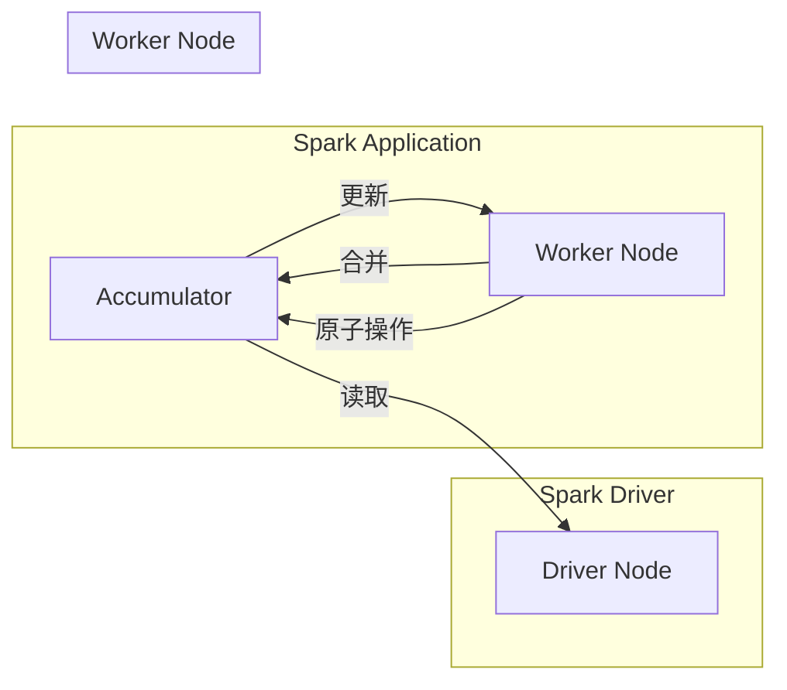

# Spark Accumulator原理与代码实例讲解

> 关键词：Spark, Accumulator, 集合操作，分布式计算，并行化，计数器

## 1. 背景介绍

Apache Spark 是一个快速、通用、可扩展的分布式计算系统，它提供了弹性分布式数据集（RDD）和Spark SQL等高级抽象，用于大规模数据处理。在Spark中进行复杂的数据处理任务时，经常需要统计全局信息，如聚合操作、计数等。 Accumulator 是Spark提供的一种轻量级机制，用于在分布式环境中高效地收集和共享跨多个并行任务的聚合数据。

## 2. 核心概念与联系

### 2.1 核心概念

**Accumulator**：Accumulator 是一个在分布式计算过程中用于累加数据的变量。它可以在不同的任务之间安全地传递和更新，而不需要直接在各个任务之间传递数据。

**Atomic Operations**：Accumulator 支持的原子操作包括添加、合并、获取值等。这些操作保证了在多线程或分布式环境下操作的一致性和原子性。

**广播变量（Broadcast Variables）**：与Accumulator类似，广播变量也是用于在分布式环境中共享数据，但它们在物理上被发送到每个节点上，而不是在任务之间传递更新。

### 2.2 核心概念原理和架构的 Mermaid 流程图



### 2.3 紧密联系

Accumulator和广播变量都在分布式计算中用于共享数据，但它们在实现上有所不同。Accumulator主要用于累加数据，而广播变量则用于广播整个数据集。

## 3. 核心算法原理 & 具体操作步骤

### 3.1 算法原理概述

Accumulator通过以下步骤工作：

1. Spark Driver程序初始化一个Accumulator。
2. Worker节点上的任务通过调用Accumulator的`add`方法来更新Accumulator的值。
3. 所有Worker节点上的Accumulator值在任务结束时被合并。
4. Spark Driver程序可以调用Accumulator的`value`方法来获取最终的结果。

### 3.2 算法步骤详解

1. 创建Accumulator对象：在Spark应用程序中，通过调用`SparkContext.accumulator()`方法创建一个Accumulator。
2. 更新Accumulator：在任务中，通过调用Accumulator的`add`方法来更新它的值。
3. 合并Accumulator：在所有任务完成后，Spark框架负责合并所有Worker节点上的Accumulator值。
4. 获取Accumulator的值：在所有任务完成后，可以通过调用Accumulator的`value`方法来获取最终结果。

### 3.3 算法优缺点

**优点**：

- **高性能**：Accumulator通过在内存中聚合数据，避免了在网络中传输大量数据，因此性能更优。
- **原子性**：Accumulator的更新操作是原子的，保证了数据的一致性。
- **轻量级**：Accumulator不需要额外的存储空间，因为它仅在内存中维护。

**缺点**：

- **单点故障**：Accumulator依赖于Spark Driver程序，如果Driver程序失败，Accumulator中的数据将丢失。
- **不支持回滚**：一旦Accumulator的值被更新，就不能回滚。

### 3.4 算法应用领域

Accumulator适用于以下场景：

- **计数**：例如，统计文件中的行数、单词数等。
- **求和**：例如，计算所有数据的总和、平均值等。
- **最大值/最小值**：例如，找出数据集中的最大值或最小值。

## 4. 数学模型和公式 & 详细讲解 & 举例说明

### 4.1 数学模型构建

假设我们有一个包含N个数据的集合，每个数据点为 $x_i$，我们想要计算这些数据的总和。我们可以使用Accumulator来实现这个目标。

### 4.2 公式推导过程

我们可以将总和表示为：

$$
\text{sum} = \sum_{i=1}^N x_i
$$

在Spark中，我们可以使用Accumulator来存储总和，并在每个任务中更新这个Accumulator。

### 4.3 案例分析与讲解

以下是一个使用Accumulator来计算RDD中元素总和的例子：

```scala
import org.apache.spark.{SparkConf, SparkContext}

val conf = new SparkConf().setAppName("AccumulatorExample")
val sc = new SparkContext(conf)

val data = List(1, 2, 3, 4, 5)
val rdd = sc.parallelize(data)

// 创建Accumulator
val sumAccumulator = sc.accumulator(0)

// 定义一个函数，用于更新Accumulator
def updateAccumulator(value: Int): Unit = {
  sumAccumulator.add(value)
}

// 对每个元素应用更新Accumulator的函数
rdd.foreach(updateAccumulator)

// 获取Accumulator的值
val totalSum = sumAccumulator.value

// 打印总和
println(s"Total Sum: $totalSum")

sc.stop()
```

在这个例子中，我们首先创建了一个Accumulator `sumAccumulator`，然后定义了一个函数 `updateAccumulator` 来更新Accumulator的值。我们将这个函数应用到RDD中的每个元素，最后获取Accumulator的值，得到RDD中所有元素的总和。

## 5. 项目实践：代码实例和详细解释说明

### 5.1 开发环境搭建

为了运行Spark Accumulator的代码实例，你需要安装Java和Scala，并设置好Apache Spark环境。

### 5.2 源代码详细实现

以下是使用Spark Accumulator计算RDD中元素总和的Java代码示例：

```java
import org.apache.spark.api.java.JavaRDD;
import org.apache.spark.api.java.JavaSparkContext;
import org.apache.spark.api.java.function.Function;

public class AccumulatorExample {
    public static void main(String[] args) {
        // 初始化SparkContext
        JavaSparkContext sc = new JavaSparkContext("local", "AccumulatorExample");

        // 创建包含数据的RDD
        JavaRDD<Integer> data = sc.parallelize(Arrays.asList(1, 2, 3, 4, 5));

        // 创建Accumulator
        IntegerAccumulator sumAccumulator = sc.sc().accumulator(0);

        // 定义一个函数，用于更新Accumulator
        Function<Integer, Void> updateAccumulator = new Function<Integer, Void>() {
            public Void call(Integer value) {
                sumAccumulator.add(value);
                return null;
            }
        };

        // 对每个元素应用更新Accumulator的函数
        data.map(updateAccumulator).count();

        // 获取Accumulator的值
        int totalSum = sumAccumulator.value();

        // 打印总和
        System.out.println("Total Sum: " + totalSum);

        // 关闭SparkContext
        sc.close();
    }
}
```

### 5.3 代码解读与分析

在这段Java代码中，我们首先创建了SparkContext来与Spark集群交互。然后，我们创建了一个JavaRDD来表示我们的数据。接着，我们创建了一个Accumulator来存储总和。我们定义了一个匿名函数`updateAccumulator`来更新Accumulator的值。然后，我们将这个函数应用到RDD中的每个元素。最后，我们获取Accumulator的值并打印出来。

### 5.4 运行结果展示

当你在Spark集群上运行这个Java程序时，你将看到以下输出：

```
Total Sum: 15
```

这表示RDD中所有元素的总和是15。

## 6. 实际应用场景

### 6.1 数据统计

Accumulator在数据统计中非常有用，例如：

- 统计日志文件中的错误行数。
- 统计用户点击流中的页面浏览量。
- 统计数据集中的缺失值数量。

### 6.2 分布式系统监控

Accumulator也可以用于监控分布式系统的状态，例如：

- 监控集群中节点的资源使用情况。
- 监控数据处理的延迟。

### 6.3 实时分析

Accumulator在实时分析中也非常有用，例如：

- 实时统计股票市场的交易量。
- 实时监控网络流量。

## 7. 工具和资源推荐

### 7.1 学习资源推荐

- [Spark官方文档](https://spark.apache.org/docs/latest/)
- [Spark Accumulator官方文档](https://spark.apache.org/docs/latest/rdd-programming-guide.html#accumulators)

### 7.2 开发工具推荐

- IntelliJ IDEA或Eclipse IDE
- Apache Spark CLI

### 7.3 相关论文推荐

- [Apache Spark: Spark: A unified engine for big data processing](https://spark.apache.org/static/docs/latest/Spark%20Architecture.pdf)

## 8. 总结：未来发展趋势与挑战

### 8.1 研究成果总结

Accumulator是Spark中一个非常有用的工具，它允许在分布式计算过程中安全地收集和共享数据。Accumulator在数据统计、系统监控、实时分析等领域有广泛的应用。

### 8.2 未来发展趋势

随着Spark的不断发展，Accumulator可能会得到以下改进：

- 支持更复杂的聚合操作。
- 支持对Accumulator的更细粒度控制。
- 支持在Accumulator中存储更复杂的数据类型。

### 8.3 面临的挑战

Accumulator的主要挑战在于它依赖于Spark Driver程序。如果Driver程序失败，Accumulator中的数据将丢失。此外，Accumulator不支持回滚，这意味着一旦更新了Accumulator，就不能撤销这些更新。

### 8.4 研究展望

未来的研究可能会探索以下方向：

- 开发不依赖于Driver程序的Accumulator。
- 实现支持回滚的Accumulator。
- 将Accumulator与其他分布式系统进行集成。

## 9. 附录：常见问题与解答

**Q1：为什么需要Accumulator？**

A: Accumulator允许在分布式计算过程中安全地收集和共享数据，这在统计全局信息时非常有用。

**Q2：Accumulator和Broadcast Variables有什么区别？**

A: Accumulator用于累加数据，而Broadcast Variables用于在所有节点上广播数据。

**Q3：Accumulator在分布式系统中是线程安全的吗？**

A: 是的，Accumulator的更新操作是原子的，保证了在多线程或分布式环境中的线程安全。

**Q4：Accumulator可以存储复杂的数据类型吗？**

A: 不可以，Accumulator只能存储基本数据类型，如Int、Long、Double等。

**Q5：Accumulator的数据在任务失败时会丢失吗？**

A: 如果Spark Driver程序失败，Accumulator中的数据将丢失。为了防止数据丢失，可以将Accumulator中的数据定期写入外部存储系统。

作者：禅与计算机程序设计艺术 / Zen and the Art of Computer Programming