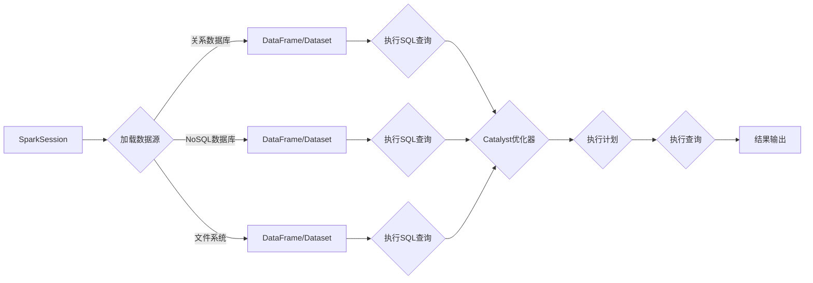

# Spark SQL原理与代码实例讲解

> 关键词：Spark SQL, 分布式数据库，大数据处理，DataFrame，RDD，列式存储，查询优化

## 1. 背景介绍

随着大数据时代的到来，处理和分析海量数据成为企业面临的挑战。Apache Spark作为一款强大的分布式计算框架，因其高效的弹性分布式数据集（RDD）抽象和灵活的查询语言Spark SQL，在处理大规模数据集时表现出色。Spark SQL提供了对关系数据库的支持，允许开发者使用类似SQL的语法查询分布式数据集，极大地方便了数据分析和处理。

### 1.1 问题的由来

传统的数据处理工具如Hadoop MapReduce在处理大规模数据时存在以下问题：

- **计算效率低**：MapReduce的批处理模式不适合实时数据分析。
- **开发复杂**：需要编写大量的Map和Reduce函数。
- **数据格式限制**：对数据格式的要求较为严格。

Spark SQL的出现，解决了上述问题，它提供了如下优势：

- **高性能**：利用内存计算，提供快速的查询响应。
- **易用性**：支持SQL语法，降低了开发难度。
- **灵活的数据源**：支持多种数据源，包括HDFS、HBase、Cassandra等。

### 1.2 研究现状

Spark SQL自2013年发布以来，已经发展成为Spark生态系统中不可或缺的一部分。它支持多种数据源，包括关系数据库、NoSQL数据库、文件存储系统等，并提供了丰富的API和DataFrame/Dataset API，使得数据处理更加灵活和高效。

### 1.3 研究意义

Spark SQL的研究和应用对于大数据处理领域具有重要意义：

- **提高数据处理效率**：通过优化查询执行和利用内存计算，Spark SQL能够显著提高数据处理速度。
- **简化开发流程**：使用类似SQL的语法，降低了大数据处理的开发生命周期。
- **支持复杂查询**：支持复杂的SQL查询和窗口函数，满足多样化的数据处理需求。

### 1.4 本文结构

本文将围绕Spark SQL进行详细介绍，包括核心概念、算法原理、代码实例、实际应用场景等内容。具体结构如下：

- 第2部分：介绍Spark SQL的核心概念与联系。
- 第3部分：讲解Spark SQL的核心算法原理和具体操作步骤。
- 第4部分：阐述Spark SQL的数学模型和公式，并举例说明。
- 第5部分：通过代码实例和详细解释，展示Spark SQL的应用。
- 第6部分：探讨Spark SQL的实际应用场景和未来展望。
- 第7部分：推荐Spark SQL的学习资源、开发工具和相关论文。
- 第8部分：总结Spark SQL的未来发展趋势和挑战。
- 第9部分：提供Spark SQL的常见问题与解答。

## 2. 核心概念与联系

### 2.1 核心概念

- **RDD（弹性分布式数据集）**：Spark的基础抽象，由不可变的数据块组成，支持懒加载数据。
- **DataFrame**：Spark SQL的核心数据结构，类似SQL中的表，提供丰富的操作API。
- **Dataset**：DataFrame的更加强大的抽象，提供了懒加载和惰性求值的能力。
- **Catalyst优化器**：Spark SQL的核心组件，负责解析SQL语句、生成执行计划并进行优化。
- **SparkSession**：Spark SQL的入口点，用于创建DataFrame和Dataset。

### 2.2 Mermaid流程图



### 2.3 核心概念联系

Spark SQL通过SparkSession连接到数据源，加载数据到DataFrame或Dataset中。然后，使用类似SQL的语法执行查询，Catalyst优化器负责解析SQL语句并生成执行计划。最后，执行计划被提交给Spark执行引擎，并输出结果。

## 3. 核心算法原理 & 具体操作步骤

### 3.1 算法原理概述

Spark SQL的核心原理是基于DataFrame/Dataset抽象和Catalyst优化器。DataFrame/Dataset提供了一种类似于关系数据库表的数据结构，Catalyst优化器则负责解析SQL语句、优化执行计划。

### 3.2 算法步骤详解

1. **加载数据**：使用SparkSession加载数据到DataFrame或Dataset。
2. **解析SQL语句**：Catalyst优化器解析SQL语句，将其转换为逻辑计划。
3. **优化执行计划**：Catalyst优化器对逻辑计划进行优化，生成物理计划。
4. **执行查询**：Spark执行引擎根据物理计划执行查询，并输出结果。

### 3.3 算法优缺点

**优点**：

- **高效**：利用内存计算，提供快速的查询响应。
- **易用**：支持SQL语法，降低了开发难度。
- **灵活**：支持多种数据源和复杂的查询。

**缺点**：

- **学习曲线**：对于不熟悉SQL的开发者来说，学习Spark SQL需要一定时间。
- **资源消耗**：Spark SQL需要一定的资源来运行，包括内存和CPU。

### 3.4 算法应用领域

Spark SQL适用于以下领域：

- **数据仓库**：构建数据仓库，进行数据分析和报告。
- **实时分析**：进行实时数据分析，如点击流分析、用户行为分析等。
- **机器学习**：进行大规模机器学习训练和预测。

## 4. 数学模型和公式 & 详细讲解 & 举例说明

### 4.1 数学模型构建

Spark SQL的数学模型主要基于关系代数。关系代数是一种抽象的数学模型，用于描述数据库查询操作。

### 4.2 公式推导过程

Spark SQL的查询优化主要基于关系代数的规则。例如，选择操作（SELECT）可以表示为：

$$
\sigma_{\phi}(R) = \{t \in R | \phi(t)\}
$$

其中，$\sigma_{\phi}(R)$ 表示选择操作，$R$ 表示关系，$\phi(t)$ 表示选择条件。

### 4.3 案例分析与讲解

假设有一个名为`employees`的DataFrame，包含员工的信息，如下所示：

```
+----+--------+--------+--------+
| id | name   | age    | salary |
+----+--------+--------+--------+
| 1  | Alice  | 30     | 50000  |
| 2  | Bob    | 25     | 60000  |
| 3  | Carol  | 35     | 55000  |
+----+--------+--------+--------+
```

现在，我们想要查询年龄大于30岁的员工姓名和工资，可以使用以下SQL查询：

```sql
SELECT name, salary FROM employees WHERE age > 30;
```

Spark SQL会解析这个查询，并将其转换为关系代数表达式：

$$
\sigma_{age > 30}(R) = \{t \in R | age(t) > 30\}
$$

然后，Spark SQL会根据执行计划执行查询，并输出结果：

```
+--------+--------+
| name   | salary |
+--------+--------+
| Alice  | 50000  |
| Carol  | 55000  |
+--------+--------+
```

## 5. 项目实践：代码实例和详细解释说明

### 5.1 开发环境搭建

首先，需要在本地或服务器上安装Apache Spark。以下是使用Anaconda环境安装Spark的步骤：

1. 创建Anaconda环境：

```bash
conda create -n spark-env python=3.8
conda activate spark-env
```

2. 安装Spark：

```bash
conda install -c conda-forge spark
```

### 5.2 源代码详细实现

下面是一个简单的Spark SQL代码实例，演示如何加载数据、执行查询和显示结果：

```python
from pyspark.sql import SparkSession

# 创建SparkSession
spark = SparkSession.builder \
    .appName("Spark SQL Example") \
    .getOrCreate()

# 加载数据
data = [("Alice", 30, 50000),
        ("Bob", 25, 60000),
        ("Carol", 35, 55000)]

columns = ["name", "age", "salary"]

df = spark.createDataFrame(data, schema=columns)

# 显示DataFrame结构
df.printSchema()

# 执行查询
result = df.filter("age > 30")

# 显示查询结果
result.show()

# 停止SparkSession
spark.stop()
```

### 5.3 代码解读与分析

上述代码首先创建了一个SparkSession，然后创建了一个DataFrame，其中包含了员工的姓名、年龄和工资。接着，使用filter操作对DataFrame进行筛选，只保留年龄大于30岁的员工。最后，使用show方法显示查询结果。

### 5.4 运行结果展示

运行上述代码后，将得到以下输出：

```
root
name: string (nullable = true)
age: int (nullable = true)
salary: int (nullable = true)

+----+--------+--------+
| age|name    |salary  |
+----+--------+--------+
| 30 |Alice   |50000   |
| 35 |Carol   |55000   |
+----+--------+--------+
```

## 6. 实际应用场景

### 6.1 数据仓库

Spark SQL可以用于构建数据仓库，将来自不同数据源的数据整合到一个中央位置，以便进行统一的数据分析和报告。

### 6.2 实时分析

Spark SQL可以用于实时分析，如监控用户行为、分析社交媒体数据等。

### 6.3 机器学习

Spark SQL可以用于机器学习，如构建推荐系统、预测模型等。

## 7. 工具和资源推荐

### 7.1 学习资源推荐

- Apache Spark官网：https://spark.apache.org/
- Spark SQL官方文档：https://spark.apache.org/docs/latest/sql/index.html
- 《Spark快速大数据处理》书籍

### 7.2 开发工具推荐

- PySpark：使用Python进行Spark编程
- Spark Shell：交互式命令行界面
- IntelliJ IDEA：集成开发环境，支持Spark开发

### 7.3 相关论文推荐

- Spark SQL: A Big Data SQL Engine for Apache Spark (https://spark.apache.org/docs/latest/sql/)
- Spark: The Definitive Guide (https://spark.apache.org/docs/latest/tutorials.html)

## 8. 总结：未来发展趋势与挑战

### 8.1 研究成果总结

Spark SQL作为Apache Spark生态系统的重要组成部分，以其高效、易用和灵活的特点，在数据处理领域得到了广泛应用。它简化了大数据处理流程，提高了开发效率，推动了数据分析和机器学习的发展。

### 8.2 未来发展趋势

- **更强大的优化器**：Catalyst优化器将继续改进，以提供更好的查询性能。
- **更多数据源支持**：Spark SQL将支持更多数据源，如云数据库、边缘计算设备等。
- **更好的集成**：Spark SQL将与其他Spark组件，如Spark MLlib、GraphX等，更好地集成，提供更全面的大数据处理解决方案。

### 8.3 面临的挑战

- **资源消耗**：Spark SQL在执行复杂查询时，可能会消耗大量资源。
- **性能瓶颈**：在处理极大规模数据时，Spark SQL的性能可能会受到影响。

### 8.4 研究展望

Spark SQL将继续发展，以应对未来大数据处理的需求。未来，Spark SQL可能会：

- **进一步优化性能**：通过算法优化、硬件加速等技术，提高查询性能。
- **扩展应用范围**：将Spark SQL应用于更多领域，如物联网、边缘计算等。

## 9. 附录：常见问题与解答

**Q1：Spark SQL与Hive有何区别？**

A：Spark SQL与Hive都是用于大数据处理的工具，但它们有一些区别：

- **Hive是基于Hadoop的批处理框架，主要用于批量数据处理，不支持实时查询**。
- **Spark SQL是基于Spark的分布式计算框架，支持实时查询和分析，性能比Hive更好**。

**Q2：Spark SQL支持哪些数据源？**

A：Spark SQL支持多种数据源，包括：

- **关系数据库**：如MySQL、PostgreSQL等。
- **NoSQL数据库**：如HBase、Cassandra等。
- **文件系统**：如HDFS、S3等。
- **其他数据源**：如Kafka、Flume等。

**Q3：如何优化Spark SQL的查询性能？**

A：优化Spark SQL的查询性能可以从以下几个方面入手：

- **使用DataFrame/Dataset API**：相比于RDD，DataFrame/Dataset提供了更好的优化。
- **合理分区**：根据数据分布进行分区，减少数据倾斜。
- **避免执行昂贵的操作**：如全表扫描、自连接等。
- **使用缓存**：缓存常用数据，减少数据读取时间。

**Q4：Spark SQL是否支持多租户隔离？**

A：Spark SQL支持多租户隔离，可以通过SparkSession的配置来实现。例如：

```python
spark = SparkSession.builder \
    .appName("app1") \
    .config("spark.sql.session.timeZone", "UTC") \
    .getOrCreate()
```

**Q5：Spark SQL是否支持机器学习**？

A：Spark SQL支持机器学习。Spark MLlib提供了丰富的机器学习算法，可以与Spark SQL结合使用，进行数据分析和预测。

---

作者：禅与计算机程序设计艺术 / Zen and the Art of Computer Programming