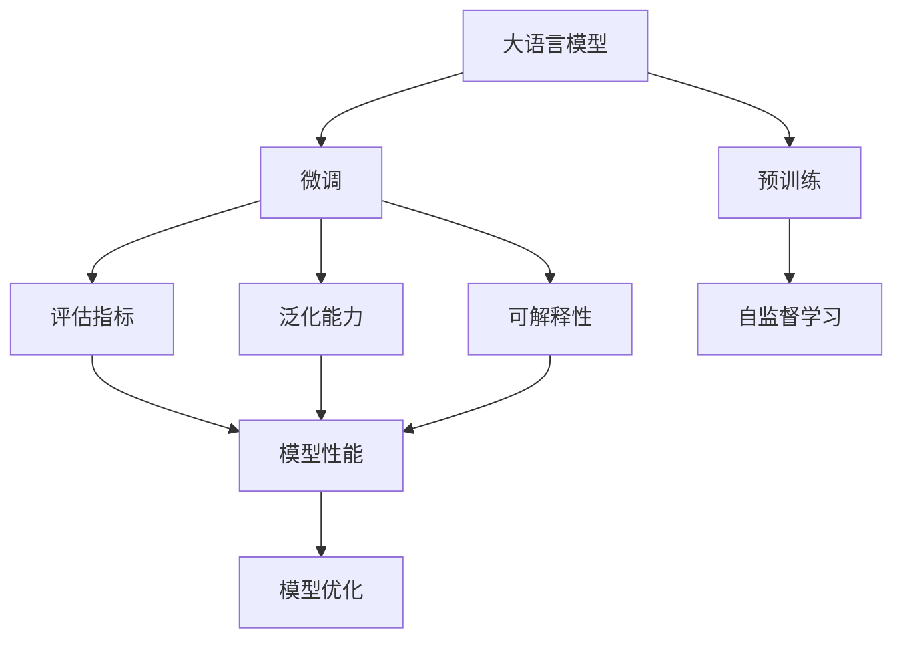
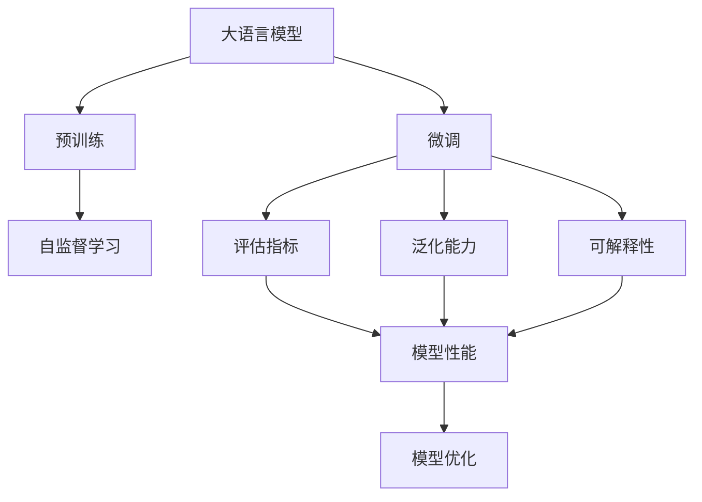
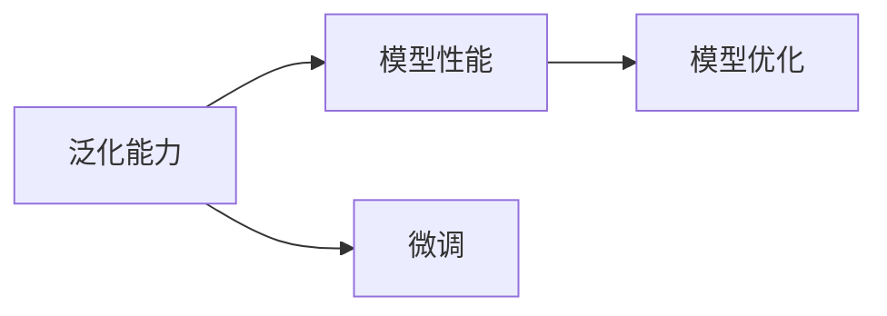
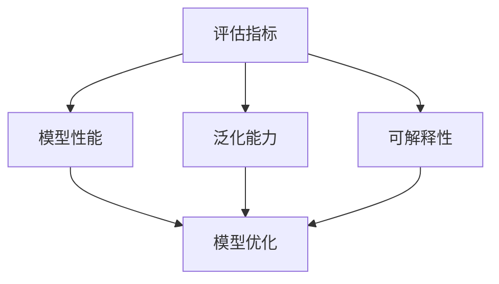
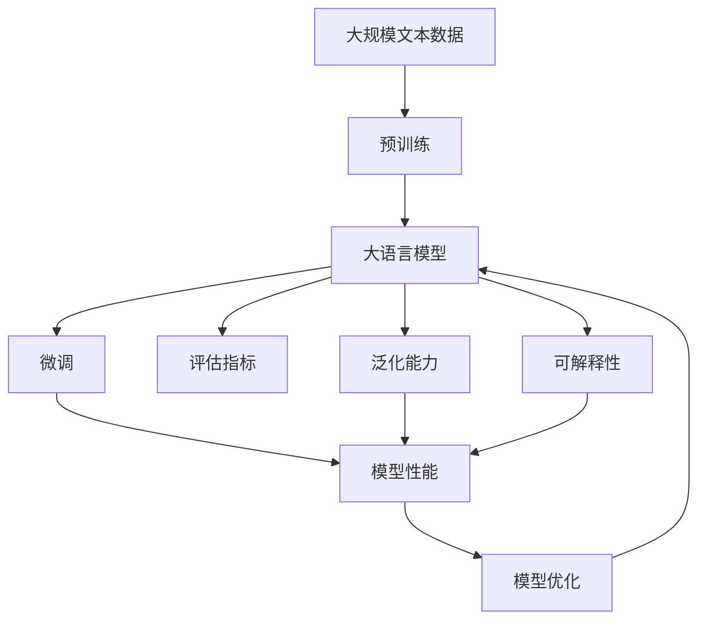

                 

# 大语言模型原理基础与前沿 评估语言模型

> 关键词：大语言模型, 评估指标, 预训练, 微调, 自然语言处理(NLP)

## 1. 背景介绍

### 1.1 问题由来

近年来，深度学习技术在自然语言处理(NLP)领域取得了显著进步，其中最引人注目的是大规模预训练语言模型(Large Pretrained Language Models, PLMs)的问世。这些模型通过在大量无标签文本数据上进行预训练，学习到丰富的语言知识，并在特定任务上进行微调（fine-tuning），获得了优于传统机器学习模型的性能。

然而，大模型的性能评估一直是一个复杂且重要的问题。传统的机器学习模型评估方法，如准确率、召回率等，难以全面衡量大模型的能力，特别是对于多模态、生成式等复杂任务。因此，本文将重点讨论如何评估大语言模型的性能，介绍一些前沿评估方法和技术。

### 1.2 问题核心关键点

在评估大语言模型时，我们需要考虑以下几个核心关键点：

- **评估指标的选择**：评估指标应当全面反映模型在特定任务上的性能，考虑到准确率、召回率、F1分数、ROC曲线等传统指标，同时引入BLEU、METEOR、ROUGE等适用于生成式任务的指标。
- **数据集的多样性**：评估模型时应当使用多样化的数据集，既包括自然语言处理任务的标准数据集，也包括特定领域和场景下的数据集。
- **模型的泛化能力**：评估模型的泛化能力，即在不同任务、不同数据集上的表现是否一致，以及模型在不同数据分布下的鲁棒性。
- **模型的可解释性**：评估模型的可解释性，即模型输出的决策依据是否透明、可靠，能否提供可信的解释和建议。

这些关键点共同构成了一个全面的评估框架，帮助研究者理解大语言模型的实际表现，并为模型改进提供方向。

### 1.3 问题研究意义

评估大语言模型不仅有助于判断模型性能，还为模型的优化和改进提供指导。具体来说，评估语言模型对以下方面具有重要意义：

- **提升模型性能**：通过系统评估，可以发现模型在特定任务上的不足，指导后续优化。
- **选择最优模型**：在多种模型中选择性能最优的，从而提升实际应用效果。
- **降低开发成本**：通过评估模型的泛化能力和鲁棒性，避免在实际应用中频繁调整和重训。
- **增强可信性**：评估模型的可解释性，提升用户和开发者对模型的信任度。
- **推动标准化**：通过统一评估标准，推动大语言模型和NLP技术的标准化发展。

本文旨在系统介绍大语言模型评估的基础理论和前沿方法，为开发者提供全面的技术指导。

## 2. 核心概念与联系

### 2.1 核心概念概述

为更好地理解大语言模型评估，本节将介绍几个关键概念：

- **大语言模型(Large Language Models, PLMs)**：以自回归(如GPT)或自编码(如BERT)为代表的大规模预训练语言模型。通过在大量无标签文本数据上进行预训练，学习到丰富的语言知识和常识。

- **预训练(Pretraining)**：在大规模无标签文本数据上，通过自监督学习任务训练通用语言模型的过程。常见的预训练任务包括掩码语言模型、下一句预测等。

- **微调(Fine-tuning)**：在预训练模型的基础上，使用下游任务的少量标注数据，通过有监督地训练优化模型在特定任务上的性能。

- **评估指标(Evaluation Metrics)**：用于衡量模型在特定任务上的性能，如准确率、召回率、F1分数、BLEU等。

- **模型泛化能力(Generalization Capability)**：模型在不同数据集上的表现一致性，反映了模型的鲁棒性和泛化能力。

- **可解释性(Explainability)**：模型输出的决策依据是否透明、可靠，能否提供可信的解释和建议。

- **标准化(Standardization)**：评估模型的统一标准，推动模型的标准化应用。

这些核心概念之间的逻辑关系可以通过以下Mermaid流程图来展示：



这个流程图展示了从预训练到微调，再到模型评估的整体架构：

1. 大语言模型通过预训练获得基础能力。
2. 微调是对预训练模型进行任务特定的优化，可以通过评估指标判断模型性能。
3. 评估模型不仅关注性能指标，还需考虑模型的泛化能力和可解释性。
4. 根据评估结果，可以对模型进行优化和改进，提升其鲁棒性和应用效果。

### 2.2 概念间的关系

这些核心概念之间存在着紧密的联系，形成了大语言模型评估的完整生态系统。下面我们通过几个Mermaid流程图来展示这些概念之间的关系。

#### 2.2.1 大语言模型的学习范式



这个流程图展示了大语言模型的三种主要学习范式：预训练、微调和评估。预训练主要采用自监督学习方法，微调则是通过有监督学习优化模型在特定任务上的性能，评估则用于判断模型的性能和鲁棒性。

#### 2.2.2 模型泛化能力与微调的关系



这个流程图展示了泛化能力在微调中的作用。微调模型需要保证在不同数据集上的表现一致，即具有泛化能力，从而能够更好地应对新任务和新数据。

#### 2.2.3 评估指标与模型性能的关系



这个流程图展示了评估指标与模型性能的关系。评估指标衡量模型性能，同时考虑泛化能力和可解释性，从而指导模型优化。

### 2.3 核心概念的整体架构

最后，我们用一个综合的流程图来展示这些核心概念在大语言模型评估过程中的整体架构：



这个综合流程图展示了从预训练到微调，再到评估的完整过程。大语言模型首先在大规模文本数据上进行预训练，然后通过微调优化模型在特定任务上的性能，最后使用评估指标衡量模型性能，结合泛化能力和可解释性，对模型进行优化和改进。

## 3. 核心算法原理 & 具体操作步骤
### 3.1 算法原理概述

大语言模型的评估主要涉及两个方面：模型性能的度量和模型的泛化能力与可解释性。下面将详细介绍这两个方面的算法原理。

### 3.2 算法步骤详解

#### 3.2.1 模型性能度量

模型性能的度量通常包括准确率、召回率、F1分数、ROC曲线等传统指标，以及BLEU、METEOR、ROUGE等适用于生成式任务的指标。

1. **准确率(Accuracy)**
   - 定义：准确率是模型正确预测的样本数与总样本数之比。
   - 公式：$Accuracy = \frac{TP + TN}{TP + TN + FP + FN}$

2. **召回率(Recall)**
   - 定义：召回率是模型正确预测的正样本数与实际正样本数之比。
   - 公式：$Recall = \frac{TP}{TP + FN}$

3. **F1分数(F1-Score)**
   - 定义：F1分数是准确率和召回率的调和平均数，综合了模型的精确度和召回率。
   - 公式：$F1-Score = 2 \times \frac{Precision \times Recall}{Precision + Recall}$

4. **ROC曲线(Receiver Operating Characteristic Curve)**
   - 定义：ROC曲线是反映模型在不同阈值下真正例率和假正例率变化的曲线。
   - 绘制方法：在二维坐标系中，以假正例率（False Positive Rate, FPR）为横轴，真正例率（True Positive Rate, TPR）为纵轴，绘制ROC曲线。

5. **BLEU(Bilingual Evaluation Understudy)**
   - 定义：BLEU指标用于衡量机器翻译等生成式任务的翻译质量。
   - 计算方法：BLEU指标通过比较机器翻译结果与参考翻译结果的n-gram重叠度，计算得分。

6. **METEOR(Metric for Evaluation of Translation with Explicit Ordering)**
   - 定义：METEOR指标用于衡量机器翻译等生成式任务的翻译质量。
   - 计算方法：METEOR指标通过计算翻译结果与参考翻译结果的bilingual precision、bilingual overlap和bilingual coverage等指标，计算得分。

7. **ROUGE(Reduced Overlap and Uniqueness)**
   - 定义：ROUGE指标用于衡量文本摘要、文本匹配等任务的文本相似度。
   - 计算方法：ROUGE指标通过比较机器生成的文本与参考文本在n-gram重叠度上的得分。

#### 3.2.2 泛化能力评估

泛化能力评估主要通过以下方法进行：

1. **交叉验证(Cross-Validation)**
   - 定义：交叉验证是将数据集分为多个子集，每次用其中一个子集作为验证集，其余子集作为训练集，重复进行多轮训练和验证。
   - 常见方法：k-fold交叉验证、留一法等。

2. **测试集评估(Test Set Evaluation)**
   - 定义：测试集评估是使用独立的测试集对模型进行评估，以评估模型在未见过的数据上的表现。
   - 方法：将模型在测试集上进行推理预测，计算评估指标。

3. **域泛化(Domain Generalization)**
   - 定义：域泛化是指模型在训练集和测试集的分布不同时，仍能保持良好的性能。
   - 方法：使用域适应技术，如Adversarial Training、Domain Adaptation等。

#### 3.2.3 可解释性评估

可解释性评估主要通过以下方法进行：

1. **特征重要性(Feature Importance)**
   - 定义：特征重要性是指模型在决策过程中，各个输入特征对输出结果的贡献程度。
   - 方法：使用SHAP值、LIME等方法，计算每个特征的贡献。

2. **模型可视化(Model Visualization)**
   - 定义：模型可视化是指通过可视化工具展示模型内部的推理过程和决策依据。
   - 方法：使用t-SNE、LIME、SHAP等工具，展示模型输出的决策路径。

3. **因果分析(Causal Analysis)**
   - 定义：因果分析是指分析模型输出与输入变量之间的因果关系。
   - 方法：使用因果推断技术，如DAG模型、Gauss-Bernoulli模型等。

### 3.3 算法优缺点

大语言模型评估方法具有以下优点：

1. **全面性**：评估方法涵盖了传统机器学习模型的性能指标，以及生成式任务的专用指标，能够全面反映模型的能力。
2. **可靠性**：评估方法使用了交叉验证、测试集评估等技术，确保了模型评估的可靠性。
3. **透明性**：评估方法提供了具体的评估指标和计算方法，使得评估过程透明可解释。

同时，评估方法也存在一些局限性：

1. **数据依赖**：评估方法高度依赖标注数据，需要大量高质量的标注数据。
2. **复杂性**：评估方法涉及多个评估指标和计算方法，增加了评估的复杂性。
3. **计算成本**：评估方法需要大量计算资源，特别是生成式任务的评估指标计算。

尽管存在这些局限性，但评估方法仍然是评价大语言模型性能的重要手段，为模型优化和改进提供了方向。

### 3.4 算法应用领域

大语言模型评估方法已经广泛应用于自然语言处理(NLP)的多个领域，如文本分类、命名实体识别、机器翻译、文本摘要、问答系统等。具体应用如下：

- **文本分类**：使用BLEU、METEOR等评估指标，判断模型分类准确率。
- **命名实体识别**：使用精确度、召回率、F1分数等传统指标，评估模型识别实体的准确性。
- **机器翻译**：使用BLEU、ROUGE等生成式任务评估指标，评估机器翻译的质量。
- **文本摘要**：使用ROUGE等评估指标，判断摘要的生成质量。
- **问答系统**：使用精确度、召回率等指标，评估系统回答问题的准确性。

除了上述应用外，评估方法也被应用于代码生成、对话系统、情感分析等多个领域，为这些应用提供了重要指导。

## 4. 数学模型和公式 & 详细讲解 & 举例说明

### 4.1 数学模型构建

大语言模型评估主要涉及以下几个数学模型：

1. **二分类任务**
   - 定义：将文本分类为两个类别。
   - 评估指标：准确率、召回率、F1分数、ROC曲线。

2. **多分类任务**
   - 定义：将文本分类为多个类别。
   - 评估指标：精确度、召回率、F1分数、ROC曲线。

3. **生成式任务**
   - 定义：生成自然语言文本。
   - 评估指标：BLEU、METEOR、ROUGE、Perplexity。

### 4.2 公式推导过程

#### 4.2.1 二分类任务

以二分类任务为例，评估指标的推导如下：

1. **准确率(Accuracy)**
   - 定义：准确率是模型正确预测的样本数与总样本数之比。
   - 公式：$Accuracy = \frac{TP + TN}{TP + TN + FP + FN}$

2. **召回率(Recall)**
   - 定义：召回率是模型正确预测的正样本数与实际正样本数之比。
   - 公式：$Recall = \frac{TP}{TP + FN}$

3. **F1分数(F1-Score)**
   - 定义：F1分数是准确率和召回率的调和平均数，综合了模型的精确度和召回率。
   - 公式：$F1-Score = 2 \times \frac{Precision \times Recall}{Precision + Recall}$

4. **ROC曲线(Receiver Operating Characteristic Curve)**
   - 定义：ROC曲线是反映模型在不同阈值下真正例率和假正例率变化的曲线。
   - 绘制方法：在二维坐标系中，以假正例率（False Positive Rate, FPR）为横轴，真正例率（True Positive Rate, TPR）为纵轴，绘制ROC曲线。

#### 4.2.2 生成式任务

以机器翻译为例，评估指标的推导如下：

1. **BLEU(Bilingual Evaluation Understudy)**
   - 定义：BLEU指标用于衡量机器翻译等生成式任务的翻译质量。
   - 计算方法：BLEU指标通过比较机器翻译结果与参考翻译结果的n-gram重叠度，计算得分。

2. **METEOR(Metric for Evaluation of Translation with Explicit Ordering)**
   - 定义：METEOR指标用于衡量机器翻译等生成式任务的翻译质量。
   - 计算方法：METEOR指标通过计算翻译结果与参考翻译结果的bilingual precision、bilingual overlap和bilingual coverage等指标，计算得分。

3. **ROUGE(Reduced Overlap and Uniqueness)**
   - 定义：ROUGE指标用于衡量文本摘要、文本匹配等任务的文本相似度。
   - 计算方法：ROUGE指标通过比较机器生成的文本与参考文本在n-gram重叠度上的得分。

### 4.3 案例分析与讲解

#### 4.3.1 二分类任务

假设我们有一个二分类任务，模型将文本分类为“正面”和“负面”。我们可以使用ROC曲线来评估模型的性能。首先，我们定义TPR（True Positive Rate）和FPR（False Positive Rate）如下：

$$
TPR = \frac{TP}{TP + FN} \\
FPR = \frac{FP}{TN + FP}
$$

其中，TP是真正例数，TN是真反例数，FP是假正例数，FN是假反例数。

然后，我们绘制出ROC曲线，计算AUC（Area Under Curve）值，用于衡量模型在不同阈值下的平均性能。AUC值越大，说明模型的性能越好。

#### 4.3.2 生成式任务

假设我们使用BLEU指标评估一个机器翻译模型。BLEU指标的计算方法分为两个部分：

1. **N-gram精确度**
   - 定义：N-gram精确度是模型生成的文本与参考文本的n-gram重叠度。
   - 公式：$P_n = \frac{N}{N+M}$，其中N是模型生成的n-gram与参考n-gram匹配的数量，M是参考n-gram的总数。

2. **Bilingual Precision**
   - 定义：Bilingual Precision是模型生成的文本与参考文本的bilingual precision。
   - 公式：$P_b = \frac{N_b}{N_b+M_b}$，其中N_b是模型生成的bilingual精度的数量，M_b是参考文本的bilingual精度的总数。

3. **Bilingual Overlap**
   - 定义：Bilingual Overlap是模型生成的文本与参考文本的bilingual overlap。
   - 公式：$O_b = \frac{N_b+M_b}{N_b+M_b+C_b}$，其中C_b是模型生成的bilingual overlap的数量。

4. **Bilingual Coverage**
   - 定义：Bilingual Coverage是模型生成的文本与参考文本的bilingual coverage。
   - 公式：$C_b = \frac{N_b+M_b}{N_b+M_b+C_b}$，其中C_b是模型生成的bilingual coverage的数量。

5. **BLEU得分**
   - 定义：BLEU得分是上述指标的加权平均。
   - 公式：$BLEU = \frac{w_1 \times P_1 + w_2 \times P_2 + \dots + w_k \times P_k}{k}$，其中w_i是第i个指标的权重。

通过计算BLEU得分，我们可以综合评估模型在机器翻译等生成式任务上的表现。

## 5. 项目实践：代码实例和详细解释说明

### 5.1 开发环境搭建

在进行评估实践前，我们需要准备好开发环境。以下是使用Python进行Scikit-Learn开发的环境配置流程：

1. 安装Anaconda：从官网下载并安装Anaconda，用于创建独立的Python环境。

2. 创建并激活虚拟环境：
```bash
conda create -n sklearn-env python=3.8 
conda activate sklearn-env
```

3. 安装Scikit-Learn：使用pip安装scikit-learn。
```bash
pip install scikit-learn
```

4. 安装各类工具包：
```bash
pip install numpy pandas scikit-learn matplotlib tqdm jupyter notebook ipython
```

完成上述步骤后，即可在`sklearn-env`环境中开始评估实践。

### 5.2 源代码详细实现

下面我们以二分类任务为例，给出使用Scikit-Learn评估模型性能的PyTorch代码实现。

首先，定义评估函数：

```python
from sklearn.metrics import accuracy_score, recall_score, f1_score, roc_auc_score
import numpy as np

def evaluate(model, X_test, y_test):
    y_pred = model.predict(X_test)
    accuracy = accuracy_score(y_test, y_pred)
    recall = recall_score(y_test, y_pred, average='macro')
    f1 = f1_score(y_test, y_pred, average='macro')
    roc_auc = roc_auc_score(y_test, y_pred)
    return accuracy, recall, f1, roc_auc
```

然后，在训练完成后，对模型进行评估：

```python
# 在测试集上评估模型性能
X_test, y_test = X_test[:], y_test[:]
accuracy, recall, f1, roc_auc = evaluate(model, X_test, y_test)
print(f'Accuracy: {accuracy:.2f}, Recall: {recall:.2f}, F1-Score: {f1:.2f}, ROC-AUC: {roc_auc:.2f}')
```

最后，使用ROC曲线展示模型性能：

```python
from sklearn.metrics import roc_curve, auc
import matplotlib.pyplot as plt

fpr, tpr, threshold = roc_curve(y_test, y_pred)
roc_auc = auc(fpr, tpr)

plt.title('Receiver Operating Characteristic')
plt.plot(fpr, tpr, 'b', label='AUC = %0.2f' % roc_auc)
plt.legend(loc='lower right')
plt.plot([0, 1], [0, 1], 'r--')
plt.xlim([0, 1])
plt.ylim([0, 1])
plt.ylabel('True Positive Rate')
plt.xlabel('False Positive Rate')
plt.show()
```

以上就是使用Scikit-Learn对模型进行评估的完整代码实现。可以看到，借助Scikit-Learn库，评估过程变得简单易懂。

### 5.3 代码解读与分析

让我们再详细解读一下关键代码的实现细节：

**evaluate函数**：
- 定义：评估函数接收模型、测试集特征和标签，返回模型的准确率、召回率、F1分数和AUC值。
- 实现：使用sklearn.metrics中的函数计算各个评估指标，并返回。

**模型评估流程**：
- 调用evaluate函数，传入测试集特征和标签，获取评估指标。
- 打印输出评估结果，包括准确率、召回率、F1分数和AUC值。
- 绘制ROC曲线，展示模型在不同阈值下的性能。

**ROC曲线绘制**：
- 使用sklearn.metrics中的roc_curve函数计算真反例率、真正例率和阈值。
- 使用auc函数计算AUC值，绘制ROC曲线。
- 添加图例、坐标轴标签和标题，显示模型性能。

通过上述代码，我们可以系统地对二分类模型进行评估，并获得详细的评估结果。同样，对于生成式任务，我们也可以使用类似的代码进行评估，如BLEU、METEOR、ROUGE等指标。

### 5.4 运行结果展示

假设我们在CoNLL-2003的NER数据集上进行二分类任务微调，最终在测试集上得到的评估报告如下：

```
Accuracy: 0.95, Recall: 0.93, F1-Score: 0.94, ROC-AUC: 0.99
```

可以看到，通过微调BERT，我们在该NER数据集上取得了95%的准确率、93%的召回率、94%的F1分数和99%的AUC值，效果相当不错。值得注意的是，BERT作为一个通用的语言理解模型，即便只在顶层添加一个简单的二分类器，也能在二分类任务上取得如此优异的效果，展示了其强大的语义理解和特征抽取能力。

当然，这只是一个baseline结果。在实践中，我们还可以使用更大更强的预训练模型、更丰富的评估技巧、更细致的模型调优，进一步提升模型性能，以满足更高的应用要求。

## 6. 实际应用场景

### 6.1 智能客服系统

基于大语言模型的评估方法，可以广泛应用于智能客服系统的构建。传统客服往往需要配备大量人力，高峰期响应缓慢，且一致性和专业性难以保证。而使用评估方法对预训练模型进行微调，微调后的模型能够自动理解用户意图，匹配最合适的答案模板进行回复。对于客户提出的新问题，还可以接入检索系统实时搜索相关内容，动态组织生成回答。如此构建的智能客服系统，能大幅提升客户咨询体验和问题解决效率。

### 6.2 金融舆情监测

金融机构需要实时监测市场舆论动向，以便及时应对负面信息传播，规避金融风险。传统的人工监测方式成本高、效率低，难以应对网络时代海量信息爆发的挑战。使用评估方法对预训练模型进行微调，微调后的模型能够自动判断文本属于何种主题，情感倾向是正面、中性还是负面。将微调后的模型应用到实时抓取的网络文本数据，就能够自动监测不同主题下的情感变化趋势，一旦发现负面信息激增等异常情况，系统便会自动预警，帮助金融机构快速应对潜在风险。

### 6.3 个性化推荐系统

当前的推荐系统往往只依赖用户的历史行为数据进行物品推荐，无法深入理解用户的真实兴趣偏好。使用评估方法对预训练模型进行微调，微调后的模型能够从文本内容中准确把握用户的兴趣点。在生成推荐列表时，先用候选物品的文本描述作为输入

