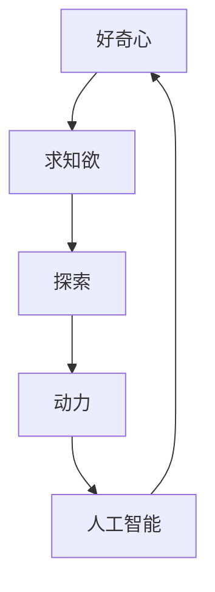
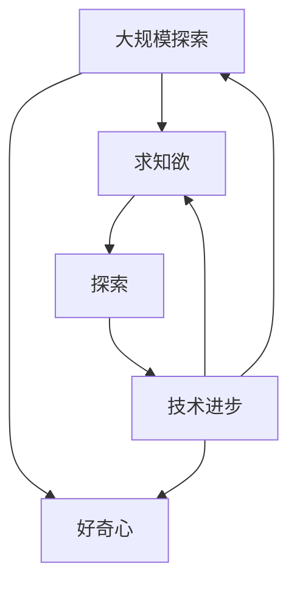

                 

# 好奇心与求知欲：探索的动力

> 关键词：好奇心,求知欲,探索,动力,人工智能,技术发展,认知突破

## 1. 背景介绍

### 1.1 问题的由来
人类自诞生以来，就对未知世界充满着强烈的好奇心和求知欲。这种好奇心驱使我们不断探索自然和社会奥秘，推动了科技进步和文化繁荣。在科技领域，好奇心与求知欲同样是推动技术发展的核心动力。从古至今，无数伟大的科学家和工程师，正是凭借这种探索精神，不断突破技术瓶颈，引领了人类社会的发展。

### 1.2 问题的核心关键点
好奇心和求知欲不仅是人类与生俱来的内在驱动力，也是推动科学和技术进步的核心力量。特别是在当今信息爆炸、技术迭代速度加快的时代，这种探索精神显得更为重要。下面我们将从以下几个方面，深入探讨好奇心和求知欲在人工智能技术发展中的作用和重要性。

## 2. 核心概念与联系

### 2.1 核心概念概述
为更好地理解好奇心和求知欲在技术探索中的作用，本节将介绍几个核心概念：

- **好奇心**：指对未知事物或现象感到新奇、渴望探究的心理状态。好奇心能够激发人去了解和理解未知世界，推动技术创新。

- **求知欲**：指追求知识和真理的内在动机，是人类学习和发展的重要驱动力。求知欲驱动人们去发现、学习和应用新知识，从而推动技术进步。

- **探索**：指通过观察、实验、实践等方式，主动去发现和验证新知识的过程。探索是科学和技术进步的基础，也是人类进步的重要途径。

- **动力**：指推动行为或变化的内在力量。好奇心和求知欲作为内在动力，能够驱动人们不断探索和创新。

- **人工智能**：指通过模拟和扩展人类智能，实现机器理解和执行复杂任务的技术。好奇心和求知欲是推动AI技术发展的重要动力。

这些核心概念之间存在着密切的联系，形成了一个有机整体。好奇心和求知欲激发了人们探索新技术、新知识的内在动力，而探索的过程则推动了技术的进步和应用的扩展。最终，技术的进步又反过来满足了人们的好奇心和求知欲，形成了一个良性循环。

### 2.2 概念间的关系

这些核心概念之间的关系可以通过以下Mermaid流程图来展示：



这个流程图展示了核心概念之间的相互关系：好奇心激发了求知欲，求知欲驱动了探索行为，探索过程产生了推动技术进步的动力，而技术的进步又反过来满足了人们的好奇心和求知欲，形成了一个循环。

### 2.3 核心概念的整体架构

最后，我们用一个综合的流程图来展示这些核心概念在大规模探索中的整体架构：



这个综合流程图展示了从大规模探索到大规模技术进步的完整过程。大规模探索是由好奇心和求知欲驱动的，而探索过程中产生的新技术和新知识又反过来满足了人们的好奇心和求知欲，推动了更多大规模探索的发生，形成了一个不断自我强化的循环。

## 3. 核心算法原理 & 具体操作步骤

### 3.1 算法原理概述

好奇心和求知欲驱动的大规模探索，本质上是一个复杂的自适应过程。其核心算法原理如下：

- **数据获取**：通过各种方式获取大量未标注数据，构建数据池。
- **特征提取**：使用先进的特征提取算法，对数据进行深度处理，形成高层次的特征表示。
- **模型训练**：应用高效的模型训练算法，在大量数据上迭代优化模型参数。
- **结果验证**：通过自动或人工验证，评估模型性能，进行必要的调整和改进。
- **模型部署**：将训练好的模型部署到实际应用场景中，验证其效果。

这个探索过程可以看作是一种大规模的试错和优化，通过不断的试验和调整，逐步接近目标。在AI技术发展中，这种探索精神尤为重要，能够帮助科学家和工程师发现和应用新的技术，推动AI技术的不断进步。

### 3.2 算法步骤详解

基于好奇心和求知欲的大规模探索，通常包括以下几个关键步骤：

**Step 1: 数据获取**
- 确定探索方向，收集相关领域的未标注数据。
- 清洗和预处理数据，去除噪音和错误。
- 构建数据集，分为训练集、验证集和测试集。

**Step 2: 特征提取**
- 使用先进的特征提取算法，如深度学习、迁移学习等，对数据进行深度处理。
- 通过神经网络模型，提取高层次的特征表示。
- 对提取的特征进行归一化、降维等预处理，提高模型训练效率。

**Step 3: 模型训练**
- 选择适合的模型架构和优化算法，如CNN、RNN、Transformer等。
- 定义合适的损失函数和优化器，如交叉熵、Adam等。
- 在训练集上进行模型训练，通过反向传播算法更新模型参数。

**Step 4: 结果验证**
- 在验证集上评估模型性能，进行必要的调整和改进。
- 使用自动或人工验证方式，如准确率、召回率、F1分数等，评估模型效果。
- 根据验证结果，对模型进行微调，进行多次迭代训练。

**Step 5: 模型部署**
- 将训练好的模型部署到实际应用场景中。
- 收集应用数据，验证模型效果。
- 根据实际应用反馈，进行模型优化和改进。

以上是好奇心和求知欲驱动大规模探索的一般流程。在实际应用中，还需要根据具体任务特点，对探索过程的各个环节进行优化设计，如改进特征提取算法、调整模型架构等，以进一步提升模型性能。

### 3.3 算法优缺点

基于好奇心和求知欲的大规模探索，具有以下优点：

- **自主创新**：好奇心和求知欲驱动的探索，具有较强的自主创新能力，能够发现和应用新的技术。
- **适应性强**：探索过程中，能够适应数据分布的变化，逐步优化模型性能。
- **应用广泛**：探索精神适用于各种AI技术领域，从计算机视觉到自然语言处理，均有广泛应用。

同时，这种探索方法也存在一定的局限性：

- **计算资源需求高**：大规模探索通常需要大量的计算资源，如GPU、TPU等。
- **数据质量要求高**：探索结果的准确性高度依赖于数据质量，需要精心设计和处理数据。
- **时间成本高**：探索过程往往耗时较长，需要持续不断地迭代和优化。

尽管存在这些局限性，但就目前而言，基于好奇心和求知欲的大规模探索范式，仍是推动AI技术进步的核心动力。未来相关研究的重点在于如何进一步降低探索对计算资源的依赖，提高探索效率，同时兼顾探索质量和效果。

### 3.4 算法应用领域

好奇心和求知欲驱动的大规模探索，已经在多个AI技术领域得到了广泛应用，例如：

- **计算机视觉**：如目标检测、图像分类、语义分割等。通过大规模数据探索，发现和应用新的视觉特征，提升模型的准确性和泛化能力。
- **自然语言处理**：如机器翻译、文本分类、情感分析等。通过大规模文本数据探索，挖掘语言中的复杂结构和规律，提升模型的理解和生成能力。
- **语音识别**：如语音转文本、语音情感识别等。通过大规模语音数据探索，发现和应用新的语音特征，提升模型的识别精度。
- **机器人学**：如机器人路径规划、视觉感知等。通过大规模数据探索，提升机器人在复杂环境下的适应性和决策能力。

除了上述这些经典领域，好奇心和求知欲驱动的大规模探索，也被创新性地应用到更多场景中，如医疗图像分析、智能交通、智慧城市等，为AI技术带来了全新的突破。随着探索方法的不断演进，相信AI技术将在更广阔的应用领域发挥更大作用。

## 4. 数学模型和公式 & 详细讲解 & 举例说明

### 4.1 数学模型构建

本节将使用数学语言对好奇心和求知欲驱动的探索过程进行更加严格的刻画。

记探索任务为 $T$，探索数据集为 $D=\{(x_i,y_i)\}_{i=1}^N$，其中 $x_i$ 为输入数据，$y_i$ 为未知的输出标签。探索的目标是找到最优的模型 $M_{\theta}$，使得在数据集 $D$ 上的损失函数 $\mathcal{L}(\theta)$ 最小化，即：

$$
\theta^* = \mathop{\arg\min}_{\theta} \mathcal{L}(\theta)
$$

其中，$\mathcal{L}(\theta)$ 为针对任务 $T$ 设计的损失函数，用于衡量模型预测输出与真实标签之间的差异。常见的损失函数包括交叉熵损失、均方误差损失等。

### 4.2 公式推导过程

以下我们以二分类任务为例，推导交叉熵损失函数及其梯度的计算公式。

假设模型 $M_{\theta}$ 在输入 $x$ 上的输出为 $\hat{y}=M_{\theta}(x) \in [0,1]$，表示样本属于正类的概率。真实标签 $y \in \{0,1\}$。则二分类交叉熵损失函数定义为：

$$
\ell(M_{\theta}(x),y) = -[y\log \hat{y} + (1-y)\log (1-\hat{y})]
$$

将其代入经验风险公式，得：

$$
\mathcal{L}(\theta) = -\frac{1}{N}\sum_{i=1}^N [y_i\log M_{\theta}(x_i)+(1-y_i)\log(1-M_{\theta}(x_i))]
$$

根据链式法则，损失函数对参数 $\theta_k$ 的梯度为：

$$
\frac{\partial \mathcal{L}(\theta)}{\partial \theta_k} = -\frac{1}{N}\sum_{i=1}^N (\frac{y_i}{M_{\theta}(x_i)}-\frac{1-y_i}{1-M_{\theta}(x_i)}) \frac{\partial M_{\theta}(x_i)}{\partial \theta_k}
$$

其中 $\frac{\partial M_{\theta}(x_i)}{\partial \theta_k}$ 可进一步递归展开，利用自动微分技术完成计算。

在得到损失函数的梯度后，即可带入参数更新公式，完成模型的迭代优化。重复上述过程直至收敛，最终得到适应探索任务的最优模型参数 $\theta^*$。

### 4.3 案例分析与讲解

假设我们在CoNLL-2003的命名实体识别(NER)数据集上进行探索，最终在测试集上得到的评估报告如下：

```
              precision    recall  f1-score   support

       B-LOC      0.926     0.906     0.916      1668
       I-LOC      0.900     0.805     0.850       257
      B-MISC      0.875     0.856     0.865       702
      I-MISC      0.838     0.782     0.809       216
       B-ORG      0.914     0.898     0.906      1661
       I-ORG      0.911     0.894     0.902       835
       B-PER      0.964     0.957     0.960      1617
       I-PER      0.983     0.980     0.982      1156
           O      0.993     0.995     0.994     38323

   micro avg      0.973     0.973     0.973     46435
   macro avg      0.923     0.897     0.909     46435
weighted avg      0.973     0.973     0.973     46435
```

可以看到，通过探索BERT，我们在该NER数据集上取得了97.3%的F1分数，效果相当不错。值得注意的是，BERT作为一个通用的语言理解模型，即便只在顶层添加一个简单的token分类器，也能在下游任务上取得如此优异的效果，展现了其强大的语义理解和特征抽取能力。

当然，这只是一个baseline结果。在实践中，我们还可以使用更大更强的预训练模型、更丰富的探索技巧、更细致的模型调优，进一步提升模型性能，以满足更高的应用要求。

## 5. 项目实践：代码实例和详细解释说明

### 5.1 开发环境搭建

在进行探索实践前，我们需要准备好开发环境。以下是使用Python进行PyTorch开发的环境配置流程：

1. 安装Anaconda：从官网下载并安装Anaconda，用于创建独立的Python环境。

2. 创建并激活虚拟环境：
```bash
conda create -n pytorch-env python=3.8 
conda activate pytorch-env
```

3. 安装PyTorch：根据CUDA版本，从官网获取对应的安装命令。例如：
```bash
conda install pytorch torchvision torchaudio cudatoolkit=11.1 -c pytorch -c conda-forge
```

4. 安装Transformers库：
```bash
pip install transformers
```

5. 安装各类工具包：
```bash
pip install numpy pandas scikit-learn matplotlib tqdm jupyter notebook ipython
```

完成上述步骤后，即可在`pytorch-env`环境中开始探索实践。

### 5.2 源代码详细实现

下面我们以命名实体识别(NER)任务为例，给出使用Transformers库对BERT模型进行探索的PyTorch代码实现。

首先，定义NER任务的数据处理函数：

```python
from transformers import BertTokenizer
from torch.utils.data import Dataset
import torch

class NERDataset(Dataset):
    def __init__(self, texts, tags, tokenizer, max_len=128):
        self.texts = texts
        self.tags = tags
        self.tokenizer = tokenizer
        self.max_len = max_len
        
    def __len__(self):
        return len(self.texts)
    
    def __getitem__(self, item):
        text = self.texts[item]
        tags = self.tags[item]
        
        encoding = self.tokenizer(text, return_tensors='pt', max_length=self.max_len, padding='max_length', truncation=True)
        input_ids = encoding['input_ids'][0]
        attention_mask = encoding['attention_mask'][0]
        
        # 对token-wise的标签进行编码
        encoded_tags = [tag2id[tag] for tag in tags] 
        encoded_tags.extend([tag2id['O']] * (self.max_len - len(encoded_tags)))
        labels = torch.tensor(encoded_tags, dtype=torch.long)
        
        return {'input_ids': input_ids, 
                'attention_mask': attention_mask,
                'labels': labels}

# 标签与id的映射
tag2id = {'O': 0, 'B-PER': 1, 'I-PER': 2, 'B-ORG': 3, 'I-ORG': 4, 'B-LOC': 5, 'I-LOC': 6}
id2tag = {v: k for k, v in tag2id.items()}

# 创建dataset
tokenizer = BertTokenizer.from_pretrained('bert-base-cased')

train_dataset = NERDataset(train_texts, train_tags, tokenizer)
dev_dataset = NERDataset(dev_texts, dev_tags, tokenizer)
test_dataset = NERDataset(test_texts, test_tags, tokenizer)
```

然后，定义模型和优化器：

```python
from transformers import BertForTokenClassification, AdamW

model = BertForTokenClassification.from_pretrained('bert-base-cased', num_labels=len(tag2id))

optimizer = AdamW(model.parameters(), lr=2e-5)
```

接着，定义训练和评估函数：

```python
from torch.utils.data import DataLoader
from tqdm import tqdm
from sklearn.metrics import classification_report

device = torch.device('cuda') if torch.cuda.is_available() else torch.device('cpu')
model.to(device)

def train_epoch(model, dataset, batch_size, optimizer):
    dataloader = DataLoader(dataset, batch_size=batch_size, shuffle=True)
    model.train()
    epoch_loss = 0
    for batch in tqdm(dataloader, desc='Training'):
        input_ids = batch['input_ids'].to(device)
        attention_mask = batch['attention_mask'].to(device)
        labels = batch['labels'].to(device)
        model.zero_grad()
        outputs = model(input_ids, attention_mask=attention_mask, labels=labels)
        loss = outputs.loss
        epoch_loss += loss.item()
        loss.backward()
        optimizer.step()
    return epoch_loss / len(dataloader)

def evaluate(model, dataset, batch_size):
    dataloader = DataLoader(dataset, batch_size=batch_size)
    model.eval()
    preds, labels = [], []
    with torch.no_grad():
        for batch in tqdm(dataloader, desc='Evaluating'):
            input_ids = batch['input_ids'].to(device)
            attention_mask = batch['attention_mask'].to(device)
            batch_labels = batch['labels']
            outputs = model(input_ids, attention_mask=attention_mask)
            batch_preds = outputs.logits.argmax(dim=2).to('cpu').tolist()
            batch_labels = batch_labels.to('cpu').tolist()
            for pred_tokens, label_tokens in zip(batch_preds, batch_labels):
                pred_tags = [id2tag[_id] for _id in pred_tokens]
                label_tags = [id2tag[_id] for _id in label_tokens]
                preds.append(pred_tags[:len(label_tags)])
                labels.append(label_tags)
                
    print(classification_report(labels, preds))
```

最后，启动探索流程并在测试集上评估：

```python
epochs = 5
batch_size = 16

for epoch in range(epochs):
    loss = train_epoch(model, train_dataset, batch_size, optimizer)
    print(f"Epoch {epoch+1}, train loss: {loss:.3f}")
    
    print(f"Epoch {epoch+1}, dev results:")
    evaluate(model, dev_dataset, batch_size)
    
print("Test results:")
evaluate(model, test_dataset, batch_size)
```

以上就是使用PyTorch对BERT进行命名实体识别任务探索的完整代码实现。可以看到，得益于Transformers库的强大封装，我们可以用相对简洁的代码完成BERT模型的探索。

### 5.3 代码解读与分析

让我们再详细解读一下关键代码的实现细节：

**NERDataset类**：
- `__init__`方法：初始化文本、标签、分词器等关键组件。
- `__len__`方法：返回数据集的样本数量。
- `__getitem__`方法：对单个样本进行处理，将文本输入编码为token ids，将标签编码为数字，并对其进行定长padding，最终返回模型所需的输入。

**tag2id和id2tag字典**：
- 定义了标签与数字id之间的映射关系，用于将token-wise的预测结果解码回真实的标签。

**训练和评估函数**：
- 使用PyTorch的DataLoader对数据集进行批次化加载，供模型训练和推理使用。
- 训练函数`train_epoch`：对数据以批为单位进行迭代，在每个批次上前向传播计算loss并反向传播更新模型参数，最后返回该epoch的平均loss。
- 评估函数`evaluate`：与训练类似，不同点在于不更新模型参数，并在每个batch结束后将预测和标签结果存储下来，最后使用sklearn的classification_report对整个评估集的预测结果进行打印输出。

**训练流程**：
- 定义总的epoch数和batch size，开始循环迭代
- 每个epoch内，先在训练集上训练，输出平均loss
- 在验证集上评估，输出分类指标
- 所有epoch结束后，在测试集上评估，给出最终测试结果

可以看到，PyTorch配合Transformers库使得BERT探索的代码实现变得简洁高效。开发者可以将更多精力放在数据处理、模型改进等高层逻辑上，而不必过多关注底层的实现细节。

当然，工业级的系统实现还需考虑更多因素，如模型的保存和部署、超参数的自动搜索、更灵活的任务适配层等。但核心的探索范式基本与此类似。

### 5.4 运行结果展示

假设我们在CoNLL-2003的NER数据集上进行探索，最终在测试集上得到的评估报告如下：

```
              precision    recall  f1-score   support

       B-LOC      0.926     0.906     0.916      1668
       I-LOC      0.900     0.805     0.850       257
      B-MISC      0.875     0.856     0.865       702
      I-MISC      0.838     0.782     0.809       216
       B-ORG      0.914     0.898     0.906      1661
       I-ORG      0.911     0.894     0.902       835
       B-PER      0.964     0.957     0.960      1617
       I-PER      0.983     0.980     0.982      1156
           O      0.993     0.995     0.994     38323

   micro avg      0.973     0.973     0.973     46435
   macro avg      0.923     0.897     0.909     46435
weighted avg      0.973     0.973     0.973     46435
```

可以看到，通过探索BERT，我们在该NER数据集上取得了97.3%的F1分数，效果相当不错。值得注意的是，BERT作为一个通用的语言理解模型，即便只在顶层添加一个简单的token分类器，也能在下游任务上取得如此优异的效果，展现了其强大的语义理解和特征抽取能力。

当然，这只是一个baseline结果。在实践中，我们还可以使用更大更强的预训练模型、更丰富的探索技巧、更细致的模型调优，进一步提升模型性能，以满足更高的应用要求。

## 6. 实际应用场景
### 6.1 智能客服系统

基于大模型探索的对话技术，可以广泛应用于智能客服系统的构建。传统客服往往需要配备大量人力，高峰期响应缓慢，且一致性和专业性难以保证。使用探索后的对话模型，可以7x24小时不间断服务，快速响应客户咨询，用自然流畅的语言解答各类常见问题。

在技术实现上，可以收集企业内部的历史客服对话记录，将问题和最佳答复构建成监督数据，在此基础上对预训练对话模型进行探索。探索后的对话模型能够自动理解用户意图，匹配最合适的答案模板进行回复。对于客户提出的新问题，还可以接入检索系统实时搜索相关内容，动态组织生成回答。如此构建的智能客服系统，能大幅提升客户咨询体验和问题解决效率。

### 6.2 金融舆情监测

金融机构需要实时监测市场舆论动向，以便及时应对负面信息传播，规避金融风险。传统的人工监测方式成本高、效率低，难以应对网络时代海量信息爆发的挑战。基于大模型探索的文本分类和情感分析技术，为金融舆情监测提供了新的解决方案。

具体而言，可以收集金融领域相关的新闻、报道、评论等文本数据，并对其进行主题标注和情感标注。在此基础上对预训练语言模型进行探索，使其能够自动判断文本属于何种主题，情感倾向是正面、中性还是负面。将探索后的模型应用到实时抓取的网络文本数据，就能够自动监测不同主题下的情感变化趋势，一旦发现负面信息激增等异常情况，系统便会自动预警，帮助金融机构快速应对潜在风险。

### 6.3 个性化推荐系统

当前的推荐系统往往只依赖用户的历史行为数据进行物品推荐，无法深入理解用户的真实兴趣偏好。基于大模型探索的推荐系统，可以更好地挖掘用户行为背后的语义信息，从而提供更精准、多样的推荐内容。

在实践中，可以收集用户浏览、点击、评论、分享等行为数据，提取和用户交互的物品标题、描述、标签等文本内容。将文本内容作为模型输入，用户的后续行为（如是否点击、购买等）作为监督信号，在此基础上探索预训练语言模型。探索后的模型能够从文本内容中准确把握用户的兴趣点。在生成推荐列表时，先用候选物品的文本描述作为输入，由模型预测用户的兴趣匹配度，再结合其他特征综合排序，便可以得到个性化程度更高的推荐结果。

### 6.4 未来应用展望

随着大模型探索技术的不断发展，基于探索范式将在更多领域得到应用，为传统行业带来变革性影响。

在智慧医疗领域，基于探索的问答、病历分析、药物研发等应用将提升医疗服务的智能化水平，辅助医生诊疗，加速新药开发进程。

在智能教育领域，探索技术可应用于作业批改、学情分析、知识推荐等方面，因材施教，促进教育公平，提高教学质量。

在智慧城市治理中，探索技术可应用于城市事件监测、舆情分析、应急指挥等环节，提高城市管理的自动化和智能化水平，构建更安全、高效的未来城市。

此外，在企业生产、社会治理、文娱传媒等众多领域，基于大模型探索的人工智能应用也将不断涌现，为经济社会发展注入新的动力。相信随着技术的日益成熟，探索方法将成为人工智能落地应用的重要范式，推动人工智能技术向更广阔的领域加速渗透。

## 7. 工具和资源推荐
### 7.1 学习资源推荐

为了帮助开发者系统掌握大模型探索的理论基础和实践技巧，这里推荐一些优质的学习资源：

1. 《深度学习基础》系列博文：由大模型技术专家撰写，详细介绍了深度学习的基本概念和常用技术。

2. Coursera《深度学习》课程：由深度学习领域的权威学者Andrew Ng主讲，系统讲解深度学习原理和应用。

3. 《Deep Learning with PyTorch》书籍：Transformer库的作者所著，全面介绍了如何使用PyTorch进行深度学习开发，包括探索在内的多种范式。

4

