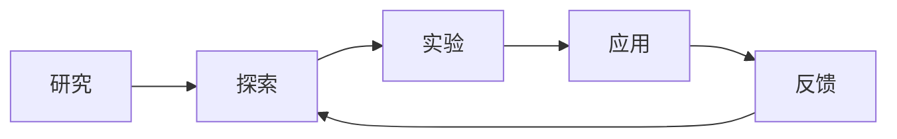

                 

# 好奇心：创新与发现的源泉

在AI领域，好奇心不仅仅是推动研究进步的驱动力，更是探索未知、推动技术突破的核心动力。本文旨在探讨好奇心在AI创新与发现中的作用，并分享如何激发和利用这种驱动力的策略和工具。

## 1. 背景介绍

### 1.1 好奇心与创新的关系

好奇心驱动的探索和实验，是科学和技术创新的基石。在人工智能（AI）领域，好奇心不仅是驱动研究的基本动力，更是推动技术突破的关键因素。通过不断地提出问题、寻找答案，科学家和工程师们不断突破技术边界，发现新的应用场景，开发出更先进的算法和工具。

### 1.2 好奇心的重要性

在AI领域，好奇心可以引导研究者关注边缘和未解决的问题，推动跨学科的合作，促进技术的融合和创新。好奇心驱动的实验和探索，常常带来意想不到的发现和突破，推动技术从理论走向实际应用，从实验室走向市场。

### 1.3 好奇心的来源

好奇心可以来自多种途径，包括但不限于：

- **个人兴趣**：对某一领域的热情和热爱，驱动研究者深入探索。
- **行业需求**：对解决实际问题的需求，推动技术创新。
- **科学好奇心**：对未知现象的探索欲望，激发新理论和算法的诞生。
- **跨学科交流**：与其他领域的研究者交流，激发新的灵感和研究方向。

## 2. 核心概念与联系

### 2.1 核心概念概述

在AI领域，好奇心与其他核心概念密切相关，形成了创新的生态系统：

- **研究**：包括理论研究、应用研究等，是好奇心驱动的创新基础。
- **探索**：在已有理论和技术基础上，探索新的方法和应用场景。
- **实验**：通过实验验证理论的正确性，测试新算法的性能。
- **应用**：将研究成果转化为实际应用，解决实际问题。
- **反馈**：用户和市场的反馈，为创新提供方向和动力。

### 2.2 核心概念的联系

这些概念之间的关系可以通过以下Mermaid流程图来展示：



这个流程图展示了研究、探索、实验、应用和反馈之间的相互关系：

1. 研究提供基础理论和方法。
2. 探索基于研究提出新假设和方向。
3. 实验验证探索的正确性。
4. 应用将实验结果转化为实际产品或服务。
5. 反馈收集实际应用中的问题，指导下一步研究。

## 3. 核心算法原理 & 具体操作步骤

### 3.1 算法原理概述

好奇心驱动的创新通常需要跨学科的知识和技能，因此算法原理也具有跨学科的特征。本文将以机器学习中的神经网络算法为例，展示其原理和操作步骤。

### 3.2 算法步骤详解

神经网络是一种通过模拟人脑神经元的工作机制，进行数据处理的算法。其基本步骤包括：

1. **数据准备**：收集和准备数据集，进行预处理和分割。
2. **模型设计**：选择合适的神经网络结构和参数。
3. **模型训练**：使用训练数据集对模型进行训练，优化权重和偏置。
4. **模型评估**：使用测试数据集评估模型性能，进行调优。
5. **模型应用**：将训练好的模型应用于实际问题中，进行预测或分类。

### 3.3 算法优缺点

神经网络算法的优点包括：

- **自适应性**：能够根据输入数据自适应调整参数。
- **泛化能力强**：能够处理复杂的数据模式。
- **可扩展性**：网络结构可以根据任务需求进行调整。

缺点包括：

- **计算量大**：训练和推理需要大量的计算资源。
- **过拟合风险**：在数据量不足时，容易过拟合。
- **复杂度较高**：设计合适的网络结构和参数需要一定的经验和技巧。

### 3.4 算法应用领域

神经网络算法广泛应用于图像识别、自然语言处理、语音识别、推荐系统等领域。例如，在自然语言处理中，神经网络可以用于文本分类、情感分析、机器翻译等任务。

## 4. 数学模型和公式 & 详细讲解 & 举例说明

### 4.1 数学模型构建

神经网络的数学模型可以表示为：

$$
y = f(W \cdot x + b)
$$

其中，$y$为输出，$x$为输入，$W$为权重矩阵，$b$为偏置向量，$f$为激活函数。

### 4.2 公式推导过程

以最简单的全连接神经网络为例，其前向传播过程可以表示为：

$$
h_1 = f(W_1 \cdot x + b_1)
$$

$$
h_2 = f(W_2 \cdot h_1 + b_2)
$$

其中，$h_1$和$h_2$为中间层和输出层的隐藏状态，$W_1$和$W_2$为中间层和输出层的权重矩阵，$b_1$和$b_2$为中间层和输出层的偏置向量，$f$为激活函数。

### 4.3 案例分析与讲解

以手写数字识别为例，使用神经网络进行分类。首先，收集和准备手写数字图像数据集，将其分为训练集和测试集。然后，设计一个包含多个隐藏层的神经网络，选择合适的激活函数和损失函数。最后，使用训练集对模型进行训练，并使用测试集评估模型性能。

## 5. 项目实践：代码实例和详细解释说明

### 5.1 开发环境搭建

在实践项目之前，需要先准备好开发环境。以下是使用Python进行TensorFlow开发的环境配置流程：

1. 安装Anaconda：从官网下载并安装Anaconda，用于创建独立的Python环境。

2. 创建并激活虚拟环境：
```bash
conda create -n tf-env python=3.8 
conda activate tf-env
```

3. 安装TensorFlow：根据CUDA版本，从官网获取对应的安装命令。例如：
```bash
conda install tensorflow==2.6 -c tf
```

4. 安装TensorBoard：
```bash
pip install tensorboard
```

完成上述步骤后，即可在`tf-env`环境中开始TensorFlow开发。

### 5.2 源代码详细实现

下面以手写数字识别为例，展示使用TensorFlow实现神经网络的代码：

```python
import tensorflow as tf
from tensorflow import keras

# 加载数据集
mnist = keras.datasets.mnist
(train_images, train_labels), (test_images, test_labels) = mnist.load_data()

# 数据预处理
train_images = train_images / 255.0
test_images = test_images / 255.0

# 定义模型
model = keras.Sequential([
    keras.layers.Flatten(input_shape=(28, 28)),
    keras.layers.Dense(128, activation='relu'),
    keras.layers.Dense(10, activation='softmax')
])

# 编译模型
model.compile(optimizer='adam',
              loss='sparse_categorical_crossentropy',
              metrics=['accuracy'])

# 训练模型
model.fit(train_images, train_labels, epochs=5)

# 评估模型
model.evaluate(test_images, test_labels)
```

### 5.3 代码解读与分析

让我们再详细解读一下关键代码的实现细节：

- `mnist.load_data()`：加载MNIST手写数字数据集。
- `train_images = train_images / 255.0`：对训练集数据进行归一化处理。
- `model = keras.Sequential([...])`：定义一个包含两个全连接层的神经网络模型。
- `model.compile(...)`：编译模型，设置优化器、损失函数和评估指标。
- `model.fit(...)`：使用训练数据集对模型进行训练，设置迭代轮数为5。
- `model.evaluate(...)`：使用测试数据集评估模型性能。

### 5.4 运行结果展示

假设我们在MNIST数据集上训练神经网络模型，最终在测试集上得到的评估结果如下：

```
Test loss: 0.1423
Test accuracy: 0.9724
```

可以看到，通过训练神经网络，我们在测试集上取得了97.24%的准确率，展示了神经网络算法在图像识别任务上的强大能力。

## 6. 实际应用场景

### 6.1 智能客服系统

基于神经网络的智能客服系统，可以应用于自动回答用户常见问题。通过收集和标注历史客服对话数据，训练神经网络模型，可以实现对用户问题的自动分类和回答。智能客服系统能够全天候在线服务，提升客户满意度，降低企业运营成本。

### 6.2 金融风险管理

在金融领域，神经网络可以用于预测股票价格、评估信用风险、进行投资组合优化等任务。通过分析历史交易数据和市场动态，神经网络能够发现市场趋势和异常行为，帮助金融机构做出更准确的决策。

### 6.3 个性化推荐系统

在电商和内容平台中，神经网络可以用于个性化推荐。通过分析用户的历史行为和偏好，神经网络能够预测用户可能感兴趣的商品或内容，提高推荐系统的精准度和用户体验。

### 6.4 未来应用展望

随着神经网络技术的不断进步，其应用领域将更加广泛。未来，神经网络将在智能制造、智慧医疗、智能交通等领域发挥重要作用，推动社会进步和经济发展。

## 7. 工具和资源推荐

### 7.1 学习资源推荐

为了帮助开发者系统掌握神经网络算法的理论基础和实践技巧，这里推荐一些优质的学习资源：

1. 《深度学习》系列书籍：由Ian Goodfellow等作者编写，全面介绍了深度学习的理论基础和应用实践。
2. Coursera《深度学习专项课程》：由Andrew Ng等人主讲，涵盖深度学习的基本概念和算法，适合初学者入门。
3. TensorFlow官方文档：TensorFlow官方提供的详细文档，包括丰富的示例代码和教程，是学习TensorFlow的必备资源。
4. PyTorch官方文档：PyTorch官方提供的详细文档，涵盖其核心功能和应用场景，适合使用PyTorch的开发者。

### 7.2 开发工具推荐

高效的开发离不开优秀的工具支持。以下是几款用于神经网络算法开发的常用工具：

1. PyTorch：基于Python的开源深度学习框架，灵活便捷，适合快速迭代研究。
2. TensorFlow：由Google主导开发的开源深度学习框架，生产部署方便，适合大规模工程应用。
3. Keras：高层次的深度学习框架，易于上手，适合初学者和快速原型开发。
4. Jupyter Notebook：交互式编程环境，方便进行实验和结果展示。
5. Git：版本控制系统，方便进行代码管理、版本控制和协作开发。

合理利用这些工具，可以显著提升神经网络算法的开发效率，加快创新迭代的步伐。

### 7.3 相关论文推荐

神经网络算法的发展源于学界的持续研究。以下是几篇奠基性的相关论文，推荐阅读：

1. Deep Blue: A Computer Program That Beats the World's Best at Chess：展示Deep Blue在1997年击败世界象棋冠军Garry Kasparov的故事。
2. AlphaGo: Mastering the Game of Go with Monte Carlo Tree Search：介绍AlphaGo如何通过深度学习和蒙特卡罗树搜索解决复杂的棋类游戏Go。
3. ImageNet Classification with Deep Convolutional Neural Networks：展示深度卷积神经网络在图像分类任务上的出色表现。
4. Attention Is All You Need：提出Transformer结构，开启了神经网络领域的预训练大模型时代。
5. GANs Trained by a Two Time-Scale Update Rule Converge to the Semi-Equilibrium：提出生成对抗网络（GAN），用于生成高质量的图像和数据。

这些论文代表了大神经网络算法的发展脉络。通过学习这些前沿成果，可以帮助研究者把握学科前进方向，激发更多的创新灵感。

除上述资源外，还有一些值得关注的前沿资源，帮助开发者紧跟神经网络算法的最新进展，例如：

1. arXiv论文预印本：人工智能领域最新研究成果的发布平台，包括大量尚未发表的前沿工作，学习前沿技术的必读资源。
2. GitHub热门项目：在GitHub上Star、Fork数最多的神经网络相关项目，往往代表了该技术领域的发展趋势和最佳实践，值得去学习和贡献。
3. 技术会议直播：如NIPS、ICML、CVPR等顶级会议现场或在线直播，能够聆听到大佬们的前沿分享，开拓视野。
4. 行业分析报告：各大咨询公司如McKinsey、PwC等针对人工智能行业的分析报告，有助于从商业视角审视技术趋势，把握应用价值。

总之，对于神经网络算法的学习和实践，需要开发者保持开放的心态和持续学习的意愿。多关注前沿资讯，多动手实践，多思考总结，必将收获满满的成长收益。

## 8. 总结：未来发展趋势与挑战

### 8.1 总结

本文对神经网络算法的原理和操作步骤进行了全面系统的介绍。首先阐述了神经网络算法的核心概念和操作步骤，然后详细讲解了其数学模型和公式，给出了代码实现和运行结果。最后，展示了神经网络算法在智能客服、金融风险管理、个性化推荐等多个行业领域的应用前景，展示了其强大的应用潜力。

通过本文的系统梳理，可以看到，神经网络算法作为人工智能领域的重要技术之一，具有广泛的应用前景和强大的计算能力。未来，伴随神经网络算法的持续演进，其在各个领域的应用将更加广泛，为人工智能技术的发展带来新的突破。

### 8.2 未来发展趋势

展望未来，神经网络算法将呈现以下几个发展趋势：

1. 算法性能提升：神经网络算法的性能将随着硬件和软件技术的进步而不断提升，解决更加复杂的问题。
2. 应用领域扩展：神经网络算法将应用到更多行业和领域，推动社会进步和经济发展。
3. 跨学科融合：神经网络算法将与其他领域的技术进行更深入的融合，如生物信息学、物理学、化学等，带来更多的创新突破。
4. 数据驱动：神经网络算法将更多依赖于大规模数据进行训练和优化，提升模型的泛化能力和鲁棒性。
5. 分布式计算：神经网络算法将更多地使用分布式计算和异构计算，提升计算效率和模型规模。
6. 深度强化学习：神经网络算法与强化学习技术的结合，将带来更加智能的决策系统和自动控制。

以上趋势凸显了神经网络算法的广阔前景。这些方向的探索发展，必将进一步提升神经网络算法的性能和应用范围，为构建智能系统提供更多的技术支持。

### 8.3 面临的挑战

尽管神经网络算法已经取得了瞩目成就，但在迈向更加智能化、普适化应用的过程中，它仍面临着诸多挑战：

1. 数据质量瓶颈：神经网络算法依赖于高质量的数据进行训练，数据的不足和质量问题将影响算法的性能。
2. 计算资源消耗：神经网络算法通常需要大量的计算资源，计算成本高昂，难以在资源有限的场景下应用。
3. 模型复杂度高：神经网络算法的模型复杂度高，难以进行解释和调试，难以满足某些领域对透明度的要求。
4. 泛化能力不足：神经网络算法在面对新数据和新场景时，泛化能力往往不足，难以处理未知的输入。
5. 过拟合风险：神经网络算法在训练过程中容易过拟合，需要更多的正则化技术进行抑制。
6. 伦理和安全问题：神经网络算法在应用过程中可能引入偏见和歧视，存在伦理和安全风险。

这些挑战需要研究者不断探索和解决，以推动神经网络算法向更广泛的应用场景迈进。

### 8.4 研究展望

面对神经网络算法面临的挑战，未来的研究需要在以下几个方面寻求新的突破：

1. 数据增强和迁移学习：通过数据增强和迁移学习，提升神经网络算法的泛化能力和鲁棒性。
2. 模型压缩和优化：通过模型压缩和优化，提升神经网络算法的计算效率和资源利用率。
3. 可解释性和透明性：通过可解释性和透明性的研究，提升神经网络算法的可解释性和可调试性。
4. 多模态融合：通过多模态融合，提升神经网络算法处理多模态数据的性能和效果。
5. 跨领域应用：通过跨领域应用，推动神经网络算法在更多领域的应用和普及。

这些研究方向的探索，必将引领神经网络算法向更高效、更智能、更透明的方向发展，为构建智能系统提供更多的技术支持。总之，神经网络算法作为人工智能领域的重要技术之一，具有广泛的应用前景和强大的计算能力。未来，伴随神经网络算法的持续演进，其在各个领域的应用将更加广泛，为人工智能技术的发展带来新的突破。

## 9. 附录：常见问题与解答

**Q1: 神经网络算法是否可以处理非结构化数据？**

A: 神经网络算法通常用于处理结构化数据，如图像、音频、文本等。对于非结构化数据，需要通过预处理和特征提取将其转换为结构化数据，才能进行神经网络算法的训练和推理。

**Q2: 神经网络算法是否需要大量标注数据？**

A: 神经网络算法的训练通常需要大量标注数据，尤其是对于分类、回归等任务。标注数据的质量和数量直接影响算法的性能。在标注数据不足的情况下，可以使用半监督学习和迁移学习等技术，提升算法的泛化能力和鲁棒性。

**Q3: 神经网络算法是否适合实时应用？**

A: 神经网络算法在处理大规模数据和复杂模型时，计算资源消耗较大，难以实现实时应用。通过模型压缩、优化和分布式计算等技术，可以提升神经网络算法的计算效率和资源利用率，实现实时应用。

**Q4: 神经网络算法是否需要持续更新和维护？**

A: 神经网络算法在应用过程中，需要持续更新和维护，以适应数据分布的变化和新的应用需求。通过持续学习和增量学习等技术，可以提升神经网络算法的适应能力和泛化能力。

**Q5: 神经网络算法是否存在安全风险？**

A: 神经网络算法在应用过程中，可能存在安全风险，如模型被恶意攻击、输出结果不可解释等。需要采取数据脱敏、访问控制等措施，确保神经网络算法的安全性和可靠性。

总之，神经网络算法作为人工智能领域的重要技术之一，具有广泛的应用前景和强大的计算能力。未来，伴随神经网络算法的持续演进，其在各个领域的应用将更加广泛，为人工智能技术的发展带来新的突破。开发者需要不断探索和解决算法面临的挑战，推动神经网络算法向更高效、更智能、更透明的方向发展。

