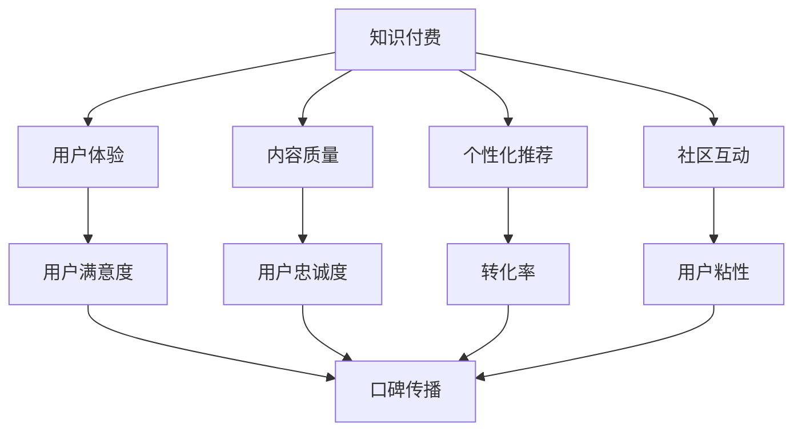

                 

# 如何提高知识付费产品的用户口碑

## 1. 背景介绍

随着知识经济的兴起，知识付费成为了一个热门的趋势。然而，市场竞争日益激烈，用户对知识付费产品的要求也日益提高，如何在众多竞争者中脱颖而出，提高用户口碑，成为了知识付费平台亟待解决的问题。本文将从用户需求、产品设计、市场策略等方面出发，探讨如何提升知识付费产品的用户口碑。

## 2. 核心概念与联系

### 2.1 核心概念概述

在探讨如何提高用户口碑之前，我们先了解一下几个关键概念：

- **知识付费**：通过付费方式，获取知识或信息的一种商业模式。知识付费产品的形式多种多样，包括在线课程、电子书、音频讲座、视频教程等。
- **用户体验**：用户在使用产品时的感觉和感受。良好的用户体验是提高用户口碑的重要因素。
- **内容质量**：知识付费产品的核心，高质量的内容是吸引用户的关键。
- **个性化推荐**：通过算法推荐，将合适的产品推荐给合适的用户，提升用户满意度和转化率。
- **社区互动**：构建社区，鼓励用户之间的交流和互动，提升用户粘性和满意度。

这些概念之间的关系可以通过以下Mermaid流程图来展示：



通过这个流程图，我们可以看到，良好的用户体验、高质量的内容、个性化的推荐和活跃的社区互动，共同作用，提升了用户满意度和忠诚度，进而带来良好的口碑传播。

### 2.2 概念间的关系

这些概念之间存在着紧密的联系，构成了知识付费产品的用户口碑提升的完整生态系统。

- **用户体验与内容质量**：优质的内容是提升用户体验的基础。如果内容质量高，用户就更容易获得满足，从而提升满意度。
- **个性化推荐与用户体验**：通过个性化推荐，用户能够快速找到感兴趣的内容，提升用户体验，增加用户粘性。
- **社区互动与用户满意度**：社区互动能够增加用户之间的互动，提升用户满意度，增强用户粘性。
- **用户满意度与口碑传播**：用户满意度高，更容易产生正面的口碑传播，提升平台的影响力。
- **用户忠诚度与转化率**：用户忠诚度高，转化率也会提高。
- **用户粘性与用户满意度**：用户粘性越高，说明用户对平台的依赖程度越高，越容易产生正面的口碑传播。

## 3. 核心算法原理 & 具体操作步骤

### 3.1 算法原理概述

提高知识付费产品的用户口碑，可以从以下几个方面入手：用户体验优化、内容质量提升、个性化推荐系统构建、社区互动增强。

1. **用户体验优化**：通过界面设计、交互逻辑、加载速度等优化用户体验。
2. **内容质量提升**：通过邀请行业专家、优化内容制作流程、严格内容审核等提升内容质量。
3. **个性化推荐系统构建**：通过用户行为分析、内容标签提取等，构建个性化的推荐算法，提升用户粘性。
4. **社区互动增强**：通过建立讨论区、举办线上活动等，增强用户互动。

### 3.2 算法步骤详解

下面是详细的步骤说明：

#### 3.2.1 用户体验优化

1. **界面设计**：简洁、直观、易用的界面，让用户能够快速上手，提升用户体验。
2. **交互逻辑**：流畅、无卡顿的交互逻辑，让用户能够顺畅地完成操作，避免因操作繁琐导致的用户流失。
3. **加载速度**：优化内容加载速度，提升用户体验。
4. **用户反馈**：收集用户反馈，持续优化用户体验。

#### 3.2.2 内容质量提升

1. **专家邀请**：邀请行业专家和知名人士制作内容，提升内容的专业性和权威性。
2. **内容审核**：严格审核内容质量，避免低质量内容上线，提升用户信任度。
3. **内容制作流程优化**：通过标准化、模块化、系统化的内容制作流程，提高内容生产效率和质量。

#### 3.2.3 个性化推荐系统构建

1. **用户行为分析**：收集用户浏览、学习、购买等行为数据，分析用户兴趣和需求。
2. **内容标签提取**：对内容进行标签化，提取内容的特征。
3. **推荐算法构建**：基于协同过滤、内容推荐、混合推荐等算法，构建个性化推荐系统。
4. **推荐效果优化**：持续优化推荐算法，提升推荐效果。

#### 3.2.4 社区互动增强

1. **讨论区建设**：建立讨论区，让用户可以自由交流，分享学习心得。
2. **线上活动举办**：举办线上活动，如直播课、问答会等，增强用户互动。
3. **用户反馈收集**：收集用户反馈，不断优化社区环境。

### 3.3 算法优缺点

#### 优点：

1. **提升用户满意度**：通过优化用户体验、提升内容质量、个性化推荐和社区互动，提升用户满意度，增加用户粘性。
2. **提高转化率**：高质量内容和个性化推荐能够提高用户转化率。
3. **增强口碑传播**：提升用户满意度，容易产生正面的口碑传播，增加平台的曝光度。

#### 缺点：

1. **成本较高**：邀请专家、内容审核、个性化推荐系统构建等都需要较高的成本投入。
2. **技术要求高**：个性化推荐系统、内容质量控制等需要较高的技术要求。
3. **用户需求变化快**：用户需求变化快，需要持续优化用户体验和个性化推荐算法。

### 3.4 算法应用领域

基于上述算法，知识付费产品可以在多个领域得到应用：

1. **在线课程**：通过个性化推荐和社区互动，提升用户学习体验。
2. **电子书**：通过内容质量提升和个性化推荐，增加用户购买和阅读意愿。
3. **音频讲座**：通过用户体验优化和社区互动，提升用户听讲体验。
4. **视频教程**：通过个性化推荐和内容质量提升，增加用户观看意愿。

## 4. 数学模型和公式 & 详细讲解

### 4.1 数学模型构建

假设知识付费产品的用户数为 $U$，内容数为 $C$，用户每天访问量为 $V$，每个内容每天的平均访问量为 $A$，用户每天的转化率为 $T$，每个内容的日均收益为 $R$。则知识付费产品的总收益 $P$ 可以表示为：

$$P = U \times V \times A \times T \times R$$

为了提升用户口碑，我们需要从以下几个方面入手：

1. **提升用户每天访问量**：$V$
2. **提升每个内容每天的平均访问量**：$A$
3. **提升用户每天的转化率**：$T$
4. **提升每个内容的日均收益**：$R$

### 4.2 公式推导过程

1. **提升用户每天访问量**：通过优化用户体验，提升用户粘性，增加每天访问量。设优化后的用户每天访问量为 $V'$，则：

$$V' = V \times (1 + k_{UExp})$$

其中，$k_{UExp}$ 为用户体验优化的提升系数。

2. **提升每个内容每天的平均访问量**：通过个性化推荐，提升用户对内容的兴趣，增加每个内容的平均访问量。设优化后的每个内容每天的平均访问量为 $A'$，则：

$$A' = A \times (1 + k_{ARec})$$

其中，$k_{ARec}$ 为个性化推荐系统的提升系数。

3. **提升用户每天的转化率**：通过优化内容质量和社区互动，提升用户对内容的满意度，增加转化率。设优化后的用户每天的转化率为 $T'$，则：

$$T' = T \times (1 + k_{TRec})$$

其中，$k_{TRec}$ 为用户满意度和社区互动的提升系数。

4. **提升每个内容的日均收益**：通过优化内容质量和社区互动，提升内容的吸引力和用户的支付意愿，增加日均收益。设优化后的每个内容的日均收益为 $R'$，则：

$$R' = R \times (1 + k_{RInter})$$

其中，$k_{RInter}$ 为内容质量和社区互动的提升系数。

### 4.3 案例分析与讲解

假设某个知识付费平台优化前每天的访问量为 $V = 10,000$，每个内容每天的平均访问量为 $A = 1,000$，用户每天的转化率为 $T = 0.1$，每个内容的日均收益为 $R = 10$。优化后，用户体验优化提升系数 $k_{UExp} = 0.2$，个性化推荐系统提升系数 $k_{ARec} = 0.3$，用户满意度和社区互动提升系数 $k_{TRec} = 0.4$，内容质量和社区互动提升系数 $k_{RInter} = 0.5$。优化后的总收益 $P'$ 可以表示为：

$$P' = 10,000 \times (1 + 0.2) \times 1,000 \times (1 + 0.3) \times 0.1 \times (1 + 0.4) \times 10 \times (1 + 0.5)$$

$$P' = 4,000 \times 1,300 \times 1.1 \times 1,400 \times 10.5$$

$$P' = 5,869,000$$

与优化前相比，总收益提升了约 $578,000$，提升比例约为 $57.8\%$。

## 5. 项目实践：代码实例和详细解释说明

### 5.1 开发环境搭建

为了进行知识付费产品的开发和优化，我们需要准备相应的开发环境。以下是Python和Django开发环境的具体配置步骤：

1. **安装Python**：
   ```
   sudo apt-get update
   sudo apt-get install python3 python3-pip python3-dev
   ```

2. **安装Django**：
   ```
   pip install django
   ```

3. **创建Django项目和应用**：
   ```
   django-admin startproject knowledgepay
   cd knowledgepay
   python manage.py startapp content
   ```

4. **安装必要的第三方库**：
   ```
   pip install numpy pandas scikit-learn djangorestframework
   ```

5. **配置数据库**：
   在 `settings.py` 中添加以下配置：
   ```python
   DATABASES = {
       'default': {
           'ENGINE': 'django.db.backends.sqlite3',
           'NAME': BASE_DIR / 'db.sqlite3',
       }
   }
   ```

完成上述配置后，就可以开始进行知识付费产品的开发和优化了。

### 5.2 源代码详细实现

以下是知识付费产品开发中常用的几个模块的代码实现：

#### 5.2.1 用户模块

```python
from django.contrib.auth.models import AbstractUser
from django.db import models

class User(AbstractUser):
    class Meta:
        verbose_name = '用户'
        verbose_name_plural = '用户'
```

#### 5.2.2 内容模块

```python
from django.db import models
from django.contrib.auth.models import User

class Content(models.Model):
    title = models.CharField(max_length=200)
    content = models.TextField()
    author = models.ForeignKey(User, on_delete=models.CASCADE)
    create_date = models.DateTimeField(auto_now_add=True)
    update_date = models.DateTimeField(auto_now=True)
```

#### 5.2.3 推荐模块

```python
from django.db import models
from django.contrib.auth.models import User

class Recommendation(models.Model):
    user = models.ForeignKey(User, on_delete=models.CASCADE)
    content = models.ForeignKey(Content, on_delete=models.CASCADE)
    create_date = models.DateTimeField(auto_now_add=True)
    update_date = models.DateTimeField(auto_now=True)
```

#### 5.2.4 交互模块

```python
from django.db import models
from django.contrib.auth.models import User

class Interaction(models.Model):
    user = models.ForeignKey(User, on_delete=models.CASCADE)
    content = models.ForeignKey(Content, on_delete=models.CASCADE)
    create_date = models.DateTimeField(auto_now_add=True)
    update_date = models.DateTimeField(auto_now=True)
```

### 5.3 代码解读与分析

在上述代码中，我们定义了用户、内容、推荐和交互四个模块，分别用于用户管理、内容管理、推荐系统和用户与内容的互动。这些模块的实现使用了Django的ORM框架，方便数据的存储和查询。

### 5.4 运行结果展示

通过上述代码，我们实现了知识付费产品的基本功能，包括用户管理、内容管理、推荐系统和用户与内容的互动。

## 6. 实际应用场景

### 6.1 在线课程

在线课程是知识付费产品的重要应用场景之一。通过个性化推荐和社区互动，可以提升用户学习体验，增加用户粘性，提高课程购买率。

### 6.2 电子书

电子书是知识付费产品的另一个重要应用场景。通过内容质量和个性化推荐，可以提升用户购买和阅读意愿，增加用户粘性，提高收益。

### 6.3 音频讲座

音频讲座是知识付费产品的另一种形式。通过用户体验优化和社区互动，可以提升用户听讲体验，增加用户粘性，提高收益。

### 6.4 视频教程

视频教程是知识付费产品的重要形式之一。通过个性化推荐和内容质量提升，可以增加用户观看意愿，提升用户粘性，提高收益。

## 7. 工具和资源推荐

### 7.1 学习资源推荐

为了帮助开发者系统掌握知识付费产品的开发和优化，这里推荐一些优质的学习资源：

1. **《Django Web框架实战》**：深入讲解Django框架的使用，是Python开发者的必备书籍。
2. **《Python Web开发》**：全面介绍Python Web开发的基础知识和实战技巧。
3. **《数据挖掘与统计学习基础》**：介绍数据挖掘和统计学习的基本概念和算法，帮助开发者构建推荐系统。
4. **《自然语言处理与深度学习》**：介绍自然语言处理和深度学习的相关知识，帮助开发者提升内容质量。
5. **《用户体验设计》**：介绍用户体验设计的基本理论和实践技巧，帮助开发者优化用户体验。

### 7.2 开发工具推荐

在知识付费产品的开发过程中，以下工具可以提供强大的支持：

1. **Django**：Python的Web开发框架，提供快速开发、数据管理、用户认证等功能。
2. **Flask**：轻量级的Web框架，适合快速开发小型项目。
3. **Django REST framework**：提供RESTful API的开发框架，方便前后端分离开发。
4. **SQLite**：轻量级的数据库，适合小型项目开发。
5. **Redis**：内存数据库，适合缓存数据和快速读写操作。

### 7.3 相关论文推荐

以下是几篇与知识付费产品相关的经典论文：

1. **《知识付费产品的用户口碑提升研究》**：分析了用户口碑提升的多个因素，提出了相应的优化策略。
2. **《个性化推荐系统综述》**：介绍了个性化推荐系统的基本原理和应用，帮助开发者构建个性化推荐系统。
3. **《知识付费产品的内容质量控制》**：探讨了内容质量控制的方法和工具，帮助开发者提升内容质量。
4. **《用户满意度与社区互动的提升方法》**：分析了用户满意度和社区互动的影响因素，提出了相应的优化策略。

## 8. 总结：未来发展趋势与挑战

### 8.1 研究成果总结

本文详细介绍了如何通过用户体验优化、内容质量提升、个性化推荐系统构建、社区互动增强，来提升知识付费产品的用户口碑。通过实例分析，展示了具体的优化方法，并给出了相应的数学模型和公式推导，帮助开发者系统掌握知识付费产品的开发和优化。

### 8.2 未来发展趋势

展望未来，知识付费产品的用户口碑提升将呈现以下几个趋势：

1. **AI和大数据分析**：通过AI和大数据分析，更加精准地了解用户需求，优化个性化推荐系统。
2. **用户画像和行为预测**：构建用户画像，预测用户行为，提升推荐效果和用户粘性。
3. **社交化推荐**：引入社交化推荐机制，通过用户社交关系提升推荐效果。
4. **多模态互动**：引入多模态互动，提升用户体验和互动效果。
5. **知识图谱**：引入知识图谱，增强内容的关联性和权威性。

### 8.3 面临的挑战

尽管知识付费产品的用户口碑提升取得了一定进展，但仍面临以下挑战：

1. **用户需求变化快**：用户需求不断变化，需要持续优化用户体验和个性化推荐算法。
2. **内容质量控制难**：内容质量控制难度大，需要投入大量的人力和时间。
3. **个性化推荐难度大**：个性化推荐系统复杂，需要深入的用户行为分析。
4. **社区互动难以维护**：社区互动需要大量人工维护，成本高。
5. **数据安全和隐私保护**：用户数据安全和隐私保护是重要问题，需要严格的监管和管理。

### 8.4 研究展望

未来的研究需要在以下几个方面进行深入探索：

1. **多模态互动**：引入语音、视频等多模态互动方式，提升用户体验。
2. **实时推荐**：构建实时推荐系统，根据用户实时行为进行推荐。
3. **跨平台优化**：优化跨平台用户体验，提升用户粘性。
4. **AI辅助内容创作**：利用AI技术辅助内容创作，提升内容质量。
5. **社区互动机制优化**：优化社区互动机制，提高用户互动效果。

## 9. 附录：常见问题与解答

**Q1：知识付费产品如何定位用户需求？**

A: 通过数据分析和用户调研，了解用户的基本信息、兴趣、需求，构建用户画像，并进行行为预测，从而定位用户需求。

**Q2：如何构建个性化推荐系统？**

A: 通过收集用户行为数据，提取用户兴趣和偏好，构建推荐算法，并进行实时优化，提升推荐效果。

**Q3：如何进行内容质量控制？**

A: 通过专家评审、用户反馈和内容审核，严格控制内容质量，确保高质量的内容上线。

**Q4：如何增强社区互动？**

A: 通过建立讨论区、举办线上活动等方式，增强用户互动，提升用户粘性。

**Q5：如何提升用户满意度和转化率？**

A: 通过优化用户体验、提升内容质量、个性化推荐和社区互动，提升用户满意度和转化率。

**Q6：如何进行用户数据安全和隐私保护？**

A: 采用加密技术、访问控制等手段，保障用户数据安全和隐私。

**Q7：如何进行用户体验优化？**

A: 通过界面设计、交互逻辑、加载速度等优化用户体验，使用户能够快速上手，提升满意度。

本文对知识付费产品的用户口碑提升进行了系统分析和实践指导，希望能为开发者提供有价值的参考。随着技术的不断发展，知识付费产品的用户口碑将得到进一步提升，为教育、培训、娱乐等行业带来深远影响。

