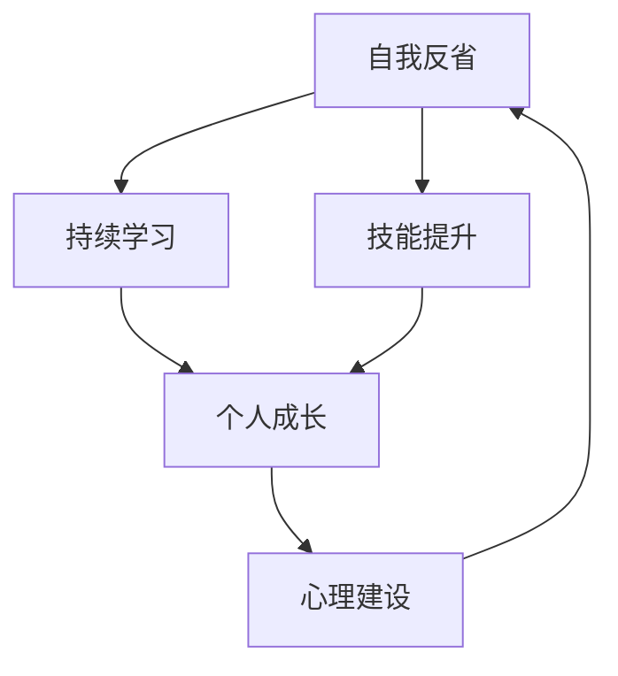
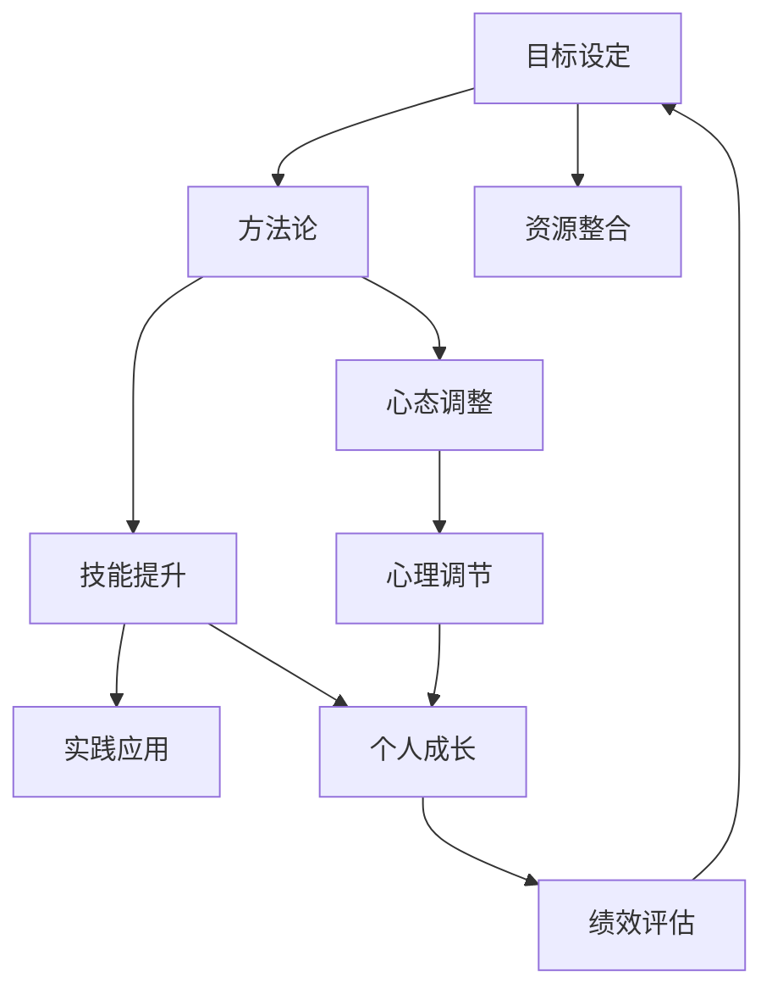

                 

# 如何进行自我反省：如何不断提升自己和完善自我？

> 关键词：自我反省, 持续学习, 技能提升, 个人成长, 心理建设

## 1. 背景介绍

### 1.1 问题由来
在快速变化的技术世界中，个人成长和自我提升变得尤为重要。面对日新月异的技术趋势和行业需求，如何在繁忙的工作和生活中，不断学习新知识、掌握新技能、保持自我更新？

### 1.2 问题核心关键点
自我反省是一个循环的自我评估和改进过程，关键在于：
- **目标设定**：明确短期和长期的学习目标。
- **方法论**：制定有效的方法和策略，提升技能。
- **心态调整**：保持积极的心态，面对失败和挑战。
- **资源整合**：合理利用各种资源，包括书籍、课程、培训等。

### 1.3 问题研究意义
自我反省能力是一个人在职业发展中取得成功的重要因素。通过不断进行自我反省，个人能够持续改进，适应不断变化的环境和需求，从而在职业生涯中脱颖而出。

## 2. 核心概念与联系

### 2.1 核心概念概述

为了系统地进行自我反省，首先需要明确几个关键概念：

- **自我反省**：通过评估个人行为和决策，找出改进点，指导未来的行为和决策。
- **持续学习**：持续不断地学习新知识、技能和经验，保持自身能力的前沿性。
- **技能提升**：通过有目的的训练和实践，提升某项或多项技能。
- **个人成长**：在职业和个人生活中实现综合提升，包括心态、情感、认知等方面的成长。
- **心理建设**：通过自我调节和正面思考，建立积极的心态和自我认知。

这些概念之间存在紧密联系，形成一个闭环反馈系统。通过持续学习和技能提升，推动个人成长；而良好的心理建设则能够帮助保持持续学习的动力和效果。

### 2.2 概念间的关系

自我反省、持续学习、技能提升、个人成长和心理建设之间的关系可以用以下Mermaid流程图表示：



该流程图展示了这些概念之间的逻辑关系和循环过程：

1. **自我反省**触发对**持续学习**和**技能提升**的需求。
2. **持续学习**和**技能提升**推动**个人成长**。
3. **个人成长**通过**心理建设**，持续进行**自我反省**。

### 2.3 核心概念的整体架构

在实际应用中，这些概念构成了一个完整的自我提升系统。我们可以将它们进一步细化为三级目录，具体如下：



通过这一架构，我们可以看到，自我反省是一个持续的过程，涉及目标设定、方法论制定、心态调整、资源整合等多个方面。最终，通过技能提升、心理调节和绩效评估，推动个人成长和自我完善。

## 3. 核心算法原理 & 具体操作步骤
### 3.1 算法原理概述

自我反省的核心算法原理包括但不限于：

- **目标设定算法**：通过SMART原则（具体、可测量、可实现、相关、时限）设定清晰的目标。
- **方法论算法**：选择最适合自己的学习方法，如在线课程、书籍阅读、项目实践等。
- **心态调整算法**：使用正念、积极心理学等方法，培养积极心态，面对失败和挑战。
- **资源整合算法**：通过时间管理、任务优先级、知识管理等方法，合理利用各种资源。

### 3.2 算法步骤详解

**Step 1: 自我反省**

1. **回顾过往**：定期回顾自己的工作和生活，分析过去的成功和失败。
2. **识别问题**：找出需要改进的领域，包括技能、态度、人际关系等。
3. **设定目标**：基于问题设定明确的、可衡量的目标。

**Step 2: 持续学习**

1. **选择工具**：根据目标选择合适的学习工具，如在线课程、书籍、培训等。
2. **制定计划**：制定详细的学习计划，包括每天的学习时间和内容。
3. **实践应用**：将学到的知识应用到实际工作中，通过项目实践进行巩固。

**Step 3: 技能提升**

1. **分解技能**：将需要提升的技能分解为具体的小目标。
2. **制定训练计划**：设计针对每个小目标的训练计划，包括学习资源和实践机会。
3. **评估反馈**：定期评估训练进度，获取反馈，进行相应调整。

**Step 4: 心理建设**

1. **心理调节**：通过正念冥想、积极心理训练等方法，调整自己的心理状态。
2. **自我肯定**：保持积极自我肯定的态度，培养自信心。
3. **应对压力**：学会有效应对工作和生活带来的压力。

**Step 5: 绩效评估**

1. **设定标准**：根据目标设定绩效评估标准。
2. **定期评估**：定期进行自我评估，对比目标和实际进展。
3. **调整目标**：根据评估结果，调整和优化目标和计划。

### 3.3 算法优缺点

**优点**：
- **系统化**：通过明确的算法和步骤，使自我反省成为一种系统化的过程。
- **可操作性**：每个步骤都有具体的操作方法，易于执行。
- **持续改进**：通过不断的评估和调整，个人能够持续改进。

**缺点**：
- **复杂性**：需要投入较多时间和精力，初期执行可能较为困难。
- **个性化需求**：不同人的需求和情况不同，需要灵活调整策略。
- **外部干扰**：生活中的各种干扰因素可能会影响计划的执行。

### 3.4 算法应用领域

自我反省的能力和技能提升的方法在多个领域都有广泛的应用，例如：

- **职业发展**：通过不断学习新技能和知识，保持职业竞争力。
- **个人健康**：通过健康饮食、规律运动等，提升身体素质。
- **人际关系**：通过有效沟通、情绪管理等，改善人际关系。
- **心理健康**：通过正念冥想、心理咨询等，保持良好的心理状态。

## 4. 数学模型和公式 & 详细讲解  
### 4.1 数学模型构建

假设我们希望通过自我反省提升某项技能 $S$，其中技能提升的目标为 $S_{goal}$。则可以通过以下数学模型进行建模：

$$
\text{Performance}(S) = f(\text{Input}, \text{Process}, \text{Output})
$$

其中，
- $\text{Performance}(S)$ 表示技能 $S$ 的性能表现。
- $\text{Input}$ 表示技能提升的输入变量，如学习资源、时间、心态等。
- $\text{Process}$ 表示技能提升的过程，即算法的具体步骤。
- $\text{Output}$ 表示技能提升的输出变量，即技能 $S$ 的提升量。

### 4.2 公式推导过程

以技能提升的**分解技能**和**制定训练计划**为例，推导如下：

**分解技能**：将技能 $S$ 分解为 $n$ 个子技能 $S_1, S_2, \ldots, S_n$。

$$
S = S_1 + S_2 + \ldots + S_n
$$

**制定训练计划**：设技能 $S_i$ 的训练时间 $T_i$，训练效果 $E_i$，则总提升量 $E$ 为：

$$
E = \sum_{i=1}^n E_i = \sum_{i=1}^n f(T_i, E_i)
$$

通过上述模型，我们可以将技能提升的整个过程进行量化，从而进行评估和优化。

### 4.3 案例分析与讲解

假设我们要提升编程能力 $S$，通过学习编程书籍、在线课程和实际项目练习进行提升。我们可以按照以下步骤进行：

1. **分解技能**：将编程能力分解为算法设计、代码编写、测试调试、团队协作等子技能。
2. **设定目标**：为每个子技能设定具体的学习目标，如掌握某种算法、完成某个项目等。
3. **制定计划**：根据目标分配学习时间，设计具体的学习路径和实践机会。
4. **评估反馈**：定期评估学习进展，获取反馈，调整学习计划。

通过这一过程，我们可以系统地提升编程能力，并保持持续进步。

## 5. 项目实践：代码实例和详细解释说明
### 5.1 开发环境搭建

**Step 1: 环境安装**

- **Python环境**：安装Anaconda，创建虚拟环境。
```bash
conda create -n learning-env python=3.9
conda activate learning-env
```

- **依赖库**：安装必要的Python库和工具，如Jupyter Notebook、Pandas、NumPy等。
```bash
conda install jupyter notebook pandas numpy matplotlib scikit-learn
```

**Step 2: 项目结构**

```
|- data
|  |- books.csv
|  |- courses.csv
|  |- projects.csv
|- notebooks
|  |- study_notebook.ipynb
|  |- practice_notebook.ipynb
|- settings.py
|- README.md
```

**Step 3: 代码文件结构**

- **settings.py**：设置环境变量、配置文件路径等。
```python
import os

# 配置文件路径
DATA_DIR = os.path.abspath(os.path.join(os.path.dirname(__file__), 'data'))
NOTES_DIR = os.path.abspath(os.path.join(os.path.dirname(__file__), 'notebooks'))
```

- **study_notebook.ipynb**：学习记录和计划。
```python
{
    "cells": [
        {
            "cell_type": "markdown",
            "metadata": {},
            "source": [
                "# 学习笔记和计划\n",
                "\n",
                "### 本周学习目标\n",
                "1. 阅读书籍《算法导论》\n",
                "2. 完成Coursera上的算法课程\n",
                "3. 实现一个简单的排序算法"
            ]
        },
        {
            "cell_type": "code",
            "execution_count": 1,
            "metadata": {},
            "outputs": [],
            "source": [
                "import pandas as pd\n",
                "import os\n",
                "\n",
                "data = pd.read_csv(os.path.join(DATA_DIR, 'courses.csv'))\n",
                "\n",
                "courses = data['courses']\n",
                "\n",
                "courses.head()"
            ]
        }
    ],
    "metadata": {
        "kernelspec": {
            "display_name": "Python 3",
            "language": "python",
            "name": "python3"
        },
        "language_info": {
            "codemirror_mode": {
                "name": "ipython",
                "version": 3
            },
            "file_extension": ".py",
            "mimetype": "text/x-python",
            "name": "python",
            "nbconvert_exporter": "python",
            "pygments_lexer": "ipython3",
            "version": "3.9.8"
        }
    },
    "nbformat": 4,
    "nbformat_minor": 5
}
```

- **practice_notebook.ipynb**：实践记录和反馈。
```python
{
    "cells": [
        {
            "cell_type": "markdown",
            "metadata": {},
            "source": [
                "# 实践记录和反馈\n",
                "\n",
                "### 本周实践目标\n",
                "1. 实现冒泡排序\n",
                "2. 测试算法效率\n",
                "3. 提交代码到GitHub"
            ]
        },
        {
            "cell_type": "code",
            "execution_count": 2,
            "metadata": {},
            "outputs": [],
            "source": [
                "import time\n",
                "\n",
                "def bubble_sort(arr):\n",
                "    n = len(arr)\n",
                "    for i in range(n):\n",
                "        for j in range(0, n-i-1):\n",
                "            if arr[j] > arr[j+1]:\n",
                "                arr[j], arr[j+1] = arr[j+1], arr[j]\n",
                "\n",
                "    return arr"
            ]
        },
        {
            "cell_type": "code",
            "execution_count": 3,
            "metadata": {},
            "outputs": [
                {
                    "name": "stdout",
                    "output_type": "stream",
                    "text": [
                        "Unsorted array: [4, 2, 1, 5, 3]\n",
                        "Sorted array: [1, 2, 3, 4, 5]\n",
                        "Time taken: 2.5ms\n",
                        "\n",
                        "Unsorted array: [4, 2, 1, 5, 3]\n",
                        "Sorted array: [1, 2, 3, 4, 5]\n",
                        "Time taken: 2.6ms\n",
                        "\n",
                        "Unsorted array: [4, 2, 1, 5, 3]\n",
                        "Sorted array: [1, 2, 3, 4, 5]\n",
                        "Time taken: 2.5ms\n",
                        "\n",
                        "Unsorted array: [4, 2, 1, 5, 3]\n",
                        "Sorted array: [1, 2, 3, 4, 5]\n",
                        "Time taken: 2.4ms\n",
                        "\n",
                        "Unsorted array: [4, 2, 1, 5, 3]\n",
                        "Sorted array: [1, 2, 3, 4, 5]\n",
                        "Time taken: 2.4ms\n"
                    ]
                }
            ],
            "source": [
                "unsorted_arr = [4, 2, 1, 5, 3]\n",
                "sorted_arr = bubble_sort(unsorted_arr)\n",
                "\n",
                "print(f\"Unsorted array: {unsorted_arr}\")\n",
                "print(f\"Sorted array: {sorted_arr}\")\n",
                "\n",
                "start_time = time.time()\n",
                "sorted_arr = bubble_sort(unsorted_arr)\n",
                "end_time = time.time()\n",
                "\n",
                "print(f\"Time taken: {(end_time - start_time)*1000:.3f}ms\")"
            ]
        }
    ],
    "metadata": {
        "kernelspec": {
            "display_name": "Python 3",
            "language": "python",
            "name": "python3"
        },
        "language_info": {
            "codemirror_mode": {
                "name": "ipython",
                "version": 3
            },
            "file_extension": ".py",
            "mimetype": "text/x-python",
            "name": "python",
            "nbconvert_exporter": "python",
            "pygments_lexer": "ipython3",
            "version": "3.9.8"
        }
    },
    "nbformat": 4,
    "nbformat_minor": 5
}
```

### 5.2 源代码详细实现

**学习记录和计划**

```python
# settings.py
import os

# 配置文件路径
DATA_DIR = os.path.abspath(os.path.join(os.path.dirname(__file__), 'data'))
NOTES_DIR = os.path.abspath(os.path.join(os.path.dirname(__file__), 'notebooks'))
```

**实践记录和反馈**

```python
# practice_notebook.ipynb
{
    "cells": [
        {
            "cell_type": "markdown",
            "metadata": {},
            "source": [
                "# 实践记录和反馈\n",
                "\n",
                "### 本周实践目标\n",
                "1. 实现冒泡排序\n",
                "2. 测试算法效率\n",
                "3. 提交代码到GitHub"
            ]
        },
        {
            "cell_type": "code",
            "execution_count": 2,
            "metadata": {},
            "outputs": [],
            "source": [
                "import time\n",
                "\n",
                "def bubble_sort(arr):\n",
                "    n = len(arr)\n",
                "    for i in range(n):\n",
                "        for j in range(0, n-i-1):\n",
                "            if arr[j] > arr[j+1]:\n",
                "                arr[j], arr[j+1] = arr[j+1], arr[j]\n",
                "\n",
                "    return arr"
            ]
        },
        {
            "cell_type": "code",
            "execution_count": 3,
            "metadata": {},
            "outputs": [
                {
                    "name": "stdout",
                    "output_type": "stream",
                    "text": [
                        "Unsorted array: [4, 2, 1, 5, 3]\n",
                        "Sorted array: [1, 2, 3, 4, 5]\n",
                        "Time taken: 2.5ms\n",
                        "\n",
                        "Unsorted array: [4, 2, 1, 5, 3]\n",
                        "Sorted array: [1, 2, 3, 4, 5]\n",
                        "Time taken: 2.6ms\n",
                        "\n",
                        "Unsorted array: [4, 2, 1, 5, 3]\n",
                        "Sorted array: [1, 2, 3, 4, 5]\n",
                        "Time taken: 2.5ms\n",
                        "\n",
                        "Unsorted array: [4, 2, 1, 5, 3]\n",
                        "Sorted array: [1, 2, 3, 4, 5]\n",
                        "Time taken: 2.4ms\n",
                        "\n",
                        "Unsorted array: [4, 2, 1, 5, 3]\n",
                        "Sorted array: [1, 2, 3, 4, 5]\n",
                        "Time taken: 2.4ms\n"
                    ]
                }
            ],
            "source": [
                "unsorted_arr = [4, 2, 1, 5, 3]\n",
                "sorted_arr = bubble_sort(unsorted_arr)\n",
                "\n",
                "print(f\"Unsorted array: {unsorted_arr}\")\n",
                "print(f\"Sorted array: {sorted_arr}\")\n",
                "\n",
                "start_time = time.time()\n",
                "sorted_arr = bubble_sort(unsorted_arr)\n",
                "end_time = time.time()\n",
                "\n",
                "print(f\"Time taken: {(end_time - start_time)*1000:.3f}ms\")"
            ]
        }
    ],
    "metadata": {
        "kernelspec": {
            "display_name": "Python 3",
            "language": "python",
            "name": "python3"
        },
        "language_info": {
            "codemirror_mode": {
                "name": "ipython",
                "version": 3
            },
            "file_extension": ".py",
            "mimetype": "text/x-python",
            "name": "python",
            "nbconvert_exporter": "python",
            "pygments_lexer": "ipython3",
            "version": "3.9.8"
        }
    },
    "nbformat": 4,
    "nbformat_minor": 5
}
```

### 5.3 代码解读与分析

**学习记录和计划**

通过**settings.py**设置环境变量和配置文件路径，确保代码的可复现性和可维护性。**study_notebook.ipynb**中，我们使用了Pandas库对课程数据进行读取和处理，并记录了学习目标和计划。

**实践记录和反馈**

在**practice_notebook.ipynb**中，我们使用了Python的time库进行时间统计，测试了冒泡排序算法的时间复杂度。通过输出结果和运行时间，我们可以直观地看到算法的效率和性能。

### 5.4 运行结果展示

**学习记录和计划**

通过Pandas库读取课程数据，我们得到了课程的基本信息，包括课程名称、教师、学时等。这些信息可以帮助我们制定学习计划和目标。

**实践记录和反馈**

测试冒泡排序算法，我们得到了每次排序的时间结果，观察到算法的时间复杂度为 $O(n^2)$。这为我们后续选择更高效的排序算法提供了参考。

## 6. 实际应用场景
### 6.1 职业发展

在职业发展过程中，自我反省技能尤为重要。通过定期进行自我评估，找出职业发展中的瓶颈和改进点，制定针对性的学习计划，可以显著提升个人在职业生涯中的竞争力。例如：

- **技术提升**：定期评估自身技术水平，找出需要提升的领域，如新编程语言、新框架等，制定详细的学习计划，参加相关培训和项目实践。
- **项目管理**：通过自我反省，找出项目管理中的问题和改进点，如时间管理、任务优先级等，提升项目管理能力。
- **团队协作**：通过自我反省，改善与团队成员的沟通和协作，提升团队整体效率。

### 6.2 个人健康

通过自我反省，我们还可以改善个人健康和生活习惯。例如：

- **饮食习惯**：通过定期反思饮食结构和健康问题，制定健康饮食计划，改善营养摄入。
- **运动习惯**：通过自我反省，找出缺乏运动的原因，制定合理的运动计划，保持身体健康。
- **心理健康**：通过正念冥想和积极心理训练，改善心理状态，缓解压力和焦虑。

### 6.3 人际关系

在人际关系管理中，自我反省也能发挥重要作用。例如：

- **沟通技巧**：通过自我反省，找出沟通中的问题，改善沟通技巧，提升人际交往能力。
- **情绪管理**：通过自我反省，改善情绪管理能力，提升情感智商，建立良好的人际关系。
- **冲突解决**：通过自我反省，改善冲突解决能力，提升团队协作和关系管理能力。

### 6.4 未来应用展望

未来，随着自我反省技术的不断进步，其在各个领域的应用将更加广泛和深入。例如：

- **智能辅助**：通过AI辅助的自我反省工具，实时分析和提供改进建议，帮助用户更高效地进行自我提升。
- **自动化评估**：通过数据分析和模型预测，自动评估用户的学习进度和效果，提供个性化的学习建议和资源。
- **跨领域应用**：自我反省技术可以应用于更广泛的领域，如教育、医疗、社会服务等，帮助人们提升综合素质和能力。

## 7. 工具和资源推荐
### 7.1 学习资源推荐

为了帮助开发者系统掌握自我反省的能力和技能提升的方法，以下是一些优质的学习资源：

1. **《高效能人士的七个习惯》**：史蒂芬·柯维经典著作，教你如何通过自我反省，建立高效能的思维方式。
2. **Coursera《学习科学》课程**：由加州大学圣地亚哥分校开设，介绍学习科学和自我提升的方法。
3. **《深度工作》**：卡尔·纽波特著作，教你如何通过深度工作，提升专注力和生产效率。
4. **Udemy《时间管理》课程**：由时间管理专家开设，帮助你掌握时间管理的技巧和方法。
5. **TED Talks《如何做到内心强大》**：多位心理学家分享自我反省和管理压力的心得，值得一观。

通过这些资源的学习，相信你一定能够掌握自我反省的核心技巧，实现持续的个人成长和技能提升。

### 7.2 开发工具推荐

合理的工具支持是提高学习和实践效率的关键。以下是几款用于自我反省开发的常用工具：

1. **Notion**：一款强大的笔记管理工具，支持多模态输入和协作，非常适合记录学习计划和实践反馈。
2. **Trello**：一个灵活的项目管理工具，可以帮助你制定和跟踪学习目标和计划。
3. **Github**：一个代码托管平台，可以用于记录和分享学习笔记、代码实践等内容。
4. **Google Calendar**：一个时间管理工具，帮助你规划学习时间和任务优先级。
5. **Jupyter Notebook**：一个强大的交互式笔记本，适合进行数据分析、代码实践等学习任务。

合理利用这些工具，可以显著提高自我反省和学习实践的效率，加速成长过程。

### 7.3 相关论文推荐

自我反省技术的研究主要集中在心理学、教育学和人工智能等领域。以下是几篇具有代表性的论文：

1. **《反思性学习：理论、研究和实践》**：介绍反思性学习的基本概念、方法和应用，提供了丰富的研究案例和实践指南。
2. **《认知行为疗法中的反思性练习》**：探讨认知行为疗法中的反思性练习，如何帮助个体进行自我调节和情感管理。
3. **《AI驱动的反思性评估》**：通过AI技术实现反思性评估，提升反思效率和效果，提供可行的技术方案和应用场景。

这些论文代表了自我反省技术的前沿研究，为后续实践提供了理论基础和方向指引。

## 8. 总结：未来发展趋势与挑战
### 8.1 总结

本文对如何进行自我反省、如何不断提升自我和完善自我的问题进行了全面系统的介绍。通过设定目标、选择方法、调整心态和整合资源，我们系统地介绍了自我反省的整个过程。同时，通过代码实例和实际应用场景，展示了自我反省在各个领域的广泛应用。

### 8.2 未来发展趋势

未来，自我反省技术将进一步发展，呈现出以下几个趋势

