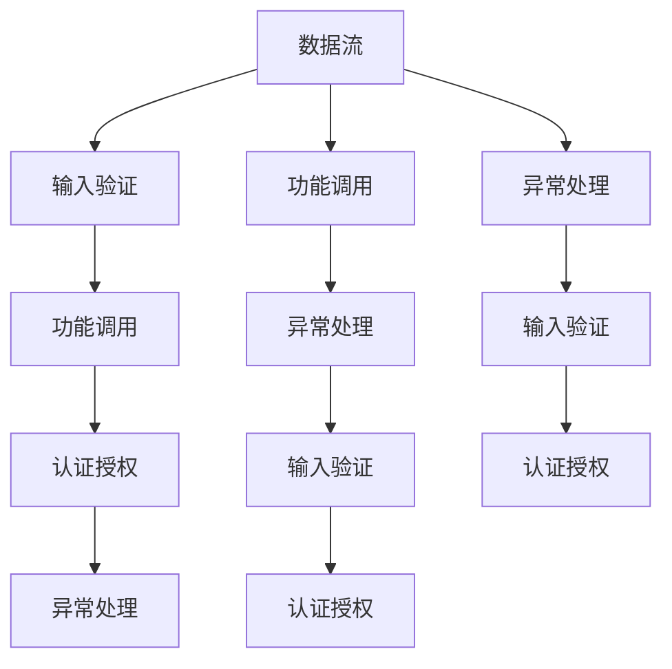
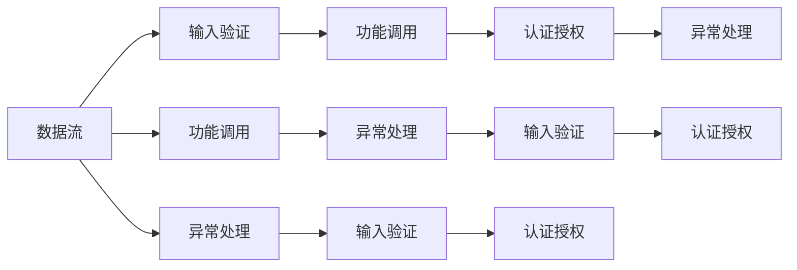

                 

# 定期检查 OWASP API 安全风险清单

在当今的数字化时代，API（应用程序接口）已经成为连接各种应用和服务的桥梁。然而，随着API数量的激增，安全问题也日益突出。开放网络应用程序安全项目（OWASP）为应对这一挑战，制定了一系列API安全风险清单，帮助开发者识别、评估和缓解API安全风险。本文将深入探讨OWASP API安全风险清单的原理、操作步骤、优缺点和应用领域，并结合具体案例进行详细讲解。

## 1. 背景介绍

### 1.1 问题由来
随着微服务架构和DevOps的普及，API的数量和复杂度急剧增加，安全问题变得愈发严重。常见的API安全威胁包括SQL注入、跨站脚本（XSS）、跨站请求伪造（CSRF）、会话固定、重放攻击等。为应对这些威胁，OWASP组织于2017年发布了API安全风险清单，旨在帮助开发者和架构师构建安全、可靠的API。

### 1.2 问题核心关键点
OWASP API安全风险清单主要关注API在数据流、功能调用、认证授权、输入验证和异常处理等方面的安全问题。通过定期检查和评估，开发者可以及时发现并修复潜在的安全漏洞，保护API免受攻击。

### 1.3 问题研究意义
定期检查API安全风险清单具有重要意义：
- 降低安全风险：及时发现并修复安全漏洞，减少被攻击的风险。
- 增强用户体验：提高API的稳定性和可靠性，提升用户体验。
- 减少法律风险：避免因API安全问题引发的法律纠纷。
- 提升品牌信誉：确保API服务的高安全性，增强用户信任。

## 2. 核心概念与联系

### 2.1 核心概念概述
为更好地理解OWASP API安全风险清单，本节将介绍几个关键概念：

- API安全风险清单（OWASP API Security Top 10）：OWASP根据API常见安全问题制定的十大安全风险，包括身份验证和授权、数据泄露、不足的输入验证等。
- 数据流（Data Flows）：API请求和响应中的数据传输过程，包括请求参数、响应数据、会话信息等。
- 功能调用（Functional Calls）：API的核心功能实现，如身份验证、数据处理、业务逻辑等。
- 认证授权（Authentication and Authorization）：API用户身份验证和访问权限控制机制。
- 输入验证（Input Validation）：对API输入参数进行有效性、合法性检查的过程。
- 异常处理（Exception Handling）：API在处理异常情况时的错误处理机制。

这些概念之间存在紧密的联系，共同构成了API安全的完整框架。以下Mermaid流程图展示了这些概念之间的关系：



### 2.2 概念间的关系

这些核心概念之间存在紧密的联系，形成了API安全的完整生态系统。以下Mermaid流程图展示了这些概念之间的关系：



通过以上流程图，我们可以更清晰地理解API安全的各个方面，并认识到这些方面相互依赖、相互影响的特点。

## 3. 核心算法原理 & 具体操作步骤
### 3.1 算法原理概述
OWASP API安全风险清单的核心算法原理是基于漏洞利用和攻击手段的分类和排序。清单将API安全问题分为十大类，每类包含若干具体的风险项。开发者可以根据这些风险项进行自我评估，识别潜在的漏洞，并采取相应的防御措施。

### 3.2 算法步骤详解
以下是检查OWASP API安全风险清单的具体操作步骤：

**Step 1: 准备检查清单**
- 下载并熟悉OWASP API安全风险清单，了解各项风险的定义和示例。
- 准备API系统，确保有足够的访问权限和日志记录。

**Step 2: 进行安全评估**
- 根据清单逐一检查API的各个方面，包括数据流、功能调用、认证授权、输入验证和异常处理等。
- 对于发现的风险项，记录详细情况，分析其原因和影响。

**Step 3: 制定改进措施**
- 根据风险评估结果，制定相应的改进措施，包括代码修改、功能优化、安全配置等。
- 优先解决高危风险项，确保API系统的安全性和可靠性。

**Step 4: 实施改进措施**
- 根据制定的改进措施，逐步实施，更新API系统的代码和配置。
- 进行全面的测试，确保改进措施的有效性。

**Step 5: 定期复审**
- 定期（如每季度或每半年）进行复审，检查API系统是否存在新的安全风险。
- 根据新的威胁情况，持续改进API安全措施。

### 3.3 算法优缺点
OWASP API安全风险清单的优点包括：
- 系统性：覆盖了API安全的各个方面，提供了全面的指导。
- 实用性：清单中的风险项具体且易于实施，能够有效指导开发者。
- 社区认可：由权威的OWASP组织发布，得到业界的广泛认可。

其缺点包括：
- 静态性：清单是基于现状制定的，难以应对不断变化的安全威胁。
- 泛化性：清单针对一般情况，对特定场景的适用性可能不足。
- 主观性：清单中的风险评估和改进建议具有一定的主观性，需要开发者根据实际情况进行调整。

### 3.4 算法应用领域
OWASP API安全风险清单广泛应用于各种规模和类型的API系统，包括企业级API、云服务API、第三方API等。无论是在开发阶段还是在运维阶段，清单都提供了宝贵的参考和指导。

## 4. 数学模型和公式 & 详细讲解 & 举例说明（备注：数学公式请使用latex格式，latex嵌入文中独立段落使用 $$，段落内使用 $)
### 4.1 数学模型构建
为了更好地理解API安全风险清单的计算模型，我们以SQL注入（SQI）为例，构建一个简单的数学模型：

设$S$为SQL注入风险等级，$C$为被攻击API系统的复杂度，$E$为攻击者对API系统的了解程度，$L$为API系统的潜在损失。则SQL注入风险等级$S$可表示为：

$$ S = f(C, E, L) $$

其中，$f$为风险评估函数，具体形式可根据实际情况进行调整。

### 4.2 公式推导过程
对于SQL注入风险等级$S$，其计算公式为：

$$ S = k_1 \times C^{\alpha} + k_2 \times E^{\beta} + k_3 \times L^{\gamma} $$

其中，$k_1, k_2, k_3$为权重系数，$\alpha, \beta, \gamma$为指数参数。实际应用中，可通过试验和统计方法确定这些参数。

### 4.3 案例分析与讲解
假设某企业API系统的复杂度$C=5$，攻击者对系统的了解程度$E=2$，潜在的损失$L=100000$。代入公式计算得：

$$ S = k_1 \times 5^{\alpha} + k_2 \times 2^{\beta} + k_3 \times 100000^{\gamma} $$

若$k_1=0.1, k_2=0.2, k_3=0.3, \alpha=1, \beta=0.5, \gamma=0.5$，则：

$$ S = 0.1 \times 5 + 0.2 \times 2^{0.5} + 0.3 \times 100000^{0.5} \approx 7.48 $$

此结果表明，该API系统存在较高的SQL注入风险，需要立即采取措施进行防御。

## 5. 项目实践：代码实例和详细解释说明
### 5.1 开发环境搭建

在进行API安全风险检查时，我们需要准备好开发环境。以下是使用Python进行Flask框架开发的API环境配置流程：

1. 安装Python：从官网下载并安装Python 3.x版本。
2. 安装Flask：使用pip安装Flask框架，确保环境依赖。
3. 创建Flask项目：
```bash
mkdir flask_api
cd flask_api
python3 -m venv venv
source venv/bin/activate
pip install flask
```

完成上述步骤后，即可在虚拟环境中开始API开发。

### 5.2 源代码详细实现

以下是使用Flask框架构建的简单API接口，实现了输入验证和异常处理功能：

```python
from flask import Flask, request, jsonify

app = Flask(__name__)

@app.route('/api', methods=['POST'])
def api():
    data = request.json
    if 'name' not in data:
        return jsonify({'error': 'Missing required parameter: name'}), 400
    try:
        name = data['name']
        # 处理业务逻辑
        result = 'Hello, {}'.format(name)
    except Exception as e:
        return jsonify({'error': str(e)}), 500
    return jsonify({'result': result}), 200

if __name__ == '__main__':
    app.run(debug=True)
```

在上述代码中，我们首先检查请求是否包含必需的参数，若缺少则返回错误响应。接着，在处理业务逻辑时，我们尝试获取请求中的参数，并捕获异常，确保API的稳定性和安全性。

### 5.3 代码解读与分析
我们逐行分析代码的实现过程：

**Flask应用初始化**
```python
app = Flask(__name__)
```

创建Flask应用实例。

**路由定义**
```python
@app.route('/api', methods=['POST'])
def api():
```

定义路由路径`/api`，并指定请求方法为POST。

**请求数据处理**
```python
data = request.json
```

获取请求中的JSON数据。

**输入验证**
```python
if 'name' not in data:
    return jsonify({'error': 'Missing required parameter: name'}), 400
```

检查请求数据是否包含必需的参数`name`，若缺少则返回错误响应。

**业务逻辑处理**
```python
name = data['name']
# 处理业务逻辑
result = 'Hello, {}'.format(name)
```

处理业务逻辑，将参数值作为输出结果。

**异常处理**
```python
try:
    # 处理业务逻辑
    result = 'Hello, {}'.format(name)
except Exception as e:
    return jsonify({'error': str(e)}), 500
```

在处理业务逻辑时捕获异常，返回500错误响应。

**成功响应**
```python
return jsonify({'result': result}), 200
```

返回200成功响应，并将结果作为JSON数据返回。

### 5.4 运行结果展示

使用Postman等工具发送请求，检查API的响应结果。若缺少必需参数，API应返回400错误响应；若处理业务逻辑出现异常，API应返回500错误响应。

## 6. 实际应用场景
### 6.1 企业级API
企业级API通常承载着核心业务逻辑，涉及大量的敏感数据和机密信息。因此，API安全风险清单在企业级API的构建和运维过程中显得尤为重要。企业可通过定期检查API风险清单，确保API系统的安全性和可靠性。

### 6.2 云服务API
云服务API通常被众多企业和服务提供商所使用，其安全性直接影响到用户的信任和业务连续性。通过定期检查API风险清单，云服务提供商可以及时发现和修复安全漏洞，增强API系统的安全性。

### 6.3 第三方API
第三方API在互联网中广泛使用，其安全性关系到整个生态系统的稳定。通过定期检查API风险清单，第三方API提供商可以确保其API系统的安全性，提升用户和合作伙伴的信任度。

### 6.4 未来应用展望
随着API系统的复杂度和规模不断扩大，API安全问题将变得越来越重要。未来，API安全风险清单将在更多行业领域得到应用，为API系统的构建和运维提供全面的指导和保障。

## 7. 工具和资源推荐
### 7.1 学习资源推荐
为了帮助开发者系统掌握API安全风险清单的理论基础和实践技巧，以下是一些优质的学习资源：

1. OWASP官网：提供OWASP API安全风险清单的详细说明和示例。
2. 《Web应用安全测试指南》：介绍API安全测试的各个方面，帮助开发者发现潜在的安全问题。
3. Flask官方文档：提供Flask框架的详细文档和示例，帮助开发者快速上手API开发。
4. Python文档：提供Python语言的详细文档和教程，帮助开发者深入理解API开发的技术细节。

### 7.2 开发工具推荐
高效的API开发离不开优秀的工具支持。以下是几款用于API开发和测试的工具：

1. Postman：用于发送HTTP请求，测试API接口。
2. Swagger：用于API文档的生成和测试，帮助开发者快速构建和部署API。
3. Insomnia：用于API请求的自动化测试和管理。
4. PyCharm：集成IDE，提供代码调试和测试支持，提高API开发的效率。

### 7.3 相关论文推荐
以下是几篇代表性论文，推荐阅读：

1. OWASP API Security Top 10：OWASP制定的API安全风险清单，详细介绍API常见的十大安全问题。
2. API Security Testing for Modern Web Applications：介绍API安全测试的最新方法和技术。
3. A Survey on API Security in Modern Web Applications：综述API安全领域的最新研究成果和趋势。

## 8. 总结：未来发展趋势与挑战
### 8.1 总结

本文对OWASP API安全风险清单进行了全面系统的介绍。首先阐述了API安全风险清单的研究背景和意义，明确了API安全风险清单在API系统构建和运维过程中的重要作用。其次，从原理到实践，详细讲解了API安全风险清单的核心算法和操作步骤，提供了完整的API开发实例和运行结果展示。同时，本文还探讨了API安全风险清单在企业级API、云服务API、第三方API等实际应用场景中的应用前景，展示了API安全风险清单的广阔应用潜力。

通过本文的系统梳理，可以看到，OWASP API安全风险清单已经成为API安全领域的重要工具，极大地提高了API系统的安全性和可靠性。未来，API安全风险清单将不断演进，结合最新的安全威胁和防护技术，为API系统的构建和运维提供更加全面、有效的指导和保障。

### 8.2 未来发展趋势

展望未来，API安全风险清单将呈现以下几个发展趋势：

1. 实时监控：结合日志分析、异常检测等技术，实现API系统的实时监控和告警，及时发现和响应安全事件。
2. 自动化测试：引入自动化测试工具和框架，对API接口进行持续性测试，确保API系统的稳定性和安全性。
3. 多层次防护：结合网络安全、应用安全、数据安全等多层次防护措施，构建全面的API安全防护体系。
4. 跨平台统一：在各种云平台和容器环境中实现API安全风险清单的统一管理和防护。
5. 集成SOC：将API安全风险清单与系统运维中心(SOC)集成，实现统一的安全管理和监控。

以上趋势凸显了API安全风险清单的广泛应用前景，为API系统的构建和运维提供了新的思路和方向。这些方向的探索发展，必将进一步提升API系统的安全性，保障其稳定运行。

### 8.3 面临的挑战

尽管API安全风险清单已经取得了一定的成效，但在迈向更加智能化、普适化应用的过程中，它仍面临着诸多挑战：

1. 持续更新：API安全威胁不断变化，API安全风险清单需要定期更新，以应对新的安全挑战。
2. 跨域一致性：不同API系统之间的安全要求和规范不一致，难以实现统一的安全防护。
3. 兼容性与性能：API安全风险清单需要在不影响API性能的前提下，实现对现有系统的适配。
4. 技术复杂性：API安全风险清单的实施涉及复杂的防护措施和工具，对技术要求较高。
5. 用户教育：API使用者对API安全风险清单的认知和理解不足，需要持续的教育和培训。

正视API安全风险清单面临的这些挑战，积极应对并寻求突破，将使API系统的安全性得到进一步提升。相信随着学界和产业界的共同努力，这些挑战终将一一被克服，API安全风险清单必将在构建安全、可靠、高效的API系统中发挥重要作用。

### 8.4 研究展望

面对API安全风险清单所面临的种种挑战，未来的研究需要在以下几个方面寻求新的突破：

1. 自动化测试和监控：开发自动化的API测试和监控工具，实现对API系统的持续性检测和告警。
2. 跨域防护机制：研究跨域API的安全防护机制，确保不同API系统之间的安全一致性。
3. 防护技术集成：将API安全风险清单与现有安全防护技术进行集成，提高防护效果。
4. 技术简化与推广：简化API安全风险清单的实施流程，降低技术门槛，提高其应用普及率。
5. 用户教育与培训：加强对API使用者的安全意识培训，提升其安全防护能力。

这些研究方向的探索，必将引领API安全风险清单技术迈向更高的台阶，为构建安全、可靠、高效的API系统提供全面的指导和保障。面向未来，API安全风险清单还需要与其他API安全技术进行更深入的融合，共同推动API系统的安全性和稳定性发展。

## 9. 附录：常见问题与解答

**Q1：如何选择合适的API安全风险清单？**

A: 选择API安全风险清单应考虑以下因素：
1. 适用性：根据API系统的规模和复杂度，选择适合的API安全风险清单。
2. 权威性：选择由权威机构发布的API安全风险清单，确保其可靠性和有效性。
3. 更新频率：选择定期更新的API安全风险清单，确保其内容的时效性。

**Q2：API安全风险清单中的风险项应该如何实施？**

A: 实施API安全风险清单的风险项应考虑以下步骤：
1. 风险评估：对API系统的各个方面进行风险评估，确定需要优先解决的风险项。
2. 代码修改：根据风险项的具体情况，修改API系统的代码和配置。
3. 功能优化：改进API系统的功能实现，增强其安全性。
4. 安全配置：调整API系统的安全配置，增强其防护能力。
5. 测试验证：对修改后的API系统进行全面的测试，确保风险项已有效解决。

**Q3：API安全风险清单的局限性有哪些？**

A: API安全风险清单的局限性包括：
1. 静态性：清单中的风险项和防护措施是基于现状制定的，难以应对不断变化的安全威胁。
2. 泛化性：清单中的风险评估和防护措施可能不适用于特定场景，需要开发者根据实际情况进行调整。
3. 主观性：清单中的风险评估和防护措施具有一定的主观性，需要开发者根据实际情况进行调整。

**Q4：API安全风险清单与现有的API安全标准和框架有何不同？**

A: API安全风险清单与现有的API安全标准和框架有以下不同：
1. 适用范围：API安全风险清单覆盖了API系统的各个方面，适用于各种规模和类型的API系统。
2. 风险评估：清单通过具体的风险项和示例，帮助开发者识别和评估安全问题。
3. 防护措施：清单提供了具体的防护措施和建议，帮助开发者实施安全改进。
4. 更新频率：清单定期更新，适应新的安全威胁和防护技术。

**Q5：API安全风险清单在API开发和运维中的作用是什么？**

A: API安全风险清单在API开发和运维中的作用包括：
1. 指导开发：在API开发过程中，清单提供全面的安全指导，帮助开发者构建安全、可靠的API系统。
2. 评估和改进：定期评估API系统的安全状况，及时发现和修复潜在的安全漏洞。
3. 持续改进：通过持续的评估和改进，确保API系统的安全性不断提高。
4. 合规性保障：确保API系统符合行业标准和规范，避免法律和合规风险。

总之，定期检查OWASP API安全风险清单，是确保API系统安全性的重要手段。开发者需要根据API系统的具体情况，灵活应用清单中的风险项和防护措施，不断提升API系统的安全性，为用户提供更加可靠和安全的API服务。

---

作者：禅与计算机程序设计艺术 / Zen and the Art of Computer Programming

