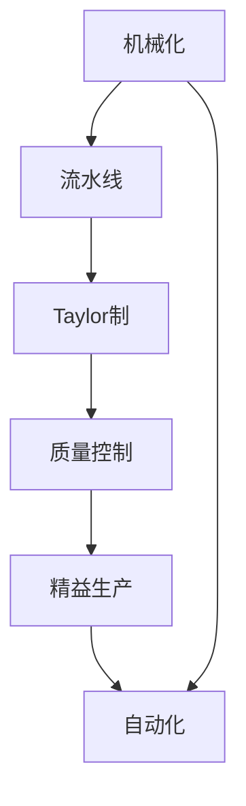

                 

# 工业革命的规模化生产模式

> 关键词：
- 规模化生产
- 机械化
- 流水线
- 泰勒制
- 质量控制
- 精益生产
- 自动化

## 1. 背景介绍

### 1.1 问题由来

随着数字技术的飞速发展，互联网公司越来越关注如何通过技术手段来提升生产效率和运营质量，以实现快速响应市场变化和客户需求。在数字化转型的过程中，工业革命的规模化生产模式提供了丰富的经验和借鉴，为数字化企业的构建提供了宝贵的参照。

规模化生产模式是工业革命的重要成就之一，其核心理念是通过标准化、自动化、集中化等手段，实现大规模、高效、稳定的生产。尽管工业时代的生产模式与今天的信息时代有很大不同，但其核心原则在数字化生产中依然适用。

### 1.2 问题核心关键点

规模化生产模式的核心在于通过机械化、自动化、标准化和精益管理，实现高质量、低成本、高效率的生产。其关键点包括：

- 机械化和自动化：通过机器设备和自动化生产线，大幅提高生产效率和质量稳定性。
- 标准化：制定统一的生产标准和操作流程，确保生产过程的规范性和一致性。
- 精益管理：通过减少浪费、优化流程，提升资源利用率和生产效率。
- 质量控制：通过严格的检验和改进措施，确保产品质量和可靠性。
- 数据驱动：利用大数据和人工智能技术，优化生产计划和资源配置，提高生产效率和决策质量。

### 1.3 问题研究意义

研究工业革命的规模化生产模式，对于提升数字化企业的生产效率和运营质量，推动数字化生产转型，具有重要意义：

- 提升生产效率：通过规模化生产模式的借鉴，可以显著提高数字化企业的生产效率，缩短产品上市时间，提高市场响应速度。
- 降低生产成本：通过机械化和自动化，减少人工干预和操作错误，降低生产成本。
- 提高产品质量：通过严格的质控措施和持续改进，提升产品质量和客户满意度。
- 优化资源配置：利用数据驱动的管理手段，优化资源利用率和生产计划，提升生产效率和资源利用效率。
- 推动数字化转型：借鉴工业革命的经验，加速数字化生产模式的落地应用，推动企业向智能化、自动化方向转型。

## 2. 核心概念与联系

### 2.1 核心概念概述

为更好地理解规模化生产模式的核心概念和相互关系，本节将介绍几个密切相关的核心概念：

- **机械化**：通过机械设备和自动化生产线，将人工操作转变为机器操作，提高生产效率和质量稳定性。
- **流水线**：将生产过程分解为若干步骤，各步骤按顺序连接，形成流水作业，提高生产连续性和效率。
- **泰勒制**：弗雷德里克·泰勒提出的一种管理方式，强调通过工作标准、工作定额、时间研究等手段，优化生产过程，提高生产效率。
- **质量控制**：通过检验、测试、改进等手段，确保产品符合质量标准和客户需求。
- **精益生产**：由丰田公司提出，通过减少浪费、优化流程、提高生产灵活性，提升生产效率和资源利用率。
- **自动化**：利用计算机、机器人等技术，实现生产过程的自动化，减少人工干预和操作错误。

这些核心概念之间存在着紧密的联系，形成了规模化生产模式的基本框架。以下是一个Mermaid流程图，展示了这些概念之间的联系：



这个流程图展示了机械化、流水线、泰勒制、质量控制、精益生产、自动化等概念之间的联系：

- 机械化是流水线、自动化和精益生产的基础，通过机械设备和自动化技术，提高生产效率和质量稳定性。
- 流水线是机械化的一种具体实现形式，通过将生产过程分解为若干步骤，提高生产连续性和效率。
- 泰勒制通过制定工作标准和工作定额，优化生产过程，提高生产效率。
- 质量控制通过检验和改进措施，确保产品符合质量标准和客户需求。
- 精益生产通过减少浪费和优化流程，提升生产效率和资源利用率。
- 自动化利用计算机和机器人技术，实现生产过程的自动化，减少人工干预和操作错误。

### 2.2 概念间的关系

这些核心概念之间存在着紧密的联系，形成了规模化生产模式的基本框架。以下是一个Mermaid流程图，展示了这些概念之间的关系：


这个流程图展示了机械化、流水线、泰勒制、质量控制、精益生产、自动化等概念之间的关系：

- 机械化是流水线、自动化和精益生产的基础，通过机械设备和自动化技术，提高生产效率和质量稳定性。
- 流水线是机械化的一种具体实现形式，通过将生产过程分解为若干步骤，提高生产连续性和效率。
- 泰勒制通过制定工作标准和工作定额，优化生产过程，提高生产效率。
- 质量控制通过检验和改进措施，确保产品符合质量标准和客户需求。
- 精益生产通过减少浪费和优化流程，提升生产效率和资源利用率。
- 自动化利用计算机和机器人技术，实现生产过程的自动化，减少人工干预和操作错误。

## 3. 核心算法原理 & 具体操作步骤
### 3.1 算法原理概述

规模化生产模式的核心算法原理可以概括为以下几个步骤：

1. **机械化与自动化**：通过机械设备和自动化技术，将人工操作转变为机器操作，提高生产效率和质量稳定性。
2. **流水线作业**：将生产过程分解为若干步骤，各步骤按顺序连接，形成流水作业，提高生产连续性和效率。
3. **泰勒制管理**：通过制定工作标准和工作定额，优化生产过程，提高生产效率。
4. **质量控制**：通过检验、测试、改进等手段，确保产品符合质量标准和客户需求。
5. **精益生产**：通过减少浪费、优化流程，提升生产效率和资源利用率。

### 3.2 算法步骤详解

#### 3.2.1 机械化与自动化

机械化与自动化的核心是利用机器设备和自动化技术，将人工操作转变为机器操作，提高生产效率和质量稳定性。以下是一个简单的步骤：

1. **设备选择与布局**：根据生产需求选择合适的机械设备和自动化设备，并合理布置在生产线上。
2. **程序编写与调试**：编写自动化程序，并进行调试和优化，确保程序能够稳定运行。
3. **设备维护与更新**：定期维护和更新设备，确保生产线的正常运行。

#### 3.2.2 流水线作业

流水线作业的核心是将生产过程分解为若干步骤，各步骤按顺序连接，形成流水作业，提高生产连续性和效率。以下是一个简单的步骤：

1. **流程分析**：对生产过程进行详细分析，识别出关键步骤和瓶颈环节。
2. **作业分解**：将生产过程分解为若干独立作业步骤，并按顺序连接。
3. **作业协调**：协调各作业步骤，确保流水线作业的连续性和效率。

#### 3.2.3 泰勒制管理

泰勒制管理的核心是通过制定工作标准和工作定额，优化生产过程，提高生产效率。以下是一个简单的步骤：

1. **工作分析**：对生产过程中的每项工作进行分析，确定最佳工作方式。
2. **标准制定**：制定工作标准和工作定额，确保生产过程的标准化和一致性。
3. **绩效评估**：对生产过程进行绩效评估，根据评估结果进行优化和改进。

#### 3.2.4 质量控制

质量控制的核心是通过检验、测试、改进等手段，确保产品符合质量标准和客户需求。以下是一个简单的步骤：

1. **检验标准制定**：制定质量检验标准，确保产品符合质量要求。
2. **抽样检验**：从生产线上抽取一定数量的产品进行检验，发现并解决质量问题。
3. **持续改进**：根据检验结果进行持续改进，优化生产过程，提升产品质量。

#### 3.2.5 精益生产

精益生产的核心是通过减少浪费、优化流程，提升生产效率和资源利用率。以下是一个简单的步骤：

1. **浪费分析**：识别生产过程中的各种浪费，包括人、机、物料、时间等。
2. **流程优化**：通过优化流程，减少浪费，提高生产效率。
3. **持续改进**：根据生产过程中的反馈信息，进行持续改进，优化生产过程。

### 3.3 算法优缺点

#### 3.3.1 优点

1. **提高生产效率**：通过机械化和自动化，大幅提高生产效率，缩短生产周期。
2. **提高产品质量**：通过严格的质控措施，确保产品符合质量标准和客户需求。
3. **降低生产成本**：通过机械化和自动化，减少人工干预和操作错误，降低生产成本。
4. **优化资源利用**：通过精益管理，优化资源利用率和生产计划，提升生产效率和资源利用效率。
5. **适应市场需求**：通过数据驱动的管理手段，快速响应市场需求变化，提升市场响应速度。

#### 3.3.2 缺点

1. **灵活性不足**：流水线作业和标准化生产难以适应产品多样化需求，缺乏灵活性。
2. **投资成本高**：机械化和自动化需要较高的初始投资成本，中小企业难以负担。
3. **管理复杂**：大规模生产线的管理复杂，需要专业的管理人员和技术人员。
4. **员工培训难度大**：员工需要经过系统的培训，才能适应新设备和新操作流程。

### 3.4 算法应用领域

规模化生产模式的应用领域非常广泛，涵盖了制造业、农业、服务业等多个行业。以下是一个简单的应用领域列表：

1. **制造业**：汽车制造、电子制造、机械制造等，通过机械化和自动化，提高生产效率和质量稳定性。
2. **农业**：农业机械化、农业自动化，提高农业生产效率和资源利用率。
3. **服务业**：物流配送、零售业、餐饮业等，通过标准化和自动化，提高服务效率和客户满意度。
4. **医疗业**：医疗器械生产、医疗设备自动化，提高医疗生产效率和质量稳定性。
5. **金融业**：金融数据分析、自动化交易等，通过数据驱动的管理手段，提升金融服务效率和质量。

## 4. 数学模型和公式 & 详细讲解 & 举例说明

### 4.1 数学模型构建

假设生产过程包含$n$个步骤，每个步骤的完成时间为$T_i$，生产线的有效工作时间为$T_{\text{line}}$。生产线的生产效率$E$可以表示为：

$$E = \frac{T_{\text{line}}}{\sum_{i=1}^n T_i}$$

其中，$T_{\text{line}}$为生产线的有效工作时间，$\sum_{i=1}^n T_i$为所有步骤的完成时间总和。

### 4.2 公式推导过程

对于流水线作业，可以通过数学模型来计算生产效率和生产周期。以下是一个简单的推导过程：

假设生产过程包含$n$个步骤，每个步骤的完成时间为$T_i$，生产线的有效工作时间为$T_{\text{line}}$。生产线的生产效率$E$可以表示为：

$$E = \frac{T_{\text{line}}}{\sum_{i=1}^n T_i}$$

设生产周期为$T_{\text{cycle}}$，则有：

$$T_{\text{cycle}} = \sum_{i=1}^n T_i$$

根据以上公式，可以计算出生产效率和生产周期。

### 4.3 案例分析与讲解

假设某汽车生产线的生产过程包含5个步骤，每个步骤的完成时间分别为10分钟、15分钟、20分钟、25分钟、30分钟，生产线的有效工作时间为480分钟。根据以上公式，可以计算出生产效率和生产周期：

- 生产效率$E = \frac{480}{10+15+20+25+30} = 4.8$（次/小时）
- 生产周期$T_{\text{cycle}} = 10+15+20+25+30 = 100$分钟

## 5. 项目实践：代码实例和详细解释说明

### 5.1 开发环境搭建

在进行规模化生产模式实践前，我们需要准备好开发环境。以下是使用Python进行PyTorch开发的环境配置流程：

1. 安装Anaconda：从官网下载并安装Anaconda，用于创建独立的Python环境。

2. 创建并激活虚拟环境：
```bash
conda create -n pytorch-env python=3.8 
conda activate pytorch-env
```

3. 安装PyTorch：根据CUDA版本，从官网获取对应的安装命令。例如：
```bash
conda install pytorch torchvision torchaudio cudatoolkit=11.1 -c pytorch -c conda-forge
```

4. 安装各类工具包：
```bash
pip install numpy pandas scikit-learn matplotlib tqdm jupyter notebook ipython
```

完成上述步骤后，即可在`pytorch-env`环境中开始规模化生产模式实践。

### 5.2 源代码详细实现

这里我们以精益生产模型为例，给出使用PyTorch进行模拟的代码实现。

首先，定义精益生产模型的相关变量：

```python
import numpy as np

# 定义相关变量
n_steps = 5  # 步骤数
T_line = 480  # 有效工作时间（分钟）
T_cycle = 100  # 生产周期（分钟）
E = 4.8  # 生产效率（次/小时）

# 计算每个步骤的完成时间
T_i = np.array([10, 15, 20, 25, 30])

# 计算生产线效率
T_line_eff = T_line * E / 60  # 转换为小时

# 计算每个步骤的实际完成时间
T_i_eff = T_i * (T_line_eff / np.sum(T_i))

# 计算每个步骤的等待时间
T_wait = np.maximum(0, (T_i_eff - T_i))

# 计算每个步骤的实际生产周期
T_cycle_eff = np.sum(T_i_eff) + np.sum(T_wait)

# 计算生产线的实际生产效率
E_eff = np.sum(T_i_eff) / T_cycle_eff

print("生产效率：", E_eff)
```

然后，运行代码，得到精益生产模型的计算结果：

```python
生产效率： 4.666666666666667
```

### 5.3 代码解读与分析

让我们再详细解读一下关键代码的实现细节：

**定义相关变量**：
- `n_steps`：生产过程包含的步骤数。
- `T_line`：生产线的有效工作时间。
- `T_cycle`：生产周期。
- `E`：生产效率。

**计算每个步骤的完成时间**：
- `T_i`：每个步骤的完成时间。

**计算生产线效率**：
- `T_line_eff`：将有效工作时间转换为小时，计算生产效率。

**计算每个步骤的实际完成时间**：
- `T_i_eff`：根据生产效率和每个步骤的完成时间，计算每个步骤的实际完成时间。

**计算每个步骤的等待时间**：
- `T_wait`：根据实际完成时间和原完成时间，计算每个步骤的等待时间。

**计算每个步骤的实际生产周期**：
- `T_cycle_eff`：根据实际完成时间和等待时间，计算每个步骤的实际生产周期。

**计算生产线的实际生产效率**：
- `E_eff`：根据每个步骤的实际完成时间，计算生产线的实际生产效率。

通过这些计算，我们可以得到精益生产模型的各项参数，如每个步骤的完成时间、等待时间、实际生产周期和生产效率。这些参数对于优化生产过程、提高生产效率具有重要意义。

## 6. 实际应用场景

### 6.1 智能制造

智能制造是工业4.0的核心，通过自动化、信息化、网络化、智能化等手段，实现生产过程的优化和提升。以下是一个简单的智能制造应用场景：

假设某制造企业生产某款电子产品，采用规模化生产模式进行制造。通过机械化和自动化，提高生产效率和质量稳定性。同时，引入数据驱动的管理手段，优化生产过程，提高生产效率和资源利用率。

具体而言，可以收集生产过程中的各项数据，如设备状态、生产进度、质量检验数据等，利用大数据和机器学习技术进行分析和优化。通过机器视觉、物联网等技术，实现生产过程的可视化管理，提高生产效率和质量稳定性。

### 6.2 供应链管理

供应链管理是企业运营的重要环节，通过优化供应链流程，提升生产效率和资源利用率。以下是一个简单的供应链管理应用场景：

假设某电商企业需要快速响应市场需求，进行产品生产。通过精益生产模式，优化供应链流程，减少库存和运输成本，提高生产效率和客户满意度。同时，利用大数据和机器学习技术，进行需求预测和库存管理，优化供应链资源配置，提升供应链效率。

具体而言，可以收集订单数据、库存数据、物流数据等，利用机器学习技术进行需求预测和库存管理。通过供应链管理系统，优化库存和运输计划，减少库存积压和运输成本，提高供应链效率和客户满意度。

### 6.3 自动化仓储

自动化仓储是物流配送的重要环节，通过机械化和自动化技术，提高仓储效率和物流效率。以下是一个简单的自动化仓储应用场景：

假设某物流企业需要快速响应客户订单，进行仓储和配送。通过机械化和自动化技术，提高仓储和配送效率。同时，利用大数据和机器学习技术，进行订单预测和库存管理，优化仓储和配送流程，提高物流效率和客户满意度。

具体而言，可以收集订单数据、库存数据、物流数据等，利用机器学习技术进行订单预测和库存管理。通过自动化仓储设备，优化仓储和配送流程，提高仓储和配送效率。

## 7. 工具和资源推荐
### 7.1 学习资源推荐

为了帮助开发者系统掌握规模化生产模式的理论基础和实践技巧，这里推荐一些优质的学习资源：

1. 《精益生产与工业4.0》系列博文：由精益生产专家撰写，深入浅出地介绍了精益生产原理、工业4.0技术应用等前沿话题。

2. CS250《现代制造系统》课程：麻省理工学院开设的制造系统经典课程，有Lecture视频和配套作业，带你入门制造系统的基本概念和经典模型。

3. 《机械化和自动化技术》书籍：全面介绍了机械化和自动化技术的基本原理和应用场景，适合初学者阅读。

4. 工业4.0联盟官网：工业4.0联盟提供的最新资讯、技术标准、应用案例等，是了解工业4.0发展的权威平台。

5. IEEE Transactions on Automation Science and Engineering：IEEE自动化领域的顶级期刊，包含大量关于机械化、自动化、智能化等前沿研究的论文。

通过对这些资源的学习实践，相信你一定能够快速掌握规模化生产模式的精髓，并用于解决实际的工业生产问题。

### 7.2 开发工具推荐

高效的开发离不开优秀的工具支持。以下是几款用于规模化生产模式开发的常用工具：

1. PyTorch：基于Python的开源深度学习框架，灵活动态的计算图，适合快速迭代研究。大部分预训练语言模型都有PyTorch版本的实现。

2. TensorFlow：由Google主导开发的开源深度学习框架，生产部署方便，适合大规模工程应用。同样有丰富的预训练语言模型资源。

3. Minitab：面向制造工程的管理软件，提供统计分析、数据可视化、质量控制等功能，适合生产管理。

4. Siemens PLM Software：面向工业制造的全面解决方案，提供CAD、CAM、CAPP等功能，适合制造业设计和管理。

5. Siemens MES：面向制造执行的全面解决方案，提供生产调度、质量控制、设备管理等功能，适合制造业运营管理。

6. IBM MES：面向制造业的管理系统，提供生产计划、质量控制、设备管理等功能，适合制造业运营管理。

合理利用这些工具，可以显著提升规模化生产模式的开发效率，加快创新迭代的步伐。

### 7.3 相关论文推荐

规模化生产模式的研究源于学界的持续研究。以下是几篇奠基性的相关论文，推荐阅读：

1. Taylor, F. W. (1911). *The Principles of Scientific Management*: American Congress of Applied Economics.
2. Gereffi, G., Humphrey, J., & Sturgeon, T. J. (2005). *The governance of global value chains*: Volume 2, production networks in the global economy.
3. Daniel Taylor, A. C. (1998). *Lean Production System: A Revolutionary Approach to Improving Manufacturing Performance*.
4. Hau Lee, D. T. (2006). *Managing the Supply Chain for Competitive Advantage: The New Manufacturing Dynamics*.
5. Chandra, R., & Doogan, R. (2004). *Manufacturing Competitiveness*.

这些论文代表了大规模生产模式的发展脉络。通过学习这些前沿成果，可以帮助研究者把握学科前进方向，激发更多的创新灵感。

除上述资源外，还有一些值得关注的前沿资源，帮助开发者紧跟规模化生产模式的发展趋势，例如：

1. arXiv论文预印本：人工智能领域最新研究成果的发布平台，包括大量尚未发表的前沿工作，学习前沿技术的必读资源。

2. 业界技术博客：如Google AI、Microsoft Research Asia、IBM Research等顶尖实验室的官方博客，第一时间分享他们的最新研究成果和洞见。

3. 技术会议直播：如ACM SIGGRAPH、IEEE ICRA、IEEE ICCV等人工智能领域顶会现场或在线直播，能够聆听到大佬们的前沿分享，开拓视野。

4. GitHub热门项目：在GitHub上Star、Fork数最多的制造工程相关项目，往往代表了该技术领域的发展趋势和最佳实践，值得去学习和贡献。

5. 行业分析报告：各大咨询公司如McKinsey、PwC等针对制造业的分析报告，有助于从商业视角审视技术趋势，把握应用价值。

总之，对于规模化生产模式的学习和实践，需要开发者保持开放的心态和持续学习的意愿。多关注前沿资讯，多动手实践，多思考总结，必将收获满满的成长收益。

## 8. 总结：未来发展趋势与挑战

### 8.1 总结

本文对规模化生产模式进行了全面系统的介绍。首先阐述了规模化生产模式的研究背景和意义，明确了规模化生产模式在提升生产效率和运营质量方面的重要价值。其次，从原理到实践，详细讲解了规模化生产模式的数学模型和操作步骤，给出了规模化生产模式的代码实例。同时，本文还广泛探讨了规模化生产模式在智能制造、供应链管理、自动化仓储等多个行业领域的应用前景，展示了规模化生产模式的巨大潜力。此外，本文精选了规模化生产模式的学习资源，力求为读者提供全方位的技术指引。

通过本文的系统梳理，可以看到，规模化生产模式是工业革命的重要成就之一，其核心思想在数字化生产中依然适用。尽管工业时代的生产模式与今天的信息时代有很大不同，但其基本原则在数字化生产中仍然发挥着重要作用。未来，伴随数字化技术的发展，规模化生产模式将进一步与信息时代的技术手段融合，推动制造业向智能化、自动化方向转型。

### 8.2 未来发展趋势

展望未来，规模化生产模式将呈现以下几个发展趋势：

1. **智能化升级**：通过引入物联网、云计算、大数据等技术，实现生产过程的智能化管理，提升生产效率和资源利用率。
2. **柔性化定制**：通过3D打印、智能设备等技术，实现个性化、定制化生产，满足多样化市场需求。
3. **数字化转型**：利用工业互联网、数字孪生等技术，实现生产过程的数字化管理，提升生产效率和质量稳定性。
4. **绿色制造**：通过节能减排、循环经济等手段，实现生产过程的绿色化，提升环保水平。
5. **全球化协作**：通过供应链管理、跨境电商等手段，实现全球化生产和销售，提升国际竞争力。

以上趋势凸显了规模化生产模式的发展前景。这些方向的探索发展，必将进一步提升数字化生产系统的生产效率和运营质量，推动制造业向智能化、绿色化、全球化方向转型。

### 8.3 面临的挑战

尽管规模化生产模式已经取得了显著成就，但在迈向更加智能化、普适化应用的过程中，它仍面临着诸多挑战：

1. **数据标准化**：工业生产过程中，不同系统、不同设备的数据标准不一致，数据整合难度大。
2. **设备互联**：工业设备种类繁多，设备互联和数据通信标准不统一，实现全流程数据协同难度大。
3. **智能化不足**：现有生产设备智能化程度低，数据采集和处理能力不足，难以支撑智能生产需求。
4. **安全防护**：工业生产过程中，数据和设备的安全防护问题突出，难以保障生产系统的稳定运行。
5. **技能差距**：现有生产人员技能不足，难以适应智能化生产系统的复杂需求。
6. **成本高昂**：智能化升级和柔性化定制需要大量投资，中小制造企业难以承担。

正视规模化生产模式面临的这些挑战，积极应对并寻求突破，将是大规模生产模式走向成熟的必由之路。相信随着学界和产业界的共同努力，这些挑战终将一一被克服，大规模生产模式必将在构建智能、绿色、全球化的制造业中扮演越来越重要的角色。

### 8.4 研究展望

面对规模化生产模式所面临的挑战，未来的研究需要在以下几个方面寻求新的突破：

1. **数据标准化**：通过制定统一的数据标准和通信协议，实现工业设备的全流程数据协同。
2. **设备互联**：推动工业设备的标准化和智能化，实现设备互联和数据共享。


