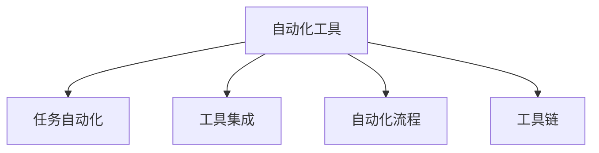
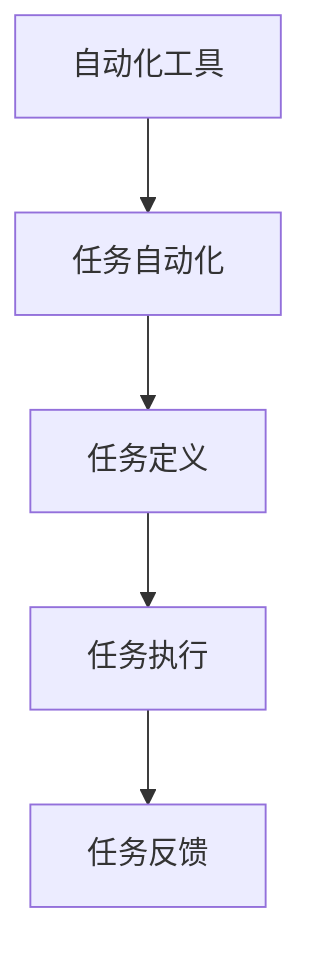
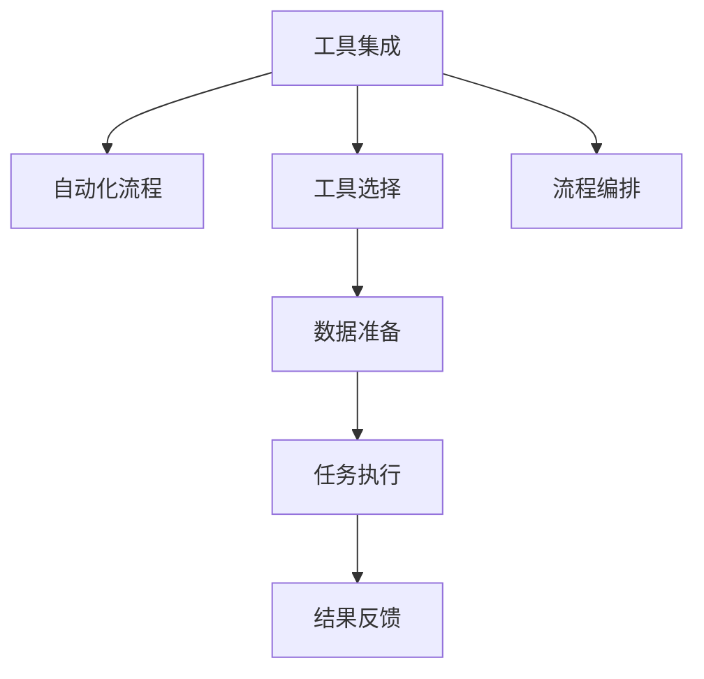
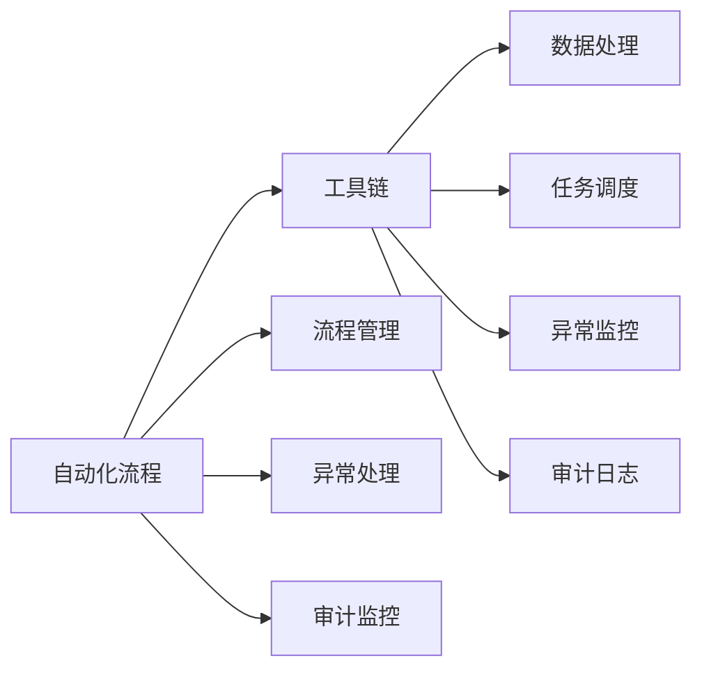

                 

# 工具使用在任务自动化中的应用

> 关键词：任务自动化, 自动化工具, 工具集成, 自动化流程, 工具链

## 1. 背景介绍

### 1.1 问题由来

随着信息技术的飞速发展，各行各业对自动化工具的需求日益增长。自动化工具能够提高工作效率，减少人为错误，减轻重复性劳动负担，是现代企业数字化转型的重要一环。然而，自动化工具种类繁多，性能各异，选择合适的工具并有效集成到业务流程中，是一个复杂而关键的问题。

### 1.2 问题核心关键点

本节将介绍自动化工具的核心概念和主要应用场景，帮助读者理解自动化工具在实际应用中的重要性和必要性。

## 2. 核心概念与联系

### 2.1 核心概念概述

为更好地理解自动化工具的应用，本节将介绍几个密切相关的核心概念：

- **自动化工具(Automatic Tools)**：能够自动执行特定任务的软件工具，包括脚本、框架、服务、插件等。
- **任务自动化(Task Automation)**：利用自动化工具执行重复性、低价值的任务，减少人力投入，提升效率和质量。
- **工具集成(Tool Integration)**：将多个自动化工具按照业务流程逻辑进行整合，构建统一的自动化流程。
- **自动化流程(Automation Workflow)**：从任务定义、工具选择、数据准备、执行监控到结果反馈的完整自动化流程。
- **工具链(Toolchain)**：一组协同工作的自动化工具集合，涵盖数据处理、任务调度、异常处理、审计监控等多个环节。

这些核心概念之间通过如下Mermaid流程图展示其关系：



这个流程图展示了自动化工具的核心概念和它们之间的关系：

1. **自动化工具**作为任务自动化的核心执行组件。
2. **任务自动化**是自动化工具的直接应用场景。
3. **工具集成**将多个自动化工具整合成一个自动化流程。
4. **自动化流程**描述了自动化任务从准备到执行再到反馈的完整流程。
5. **工具链**则包含了一系列自动化工具的整合，形成了一个完整的自动化生态系统。

### 2.2 概念间的关系

这些核心概念之间存在着紧密的联系，形成了自动化工具的完整生态系统。下面是几个具体的例子：

#### 2.2.1 自动化工具与任务自动化



自动化工具是任务自动化的核心工具，通过任务定义、执行和反馈三个环节实现任务自动化。

#### 2.2.2 工具集成与自动化流程



工具集成将多个自动化工具按照业务流程逻辑进行整合，构建完整的自动化流程。

#### 2.2.3 自动化流程与工具链



自动化流程包括任务定义、执行和反馈三个环节，通过流程管理、异常处理、审计监控等工具链技术，实现任务的高效执行和监控。

## 3. 核心算法原理 & 具体操作步骤

### 3.1 算法原理概述

自动化工具的核心原理是通过代码或配置文件定义任务，利用预定义的算法和模型自动执行任务。常见的自动化算法包括脚本自动化、Web自动化、API自动化、机器学习自动化等。

### 3.2 算法步骤详解

以Web自动化为例，其自动化步骤包括：

1. **任务定义**：使用编程语言或可视化工具，定义Web任务的目标和步骤。
2. **浏览器选择**：选择合适的Web浏览器或框架。
3. **数据准备**：准备需要爬取或验证的数据。
4. **任务执行**：使用浏览器模拟用户操作，执行爬取、验证等任务。
5. **结果处理**：将爬取或验证结果进行处理，生成报告或进一步分析。

### 3.3 算法优缺点

#### 优点

1. **效率提升**：自动化工具能够快速执行重复性任务，大幅提高工作效率。
2. **质量保障**：通过脚本或模型进行规范化操作，减少人为错误，提高任务执行的准确性和一致性。
3. **资源节省**：自动化工具可以在无人值守的情况下运行，节省人力成本。
4. **灵活性高**：自动化工具可以根据任务需求进行调整和优化，适应不同的业务场景。

#### 缺点

1. **开发复杂**：自动化工具的开发需要编程或配置技能，对于初学者来说较为复杂。
2. **依赖环境**：自动化工具依赖特定的操作系统和工具环境，可能需要额外的配置和管理。
3. **维护成本**：自动化工具的长期维护和更新需要持续投入资源。
4. **易受干扰**：自动化工具可能受到网络、硬件等环境因素的干扰，影响任务执行的稳定性。

### 3.4 算法应用领域

自动化工具广泛应用于软件开发、数据处理、网络运维、业务流程优化等多个领域。

- **软件开发**：自动化测试、持续集成/持续部署(CI/CD)、代码质量检查等。
- **数据处理**：数据爬取、数据清洗、数据验证、数据分析等。
- **网络运维**：网络监控、故障排查、自动化部署等。
- **业务流程优化**：流程自动化、任务调度、异常处理、审计监控等。

## 4. 数学模型和公式 & 详细讲解  
### 4.1 数学模型构建

自动化工具的数学模型通常包括任务定义、数据处理、任务执行、结果反馈等多个环节。

以Web自动化为例，任务定义通常包括目标URL、请求方法、请求参数等。数据处理环节包括爬取HTML页面、解析数据等。任务执行环节包括数据验证、业务规则应用等。结果反馈环节包括异常处理、日志记录等。

### 4.2 公式推导过程

以下是Web自动化的公式推导过程：

1. **目标URL定义**：
   $$
   url = \text{target\_url}
   $$

2. **请求参数准备**：
   $$
   params = \text{prepare\_params()},
   $$

3. **请求发送**：
   $$
   response = send\_request(url, params),
   $$

4. **页面解析**：
   $$
   data = parse\_html(response),
   $$

5. **数据验证**：
   $$
   result = validate\_data(data),
   $$

6. **异常处理**：
   $$
   handle\_exception(result),
   $$

7. **日志记录**：
   $$
   log\_result(result),
   $$

### 4.3 案例分析与讲解

以一个简单的Web爬虫为例，其自动化过程如下：

1. **目标URL定义**：
   ```python
   url = "https://www.example.com"
   ```

2. **请求参数准备**：
   ```python
   params = {"user": "example", "password": "password"}
   ```

3. **请求发送**：
   ```python
   response = requests.get(url, params=params)
   ```

4. **页面解析**：
   ```python
   html = response.text
   ```

5. **数据验证**：
   ```python
   data = {}
   # 解析HTML，提取所需数据
   data = parse_html(html)
   ```

6. **异常处理**：
   ```python
   try:
       # 执行数据验证
       validate_data(data)
   except Exception as e:
       # 处理异常
       handle_exception(e)
   ```

7. **日志记录**：
   ```python
   # 记录结果
   log_result(result)
   ```

## 5. 项目实践：代码实例和详细解释说明

### 5.1 开发环境搭建

在进行自动化项目开发前，我们需要准备好开发环境。以下是使用Python进行PyAutoGUI开发的环境配置流程：

1. 安装Anaconda：从官网下载并安装Anaconda，用于创建独立的Python环境。

2. 创建并激活虚拟环境：
   ```bash
   conda create -n pygui-env python=3.8 
   conda activate pygui-env
   ```

3. 安装PyAutoGUI：
   ```bash
   pip install pyautogui
   ```

4. 安装各类工具包：
   ```bash
   pip install numpy pandas scikit-learn matplotlib tqdm jupyter notebook ipython
   ```

完成上述步骤后，即可在`pygui-env`环境中开始自动化项目开发。

### 5.2 源代码详细实现

以下是使用PyAutoGUI进行Web自动化项目的代码实现。

首先，定义Web任务的目标和步骤：

```python
from pyautogui import openBrowser

def web_auto_task():
    # 打开目标URL
    openBrowser("https://www.example.com")
    # 模拟用户输入
    pyautogui.write("example")
    pyautogui.press("enter")
    # 模拟点击按钮
    pyautogui.click(300, 300)
```

然后，调用Web任务并输出结果：

```python
# 执行Web自动化任务
web_auto_task()

# 输出结果
print("Web自动化任务执行完毕")
```

### 5.3 代码解读与分析

让我们再详细解读一下关键代码的实现细节：

**web_auto_task函数**：
- 打开目标URL。
- 模拟用户输入。
- 模拟点击按钮。

**print语句**：
- 输出Web自动化任务执行完毕。

**代码解读**：
- 使用PyAutoGUI库的openBrowser函数打开目标URL。
- 使用write函数模拟用户在输入框中输入文本。
- 使用press函数模拟用户按下回车键。
- 使用click函数模拟用户点击指定位置的按钮。

**代码分析**：
- PyAutoGUI库是一个强大的GUI自动化工具，支持多种操作系统和GUI框架。
- 使用PyAutoGUI进行Web自动化，可以大大减少编写代码的工作量，提高自动化效率。
- PyAutoGUI支持多种GUI事件处理，如点击、鼠标移动、键盘输入等，可以灵活配置自动化任务。

**代码运行**：
- 运行上述代码，可以自动化完成打开目标URL、模拟用户输入和点击按钮等任务。

### 5.4 运行结果展示

假设我们执行上述代码，输出的结果为：

```
Web自动化任务执行完毕
```

可以看到，使用PyAutoGUI进行Web自动化，可以轻松完成目标URL打开、输入文本和点击按钮等任务。

## 6. 实际应用场景

### 6.1 软件开发

自动化测试是软件开发中常用的自动化工具。通过自动化测试工具，可以快速执行单元测试、集成测试、回归测试等，提升代码质量，缩短开发周期。

在实践中，可以使用Jenkins等持续集成工具，集成自动化测试脚本，实现CI/CD自动化部署。例如，GitHub Actions可以自动触发代码测试和部署流程，提升开发效率。

### 6.2 数据处理

数据爬取和清洗是数据处理中常见的自动化任务。通过使用BeautifulSoup、Scrapy等工具，可以实现高效的数据爬取和清洗。

在实践中，可以使用Python的requests库和BeautifulSoup库，实现自动化爬虫和数据解析。例如，爬取新闻网站的新闻数据，并使用BeautifulSoup解析新闻内容，提取所需信息。

### 6.3 网络运维

网络运维中常见的自动化任务包括网络监控、故障排查、自动化部署等。通过使用Nagios、PRTG等工具，可以实现网络监控和故障排查。

在实践中，可以使用Python的OpenSSL库和socket库，实现网络监控和故障排查。例如，使用OpenSSL库进行SSL证书验证，使用socket库进行端口监控，及时发现和处理网络故障。

### 6.4 业务流程优化

流程自动化是业务流程优化中常用的自动化工具。通过使用BPMN、UiPath等工具，可以实现业务流程的自动化优化。

在实践中，可以使用UiPath等RPA工具，实现业务流程的自动化优化。例如，通过UiPath将手动录入数据的业务流程转化为自动化流程，提升数据录入效率和准确性。

## 7. 工具和资源推荐
### 7.1 学习资源推荐

为了帮助开发者系统掌握自动化工具的理论基础和实践技巧，这里推荐一些优质的学习资源：

1. 《Python Web自动化开发实战》书籍：详细介绍了使用Python进行Web自动化的核心技术和实战项目。
2. 《Python GUI自动化开发实战》书籍：介绍了使用PyAutoGUI等GUI自动化工具的核心技术和实战项目。
3. 《Jenkins持续集成实战》书籍：介绍了使用Jenkins进行持续集成和自动化部署的核心技术和实战项目。
4. 《BeautifulSoup网页解析实战》书籍：介绍了使用BeautifulSoup进行网页解析和数据提取的核心技术和实战项目。
5. 《UiPath机器人开发实战》书籍：介绍了使用UiPath进行RPA流程自动化的核心技术和实战项目。

通过对这些资源的学习实践，相信你一定能够快速掌握自动化工具的精髓，并用于解决实际的自动化问题。

### 7.2 开发工具推荐

高效的开发离不开优秀的工具支持。以下是几款用于自动化工具开发的常用工具：

1. PyAutoGUI：Python的GUI自动化库，支持多种操作系统和GUI框架。
2. Selenium：Java和Python的Web自动化测试框架，支持多种浏览器和JavaScript框架。
3. Jenkins：开源持续集成工具，支持多种编程语言和自动化测试框架。
4. BeautifulSoup：Python的网页解析库，支持HTML和XML解析。
5. UiPath：RPA流程自动化平台，支持多种编程语言和自动化工具。
6. Ansible：自动化运维工具，支持多种操作系统和脚本语言。
7. Docker：容器化技术，支持多种应用程序的自动化部署和运行。

合理利用这些工具，可以显著提升自动化工具的开发效率，加快创新迭代的步伐。

### 7.3 相关论文推荐

自动化工具的发展源于学界的持续研究。以下是几篇奠基性的相关论文，推荐阅读：

1. Automated Testing in Python: A Comprehensive Guide：介绍了使用Python进行自动化测试的核心技术和实践方法。
2. Web Scraping with Python: A Comprehensive Guide：介绍了使用Python进行Web爬取和数据解析的核心技术和实战项目。
3. Automated Software Testing: A Survey and Taxonomy：介绍了自动化测试的分类和核心技术。
4. Automatic Software Testing with Selenium：介绍了使用Selenium进行Web自动化测试的核心技术和实践方法。
5. UiPath: The Future of Work？：介绍了UiPath在RPA流程自动化中的应用和未来展望。

这些论文代表了大规模自动化工具的研究脉络。通过学习这些前沿成果，可以帮助研究者把握学科前进方向，激发更多的创新灵感。

除上述资源外，还有一些值得关注的前沿资源，帮助开发者紧跟自动化工具的最新进展，例如：

1. arXiv论文预印本：人工智能领域最新研究成果的发布平台，包括大量尚未发表的前沿工作，学习前沿技术的必读资源。
2. 业界技术博客：如UiPath、Jenkins、JMeter等顶尖实验室的官方博客，第一时间分享他们的最新研究成果和洞见。
3. 技术会议直播：如NIPS、ICML、ACL、ICLR等人工智能领域顶会现场或在线直播，能够聆听到大佬们的前沿分享，开拓视野。
4. GitHub热门项目：在GitHub上Star、Fork数最多的自动化工具相关项目，往往代表了该技术领域的发展趋势和最佳实践，值得去学习和贡献。
5. 行业分析报告：各大咨询公司如McKinsey、PwC等针对自动化工具行业的分析报告，有助于从商业视角审视技术趋势，把握应用价值。

总之，对于自动化工具的学习和实践，需要开发者保持开放的心态和持续学习的意愿。多关注前沿资讯，多动手实践，多思考总结，必将收获满满的成长收益。

## 8. 总结：未来发展趋势与挑战

### 8.1 总结

本文对自动化工具的核心概念、工作原理和实践应用进行了全面系统的介绍。首先阐述了自动化工具在现代软件开发、数据处理、网络运维、业务流程优化等多个领域的重要性和应用场景。其次，从原理到实践，详细讲解了Web自动化等核心算法的实现过程和具体代码实现。同时，本文还广泛探讨了自动化工具在实际应用中的优缺点和发展前景，为读者提供了全面的技术指引。

通过本文的系统梳理，可以看到，自动化工具在现代软件开发和业务流程优化中扮演着越来越重要的角色。这些工具通过自动化执行重复性任务，大幅度提升效率和质量，减轻人力负担，是现代企业数字化转型的重要一环。未来，伴随自动化工具的持续演进和优化，必将进一步提升各行各业的生产效率和管理水平，推动经济社会发展进入新阶段。

### 8.2 未来发展趋势

展望未来，自动化工具的发展趋势将呈现以下几个方向：

1. **AI驱动自动化**：结合人工智能技术，如机器学习、自然语言处理等，实现更加智能、自动化的任务执行。例如，使用RPA结合OCR技术，实现自动化的文档扫描和录入。
2. **跨平台自动化**：实现跨操作系统、跨设备的自动化流程。例如，使用Kubernetes容器编排技术，实现跨云平台的应用部署和管理。
3. **低代码自动化**：使用低代码开发平台，减少开发难度，提升开发效率。例如，使用Microsoft Power Automate等低代码平台，实现快速自动化流程搭建。
4. **自动化测试集成**：将自动化测试工具集成到持续集成/持续部署(CI/CD)流程中，实现自动化的测试和部署。例如，使用Jenkins和Selenium，实现自动化的Web测试和部署。
5. **区块链自动化**：结合区块链技术，实现安全的自动化流程管理。例如，使用智能合约技术，实现自动化的金融合约执行和管理。

以上趋势展示了自动化工具的未来发展方向，这些技术的融合将进一步提升自动化工具的智能化和自动化水平，为各行各业带来新的应用场景和业务机会。

### 8.3 面临的挑战

尽管自动化工具已经取得了显著成果，但在迈向更加智能化、普适化应用的过程中，它仍面临诸多挑战：

1. **复杂性增加**：随着自动化工具的复杂性增加，开发和维护的难度也随之提高。如何简化自动化工具的使用，提升开发效率，成为一大难题。
2. **系统集成难**：自动化工具的集成需要考虑多种系统环境和技术栈，复杂度较高。如何实现无缝集成，降低系统耦合度，成为重要挑战。
3. **安全性问题**：自动化工具可能会引入安全漏洞，如SQL注入、跨站脚本等。如何保障自动化流程的安全性，确保数据和系统的安全，将是重要的研究方向。
4. **数据隐私**：自动化工具在处理大量数据时，可能涉及到数据隐私和安全问题。如何在数据使用和处理过程中保障数据隐私，确保合规性，成为重要的技术挑战。
5. **扩展性差**：自动化工具往往面临扩展性差的问题，难以应对业务变化和扩展需求。如何设计灵活的架构，支持高效的扩展，将是重要的研究方向。

这些挑战需要行业内外的共同努力，通过技术创新和最佳实践，逐步克服。

### 8.4 研究展望

未来，自动化工具的研究方向将主要集中在以下几个方面：

1. **自动化流程优化**：结合机器学习、自然语言处理等技术，实现自动化流程的智能优化。例如，使用RPA结合OCR技术，实现自动化的文档扫描和录入。
2. **跨平台自动化**：实现跨操作系统、跨设备的自动化流程。例如，使用Kubernetes容器编排技术，实现跨云平台的应用部署和管理。
3. **自动化工具集成**：开发更加灵活的自动化工具集成框架，支持多种系统环境和技术栈的无缝集成。
4. **数据隐私保护**：在自动化工具的数据处理过程中，引入隐私保护技术，保障数据隐私和安全。
5. **自动化工具安全性**：加强自动化工具的安全性研究，防止自动化工具引入安全漏洞。

这些研究方向将进一步推动自动化工具的发展，为各行各业带来新的应用场景和业务机会。

## 9. 附录：常见问题与解答

**Q1：自动化工具是否适用于所有业务流程？**

A: 自动化工具在提升效率和减少人力成本方面具有明显优势，但并不是所有业务流程都适合自动化。对于需要高精度、低风险的任务，仍需依赖人工操作。例如，医疗手术、金融交易等关键流程，仍需人工进行审核和验证。

**Q2：如何选择适合业务的自动化工具？**

A: 选择自动化工具时，需要考虑业务需求、技术栈、团队技能等多个因素。可以通过需求分析、技术评估、团队调研等手段，找到适合业务需求的自动化工具。同时，需要考虑自动化工具的易用性、扩展性和维护成本等因素。

**Q3：如何提高自动化工具的开发效率？**

A: 提高自动化工具的开发效率，可以从以下几个方面入手：
1. 引入低代码开发平台，减少开发难度和周期。
2. 使用开源工具和框架，提升开发效率和可移植性。
3. 引入自动化测试和持续集成技术，减少手动测试和部署的工作量。

**Q4：如何保障自动化工具的安全性？**

A: 保障自动化工具的安全性，可以从以下几个方面入手：
1. 加强自动化工具的安全测试和漏洞扫描。
2. 引入自动化工具的安全加固技术，如加密、身份验证等。
3. 建立自动化工具的安全监控和告警机制，及时发现和处理安全问题。

**Q5：自动化工具是否会取代人工操作？**

A: 自动化工具可以在特定领域替代人工操作，提高效率和准确性，但不能完全取代人工操作。对于一些需要高精度、低风险的任务，仍需依赖人工进行审核和验证。例如，医疗手术、金融交易等关键流程，仍需人工进行审核和验证。

总之，自动化工具在提升效率和减少人力成本方面具有明显优势，但在实际应用中，需要结合业务需求和人工操作，进行合理的组合使用。通过技术创新和最佳实践，进一步提升自动化工具的智能化和自动化水平，为各行各业带来新的应用场景和业务机会。

---

作者：禅与计算机程序设计艺术 / Zen and the Art of Computer Programming

