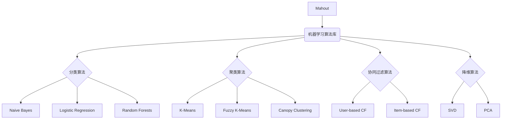

# Mahout原理与代码实例讲解

## 1. 背景介绍

### 1.1 问题的由来

在当今大数据时代，海量的数据被不断地产生和积累。如何从这些庞大的数据中发现有价值的信息和知识,成为了一个亟待解决的问题。传统的数据处理和分析方法已经无法满足大数据带来的挑战,因此迫切需要新的技术和工具来应对这一挑战。

### 1.2 研究现状

大数据分析技术的发展为解决上述问题提供了新的思路和方法。其中,Apache Mahout作为一个专注于大数据机器学习的开源项目,为大数据环境下的数据挖掘和机器学习提供了强大的支持。Mahout项目提供了一系列可扩展的机器学习算法库,涵盖了聚类、分类、协同过滤、降维等多种算法,可以在Apache Hadoop等分布式计算框架上高效运行。

### 1.3 研究意义

深入理解Mahout的原理和实现机制,对于掌握大数据机器学习技术具有重要意义。本文将全面介绍Mahout的核心概念、算法原理、数学模型,并通过代码实例详细解释其实现细节,旨在帮助读者掌握Mahout的使用方法,并深入了解其内在机制。同时,本文还将探讨Mahout在实际应用场景中的应用,以及未来发展趋势和面临的挑战。

### 1.4 本文结构

本文共分为九个部分:

1. 背景介绍
2. 核心概念与联系
3. 核心算法原理与具体操作步骤
4. 数学模型和公式详细讲解与举例说明
5. 项目实践:代码实例和详细解释说明
6. 实际应用场景
7. 工具和资源推荐
8. 总结:未来发展趋势与挑战
9. 附录:常见问题与解答

## 2. 核心概念与联系

在深入探讨Mahout的算法原理和实现细节之前,我们先来了解一些核心概念及其相互关系。

如上图所示,Mahout作为一个机器学习算法库,提供了多种常用的机器学习算法,包括:

- **分类算法**:用于根据输入数据的特征对其进行分类,常见的分类算法有朴素贝叶斯(Naive Bayes)、逻辑回归(Logistic Regression)和随机森林(Random Forests)等。
- **聚类算法**:用于将相似的数据对象划分为同一个簇,常见的聚类算法有K-Means、Fuzzy K-Means和Canopy Clustering等。
- **协同过滤算法**:常用于推荐系统,根据用户对物品的偏好来预测用户可能喜欢的其他物品,包括基于用户(User-based CF)和基于物品(Item-based CF)的协同过滤算法。
- **降维算法**:用于将高维数据映射到低维空间,以降低数据维度和复杂度,常见的降维算法有奇异值分解(SVD)和主成分分析(PCA)等。

这些算法相互关联,共同构成了Mahout的核心功能。下面我们将详细介绍其中一些算法的原理和实现细节。

## 3. 核心算法原理与具体操作步骤

### 3.1 算法原理概述

在这一部分,我们将重点介绍Mahout中两种核心算法的原理:K-Means聚类算法和基于物品的协同过滤算法(Item-based Collaborative Filtering)。

#### K-Means聚类算法

K-Means是一种广泛使用的无监督学习算法,用于将数据集划分为K个互不相交的簇。算法的目标是找到一种簇划分,使得簇内数据点之间的距离尽可能小,而簇间数据点之间的距离尽可能大。

算法的基本思想是:

1. 随机选取K个初始质心(centroid)
2. 将每个数据点分配到最近的质心所对应的簇
3. 重新计算每个簇的质心
4. 重复步骤2和3,直到质心不再发生变化或达到最大迭代次数

通过不断迭代,算法会收敛到一个局部最优解,使得目标函数(簇内平方和)最小化。

#### 基于物品的协同过滤算法

协同过滤是推荐系统中常用的一种技术,其基本思想是:对于一个给定的用户,根据其对某些物品的偏好,预测该用户对其他物品的可能偏好。基于物品的协同过滤算法是协同过滤的一种实现方式,它通过计算物品之间的相似度,为用户推荐与其历史偏好物品相似的其他物品。

算法的主要步骤如下:

1. 计算物品之间的相似度
2. 对于每个用户,根据其历史偏好物品和物品相似度,计算该用户对其他物品的可能偏好分数
3. 根据偏好分数,为用户推荐最匹配的物品

常用的物品相似度计算方法包括余弦相似度、皮尔逊相关系数等。

### 3.2 算法步骤详解

接下来,我们将更加详细地解释上述两种算法的具体实现步骤。

#### K-Means聚类算法步骤

1. **初始化K个质心**

   随机选取K个数据点作为初始质心。

2. **计算数据点到各个质心的距离**

   对于每个数据点,计算它与K个质心的距离,通常使用欧几里得距离:

   $$d(x, c) = \sqrt{\sum_{i=1}^{n}(x_i - c_i)^2}$$

   其中,x是数据点,c是质心,n是数据的维度。

3. **将数据点分配到最近的簇**

   将每个数据点分配到距离最近的质心所对应的簇。

4. **重新计算每个簇的质心**

   对于每个簇,重新计算其质心,即簇内所有数据点的均值:

   $$c_j = \frac{1}{|C_j|}\sum_{x \in C_j}x$$

   其中,j是簇的编号,C_j是第j个簇,|C_j|是簇内数据点的个数。

5. **判断是否收敛**

   比较新旧质心的变化,如果变化小于阈值或达到最大迭代次数,则算法收敛,否则返回步骤2,继续迭代。

6. **输出最终簇划分结果**

算法的时间复杂度为O(nktI),其中n是数据点个数,k是簇数,t是数据维度,I是迭代次数。

#### 基于物品的协同过滤算法步骤

1. **构建用户-物品评分矩阵**

   根据用户对物品的历史评分数据,构建一个用户-物品评分矩阵。

2. **计算物品相似度**

   对于每对物品i和j,计算它们之间的相似度sim(i,j)。常用的相似度计算方法包括:

   - **余弦相似度**:

     $$\text{sim}(i, j) = \cos(\vec{i}, \vec{j}) = \frac{\vec{i} \cdot \vec{j}}{|\vec{i}||\vec{j}|}$$

     其中,i和j是物品对应的评分向量。

   - **皮尔逊相关系数**:

     $$\text{sim}(i, j) = \frac{\sum_{u \in U}(r_{ui} - \overline{r_i})(r_{uj} - \overline{r_j})}{\sqrt{\sum_{u \in U}(r_{ui} - \overline{r_i})^2\sum_{u \in U}(r_{uj} - \overline{r_j})^2}}$$

     其中,U是评分过物品i和j的用户集合,r_ui是用户u对物品i的评分,\overline{r_i}是物品i的平均评分。

3. **为用户生成推荐列表**

   对于每个用户u,根据其历史评分过的物品和物品相似度,计算该用户对其他物品的可能偏好分数:

   $$p_{ui} = \overline{r_u} + \frac{\sum_{j \in I}(r_{uj} - \overline{r_j})\text{sim}(i, j)}{\sum_{j \in I}|\text{sim}(i, j)|}$$

   其中,I是用户u评分过的物品集合,\overline{r_u}是用户u的平均评分。

   根据偏好分数p_ui从高到低排序,选取前N个物品作为推荐列表。

算法的时间复杂度主要取决于相似度计算和偏好分数计算,通常为O(mn^2 + kn),其中m是用户数,n是物品数,k是推荐列表长度。

### 3.3 算法优缺点

#### K-Means聚类算法

**优点**:

- 算法简单,容易理解和实现
- 可以有效处理大规模数据集
- 对初始质心不太敏感,通常可以收敛到较好的聚类结果

**缺点**:

- 需要预先指定簇数K,对结果有很大影响
- 对噪声和异常值敏感
- 无法有效处理非凸形状的簇
- 可能收敛到局部最优解

#### 基于物品的协同过滤算法

**优点**:

- 可以有效解决数据稀疏问题
- 计算简单,可扩展性好
- 能够提供个性化推荐

**缺点**:

- 无法推荐新物品(冷启动问题)
- 推荐列表过于相似,缺乏多样性
- 难以解释推荐原因
- 对评分数据的质量和分布敏感

### 3.4 算法应用领域

K-Means聚类算法和协同过滤算法在多个领域都有广泛的应用:

- **客户细分与目标营销**:通过K-Means算法对客户数据进行聚类,可以发现具有相似特征的客户群体,从而制定有针对性的营销策略。
- **图像分割与计算机视觉**:K-Means算法可用于图像分割,将像素点划分为不同的簇,每个簇对应一个物体或区域。
- **推荐系统**:协同过滤算法是推荐系统中最常用的技术之一,可以为用户推荐感兴趣的物品,如电影、音乐、新闻等。
- **信息检索与网页排名**:协同过滤算法也可应用于信息检索领域,根据用户的浏览历史推荐相关网页。
- **基因组学与生物信息学**:K-Means算法可用于基因表达数据的聚类分析,发现具有相似表达模式的基因组。

## 4. 数学模型和公式详细讲解与举例说明

在上一部分,我们介绍了K-Means聚类算法和基于物品的协同过滤算法的原理和步骤。这两种算法都涉及到一些数学模型和公式,下面我们将对其进行详细的讲解和举例说明。

### 4.1 数学模型构建

#### K-Means聚类算法模型

K-Means聚类算法的目标是最小化所有数据点到其所属簇质心的距离平方和,即最小化目标函数:

$$J = \sum_{i=1}^{k}\sum_{x \in C_i}||x - \mu_i||^2$$

其中,k是簇数,C_i是第i个簇,\mu_i是第i个簇的质心,||x - \mu_i||是数据点x到质心\mu_i的距离。

通过不断迭代更新簇划分和质心位置,算法试图找到一个最优解,使目标函数J最小。

#### 协同过滤算法模型

协同过滤算法的核心是计算物品之间的相似度,并基于相似度预测用户对未评分物品的可能偏好分数。

对于基于物品的协同过滤算法,我们可以构建如下模型:

$$\hat{r}_{ui} = \overline{r_u} + \frac{\sum_{j \in I}(r_{uj} - \