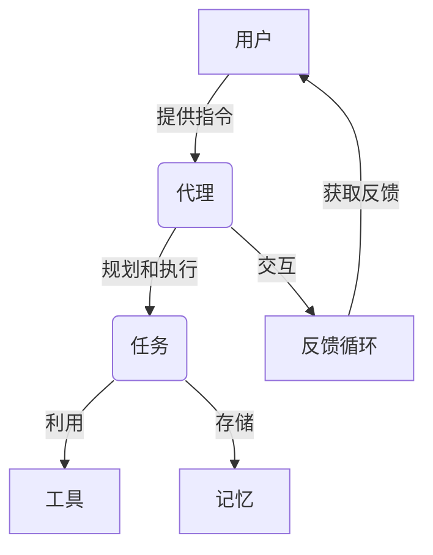
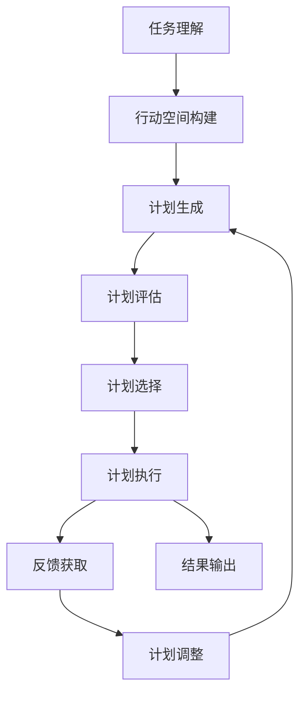

以下是标题为《实战四：手把手带你实现网红项目 Auto-GPT》的技术博客文章正文内容：

# 实战四：手把手带你实现网红项目 Auto-GPT

## 1. 背景介绍

### 1.1 问题的由来

在当今的人工智能时代，大型语言模型(LLM)的出现为我们带来了全新的体验和可能性。然而,这些模型的能力往往被限制在特定的任务中,无法完全发挥其潜力。为了解决这一问题,Auto-GPT应运而生。

### 1.2 研究现状

Auto-GPT是一个开源的人工智能代理系统,旨在利用大型语言模型的强大能力来自主完成各种任务。它可以根据用户的指令,自主规划和执行任务,并在必要时与用户进行交互以获取反馈。目前,Auto-GPT已经在GitHub上获得了超过2万颗星,引起了广泛关注。

### 1.3 研究意义

Auto-GPT的出现,标志着人工智能系统向着更加自主、智能和通用的方向发展。它不仅可以用于自动化任务执行,还可以作为一个强大的辅助工具,协助人类完成各种复杂的工作。同时,Auto-GPT也为人工智能系统的研究和开发提供了新的思路和方向。

### 1.4 本文结构

本文将从以下几个方面详细介绍Auto-GPT:

1. 核心概念与联系
2. 核心算法原理及具体操作步骤
3. 数学模型和公式详细讲解及举例说明
4. 项目实践:代码实例和详细解释说明
5. 实际应用场景
6. 工具和资源推荐
7. 总结:未来发展趋势与挑战
8. 附录:常见问题与解答

## 2. 核心概念与联系

Auto-GPT的核心概念包括:

1. **代理(Agent)**: 代理是Auto-GPT的核心组件,负责接收用户的指令,规划和执行任务。它基于大型语言模型构建,具有强大的自然语言理解和生成能力。

2. **任务(Task)**: 任务是代理需要完成的具体工作,可以是简单的问答,也可以是复杂的项目开发或研究工作。

3. **工具(Tool)**: 工具是代理执行任务所需的辅助程序或资源,如搜索引擎、代码编辑器、API等。

4. **记忆(Memory)**: 记忆用于存储代理在执行任务过程中的上下文信息、中间结果等,以供后续使用。

5. **反馈循环(Feedback Loop)**: 代理可以根据任务的进展情况,与用户进行交互,获取反馈并调整执行策略。

这些核心概念相互关联,共同构建了Auto-GPT的智能代理系统。代理利用大型语言模型的能力,结合工具和记忆,自主规划和执行任务,并通过反馈循环与用户进行交互,不断优化和完善自身的行为。

## 3. 核心算法原理及具体操作步骤

### 3.1 算法原理概述

Auto-GPT的核心算法基于**启发式搜索**和**反馈循环**。代理根据用户的指令,生成一系列可能的行动计划,然后评估每个计划的效用,选择最优计划执行。在执行过程中,代理会根据任务进展情况与用户进行交互,获取反馈并调整行动策略。

### 3.2 算法步骤详解

Auto-GPT的算法可分为以下几个主要步骤:

1. **任务理解**: 代理利用自然语言理解能力,分析用户的指令,提取出任务目标、约束条件等关键信息。

2. **行动空间构建**: 根据任务信息,代理构建一个可能的行动空间,包括可用的工具、API等资源。

3. **计划生成**: 代理使用启发式搜索算法,在行动空间中生成多个可能的行动计划。

4. **计划评估**: 对每个计划进行效用评估,考虑因素包括计划的成本、风险、完成度等。

5. **计划选择**: 选择效用最高的计划执行。

6. **计划执行**: 执行选定的计划,利用工具和API完成各个子任务。

7. **反馈获取**: 在执行过程中,代理与用户进行交互,获取反馈信息。

8. **计划调整**: 根据反馈,代理调整行动策略,重新生成和评估计划。

9. **结果输出**: 当任务完成或无法继续时,代理输出最终结果。

该算法通过反复迭代,不断优化行动计划,直至完成任务或达到终止条件。

### 3.3 算法优缺点

**优点**:

- 具有强大的自主性和通用性,可以应对各种复杂任务。
- 利用反馈循环,能够不断优化和调整策略。
- 基于大型语言模型,具备出色的自然语言理解和生成能力。

**缺点**:

- 计算代价较高,需要大量的计算资源。
- 存在一定的不确定性和风险,计划的执行结果可能与预期不符。
- 对于一些特殊领域的任务,可能需要额外的领域知识支持。

### 3.4 算法应用领域

Auto-GPT的算法具有广泛的应用前景,包括但不限于:

- 自动化任务执行:如数据处理、文件操作、网页抓取等。
- 智能助手:为用户提供个性化的助理服务。
- 项目开发:协助完成软件开发、研究项目等复杂任务。
- 教育辅助:作为教师和学生的智能辅助工具。
- 科研助手:辅助科研人员进行文献检索、实验设计等工作。

## 4. 数学模型和公式及详细讲解及举例说明

### 4.1 数学模型构建

在Auto-GPT的算法中,我们需要对行动计划的效用进行评估,以便选择最优计划执行。为此,我们构建了一个基于多属性效用理论(MAUT)的数学模型。

设计一个行动计划$a$的效用函数为:

$$U(a) = \sum_{i=1}^{n}w_i u_i(a)$$

其中:
- $n$为考虑的属性数量
- $w_i$为第$i$个属性的权重,满足$\sum_{i=1}^{n}w_i=1$
- $u_i(a)$为第$i$个属性对于行动计划$a$的单属性效用函数

通常考虑的属性包括:成本、风险、完成度、时间等。每个属性的单属性效用函数需要根据具体情况定义。

例如,对于成本属性,我们可以定义单属性效用函数为:

$$u_{\text{cost}}(a) = 1 - \frac{\text{cost}(a)}{\text{max\_cost}}$$

其中$\text{cost}(a)$为行动计划$a$的预计成本,$\text{max\_cost}$为可接受的最大成本。

### 4.2 公式推导过程

我们将行动计划的效用$U(a)$建模为各属性单属性效用的加权和,其推导过程如下:

1) 首先,我们假设各属性之间是相互独立的,即一个属性的效用不受其他属性的影响。

2) 根据效用理论,如果存在一个效用函数$U$,使得对于任意两个行动计划$a$和$b$,当且仅当$U(a) \geq U(b)$时,$a$被偏好于$b$,则$U$就是一个合理的效用函数。

3) 我们进一步假设,效用函数$U$应当是各属性单属性效用的某种组合,即:

$$U(a) = f(u_1(a), u_2(a), \cdots, u_n(a))$$

4) 为了满足效用函数的单调性,我们要求$f$是单调不减的。

5) 另外,如果对所有属性,$a$的单属性效用都不小于$b$,那么$a$应当被偏好于$b$,即:

$$\forall i, u_i(a) \geq u_i(b) \Rightarrow U(a) \geq U(b)$$

6) 根据函数$f$的单调性和上述条件,可以证明$f$必须是单属性效用的加权和,即:

$$U(a) = \sum_{i=1}^{n}w_i u_i(a)$$

其中$w_i \geq 0$且$\sum_{i=1}^{n}w_i=1$。

通过这一推导过程,我们得到了行动计划效用的数学模型公式。

### 4.3 案例分析与讲解

假设我们需要为一个网站开发任务选择最优的行动计划。考虑的属性包括:成本、风险、完成度和时间,权重分别为$w_1=0.3, w_2=0.2, w_3=0.4, w_4=0.1$。

对于三个可选的行动计划$a_1$、$a_2$和$a_3$,各属性的单属性效用值如下:

|  计划   | 成本效用 | 风险效用 | 完成度效用 | 时间效用 |
|:-------:|:--------:|:--------:|:-----------:|:--------:|
| $a_1$   |   0.8    |   0.7    |     0.9     |   0.6    |
| $a_2$   |   0.6    |   0.9    |     0.8     |   0.7    |
| $a_3$   |   0.7    |   0.6    |     0.7     |   0.9    |

根据效用模型公式,我们可以计算出每个行动计划的综合效用:

$$\begin{aligned}
U(a_1) &= 0.3 \times 0.8 + 0.2 \times 0.7 + 0.4 \times 0.9 + 0.1 \times 0.6 = 0.81 \
U(a_2) &= 0.3 \times 0.6 + 0.2 \times 0.9 + 0.4 \times 0.8 + 0.1 \times 0.7 = 0.75 \
U(a_3) &= 0.3 \times 0.7 + 0.2 \times 0.6 + 0.4 \times 0.7 + 0.1 \times 0.9 = 0.69
\end{aligned}$$

因此,在这个案例中,行动计划$a_1$具有最高的综合效用,应当被选择执行。

### 4.4 常见问题解答

**Q: 为什么要使用加权和的形式,而不是其他组合方式?**

A: 加权和的形式满足了效用理论中的一些基本公理,如单调性、确定性等,因此是一种合理的效用函数形式。其他形式,如乘积形式,可能无法满足这些公理。

**Q: 如何确定各属性的权重?**

A: 属性权重的确定需要根据具体任务的重要性来设置。通常可以采用主观赋权或客观赋权(如熵权法)的方式。也可以根据实际情况,动态调整权重。

**Q: 对于一些难以量化的属性,如何定义单属性效用函数?**

A: 对于难以量化的属性,我们可以采用模糊效用理论或其他主观评估方法,将其量化为效用值。也可以尝试使用机器学习等技术,从历史数据中学习效用函数。

## 5. 项目实践:代码实例和详细解释说明

### 5.1 开发环境搭建

Auto-GPT是一个Python项目,因此我们需要首先安装Python环境。推荐使用Python版本3.9或更高。

另外,Auto-GPT还依赖于多个第三方Python库,如OpenAI的GPT语言模型、Google的火焰引擎等。我们可以使用pip或conda等包管理工具安装这些依赖库。

完整的环境搭建步骤如下:

1. 安装Python
2. 创建并激活虚拟环境
3. 安装依赖