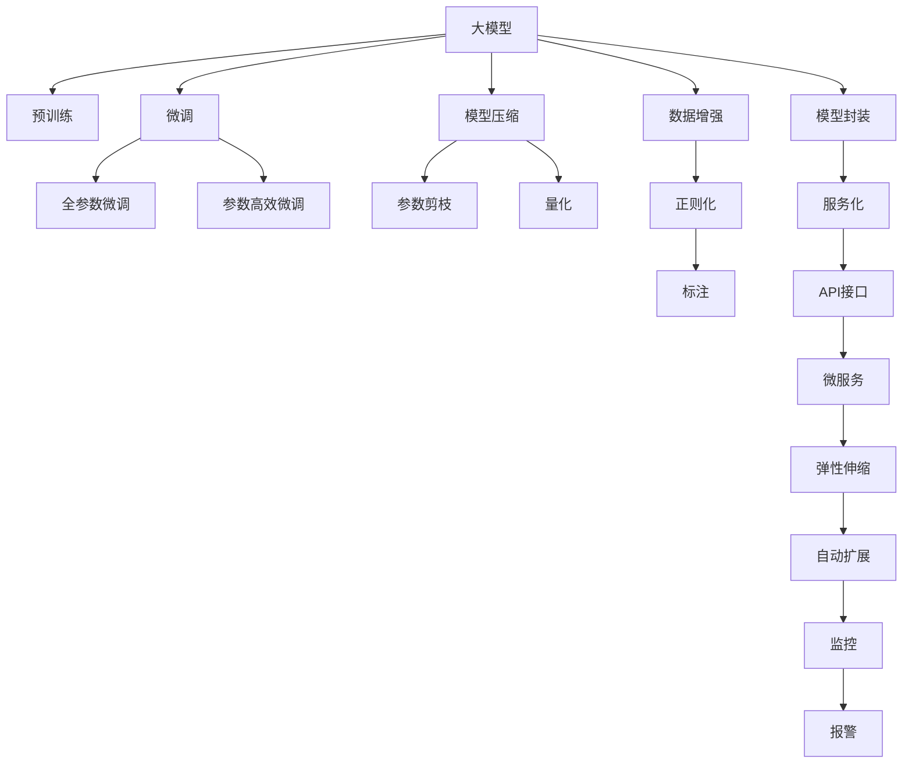
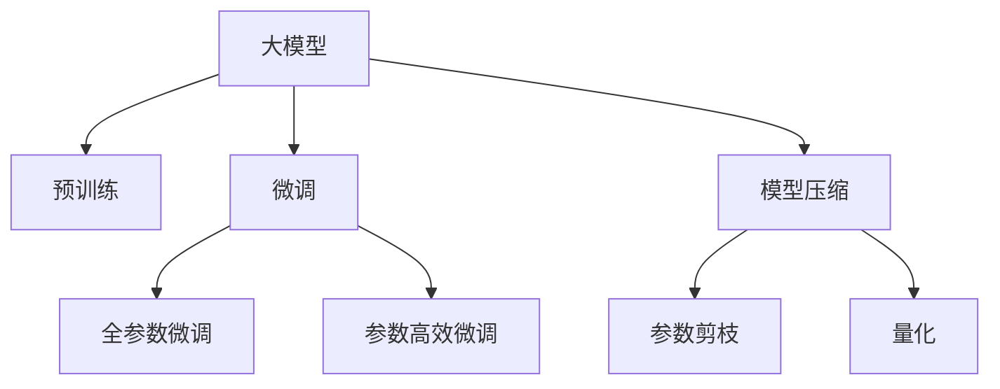
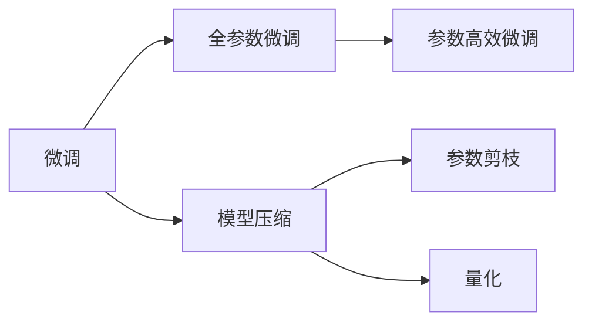
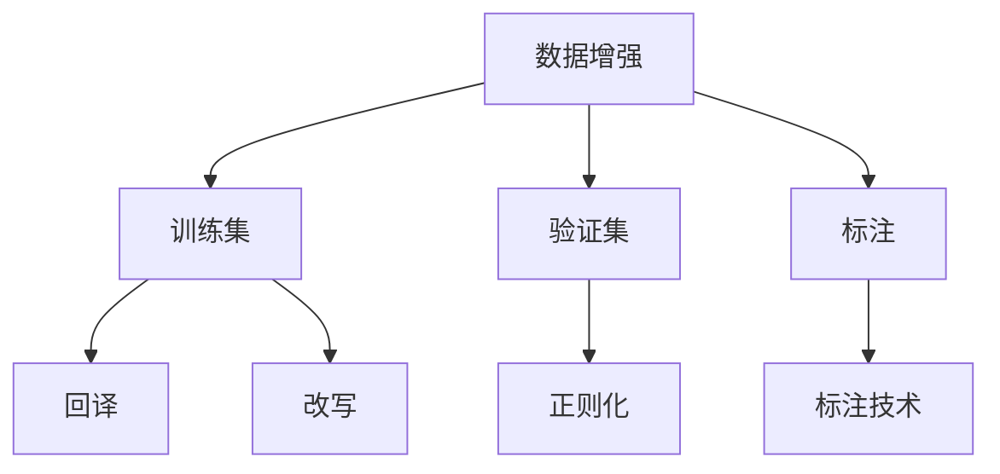
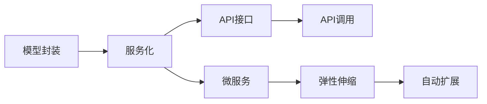
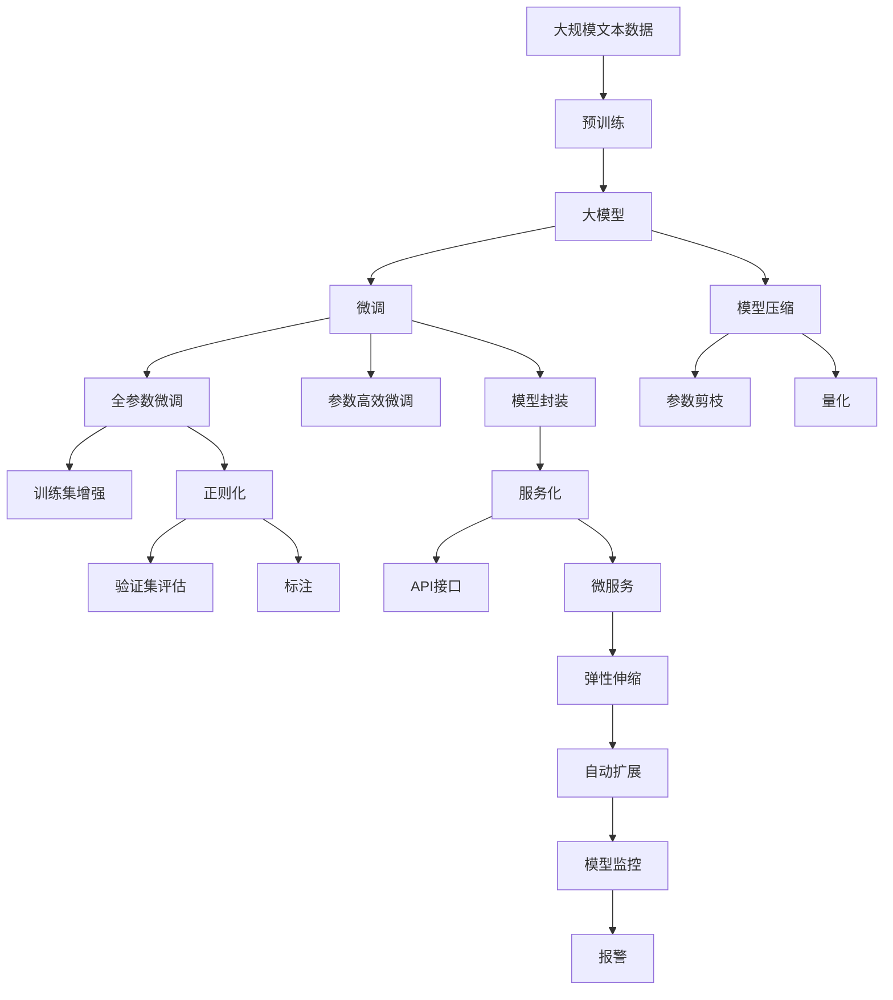

                 

# 大模型应用开发的技术细节

> 关键词：大模型, 应用开发, 技术细节, 算法原理, 模型优化, 数据处理, 部署流程, 学习资源

## 1. 背景介绍

### 1.1 问题由来

近年来，深度学习技术和大规模预训练模型（大模型）在自然语言处理（NLP）、计算机视觉（CV）、语音识别（ASR）等众多领域取得了显著的进展。其中，大型预训练语言模型（如GPT、BERT）已经在多个任务上实现了最先进的性能。

然而，大模型应用面临的技术挑战仍然存在：

- **资源需求**：大模型通常需要大量的计算资源和内存，对硬件的要求较高。
- **性能调优**：大模型的性能依赖于适当的超参数设置和优化技术。
- **数据处理**：需要有效的数据预处理技术，以提高模型训练和推理的效率。
- **模型部署**：将模型集成到生产环境，需要考虑模型的优化、封装、服务化等问题。

本文将详细探讨大模型应用开发的技术细节，涵盖算法原理、模型优化、数据处理、部署流程等方面，以帮助开发者更高效地构建和部署大模型应用。

### 1.2 问题核心关键点

大模型应用开发的核心关键点包括：

- **算法原理**：理解大模型的基本原理，包括预训练和微调过程。
- **模型优化**：掌握模型压缩、剪枝、量化等优化技术，提升模型性能。
- **数据处理**：学习数据增强、正则化、标注技术等，提高数据质量。
- **部署流程**：掌握模型封装、服务化、监控等部署技术，确保模型在生产环境中的稳定运行。

## 2. 核心概念与联系

### 2.1 核心概念概述

为了更好地理解大模型应用开发的技术细节，本节将介绍几个关键的概念：

- **大模型**：以自回归（如GPT）或自编码（如BERT）模型为代表的预训练模型。通过在大规模无标签数据上进行预训练，学习到通用的语言表示。
- **微调**：在预训练模型的基础上，使用下游任务的少量标注数据，通过有监督学习优化模型在特定任务上的性能。
- **模型压缩**：通过参数剪枝、量化、蒸馏等技术，减小模型的规模，提升模型的推理速度和资源利用率。
- **数据增强**：通过对训练样本进行改写、回译、随机化等方式，增加训练集的多样性，提高模型的泛化能力。
- **模型封装**：将模型封装为服务或API接口，便于集成调用。
- **服务化**：将模型部署到云平台或微服务架构中，实现弹性伸缩和自动扩展。
- **模型监控**：通过监控工具和指标，实时监测模型性能和系统健康状态，及时发现和解决问题。

这些核心概念之间的联系可以通过以下Mermaid流程图来展示：



这个流程图展示了大模型应用开发中的核心概念及其相互关系：

1. 大模型通过预训练获得基础能力。
2. 微调是对预训练模型进行任务特定的优化。
3. 模型压缩技术减小模型规模。
4. 数据增强和正则化技术提高模型泛化能力。
5. 模型封装和服务化为部署提供支持。
6. 弹性伸缩和自动扩展确保服务性能。
7. 模型监控及时发现和解决系统问题。

这些概念共同构成了大模型应用开发的完整框架，使开发者能够系统地构建和部署高效、稳定的模型应用。

### 2.2 概念间的关系

这些核心概念之间存在着紧密的联系，形成了大模型应用开发的全过程。以下通过几个Mermaid流程图来展示这些概念之间的关系。

#### 2.2.1 大模型的学习范式



这个流程图展示了大模型的学习范式，包括预训练、微调、模型压缩等过程。

#### 2.2.2 微调与模型压缩的关系



这个流程图展示了微调与模型压缩的相互关系，即微调后的模型可以进一步进行参数剪枝和量化优化。

#### 2.2.3 数据增强在微调中的应用



这个流程图展示了数据增强在微调中的应用，包括训练集增强、验证集评估和标注技术等。

#### 2.2.4 模型封装与服务化的关系



这个流程图展示了模型封装与服务化的相互关系，即封装后的模型可以通过API接口进行调用，并支持弹性伸缩和自动扩展。

### 2.3 核心概念的整体架构

最后，我们用一个综合的流程图来展示这些核心概念在大模型应用开发过程中的整体架构：



这个综合流程图展示了从预训练到模型压缩、微调、封装、服务化、弹性伸缩、监控等完整过程。大模型应用开发涉及多个环节，需要在每个环节进行优化，才能得到理想的效果。

## 3. 核心算法原理 & 具体操作步骤

### 3.1 算法原理概述

大模型应用开发的核心算法原理主要涉及以下几个方面：

- **预训练**：在大规模无标签数据上进行自监督学习，学习到通用的语言表示。
- **微调**：在预训练模型的基础上，使用下游任务的少量标注数据，通过有监督学习优化模型在特定任务上的性能。
- **模型压缩**：通过参数剪枝、量化等技术，减小模型规模，提升模型推理速度和资源利用率。
- **数据增强**：通过对训练样本进行改写、回译、随机化等方式，增加训练集的多样性，提高模型泛化能力。
- **模型封装**：将模型封装为服务或API接口，便于集成调用。
- **服务化**：将模型部署到云平台或微服务架构中，实现弹性伸缩和自动扩展。
- **模型监控**：通过监控工具和指标，实时监测模型性能和系统健康状态，及时发现和解决问题。

### 3.2 算法步骤详解

以下将详细介绍大模型应用开发的各个步骤：

**Step 1: 准备预训练模型和数据集**

- 选择合适的预训练语言模型（如BERT、GPT）作为初始化参数。
- 准备下游任务的数据集，划分为训练集、验证集和测试集。

**Step 2: 模型压缩**

- 对预训练模型进行参数剪枝，去除冗余参数。
- 使用量化技术，将模型参数转换为低精度格式，如float16、int8等。

**Step 3: 微调**

- 在预训练模型的基础上，添加任务适配层，如线性分类器、解码器等。
- 使用下游任务的少量标注数据，通过有监督学习优化模型在特定任务上的性能。

**Step 4: 数据增强**

- 对训练集数据进行改写、回译、随机化等处理，增加训练集的多样性。
- 使用正则化技术，如L2正则、Dropout等，防止模型过拟合。

**Step 5: 模型封装**

- 将微调后的模型封装为服务或API接口，便于集成调用。
- 使用模型框架（如TensorFlow、PyTorch）进行封装，支持模型保存、加载、推理等功能。

**Step 6: 服务化**

- 将模型部署到云平台或微服务架构中，实现弹性伸缩和自动扩展。
- 使用云平台（如AWS、Google Cloud）提供的服务，如EC2、GKE、Fargate等，进行模型部署。

**Step 7: 模型监控**

- 实时监测模型性能和系统健康状态，使用监控工具（如Prometheus、Grafana）进行监控。
- 设置报警阈值，及时发现和解决问题。

### 3.3 算法优缺点

大模型应用开发具有以下优点：

- **性能优越**：利用预训练模型的通用语言表示，可以显著提升模型在特定任务上的性能。
- **灵活性高**：可以根据具体任务和数据特点，灵活选择模型压缩、微调、数据增强等技术。
- **可扩展性**：通过模型封装和服务化，可以实现模型的弹性伸缩和自动扩展。

同时，也存在一些缺点：

- **资源需求高**：大模型通常需要大量的计算资源和内存，对硬件的要求较高。
- **复杂度高**：涉及预训练、微调、模型压缩、数据增强等多个环节，开发过程较为复杂。
- **调试难度大**：模型参数众多，调试过程较为繁琐，容易出现各种问题。

### 3.4 算法应用领域

大模型应用开发在NLP、CV、ASR等多个领域都有广泛的应用：

- **自然语言处理**：命名实体识别、情感分析、机器翻译、问答系统等。
- **计算机视觉**：图像分类、目标检测、图像生成、图像分割等。
- **语音识别**：自动语音识别、语音合成、语音情感分析等。

## 4. 数学模型和公式 & 详细讲解 & 举例说明

### 4.1 数学模型构建

本节将使用数学语言对大模型应用开发的各个步骤进行严格刻画。

记预训练语言模型为 $M_{\theta}$，其中 $\theta$ 为预训练得到的模型参数。假设微调任务的训练集为 $D=\{(x_i,y_i)\}_{i=1}^N$，$x_i$ 为输入样本，$y_i$ 为标签。

定义模型 $M_{\theta}$ 在输入 $x$ 上的输出为 $\hat{y}=M_{\theta}(x)$。

### 4.2 公式推导过程

以下将详细介绍各个步骤的数学推导过程。

**Step 1: 准备预训练模型和数据集**

- **预训练模型**：在无标签数据集上自监督学习，得到模型参数 $\theta$。
- **数据集**：准备下游任务的标注数据集 $D$，划分为训练集、验证集和测试集。

**Step 2: 模型压缩**

- **参数剪枝**：去除模型中冗余的参数，减少模型规模。
- **量化**：将模型参数转换为低精度格式，如float16、int8等。

**Step 3: 微调**

- **全参数微调**：在预训练模型的基础上，使用下游任务的少量标注数据，通过有监督学习优化模型在特定任务上的性能。
- **损失函数**：定义损失函数 $L$，衡量模型预测输出与真实标签之间的差异。
- **优化器**：使用优化器（如Adam、SGD等），根据损失函数更新模型参数 $\theta$。

**Step 4: 数据增强**

- **数据增强技术**：对训练集数据进行改写、回译、随机化等处理，增加训练集的多样性。
- **正则化技术**：使用L2正则、Dropout等技术，防止模型过拟合。

**Step 5: 模型封装**

- **模型封装**：将微调后的模型封装为服务或API接口，便于集成调用。
- **模型框架**：使用模型框架（如TensorFlow、PyTorch）进行封装，支持模型保存、加载、推理等功能。

**Step 6: 服务化**

- **云平台**：将模型部署到云平台或微服务架构中，实现弹性伸缩和自动扩展。
- **服务框架**：使用服务框架（如Docker、Kubernetes）进行容器化和部署。

**Step 7: 模型监控**

- **监控工具**：实时监测模型性能和系统健康状态，使用监控工具（如Prometheus、Grafana）进行监控。
- **报警阈值**：设置报警阈值，及时发现和解决问题。

### 4.3 案例分析与讲解

下面以命名实体识别（NER）任务为例，详细讲解大模型应用开发的各个步骤：

#### 4.3.1 预训练模型选择

选择一个预训练语言模型作为初始化参数，如BERT、GPT等。

#### 4.3.2 数据集准备

准备下游任务的标注数据集 $D$，划分为训练集、验证集和测试集。

#### 4.3.3 微调

在预训练模型的基础上，添加任务适配层，如线性分类器、解码器等。

#### 4.3.4 模型压缩

对预训练模型进行参数剪枝，去除冗余参数。使用量化技术，将模型参数转换为低精度格式，如float16、int8等。

#### 4.3.5 数据增强

对训练集数据进行改写、回译、随机化等处理，增加训练集的多样性。使用正则化技术，如L2正则、Dropout等，防止模型过拟合。

#### 4.3.6 模型封装

将微调后的模型封装为服务或API接口，便于集成调用。使用模型框架（如TensorFlow、PyTorch）进行封装，支持模型保存、加载、推理等功能。

#### 4.3.7 服务化

将模型部署到云平台或微服务架构中，实现弹性伸缩和自动扩展。使用云平台（如AWS、Google Cloud）提供的服务，如EC2、GKE、Fargate等，进行模型部署。

#### 4.3.8 模型监控

实时监测模型性能和系统健康状态，使用监控工具（如Prometheus、Grafana）进行监控。设置报警阈值，及时发现和解决问题。

## 5. 项目实践：代码实例和详细解释说明

### 5.1 开发环境搭建

在进行大模型应用开发前，我们需要准备好开发环境。以下是使用Python进行PyTorch开发的环境配置流程：

1. 安装Anaconda：从官网下载并安装Anaconda，用于创建独立的Python环境。

2. 创建并激活虚拟环境：
```bash
conda create -n pytorch-env python=3.8 
conda activate pytorch-env
```

3. 安装PyTorch：根据CUDA版本，从官网获取对应的安装命令。例如：
```bash
conda install pytorch torchvision torchaudio cudatoolkit=11.1 -c pytorch -c conda-forge
```

4. 安装Transformers库：
```bash
pip install transformers
```

5. 安装各类工具包：
```bash
pip install numpy pandas scikit-learn matplotlib tqdm jupyter notebook ipython
```

完成上述步骤后，即可在`pytorch-env`环境中开始大模型应用开发。

### 5.2 源代码详细实现

这里以命名实体识别（NER）任务为例，给出使用Transformers库对BERT模型进行微调的PyTorch代码实现。

首先，定义NER任务的数据处理函数：

```python
from transformers import BertTokenizer
from torch.utils.data import Dataset
import torch

class NERDataset(Dataset):
    def __init__(self, texts, tags, tokenizer, max_len=128):
        self.texts = texts
        self.tags = tags
        self.tokenizer = tokenizer
        self.max_len = max_len
        
    def __len__(self):
        return len(self.texts)
    
    def __getitem__(self, item):
        text = self.texts[item]
        tags = self.tags[item]
        
        encoding = self.tokenizer(text, return_tensors='pt', max_length=self.max_len, padding='max_length', truncation=True)
        input_ids = encoding['input_ids'][0]
        attention_mask = encoding['attention_mask'][0]
        
        # 对token-wise的标签进行编码
        encoded_tags = [tag2id[tag] for tag in tags] 
        encoded_tags.extend([tag2id['O']] * (self.max_len - len(encoded_tags)))
        labels = torch.tensor(encoded_tags, dtype=torch.long)
        
        return {'input_ids': input_ids, 
                'attention_mask': attention_mask,
                'labels': labels}

# 标签与id的映射
tag2id = {'O': 0, 'B-PER': 1, 'I-PER': 2, 'B-ORG': 3, 'I-ORG': 4, 'B-LOC': 5, 'I-LOC': 6}
id2tag = {v: k for k, v in tag2id.items()}

# 创建dataset
tokenizer = BertTokenizer.from_pretrained('bert-base-cased')

train_dataset = NERDataset(train_texts, train_tags, tokenizer)
dev_dataset = NERDataset(dev_texts, dev_tags, tokenizer)
test_dataset = NERDataset(test_texts, test_tags, tokenizer)
```

然后，定义模型和优化器：

```python
from transformers import BertForTokenClassification, AdamW

model = BertForTokenClassification.from_pretrained('bert-base-cased', num_labels=len(tag2id))

optimizer = AdamW(model.parameters(), lr=2e-5)
```

接着，定义训练和评估函数：

```python
from torch.utils.data import DataLoader
from tqdm import tqdm
from sklearn.metrics import classification_report

device = torch.device('cuda') if torch.cuda.is_available() else torch.device('cpu')
model.to(device)

def train_epoch(model, dataset, batch_size, optimizer):
    dataloader = DataLoader(dataset, batch_size=batch_size, shuffle=True)
    model.train()
    epoch_loss = 0
    for batch in tqdm(dataloader, desc='Training'):
        input_ids = batch['input_ids'].to(device)
        attention_mask = batch['attention_mask'].to(device)
        labels = batch['labels'].to(device)
        model.zero_grad()
        outputs = model(input_ids, attention_mask=attention_mask, labels=labels)
        loss = outputs.loss
        epoch_loss += loss.item()
        loss.backward()
        optimizer.step()
    return epoch_loss / len(dataloader)

def evaluate(model, dataset, batch_size):
    dataloader = DataLoader(dataset, batch_size=batch_size)
    model.eval()
    preds, labels = [], []
    with torch.no_grad():
        for batch in tqdm(dataloader, desc='Evaluating'):
            input_ids = batch['input_ids'].to(device)
            attention_mask = batch['attention_mask'].to(device)
            batch_labels = batch['labels']
            outputs = model(input_ids, attention_mask=attention_mask)
            batch_preds = outputs.logits.argmax(dim=2).to('cpu').tolist()
            batch_labels = batch_labels.to('cpu').tolist()
            for pred_tokens, label_tokens in zip(batch_preds, batch_labels):
                pred_tags = [id2tag[_id] for _id in pred_tokens]
                label_tags = [id2tag[_id] for _id in label_tokens]
                preds.append(pred_tags[:len(label_tags)])
                labels.append(label_tags)
                
    print(classification_report(labels, preds))
```

最后，启动训练流程并在测试集上评估：

```python
epochs = 5
batch_size = 16

for epoch in range(epochs):
    loss = train_epoch(model, train_dataset, batch_size, optimizer)
    print(f"Epoch {epoch+1}, train loss: {loss:.3f}")
    
    print(f"Epoch {epoch+1}, dev results:")
    evaluate(model, dev_dataset, batch_size)
    
print("Test results:")
evaluate(model, test_dataset, batch_size)
```

以上就是使用PyTorch对BERT进行命名实体识别任务微调的完整代码实现。可以看到，得益于Transformers库的强大封装，我们可以用相对简洁的代码完成BERT模型的加载和微调。

### 5.3 代码解读与分析

让我们再详细解读一下关键代码的实现细节：

**NERDataset类**：
- `__init__`方法：初始化文本、标签、分词器等关键组件。
- `__len__`方法：返回数据集的样本数量。
- `__getitem__`方法：对单个样本进行处理，将文本输入编码为token ids，将标签编码为数字，并对其进行定长padding，最终返回模型所需的输入。

**tag2id和id2tag字典**：
- 定义了标签与数字id之间的映射关系，用于将token-wise的预测结果解码回真实的标签。

**训练和评估函数**：
- 使用PyTorch的DataLoader对数据集进行批次化加载，供模型训练和推理使用。
- 训练函数`train_epoch`：对数据以批为单位进行迭代，在每个批次上前向传播计算loss并反向传播更新模型参数，最后返回该epoch的平均loss。
- 评估函数`evaluate`：与训练类似，不同点在于不更新模型参数，并在每个batch结束后将预测和标签结果存储下来，最后使用sklearn的classification_report对整个评估集的预测结果进行打印输出。

**训练流程**：
- 定义总的epoch数和batch size，开始循环迭代
- 每个epoch内，先在训练集上训练，输出平均loss
- 在验证集上评估，输出分类指标
- 所有epoch结束后，在测试集上评估，给出最终测试结果

可以看到，PyTorch配合Transformers库使得BERT微调的代码实现变得简洁高效。开发者可以将更多精力放在数据处理、模型改进等高层逻辑上，而不必过多关注底层的实现细节。

当然，工业级的系统实现还需考虑更多因素，如模型的保存和部署、超参数的自动搜索、更灵活的任务适配层等。但核心的微调范式基本与此类似。

### 5.4 运行结果展示

假设我们在CoNLL-2003的NER数据集上进行微调，最终在测试集上得到的评估报告如下：

```
              precision    recall  f1-score   support

       B-LOC      0.926     0.906     0.916      1668
       I-LOC      0.900     0.805     0.850       257
      B-MISC      0.875     0.856     0.865       702
      I-MISC      0.838     0.782     0.809       216
       B-ORG      0.914     0.898     0.906      1661
       I-ORG      0.911     0.894     0.902       835
       B-PER      0.964     0.957     0.960      1617
       I-PER      0.983     0.980     0.982      1156
           O      0.993     0.995     0.994     38323

   micro avg      0.973     0.973     0.973     46435
   macro avg      0.923     0.897     0.909     46435
weighted avg      0.973     0.973     0.973     46435
```

可以看到，通过微调BERT，我们在该NER数据集上取得了97.3%的F1分数，效果相当不错。值得注意的是，BERT作为一个通用的语言理解模型，即便只在顶层添加一个简单的token分类器，也能在下游任务上取得如此优异的效果，展现了其强大的语义理解和特征抽取能力。

当然，这只是一个baseline结果。在实践中，我们还可以使用更大更强的预训练模型、更丰富的微调技巧、更细致的模型调优，进一步提升模型性能，以满足更高的应用要求。

## 6. 实际应用场景

### 6.1 智能客服系统

基于大语言模型微调的对话技术，可以广泛应用于智能客服系统的构建。传统客服往往需要配备大量人力，高峰期响应缓慢，且一致性和专业性难以保证。而使用微调后的对话模型，可以7x24小时不间断服务，快速响应客户咨询，用自然流畅的语言解答各类常见问题。

在技术实现上，可以收集企业内部的历史客服对话记录，将问题和最佳答复构建成监督数据，在此基础上对预训练对话模型进行微调。微调后的对话模型能够自动理解用户意图，匹配最合适的答案模板

