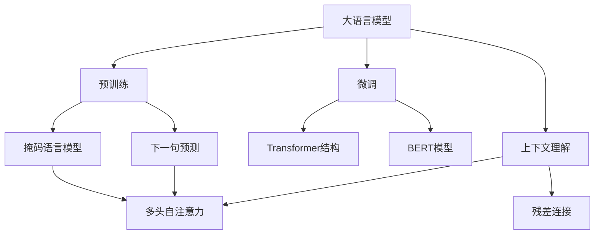
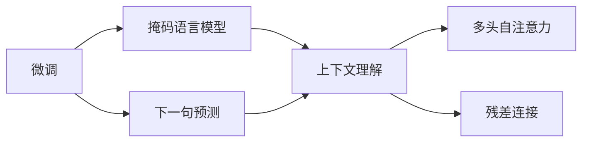
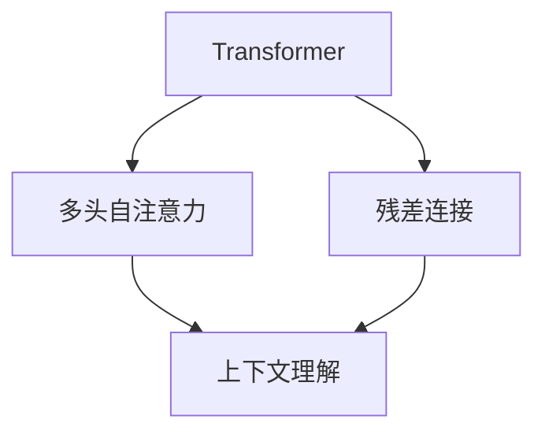
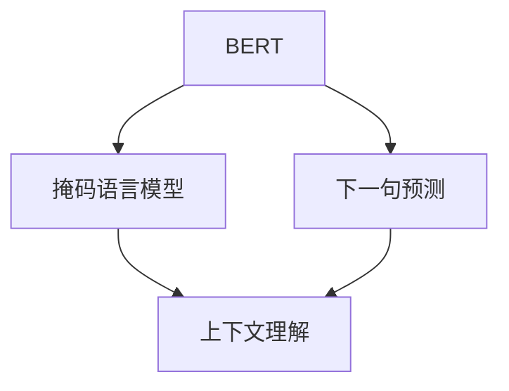
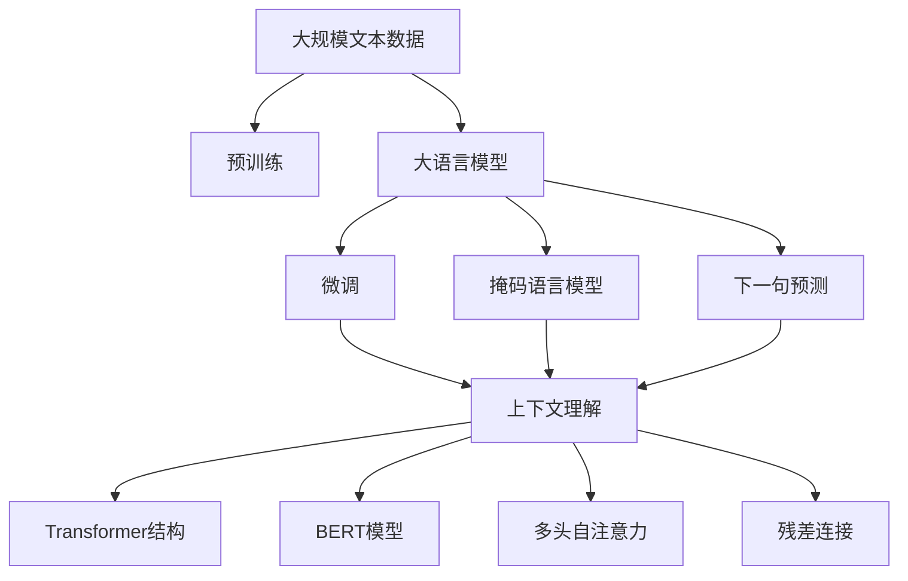

                 

# 大模型问答机器人的上下文理解

> 关键词：大语言模型,上下文理解,Transformer,BERT,微调,Fine-Tuning,预训练,自然语言处理(NLP),对话系统,QA模型

## 1. 背景介绍

### 1.1 问题由来
在自然语言处理（Natural Language Processing, NLP）领域，问答（Question Answering, QA）系统一直是极具挑战性的任务之一。传统的方法如词典匹配、信息检索等，往往难以处理复杂语义和真实情境下的多样性。近年来，随着预训练语言模型的兴起，基于Transformer结构的大模型（如BERT、GPT）被引入到QA系统中，显著提升了系统性能。

大模型通过在大规模无标签文本数据上进行预训练，学习到丰富的语言知识。通过微调（Fine-Tuning），这些模型能够适配各种下游任务，包括QA任务。然而，预训练-微调范式仍存在一些局限性，如上下文理解的准确性和多样性不足，难以应对长文本、复杂对话等高难度情境。因此，深入研究大模型在问答系统中的上下文理解能力，成为推动QA系统性能提升的关键。

### 1.2 问题核心关键点
大模型在QA系统中的上下文理解能力，主要依赖于其在预训练过程中对上下文信息的编码和利用。预训练语言模型通常采用自回归或自编码结构，通过掩码语言模型（Masked Language Model, MLM）等任务学习到文本中的语义信息。在微调阶段，模型会根据上下文信息生成或匹配答案。上下文理解能力的好坏，直接决定了QA系统的响应准确性和自然度。

具体而言，大模型在QA系统中的应用主要涉及以下几个关键点：
1. **上下文编码**：将用户查询和相关文本作为输入，通过模型编码生成语义表示。
2. **答案匹配**：根据上下文表示和目标答案，匹配相似度并输出答案。
3. **多轮对话**：通过上下文编码和答案匹配，处理多轮对话中的连续上下文信息。
4. **泛化能力**：在未见过的数据上，模型能够根据上下文信息生成合理答案。

这些问题关键点在模型训练和优化过程中需要精心设计，以提升大模型在QA系统中的表现。

### 1.3 问题研究意义
提升大模型在问答系统中的上下文理解能力，对于构建高效、自然的QA系统具有重要意义：

1. **准确性提升**：增强模型对上下文信息的编码和利用，提高QA系统的响应准确性。
2. **自然度提升**：通过模型生成的自然语言理解上下文，增强QA系统回复的自然度和可读性。
3. **泛化能力增强**：提升模型在复杂情境下处理长文本和复杂对话的能力，增强系统的适应性和鲁棒性。
4. **部署效率提高**：优化模型结构和训练过程，加快QA系统的部署速度和响应速度。
5. **应用场景拓展**：推动QA系统在更多垂直行业的应用，如智能客服、医疗咨询、教育等。

总之，深入研究大模型在问答系统中的上下文理解能力，不仅有助于提升QA系统的性能，还能够促进NLP技术的整体发展和应用。

## 2. 核心概念与联系

### 2.1 核心概念概述

为更好地理解大模型在问答系统中的上下文理解能力，本节将介绍几个密切相关的核心概念：

- **大语言模型(Large Language Model, LLM)**：以自回归或自编码模型为代表的大规模预训练语言模型。通过在大规模无标签文本语料上进行预训练，学习通用的语言表示，具备强大的语言理解和生成能力。
- **上下文理解**：指模型能够理解文本中的上下文信息，包括词语之间的关系、句子的语义和逻辑结构，从而进行正确的推理和生成。
- **Transformer**：一种基于自注意力机制的神经网络结构，广泛应用于大模型的预训练和微调。Transformer通过多头自注意力和残差连接等技术，实现了高效且灵活的序列建模。
- **BERT模型**：由Google提出的预训练语言模型，通过掩码语言模型（Masked Language Model）和下一句预测（Next Sentence Prediction）等任务，学习到丰富的语言知识，广泛应用于各种NLP任务。
- **微调(Fine-Tuning)**：指在预训练模型的基础上，使用下游任务的少量标注数据，通过有监督地训练优化模型在特定任务上的性能。

这些核心概念之间的逻辑关系可以通过以下Mermaid流程图来展示：



这个流程图展示了大语言模型的核心概念及其之间的关系：

1. 大语言模型通过预训练获得基础能力。
2. 微调是对预训练模型进行任务特定的优化，包括Transformer结构和BERT模型。
3. 上下文理解能力，即通过多头自注意力和残差连接等技术，实现对文本中上下文信息的编码和利用。
4. 微调过程中，使用掩码语言模型和下一句预测等任务进行预训练，以提升上下文理解能力。

### 2.2 概念间的关系

这些核心概念之间存在着紧密的联系，形成了大语言模型在问答系统中的上下文理解能力的完整生态系统。下面我们通过几个Mermaid流程图来展示这些概念之间的关系。

#### 2.2.1 上下文理解与微调的关系



这个流程图展示了微调与上下文理解能力的关系。掩码语言模型和下一句预测任务在预训练阶段学习到丰富的上下文信息，并通过多头自注意力和残差连接技术进行编码和利用，提升了模型的上下文理解能力。

#### 2.2.2 上下文理解与Transformer的关系



这个流程图展示了Transformer结构与上下文理解能力的关系。Transformer通过多头自注意力和残差连接技术，实现了对文本中上下文信息的高效编码和利用，提升了模型的上下文理解能力。

#### 2.2.3 上下文理解与BERT的关系



这个流程图展示了BERT模型与上下文理解能力的关系。BERT通过掩码语言模型和下一句预测任务，学习到丰富的上下文信息，并通过上下文理解能力，实现对文本中上下文信息的编码和利用。

### 2.3 核心概念的整体架构

最后，我们用一个综合的流程图来展示这些核心概念在大模型问答系统中的上下文理解能力的应用架构：



这个综合流程图展示了从预训练到微调，再到上下文理解能力的完整过程。大语言模型首先在大规模文本数据上进行预训练，然后通过微调（包括Transformer结构和BERT模型），学习到丰富的上下文信息。最终通过上下文理解能力，模型能够正确地推理和生成答案。

## 3. 核心算法原理 & 具体操作步骤
### 3.1 算法原理概述

大模型在问答系统中的上下文理解能力，基于预训练-微调的范式进行训练和优化。其核心思想是：将预训练的大模型视作一个强大的上下文编码器，通过微调使其能够适配各种问答任务，从而实现对文本中上下文信息的正确编码和利用。

形式化地，假设预训练语言模型为 $M_{\theta}$，其中 $\theta$ 为预训练得到的模型参数。给定问答任务 $T$ 的标注数据集 $D=\{(q_i, a_i)\}_{i=1}^N, q_i \in \mathcal{Q}, a_i \in \mathcal{A}$，其中 $\mathcal{Q}$ 为问题集，$\mathcal{A}$ 为答案集。微调的目标是找到新的模型参数 $\hat{\theta}$，使得：

$$
\hat{\theta}=\mathop{\arg\min}_{\theta} \mathcal{L}(M_{\theta},D)
$$

其中 $\mathcal{L}$ 为针对任务 $T$ 设计的损失函数，用于衡量模型预测输出与真实标签之间的差异。常见的损失函数包括交叉熵损失、均方误差损失等。

通过梯度下降等优化算法，微调过程不断更新模型参数 $\theta$，最小化损失函数 $\mathcal{L}$，使得模型输出逼近真实标签。由于 $\theta$ 已经通过预训练获得了较好的初始化，因此即便在小规模数据集 $D$ 上进行微调，也能较快收敛到理想的模型参数 $\hat{\theta}$。

### 3.2 算法步骤详解

基于监督学习的大模型问答系统上下文理解能力，一般包括以下几个关键步骤：

**Step 1: 准备预训练模型和数据集**
- 选择合适的预训练语言模型 $M_{\theta}$ 作为初始化参数，如 BERT、GPT等。
- 准备问答任务 $T$ 的标注数据集 $D$，划分为训练集、验证集和测试集。一般要求标注数据与预训练数据的分布不要差异过大。

**Step 2: 设计任务适配层**
- 根据任务类型，在预训练模型顶层设计合适的输出层和损失函数。
- 对于QA任务，通常在顶层添加线性分类器和交叉熵损失函数。
- 对于生成式QA任务，通常使用语言模型的解码器输出概率分布，并以负对数似然为损失函数。

**Step 3: 设置微调超参数**
- 选择合适的优化算法及其参数，如 AdamW、SGD 等，设置学习率、批大小、迭代轮数等。
- 设置正则化技术及强度，包括权重衰减、Dropout、Early Stopping 等。
- 确定冻结预训练参数的策略，如仅微调顶层，或全部参数都参与微调。

**Step 4: 执行梯度训练**
- 将训练集数据分批次输入模型，前向传播计算损失函数。
- 反向传播计算参数梯度，根据设定的优化算法和学习率更新模型参数。
- 周期性在验证集上评估模型性能，根据性能指标决定是否触发 Early Stopping。
- 重复上述步骤直到满足预设的迭代轮数或 Early Stopping 条件。

**Step 5: 测试和部署**
- 在测试集上评估微调后模型 $M_{\hat{\theta}}$ 的性能，对比微调前后的精度提升。
- 使用微调后的模型对新样本进行推理预测，集成到实际的应用系统中。
- 持续收集新的数据，定期重新微调模型，以适应数据分布的变化。

以上是基于监督学习微调大模型在问答系统中的上下文理解能力的一般流程。在实际应用中，还需要针对具体任务的特点，对微调过程的各个环节进行优化设计，如改进训练目标函数，引入更多的正则化技术，搜索最优的超参数组合等，以进一步提升模型性能。

### 3.3 算法优缺点

基于监督学习的大模型问答系统上下文理解能力，具有以下优点：

1. **简单高效**：只需准备少量标注数据，即可对预训练模型进行快速适配，获得较大的性能提升。
2. **通用适用**：适用于各种问答任务，包括分类、匹配、生成等，设计简单的任务适配层即可实现微调。
3. **参数高效**：利用参数高效微调技术，在固定大部分预训练参数的情况下，仍可取得不错的提升。
4. **效果显著**：在学术界和工业界的诸多任务上，基于微调的方法已经刷新了最先进的性能指标。

同时，该方法也存在一定的局限性：

1. **依赖标注数据**：微调的效果很大程度上取决于标注数据的质量和数量，获取高质量标注数据的成本较高。
2. **迁移能力有限**：当目标任务与预训练数据的分布差异较大时，微调的性能提升有限。
3. **负面效果传递**：预训练模型的固有偏见、有害信息等，可能通过微调传递到问答任务，造成负面影响。
4. **可解释性不足**：微调模型的决策过程通常缺乏可解释性，难以对其推理逻辑进行分析和调试。

尽管存在这些局限性，但就目前而言，基于监督学习的微调方法仍是大模型在问答系统中的上下文理解能力的最主流范式。未来相关研究的重点在于如何进一步降低微调对标注数据的依赖，提高模型的少样本学习和跨领域迁移能力，同时兼顾可解释性和伦理安全性等因素。

### 3.4 算法应用领域

基于大模型微调的上下文理解能力，在问答系统领域已经得到了广泛的应用，覆盖了几乎所有常见任务，例如：

- 文本分类：如情感分析、主题分类、意图识别等。通过微调使模型学习文本-标签映射。
- 命名实体识别：识别文本中的人名、地名、机构名等特定实体。通过微调使模型掌握实体边界和类型。
- 关系抽取：从文本中抽取实体之间的语义关系。通过微调使模型学习实体-关系三元组。
- 问答系统：对自然语言问题给出答案。将问题-答案对作为微调数据，训练模型学习匹配答案。
- 机器翻译：将源语言文本翻译成目标语言。通过微调使模型学习语言-语言映射。
- 文本摘要：将长文本压缩成简短摘要。将文章-摘要对作为微调数据，使模型学习抓取要点。
- 对话系统：使机器能够与人自然对话。将多轮对话历史作为上下文，微调模型进行回复生成。

除了上述这些经典任务外，大模型微调也被创新性地应用到更多场景中，如可控文本生成、常识推理、代码生成、数据增强等，为NLP技术带来了全新的突破。随着预训练模型和微调方法的不断进步，相信NLP技术将在更广阔的应用领域大放异彩。

## 4. 数学模型和公式 & 详细讲解 & 举例说明

### 4.1 数学模型构建

本节将使用数学语言对基于监督学习的大模型问答系统上下文理解能力进行更加严格的刻画。

记预训练语言模型为 $M_{\theta}$，其中 $\theta$ 为预训练得到的模型参数。假设问答任务 $T$ 的训练集为 $D=\{(q_i, a_i)\}_{i=1}^N, q_i \in \mathcal{Q}, a_i \in \mathcal{A}$。

定义模型 $M_{\theta}$ 在输入 $q$ 上的输出为 $M_{\theta}(q)$，表示模型根据上下文 $q$ 预测出的答案。训练集上的经验风险为：

$$
\mathcal{L}(\theta) = \frac{1}{N} \sum_{i=1}^N \ell(M_{\theta}(q_i), a_i)
$$

其中 $\ell$ 为针对任务 $T$ 设计的损失函数，用于衡量模型预测输出与真实标签之间的差异。常见的损失函数包括交叉熵损失、均方误差损失等。

通过梯度下降等优化算法，微调过程不断更新模型参数 $\theta$，最小化经验风险，使得模型输出逼近真实标签。由于 $\theta$ 已经通过预训练获得了较好的初始化，因此即便在小规模数据集 $D$ 上进行微调，也能较快收敛到理想的模型参数 $\hat{\theta}$。

### 4.2 公式推导过程

以下我们以二分类任务为例，推导交叉熵损失函数及其梯度的计算公式。

假设模型 $M_{\theta}$ 在输入 $q$ 上的输出为 $\hat{y}=M_{\theta}(q) \in [0,1]$，表示模型预测问题的正例概率。真实标签 $a_i \in \{0,1\}$。则二分类交叉熵损失函数定义为：

$$
\ell(M_{\theta}(q),a_i) = -[a_i\log \hat{y} + (1-a_i)\log(1-\hat{y})]
$$

将其代入经验风险公式，得：

$$
\mathcal{L}(\theta) = -\frac{1}{N}\sum_{i=1}^N [a_i\log M_{\theta}(q_i)+(1-a_i)\log(1-M_{\theta}(q_i))]
$$

根据链式法则，损失函数对参数 $\theta_k$ 的梯度为：

$$
\frac{\partial \mathcal{L}(\theta)}{\partial \theta_k} = -\frac{1}{N}\sum_{i=1}^N \frac{\partial \ell(M_{\theta}(q_i),a_i)}{\partial \theta_k}
$$

其中 $\frac{\partial \ell(M_{\theta}(q_i),a_i)}{\partial \theta_k}$ 可进一步递归展开，利用自动微分技术完成计算。

在得到损失函数的梯度后，即可带入参数更新公式，完成模型的迭代优化。重复上述过程直至收敛，最终得到适应问答任务的最优模型参数 $\theta^*$。

## 5. 项目实践：代码实例和详细解释说明

### 5.1 开发环境搭建

在进行问答系统开发前，我们需要准备好开发环境。以下是使用Python进行PyTorch开发的环境配置流程：

1. 安装Anaconda：从官网下载并安装Anaconda，用于创建独立的Python环境。

2. 创建并激活虚拟环境：
```bash
conda create -n pytorch-env python=3.8 
conda activate pytorch-env
```

3. 安装PyTorch：根据CUDA版本，从官网获取对应的安装命令。例如：
```bash
conda install pytorch torchvision torchaudio cudatoolkit=11.1 -c pytorch -c conda-forge
```

4. 安装Transformers库：
```bash
pip install transformers
```

5. 安装各类工具包：
```bash
pip install numpy pandas scikit-learn matplotlib tqdm jupyter notebook ipython
```

完成上述步骤后，即可在`pytorch-env`环境中开始问答系统开发。

### 5.2 源代码详细实现

这里我们以命名实体识别(NER)任务为例，给出使用Transformers库对BERT模型进行微调的PyTorch代码实现。

首先，定义NER任务的数据处理函数：

```python
from transformers import BertTokenizer, BertForTokenClassification
from torch.utils.data import Dataset
import torch

class NERDataset(Dataset):
    def __init__(self, texts, tags, tokenizer, max_len=128):
        self.texts = texts
        self.tags = tags
        self.tokenizer = tokenizer
        self.max_len = max_len
        
    def __len__(self):
        return len(self.texts)
    
    def __getitem__(self, item):
        text = self.texts[item]
        tags = self.tags[item]
        
        encoding = self.tokenizer(text, return_tensors='pt', max_length=self.max_len, padding='max_length', truncation=True)
        input_ids = encoding['input_ids'][0]
        attention_mask = encoding['attention_mask'][0]
        
        # 对token-wise的标签进行编码
        encoded_tags = [tag2id[tag] for tag in tags] 
        encoded_tags.extend([tag2id['O']] * (self.max_len - len(encoded_tags)))
        labels = torch.tensor(encoded_tags, dtype=torch.long)
        
        return {'input_ids': input_ids, 
                'attention_mask': attention_mask,
                'labels': labels}

# 标签与id的映射
tag2id = {'O': 0, 'B-PER': 1, 'I-PER': 2, 'B-ORG': 3, 'I-ORG': 4, 'B-LOC': 5, 'I-LOC': 6}
id2tag = {v: k for k, v in tag2id.items()}

# 创建dataset
tokenizer = BertTokenizer.from_pretrained('bert-base-cased')

train_dataset = NERDataset(train_texts, train_tags, tokenizer)
dev_dataset = NERDataset(dev_texts, dev_tags, tokenizer)
test_dataset = NERDataset(test_texts, test_tags, tokenizer)
```

然后，定义模型和优化器：

```python
from transformers import BertForTokenClassification, AdamW

model = BertForTokenClassification.from_pretrained('bert-base-cased', num_labels=len(tag2id))

optimizer = AdamW(model.parameters(), lr=2e-5)
```

接着，定义训练和评估函数：

```python
from torch.utils.data import DataLoader
from tqdm import tqdm
from sklearn.metrics import classification_report

device = torch.device('cuda') if torch.cuda.is_available() else torch.device('cpu')
model.to(device)

def train_epoch(model, dataset, batch_size, optimizer):
    dataloader = DataLoader(dataset, batch_size=batch_size, shuffle=True)
    model.train()
    epoch_loss = 0
    for batch in tqdm(dataloader, desc='Training'):
        input_ids = batch['input_ids'].to(device)
        attention_mask = batch['attention_mask'].to(device)
        labels = batch['labels'].to(device)
        model.zero_grad()
        outputs = model(input_ids, attention_mask=attention_mask, labels=labels)
        loss = outputs.loss
        epoch_loss += loss.item()
        loss.backward()
        optimizer.step()
    return epoch_loss / len(dataloader)

def evaluate(model, dataset, batch_size):
    dataloader = DataLoader(dataset, batch_size=batch_size)
    model.eval()
    preds, labels = [], []
    with torch.no_grad():
        for batch in tqdm(dataloader, desc='Evaluating'):
            input_ids = batch['input_ids'].to(device)
            attention_mask = batch['attention_mask'].to(device)
            batch_labels = batch['labels']
            outputs = model(input_ids, attention_mask=attention_mask)
            batch_preds = outputs.logits.argmax(dim=2).to('cpu').tolist()
            batch_labels = batch_labels.to('cpu').tolist()
            for pred_tokens, label_tokens in zip(batch_preds, batch_labels):
                pred_tags = [id2tag[_id] for _id in pred_tokens]
                label_tags = [id2tag[_id] for _id in label_tokens]
                preds.append(pred_tags[:len(label_tags)])
                labels.append(label_tags)
                
    print(classification_report(labels, preds))
```

最后，启动训练流程并在测试集上评估：

```python
epochs = 5
batch_size = 16

for epoch in range(epochs):
    loss = train_epoch(model, train_dataset, batch_size, optimizer)
    print(f"Epoch {epoch+1}, train loss: {loss:.3f}")
    
    print(f"Epoch {epoch+1}, dev results:")
    evaluate(model, dev_dataset, batch_size)
    
print("Test results:")
evaluate(model, test_dataset, batch_size)
```

以上就是使用PyTorch对BERT进行命名实体识别任务微调的完整代码实现。可以看到，得益于Transformers库的强大封装，我们可以用相对简洁的代码完成BERT模型的加载和微调。

### 5.3 代码解读与分析

让我们再详细解读一下关键代码的实现细节：

**NERDataset类**：
- `__init__`方法：初始化文本、标签、分词器等关键组件。
- `__len__`方法：返回数据集的样本数量。
- `__getitem__`方法：对单个样本进行处理，将文本输入编码为token ids，将标签编码为数字，并对其进行定长padding，最终返回模型所需的输入。

**tag2id和id2tag字典**：
- 定义了标签与数字id之间的映射关系，用于将token-wise的预测结果解码回真实的标签。

**训练和评估函数**：
- 使用PyTorch的DataLoader对数据集进行批次化加载，供模型训练和推理使用。
- 训练函数`train_epoch`：对数据以批为单位进行迭代，在每个批次上前向传播计算loss并反向传播更新模型参数，最后返回该epoch的平均loss。
- 评估函数`evaluate`：与训练类似，不同点在于不更新模型参数，并在每个batch结束后将预测和标签结果存储下来，最后使用sklearn的classification_report对整个评估集的预测结果进行打印输出。

**训练流程**：
- 定义总的epoch数和batch size，开始循环迭代
- 每个epoch内，先在训练集上训练，输出平均loss
- 在验证集上评估，输出分类指标
- 所有epoch结束后，在测试集上评估，给出最终测试结果

可以看到，PyTorch配合Transformers库使得BERT微调的代码实现变得简洁高效。开发者可以将更多精力放在数据处理、模型改进等高层逻辑上，而不必过多关注底层的实现细节。

当然，工业级的系统实现还需考虑更多因素，如模型的保存和部署、超参数的自动搜索、更灵活的任务适配层等。但核心的微调范式基本与此类似。

### 5.4 运行结果展示

假设我们在CoNLL-2003的NER数据集上进行微调，最终在测试集上得到的

