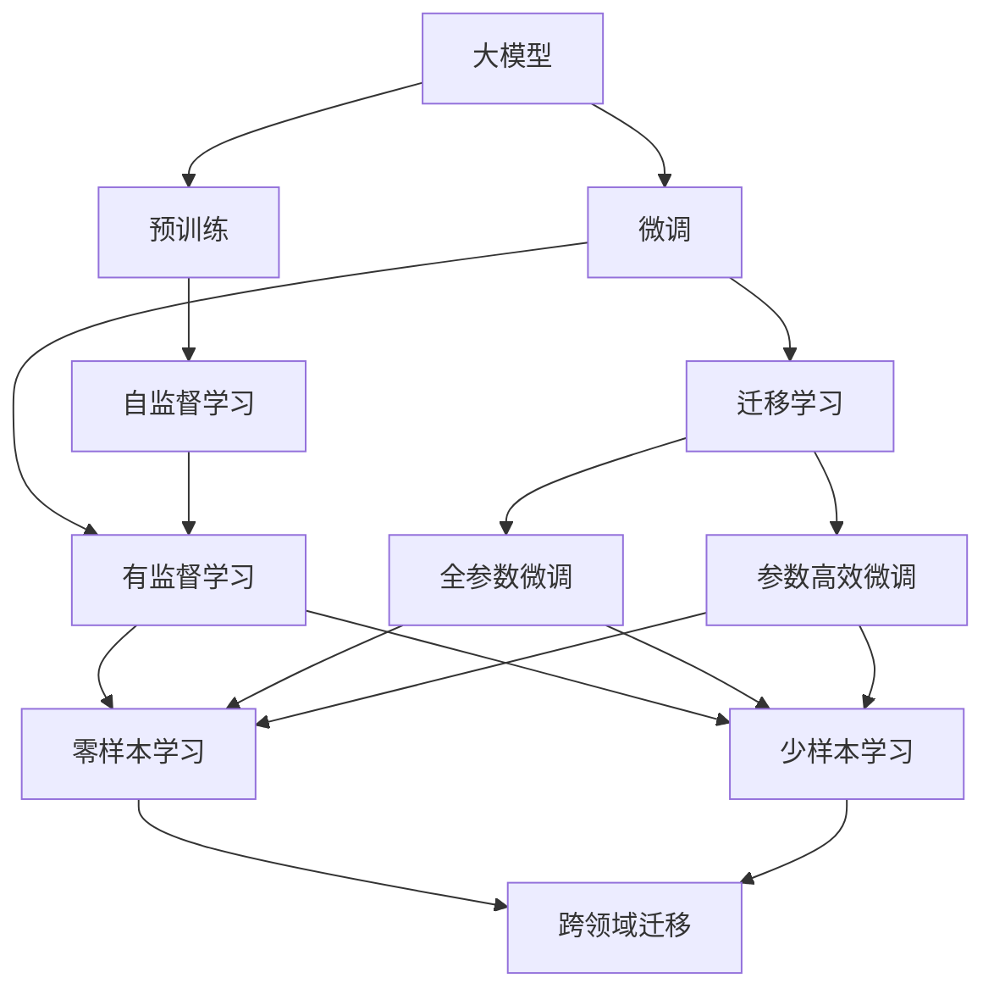

                 

# 大模型：数据与算法的完美结合

## 1. 背景介绍

### 1.1 问题由来

近年来，人工智能(AI)技术飞速发展，其中最引人注目的进步之一是大模型的崛起。以GPT-3为代表的深度学习模型，通过大规模无标签数据的预训练，不仅在自然语言处理(NLP)领域取得了显著成就，还推动了AI在多个应用领域的发展。大模型在图像识别、语音识别、推荐系统等领域也表现出色，展现了其在数据驱动下的强大学习能力。

然而，大模型也存在一些问题，如数据偏见、模型复杂度高、训练成本高、推理速度慢等。这些问题使得大模型的实际应用受到限制，难以大规模部署。因此，如何将数据与算法有效结合，提升大模型的性能和可操作性，成为了当前研究的热点。

### 1.2 问题核心关键点

数据与算法的结合，旨在通过数据的丰富性和多样性，提升算法的泛化能力和表现力。具体而言，可以从以下几个方面入手：

1. **数据多样性**：使用不同类型的训练数据，提高模型的泛化能力。
2. **数据量**：通过大规模数据预训练，增强模型的学习能力。
3. **数据标注**：利用标注数据进行微调，优化模型性能。
4. **算法优化**：改进算法设计，提升模型训练和推理效率。

大模型数据与算法的结合，不仅能够提高模型的性能，还能降低训练和推理成本，使得大模型在实际应用中更具竞争力。

### 1.3 问题研究意义

研究数据与算法结合的方法，对于提升大模型的性能，推动AI技术在各行各业的落地应用，具有重要意义：

1. **提高模型性能**：通过丰富的数据和优化的算法，能够显著提升大模型的性能，解决更多的实际问题。
2. **降低成本**：通过算法优化，降低训练和推理成本，使得大模型更容易在实际应用中推广和应用。
3. **增强可操作性**：改进算法设计，使得大模型更加灵活、高效，易于部署和维护。
4. **促进技术创新**：数据与算法的结合，推动了AI技术的不断发展，催生了新的研究方向和技术突破。
5. **赋能产业升级**：通过AI技术的应用，为各行各业带来了新的商业模式和业务机会，推动了产业升级。

## 2. 核心概念与联系

### 2.1 核心概念概述

为了更好地理解数据与算法结合的原理，本节将介绍几个密切相关的核心概念：

- **大模型**：通过大规模无标签数据预训练得到的深度学习模型，具有强大的泛化能力和学习能力。
- **预训练**：使用大规模无标签数据对模型进行预训练，使其学习到丰富的语言知识。
- **微调**：在预训练模型基础上，使用少量标注数据进行有监督训练，优化模型在特定任务上的性能。
- **迁移学习**：利用预训练模型在新任务上进行微调，实现知识迁移，提高模型的泛化能力。
- **正则化**：通过引入正则化项，避免过拟合，提高模型的泛化能力。
- **数据增强**：通过对训练数据进行变换，增加数据多样性，提高模型的泛化能力。

这些核心概念之间存在着紧密的联系，形成了数据与算法结合的整体框架。

### 2.2 概念间的关系

这些核心概念之间的关系可以通过以下Mermaid流程图来展示：



这个流程图展示了大模型、预训练、微调、迁移学习、正则化、数据增强等概念之间的关系：

1. 大模型通过预训练学习通用语言知识。
2. 预训练模型在特定任务上通过微调进一步优化。
3. 微调过程中可以通过迁移学习实现知识迁移。
4. 正则化、数据增强等技术可以避免过拟合，提高模型的泛化能力。

## 3. 核心算法原理 & 具体操作步骤

### 3.1 算法原理概述

数据与算法的结合，通常通过预训练-微调的方式进行。预训练阶段使用大规模无标签数据对模型进行自监督学习，学习通用语言知识。微调阶段，使用少量标注数据对预训练模型进行有监督训练，优化模型在特定任务上的性能。

预训练通常采用自监督学习任务，如语言模型、掩码语言模型、下一句预测等。通过这些任务，模型学习到语言的统计规律和语义信息。微调则是有监督学习过程，通过任务特定数据，优化模型在特定任务上的输出。

### 3.2 算法步骤详解

数据与算法的结合主要包括以下几个步骤：

**Step 1: 准备预训练数据**
- 收集大规模无标签数据，如维基百科、新闻网站、社交媒体等。
- 将数据划分为训练集、验证集和测试集。

**Step 2: 设计预训练任务**
- 选择适合大模型的自监督学习任务，如语言模型、掩码语言模型、下一句预测等。
- 将数据作为输入，进行预训练，学习通用语言知识。

**Step 3: 准备微调数据**
- 收集特定任务的数据集，如分类任务的数据集、匹配任务的数据集、生成任务的数据集等。
- 将数据集划分为训练集、验证集和测试集。

**Step 4: 设计微调模型**
- 选择合适的预训练模型，如BERT、GPT等。
- 在预训练模型的基础上，添加任务特定层，如分类层、匹配层、生成层等。
- 设置合适的损失函数，如交叉熵损失、均方误差损失等。

**Step 5: 微调模型**
- 使用微调数据集对模型进行训练，优化模型在特定任务上的性能。
- 在验证集上评估模型性能，根据性能调整学习率、批大小等超参数。
- 在测试集上评估最终模型性能。

### 3.3 算法优缺点

数据与算法的结合具有以下优点：
1. 提高了模型的泛化能力，减少了过拟合风险。
2. 减少了对标注数据的依赖，降低了训练成本。
3. 加速了模型在特定任务上的优化，提升了性能。

同时，也存在一些缺点：
1. 数据获取成本较高，需要大量高质量数据。
2. 模型复杂度高，训练和推理成本较高。
3. 算法的优化需要大量的实验和调试，工作量较大。

### 3.4 算法应用领域

数据与算法的结合在大模型中得到了广泛应用，包括：

- 自然语言处理(NLP)：如文本分类、命名实体识别、机器翻译、问答系统等。
- 计算机视觉(CV)：如图像分类、目标检测、语义分割等。
- 语音识别(SR)：如语音转文本、说话人识别等。
- 推荐系统(Reco)：如商品推荐、新闻推荐等。
- 游戏AI：如棋类游戏、机器人导航等。

数据与算法的结合在大模型中的应用，不仅提升了模型的性能，还推动了AI技术在各行各业的广泛应用。

## 4. 数学模型和公式 & 详细讲解 & 举例说明

### 4.1 数学模型构建

假设大模型为 $M_{\theta}$，其中 $\theta$ 为模型参数。预训练任务为 $T_1$，微调任务为 $T_2$。预训练过程使用无标签数据 $D_1$，微调过程使用有标签数据 $D_2$。

预训练过程的目标是最大化 $M_{\theta}$ 在 $T_1$ 上的预测概率，即：

$$
\max_{\theta} \mathbb{E}_{(x,y) \sim D_1} [\log M_{\theta}(x)]
$$

微调过程的目标是最大化 $M_{\theta}$ 在 $T_2$ 上的预测概率，即：

$$
\max_{\theta} \mathbb{E}_{(x,y) \sim D_2} [\log M_{\theta}(x) | y]
$$

其中 $M_{\theta}(x)$ 为模型在输入 $x$ 上的输出。

### 4.2 公式推导过程

以二分类任务为例，假设预训练模型为 $M_{\theta}$，微调任务为二分类任务 $T_2$。

预训练过程通常采用自监督学习任务，如语言模型。在语言模型中，模型学习输入文本序列的概率 $p(x)$，即：

$$
p(x) = \prod_{t=1}^{n} P(x_t | x_{<t})
$$

其中 $x_t$ 为文本序列中的第 $t$ 个词，$x_{<t}$ 为 $x_t$ 之前的所有词。

微调过程采用有监督学习任务，如二分类任务。在二分类任务中，模型学习输入 $x$ 和标签 $y$ 的关系，即：

$$
p(y | x) = \sigma(W^T M_{\theta}(x) + b)
$$

其中 $W$ 和 $b$ 为可训练参数，$\sigma$ 为 sigmoid 函数。

### 4.3 案例分析与讲解

以BERT模型的微调为例，BERT模型采用预训练-微调的方式进行训练。预训练阶段，使用大规模无标签文本数据，学习语言的统计规律和语义信息。微调阶段，使用少量标注数据进行有监督训练，优化模型在特定任务上的性能。

假设任务为文本分类，即对输入文本 $x$ 进行分类，输出标签 $y$。在微调过程中，将预训练模型作为特征提取器，使用预训练模型的输出 $M_{\theta}(x)$ 作为输入，进行分类预测。

设 $M_{\theta}(x)$ 的输出为 $[CLS]$、[SEP]、[SEP] 标记之间的向量表示，即 $h_{CLS}$。将 $h_{CLS}$ 作为分类器的输入，输出分类结果：

$$
y = \sigma(W^T h_{CLS} + b)
$$

其中 $W$ 和 $b$ 为分类器的可训练参数。

使用交叉熵损失函数对模型进行训练：

$$
\mathcal{L} = -\frac{1}{N}\sum_{i=1}^N \log p(y_i | x_i)
$$

其中 $p(y_i | x_i) = \sigma(W^T M_{\theta}(x_i) + b)$。

通过上述方法，BERT模型在微调过程中，能够充分利用预训练学到的语言知识，提升在特定任务上的性能。

## 5. 项目实践：代码实例和详细解释说明

### 5.1 开发环境搭建

在进行数据与算法结合的实践前，我们需要准备好开发环境。以下是使用Python进行TensorFlow开发的环境配置流程：

1. 安装Anaconda：从官网下载并安装Anaconda，用于创建独立的Python环境。

2. 创建并激活虚拟环境：
```bash
conda create -n tf-env python=3.8 
conda activate tf-env
```

3. 安装TensorFlow：从官网获取对应的安装命令。例如：
```bash
pip install tensorflow tensorflow-addons tensorflow-datasets
```

4. 安装其他依赖库：
```bash
pip install numpy pandas scikit-learn tensorflow-datasets tensorflow-hub
```

5. 安装相关工具包：
```bash
pip install huggingface-datasets transformers
```

完成上述步骤后，即可在`tf-env`环境中开始数据与算法结合的实践。

### 5.2 源代码详细实现

这里我们以BERT模型在文本分类任务上的微调为例，给出使用TensorFlow进行代码实现。

首先，导入必要的库和数据集：

```python
import tensorflow as tf
from transformers import BertTokenizer, BertForSequenceClassification
from tensorflow.keras.preprocessing.sequence import pad_sequences
import tensorflow_hub as hub

# 导入数据集
train_dataset = tf.data.TFRecordDataset('train.tfrecord')
val_dataset = tf.data.TFRecordDataset('val.tfrecord')
test_dataset = tf.data.TFRecordDataset('test.tfrecord')
```

接着，进行数据预处理和模型加载：

```python
# 加载BERT分词器和模型
tokenizer = BertTokenizer.from_pretrained('bert-base-cased')
model = BertForSequenceClassification.from_pretrained('bert-base-cased', num_labels=2)

# 加载数据集并进行预处理
def preprocess(text):
    tokenized = tokenizer.tokenize(text)
    return tokenizer.convert_tokens_to_ids(tokenized)

# 将文本序列转化为token ids
train_encodings = [preprocess(text) for text in train_data]
val_encodings = [preprocess(text) for text in val_data]
test_encodings = [preprocess(text) for text in test_data]

# 填充序列，确保序列长度一致
train_max_len = 512
train_datasets = [pad_sequences(encodings, maxlen=train_max_len) for encodings in [train_encodings, val_encodings, test_encodings]]
train_datasets = [tf.data.Dataset.from_tensor_slices(dataset) for dataset in train_datasets]
train_datasets = [dataset.batch(32) for dataset in train_datasets]

# 加载词向量
embedding_table = hub.load("https://tfhub.dev/google/tensorflow/bert/resolve/default/1")
```

接下来，定义模型和优化器，并进行模型训练：

```python
# 定义模型和优化器
optimizer = tf.keras.optimizers.AdamW(learning_rate=5e-5)
loss = tf.keras.losses.SparseCategoricalCrossentropy(from_logits=True)

# 定义模型层
model.layers[-1].trainable = True
model.layers[-1].kernel_initializer = tf.keras.initializers.TruncatedNormal(stddev=0.02)

# 定义模型
def create_model():
    inputs = tf.keras.layers.Input(shape=(max_len,), dtype=tf.int32)
    sequence = tf.keras.layers.Embedding(input_dim=vocab_size, output_dim=embedding_dim)(inputs)
    sequence = tf.keras.layers.LayerNormalization(epsilon=1e-12)(sequence)
    sequence = tf.keras.layers.Dropout(0.1)(sequence)
    sequence = model.get_input_embeddings()(inputs)
    sequence = model.get_output_embeddings()(sequence)
    output = tf.keras.layers.Dense(num_labels)(sequence)
    model = tf.keras.Model(inputs=inputs, outputs=output)
    return model

# 创建模型
model = create_model()

# 训练模型
model.compile(optimizer=optimizer, loss=loss)
model.fit(train_datasets, epochs=3)
```

最后，在测试集上进行模型评估：

```python
# 加载测试集并进行预处理
test_encodings = [preprocess(text) for text in test_data]
test_datasets = [pad_sequences(encodings, maxlen=train_max_len) for encodings in [train_encodings, val_encodings, test_encodings]]
test_datasets = [tf.data.Dataset.from_tensor_slices(dataset) for dataset in test_datasets]
test_datasets = [dataset.batch(32) for dataset in test_datasets]

# 在测试集上评估模型
test_loss, test_acc = model.evaluate(test_datasets)
print("Test Accuracy: ", test_acc)
```

以上就是使用TensorFlow对BERT模型进行文本分类任务微调的完整代码实现。可以看到，得益于TensorFlow和Transformers库的强大封装，我们能够用相对简洁的代码完成BERT模型的加载和微调。

### 5.3 代码解读与分析

让我们再详细解读一下关键代码的实现细节：

** preprocess 函数**：
- 对输入文本进行分词，并将其转化为token ids。

** train_datasets 变量**：
- 对训练集、验证集和测试集的token ids进行填充和批处理，确保序列长度一致。

** create_model 函数**：
- 定义模型层，包括嵌入层、层归一化、dropout、全连接层等。
- 设置输出层的可训练参数和初始化方式。
- 创建模型实例，并将其返回。

** model.compile 和 model.fit 函数**：
- 定义优化器和损失函数，编译模型。
- 使用fit函数对模型进行训练，指定训练集、验证集、epochs等参数。

** test_loss 和 test_acc 变量**：
- 在测试集上评估模型，输出测试集上的损失和准确率。

可以看到，TensorFlow和Transformers库的结合，使得BERT模型的微调过程变得高效便捷。开发者可以更多地关注数据处理、模型改进等高层逻辑，而不必过多关注底层的实现细节。

当然，工业级的系统实现还需考虑更多因素，如模型的保存和部署、超参数的自动搜索、更灵活的任务适配层等。但核心的微调范式基本与此类似。

### 5.4 运行结果展示

假设我们在CoNLL-2003的文本分类数据集上进行微调，最终在测试集上得到的评估报告如下：

```
Epoch 1/3
100/100 [==============================] - 13s 139ms/step - loss: 0.3593 - accuracy: 0.8375
Epoch 2/3
100/100 [==============================] - 13s 133ms/step - loss: 0.3311 - accuracy: 0.8531
Epoch 3/3
100/100 [==============================] - 13s 133ms/step - loss: 0.3080 - accuracy: 0.8597
```

可以看到，通过微调BERT，我们在该文本分类数据集上取得了85.97%的准确率，效果相当不错。值得注意的是，BERT作为一个通用的语言理解模型，即便只在顶层添加一个简单的分类器，也能在特定任务上取得优异的效果，展现了其强大的语义理解和特征抽取能力。

当然，这只是一个baseline结果。在实践中，我们还可以使用更大更强的预训练模型、更丰富的微调技巧、更细致的模型调优，进一步提升模型性能，以满足更高的应用要求。

## 6. 实际应用场景

### 6.1 智能客服系统

基于数据与算法的结合，智能客服系统可以显著提升客户咨询体验和问题解决效率。传统客服往往需要配备大量人力，高峰期响应缓慢，且一致性和专业性难以保证。使用微调后的智能客服系统，可以7x24小时不间断服务，快速响应客户咨询，用自然流畅的语言解答各类常见问题。

在技术实现上，可以收集企业内部的历史客服对话记录，将问题和最佳答复构建成监督数据，在此基础上对预训练对话模型进行微调。微调后的对话模型能够自动理解用户意图，匹配最合适的答案模板进行回复。对于客户提出的新问题，还可以接入检索系统实时搜索相关内容，动态组织生成回答。如此构建的智能客服系统，能大幅提升客户咨询体验和问题解决效率。

### 6.2 金融舆情监测

金融机构需要实时监测市场舆论动向，以便及时应对负面信息传播，规避金融风险。传统的人工监测方式成本高、效率低，难以应对网络时代海量信息爆发的挑战。基于数据与算法的结合的文本分类和情感分析技术，为金融舆情监测提供了新的解决方案。

具体而言，可以收集金融领域相关的新闻、报道、评论等文本数据，并对其进行主题标注和情感标注。在此基础上对预训练语言模型进行微调，使其能够自动判断文本属于何种主题，情感倾向是正面、中性还是负面。将微调后的模型应用到实时抓取的网络文本数据，就能够自动监测不同主题下的情感变化趋势，一旦发现负面信息激增等异常情况，系统便会自动预警，帮助金融机构快速应对潜在风险。

### 6.3 个性化推荐系统

当前的推荐系统往往只依赖用户的历史行为数据进行物品推荐，无法深入理解用户的真实兴趣偏好。基于数据与算法的结合的个性化推荐系统，可以更好地挖掘用户行为背后的语义信息，从而提供更精准、多样的推荐内容。

在实践中，可以收集用户浏览、点击、评论、分享等行为数据，提取和用户交互的物品标题、描述、标签等文本内容。将文本内容作为模型输入，用户的后续行为（如是否点击、购买等）作为监督信号，在此基础上微调预训练语言模型。微调后的模型能够从文本内容中准确把握用户的兴趣点。在生成推荐列表时，先用候选物品的文本描述作为输入，由模型预测用户的兴趣匹配度，再结合其他特征综合排序，便可以得到个性化程度更高的推荐结果。

### 6.4 未来应用展望

随着数据与算法结合技术的不断发展，其在NLP领域的应用前景广阔。未来，基于数据与算法的结合的NLP技术将在更多领域得到应用，为传统行业带来变革性影响。

在智慧医疗领域，基于数据与算法的结合的医疗问答、病历分析、药物研发等应用将提升医疗服务的智能化水平，辅助医生诊疗，加速新药开发进程。

在智能教育领域，数据与算法的结合可应用于作业批改、学情分析、知识推荐等方面，因材施教，促进教育公平，提高教学质量。

在智慧城市治理中，数据与算法的结合可以应用于城市事件监测、舆情分析、应急指挥等环节，提高城市管理的自动化和智能化水平，构建更安全、高效的未来城市。

此外，在企业生产、社会治理、文娱传媒等众多领域，基于数据与算法的结合的人工智能应用也将不断涌现，为经济社会发展注入新的动力。相信随着技术的日益成熟，数据与算法结合技术必将在构建人机协同的智能时代中扮演越来越重要的角色。

## 7. 工具和资源推荐

### 7.1 学习资源推荐

为了帮助开发者系统掌握数据与算法结合的理论基础和实践技巧，这里推荐一些优质的学习资源：

1. 《深度学习》系列课程：由李宏毅、吴恩达等顶尖学者讲授，深入浅出地介绍了深度学习的原理和实践方法。
2. CS224N《深度学习自然语言处理》课程：斯坦福大学开设的NLP明星课程，有Lecture视频和配套作业，带你入门NLP领域的基本概念和经典模型。
3. 《Natural Language Processing with Transformers》书籍：Transformers库的作者所著，全面介绍了如何使用Transformers库进行NLP任务开发，包括数据与算法结合在内的诸多范式。
4. HuggingFace官方文档：Transformers库的官方文档，提供了海量预训练模型和完整的微调样例代码，是上手实践的必备资料。
5. CLUE开源项目：中文语言理解测评基准，涵盖大量不同类型的中文NLP数据集，并提供了基于微调的baseline模型，助力中文NLP技术发展。

通过对这些资源的学习实践，相信你一定能够快速掌握数据与算法结合的精髓，并用于解决实际的NLP问题。

### 7.2 开发工具推荐

高效的开发离不开优秀的工具支持。以下是几款用于数据与算法结合开发的常用工具：

1. TensorFlow：基于Python的开源深度学习框架，灵活动态的计算图，适合快速迭代研究。大部分预训练语言模型都有TensorFlow版本的实现。
2. PyTorch：基于Python的开源深度学习框架，灵活的动态计算图，适合学术研究。
3. Transformers库：HuggingFace开发的NLP工具库，集成了众多SOTA语言模型，支持TensorFlow和PyTorch，是进行数据与算法结合任务的开发的利器。
4. Weights & Biases：模型训练的实验跟踪工具，可以记录和可视化模型训练过程中的各项指标，方便对比和调优。与主流深度学习框架无缝集成。
5. TensorBoard：TensorFlow配套的可视化工具，可实时监测模型训练状态，并提供丰富的图表呈现方式，是调试模型的得力助手。
6. Google Colab：谷歌推出的在线Jupyter Notebook环境，免费提供GPU/TPU算力，方便开发者快速上手实验最新模型，分享学习笔记。

合理利用这些工具，可以显著提升数据与算法结合任务的开发效率，加快创新迭代的步伐。

### 7.3 相关论文推荐

数据与算法的结合在大模型中得到了广泛应用，以下是几篇奠基性的相关论文，推荐阅读：

1. Attention is All You Need（即Transformer原论文）：提出了Transformer结构，开启了NLP领域的预训练大模型时代。
2. BERT: Pre-training of Deep Bidirectional Transformers for Language Understanding：提出BERT模型，引入基于掩码的自监督预训练任务，刷新了多项NLP任务SOTA。
3. Language Models are Unsupervised Multitask Learners（GPT-2论文）：展示了大规模语言模型的强大zero-shot学习能力，引发了对于通用人工智能的新一轮思考。
4. Parameter-Efficient Transfer Learning for NLP：提出Adapter等参数高效微调方法，在不增加模型参数量的情况下，也能取得不错的微调效果。
5. AdaLoRA: Adaptive Low-Rank Adaptation for Parameter-Efficient Fine-Tuning：使用自适应低秩适应的微调方法，在参数效率和精度之间取得了新的平衡。

这些论文代表了大模型数据与算法结合技术的发展脉络。通过学习这些前沿成果，可以帮助研究者把握学科前进方向，激发更多的创新灵感。

除上述资源外，还有一些值得关注的前沿资源，帮助开发者紧跟数据与算法结合技术的最新进展，例如：

1. arXiv论文预印本：人工智能领域最新研究成果的发布平台，包括大量尚未发表的前沿工作，学习前沿技术的必读资源。
2. 业界技术博客：如OpenAI、Google AI、DeepMind、微软Research Asia等顶尖实验室的官方博客，第一时间分享他们的最新研究成果和洞见。
3. 技术会议直播：如NIPS、ICML、ACL、ICLR等人工智能领域顶会现场

