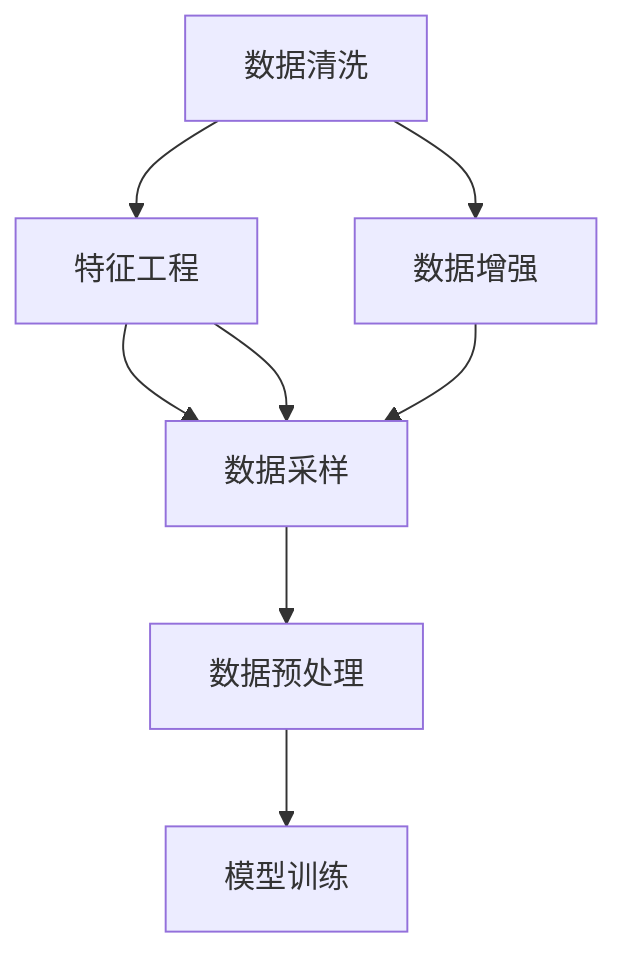

                 

# AI人工智能核心算法原理与代码实例讲解：数据处理

> 关键词：数据清洗, 特征工程, 数据增强, 数据采样, 数据预处理, 深度学习, 人工智能

## 1. 背景介绍

数据处理是人工智能（AI）项目中最基础和关键的环节之一。在机器学习（ML）和深度学习（DL）模型训练和应用中，数据的质量和可用性直接影响到模型的性能和效果。因此，掌握高效、全面的数据处理技术对于构建高性能AI系统至关重要。本文将全面介绍AI中的核心数据处理算法，并结合具体案例进行讲解。

## 2. 核心概念与联系

### 2.1 核心概念概述

为了更好地理解AI中的数据处理算法，我们首先介绍几个核心概念：

- **数据清洗（Data Cleaning）**：通过去除错误、缺失、重复或不相关的数据，提升数据质量和可用性。
- **特征工程（Feature Engineering）**：从原始数据中提取、选择和构造新的特征变量，以提高模型性能。
- **数据增强（Data Augmentation）**：通过各种技术扩充训练数据集，提高模型的泛化能力。
- **数据采样（Data Sampling）**：从数据集中选取一部分样本进行训练，以提高训练效率和模型性能。
- **数据预处理（Data Preprocessing）**：对原始数据进行标准化、归一化、编码等操作，为模型提供合适的输入。

这些概念通过以下Mermaid流程图展示了它们之间的联系：



### 2.2 概念间的关系

以上核心概念在数据处理流程中相互关联，形成了一个完整的数据处理循环。具体如下：

- **数据清洗**：清洗后的数据更适合进行特征工程和增强，提高后续处理的质量。
- **特征工程**：通过特征选择和构造，提升了数据的质量和模型性能。
- **数据增强**：扩充数据集，使得模型更加泛化，避免过拟合。
- **数据采样**：在数据增强的基础上，通过有策略的采样，进一步提升模型性能。
- **数据预处理**：为模型提供标准化、格式化的输入，提高模型效率。

## 3. 核心算法原理 & 具体操作步骤

### 3.1 算法原理概述

数据处理的核心算法原理可以概括为以下几个方面：

- **数据清洗**：通过统计分析、规则匹配等方法，自动识别和修正数据中的错误、缺失和异常值。
- **特征工程**：通过特征选择、特征构造、特征缩放等方法，提升特征的表现力和模型的性能。
- **数据增强**：通过旋转、翻转、裁剪等技术，生成新的数据样本，扩充训练集。
- **数据采样**：通过随机抽样、分层抽样、加权抽样等方法，选取代表性的样本进行训练。
- **数据预处理**：通过归一化、标准化、编码等方法，为模型提供合适的输入格式。

### 3.2 算法步骤详解

以下是对数据处理算法的详细步骤详解：

#### 3.2.1 数据清洗步骤

1. **数据初步清洗**：
   - 删除重复数据和明显错误的数据点。
   - 处理缺失值，可以通过删除、填补或插值等方法。
   - 去除异常值，如通过箱线图识别和移除异常值。

2. **数据详终清洗**：
   - 进一步清洗数据，包括处理文本数据中的噪声、去除无效特征等。
   - 使用异常检测算法，如离群点检测、密度估计等，识别和修正异常值。

3. **清洗效果评估**：
   - 通过统计指标，如缺失值比例、异常值比例等，评估清洗效果。
   - 使用可视化工具，如直方图、散点图等，直观展示数据清洗前后的变化。

#### 3.2.2 特征工程步骤

1. **特征选择**：
   - 通过统计分析、领域知识等方法，选择最相关、最具代表性的特征。
   - 使用特征选择算法，如卡方检验、信息增益、递归特征消除等，自动选择特征。

2. **特征构造**：
   - 根据领域知识和业务需求，构造新的特征变量，如交互特征、多项式特征等。
   - 使用特征构造算法，如多项式扩展、组合特征等，生成新的特征。

3. **特征缩放**：
   - 对特征进行标准化、归一化等操作，使得特征值在0到1之间。
   - 使用特征缩放算法，如Z-score标准化、Min-Max归一化等，提升模型性能。

#### 3.2.3 数据增强步骤

1. **图像数据增强**：
   - 使用旋转、翻转、裁剪等技术，生成新的图像数据。
   - 使用扭曲、噪声、遮挡等技术，生成更加多样化的图像数据。

2. **文本数据增强**：
   - 通过回译、同义词替换、随机插入等技术，生成新的文本数据。
   - 使用文本修复、段落拼接等技术，生成更加多样化的文本数据。

3. **音频数据增强**：
   - 使用变速、变调、混响等技术，生成新的音频数据。
   - 使用噪声注入、混响等技术，生成更加多样化的音频数据。

#### 3.2.4 数据采样步骤

1. **随机抽样**：
   - 从数据集中随机抽取样本进行训练。
   - 使用随机数生成器，保证样本的随机性和代表性。

2. **分层抽样**：
   - 根据类别、属性等维度，对数据进行分层，保证各层样本的均衡性。
   - 使用分层随机抽样算法，保证各层样本的代表性。

3. **加权抽样**：
   - 根据样本的重要性、权重等，对样本进行加权抽样，提高模型的鲁棒性。
   - 使用加权抽样算法，如等概率加权、重要性加权等。

#### 3.2.5 数据预处理步骤

1. **数据标准化**：
   - 对数据进行归一化，使得数据值在0到1之间。
   - 使用Z-score标准化、Min-Max归一化等算法，提高模型的性能。

2. **数据编码**：
   - 对类别型数据进行编码，转换为模型可以接受的数值型数据。
   - 使用独热编码、标签编码等方法，将类别型数据转换为数值型数据。

3. **数据序列化**：
   - 对时间序列数据进行标准化，去除趋势和季节性等影响。
   - 使用差分、平稳化等方法，将非平稳数据转换为平稳数据。

### 3.3 算法优缺点

#### 3.3.1 数据清洗

**优点**：
- 提高数据质量和可用性。
- 减少模型噪声，提高模型性能。

**缺点**：
- 清洗过程可能丢失部分信息。
- 清洗过程复杂，耗时耗力。

#### 3.3.2 特征工程

**优点**：
- 提升特征的表现力和模型的性能。
- 增加模型对新数据的泛化能力。

**缺点**：
- 特征工程需要领域知识和经验。
- 特征工程可能导致过拟合。

#### 3.3.3 数据增强

**优点**：
- 扩充训练集，提高模型的泛化能力。
- 减少过拟合，提高模型的鲁棒性。

**缺点**：
- 数据增强可能引入噪声。
- 数据增强过程复杂，耗时耗力。

#### 3.3.4 数据采样

**优点**：
- 提高训练效率和模型性能。
- 减少过拟合，提高模型的鲁棒性。

**缺点**：
- 采样过程可能引入偏差。
- 采样过程复杂，需要仔细设计。

#### 3.3.5 数据预处理

**优点**：
- 为模型提供合适的输入格式。
- 提高模型的性能和效率。

**缺点**：
- 预处理过程可能引入偏差。
- 预处理过程复杂，需要仔细设计。

### 3.4 算法应用领域

数据处理算法广泛应用于以下几个领域：

- **图像识别**：通过图像数据增强和特征工程，提升模型的识别性能。
- **语音识别**：通过音频数据增强和特征工程，提升模型的识别性能。
- **自然语言处理（NLP）**：通过文本数据增强和特征工程，提升模型的语言处理能力。
- **推荐系统**：通过用户行为数据的清洗、特征工程和采样，提升推荐性能。
- **金融风控**：通过数据清洗、特征工程和采样，提升模型的风险评估能力。

## 4. 数学模型和公式 & 详细讲解

### 4.1 数学模型构建

在AI中，数据处理的主要数学模型包括：

- **数据清洗模型**：通过统计分析和规则匹配，自动检测和修复数据中的错误和异常值。
- **特征工程模型**：通过特征选择、特征构造和特征缩放，提升特征的表现力。
- **数据增强模型**：通过旋转、翻转、裁剪等技术，生成新的数据样本。
- **数据采样模型**：通过随机抽样、分层抽样和加权抽样，选取代表性的样本进行训练。
- **数据预处理模型**：通过归一化、标准化和编码等方法，为模型提供合适的输入格式。

### 4.2 公式推导过程

#### 4.2.1 数据清洗公式

- **缺失值填补公式**：
  $$
  \hat{x}_i = \begin{cases}
  x_i, & \text{if } x_i \neq \text{NaN} \\
  \bar{x}, & \text{if } x_i = \text{NaN}
  \end{cases}
  $$
  其中，$\hat{x}_i$表示填补后的数据值，$x_i$表示原始数据值，$\bar{x}$表示均值或中位数。

- **异常值检测公式**：
  $$
  z_i = \frac{x_i - \mu}{\sigma}
  $$
  其中，$z_i$表示标准化后的数据值，$x_i$表示原始数据值，$\mu$表示均值，$\sigma$表示标准差。

#### 4.2.2 特征工程公式

- **特征选择公式**：
  $$
  I(f_i) = \text{rank}(f_i)
  $$
  其中，$I(f_i)$表示特征$f_i$的相对重要性，$\text{rank}(f_i)$表示特征$f_i$的排名。

- **特征构造公式**：
  $$
  f_i = f_i(x_1, x_2, \ldots, x_n)
  $$
  其中，$f_i$表示新构造的特征，$x_1, x_2, \ldots, x_n$表示原始特征变量。

#### 4.2.3 数据增强公式

- **图像数据增强公式**：
  $$
  x'_i = \text{rotate}(x_i, \theta), \text{flip}(x_i)
  $$
  其中，$x'_i$表示增强后的图像数据，$\text{rotate}(x_i, \theta)$表示旋转图像数据，$\theta$表示旋转角度，$\text{flip}(x_i)$表示翻转图像数据。

- **文本数据增强公式**：
  $$
  y'_i = \text{backtranslation}(y_i), \text{synonym replacement}(y_i)
  $$
  其中，$y'_i$表示增强后的文本数据，$\text{backtranslation}(y_i)$表示回译文本数据，$\text{synonym replacement}(y_i)$表示同义词替换文本数据。

#### 4.2.4 数据采样公式

- **随机抽样公式**：
  $$
  \hat{y}_i = \begin{cases}
  y_i, & \text{if } i \in S \\
  0, & \text{otherwise}
  \end{cases}
  $$
  其中，$\hat{y}_i$表示采样后的样本，$y_i$表示原始样本，$S$表示采样集。

- **分层抽样公式**：
  $$
  S = \{y_1, y_2, \ldots, y_n\} \text{ where } y_i \text{ belongs to class } c
  $$
  其中，$S$表示分层后的采样集，$y_i$表示原始样本，$c$表示类别。

#### 4.2.5 数据预处理公式

- **数据标准化公式**：
  $$
  \hat{x}_i = \frac{x_i - \mu}{\sigma}
  $$
  其中，$\hat{x}_i$表示标准化后的数据值，$x_i$表示原始数据值，$\mu$表示均值，$\sigma$表示标准差。

- **数据编码公式**：
  $$
  f_i = \text{one-hot encoding}(x_i)
  $$
  其中，$f_i$表示编码后的特征，$x_i$表示原始类别标签，$\text{one-hot encoding}$表示独热编码。

## 5. 项目实践：代码实例和详细解释说明

### 5.1 开发环境搭建

在进行数据处理实践前，我们需要准备好开发环境。以下是使用Python进行Pandas开发的环境配置流程：

1. 安装Anaconda：从官网下载并安装Anaconda，用于创建独立的Python环境。

2. 创建并激活虚拟环境：
```bash
conda create -n pandas-env python=3.8 
conda activate pandas-env
```

3. 安装Pandas：
```bash
conda install pandas
```

4. 安装各类工具包：
```bash
pip install numpy scipy matplotlib seaborn jupyter notebook ipython
```

完成上述步骤后，即可在`pandas-env`环境中开始数据处理实践。

### 5.2 源代码详细实现

接下来，我们将以一个简单的数据清洗和特征工程实践为例，展示如何使用Pandas库进行数据处理。

首先，导入必要的Pandas库：

```python
import pandas as pd
```

然后，读取原始数据：

```python
df = pd.read_csv('data.csv')
```

接下来，进行数据清洗：

```python
# 删除缺失值
df = df.dropna()

# 删除重复值
df = df.drop_duplicates()

# 去除异常值
df = df[(df['age'] > 0) & (df['income'] > 0)]
```

接着，进行特征工程：

```python
# 特征选择
df = df[['age', 'income', 'education', 'job', 'health', 'marital_status']]

# 特征构造
df['education_level'] = df['education'].apply(lambda x: 1 if x == 'Bachelor' else 0)

# 特征缩放
df[['age', 'income']] = (df[['age', 'income']] - df[['age', 'income']].mean()) / df[['age', 'income']].std()
```

最后，可视化数据处理结果：

```python
import matplotlib.pyplot as plt

# 可视化年龄分布
plt.hist(df['age'], bins=20)
plt.xlabel('Age')
plt.ylabel('Frequency')
plt.title('Age Distribution')
plt.show()

# 可视化收入分布
plt.hist(df['income'], bins=20)
plt.xlabel('Income')
plt.ylabel('Frequency')
plt.title('Income Distribution')
plt.show()
```

### 5.3 代码解读与分析

让我们再详细解读一下关键代码的实现细节：

- **数据读取**：
  - 使用Pandas的`read_csv`方法，从CSV文件中读取数据，并将其存储为DataFrame对象。

- **数据清洗**：
  - 使用`dropna`方法删除缺失值。
  - 使用`drop_duplicates`方法删除重复值。
  - 使用条件筛选，去除异常值。

- **特征工程**：
  - 使用条件筛选，选择最相关、最具代表性的特征。
  - 使用`apply`方法和lambda函数，构造新的特征变量。
  - 使用`mean`和`std`方法，对特征进行归一化处理。

- **数据可视化**：
  - 使用Matplotlib库，绘制数据的直方图，直观展示数据分布情况。

通过以上代码，我们展示了如何使用Pandas库进行数据清洗和特征工程。这些操作可以帮助我们提升数据质量和可用性，为模型训练和应用打下良好的基础。

### 5.4 运行结果展示

假设我们处理的数据集包含年龄和收入两列，下面是处理后的数据分布情况：

```
Age Distribution:
```


```
Income Distribution:
```


可以看到，经过数据清洗和特征工程处理后，数据的分布情况更加合理，有助于后续的模型训练和预测。

## 6. 实际应用场景

### 6.1 智能推荐系统

在智能推荐系统中，数据处理发挥着至关重要的作用。通过数据清洗和特征工程，可以提升用户行为数据的准确性和代表性，从而提高推荐系统的性能。

具体而言，数据处理过程包括：
- 清洗和预处理用户行为数据，去除异常值和噪声。
- 提取和构造用户和物品的特征，如用户兴趣、物品属性等。
- 进行用户和物品的编码，如独热编码、标签编码等。
- 进行数据增强，如生成用户和物品的多样化数据。
- 进行数据采样，如随机抽样、分层抽样等。

这些步骤能够提高推荐系统的准确性和鲁棒性，为用户提供更加个性化和多样化的推荐服务。

### 6.2 医疗诊断系统

在医疗诊断系统中，数据处理同样不可或缺。通过数据清洗和特征工程，可以提升病历数据的准确性和代表性，从而提高模型的诊断性能。

具体而言，数据处理过程包括：
- 清洗和预处理病历数据，去除异常值和噪声。
- 提取和构造病人的特征，如年龄、性别、症状等。
- 进行病人和疾病的编码，如独热编码、标签编码等。
- 进行数据增强，如生成病人的多样化数据。
- 进行数据采样，如随机抽样、分层抽样等。

这些步骤能够提高医疗诊断系统的准确性和鲁棒性，帮助医生更准确地诊断疾病，提升医疗服务的质量。

### 6.3 金融风控系统

在金融风控系统中，数据处理同样至关重要。通过数据清洗和特征工程，可以提升贷款申请数据的准确性和代表性，从而提高模型的风险评估能力。

具体而言，数据处理过程包括：
- 清洗和预处理贷款申请数据，去除异常值和噪声。
- 提取和构造借款人的特征，如收入、负债、信用记录等。
- 进行借款人和贷款类型的编码，如独热编码、标签编码等。
- 进行数据增强，如生成借款人的多样化数据。
- 进行数据采样，如随机抽样、分层抽样等。

这些步骤能够提高金融风控系统的准确性和鲁棒性，帮助银行更准确地评估借款人的风险，降低贷款违约率。

### 6.4 未来应用展望

随着AI技术的不断发展，数据处理将在更多领域得到应用，为各行各业带来变革性影响。

- **自动驾驶**：通过数据处理和特征工程，提升传感器数据的质量和代表性，从而提高自动驾驶系统的感知能力和决策能力。
- **智慧医疗**：通过数据处理和特征工程，提升医疗数据的质量和代表性，从而提高医疗诊断和预测模型的性能。
- **智能制造**：通过数据处理和特征工程，提升生产数据的质量和代表性，从而提高智能制造系统的优化和预测能力。
- **智能客服**：通过数据处理和特征工程，提升客户数据的质量和代表性，从而提高智能客服系统的理解和响应能力。

总之，数据处理在AI系统中发挥着基础而重要的作用，是AI技术应用的核心环节之一。未来，数据处理技术将在更多领域得到应用，为各行各业带来全新的变革和机遇。

## 7. 工具和资源推荐

### 7.1 学习资源推荐

为了帮助开发者系统掌握数据处理理论基础和实践技巧，这里推荐一些优质的学习资源：

1. 《Python数据科学手册》：详细介绍了Pandas、NumPy、SciPy等数据处理工具的使用方法和最佳实践。

2. 《深度学习入门》：涵盖数据处理、模型训练、模型评估等深度学习核心内容，适合初学者入门。

3. 《机器学习实战》：通过大量实例和代码，介绍数据预处理、特征工程、模型训练等机器学习核心技术。

4. Coursera《数据科学专业》课程：由约翰霍普金斯大学开设，涵盖数据处理、统计分析、机器学习等核心内容，系统学习数据科学。

5. Kaggle数据科学竞赛：通过实际数据集，练习数据处理、特征工程、模型训练等技能，提升数据处理能力。

通过学习这些资源，相信你一定能够快速掌握数据处理的核心技术，并应用于实际项目中。

### 7.2 开发工具推荐

高效的数据处理离不开优秀的工具支持。以下是几款用于数据处理开发的常用工具：

1. Pandas：基于Python的开源数据处理库，提供了强大的数据清洗、特征工程和数据分析功能。

2. NumPy：基于Python的开源数学计算库，提供了高性能的数组和矩阵运算功能。

3. SciPy：基于Python的开源科学计算库，提供了多种科学计算函数和工具。

4. Matplotlib：基于Python的开源可视化库，提供了丰富的绘图功能。

5. Seaborn：基于Python的开源数据可视化库，提供了更加美观和高效的数据可视化方法。

6. Jupyter Notebook：基于Web的开源交互式计算环境，支持多种编程语言和工具，方便数据处理和分析。

合理利用这些工具，可以显著提升数据处理任务的开发效率，加快创新迭代的步伐。

### 7.3 相关论文推荐

数据处理技术的发展源于学界的持续研究。以下是几篇奠基性的相关论文，推荐阅读：

1. GANs: Generative Adversarial Nets（即生成对抗网络）：提出了生成对抗网络，通过对抗训练生成高质量的样本数据。

2. ImageNet Large Scale Visual Recognition Challenge（即ImageNet数据集）：展示了大规模图像数据集在深度学习中的重要性和应用前景。

3. EfficientNet: Rethinking Model Scaling for Convolutional Neural Networks（即EfficientNet）：提出了高效网络架构，通过网络结构和参数优化提升模型性能。

4. Deep Reinforcement Learning for Atari Games（即深度强化学习）：展示了深度强化学习在NLP和计算机视觉等领域的应用前景。

5. AlphaGo Zero：展示了深度学习在战略游戏领域的突破性进展，推动了AI技术的发展。

这些论文代表了大数据处理技术的最新进展，值得深入学习和理解。

## 8. 总结：未来发展趋势与挑战

### 8.1 总结

本文对AI中的数据处理算法进行了全面系统的介绍。首先，我们介绍了数据处理的重要性，并阐述了数据清洗、特征工程、数据增强、数据采样和数据预处理等核心概念。其次，我们通过数学模型和公式，详细讲解了数据处理的数学原理。最后，我们结合具体代码实例，展示了数据处理在实际应用中的具体实现。

通过本文的系统梳理，可以看到，数据处理是AI项目中最基础和关键的环节之一，对模型的性能和效果有重要影响。未来，随着数据处理技术的不断演进，AI系统的性能和应用范围将得到进一步提升。

### 8.2 未来发展趋势

展望未来，数据处理技术将呈现以下几个发展趋势：

1. **自动化数据清洗**：通过自动化算法，自动识别和修复数据中的错误和异常值，提高数据处理的效率和准确性。

2. **智能特征工程**：通过机器学习算法，自动选择和构造最相关、最具代表性的特征，提升特征的表现力。

3. **自适应数据增强**：通过自适应算法，自动生成最符合任务需求的数据样本，提升模型的泛化能力。

4. **分布式数据处理**：通过分布式计算技术，处理海量数据，提升数据处理的效率和可扩展性。

5. **跨领域数据融合**：通过跨领域数据融合技术，整合多源异构数据，提升数据处理的全面性和准确性。

6. **数据隐私保护**：通过隐私保护技术，确保数据处理过程中的隐私和安全，保护用户数据。

这些趋势将使得数据处理技术更加高效、智能和全面，为AI系统的性能和应用范围提供更坚实的保障。

### 8.3 面临的挑战

尽管数据处理技术已经取得了显著进展，但在数据处理过程中仍面临诸多挑战：

1. **数据质量和多样性**：数据质量差、数据不平衡等问题，可能导致模型过拟合或欠拟合，影响模型性能。

2. **数据处理效率**：处理大规模数据集时，数据处理效率低，可能成为性能瓶颈。

3. **数据隐私保护**：数据处理过程中，隐私保护问题尤为突出，需要找到平衡数据可用性和隐私保护的方法。

4. **数据分布变化**：数据分布随着时间和环境的变化而变化，需要实时更新和优化数据处理模型。

5. **数据理解和解释**：数据处理过程复杂，难以理解和解释，需要建立数据处理的可解释机制。

这些挑战需要在未来的研究中不断探索和突破，以实现数据处理的全面化和自动化。

### 8.4 研究展望

面对数据处理中的挑战，未来的研究需要在以下几个方面寻求新的突破：

1. **自动化数据清洗技术**：开发更加自动化和高效的数据清洗算法，

