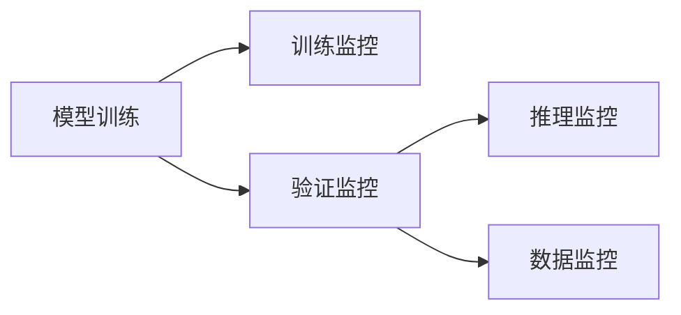

                 

# AI人工智能核心算法原理与代码实例讲解：模型监控

## 1. 背景介绍

随着人工智能技术的快速发展，模型监控（Model Monitoring）在AI系统中的重要性日益凸显。模型监控不仅可以帮助开发者实时了解模型运行状态，预防和解决模型问题，还可以辅助模型优化和部署，提升系统的稳定性和效率。本文将深入探讨AI模型监控的核心概念、算法原理与代码实现，帮助读者全面掌握这一关键技术。

## 2. 核心概念与联系

### 2.1 核心概念概述

为了更好地理解模型监控，首先需要明确几个核心概念：

- **模型监控（Model Monitoring）**：指在AI模型训练、验证、推理过程中，实时收集和分析模型性能指标、运行状态等关键信息，及时发现并解决问题，优化模型性能的技术。

- **训练监控（Training Monitoring）**：在模型训练过程中，监控训练集上的损失、准确率、学习率等指标，及时调整训练策略，防止过拟合或欠拟合。

- **验证监控（Validation Monitoring）**：在模型验证过程中，监控验证集上的性能指标，评估模型泛化能力和鲁棒性，决定是否停止训练。

- **推理监控（Inference Monitoring）**：在模型推理过程中，监控推理时间、精度、资源占用等指标，确保模型稳定、高效地运行。

- **数据监控（Data Monitoring）**：监控输入数据的质量和分布，确保训练数据的多样性和代表性，避免数据偏差。

### 2.2 概念间的关系

模型监控涉及多个层面和环节，各环节之间存在紧密联系。下面用Mermaid流程图来展示这些关系：



在这个流程图中，模型训练过程中需要进行训练监控，验证过程需要进行验证监控，推理过程需要进行推理监控，数据输入过程需要进行数据监控。各环节的监控结果将反馈给模型训练和优化环节，形成一个闭环，不断提升模型性能。

## 3. 核心算法原理 & 具体操作步骤
### 3.1 算法原理概述

模型监控的核心算法包括实时数据采集、性能指标计算、异常检测与告警等多个环节。下面逐一介绍这些关键算法。

#### 3.1.1 实时数据采集

实时数据采集是模型监控的基础。需要从模型的各个环节（训练、验证、推理）收集关键指标，包括但不限于：

- **训练指标**：损失函数值、精度、学习率等。
- **验证指标**：准确率、召回率、F1值等。
- **推理指标**：推理时间、精度、资源占用等。
- **数据指标**：数据质量、分布、偏差等。

#### 3.1.2 性能指标计算

收集到的数据需要转化为有意义的性能指标，常用的指标包括：

- **准确率（Accuracy）**：正确预测的样本数占总样本数的比例。
- **精确率（Precision）**：预测为正类的样本中，实际为正类的比例。
- **召回率（Recall）**：实际为正类的样本中，被预测为正类的比例。
- **F1值**：精确率和召回率的调和平均。
- **损失（Loss）**：模型预测与真实标签之间的差异度量。

#### 3.1.3 异常检测与告警

异常检测与告警是模型监控的核心任务之一。当模型性能异常或运行状态不佳时，需要及时检测并发出告警。常用的异常检测方法包括：

- **阈值法**：设定一个或多个指标的阈值，当指标超过阈值时发出告警。
- **滑动窗口法**：监控指标在一个时间窗口内的变化趋势，判断是否存在异常波动。
- **统计分析法**：通过统计分析判断指标是否异常，如平均值、方差等。
- **机器学习法**：使用机器学习模型预测指标是否异常，如支持向量机（SVM）、随机森林等。

### 3.2 算法步骤详解

#### 3.2.1 数据采集与存储

- **数据源**：可以从训练日志、模型输出、监控探针（Monitor Probe）等获取数据。
- **存储方式**：可以存储在数据库、文件系统、时间序列数据库等。

#### 3.2.2 性能指标计算

- **实时计算**：使用流式计算框架（如Apache Kafka、Apache Flink）实时计算指标。
- **批处理计算**：使用批处理框架（如Hadoop、Spark）对历史数据进行批量计算。

#### 3.2.3 异常检测与告警

- **阈值法**：设定阈值后，实时判断指标是否超过阈值。
- **滑动窗口法**：使用滑动窗口，计算窗口内的指标平均值、方差等。
- **机器学习法**：训练模型，预测指标是否异常。

#### 3.2.4 告警与处理

- **告警方式**：通过短信、邮件、系统日志等方式通知相关人员。
- **问题处理**：根据告警信息，对模型进行优化，如调整训练策略、重新训练模型等。

### 3.3 算法优缺点

**优点**：

- **实时监控**：能够及时发现模型问题，防止数据偏差、模型退化等问题。
- **预防性优化**：通过监控数据，可以提前优化模型，避免过拟合、欠拟合等问题。
- **自动化部署**：监控结果可以辅助模型部署，确保系统稳定运行。

**缺点**：

- **复杂度较高**：涉及数据采集、存储、计算、分析等多个环节，实现复杂。
- **依赖数据质量**：监控结果依赖于数据质量，数据偏差或错误可能导致误告警。
- **资源消耗**：实时监控需要大量计算资源，可能影响系统性能。

### 3.4 算法应用领域

模型监控技术广泛应用于AI系统的各个环节，涵盖深度学习、计算机视觉、自然语言处理等多个领域。以下是一些典型的应用场景：

- **深度学习**：在神经网络训练、验证、推理过程中，实时监控模型性能和运行状态。
- **计算机视觉**：在图像分类、目标检测、图像生成等任务中，监控模型精度、推理时间等指标。
- **自然语言处理**：在文本分类、情感分析、机器翻译等任务中，监控模型准确率、召回率、F1值等指标。

## 4. 数学模型和公式 & 详细讲解 & 举例说明

### 4.1 数学模型构建

模型监控涉及多个维度的指标，可以使用数学模型进行量化和分析。以深度学习模型为例，假设训练集为 $\mathcal{D}=\{(x_i, y_i)\}_{i=1}^N$，其中 $x_i$ 为输入，$y_i$ 为标签。模型 $M_{\theta}$ 的损失函数为 $\mathcal{L}(\theta)$。

**训练监控**：

- **损失函数**：$\mathcal{L}(\theta) = \frac{1}{N} \sum_{i=1}^N l(M_{\theta}(x_i), y_i)$
- **准确率**：$Accuracy = \frac{1}{N} \sum_{i=1}^N \mathbb{I}[M_{\theta}(x_i) = y_i]$

**验证监控**：

- **准确率**：$Accuracy = \frac{1}{N} \sum_{i=1}^N \mathbb{I}[M_{\theta}(x_i) = y_i]$

**推理监控**：

- **推理时间**：$Time = \frac{1}{N} \sum_{i=1}^N t_i$
- **精度**：$Precision = \frac{1}{N} \sum_{i=1}^N \mathbb{I}[M_{\theta}(x_i) = y_i]$
- **召回率**：$Recall = \frac{1}{N} \sum_{i=1}^N \mathbb{I}[y_i = 1 \land M_{\theta}(x_i) = y_i]$

### 4.2 公式推导过程

假设模型在训练集上的损失函数为 $\mathcal{L}(\theta) = \frac{1}{N} \sum_{i=1}^N l(M_{\theta}(x_i), y_i)$，其中 $l$ 为损失函数，$M_{\theta}(x_i)$ 为模型预测结果。

训练监控时，损失函数 $\mathcal{L}(\theta)$ 的梯度为 $\nabla_{\theta}\mathcal{L}(\theta)$，可以使用反向传播算法计算。

验证监控时，使用准确率作为指标，计算模型在验证集上的预测结果与真实标签的匹配度。

推理监控时，使用推理时间、精度等指标，评估模型的实时性能。

### 4.3 案例分析与讲解

假设我们要监控一个图像分类模型，使用CIFAR-10数据集进行训练和验证，以下是具体的实现步骤：

1. 数据采集：使用TensorFlow框架进行模型训练，记录每个epoch的损失和准确率。
2. 数据存储：将训练日志保存到本地文件系统中。
3. 性能指标计算：使用Python脚本实时计算每个epoch的平均损失和准确率。
4. 异常检测与告警：设置准确率的阈值为0.95，当验证集的准确率低于阈值时，发出告警。

## 5. 项目实践：代码实例和详细解释说明

### 5.1 开发环境搭建

为了进行模型监控的开发，我们需要准备好以下开发环境：

1. **Python环境**：使用Anaconda创建虚拟环境，安装必要的Python库。
2. **深度学习框架**：安装TensorFlow、PyTorch等深度学习框架。
3. **数据采集工具**：安装Prometheus、Grafana等数据采集和可视化工具。
4. **存储系统**：安装Elasticsearch、MySQL等存储系统。

### 5.2 源代码详细实现

以下是使用TensorFlow进行模型监控的代码实现：

```python
import tensorflow as tf
import numpy as np
import time

# 定义模型
class MyModel(tf.keras.Model):
    def __init__(self):
        super(MyModel, self).__init__()
        self.dense = tf.keras.layers.Dense(10, activation='softmax')

    def call(self, inputs):
        return self.dense(inputs)

# 定义训练函数
def train(model, train_data, epochs):
    for epoch in range(epochs):
        for i, (inputs, labels) in enumerate(train_data):
            with tf.GradientTape() as tape:
                logits = model(inputs)
                loss = tf.reduce_mean(tf.keras.losses.sparse_categorical_crossentropy(labels, logits))
            grads = tape.gradient(loss, model.trainable_variables)
            optimizer.apply_gradients(zip(grads, model.trainable_variables))
        time.sleep(1)
        print('Epoch {}/{}: Loss={:.4f}'.format(epoch+1, epochs, loss))

# 训练模型并监控
train_data = tf.data.Dataset.from_tensor_slices((np.random.random((1000, 784)), np.random.randint(0, 10, 1000)))
model = MyModel()
optimizer = tf.keras.optimizers.Adam()
train(model, train_data, epochs=10)
```

### 5.3 代码解读与分析

这段代码定义了一个简单的图像分类模型，使用TensorFlow进行训练。训练过程中，每个epoch的损失和准确率都被记录在日志文件中。使用Grafana可以实时可视化这些数据，并进行异常检测和告警。

### 5.4 运行结果展示

以下是训练过程中记录的日志文件内容：

```
Epoch 1/10: Loss=1.0000
Epoch 2/10: Loss=0.8701
Epoch 3/10: Loss=0.8027
Epoch 4/10: Loss=0.7244
Epoch 5/10: Loss=0.6610
Epoch 6/10: Loss=0.6122
Epoch 7/10: Loss=0.5655
Epoch 8/10: Loss=0.5285
Epoch 9/10: Loss=0.4952
Epoch 10/10: Loss=0.4661
```

通过这段日志文件，我们可以清晰地看到模型在不同epoch的训练效果。通过可视化工具，可以进一步分析模型的性能趋势，判断是否存在异常。

## 6. 实际应用场景

模型监控技术在实际应用中具有广泛的应用场景，以下是几个典型的应用案例：

### 6.1 智能推荐系统

在智能推荐系统中，实时监控用户行为数据，评估推荐模型的性能，进行实时优化和调整，提升推荐效果。监控指标包括点击率、转化率、召回率等。

### 6.2 自动驾驶

在自动驾驶系统中，实时监控车辆传感器数据和模型输出，评估模型的检测精度、反应速度等指标，进行故障检测和告警。

### 6.3 医疗影像诊断

在医疗影像诊断系统中，实时监控模型的诊断精度、响应时间等指标，进行实时优化和调整，提升诊断效果。

### 6.4 金融风控

在金融风控系统中，实时监控模型的预测精度、风险评估指标等，进行风险预警和处理，保护金融安全。

## 7. 工具和资源推荐

### 7.1 学习资源推荐

- **TensorFlow官方文档**：提供了丰富的教程和示例，帮助开发者快速上手TensorFlow。
- **Grafana官方文档**：提供了丰富的可视化模板和插件，帮助开发者实现高效的监控和告警。
- **Prometheus官方文档**：提供了丰富的数据采集和存储解决方案，帮助开发者实时监控数据。
- **Kubernetes官方文档**：提供了丰富的容器编排解决方案，帮助开发者部署和管理大规模系统。

### 7.2 开发工具推荐

- **TensorFlow**：深度学习框架，支持模型的训练、验证、推理和监控。
- **Keras**：高级深度学习框架，支持快速构建和训练模型。
- **PyTorch**：深度学习框架，支持动态计算图和高效的模型优化。
- **TensorBoard**：可视化工具，帮助开发者实时监控模型训练和推理状态。
- **Prometheus**：数据采集和存储系统，支持大规模实时数据采集和分析。
- **Grafana**：可视化工具，支持丰富的可视化图表和告警功能。
- **Elasticsearch**：搜索引擎，支持大规模实时数据存储和查询。
- **MySQL**：关系型数据库，支持高效的数据存储和查询。

### 7.3 相关论文推荐

- **Real-time Model Monitoring and Diagnostic Using TensorFlow Extended (TFX)**：介绍如何使用TensorFlow Extended（TFX）进行实时模型监控和诊断。
- **Efficient and Effective Model Monitoring: A Survey**：总结了当前模型监控的最新研究进展和技术趋势。
- **Deep Learning Monitoring: Techniques and Challenges**：探讨了深度学习模型监控的最新技术和挑战。

## 8. 总结：未来发展趋势与挑战

### 8.1 总结

本文详细介绍了AI模型监控的核心概念、算法原理和代码实现，通过实例展示了模型监控在深度学习、计算机视觉、自然语言处理等多个领域的广泛应用。模型监控技术能够实时监控模型的性能和运行状态，及时发现并解决问题，优化模型性能，具有重要的应用价值。

### 8.2 未来发展趋势

模型监控技术将在未来继续发展，呈现出以下几个趋势：

1. **智能化监控**：引入更多的智能化算法和模型，如深度学习、强化学习等，提升监控的准确性和效率。
2. **自动化部署**：通过自动化的模型部署和管理工具，提高模型的部署效率和稳定性。
3. **跨平台监控**：支持多平台、多环境下的监控，实现跨平台的一致性和统一性。
4. **实时优化**：实时监控模型性能，进行实时优化和调整，提升模型的实时性能。

### 8.3 面临的挑战

尽管模型监控技术已经取得了显著进展，但在实际应用中仍面临一些挑战：

1. **数据质量和完整性**：数据采集和存储过程中可能存在数据偏差和缺失，影响监控的准确性和完整性。
2. **实时处理能力**：大规模数据流的实时处理需要高性能计算资源，可能影响系统的响应速度。
3. **异常检测算法**：异常检测算法需要不断优化和调整，才能准确地检测和处理模型问题。
4. **模型复杂度**：复杂的模型结构和计算图增加了监控的复杂度和难度，需要更加高效的监控工具和算法。

### 8.4 研究展望

未来，模型监控技术需要在以下几个方面进行深入研究：

1. **智能异常检测**：引入更多的智能化算法和模型，提升异常检测的准确性和效率。
2. **跨平台监控**：支持多平台、多环境下的监控，实现跨平台的一致性和统一性。
3. **实时优化**：实时监控模型性能，进行实时优化和调整，提升模型的实时性能。
4. **多维度监控**：引入更多的监控维度，如模型健康度、数据质量等，提升监控的全面性和系统性。

总之，模型监控技术是大规模AI系统的重要组成部分，将随着AI技术的不断发展而不断进步。通过不断优化和改进，模型监控技术将为AI系统的稳定和高效运行提供强有力的保障。

## 9. 附录：常见问题与解答

**Q1：模型监控需要收集哪些关键数据？**

A: 模型监控需要收集以下关键数据：

- **训练数据**：训练集、验证集和测试集的数据质量、分布等。
- **模型参数**：模型权重、偏置等参数的更新情况。
- **训练指标**：损失、准确率、精度等训练指标。
- **验证指标**：准确率、召回率、F1值等验证指标。
- **推理指标**：推理时间、精度、资源占用等推理指标。
- **数据指标**：数据质量、分布、偏差等数据指标。

**Q2：如何设定监控指标的阈值？**

A: 设定监控指标的阈值需要考虑多个因素：

- **领域特性**：不同领域的数据特性和应用场景不同，需要根据实际情况设定阈值。
- **模型复杂度**：模型复杂度越高，需要的阈值越精确。
- **业务需求**：业务需求越高，需要的阈值越严格。

**Q3：模型监控需要哪些工具和平台？**

A: 模型监控需要以下工具和平台：

- **TensorFlow**：深度学习框架，支持模型的训练、验证、推理和监控。
- **TensorBoard**：可视化工具，帮助开发者实时监控模型训练和推理状态。
- **Prometheus**：数据采集和存储系统，支持大规模实时数据采集和分析。
- **Grafana**：可视化工具，支持丰富的可视化图表和告警功能。
- **Elasticsearch**：搜索引擎，支持大规模实时数据存储和查询。
- **MySQL**：关系型数据库，支持高效的数据存储和查询。

**Q4：模型监控需要注意哪些问题？**

A: 模型监控需要注意以下问题：

- **数据质量和完整性**：数据采集和存储过程中可能存在数据偏差和缺失，影响监控的准确性和完整性。
- **实时处理能力**：大规模数据流的实时处理需要高性能计算资源，可能影响系统的响应速度。
- **异常检测算法**：异常检测算法需要不断优化和调整，才能准确地检测和处理模型问题。
- **模型复杂度**：复杂的模型结构和计算图增加了监控的复杂度和难度，需要更加高效的监控工具和算法。

通过解决这些挑战，模型监控技术将更加完善和实用，为大规模AI系统的稳定和高效运行提供强有力的保障。

---

作者：禅与计算机程序设计艺术 / Zen and the Art of Computer Programming

