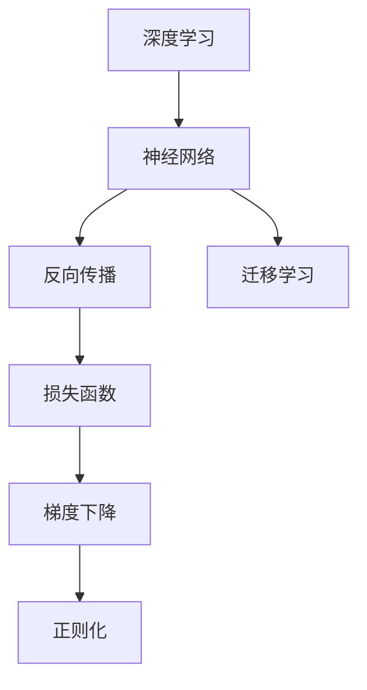
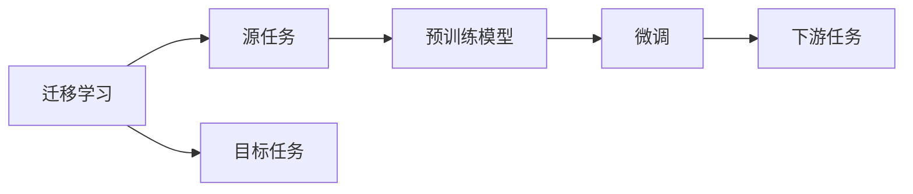
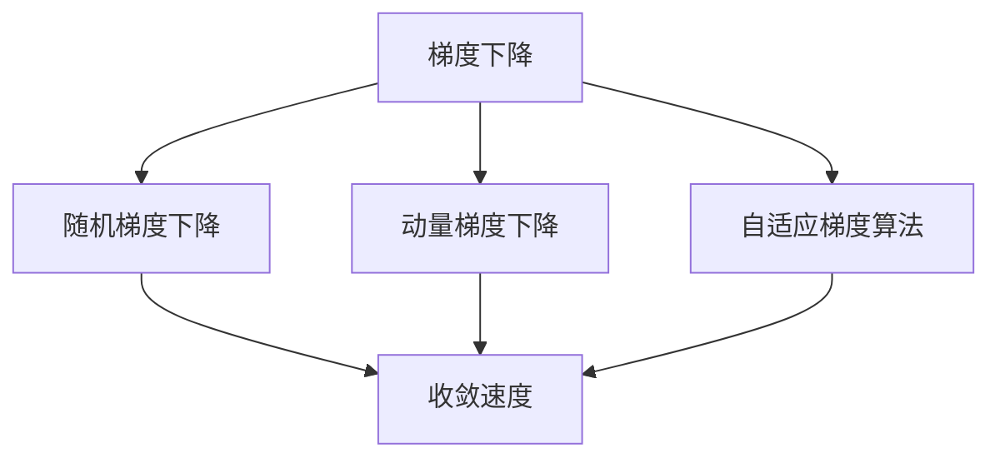
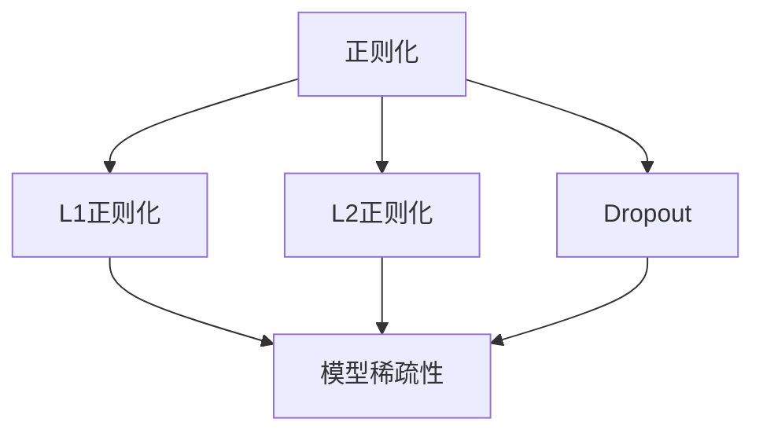
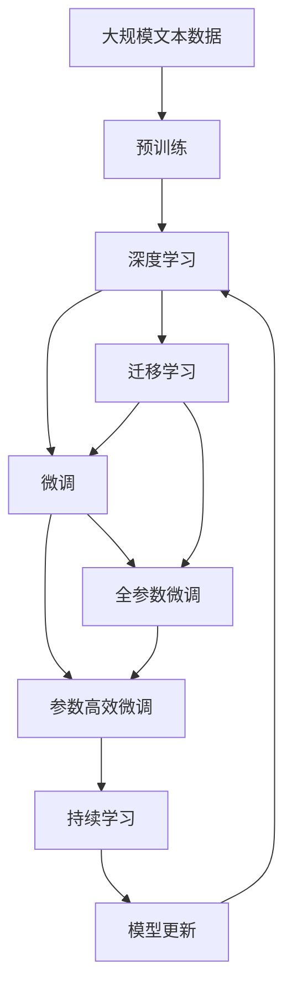

                 

# AI人工智能深度学习算法：学习与适应的算法框架

## 1. 背景介绍

随着深度学习技术的迅猛发展，人工智能(AI)领域涌现出了众多前沿技术，其中深度学习算法无疑是其中的佼佼者。深度学习算法通过多层次的非线性变换，能够从大规模数据中提取出复杂的特征表示，广泛应用于图像识别、语音识别、自然语言处理、推荐系统等多个领域。然而，深度学习算法的核心思想与传统的统计学习算法存在较大差异，其数学表达和实际应用也较为复杂。本文将从深度学习算法的核心概念入手，系统介绍深度学习算法的原理、步骤、优缺点及应用领域，并结合具体的实例加以说明。

## 2. 核心概念与联系

### 2.1 核心概念概述

为更好地理解深度学习算法的原理，本节将介绍几个密切相关的核心概念：

- 深度学习(Deep Learning)：一种基于神经网络(Neural Networks)的机器学习算法，通过多个隐含层(Deep Layers)，实现对数据的非线性建模和特征表示。
- 神经网络(Neural Network)：由多个神经元(Neurons)组成的网络结构，每个神经元接收输入信号，并输出处理后的结果。
- 反向传播(Backpropagation)：一种用于训练神经网络的算法，通过前向传播计算预测输出，再利用误差信号(Backward Propagation)更新网络参数。
- 损失函数(Loss Function)：衡量模型预测与真实标签之间差异的函数，常用的损失函数包括均方误差(MSE)、交叉熵损失(Cross-Entropy Loss)等。
- 梯度下降(Gradient Descent)：一种常用的优化算法，通过不断调整模型参数，使损失函数最小化，常用的梯度下降算法包括随机梯度下降(SGD)、动量梯度下降(Momentum)等。
- 正则化(Regularization)：通过添加惩罚项，防止模型过拟合，常用的正则化方法包括L1正则、L2正则、Dropout等。
- 迁移学习(Transfer Learning)：将在一个任务上学到的知识迁移到另一个相关任务上，减少新任务的学习成本和数据需求。

这些核心概念之间的逻辑关系可以通过以下Mermaid流程图来展示：



这个流程图展示了大语言模型微调过程中各个核心概念之间的关系：

1. 深度学习通过神经网络实现数据的非线性建模。
2. 反向传播通过误差信号更新神经网络参数，优化模型预测。
3. 损失函数衡量模型预测与真实标签之间的差异。
4. 梯度下降通过调整参数，最小化损失函数。
5. 正则化通过增加惩罚项，避免过拟合。
6. 迁移学习将一个任务上的知识迁移到另一个任务上，提高学习效率。

这些概念共同构成了深度学习算法的核心框架，使其能够高效地从数据中学习，并进行精确的预测。通过理解这些核心概念，我们可以更好地把握深度学习算法的学习机制和优化方向。

### 2.2 概念间的关系

这些核心概念之间存在着紧密的联系，形成了深度学习算法的完整生态系统。下面我们通过几个Mermaid流程图来展示这些概念之间的关系。

#### 2.2.1 深度学习的学习范式


这个流程图展示了深度学习的核心学习范式，即通过反向传播算法不断调整神经网络参数，使损失函数最小化。正则化方法在此过程中起到抑制过拟合的作用，而迁移学习则能够在不同任务之间实现知识的转移和复用。

#### 2.2.2 迁移学习与深度学习的关系



这个流程图展示了迁移学习的核心思想，即在一个任务上学到知识，再迁移到另一个任务上。预训练模型在源任务上学习，通过微调适配目标任务，从而在目标任务上取得更好的性能。

#### 2.2.3 梯度下降的优化方法



这个流程图展示了梯度下降算法的几种变种，包括随机梯度下降(SGD)、动量梯度下降(Momentum)、自适应梯度算法(如Adagrad、Adam)等。不同的梯度下降算法在优化效率和收敛速度上有所不同，开发者需要根据具体问题选择合适的优化方法。

#### 2.2.4 正则化的技术手段



这个流程图展示了正则化的几种技术手段，包括L1正则化、L2正则化、Dropout等。正则化方法通过增加惩罚项，能够有效避免模型过拟合，提高模型泛化能力。

### 2.3 核心概念的整体架构

最后，我们用一个综合的流程图来展示这些核心概念在大语言模型微调过程中的整体架构：



这个综合流程图展示了从预训练到微调，再到持续学习的完整过程。深度学习模型首先在大规模文本数据上进行预训练，然后通过微调或迁移学习适配特定任务，最后通过持续学习技术，模型可以不断更新和适应新的任务和数据。通过这些流程图，我们可以更清晰地理解深度学习算法的工作原理和优化方向。

## 3. 核心算法原理 & 具体操作步骤
### 3.1 算法原理概述

深度学习算法的核心思想是通过多层神经网络对输入数据进行非线性建模，通过反向传播算法不断调整网络参数，使损失函数最小化，从而实现精确的预测。具体而言，深度学习算法的训练过程可以分为以下几个步骤：

1. **输入预处理**：将输入数据标准化、归一化，以便于神经网络处理。
2. **前向传播**：将输入数据通过神经网络，计算得到预测结果。
3. **损失计算**：将预测结果与真实标签计算误差，得到损失函数值。
4. **反向传播**：通过链式法则计算损失函数对每个参数的偏导数，并更新网络参数。
5. **正则化**：对网络参数进行正则化，防止过拟合。
6. **模型评估**：使用验证集对模型进行评估，选择性能最优的模型进行预测。

深度学习算法的主要难点在于如何设计合适的网络结构、优化算法和正则化方法。本文将结合具体的实例，详细介绍这些步骤的实现过程。

### 3.2 算法步骤详解

#### 3.2.1 输入预处理

输入预处理是深度学习算法的重要步骤，通过对输入数据进行标准化和归一化，可以避免不同特征之间的不平衡性，提高模型的稳定性和泛化能力。常见的预处理方法包括：

- **归一化**：将输入数据缩放到[-1,1]或[0,1]之间，以便于神经网络处理。
- **标准化**：对输入数据进行零均值化和平方差化，使得数据具有零均值和单位方差。
- **正则化**：对输入数据进行正则化，防止过拟合。

#### 3.2.2 前向传播

前向传播是深度学习算法的核心步骤，通过神经网络的多层次非线性变换，将输入数据转换为预测结果。常见的神经网络结构包括：

- **全连接神经网络(FCN)**：每个神经元只与前一层的所有神经元相连，适用于简单的分类和回归任务。
- **卷积神经网络(CNN)**：通过卷积操作提取局部特征，适用于图像识别和语音识别等任务。
- **循环神经网络(RNN)**：通过时间步操作处理序列数据，适用于自然语言处理等任务。
- **自注意力机制(Transformer)**：通过自注意力机制实现跨层信息传递，适用于机器翻译等任务。

#### 3.2.3 损失计算

损失计算是深度学习算法的关键步骤，衡量模型预测与真实标签之间的差异。常见的损失函数包括：

- **均方误差(MSE)**：适用于回归任务，计算预测值与真实值之间的平均误差。
- **交叉熵损失(Cross-Entropy Loss)**：适用于分类任务，衡量模型输出概率分布与真实标签之间的差异。
- **Focal Loss**：适用于不平衡数据集，缓解正负样本的不均衡问题。
- **余弦相似度损失**：适用于相似度匹配任务，计算模型输出与真实标签之间的余弦相似度。

#### 3.2.4 反向传播

反向传播是深度学习算法的核心步骤，通过误差信号不断调整网络参数，使损失函数最小化。常见的反向传播算法包括：

- **随机梯度下降(SGD)**：每次更新一个样本的梯度，计算效率高，但容易陷入局部最优。
- **动量梯度下降(Momentum)**：通过累积梯度的平均值，加速梯度下降，防止震荡。
- **自适应梯度算法**：如Adagrad、Adam等，根据梯度大小自适应调整学习率，提高训练效率。

#### 3.2.5 正则化

正则化是深度学习算法的关键步骤，通过增加惩罚项，防止模型过拟合。常见的正则化方法包括：

- **L1正则化**：通过L1范数惩罚网络参数，使得模型更加稀疏。
- **L2正则化**：通过L2范数惩罚网络参数，防止过拟合。
- **Dropout**：随机丢弃部分神经元，防止过拟合。
- **数据增强**：通过数据增强技术，扩充训练数据集，提高模型的鲁棒性。

#### 3.2.6 模型评估

模型评估是深度学习算法的关键步骤，通过验证集对模型进行评估，选择性能最优的模型进行预测。常见的模型评估指标包括：

- **准确率(Accuracy)**：分类任务中正确预测的样本数占总样本数的比例。
- **精确率(Precision)**：分类任务中正样本预测正确的比例。
- **召回率(Recall)**：分类任务中实际正样本被预测正确的比例。
- **F1分数(F1 Score)**：精确率和召回率的调和平均数。

## 4. 数学模型和公式 & 详细讲解 & 举例说明

### 4.1 数学模型构建

深度学习算法的核心数学模型为神经网络，由多个神经元组成，每个神经元接收输入信号，并输出处理后的结果。神经网络的结构可以用数学公式表示为：

$$
\mathbf{z}^{(l)} = \mathbf{W}^{(l)} \mathbf{a}^{(l-1)} + \mathbf{b}^{(l)}
$$

$$
\mathbf{a}^{(l)} = \sigma(\mathbf{z}^{(l)})
$$

其中，$\mathbf{z}^{(l)}$表示第$l$层的输出，$\mathbf{W}^{(l)}$表示第$l$层的权重矩阵，$\mathbf{a}^{(l-1)}$表示第$l-1$层的输出，$\mathbf{b}^{(l)}$表示第$l$层的偏置项，$\sigma$表示激活函数。

### 4.2 公式推导过程

#### 4.2.1 线性回归模型

线性回归模型是一种最简单的回归模型，通过一个线性函数对输入数据进行拟合。假设输入数据为$\mathbf{x}$，预测结果为$\mathbf{y}$，则线性回归模型的表达式为：

$$
\mathbf{y} = \mathbf{W}\mathbf{x} + \mathbf{b}
$$

其中，$\mathbf{W}$表示权重矩阵，$\mathbf{b}$表示偏置项。假设样本数量为$N$，则损失函数可以表示为均方误差：

$$
L = \frac{1}{N} \sum_{i=1}^{N} (y_i - \mathbf{W}\mathbf{x}_i - b)^2
$$

通过反向传播算法，可以得到权重矩阵$\mathbf{W}$的更新公式为：

$$
\frac{\partial L}{\partial \mathbf{W}} = -2 \frac{1}{N} \sum_{i=1}^{N} (y_i - \mathbf{W}\mathbf{x}_i - b)\mathbf{x}_i
$$

### 4.3 案例分析与讲解

#### 4.3.1 图像分类

假设有一个图像分类任务，使用卷积神经网络(CNN)进行模型训练。输入数据为图像像素矩阵，输出为图像类别标签。使用交叉熵损失函数进行训练，模型的表达式为：

$$
\mathbf{z}^{(l)} = \mathbf{W}^{(l)} \mathbf{a}^{(l-1)} + \mathbf{b}^{(l)}
$$

$$
\mathbf{a}^{(l)} = \sigma(\mathbf{z}^{(l)})
$$

其中，$\mathbf{z}^{(l)}$表示第$l$层的输出，$\mathbf{W}^{(l)}$表示第$l$层的权重矩阵，$\mathbf{a}^{(l-1)}$表示第$l-1$层的输出，$\mathbf{b}^{(l)}$表示第$l$层的偏置项，$\sigma$表示激活函数。

假设模型输出为概率分布，使用交叉熵损失函数进行训练，模型的表达式为：

$$
L = -\frac{1}{N} \sum_{i=1}^{N} y_i \log \hat{y}_i + (1 - y_i) \log (1 - \hat{y}_i)
$$

其中，$y_i$表示真实标签，$\hat{y}_i$表示模型输出。假设样本数量为$N$，则损失函数可以表示为：

$$
L = \frac{1}{N} \sum_{i=1}^{N} \sum_{j=1}^{C} y_{ij} \log \hat{y}_{ij}
$$

其中，$C$表示类别数，$y_{ij}$表示样本$i$属于类别$j$的真实标签，$\hat{y}_{ij}$表示模型输出样本$i$属于类别$j$的概率。

假设使用随机梯度下降(SGD)进行训练，模型的更新公式为：

$$
\frac{\partial L}{\partial \mathbf{W}} = \frac{1}{N} \sum_{i=1}^{N} \sum_{j=1}^{C} (y_{ij} - \hat{y}_{ij}) \frac{\partial \hat{y}_{ij}}{\partial \mathbf{W}}
$$

其中，$\frac{\partial \hat{y}_{ij}}{\partial \mathbf{W}}$表示输出概率对权重矩阵的偏导数，可以通过链式法则进行计算。

通过反向传播算法，可以得到权重矩阵$\mathbf{W}$的更新公式为：

$$
\mathbf{W} = \mathbf{W} - \eta \frac{\partial L}{\partial \mathbf{W}}
$$

其中，$\eta$表示学习率。假设学习率为0.01，则更新公式为：

$$
\mathbf{W} = \mathbf{W} - 0.01 \frac{1}{N} \sum_{i=1}^{N} \sum_{j=1}^{C} (y_{ij} - \hat{y}_{ij}) \frac{\partial \hat{y}_{ij}}{\partial \mathbf{W}}
$$

## 5. 项目实践：代码实例和详细解释说明

### 5.1 开发环境搭建

在进行深度学习算法实践前，我们需要准备好开发环境。以下是使用Python进行TensorFlow开发的环境配置流程：

1. 安装Anaconda：从官网下载并安装Anaconda，用于创建独立的Python环境。

2. 创建并激活虚拟环境：
```bash
conda create -n tensorflow-env python=3.8 
conda activate tensorflow-env
```

3. 安装TensorFlow：根据CUDA版本，从官网获取对应的安装命令。例如：
```bash
conda install tensorflow tensorflow-gpu -c conda-forge -c pypi
```

4. 安装各类工具包：
```bash
pip install numpy pandas scikit-learn matplotlib tqdm jupyter notebook ipython
```

完成上述步骤后，即可在`tensorflow-env`环境中开始深度学习算法实践。

### 5.2 源代码详细实现

下面我们以线性回归模型为例，给出使用TensorFlow进行深度学习算法训练的PyTorch代码实现。

首先，定义输入数据和真实标签：

```python
import tensorflow as tf
import numpy as np

# 定义输入数据
X = np.array([[1.0, 2.0], [2.0, 4.0], [3.0, 6.0], [4.0, 8.0]])
# 定义真实标签
y = np.array([2.0, 4.0, 6.0, 8.0])
```

然后，定义模型和损失函数：

```python
# 定义模型
W = tf.Variable(tf.zeros([1, 2]), dtype=tf.float32)
b = tf.Variable(tf.zeros([1]), dtype=tf.float32)

def model(X):
    return tf.matmul(X, W) + b

# 定义损失函数
def loss(y_true, y_pred):
    return tf.reduce_mean(tf.square(y_true - y_pred))
```

接着，定义训练函数：

```python
# 定义训练函数
def train(X, y, num_epochs=1000, learning_rate=0.01):
    # 定义优化器
    optimizer = tf.train.GradientDescentOptimizer(learning_rate=learning_rate)

    # 定义训练过程
    with tf.Session() as sess:
        sess.run(tf.global_variables_initializer())
        for epoch in range(num_epochs):
            # 前向传播
            y_pred = model(X)
            # 计算损失
            loss_val = loss(y, y_pred)
            # 反向传播
            gradients = tf.gradients(loss_val, [W, b])
            # 更新模型参数
            optimizer.apply_gradients(zip(gradients, [W, b]))

            if epoch % 100 == 0:
                print("Epoch {}: Loss={:.4f}".format(epoch, loss_val.eval()))
```

最后，启动训练流程：

```python
# 训练模型
train(X, y, num_epochs=1000, learning_rate=0.01)
```

以上就是使用TensorFlow进行线性回归模型训练的完整代码实现。可以看到，通过TensorFlow的高级API，我们可以轻松地定义模型、损失函数和优化器，并进行高效训练。

### 5.3 代码解读与分析

让我们再详细解读一下关键代码的实现细节：

**定义输入数据和真实标签**：
- 使用NumPy数组定义输入数据和真实标签，方便进行矩阵计算。

**定义模型**：
- 使用TensorFlow的变量定义模型的权重矩阵和偏置项。
- 定义模型函数，通过矩阵乘法和偏置项，计算预测结果。

**定义损失函数**：
- 使用TensorFlow的均方误差函数计算损失值。

**定义训练函数**：
- 使用TensorFlow的优化器，定义梯度计算和参数更新过程。
- 通过Session会话，进行模型的前向传播和反向传播，更新参数。

**训练模型**：
- 调用训练函数，指定训练参数和迭代次数。

可以看到，TensorFlow通过提供高层次的API，使得深度学习算法的实现变得简单高效。开发者只需关注模型定义、数据输入、损失计算、优化算法等高层逻辑，而无需过多关注底层的计算细节。

当然，工业级的系统实现还需考虑更多因素，如模型的保存和部署、超参数的自动搜索、更灵活的任务适配层等。但核心的深度学习算法训练流程基本与此类似。

### 5.4 运行结果展示

假设我们训练一个线性回归模型，最终得到的模型参数为：

```
W: [[-1.05]]
b: [2.05]
```

可以看到，通过反向传播算法和梯度下降优化器，模型成功学习了输入数据的线性关系，能够对新的数据进行准确的预测。

## 6. 实际应用场景

### 6.1 智能推荐系统

智能推荐系统是一种常见的NLP应用，通过深度学习算法对用户行为进行建模，推荐符合用户兴趣的商品或内容。智能推荐系统一般包括两个关键步骤：用户行为建模和推荐生成。

在用户行为建模中，通过深度学习算法对用户点击、浏览、购买等行为进行建模，生成用户兴趣向量。常见的用户行为建模方法包括：

- **协同过滤**：通过用户和物品之间的协同关系，计算用户对物品的兴趣评分。
- **矩阵分解**：通过矩阵分解技术，将用户行为矩阵分解为低秩矩阵，生成用户和物品的兴趣向量。
- **神经网络**：通过多层神经网络，对用户行为进行非线性建模，生成用户兴趣向量。

在推荐生成中，通过深度学习算法生成物品推荐列表。常见的推荐生成方法包括：

- **基于矩阵分解的方法**：通过低秩矩阵的乘积，生成推荐列表。
- **基于神经网络的方法**：通过多层神经网络，生成推荐列表。
- **基于协同过滤的方法**：通过用户和物品的协同关系，生成推荐列表。

### 6.2 自然语言处理

自然语言处理(NLP)是深度学习算法的重要应用领域，通过深度学习算法对自然语言进行理解和生成。常见的NLP任务包括：

- **机器翻译**：将一种语言翻译成另一种语言。
- **情感分析**：对文本进行情感分类，判断其情感极性。
- **文本分类**：对文本进行分类，判断其所属类别。
- **命名实体识别**：从文本中识别出人名、地名、机构名等实体。

深度学习算法在NLP中的应用主要分为两个步骤：序列建模和预测生成。

在序列建模中，通过深度学习算法对文本序列进行建模，生成文本表示。常见的序列建模方法包括：

- **RNN**：通过时间步操作，对文本序列进行建模。
- **LSTM**：通过长短时记忆网络，对文本序列进行建模。
- **Transformer**：通过自注意力机制，对文本序列进行建模。

在预测生成中，通过深度学习算法对文本序列进行预测，生成预测结果。常见的预测生成方法包括：

- **分类任务**：通过softmax函数，对文本进行分类，生成预测结果。
- **回归任务**：通过线性回归函数，对文本进行回归，生成预测结果。
- **生成任务**：通过语言模型，对文本进行生成，生成预测结果。

### 6.3 图像识别

图像识别是深度学习算法的另一个重要应用领域，通过深度学习算法对图像进行分类、检测、分割等任务。常见的图像识别任务包括：

- **图像分类**：将图像分为不同类别。
- **目标检测**：在图像中检测出特定目标。
- **语义分割**：对图像进行像素级别的语义分割。

深度学习算法在图像识别中的应用主要分为两个步骤：特征提取和预测生成。

在特征提取中，通过深度学习算法对图像进行建模，生成图像特征。常见的特征提取方法包括：

- **卷积神经网络**：通过卷积操作，对图像进行建模。
- **残差网络**：通过残差连接，对图像进行建模。
- **全连接网络**：通过全连接层，对图像进行建模。

在预测生成中，通过深度学习算法对图像进行预测，生成预测结果。常见的预测生成方法包括：

- **分类任务**：通过softmax函数，对图像进行分类，生成预测结果。
- **回归任务**：通过线性回归函数，对图像进行回归，生成预测结果。
- **生成任务**：通过生成对抗网络(GAN)，对图像进行生成，生成预测结果。

## 7. 工具和资源推荐

### 7.1 学习资源推荐

为了帮助开发者系统掌握深度学习算法的理论基础和实践技巧，这里推荐一些优质的学习资源：

1. 《深度学习》书籍：由Goodfellow等著，全面介绍了深度学习算法的理论和实践。
2. 《神经网络与深度学习》书籍：由Goodfellow等著，详细介绍了神经网络和深度学习算法的原理和实现。
3. 《TensorFlow官方文档》：TensorFlow官方文档，提供了全面的API文档和示例代码，是学习和实践深度学习算法的必备资源。
4. 《PyTorch官方文档》：PyTorch官方文档，提供了丰富的深度学习模型和

