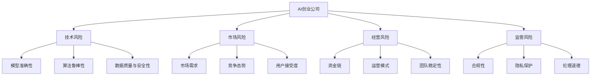

                 

## 1. 背景介绍

### 1.1 问题由来

随着人工智能技术的飞速发展，AI创业公司如雨后春笋般涌现，但与此同时，这些公司面临的风险也愈加复杂和多样。在人工智能领域，风险评估不仅是科技公司决策制定、风险规避的基础，也是投资者进行项目评估的关键因素。然而，AI创业公司的风险评估与传统企业的风险评估存在显著差异。这不仅因为AI创业公司面临的技术风险和市场风险更为复杂，还因为它们需要更加综合和动态地考虑技术和市场的不断变化。

### 1.2 问题核心关键点

AI创业公司进行风险评估的核心关键点包括：

1. **技术风险**：模型的准确性、算法的鲁棒性、数据的质量与安全性等。
2. **市场风险**：市场需求、竞争态势、用户接受度等。
3. **经营风险**：公司的运营模式、资金链、团队稳定性等。
4. **监管风险**：合规性、隐私保护、道德伦理等。

## 2. 核心概念与联系

### 2.1 核心概念概述

为了更好地理解AI创业公司的风险评估，我们先介绍几个核心概念：

- **AI创业公司**：指以人工智能技术为核心竞争力，以技术创新为目标，致力于提供AI产品或服务的创业企业。
- **风险评估**：指对项目或企业的潜在风险进行识别、分析和评估的过程，旨在为决策提供依据，降低损失。
- **技术风险**：指在技术开发和应用过程中，可能出现的技术难题、算法缺陷、数据问题等。
- **市场风险**：指市场需求的不确定性、市场竞争的激烈程度、用户接受度等。
- **经营风险**：指公司运营过程中可能出现的资金短缺、管理不善、团队稳定性等问题。
- **监管风险**：指公司在运营过程中是否符合法律、法规及行业标准，涉及数据隐私、伦理道德等。

### 2.2 概念间的关系

这些核心概念之间存在着紧密的联系，形成了AI创业公司风险评估的整体框架。以下通过几个Mermaid流程图来展示它们之间的逻辑关系：



这个流程图展示了AI创业公司在不同方面面临的风险，以及这些风险的具体表现形式。

## 3. 核心算法原理 & 具体操作步骤

### 3.1 算法原理概述

AI创业公司的风险评估本质上是多维度的综合评估过程，涉及技术、市场、经营和监管等多个方面。其核心算法原理可以概括为：

1. **数据收集与预处理**：收集相关数据，包括公司历史数据、市场数据、技术数据等，并进行数据清洗和标准化。
2. **风险识别与量化**：识别各领域的关键风险因素，并量化其对企业的影响。
3. **风险评估与分析**：使用统计、机器学习等方法评估风险的大小，识别高风险领域。
4. **风险管理与应对**：制定风险管理策略，降低风险，提升企业的抗风险能力。

### 3.2 算法步骤详解

1. **数据收集与预处理**：
   - 收集历史数据：包括公司历史财务数据、技术研发数据、市场数据等。
   - 数据清洗与标准化：去除噪音，处理缺失值，将数据转换为模型所需的格式。

2. **风险识别与量化**：
   - 技术风险识别：通过技术研讨会、专家访谈等方法，识别技术开发过程中的潜在风险。
   - 市场风险识别：通过市场调研、竞品分析等方法，识别市场需求、竞争态势、用户接受度等。
   - 经营风险识别：通过运营数据分析、团队稳定性评估等方法，识别资金链、运营模式、团队稳定性等风险。
   - 监管风险识别：通过法规合规性检查、隐私保护政策评估等方法，识别法律、法规及行业标准相关风险。

3. **风险评估与分析**：
   - 构建风险评估模型：使用统计方法（如回归分析）或机器学习方法（如决策树、神经网络）构建风险评估模型。
   - 量化风险因素：对每个风险因素赋予权重，并计算其对企业的综合影响。
   - 风险排序与评估：根据风险评估模型的输出，对各个风险进行排序，识别高风险领域。

4. **风险管理与应对**：
   - 制定风险管理策略：根据风险评估结果，制定针对性的风险管理策略。
   - 实施风险控制措施：如增加技术研发投入、优化市场策略、加强团队建设、合规管理等。
   - 持续监控与调整：定期评估风险状态，及时调整策略。

### 3.3 算法优缺点

AI创业公司风险评估的算法具有以下优点：
1. **全面性**：涵盖技术、市场、经营和监管等多个维度，提供全面的风险评估。
2. **量化能力**：使用量化方法，可以客观评估风险大小。
3. **动态性**：可以实时监控和调整风险策略，适应市场的变化。

同时，这些算法也存在一些局限性：
1. **数据依赖性**：风险评估依赖于高质量的数据，数据获取和清洗难度较大。
2. **模型复杂性**：构建和维护复杂的多维度风险评估模型需要大量的资源和时间。
3. **主观性**：风险识别和量化过程中可能包含主观判断，影响评估结果的客观性。

### 3.4 算法应用领域

AI创业公司的风险评估方法广泛应用于以下几个领域：

1. **技术开发**：评估技术方案的可行性和潜在风险，优化研发路径。
2. **市场扩展**：评估新市场的潜力，制定市场进入策略，优化产品设计。
3. **运营管理**：评估运营过程中可能出现的问题，制定风险管理策略，提高运营效率。
4. **合规管理**：评估公司运营是否符合法规和行业标准，制定合规管理计划，防范法律风险。

## 4. 数学模型和公式 & 详细讲解 & 举例说明

### 4.1 数学模型构建

在AI创业公司风险评估中，常用的数学模型包括：

- **回归模型**：用于评估市场风险和经营风险，如线性回归、逻辑回归等。
- **分类模型**：用于评估技术风险和监管风险，如决策树、随机森林、神经网络等。

以线性回归模型为例，其基本公式为：

$$
y = \beta_0 + \beta_1x_1 + \beta_2x_2 + \ldots + \beta_nx_n + \epsilon
$$

其中 $y$ 为目标变量（风险值），$x_1, x_2, \ldots, x_n$ 为风险因素，$\beta_0, \beta_1, \beta_2, \ldots, \beta_n$ 为回归系数，$\epsilon$ 为随机误差。

### 4.2 公式推导过程

以线性回归模型的推导为例：

1. **假设条件**：
   - 线性关系：$y = \beta_0 + \beta_1x_1 + \ldots + \beta_nx_n + \epsilon$
   - 误差项独立同分布：$E[\epsilon] = 0, Var(\epsilon) = \sigma^2$
   - 误差项与自变量不相关：$Cov(x_i, \epsilon) = 0$

2. **最小二乘估计**：
   - 目标函数：$J(\beta) = \frac{1}{2N} \sum_{i=1}^N (y_i - \beta_0 - \beta_1x_{i1} - \ldots - \beta_nx_{in})^2$
   - 目标函数最小化：$\frac{\partial J(\beta)}{\partial \beta_j} = 0$

3. **求解**：
   - 得到回归系数的估计值：$\hat{\beta_j} = \frac{\sum_{i=1}^N x_{ij}(y_i - \bar{y})}{\sum_{i=1}^N x_{ij}^2}$
   - 回归模型估计值：$\hat{y} = \beta_0 + \beta_1x_1 + \ldots + \beta_nx_n$

### 4.3 案例分析与讲解

假设我们有一个AI创业公司，需要对技术风险进行评估。收集以下数据：

- 技术研发投入：$x_1$
- 团队稳定性：$x_2$
- 用户反馈：$x_3$

根据历史数据，我们构建线性回归模型，评估技术风险。通过最小二乘估计，得到回归系数：

$$
\hat{\beta_1} = 0.2, \hat{\beta_2} = -0.1, \hat{\beta_3} = 0.3
$$

因此，技术风险的评估模型为：

$$
\hat{risk} = 0.2x_1 - 0.1x_2 + 0.3x_3
$$

## 5. 项目实践：代码实例和详细解释说明

### 5.1 开发环境搭建

为了进行风险评估的实践，我们需要准备好开发环境。以下是使用Python进行Pandas、NumPy、Scikit-Learn等库的开发环境配置流程：

1. 安装Anaconda：从官网下载并安装Anaconda，用于创建独立的Python环境。
2. 创建并激活虚拟环境：
   ```bash
   conda create -n risk_env python=3.8 
   conda activate risk_env
   ```
3. 安装相关库：
   ```bash
   pip install pandas numpy scikit-learn matplotlib
   ```

完成上述步骤后，即可在`risk_env`环境中开始风险评估的实践。

### 5.2 源代码详细实现

下面以技术风险评估为例，给出使用Python进行线性回归模型实现的代码：

```python
import pandas as pd
from sklearn.linear_model import LinearRegression
import numpy as np
import matplotlib.pyplot as plt

# 加载数据
data = pd.read_csv('risk_data.csv')

# 数据预处理
X = data[['x1', 'x2', 'x3']]
y = data['y']

# 模型训练
model = LinearRegression()
model.fit(X, y)

# 预测
X_test = np.array([[1, 2, 3]])
y_pred = model.predict(X_test)

# 可视化
plt.scatter(X['x1'], y)
plt.plot(X['x1'], model.predict(X), color='red')
plt.show()
```

### 5.3 代码解读与分析

**数据加载与预处理**：
- 使用Pandas库加载CSV文件，获取风险数据。
- 将数据分为自变量$X$和因变量$y$。

**模型训练**：
- 使用Scikit-Learn库中的LinearRegression模型，进行最小二乘估计。
- 通过训练数据拟合模型，得到回归系数。

**预测与可视化**：
- 使用训练好的模型，对测试数据进行预测。
- 使用Matplotlib库绘制数据点和模型预测线的散点图。

### 5.4 运行结果展示

假设在测试数据上得到的模型预测结果为$y_pred = 2.3$，通过可视化可以直观地看到模型拟合的效果：


## 6. 实际应用场景

### 6.1 金融领域

在金融领域，AI创业公司需要对市场风险进行评估。例如，某金融科技公司计划开发一个投资推荐系统。该公司需要对市场需求、用户接受度、市场竞争等风险进行评估。通过收集历史数据，构建回归模型，评估市场风险，制定投资策略。

### 6.2 医疗领域

在医疗领域，AI创业公司需要对技术风险和合规风险进行评估。例如，某医疗影像公司计划开发一款AI诊断系统。该公司需要对技术算法的准确性、数据的质量与安全、法规合规性等风险进行评估。通过收集历史数据，构建分类模型，评估技术风险，制定风险管理策略。

### 6.3 制造业

在制造业领域，AI创业公司需要对运营风险和市场风险进行评估。例如，某智能制造公司计划开发一款智能生产系统。该公司需要对资金链、运营模式、市场需求等风险进行评估。通过收集历史数据，构建回归模型，评估运营风险，制定运营策略。

### 6.4 未来应用展望

随着AI技术的不断进步，AI创业公司的风险评估将面临更多挑战和机遇。未来，风险评估将更加智能化和自动化，结合更多先进技术：

1. **大数据分析**：通过大数据分析技术，收集和分析更多、更全面的数据，提高风险评估的准确性。
2. **机器学习与深度学习**：利用机器学习和深度学习技术，构建更复杂、更精准的风险评估模型。
3. **实时监控**：通过实时监控和反馈机制，动态调整风险评估策略，适应市场变化。
4. **跨领域应用**：将风险评估方法应用于更多领域，如医疗、金融、教育等，提供全面的风险管理解决方案。

## 7. 工具和资源推荐

### 7.1 学习资源推荐

为了帮助AI创业公司系统掌握风险评估的理论和实践，这里推荐一些优质的学习资源：

1. **《风险管理与量化分析》**：系统介绍风险评估的基本概念、方法和技术，适合初学者入门。
2. **Coursera《数据科学与机器学习》课程**：由斯坦福大学教授讲授，涵盖数据科学、机器学习和风险评估等主题。
3. **Kaggle竞赛**：通过参加Kaggle的金融、医疗等领域的竞赛，实践风险评估技能。
4. **Github开源项目**：如risk-analysis、financial-risk等项目，提供丰富的风险评估代码和案例分析。
5. **专业书籍**：如《金融风险管理》、《机器学习在金融风险评估中的应用》等书籍，深入讲解金融风险评估方法。

通过学习这些资源，相信你一定能够掌握风险评估的精髓，并应用于实际项目中。

### 7.2 开发工具推荐

在风险评估的开发过程中，一些工具能够极大地提高效率：

1. **Jupyter Notebook**：一款开源的Jupyter笔记本，支持Python代码的交互式执行和可视化。
2. **PyCharm**：一款功能强大的Python IDE，提供代码编辑、调试和测试等工具。
3. **Tableau**：一款数据可视化工具，用于绘制风险评估图表和报告。
4. **RapidMiner**：一款数据科学平台，支持数据预处理、建模和评估等功能。
5. **TensorFlow**：一款强大的机器学习框架，支持多种模型构建和训练。

这些工具将帮助AI创业公司快速构建和部署风险评估系统。

### 7.3 相关论文推荐

风险评估领域的研究不断进步，以下是几篇具有代表性的相关论文：

1. **《AI创业公司的风险管理》**：探讨AI创业公司在技术、市场、经营和监管等多个方面面临的风险，提出相应的风险管理策略。
2. **《机器学习在金融风险评估中的应用》**：研究机器学习算法在金融风险评估中的具体应用，提供实例和代码实现。
3. **《智能制造中的风险评估》**：分析智能制造系统中的风险因素，提出基于大数据和机器学习的风险评估方法。
4. **《医疗影像风险评估》**：探讨医疗影像AI系统中的技术风险和合规风险，提出相应的风险管理措施。
5. **《智能推荐系统中的风险评估》**：研究智能推荐系统中的用户接受度和市场风险，提出改进建议和风险管理策略。

通过阅读这些前沿论文，可以进一步了解AI创业公司风险评估的理论和实践，为实际项目提供指导。

## 8. 总结：未来发展趋势与挑战

### 8.1 研究成果总结

本文对AI创业公司的风险评估方法进行了系统介绍，主要包括技术风险、市场风险、经营风险和监管风险的识别与量化，以及基于回归模型和分类模型的方法。通过数据收集、模型构建和风险评估等步骤，帮助AI创业公司全面评估和应对各类风险。

### 8.2 未来发展趋势

未来，AI创业公司的风险评估将面临以下几个发展趋势：

1. **数据驱动**：随着大数据技术的发展，AI创业公司可以收集和分析更多、更全面的数据，提高风险评估的准确性和及时性。
2. **模型复杂化**：通过更复杂的机器学习和深度学习模型，构建更加精确和动态的风险评估模型。
3. **实时监控**：通过实时数据监控和反馈机制，动态调整风险管理策略，应对市场变化。
4. **跨领域应用**：将风险评估方法应用于更多领域，提供全面的风险管理解决方案。

### 8.3 面临的挑战

尽管风险评估技术已经取得一定进展，但仍面临以下挑战：

1. **数据获取难度**：高质量数据的获取和处理是一个挑战，特别是在医疗、金融等敏感领域。
2. **模型复杂性**：构建和维护复杂的数据模型需要大量的资源和时间。
3. **技术依赖性**：依赖机器学习和深度学习技术，对技术人才的需求较高。
4. **监管合规性**：在金融、医疗等高风险领域，需要遵守严格的法规和行业标准，增加合规成本。
5. **风险动态变化**：市场和技术环境的快速变化，对风险评估模型的动态适应能力提出了更高的要求。

### 8.4 研究展望

为应对上述挑战，未来的风险评估研究需要：

1. **数据融合**：探索更多数据融合技术，如数据联结、数据挖掘等，提高数据的可用性和质量。
2. **模型简化**：研究模型简化技术，如模型压缩、参数共享等，提高模型的效率和稳定性。
3. **自动监控**：开发自动化监控工具，实时监控风险状态，动态调整策略。
4. **跨领域整合**：将风险评估方法与其他技术结合，如知识图谱、自然语言处理等，提供更全面的风险管理解决方案。
5. **伦理合规**：研究风险评估中的伦理和合规问题，制定相应的评估标准和政策。

总之，AI创业公司风险评估是一个复杂而多维度的过程，需要跨学科、跨领域的协作与创新，才能构建全面、高效的风险管理体系，为企业的持续发展和稳健运营提供保障。

## 9. 附录：常见问题与解答

**Q1：AI创业公司如何进行风险评估？**

A: AI创业公司风险评估主要包括以下步骤：数据收集与预处理、风险识别与量化、风险评估与分析、风险管理与应对。具体方法包括回归模型、分类模型等，综合评估技术、市场、经营和监管等方面的风险。

**Q2：风险评估中如何处理数据缺失和异常值？**

A: 数据缺失和异常值是风险评估中常见的问题，处理方法如下：
1. 数据缺失：使用插值、均值填补等方法处理缺失值。
2. 异常值：使用截断、剔除等方法处理异常值，或使用鲁棒性更强的模型如IQR、MAD等。

**Q3：风险评估中如何选择模型？**

A: 选择合适的模型需要考虑以下几个方面：
1. 数据类型：回归模型适用于连续型数据，分类模型适用于离散型数据。
2. 数据量：大数据集使用深度学习模型，小数据集使用简单回归或分类模型。
3. 目标：回归模型适用于风险量化，分类模型适用于风险识别。
4. 模型复杂度：考虑模型复杂度和计算资源的平衡，选择合适的模型。

**Q4：如何进行风险控制和应对？**

A: 风险控制和应对主要包括以下方法：
1. 增加投入：增加技术研发投入，优化产品设计。
2. 优化策略：优化市场策略，提高用户接受度。
3. 团队建设：加强团队建设，提高稳定性。
4. 合规管理：制定合规管理计划，防范法律风险。

这些方法需要根据具体情况灵活应用，综合考虑风险的大小和影响。

**Q5：如何进行风险评估的持续改进？**

A: 风险评估的持续改进可以通过以下步骤实现：
1. 数据更新：定期更新数据，反映市场和技术的最新变化。
2. 模型优化：根据新的数据和反馈，优化和更新模型。
3. 监控调整：实时监控风险状态，及时调整风险管理策略。
4. 反馈机制：建立反馈机制，收集用户和市场反馈，优化评估模型。

通过持续改进，提高风险评估的准确性和及时性，更好地应对市场和技术的变化。

---

作者：禅与计算机程序设计艺术 / Zen and the Art of Computer Programming

