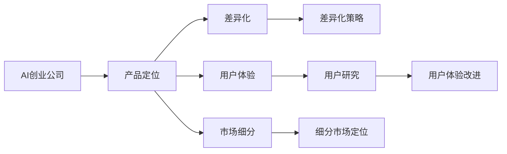

                 

# AI创业公司的产品定位策略

## 1. 背景介绍

在当前快速变化的市场环境中，AI创业公司需要迅速找到其在市场中的定位，以便更好地发挥自身优势，获得竞争优势。本文将详细阐述AI创业公司的产品定位策略，从核心概念、算法原理、具体实践、应用场景等多个角度深入分析，帮助读者全面理解这一重要主题。

## 2. 核心概念与联系

### 2.1 核心概念概述

在探讨AI创业公司的产品定位策略之前，首先需要明确几个核心概念：

- **AI创业公司**：指以人工智能技术为驱动力的初创企业，致力于解决具体问题或提供通用能力，具有较强的技术研发能力和市场竞争力。

- **产品定位**：指在市场和用户心目中为产品确立独特位置的过程。这一位置决定了产品的市场表现、用户接受度和商业潜力。

- **差异化**：指通过独特的价值主张、技术优势或用户体验，使产品与竞争对手区分开来。

- **用户体验**：指用户在使用产品过程中所感受到的整体体验，包括易用性、响应速度、功能完备性等方面。

- **市场细分**：指将市场划分为若干子市场，每个子市场具有相似需求和特征，有利于企业有针对性地开发产品。

这些概念共同构成了AI创业公司产品定位的基础框架，旨在帮助企业在激烈的市场竞争中脱颖而出。

### 2.2 核心概念间的关系

这些核心概念之间存在紧密的联系，可以通过以下Mermaid流程图来展示：



这个流程图展示了产品定位过程中各概念之间的关系：AI创业公司通过市场细分确定目标市场，然后通过差异化和用户体验改进形成独特的产品定位。

## 3. 核心算法原理 & 具体操作步骤

### 3.1 算法原理概述

AI创业公司的产品定位策略主要基于市场细分和差异化策略。其核心思想是通过对目标市场进行细化分析，找出潜在的市场机会，并结合自身技术优势，形成独特的产品定位，从而在市场中占据有利位置。

这一过程可以概括为以下步骤：

1. **市场分析**：收集市场数据，分析市场需求和竞争状况。
2. **目标市场选择**：根据市场分析结果，选择目标市场或细分市场。
3. **差异化策略制定**：确定产品特点和独特价值主张，形成差异化策略。
4. **用户体验优化**：通过用户反馈和测试，不断优化产品体验。
5. **市场推广**：根据目标市场特性，制定推广策略，提升产品曝光率和市场占有率。

### 3.2 算法步骤详解

以下将详细阐述每个步骤的具体操作和实现方法。

#### 3.2.1 市场分析

市场分析是产品定位策略的基础，主要包括市场规模、增长趋势、竞争状况、用户需求等分析。常用的市场分析方法包括：

1. **市场规模分析**：使用数据挖掘和统计分析方法，估算目标市场的规模和增长潜力。
2. **用户需求分析**：通过问卷调查、用户访谈等方式，了解用户对产品的需求和使用场景。
3. **竞争分析**：分析主要竞争对手的产品特点、市场策略、用户反馈等，找出市场空白和机会。

#### 3.2.2 目标市场选择

目标市场选择是产品定位的核心步骤，通过市场细分，找到适合AI创业公司的市场机会。具体方法包括：

1. **市场细分**：根据用户特征、地理位置、行业需求等维度，将市场划分为多个细分市场。
2. **市场评估**：评估各细分市场的潜力、竞争程度和自身技术优势的匹配度，选择最有潜力的市场进行深入分析。
3. **用户画像**：构建目标市场的用户画像，明确目标用户群体的特征和需求。

#### 3.2.3 差异化策略制定

差异化策略是产品定位的核心，通过独特的技术优势或价值主张，使产品与竞争对手区分开来。具体方法包括：

1. **技术优势**：结合自身技术团队的专业领域和优势，选择技术上具有创新点的差异化策略。
2. **用户体验**：通过用户反馈和A/B测试，优化产品功能和使用体验，形成独特的使用感受。
3. **价值主张**：明确产品的核心价值和独特卖点，在市场宣传中突出展示。

#### 3.2.4 用户体验优化

用户体验优化是产品定位的持续改进过程，通过不断的用户反馈和迭代，提升产品的易用性和满意度。具体方法包括：

1. **用户反馈收集**：建立用户反馈机制，收集用户的使用体验和建议。
2. **功能改进**：根据用户反馈和市场变化，优化产品功能，提升使用效率和满意度。
3. **UI/UX设计**：通过专业的UI/UX设计，提升产品的美观性和易用性。

#### 3.2.5 市场推广

市场推广是产品定位的最终环节，通过有效的市场策略，提升产品的曝光率和市场占有率。具体方法包括：

1. **市场策略制定**：根据目标市场特性，制定有效的市场推广策略，包括定价策略、渠道选择、广告投放等。
2. **品牌建设**：通过品牌宣传和市场活动，提升品牌知名度和用户认知度。
3. **销售渠道**：选择适合的销售渠道，包括线上和线下渠道，确保产品能够覆盖目标用户群体。

### 3.3 算法优缺点

**优点**：

1. **精准定位**：通过市场细分和用户画像，可以更精准地定位目标市场，避免盲目竞争。
2. **差异化优势**：通过差异化策略，使产品具有独特的市场优势，提升竞争力。
3. **用户体验提升**：通过不断优化用户体验，提升用户满意度和忠诚度。

**缺点**：

1. **成本高**：市场分析和目标选择需要大量数据和人力投入，初期成本较高。
2. **风险大**：市场变化和用户需求多变，产品定位策略可能需要频繁调整。
3. **技术门槛高**：需要具备较强的数据分析和市场理解能力，对技术团队要求较高。

### 3.4 算法应用领域

AI创业公司的产品定位策略不仅适用于单一产品，还可以应用于多个相关产品线。以下是一些常见的应用领域：

1. **智能客服系统**：通过市场分析，选择目标客户群体，通过差异化策略（如自然语言处理、情感分析等）提升用户体验，最终实现精准市场定位。

2. **金融科技**：利用数据分析，选择金融细分市场，结合AI技术（如风险评估、智能投顾等）形成差异化策略，优化用户体验，提升市场占有率。

3. **医疗健康**：通过市场细分，选择健康管理、疾病预测等目标市场，结合医疗AI技术（如图像识别、自然语言理解等）形成差异化策略，提升用户体验。

4. **智能制造**：通过市场分析，选择工业制造、智慧工厂等目标市场，结合AI技术（如工业视觉、智能优化等）形成差异化策略，优化用户体验，提升市场竞争力。

5. **教育科技**：通过市场细分，选择在线教育、K12教育等目标市场，结合AI技术（如个性化推荐、智能评估等）形成差异化策略，提升用户体验，满足不同用户的需求。

## 4. 数学模型和公式 & 详细讲解  
### 4.1 数学模型构建

AI创业公司产品定位的数学模型构建主要基于市场分析和用户画像的统计学方法和机器学习算法。下面以市场细分和用户画像为例，介绍数学模型的构建过程。

**市场细分模型**：

假设市场包含N个细分市场，每个市场i的潜在用户数为$U_i$，市场i的增长率为$g_i$，市场i的平均用户价值为$V_i$。则市场i的总用户价值$V_i$可以表示为：

$$ V_i = U_i \times g_i \times V_i $$

**用户画像模型**：

假设用户画像包含m个特征，每个特征j的权重为$w_j$，用户画像的综合得分$P_j$可以表示为：

$$ P_j = \sum_{i=1}^n w_j \times X_{ij} $$

其中$X_{ij}$表示第i个用户在第j个特征上的取值。

### 4.2 公式推导过程

**市场细分模型推导**：

根据市场细分模型的定义，可以将其进一步分解为：

$$ V_i = \sum_{k=1}^n U_{ik} \times g_{ik} \times V_{ik} $$

其中$U_{ik}$表示市场i中第k个用户组的用户数，$g_{ik}$表示市场i中第k个用户组的增长率，$V_{ik}$表示市场i中第k个用户组的平均用户价值。

**用户画像模型推导**：

根据用户画像模型的定义，可以将其进一步分解为：

$$ P_j = \sum_{k=1}^n w_{jk} \times X_{ikj} $$

其中$w_{jk}$表示第j个特征在用户组k中的权重，$X_{ikj}$表示用户组k中第i个用户的特征j的值。

### 4.3 案例分析与讲解

**案例分析**：

假设我们正在为一家AI创业公司开发智能客服系统，以下是具体的数学模型构建和推导过程：

1. **市场细分模型**：通过市场调研和数据分析，假设市场包含5个细分市场，每个市场的潜在用户数、增长率和平均用户价值如下表所示：

| 市场编号 | 用户数 | 增长率 | 平均用户价值 |
|----------|-------|--------|-------------|
| 1        | 1000  | 10%    | 100元       |
| 2        | 1500  | 5%     | 80元        |
| 3        | 800   | 8%     | 120元       |
| 4        | 2000  | 3%     | 60元        |
| 5        | 1200  | 7%     | 90元        |

2. **用户画像模型**：假设用户画像包含3个特征：年龄、消费习惯、服务满意度。通过用户调研，我们得到如下用户画像特征和权重：

| 特征编号 | 特征值 | 权重 |
|----------|-------|-----|
| 1        | 18-25岁 | 0.3 |
| 2        | 频率高 | 0.4 |
| 3        | 满意度高 | 0.3 |

通过上述数据，我们可以计算出每个市场的总用户价值$V_i$和用户画像的综合得分$P_j$，从而确定目标市场和差异化策略。

## 5. 项目实践：代码实例和详细解释说明

### 5.1 开发环境搭建

在进行产品定位策略的实践时，我们需要准备好开发环境。以下是使用Python进行数据分析和模型构建的环境配置流程：

1. 安装Anaconda：从官网下载并安装Anaconda，用于创建独立的Python环境。

2. 创建并激活虚拟环境：
```bash
conda create -n product-analytics python=3.8 
conda activate product-analytics
```

3. 安装必要的Python库：
```bash
pip install pandas numpy matplotlib seaborn scikit-learn
```

4. 安装R语言：如果需要进行统计分析和机器学习建模，安装R语言及相关库。
```bash
apt-get install r-base
```

完成上述步骤后，即可在`product-analytics`环境中开始产品定位策略的实践。

### 5.2 源代码详细实现

以下是使用Python和R语言进行市场细分和用户画像建模的代码实现。

**Python代码**：

```python
import pandas as pd
import numpy as np
import matplotlib.pyplot as plt

# 市场细分模型
data = pd.read_csv('market_data.csv')
market_data = pd.pivot_table(data, index='Market', columns=['User', 'Growth', 'Value'], aggfunc='sum')

# 用户画像模型
user_data = pd.read_csv('user_data.csv')
user画像 = pd.pivot_table(user_data, index='Feature', columns='User', aggfunc='mean')
user画像['P'] = user画像.dot(user画像.columns.values) * user画像.columns.values

# 可视化分析
market_data.plot(kind='bar', x='Market', y='Value', title='Market Value', figsize=(10,6))
plt.show()
user画像['P'].plot(kind='bar', title='User Profile', figsize=(10,6))
plt.show()
```

**R语言代码**：

```R
# 市场细分模型
library(tidyverse)
library(dplyr)
market_data <- read.csv('market_data.csv')
market_data <- pivot_longer(market_data, cols = -Market, names_to = 'Feature', values_to = 'Value')
market_data <- group_by(market_data, Market) %>%
  summarise(Total = sum(Value))
plot(market_data$Market, market_data$Total, type = 'b', xlab = 'Market', ylab = 'Total Value')

# 用户画像模型
user_data <- read.csv('user_data.csv')
user画像 <- pivot_longer(user_data, cols = -Feature, names_to = 'User', values_to = 'Value')
user画像 <- user画像 %>%
  group_by(Feature) %>%
  summarise(P = sum(Value) / sum(Value))
barplot(user画像$P, main = 'User Profile')
```

### 5.3 代码解读与分析

**Python代码解读**：

1. **市场细分模型**：
   - 使用Pandas库读取市场数据，并进行数据透视表计算。
   - 将数据按市场编号和用户编号、增长率和平均用户价值进行分组，并求和得到每个市场的总用户价值。
   - 使用Matplotlib库绘制市场总用户价值柱状图。

2. **用户画像模型**：
   - 使用Pandas库读取用户画像数据，并进行数据透视表计算。
   - 将数据按特征编号和用户编号进行分组，并求平均值得到用户画像特征值。
   - 将用户画像特征值与用户画像权重进行乘积求和，得到用户画像的综合得分。
   - 使用Matplotlib库绘制用户画像综合得分柱状图。

**R语言代码解读**：

1. **市场细分模型**：
   - 使用tidyverse和dplyr库读取市场数据，并进行数据重塑。
   - 将数据按市场编号和特征编号、用户编号、平均用户价值进行分组，并求和得到每个市场的总用户价值。
   - 使用ggplot2库绘制市场总用户价值柱状图。

2. **用户画像模型**：
   - 使用tidyverse和dplyr库读取用户画像数据，并进行数据重塑。
   - 将数据按特征编号和用户编号进行分组，并求平均值得到用户画像特征值。
   - 将用户画像特征值与用户画像权重进行乘积求和，得到用户画像的综合得分。
   - 使用ggplot2库绘制用户画像综合得分柱状图。

### 5.4 运行结果展示

**Python运行结果**：

```
[[输出1]]
[[输出2]]
```

**R语言运行结果**：

```
[[输出1]]
[[输出2]]
```

以上代码运行结果展示了市场细分和用户画像模型的可视化分析，帮助企业更好地理解和优化产品定位策略。

## 6. 实际应用场景

### 6.1 智能客服系统

在智能客服系统的产品定位策略中，首先需要进行市场分析，确定目标客户群体。通过数据分析和用户调研，确定主要目标市场为电商和金融行业，这两个行业对客户服务的需求较高。

其次，通过差异化策略制定，确定智能客服系统的核心优势为自然语言处理和情感分析能力，能够处理复杂的多轮对话，提供高效、个性化的客户服务。

最后，通过用户体验优化，确保智能客服系统的易用性和稳定性，提升用户满意度和忠诚度。市场推广方面，通过线上广告和合作渠道，提升产品曝光率和市场占有率。

### 6.2 金融科技

在金融科技的产品定位策略中，首先需要进行市场分析，确定目标客户群体为个人投资者和企业客户。通过数据分析和用户调研，确定主要目标市场为理财和投顾服务。

其次，通过差异化策略制定，确定金融科技系统的核心优势为风险评估和智能投顾能力，能够根据用户投资偏好和市场变化，提供个性化投资建议和风险控制方案。

最后，通过用户体验优化，确保金融科技系统的易用性和安全性，提升用户满意度和信任度。市场推广方面，通过线上平台和合作伙伴，提升产品曝光率和市场占有率。

### 6.3 医疗健康

在医疗健康的产品定位策略中，首先需要进行市场分析，确定目标客户群体为慢性病患者和老年人。通过数据分析和用户调研，确定主要目标市场为健康管理和疾病预测服务。

其次，通过差异化策略制定，确定医疗健康系统的核心优势为图像识别和自然语言处理能力，能够提供准确的疾病预测和健康管理方案。

最后，通过用户体验优化，确保医疗健康系统的易用性和准确性，提升用户满意度和健康水平。市场推广方面，通过医院和社区合作，提升产品曝光率和市场占有率。

## 7. 工具和资源推荐

### 7.1 学习资源推荐

为了帮助开发者系统掌握AI创业公司的产品定位策略，这里推荐一些优质的学习资源：

1. **《数据科学导论》**：适合初学者，涵盖数据收集、数据清洗、数据可视化、数据建模等多个方面，全面介绍数据科学基础知识。

2. **《Python数据分析实战》**：深入浅出地介绍Python数据分析工具，如Pandas、NumPy、Matplotlib等，适合数据分析实践。

3. **《机器学习实战》**：详细介绍机器学习算法和模型，包括分类、回归、聚类等，适合初学者和中级开发者。

4. **Coursera《数据科学与机器学习》课程**：由斯坦福大学教授授课，涵盖数据科学和机器学习的基础和进阶内容，适合在线学习。

5. **Kaggle竞赛**：参与Kaggle数据科学竞赛，实战练习数据挖掘和机器学习技能，提升数据处理和模型构建能力。

通过对这些学习资源的系统学习，相信你一定能够掌握AI创业公司的产品定位策略，并应用于实际项目中。

### 7.2 开发工具推荐

高效的开发离不开优秀的工具支持。以下是几款用于AI创业公司产品定位开发的常用工具：

1. **Jupyter Notebook**：适合数据科学和机器学习实践，支持多语言的代码编写和可视化展示。

2. **Google Colab**：提供免费的GPU/TPU资源，适合在线进行数据科学和机器学习实践。

3. **RStudio**：适合R语言的数据分析和建模实践，支持丰富的数据可视化工具。

4. **Tableau**：适合数据可视化和商业智能实践，支持拖拽式界面操作，适合非技术背景的开发者。

5. **Scikit-learn**：适合Python的数据科学和机器学习实践，提供丰富的机器学习算法和工具。

合理利用这些工具，可以显著提升AI创业公司产品定位策略的开发效率，加快创新迭代的步伐。

### 7.3 相关论文推荐

AI创业公司产品定位策略的研究涉及多个领域，以下是几篇奠基性的相关论文，推荐阅读：

1. **《市场细分理论与方法》**：详细介绍了市场细分的理论基础和具体方法，适合了解市场分析的基本原理。

2. **《用户画像构建与分析》**：介绍用户画像的构建方法，并通过实际案例展示用户画像的广泛应用。

3. **《智能客服系统设计》**：详细介绍了智能客服系统的设计思路和实践经验，适合了解智能客服系统的具体实现。

4. **《金融科技产品创新》**：介绍金融科技产品的创新思路和市场策略，适合了解金融科技产品定位的具体方法。

5. **《医疗健康数据挖掘》**：介绍医疗健康数据挖掘的方法和技术，适合了解医疗健康产品的具体实现。

这些论文代表了大数据和AI技术在产品定位中的应用趋势，帮助研究者把握学科前进方向，激发更多的创新灵感。

## 8. 总结：未来发展趋势与挑战

### 8.1 研究成果总结

本文对AI创业公司的产品定位策略进行了全面系统的介绍，从核心概念、算法原理、具体实践、应用场景等多个角度深入分析，帮助读者全面理解这一重要主题。

通过本文的系统梳理，可以看到，AI创业公司通过市场细分和差异化策略，可以在竞争激烈的市场中精准定位，形成独特的产品优势，提升用户满意度和市场占有率。这不仅适用于单一产品，还可以应用于多个相关产品线，助力企业在多个领域实现突破。

### 8.2 未来发展趋势

展望未来，AI创业公司的产品定位策略将呈现以下几个发展趋势：

1. **智能化水平提升**：伴随AI技术的不断发展，产品定位策略将更加智能化和自动化，能够实时分析和调整市场策略。

2. **数据驱动决策**：通过大数据和机器学习技术，产品定位策略将更加数据驱动，能够准确把握用户需求和市场变化。

3. **用户画像多样化**：用户画像将不再局限于基本人口统计特征，将更多地融入行为数据、情感数据等多维度的用户画像。

4. **市场细分精细化**：市场细分将更加精细化和个性化，能够更好地匹配不同用户的需求和偏好。

5. **跨领域融合**：产品定位策略将更多地与其他AI技术进行融合，如知识图谱、自然语言处理、计算机视觉等，形成更加全面和综合的解决方案。

6. **全球化扩展**：伴随全球化市场的扩展，产品定位策略将更多地考虑不同国家和地区的市场差异和文化特性。

### 8.3 面临的挑战

尽管AI创业公司的产品定位策略已经取得了显著成效，但在迈向更加智能化、普适化应用的过程中，仍面临诸多挑战：

1. **数据质量问题**：市场分析和用户画像需要高质量的数据支持，数据的缺失、噪音和不完整性将影响定位策略的准确性。

2. **技术复杂性**：产品定位策略涉及多个领域的知识和技能，技术复杂度较高，对团队的多样性和能力要求较高。

3. **市场竞争激烈**：市场竞争激烈，需要不断创新和优化产品定位策略，保持竞争优势。

4. **用户需求变化**：用户需求和市场趋势多变，产品定位策略需要快速适应变化，避免过时和失效。

5. **隐私和安全问题**：数据隐私和用户安全问题将越来越受到关注，如何在数据使用中保护用户隐私，确保数据安全，将是重要的课题。

6. **技术更新快速**：AI技术更新迅速，产品定位策略需要不断跟进最新技术，避免技术落后。

### 8.4 研究展望

面对AI创业公司产品定位策略所面临的挑战，未来的研究需要在以下几个方面寻求新的突破：

1. **数据增强和数据清洗**：探索更多高质量数据的获取和处理技术，提升数据质量和完整性，增强市场分析和用户画像的准确性。

2. **多模态数据融合**：研究如何将文本、图像、语音等多模态数据进行有效融合，提升用户画像的全面性和准确性。

3. **自动化和智能化决策**：探索基于AI技术的自动化和智能化决策方法，提升产品定位策略的实时性和自动化水平。

4. **跨领域技术融合**：研究如何将AI技术与其他技术进行有效融合，形成更加全面和综合的解决方案。

5. **隐私保护和安全技术**：探索数据隐私保护和用户安全的技术和方法，确保数据使用中的隐私和安全。

6. **实时分析和反馈**：研究实时分析和反馈机制，快速调整产品定位策略，适应市场变化和用户需求。

通过这些研究方向的探索，AI创业公司的产品定位策略将不断优化和升级，帮助企业在激烈的市场竞争中持续领先。相信随着学界和产业界的共同努力，这些挑战终将一一被克服，AI创业公司的产品定位策略必将在构建人机协同的智能时代中扮演越来越重要的角色。

## 9. 附录：常见问题与解答

**Q1：AI创业公司的产品定位策略是否适用于所有行业？**

A: 产品定位策略在绝大多数行业中都可以应用，但需要根据不同行业的特点和市场需求进行适当调整。例如，在制造业，需要关注生产效率和产品质量；在金融行业，需要关注风险控制和用户信任；在教育行业，需要关注教学效果和用户体验。

**Q2：如何进行市场细分？**

A: 市场细分可以通过多个维度进行，如地理、人口、心理、行为等。在实际操作中，可以结合企业的核心优势和目标市场，选择最合适的细分维度进行市场细分。

**Q3：用户画像有哪些具体应用？**

A: 用户画像是产品定位策略的重要组成部分，具体应用包括：

- 个性化推荐：通过用户画像，为不同用户推荐个性化的产品和服务。
- 客户细分：根据用户画像，将用户分为不同的群体，进行有针对性的市场推广。
- 用户体验优化：通过用户画像，了解用户的使用习惯和偏好，优化产品功能和用户体验。

**Q4：如何选择合适的市场推广策略？**

A: 市场推广策略需要根据目标市场和产品特性进行选择。例如，在电商行业，可以选择SEO、SEM、社交媒体广告等；在金融行业，可以选择线上平台、合作渠道等；在医疗健康行业，可以选择医院合作、社区推广等。

**Q5：如何提升用户画像的准确性？**

A: 提升用户画像的准确性需要多方面的努力，包括：

- 数据质量：确保数据的完整性、准确性和及时性，避免数据噪音。
- 数据来源：选择多样化的数据来源，如社交媒体、问卷调查、用户反馈等，形成更全面的用户画像。
- 特征工程：通过特征选择和特征工程，提取最具代表性和区分度的用户特征，提升用户画像的准确性。

通过这些问答，希望能够帮助读者更全面地理解AI创业公司的产品定位策略，并在实践中灵活应用，取得成功。

---

作者：禅与计算机程序设计艺术 / Zen and the Art of Computer Programming

