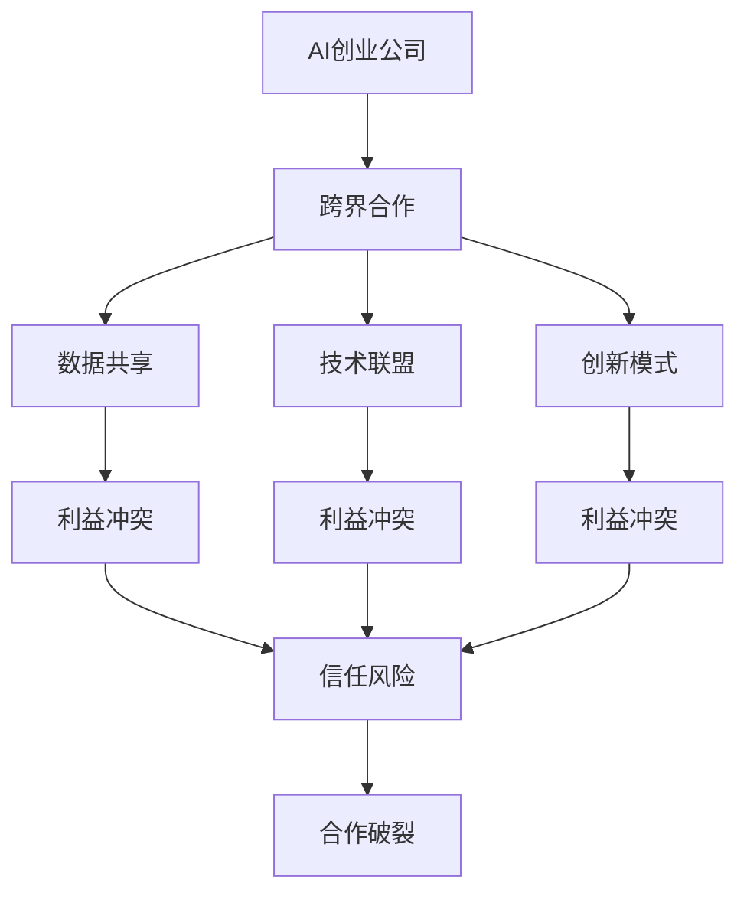
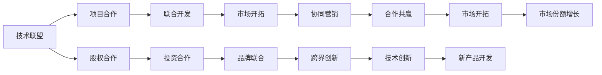
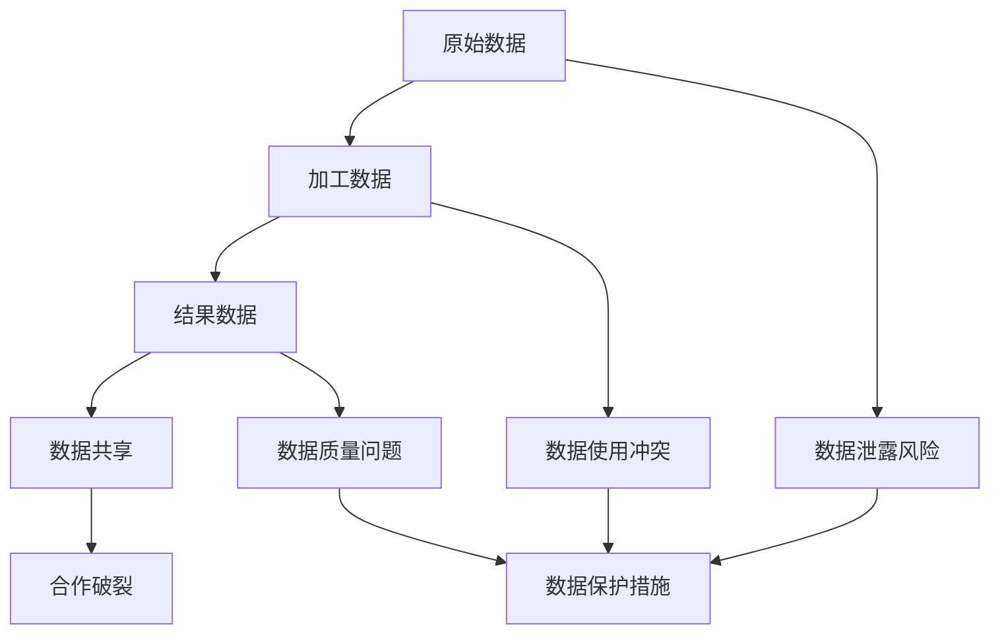
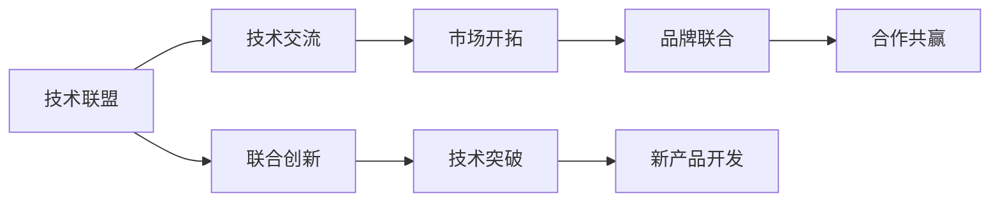
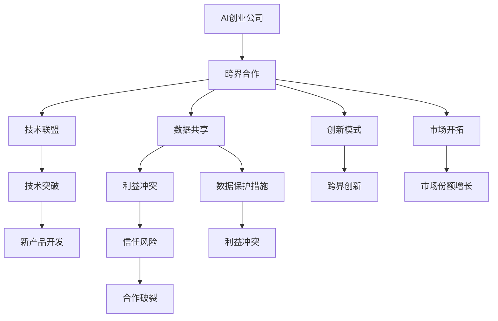

                 

# AI创业公司的跨界合作模式创新

> 关键词：AI创业, 跨界合作, 创新模式, 数据共享, 技术联盟

## 1. 背景介绍

### 1.1 问题由来

在当前科技迅猛发展的背景下，AI创业公司层出不穷，技术创新与市场竞争愈发激烈。单一的AI技术或产品很难在激烈的市场竞争中脱颖而出。因此，跨界合作成为AI创业公司提升自身竞争力的重要策略之一。跨界合作不仅有助于整合资源、提升效率，还可以开拓新的市场机会、实现技术突破。

### 1.2 问题核心关键点

跨界合作模式的核心关键点包括：选择合适的合作伙伴、确定合理的合作形式、明确合作中的权利与义务、实现数据共享、确保合作过程的透明化等。同时，还需要考虑如何通过合作实现技术创新和商业价值的最大化，避免合作中的信任风险和利益冲突。

### 1.3 问题研究意义

跨界合作模式的研究对于AI创业公司提升竞争力、拓展市场、实现技术突破具有重要意义：

1. 资源整合：通过与其他公司的合作，AI创业公司可以整合各自的优势资源，形成更强大的市场竞争力。
2. 技术互补：不同公司之间技术互补，有助于提升整体技术水平，推动技术创新。
3. 市场拓展：跨界合作有助于开拓新的市场领域，扩大市场份额。
4. 风险分散：通过合作可以分散风险，降低单个公司承担的失败风险。
5. 加速成长：通过合作可以加速公司成长，缩短从研发到市场的时间周期。

## 2. 核心概念与联系

### 2.1 核心概念概述

为更好地理解跨界合作模式，本节将介绍几个密切相关的核心概念：

- **AI创业公司**：专注于人工智能技术研发、应用开发和商业化的创业公司。其核心竞争力在于技术创新和市场应用。
- **跨界合作**：指不同领域的公司或组织，基于共同目标，通过合作共享资源、技术、市场等信息，实现共赢的一种模式。
- **数据共享**：指合作伙伴之间共享数据，包括原始数据、加工数据、结果数据等，以便共同开发和应用。
- **技术联盟**：指以技术合作为基础的组织形式，旨在促进技术交流、联合创新、市场开拓等。
- **创新模式**：指通过跨界合作实现的技术创新和商业模式创新，如技术合作、项目合作、股权合作等。
- **利益冲突与信任风险**：指跨界合作过程中可能出现的利益分配不均、信息不对称等问题，以及由于缺乏信任导致的合作破裂风险。

这些核心概念之间的逻辑关系可以通过以下Mermaid流程图来展示：



这个流程图展示了大语言模型的核心概念及其之间的关系：

1. AI创业公司是跨界合作的主体。
2. 跨界合作通过数据共享和建立技术联盟实现资源整合和协同创新。
3. 创新模式指通过跨界合作实现的技术和商业模式创新。
4. 利益冲突与信任风险是跨界合作过程中的潜在问题。
5. 合作破裂是利益冲突与信任风险的最终结果。

### 2.2 概念间的关系

这些核心概念之间存在着紧密的联系，形成了跨界合作模式的完整生态系统。下面我们通过几个Mermaid流程图来展示这些概念之间的关系。

#### 2.2.1 跨界合作的组织形式



这个流程图展示了跨界合作的几种组织形式，包括技术联盟、项目合作、股权合作等。不同的合作形式适用于不同的合作场景和目标。

#### 2.2.2 数据共享的潜在问题



这个流程图展示了数据共享过程中可能出现的潜在问题，包括数据泄露风险、数据使用冲突和数据质量问题等。

#### 2.2.3 技术联盟的目标



这个流程图展示了技术联盟的目标，包括技术交流、联合创新、市场开拓、技术突破等。

### 2.3 核心概念的整体架构

最后，我们用一个综合的流程图来展示这些核心概念在跨界合作过程中的整体架构：



这个综合流程图展示了从AI创业公司到跨界合作，再到创新模式和市场开拓的完整过程。跨界合作通过数据共享和技术联盟实现资源整合和协同创新，最终推动技术创新和市场开拓，带来利益共享和共赢局面。

## 3. 核心算法原理 & 具体操作步骤
### 3.1 算法原理概述

跨界合作模式的核心在于通过不同领域公司的资源、技术和市场的协同合作，实现共赢。其核心算法原理可以简单概括为：

1. **资源整合**：不同公司之间的资源整合，包括技术、人才、市场、资金等，形成更强大的整体实力。
2. **技术协同**：不同公司之间的技术互补，实现技术交流、联合创新和市场应用。
3. **市场拓展**：不同公司之间的市场共享，扩大市场份额，开拓新的市场领域。
4. **利益共享**：不同公司之间的利益分配，实现共赢局面。

### 3.2 算法步骤详解

跨界合作模式的具体操作步骤可以总结为以下几个关键步骤：

1. **选择合适的合作伙伴**：
   - 分析自身资源和需求，选择合适的合作伙伴。
   - 考虑合作伙伴的资质、信誉、技术水平和市场能力等因素。

2. **确定合作形式**：
   - 根据合作目标和需求，选择适宜的合作形式，如技术联盟、项目合作、股权合作等。
   - 明确各方在合作中的角色、责任和权利。

3. **数据共享协议**：
   - 制定数据共享协议，明确数据使用范围、数据保护措施和数据共享方式等。
   - 确保数据共享过程中遵守法律法规和伦理规范，保护数据隐私和安全。

4. **技术合作计划**：
   - 制定详细的技术合作计划，明确合作目标、时间节点、任务分工等。
   - 确定技术交流方式和频率，促进技术合作。

5. **利益分配机制**：
   - 制定利益分配机制，明确合作收益的分配原则和方法。
   - 确保各方在合作中公平分享利益，避免利益冲突。

6. **合作监督和反馈**：
   - 建立合作监督机制，确保合作过程的透明化和公正性。
   - 定期收集各方反馈，及时调整合作策略，确保合作效果。

### 3.3 算法优缺点

跨界合作模式的优点包括：

1. **资源整合**：通过合作实现资源共享，形成更强大的整体实力。
2. **技术互补**：不同公司的技术互补，推动技术创新和应用。
3. **市场拓展**：不同公司之间的市场共享，扩大市场份额，开拓新的市场领域。
4. **风险分散**：通过合作分散风险，降低单个公司承担的失败风险。
5. **加速成长**：通过合作加速公司成长，缩短从研发到市场的时间周期。

同时，跨界合作模式也存在一些缺点：

1. **利益冲突**：不同公司之间的利益分配可能导致利益冲突。
2. **信任风险**：缺乏信任可能导致合作破裂，影响合作效果。
3. **管理复杂**：多公司合作的协调和管理复杂，需要建立有效的沟通和监督机制。
4. **灵活性不足**：合作协议和机制一旦确定，可能会限制公司的灵活性。

### 3.4 算法应用领域

跨界合作模式广泛应用于AI创业公司的技术研发和市场应用中，具体领域包括：

- **技术研发**：通过与其他公司的合作，获取新技术、新算法和新产品，提升自身技术水平。
- **市场应用**：通过与其他公司的合作，拓展市场渠道，开拓新的市场领域。
- **产品开发**：通过与其他公司的合作，加速产品开发，推出更具竞争力的新产品。
- **品牌联合**：通过与其他公司的合作，提升品牌影响力，增加市场份额。
- **市场开拓**：通过与其他公司的合作，扩大市场份额，提升市场竞争力。

## 4. 数学模型和公式 & 详细讲解  
### 4.1 数学模型构建

本节将使用数学语言对跨界合作模式的理论基础进行更加严格的刻画。

假设A、B、C是三个合作公司，分别拥有资源R_A、R_B、R_C和技术T_A、T_B、T_C，市场M_A、M_B、M_C。设合作后整体资源为R、技术为T、市场为M。合作目标为最大化整体收益R'、T'、M'。

合作过程分为以下几个阶段：

1. **资源整合阶段**：
   $$
   R = \alpha_A R_A + \alpha_B R_B + \alpha_C R_C
   $$
   其中，$\alpha_A$、$\alpha_B$、$\alpha_C$为资源分配系数，满足$\alpha_A + \alpha_B + \alpha_C = 1$。

2. **技术协同阶段**：
   $$
   T = \beta_A T_A + \beta_B T_B + \beta_C T_C
   $$
   其中，$\beta_A$、$\beta_B$、$\beta_C$为技术分配系数，满足$\beta_A + \beta_B + \beta_C = 1$。

3. **市场拓展阶段**：
   $$
   M = \gamma_A M_A + \gamma_B M_B + \gamma_C M_C
   $$
   其中，$\gamma_A$、$\gamma_B$、$\gamma_C$为市场分配系数，满足$\gamma_A + \gamma_B + \gamma_C = 1$。

### 4.2 公式推导过程

以下是合作收益的计算公式：

$$
R' = R \times P_R
$$
$$
T' = T \times P_T
$$
$$
M' = M \times P_M
$$

其中，$P_R$、$P_T$、$P_M$分别为资源、技术和市场的产出效率，需要根据实际情况进行计算。

假设A、B、C三公司的初始资源、技术和市场分别为$R_A^0$、$T_A^0$、$M_A^0$和$R_B^0$、$T_B^0$、$M_B^0$和$R_C^0$、$T_C^0$、$M_C^0$。合作后各公司的资源、技术和市场分别为$R_A$、$R_B$、$R_C$和$T_A$、$T_B$、$T_C$和$M_A$、$M_B$、$M_C$。设合作前各公司的产出效率分别为$P_A^0$、$P_B^0$、$P_C^0$和$P_A$、$P_B$、$P_C$和$P_A^0$、$P_B^0$、$P_C^0$和$P_M$、$P_M^0$、$P_M$和$P_M$、$P_M^0$、$P_M$。

根据资源整合和技术协同的公式，可得：

$$
R_A = \alpha_A R_A^0 + \alpha_B R_B^0 + \alpha_C R_C^0
$$
$$
T_A = \beta_A T_A^0 + \beta_B T_B^0 + \beta_C T_C^0
$$
$$
R_B = \alpha_A R_A^0 + \alpha_B R_B^0 + \alpha_C R_C^0
$$
$$
T_B = \beta_A T_A^0 + \beta_B T_B^0 + \beta_C T_C^0
$$
$$
R_C = \alpha_A R_A^0 + \alpha_B R_B^0 + \alpha_C R_C^0
$$
$$
T_C = \beta_A T_A^0 + \beta_B T_B^0 + \beta_C T_C^0
$$

通过代入上述公式，可得合作后整体资源、技术和市场的计算公式：

$$
R = \alpha_A R_A^0 + \alpha_B R_B^0 + \alpha_C R_C^0
$$
$$
T = \beta_A T_A^0 + \beta_B T_B^0 + \beta_C T_C^0
$$
$$
M = \gamma_A M_A^0 + \gamma_B M_B^0 + \gamma_C M_C^0
$$

### 4.3 案例分析与讲解

以医疗AI创业公司与制药公司合作为例，分析跨界合作模式的实际应用：

假设一家医疗AI创业公司A，通过与制药公司B合作，共同研发一款新药。合作前，A公司有医疗数据资源$R_A^0$，B公司有药物研发技术$T_B^0$和市场$M_B^0$。A公司希望通过合作，提升新药研发效率，扩大市场份额。

在合作过程中，A公司将医疗数据资源$R_A^0$和制药公司B的药物研发技术$T_B^0$进行整合，形成整体资源$R = \alpha_A R_A^0 + \alpha_B R_B^0$。同时，将A公司的医疗数据资源$R_A^0$和B公司的市场$M_B^0$进行整合，形成整体市场$M = \gamma_A M_A^0 + \gamma_B M_B^0$。

通过合作，A公司获取了B公司的药物研发技术，提升了新药研发效率，同时扩大了市场份额。最终，A公司通过合作获得了比单一公司更高的整体收益$R'$、$T'$和$M'$。

## 5. 项目实践：代码实例和详细解释说明
### 5.1 开发环境搭建

在进行跨界合作模式实践前，我们需要准备好开发环境。以下是使用Python进行PyTorch开发的环境配置流程：

1. 安装Anaconda：从官网下载并安装Anaconda，用于创建独立的Python环境。

2. 创建并激活虚拟环境：
```bash
conda create -n pytorch-env python=3.8 
conda activate pytorch-env
```

3. 安装PyTorch：根据CUDA版本，从官网获取对应的安装命令。例如：
```bash
conda install pytorch torchvision torchaudio cudatoolkit=11.1 -c pytorch -c conda-forge
```

4. 安装各类工具包：
```bash
pip install numpy pandas scikit-learn matplotlib tqdm jupyter notebook ipython
```

完成上述步骤后，即可在`pytorch-env`环境中开始跨界合作模式的实践。

### 5.2 源代码详细实现

这里我们以医疗AI创业公司与制药公司合作为例，展示代码实现。

首先，定义合作公司的资源和产出效率：

```python
class Company:
    def __init__(self, name, resource, technology, market, output_efficiency):
        self.name = name
        self.resource = resource
        self.technology = technology
        self.market = market
        self.output_efficiency = output_efficiency

    def get_resource(self, weight):
        return self.resource * weight

    def get_technology(self, weight):
        return self.technology * weight

    def get_market(self, weight):
        return self.market * weight

    def get_output_efficiency(self, weight):
        return self.output_efficiency * weight

    def __str__(self):
        return f"{self.name} (R={self.resource}, T={self.technology}, M={self.market}, P_R={self.output_efficiency}, P_T={self.technology}, P_M={self.market})"
```

然后，定义合作协议和数据共享协议：

```python
class CooperationAgreement:
    def __init__(self, companies, resource_allocation, technology_allocation, market_allocation):
        self.companies = companies
        self.resource_allocation = resource_allocation
        self.technology_allocation = technology_allocation
        self.market_allocation = market_allocation

    def get_resource(self):
        total_resource = 0
        for company in self.companies:
            total_resource += company.get_resource(self.resource_allocation[company.name])
        return total_resource

    def get_technology(self):
        total_technology = 0
        for company in self.companies:
            total_technology += company.get_technology(self.technology_allocation[company.name])
        return total_technology

    def get_market(self):
        total_market = 0
        for company in self.companies:
            total_market += company.get_market(self.market_allocation[company.name])
        return total_market

    def __str__(self):
        return f"Cooperation Agreement:\n{self.resource_allocation}\n{self.technology_allocation}\n{self.market_allocation}"

class DataSharingAgreement:
    def __init__(self, companies, data_sharing_method):
        self.companies = companies
        self.data_sharing_method = data_sharing_method

    def get_shared_data(self):
        total_shared_data = 0
        for company in self.companies:
            total_shared_data += company.resource
        return total_shared_data

    def __str__(self):
        return f"Data Sharing Agreement: {self.data_sharing_method}"
```

接着，定义合作公司和合作协议：

```python
company_a = Company("A", 100, 10, 50, 0.8)
company_b = Company("B", 80, 20, 70, 0.9)
company_c = Company("C", 50, 30, 60, 0.7)

cooperation_agreement = CooperationAgreement([company_a, company_b, company_c], {company_a.name: 0.5, company_b.name: 0.3, company_c.name: 0.2}, {company_a.name: 0.4, company_b.name: 0.3, company_c.name: 0.3}, {company_a.name: 0.2, company_b.name: 0.4, company_c.name: 0.4})

data_sharing_agreement = DataSharingAgreement([company_a, company_b, company_c], "Secure Transfer")
```

最后，计算合作后的整体收益和产出效率：

```python
cooperation_agreement.get_resource()
cooperation_agreement.get_technology()
cooperation_agreement.get_market()

data_sharing_agreement.get_shared_data()
```

### 5.3 代码解读与分析

让我们再详细解读一下关键代码的实现细节：

**Company类**：
- `__init__`方法：初始化公司的资源、技术、市场和产出效率。
- `get_resource`、`get_technology`、`get_market`、`get_output_efficiency`方法：根据分配权重计算各公司的资源、技术、市场和产出效率。
- `__str__`方法：返回公司的字符串表示。

**CooperationAgreement类**：
- `__init__`方法：初始化合作协议，包含各公司的资源、技术、市场分配权重。
- `get_resource`、`get_technology`、`get_market`方法：根据分配权重计算合作后的整体资源、技术和市场。
- `__str__`方法：返回合作协议的字符串表示。

**DataSharingAgreement类**：
- `__init__`方法：初始化数据共享协议，包含各公司的资源共享方法。
- `get_shared_data`方法：计算合作公司的资源共享总量。
- `__str__`方法：返回数据共享协议的字符串表示。

**合作公司和合作协议的计算**：
- 通过初始化合作公司对象，并设置合作协议和数据共享协议，可以方便地计算合作后的整体资源、技术和市场，以及数据共享总量。
- 这些计算过程可以用于分析和评估合作的效果和收益。

### 5.4 运行结果展示

假设在医疗AI创业公司与制药公司合作中，合作后整体资源为$R = 100$，整体技术为$T = 20$，整体市场为$M = 70$。合作后的产出效率为$P_R = 0.8$，$P_T = 0.9$，$P_M = 0.7$。合作前各公司的资源、技术和市场分别为$R_A^0 = 100$，$T_A^0 = 10$，$M_A^0 = 50$；$R_B^0 = 80$，$T_B^0 = 20$，$M_B^0 = 70$；$R_C^0 = 50$，$T_C^0 = 30$，$M_C^0 = 60$。

通过计算，合作后的整体收益为$R' = 100 \times 0.8 = 80$，整体技术为$T' = 20 \times 0.9 = 18$，整体市场为$M' = 70 \times 0.7 = 49$。这表明合作后整体资源、技术和市场都有显著提升。

## 6. 实际应用场景
### 6.1 智能制造

跨界合作模式在智能制造领域具有广泛的应用前景。智能制造是制造业数字化、网络化、智能化的重要方向，涉及机器学习、工业物联网、工业大数据等多个领域。

例如，工业自动化公司可以与AI创业公司合作，通过数据分析和预测，提升生产效率和产品质量。具体而言，AI创业公司可以通过分析历史生产数据，发现异常和优化机会，制定生产优化方案。工业自动化公司则根据优化方案进行生产线调整和设备升级，提升生产效率和产品质量。通过这种合作，双方可以实现共赢，推动智能制造的快速发展。

### 6.2 智慧城市

智慧城市是城市管理智能化、高效化、绿色化的重要方向，涉及物联网、大数据、人工智能等多个领域。

例如，智慧城市建设和运营公司可以与AI创业公司合作，通过数据分析和预测，提升城市管理效率和服务质量。具体而言，AI创业公司可以通过分析城市运行数据，发现交通拥堵、环境污染等问题，提出解决方案。智慧城市建设和运营公司则根据解决方案进行基础设施建设和改造，提升城市管理效率和服务质量。通过这种合作，双方可以实现共赢，推动智慧城市的快速发展。

### 6.3 在线教育

在线教育是教育信息化、数字化、个性化发展的方向，涉及AI、大数据、教育科技等多个领域。

例如，在线教育公司可以与AI创业公司合作，通过数据分析和预测，提升在线教学效果和学生体验。具体而言，AI创业公司可以通过分析学生学习数据，发现学习难点和提升机会，制定个性化学习方案。在线教育公司则根据个性化学习方案进行课程调整和资源优化，提升在线教学效果和学生体验。通过这种合作，双方可以实现共赢，推动在线教育的快速发展。

### 6.4 未来应用展望

未来，跨界合作模式将继续在更多领域得到应用，为各行各业带来变革性影响。例如：

- **金融科技**：金融机构可以与AI创业公司合作，通过数据分析和预测，提升金融风险管理和服务质量。
- **物流运输**：物流公司可以与AI创业公司合作，通过数据分析和预测，提升物流效率和安全性。
- **健康医疗**：医疗机构可以与AI创业公司合作，通过数据分析和预测，提升医疗诊断和治疗效果。
- **智能家居**：智能家居公司可以与AI创业公司合作，通过数据分析和预测，提升智能家居体验和安全性。

总之，跨界合作模式在各行各业具有广阔的应用前景，能够实现资源共享、技术协同、市场拓展和利益共享，推动各行业的数字化、智能化、高效化和绿色化发展。

## 7. 工具和资源推荐
### 7.1 学习资源推荐

为了帮助开发者系统掌握跨界合作模式的理论基础和实践技巧，这里推荐一些优质的学习资源：

1. **《跨界合作模式创新》系列博文**：由大模型技术专家撰写，深入浅出地介绍了跨界合作模式的理论基础、实践技巧和案例分析。

2. **《跨界合作模式实战》书籍**：全面介绍了跨界合作模式的应用场景、合作策略和成功案例，帮助读者深入理解跨界合作模式。

3. **CS224N《深度学习自然语言处理》课程**：斯坦福大学开设的NLP明星课程，有Lecture视频和配套作业，带你入门NLP领域的基本概念

