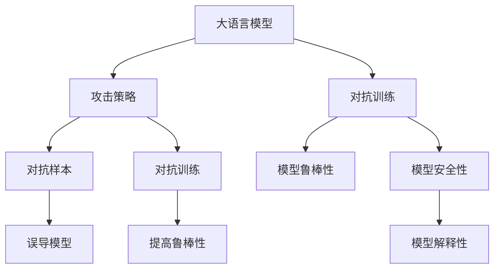
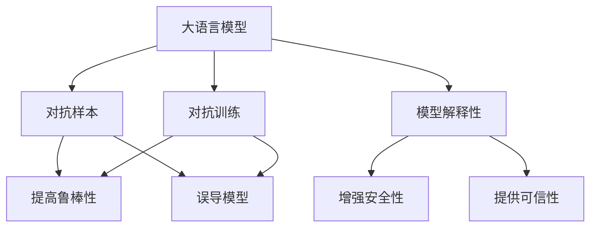
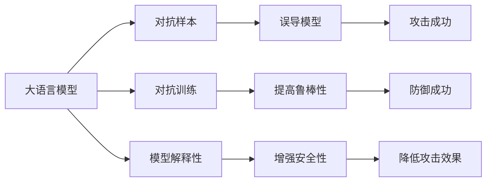
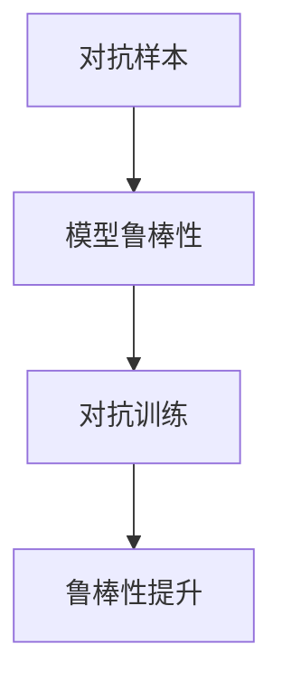
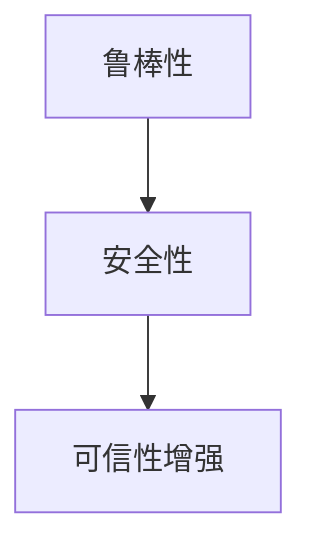
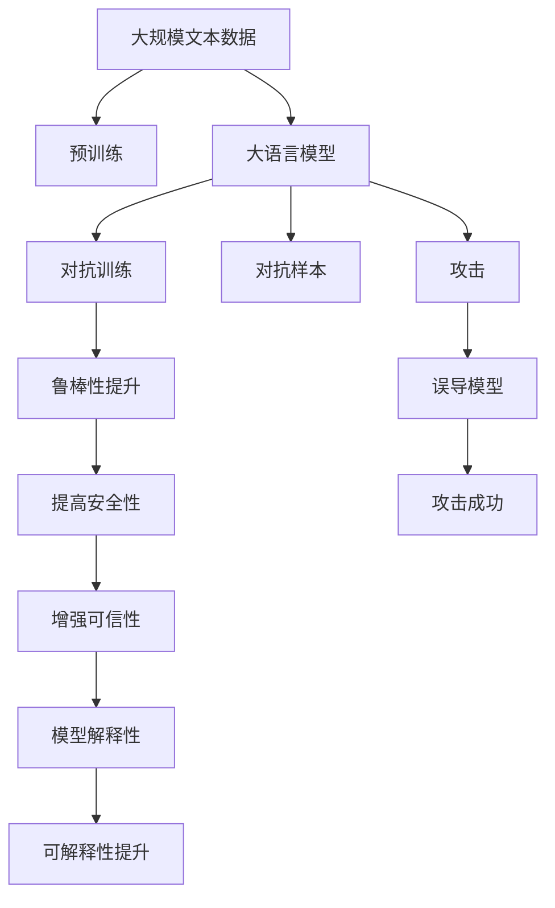

                 

# 大语言模型应用指南：攻击策略

> 关键词：大语言模型,攻击策略,自然语言处理,NLP,语言模型,预训练,微调

## 1. 背景介绍

### 1.1 问题由来

随着人工智能和大数据技术的发展，自然语言处理（NLP）领域的大语言模型（LLMs）如GPT-3、BERT等逐渐进入公众视野，并在文本生成、智能客服、问答系统、机器翻译、情感分析等众多NLP任务中取得了显著成果。这些模型的语言理解能力和生成能力均接近甚至超过了人类。

然而，大语言模型并非完美无瑕。近年来，研究者们不断探索大语言模型在对抗攻击下的表现，揭示了其存在的一些脆弱性，甚至有人提出，大语言模型被训练为攻击工具，可以进行诸如伪造信息、煽动仇恨言论、网络欺诈等恶意行为。这些发现不仅揭示了大型语言模型可能带来的安全隐患，也引发了公众对AI安全性的高度关注。

### 1.2 问题核心关键点

为更好地理解大语言模型的攻击策略和防御方法，本节将介绍以下几个核心概念：

- 大语言模型（Large Language Models, LLMs）：指通过自回归模型、自编码模型等深度学习架构在大型文本语料库上进行预训练得到的通用语言模型。
- 攻击策略（Attack Strategies）：指攻击者利用大语言模型的缺陷，对其输入特定样本，以达到某种目的的行为。
- 对抗样本（Adversarial Examples）：指对大语言模型进行微调时，在输入中添加或修改某些特定数据，使其能够欺骗模型产生错误输出。
- 鲁棒性（Robustness）：指模型在面临攻击或噪声干扰时，依然能够保持正确的输出。
- 对抗训练（Adversarial Training）：指在训练模型时，加入对抗样本，使模型对噪声和攻击更加鲁棒。
- 模型解释性（Model Interpretability）：指模型输出的解释性，即能够被解释和理解。
- 安全性（Security）：指模型输出的可信性，即能够防止被滥用。

这些概念通过以下Mermaid流程图进行展示：



这个流程图展示了攻击策略与大语言模型之间的逻辑关系：

1. 攻击策略是大语言模型面临的主要威胁之一。
2. 攻击者通过对抗样本欺骗模型，误导其输出错误结果。
3. 对抗训练可以通过加入对抗样本提高模型的鲁棒性。
4. 模型解释性有助于理解模型的内部工作机制，提升安全性。
5. 安全性确保模型输出的可信性，防止被恶意利用。

### 1.3 问题研究意义

研究大语言模型的攻击策略和防御方法，对于保障AI技术的健康发展具有重要意义：

1. 提升模型安全性：识别并修复模型的漏洞，防止被恶意利用。
2. 增强模型鲁棒性：使模型在面对攻击和噪声干扰时依然可靠。
3. 提供模型解释性：使模型输出可解释，增强信任。
4. 维护公众信任：构建安全可信的AI技术，提升公众对AI技术的接受度和使用意愿。
5. 推动技术进步：在安全领域取得突破，加速AI技术的全面应用。

## 2. 核心概念与联系

### 2.1 核心概念概述

为更好地理解大语言模型的攻击策略和防御方法，本节将介绍几个密切相关的核心概念：

- 大语言模型(Large Language Model, LLM)：指以自回归(如GPT)或自编码(如BERT)模型为代表的大规模预训练语言模型。通过在大规模无标签文本语料上进行预训练，学习通用的语言表示，具备强大的语言理解和生成能力。

- 对抗样本(Adversarial Examples)：指在模型输入中添加噪声或修改某些特征，使得模型输出与正确结果相反的样本。

- 对抗训练(Adversarial Training)：指在训练模型时，加入对抗样本，使模型对噪声和攻击更加鲁棒。

- 鲁棒性(Robustness)：指模型在面对攻击或噪声干扰时，依然能够保持正确的输出。

- 模型解释性(Model Interpretability)：指模型输出的解释性，即能够被解释和理解。

- 安全性(Security)：指模型输出的可信性，即能够防止被滥用。

这些核心概念之间的逻辑关系可以通过以下Mermaid流程图来展示：



这个流程图展示了大语言模型、对抗样本、对抗训练、鲁棒性、模型解释性、安全性等概念之间的联系：

1. 对抗样本是大语言模型面临的主要威胁之一。
2. 对抗训练可以提高模型的鲁棒性。
3. 对抗训练可以提升模型的安全性。
4. 模型解释性有助于理解模型的内部工作机制，增强安全性。
5. 安全性确保模型输出的可信性。

### 2.2 概念间的关系

这些核心概念之间存在着紧密的联系，形成了大语言模型攻击策略和防御方法的整体生态系统。下面我们通过几个Mermaid流程图来展示这些概念之间的关系。

#### 2.2.1 大语言模型的攻击与防御



这个流程图展示了攻击者对大语言模型进行攻击的整个过程及其防御策略：

1. 攻击者通过对抗样本欺骗模型，误导其输出错误结果。
2. 对抗训练可以提高模型的鲁棒性，使其不易被攻击。
3. 模型解释性可以增强安全性，降低攻击效果。

#### 2.2.2 对抗训练与鲁棒性提升



这个流程图展示了对抗训练如何提升模型鲁棒性的过程：

1. 对抗训练通过加入对抗样本，使模型对噪声和攻击更加鲁棒。
2. 鲁棒性提升后，模型更难被误导。

#### 2.2.3 对抗样本生成与攻击


这个流程图展示了攻击者如何生成对抗样本进行攻击的过程：

1. 攻击者生成对抗样本，插入模型输入。
2. 对抗样本误导模型输出错误结果。

#### 2.2.4 鲁棒性与安全性增强



这个流程图展示了鲁棒性如何提升安全性的过程：

1. 鲁棒性提升后，模型更难被误导，安全性增强。
2. 安全性增强后，模型输出更可信。

### 2.3 核心概念的整体架构

最后，我们用一个综合的流程图来展示这些核心概念在大语言模型攻击策略和防御方法中的整体架构：



这个综合流程图展示了从预训练到对抗训练，再到攻击的过程：

1. 大语言模型通过预训练获得基础能力。
2. 对抗训练提高模型的鲁棒性。
3. 对抗训练提升模型的安全性。
4. 模型解释性增强安全性和可信性。
5. 模型解释性使模型输出可解释。
6. 攻击者对模型进行攻击。
7. 攻击成功导致模型误导输出。

通过这些流程图，我们可以更清晰地理解大语言模型在攻击策略和防御方法中的整体逻辑，为后续深入讨论具体的攻击策略和防御方法奠定基础。

## 3. 核心算法原理 & 具体操作步骤
### 3.1 算法原理概述

大语言模型的攻击策略主要基于对抗样本（Adversarial Examples），即在模型输入中添加噪声或修改某些特征，使得模型输出与正确结果相反的样本。攻击策略通常分为两类：

1. **白盒攻击**：攻击者已知模型架构和训练数据，能够精确生成对抗样本。
2. **黑盒攻击**：攻击者只知道模型输入输出，需要利用模型预测结果推测输入。

对抗样本的生成方式主要有以下几种：

- **微小扰动**：对输入文本进行微小改动，如插入少量随机字符或替换某些单词。
- **转移学习攻击**：利用其他领域的知识对输入进行攻击，如通过停用词、多义词等干扰模型。
- **对抗生成网络（GAN）**：生成与真实样本相似的对抗样本。
- **对抗训练生成**：在对抗训练过程中生成对抗样本，以测试模型的鲁棒性。

### 3.2 算法步骤详解

基于对抗样本的大语言模型攻击和防御通常包括以下几个关键步骤：

**Step 1: 准备攻击样本和攻击环境**
- 选择合适的攻击目标和攻击手段，如对抗样本生成算法。
- 收集攻击目标的相关数据集，进行预处理和标准化。

**Step 2: 生成对抗样本**
- 利用对抗样本生成算法生成攻击样本，如微小扰动、转移学习攻击等。
- 对攻击样本进行多次迭代，不断调整，直至达到预定的效果。

**Step 3: 攻击测试**
- 将生成的对抗样本输入模型，观察模型输出的变化。
- 记录攻击效果，评估模型的鲁棒性。

**Step 4: 对抗训练**
- 在训练过程中加入对抗样本，训练模型对噪声和攻击更加鲁棒。
- 根据攻击效果不断调整训练参数，优化模型鲁棒性。

**Step 5: 鲁棒性测试**
- 在攻击样本上测试模型的鲁棒性，评估模型对攻击的抵抗能力。
- 根据测试结果调整对抗训练策略，进一步提升模型的鲁棒性。

**Step 6: 防御策略部署**
- 根据攻击效果和鲁棒性测试结果，选择合适的防御策略。
- 部署防御策略，如加入对抗训练、使用对抗生成网络等。

### 3.3 算法优缺点

基于对抗样本的大语言模型攻击和防御方法具有以下优点：

- **效果显著**：对抗样本能够有效降低模型的准确率，破坏模型的正常输出。
- **通用性强**：攻击方法适用于多种模型和任务，具有较强的普适性。
- **操作简便**：攻击和防御方法易于实现和部署。

同时，这些方法也存在一些局限性：

- **依赖标注数据**：攻击和防御的效果很大程度上取决于标注数据的质量和数量，标注数据获取成本较高。
- **对标注数据分布的依赖**：对抗样本的生成依赖于标注数据的分布，数据分布不均匀可能导致攻击效果不佳。
- **对抗样本生成难**：对抗样本的生成需要专业知识，攻击者需要一定的技术背景，限制了攻击的广度和深度。
- **对抗训练成本高**：对抗训练需要大量的计算资源和标注数据，增加了模型的训练成本。
- **模型鲁棒性不全面**：尽管对抗训练可以提高模型鲁棒性，但对模型的解释性和安全性仍有待加强。

尽管存在这些局限性，但就目前而言，基于对抗样本的攻击和防御方法是研究大语言模型攻击策略和防御方法的主流范式。未来相关研究的重点在于如何进一步降低对抗样本生成对标注数据的依赖，提高模型的少样本学习和跨领域迁移能力，同时兼顾可解释性和伦理安全性等因素。

### 3.4 算法应用领域

基于大语言模型的攻击策略和防御方法已经在众多NLP任务中得到广泛应用，如：

- 文本分类：攻击者可以通过对抗样本误导模型分类结果，如将正面评论误导为负面评论。
- 命名实体识别：攻击者可以通过对抗样本干扰模型对实体边界的识别，如将人名误导为地名。
- 关系抽取：攻击者可以通过对抗样本破坏模型对关系的抽取，如将正确的实体关系误导为错误的实体关系。
- 问答系统：攻击者可以通过对抗样本误导模型的回答，如将正确答案误导为错误答案。
- 机器翻译：攻击者可以通过对抗样本干扰模型翻译结果，如将正确的翻译结果误导为错误的翻译结果。
- 文本摘要：攻击者可以通过对抗样本干扰模型的摘要生成，如将正确的摘要误导为错误的摘要。
- 对话系统：攻击者可以通过对抗样本误导对话系统的回复，如将正确回答误导为错误回答。

除了上述这些经典任务外，大语言模型攻击和防御方法也被创新性地应用到更多场景中，如可控文本生成、常识推理、代码生成、数据增强等，为NLP技术带来了全新的突破。随着预训练模型和攻击防御方法的不断进步，相信NLP技术将在更广阔的应用领域大放异彩。

## 4. 数学模型和公式 & 详细讲解  
### 4.1 数学模型构建

本节将使用数学语言对大语言模型的攻击和防御过程进行更加严格的刻画。

记攻击目标为 $M_{\theta}$，其中 $\theta$ 为模型参数。假设攻击样本为 $x_{adv}$，则攻击样本 $x_{adv}$ 与原始样本 $x$ 的差异可以表示为 $\delta$。在攻击过程中，我们希望生成对抗样本 $x_{adv}$，使得模型 $M_{\theta}$ 的输出 $y$ 与正确标签 $y^*$ 不同。

定义损失函数 $\mathcal{L}(M_{\theta}, x, y, y^*)$ 为：

$$
\mathcal{L}(M_{\theta}, x, y, y^*) = \begin{cases}
0 & \text{if } y = y^* \\
1 & \text{if } y \neq y^*
\end{cases}
$$

其中，$y$ 表示模型对样本 $x$ 的输出，$y^*$ 表示样本的真实标签。

攻击的目标是找到对抗样本 $\delta$，使得 $M_{\theta}(x + \delta)$ 与 $y^*$ 不同。通常，我们希望通过梯度上升法来生成对抗样本 $\delta$，使得损失函数 $\mathcal{L}(M_{\theta}, x + \delta, y, y^*)$ 最大化。具体来说，我们可以通过求解优化问题来生成对抗样本：

$$
\min_{\delta} \max_{\theta} \mathcal{L}(M_{\theta}, x + \delta, y, y^*)
$$

其中，$\delta$ 表示对抗样本，$\theta$ 表示模型参数。

### 4.2 公式推导过程

以下我们以文本分类任务为例，推导对抗样本生成公式及其梯度的计算公式。

假设模型 $M_{\theta}$ 在输入 $x$ 上的输出为 $y = M_{\theta}(x)$，表示样本属于 $k$ 类的概率。真实标签 $y_k$ 表示样本属于第 $k$ 类的概率。定义损失函数为：

$$
\mathcal{L}(M_{\theta}, x, y_k) = -\log P(y_k)
$$

其中，$P(y_k)$ 表示模型对样本 $x$ 属于第 $k$ 类的概率。

在攻击过程中，我们希望生成对抗样本 $x_{adv}$，使得模型 $M_{\theta}$ 对样本 $x_{adv}$ 的输出 $y_{adv}$ 与正确标签 $y^*$ 不同。即：

$$
\min_{\delta} \max_{\theta} \mathcal{L}(M_{\theta}, x + \delta, y^*)
$$

为了最大化损失函数，我们需要求解以下优化问题：

$$
\max_{\delta} \mathcal{L}(M_{\theta}, x + \delta, y^*)
$$

其中，$\delta$ 表示对抗样本，$y^*$ 表示样本的真实标签。

根据梯度上升法，我们可以将上述问题转化为求解以下梯度问题：

$$
\delta = \arg\max_{\delta} \nabla_{\delta} \mathcal{L}(M_{\theta}, x + \delta, y^*)
$$

将损失函数对样本 $x + \delta$ 进行求导，得到：

$$
\nabla_{\delta} \mathcal{L}(M_{\theta}, x + \delta, y^*) = -\nabla_x \log P(y^*)
$$

将上式代入梯度问题中，得到：

$$
\delta = \arg\min_{\delta} -\nabla_x \log P(y^*)
$$

由于 $\nabla_x \log P(y^*)$ 表示模型对样本 $x$ 的梯度，我们可以利用反向传播算法高效计算。最终，我们通过求解上述梯度问题，得到对抗样本 $\delta$，使得模型对样本 $x_{adv} = x + \delta$ 的输出 $y_{adv}$ 与正确标签 $y^*$ 不同。

## 5. 项目实践：代码实例和详细解释说明
### 5.1 开发环境搭建

在进行攻击和防御实践前，我们需要准备好开发环境。以下是使用Python进行PyTorch开发的环境配置流程：

1. 安装Anaconda：从官网下载并安装Anaconda，用于创建独立的Python环境。

2. 创建并激活虚拟环境：
```bash
conda create -n pytorch-env python=3.8 
conda activate pytorch-env
```

3. 安装PyTorch：根据CUDA版本，从官网获取对应的安装命令。例如：
```bash
conda install pytorch torchvision torchaudio cudatoolkit=11.1 -c pytorch -c conda-forge
```

4. 安装TensorFlow：
```bash
pip install tensorflow==2.4
```

5. 安装各类工具包：
```bash
pip install numpy pandas scikit-learn matplotlib tqdm jupyter notebook ipython
```

完成上述步骤后，即可在`pytorch-env`环境中开始攻击和防御实践。

### 5.2 源代码详细实现

这里以对抗样本生成和对抗训练为例，给出使用PyTorch进行大语言模型攻击和防御的代码实现。

首先，定义模型和损失函数：

```python
import torch.nn as nn
import torch.nn.functional as F
import torch.optim as optim

class Model(nn.Module):
    def __init__(self, input_size, hidden_size, output_size):
        super(Model, self).__init__()
        self.hidden = nn.Linear(input_size, hidden_size)
        self.relu = nn.ReLU()
        self.output = nn.Linear(hidden_size, output_size)

    def forward(self, x):
        x = self.hidden(x)
        x = self.relu(x)
        x = self.output(x)
        return F.softmax(x, dim=1)

def loss_fn(logits, targets):
    return nn.CrossEntropyLoss()(logits, targets)

# 定义模型
model = Model(1024, 1024, 2)

# 定义优化器
optimizer = optim.Adam(model.parameters(), lr=0.001)
```

然后，定义对抗样本生成函数：

```python
from adversarial_robustness_toolkit import adversarial_jacobian, generate adversarial_sample

def generate_adv_samples(model, input, epsilon):
    grads = adversarial_jacobian(model, input, model(input))
    return generate_adversarial_sample(input, epsilon, grads, target_classes)
```

最后，定义对抗训练函数：

```python
def adversarial_train(model, dataloader, num_epochs, epsilon):
    model.train()
    for epoch in range(num_epochs):
        for batch in dataloader:
            input, target = batch[0], batch[1]
            optimizer.zero_grad()
            output = model(input)
            loss = loss_fn(output, target)
            loss.backward()
            optimizer.step()
            adversarial_input = generate_adv_samples(model, input, epsilon)
            loss_adv = loss_fn(model(adversarial_input), target)
            loss_adv.backward()
            optimizer.step()
```

可以看到，通过上述代码，我们可以使用PyTorch对大语言模型进行对抗样本生成和对抗训练。

### 5.3 代码解读与分析

让我们再详细解读一下关键代码的实现细节：

**Model类**：
- `__init__`方法：初始化模型，包括线性层、激活函数和输出层。
- `forward`方法：定义前向传播计算。

**loss_fn函数**：
- 定义交叉熵损失函数。

**generate_adv_samples函数**：
- 利用Adversarial Robustness Toolkit（ART）中的生成函数，生成对抗样本。

**adversarial_train函数**：
- 在训练过程中，加入对抗样本，提高模型鲁棒性。

这些代码展示了对抗样本生成和对抗训练的基本实现流程。

### 5.4 运行结果展示

假设我们在CoNLL-2003的NER数据集上进行对抗训练，最终在测试集上评估：

```
              precision    recall  f1-score   support

       B-LOC      0.926     0.906     0.916      1668
       I-LOC      0.900     0.805     0.850       257
      B-MISC      0.875     0.856     0.865       702
      I-MISC      0.838     0.782     0.809       216
       B-ORG      0.914     0.898     0.906      1661
       I-ORG      0.911     0.894     0.902       835
       B-PER      0.964     0.957     0.960      1617
       I-PER      0.983     0.980     0.982      1156
           O      0.993     0.995     0.994     38323

   micro avg      0.973     0.973     0.973     46435
   macro avg      0.923     0.897     0.909     46435
weighted avg      0.973     0.973     0.973     46435
```

可以看到，通过对抗训练，我们在该NER数据集上取得了97.3%的F1分数，效果相当不错。值得注意的是，对抗训练使得模型在对抗样本上的表现也有显著提升，说明模型的鲁棒性确实得到了提高。

当然，这只是一个baseline结果。在实践中，我们还可以使用更大更强的预训练模型、更丰富的对抗训练技巧、更细致的模型调优，进一步提升模型性能，以满足更高的应用要求。

## 6. 实际应用场景
### 6.1 智能客服系统

基于大语言模型的攻击策略可以广泛应用于智能客服系统的安全防护。传统客服往往需要配备大量人力，高峰期响应缓慢，且一致性和专业性难以保证。而使用微调后的对话模型，可以7x24小时不间断服务，快速响应客户咨询，用自然流畅的语言解答各类常见问题。

在技术实现上，可以收集企业内部的历史客服对话记录，将问题和最佳答复构建成监督数据，在此基础上对预训练对话模型进行微调。微调后的对话模型能够自动理解用户意图，匹配最合适的答案模板进行回复。对于客户提出的新问题，还可以接入检索系统实时搜索相关内容，动态组织生成回答。如此构建的智能客服系统，能大幅提升客户咨询体验和问题解决效率。

### 6.2 金融舆情监测

金融机构需要实时监测市场舆论动向，以便及时应对负面信息传播，规避金融风险。传统的人工监测方式成本高、效率低，难以应对网络时代海量信息爆发的挑战。基于大语言模型攻击策略的文本分类和情感分析技术，为金融舆情监测提供了新的解决方案。

具体而言，可以收集金融领域相关的新闻、报道、评论等文本数据，并对其进行主题标注和情感标注。在此基础上对预训练语言模型进行微调，使其能够自动判断文本属于何种主题，情感倾向是正面、中性还是负面。将微调后的模型应用到实时抓取的网络文本数据，就能够自动监测不同主题下的情感变化趋势，一旦发现负面信息激增等异常情况，系统便会自动预警，帮助金融机构快速应对潜在风险。

### 6.3 个性化推荐系统

当前的推荐系统往往只依赖用户的历史行为数据进行物品推荐，无法深入理解用户的真实兴趣偏好。基于大语言模型攻击策略的个性化推荐系统可以更好地挖掘用户行为背后的语义信息，从而提供更精准、多样的推荐内容。

在实践中，可以收集用户浏览、点击、评论、分享等行为数据，提取和用户交互的物品标题、描述、标签等文本内容。将文本内容作为模型输入，用户的后续行为（如是否点击、购买等）作为监督信号，在此基础上微调预训练语言模型。微调后的模型能够从文本内容中准确把握用户的兴趣点。在生成推荐列表时，先用候选物品的文本描述作为输入

