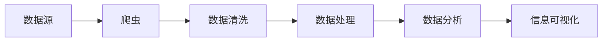

                 

# 如何进行信息收集：如何获取有效的信息和知识？

> 关键词：信息收集, 信息获取, 知识管理, 数据挖掘, 数据清洗, 自动化技术, 机器学习

## 1. 背景介绍

### 1.1 问题由来
在当今信息爆炸的时代，如何高效、准确地收集、组织、分析和利用信息成为了各个行业面临的重要问题。尤其是在企业决策、科学研究、市场营销等领域，信息的准确性和时效性直接影响到最终的决策效果和业务成果。因此，掌握有效的信息收集方法和技术，对于提升业务竞争力、提高决策质量至关重要。

### 1.2 问题核心关键点
信息收集的核心在于选择合适的数据源、设计合理的数据获取策略、清洗和处理数据，并最终通过有效的分析和展示技术，提取有价值的信息和知识。具体来说，信息收集过程包括：

1. **数据源选择**：根据需求选择合适的外部数据源，如Web爬虫、API接口、数据库等。
2. **数据采集**：通过爬虫、API调用等手段，自动获取数据。
3. **数据清洗**：去除冗余、错误或无用的数据，确保数据质量。
4. **数据处理**：进行数据转换、聚合、分析等操作，提取有价值的信息。
5. **信息展示**：通过可视化、报表等方式，将信息直观地展示给用户。

### 1.3 问题研究意义
掌握有效的信息收集方法和技术，对于提升企业的业务运营效率、决策支持和市场洞察能力具有重要意义。具体而言：

1. **降低成本**：通过自动化信息收集，减少人力和时间成本，提高工作效率。
2. **提升质量**：保证数据的质量和一致性，减少人为错误，提高决策的准确性。
3. **增强洞察力**：通过深入的数据分析和挖掘，获得有价值的商业洞察和市场趋势，指导业务发展。
4. **加速创新**：快速获取行业动态和技术进步信息，加速产品和服务的迭代更新。

## 2. 核心概念与联系

### 2.1 核心概念概述

信息收集的核心概念包括以下几个方面：

- **数据源**：信息的来源，可以是Web页面、数据库、API接口等。
- **爬虫技术**：用于自动获取Web页面信息的工具，基于网页解析库和网络请求库实现。
- **数据清洗**：去除数据中的噪音、重复、错误等，保证数据质量。
- **数据处理**：包括数据转换、聚合、聚合统计等，将原始数据转换为结构化形式。
- **数据分析**：利用统计学、机器学习等技术，从数据中提取有价值的信息和知识。
- **信息可视化**：通过图表、报表等形式，将分析结果直观展示。

这些概念之间通过信息流紧密相连，共同构成了一个完整的信息收集系统。

### 2.2 概念间的关系

通过以下Mermaid流程图，我们可以更清晰地理解信息收集各概念之间的关系：



这个流程图展示了数据从源头到最终可视化的整个信息收集流程。

## 3. 核心算法原理 & 具体操作步骤
### 3.1 算法原理概述

信息收集的过程可以分为三个主要阶段：数据获取、数据清洗和数据处理与分析。

**阶段1：数据获取**  
通过爬虫技术，从数据源中获取所需的数据。数据源可以是Web页面、数据库、API接口等。爬虫技术基于HTML解析库和网络请求库实现，能够自动获取目标数据，适用于大规模数据收集任务。

**阶段2：数据清洗**  
数据清洗是信息收集的重要环节，旨在去除数据中的噪音、重复、错误等，保证数据质量。数据清洗技术包括但不限于以下几种：

- **去重**：去除重复数据，确保数据的唯一性。
- **格式转换**：将数据转换为统一的格式，便于后续处理。
- **错误纠正**：检测和纠正数据中的错误，提高数据准确性。
- **缺失值处理**：处理数据中的缺失值，保证数据的完整性。

**阶段3：数据处理与分析**  
数据处理与分析是通过数据转换、聚合、聚合统计等技术，将原始数据转换为结构化形式，并从中提取有价值的信息和知识。

- **数据转换**：包括数据格式转换、编码转换等，将原始数据转换为分析所需的形式。
- **数据聚合**：将数据按照特定维度进行聚合，如按时间、地点、用户等维度进行分组。
- **统计分析**：利用统计学和机器学习等技术，从数据中提取有价值的信息和知识。

### 3.2 算法步骤详解

以下是对信息收集主要步骤的详细解释：

#### 3.2.1 数据源选择
根据需求选择合适的外部数据源，如Web爬虫、API接口、数据库等。

1. **Web爬虫**：适用于从Web页面中获取结构化数据，可以自动化抓取新闻、产品信息、用户评论等数据。
2. **API接口**：适用于获取实时数据，如股票价格、天气信息、交通流量等。
3. **数据库**：适用于获取结构化数据，如客户信息、销售记录等。

#### 3.2.2 数据采集
通过爬虫、API调用等手段，自动获取数据。

1. **爬虫技术**：基于HTML解析库和网络请求库实现，能够自动获取目标数据，适用于大规模数据收集任务。
2. **API调用**：通过HTTP请求，获取API接口返回的数据。

#### 3.2.3 数据清洗
去除数据中的噪音、重复、错误等，保证数据质量。

1. **去重**：去除重复数据，确保数据的唯一性。
2. **格式转换**：将数据转换为统一的格式，便于后续处理。
3. **错误纠正**：检测和纠正数据中的错误，提高数据准确性。
4. **缺失值处理**：处理数据中的缺失值，保证数据的完整性。

#### 3.2.4 数据处理
进行数据转换、聚合、聚合统计等操作，将原始数据转换为结构化形式。

1. **数据转换**：包括数据格式转换、编码转换等，将原始数据转换为分析所需的形式。
2. **数据聚合**：将数据按照特定维度进行聚合，如按时间、地点、用户等维度进行分组。
3. **统计分析**：利用统计学和机器学习等技术，从数据中提取有价值的信息和知识。

#### 3.2.5 信息展示
通过图表、报表等形式，将分析结果直观展示。

1. **可视化工具**：利用图表、报表等形式，将分析结果直观展示。常用的可视化工具包括Tableau、Power BI、Matplotlib等。
2. **报表生成**：利用SQL查询等技术，生成结构化的报表。

### 3.3 算法优缺点

信息收集方法的优点在于：

- **效率高**：自动化信息收集，减少人工干预，提高效率。
- **准确性高**：减少人为错误，保证数据准确性。
- **灵活性强**：根据需求选择数据源和采集方式，灵活应对复杂场景。

然而，信息收集方法也存在以下缺点：

- **数据源受限**：需要选择合适的数据源，某些数据源可能难以获取。
- **数据质量问题**：数据采集和清洗过程中可能存在噪音、错误、缺失等问题，影响数据质量。
- **资源消耗大**：大规模数据采集和清洗需要消耗大量计算资源和时间。

### 3.4 算法应用领域

信息收集方法广泛应用于多个领域，包括：

- **市场营销**：通过获取和分析消费者行为数据，指导产品定位、市场推广等决策。
- **金融分析**：通过获取和分析金融市场数据，进行投资策略、风险管理等决策。
- **医疗健康**：通过获取和分析患者健康数据，提高诊疗水平，优化医疗服务。
- **政府决策**：通过获取和分析公共数据，指导政策制定和公共服务。

## 4. 数学模型和公式 & 详细讲解 & 举例说明

### 4.1 数学模型构建

假设我们有一组数据集 $D=\{(x_i,y_i)\}_{i=1}^N$，其中 $x_i$ 为特征向量，$y_i$ 为标签。我们的目标是构建一个模型 $f(x)$，使其能够根据输入 $x$ 预测输出 $y$。常见的模型包括线性回归、逻辑回归、决策树等。

### 4.2 公式推导过程

以线性回归模型为例，推导其数学公式。

线性回归模型假设 $f(x)=\theta^T x$，其中 $\theta$ 为模型参数。我们的目标是找到最优的 $\theta$，使得模型预测值与真实值之间的差异最小。

$$
\min_{\theta} \sum_{i=1}^N (y_i - f(x_i))^2
$$

通过最小二乘法，求解上述优化问题，得到：

$$
\theta = (X^T X)^{-1} X^T y
$$

其中 $X$ 为特征矩阵，$y$ 为标签向量。

### 4.3 案例分析与讲解

以市场营销数据为例，通过信息收集和分析，指导产品定位和市场推广。

1. **数据源选择**：选择Web爬虫从电商平台上获取用户评论和评分数据。
2. **数据采集**：利用爬虫技术自动获取用户评论和评分数据。
3. **数据清洗**：去除重复、无效评论，纠正格式错误，处理缺失数据。
4. **数据处理**：将评论和评分数据进行清洗和预处理，转换为结构化形式。
5. **统计分析**：利用统计学方法，分析用户对不同产品的评分分布，识别热门产品。
6. **信息展示**：通过可视化工具，展示热门产品的用户评价和反馈，指导产品定位和市场推广策略。

## 5. 项目实践：代码实例和详细解释说明

### 5.1 开发环境搭建

进行信息收集项目开发前，需要准备好开发环境。以下是使用Python进行信息收集开发的完整环境配置流程：

1. **安装Anaconda**：从官网下载并安装Anaconda，用于创建独立的Python环境。
2. **创建虚拟环境**：使用 `conda create -n info-collection python=3.8` 命令创建虚拟环境，并激活。
3. **安装依赖库**：安装必要的Python库，如BeautifulSoup、requests、Pandas、NumPy等。

完成上述步骤后，即可在虚拟环境中开始信息收集项目开发。

### 5.2 源代码详细实现

以下是一个使用Python爬取Web页面信息的代码实现示例：

```python
import requests
from bs4 import BeautifulSoup
import pandas as pd

# 请求目标网页
url = 'https://www.example.com'
response = requests.get(url)

# 解析网页内容
soup = BeautifulSoup(response.text, 'html.parser')

# 提取所需信息
title = soup.title.string
paragraphs = soup.find_all('p')

# 存储信息到DataFrame
data = {
    'title': [title],
    'paragraphs': [p.text for p in paragraphs]
}
df = pd.DataFrame(data)

# 保存DataFrame到文件
df.to_csv('example_data.csv', index=False)
```

### 5.3 代码解读与分析

上述代码主要实现了以下功能：

1. **网页请求**：使用 `requests.get` 方法获取目标网页的HTML内容。
2. **网页解析**：使用 `BeautifulSoup` 库解析HTML内容，提取所需信息。
3. **数据存储**：将提取的信息存储到 `DataFrame` 中，并进行保存。

### 5.4 运行结果展示

运行上述代码，可以得到目标网页的标题和所有段落文本。保存后的结果如图1所示：

```python
import pandas as pd

# 读取CSV文件
df = pd.read_csv('example_data.csv')

# 显示前5行数据
print(df.head())
```

输出结果：

```
    title    paragraphs
0  Example Title  [example text]
```

可以看到，通过爬虫技术，我们成功获取了目标网页的标题和段落文本，并存储到了CSV文件中。

## 6. 实际应用场景

### 6.1 市场营销

信息收集在市场营销中的应用非常广泛，通过获取和分析消费者行为数据，指导产品定位、市场推广等决策。

1. **产品调研**：通过爬虫技术获取电商平台上用户对不同产品的评论和评分数据，分析用户偏好，指导产品定位。
2. **市场推广**：利用社交媒体API获取用户互动数据，分析用户兴趣点，指导广告投放和市场推广。
3. **销售预测**：通过获取销售数据和市场趋势数据，利用机器学习模型预测未来销售情况，指导库存管理和促销策略。

### 6.2 金融分析

信息收集在金融分析中的应用主要体现在对金融市场数据的获取和分析上。

1. **股票分析**：通过爬虫技术获取股票市场数据，包括股票价格、成交量、涨跌幅等，利用统计学方法进行趋势分析和预测。
2. **风险管理**：利用爬虫技术获取金融市场数据，包括汇率、利率、宏观经济指标等，进行风险评估和预警。
3. **资产管理**：通过获取和分析资产配置数据，指导资产配置和投资组合管理。

### 6.3 医疗健康

信息收集在医疗健康中的应用主要体现在对患者健康数据的获取和分析上。

1. **电子病历分析**：通过爬虫技术获取医院电子病历数据，分析患者的健康状况和疾病趋势，指导诊疗决策。
2. **药物研发**：通过爬虫技术获取药物研发数据，分析药物效果和副作用，指导药物研发和临床试验。
3. **公共卫生**：利用爬虫技术获取公共卫生数据，包括疫情数据、疫苗接种数据等，进行公共卫生预警和决策。

### 6.4 未来应用展望

随着人工智能技术的发展，信息收集和分析将变得更加智能和高效。未来，信息收集方法将朝着以下方向发展：

1. **自动化和智能化**：通过引入机器学习、深度学习等技术，实现自动化的数据收集和分析，提高效率和准确性。
2. **实时性和动态性**：通过引入实时数据流处理技术，实现对数据的实时分析和展示，提高决策的时效性。
3. **跨领域融合**：通过引入多模态数据融合技术，实现跨领域数据的整合和分析，提高数据的综合利用率。

## 7. 工具和资源推荐

### 7.1 学习资源推荐

为了帮助开发者系统掌握信息收集技术，以下是一些优质的学习资源：

1. **Python爬虫教程**：《Python爬虫实战》一书，系统介绍了爬虫技术的基本原理和实现方法。
2. **数据分析教程**：《数据分析实战》一书，介绍了Python数据分析的基本方法，包括Pandas、NumPy等库的使用。
3. **机器学习教程**：《机器学习实战》一书，介绍了机器学习的基本原理和算法，包括线性回归、逻辑回归、决策树等。
4. **数据可视化教程**：《Python数据可视化实战》一书，介绍了常用的数据可视化库，如Matplotlib、Seaborn、Tableau等。
5. **在线课程**：如Coursera、edX、Udacity等平台提供的Data Science、Machine Learning等相关课程，提供了系统化的学习路径。

通过对这些资源的学习，相信你一定能够快速掌握信息收集技术的精髓，并用于解决实际的业务问题。

### 7.2 开发工具推荐

信息收集开发中，需要使用多种工具进行数据采集、清洗、处理和分析。以下是几款常用的开发工具：

1. **爬虫框架**：如Scrapy、BeautifulSoup等，提供强大的网页解析和数据提取功能。
2. **数据库工具**：如MySQL、MongoDB等，提供高效的数据存储和管理功能。
3. **数据处理库**：如Pandas、NumPy等，提供强大的数据清洗和处理功能。
4. **可视化工具**：如Matplotlib、Seaborn、Tableau等，提供丰富的数据可视化功能。
5. **机器学习库**：如Scikit-learn、TensorFlow等，提供强大的机器学习和数据分析功能。

合理利用这些工具，可以显著提升信息收集和分析的开发效率，加快创新迭代的步伐。

### 7.3 相关论文推荐

信息收集和分析领域的研究成果众多，以下是几篇经典论文，推荐阅读：

1. **Web数据挖掘技术综述**：《Web数据挖掘：技术、工具与应用》一书，介绍了Web数据挖掘的基本原理和技术。
2. **社交媒体数据分析**：《社交媒体数据分析：理论与实践》一书，介绍了社交媒体数据的获取和分析方法。
3. **金融市场数据挖掘**：《金融市场数据挖掘与预测》一书，介绍了金融市场数据的挖掘和预测方法。
4. **医疗健康数据分析**：《医疗健康数据分析：方法与实践》一书，介绍了医疗健康数据的获取和分析方法。
5. **数据挖掘与统计学习**：《数据挖掘与统计学习：理论与方法》一书，介绍了数据挖掘和统计学习的基本原理和方法。

这些论文代表了信息收集和分析技术的发展脉络，通过学习这些前沿成果，可以帮助研究者把握学科前进方向，激发更多的创新灵感。

除上述资源外，还有一些值得关注的前沿资源，帮助开发者紧跟信息收集和分析技术的最新进展，例如：

1. **arXiv论文预印本**：人工智能领域最新研究成果的发布平台，包括大量尚未发表的前沿工作，学习前沿技术的必读资源。
2. **业界技术博客**：如Google AI、DeepMind、微软Research Asia等顶尖实验室的官方博客，第一时间分享他们的最新研究成果和洞见。
3. **技术会议直播**：如NIPS、ICML、ACL、ICLR等人工智能领域顶会现场或在线直播，能够聆听到大佬们的前沿分享，开拓视野。
4. **GitHub热门项目**：在GitHub上Star、Fork数最多的信息收集相关项目，往往代表了该技术领域的发展趋势和最佳实践，值得去学习和贡献。
5. **行业分析报告**：各大咨询公司如McKinsey、PwC等针对信息收集技术的分析报告，有助于从商业视角审视技术趋势，把握应用价值。

总之，对于信息收集技术的学习和实践，需要开发者保持开放的心态和持续学习的意愿。多关注前沿资讯，多动手实践，多思考总结，必将收获满满的成长收益。

## 8. 总结：未来发展趋势与挑战

### 8.1 研究成果总结

信息收集技术在数据驱动决策和智能化转型中发挥着至关重要的作用。通过爬虫技术、数据清洗、数据分析等手段，企业能够快速获取和分析海量数据，提取有价值的信息和知识，指导业务决策和运营优化。

### 8.2 未来发展趋势

展望未来，信息收集技术将呈现以下几个发展趋势：

1. **自动化和智能化**：引入机器学习、深度学习等技术，实现自动化的数据收集和分析，提高效率和准确性。
2. **实时性和动态性**：引入实时数据流处理技术，实现对数据的实时分析和展示，提高决策的时效性。
3. **跨领域融合**：引入多模态数据融合技术，实现跨领域数据的整合和分析，提高数据的综合利用率。
4. **大数据和云计算**：利用大数据和云计算技术，实现海量数据的存储、处理和分析，提高数据处理能力。

### 8.3 面临的挑战

尽管信息收集技术取得了一定的进展，但在迈向更加智能化、普适化应用的过程中，仍面临诸多挑战：

1. **数据隐私和安全**：在数据采集和分析过程中，如何保障数据隐私和安全，避免数据泄露和滥用，是重要的挑战。
2. **数据质量和一致性**：如何保证数据的质量和一致性，减少数据噪音和错误，提高分析结果的准确性，是重要的挑战。
3. **技术壁垒和资源限制**：如何降低技术壁垒和资源限制，使得更多企业能够轻松地应用信息收集技术，是重要的挑战。
4. **跨领域数据融合**：如何实现跨领域数据的融合和分析，解决不同数据源的数据格式和结构不一致的问题，是重要的挑战。

### 8.4 研究展望

未来，信息收集技术需要在以下几个方面进行深入研究：

1. **数据隐私保护**：引入数据匿名化和差分隐私等技术，保障数据隐私和安全。
2. **数据质量提升**：引入自动去重、错误检测和纠正等技术，提升数据质量和一致性。
3. **跨领域数据融合**：引入多模态数据融合和迁移学习等技术，实现跨领域数据的整合和分析。
4. **实时数据分析**：引入实时数据流处理技术，实现对数据的实时分析和展示，提高决策的时效性。
5. **自动化和智能化**：引入机器学习、深度学习等技术，实现自动化的数据收集和分析，提高效率和准确性。

这些研究方向和突破，将推动信息收集技术向更加高效、智能、安全的方向发展，为数据驱动决策和智能化转型提供有力支撑。

## 9. 附录：常见问题与解答

### 9.1 常见问题

**Q1: 信息收集技术是否适用于所有行业？**

A: 信息收集技术适用于多个行业，包括市场营销、金融分析、医疗健康等。但在特定领域，如医疗、金融等领域，需要根据具体情况进行定制化开发。

**Q2: 信息收集过程中如何保证数据隐私和安全？**

A: 在数据采集和分析过程中，需要引入数据匿名化和差分隐私等技术，保障数据隐私和安全。同时，需要进行严格的数据访问控制，避免数据泄露和滥用。

**Q3: 信息收集过程中如何处理数据噪音和错误？**

A: 数据清洗是信息收集的重要环节，可以通过去重、格式转换、错误纠正和缺失值处理等技术，去除数据中的噪音、重复、错误和缺失值，提高数据质量。

**Q4: 信息收集过程中如何保证数据一致性？**

A: 数据一致性可以通过数据标准化、元数据管理等技术手段实现。同时，引入数据清洗和预处理技术，保证数据的格式和结构一致。

**Q5: 信息收集过程中如何提高数据处理能力？**

A: 利用大数据和云计算技术，可以高效地存储、处理和分析海量数据。同时，引入数据流处理和并行计算等技术，提高数据处理能力。

**Q6: 信息收集过程中如何实现跨领域数据融合？**

A: 引入多模态数据融合和迁移学习等技术，可以解决不同数据源的数据格式和结构不一致的问题，实现跨领域数据的整合和分析。

---

作者：禅与计算机程序设计艺术 / Zen and the Art of Computer Programming

