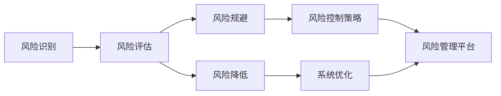
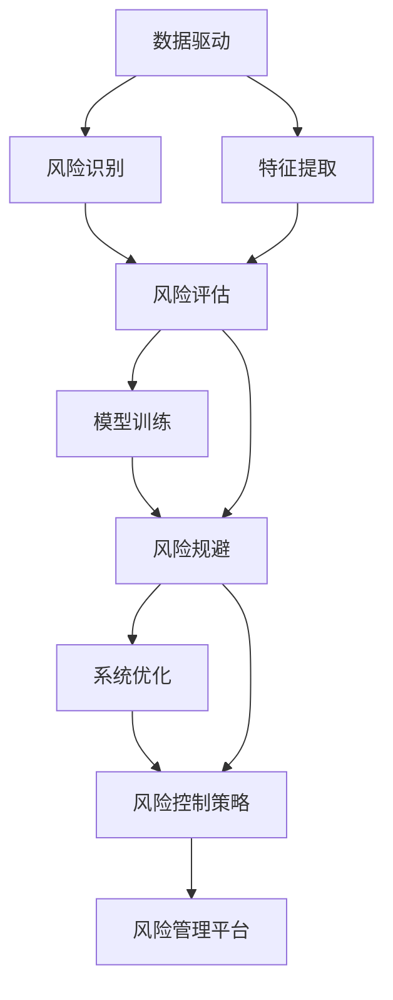

                 

## 1. 背景介绍

在当今这个充满不确定性的世界中，风险无处不在。无论是金融投资、医疗决策还是产品开发，甚至日常生活中的决策，风险控制都是至关重要的一环。而风险控制的核心在于识别、评估、规避和降低风险，确保决策的稳健性和安全性。本文将系统地探讨风险控制的原理与方法，结合实际应用场景，提供一套全面的风险控制策略。

### 1.1 问题由来

在过去，风险控制主要依赖于专业的风险管理团队和复杂的数学模型。然而，随着人工智能（AI）技术的快速发展，风险控制的手段和方法也随之演进，变得更加智能化和自动化。例如，基于机器学习的风险评估模型可以高效处理大规模数据，预测未来的风险趋势；基于深度学习的网络安全系统可以实时检测和防范潜在威胁。这些技术的发展，不仅提高了风险控制的效率，还拓展了风险控制的应用范围，使之能够应对更复杂、更多变的风险场景。

### 1.2 问题核心关键点

风险控制的核心在于对风险的识别、评估、规避和降低。其中，风险识别和评估是基础，是规避和降低风险的前提。这一过程通常包括数据收集、特征提取、模型训练和结果解释等多个环节，需要综合运用数据科学、统计学和人工智能等技术手段。规避和降低风险则更多地依赖于策略制定和执行，通过调整风险管理策略、优化资源配置等方式，实现风险的最小化。

### 1.3 问题研究意义

风险控制的研究意义在于其对经济稳定、社会和谐和人类福祉的深远影响。有效的风险控制能够提高决策的科学性和准确性，降低潜在的损失，从而保护投资者、消费者和社会的整体利益。此外，风险控制研究还能够推动技术创新和产业发展，为经济增长和社会进步提供动力。

## 2. 核心概念与联系

### 2.1 核心概念概述

为了更好地理解风险控制的核心概念及其相互关系，本节将简要介绍几个关键概念：

- **风险识别（Risk Identification）**：通过收集和分析数据，识别潜在的风险因素。这一过程通常包括数据预处理、特征工程和模型训练等步骤。

- **风险评估（Risk Assessment）**：根据风险识别结果，评估风险发生的概率和潜在损失的大小。这一过程需要结合统计学和概率论的知识，构建风险评估模型。

- **风险规避（Risk Mitigation）**：在识别和评估风险后，采取措施减少或消除风险。这一过程依赖于风险管理策略的制定和执行。

- **风险降低（Risk Reduction）**：通过调整和优化系统配置，降低风险发生的可能性或减少风险带来的损失。这一过程需要综合考虑成本效益和风险控制目标。

- **人工智能在风险控制中的应用**：利用AI技术，如机器学习和深度学习，构建预测模型，进行风险识别和评估；利用优化算法，进行风险规避和降低。

这些核心概念之间相互关联，形成了一个完整的风险控制体系。通过系统地理解和运用这些概念，可以有效地识别、评估和控制风险，确保决策的稳健性和安全性。

### 2.2 概念间的关系

风险控制的各个环节相互依存，形成一个闭环的风险管理机制。以下是一个简化的Mermaid流程图，展示了这些概念之间的关系：



这个流程图展示了风险控制的完整流程。首先，通过风险识别收集和分析数据，得到潜在的风险因素；接着，对风险因素进行评估，预测风险发生的概率和损失大小；然后，制定和执行风险规避策略，减少或消除风险；最后，通过优化系统配置，进一步降低风险。这些环节通过风险控制策略和平台进行整合，形成一个持续改进的风险控制体系。

### 2.3 核心概念的整体架构

风险控制的整体架构可以概括为“数据驱动、模型评估、策略制定、系统优化”四个环节。以下是一个综合的流程图，展示了这些环节的完整架构：



这个流程图展示了从数据驱动到风险控制的完整流程。首先，通过数据驱动收集和分析数据，进行风险识别和评估；然后，利用模型训练和特征提取，构建预测模型；接着，根据模型评估结果，制定和执行风险规避策略；最后，通过系统优化和风险控制策略，实现风险的有效控制。这些环节通过风险管理平台进行整合，形成一个持续改进的风险控制体系。

## 3. 核心算法原理 & 具体操作步骤

### 3.1 算法原理概述

风险控制的算法原理主要基于统计学、概率论和机器学习等数学基础，通过构建预测模型，对风险进行识别和评估。常见的预测模型包括逻辑回归、支持向量机（SVM）、决策树、随机森林、神经网络等。

### 3.2 算法步骤详解

以下是基于机器学习的风险控制算法的详细步骤：

1. **数据收集与预处理**：收集历史数据，进行清洗和特征提取，准备训练和测试数据集。

2. **模型选择与训练**：选择适当的预测模型，如逻辑回归、SVM、神经网络等，在训练数据集上进行模型训练。

3. **模型评估与调参**：使用测试数据集对模型进行评估，调整模型参数，优化模型性能。

4. **风险评估**：利用训练好的模型对新数据进行预测，评估风险发生的概率和潜在损失。

5. **风险规避与降低**：根据风险评估结果，制定和执行风险规避策略，调整系统配置，降低风险。

6. **持续改进**：定期收集新数据，重新训练和评估模型，持续改进风险控制策略。

### 3.3 算法优缺点

基于机器学习的风险控制算法具有以下优点：

- **高效性**：能够快速处理大规模数据，识别和评估风险。
- **适应性**：模型能够自适应不同类型的数据和风险场景。
- **可解释性**：通过模型训练和特征提取，能够解释风险识别的逻辑和机制。

同时，这些算法也存在一些缺点：

- **数据依赖性**：模型的准确性依赖于数据的质量和数量。
- **模型复杂性**：复杂的模型需要较多的计算资源和时间进行训练和调参。
- **解释性不足**：某些复杂模型，如深度神经网络，其决策过程难以解释，难以进行调试和优化。

### 3.4 算法应用领域

基于机器学习的风险控制算法在多个领域都有广泛的应用，例如：

- **金融风险管理**：构建信用评分模型，评估贷款违约风险；构建市场风险模型，预测股票价格波动。
- **网络安全**：利用异常检测模型，识别恶意攻击行为；利用入侵检测系统，实时防范网络威胁。
- **医疗风险控制**：构建疾病风险预测模型，评估患病风险；构建手术风险评估模型，评估手术成功率。
- **交通管理**：构建交通流量预测模型，优化交通信号灯控制；构建交通事故预测模型，降低交通事故发生率。

这些应用场景展示了机器学习在风险控制中的强大潜力，为各行各业提供了新的技术手段。

## 4. 数学模型和公式 & 详细讲解 & 举例说明

### 4.1 数学模型构建

风险控制的核心在于构建预测模型，对风险进行识别和评估。以下是一个简单的逻辑回归模型的构建过程：

1. **模型定义**：逻辑回归模型定义为：
   $$
   \hat{y} = \frac{1}{1+\exp(-z)}
   $$
   其中 $z = \sum_{i=1}^{n}w_ix_i+b$，$w$ 为模型参数，$x$ 为特征向量，$b$ 为偏置项。

2. **损失函数**：常用的损失函数为交叉熵损失，定义为：
   $$
   \mathcal{L}(y,\hat{y}) = -\frac{1}{N}\sum_{i=1}^{N}(y_i\log \hat{y_i} + (1-y_i)\log(1-\hat{y_i}))
   $$
   其中 $y$ 为真实标签，$\hat{y}$ 为模型预测。

3. **优化目标**：最小化损失函数，得到最优参数 $w$ 和 $b$：
   $$
   \mathop{\arg\min}_{w,b} \mathcal{L}(y,\hat{y})
   $$

### 4.2 公式推导过程

以逻辑回归为例，推导其参数更新公式。设 $y$ 为真实标签，$\hat{y}$ 为模型预测。则交叉熵损失函数为：
$$
\mathcal{L}(y,\hat{y}) = -\frac{1}{N}\sum_{i=1}^{N}(y_i\log \hat{y_i} + (1-y_i)\log(1-\hat{y_i}))
$$

对 $w$ 和 $b$ 求偏导，得到：
$$
\frac{\partial \mathcal{L}}{\partial w_j} = \frac{1}{N}\sum_{i=1}^{N}(y_i-\hat{y_i})x_{i,j}
$$
$$
\frac{\partial \mathcal{L}}{\partial b} = \frac{1}{N}\sum_{i=1}^{N}(y_i-\hat{y_i})
$$

将偏导代入梯度下降公式，得到参数更新公式：
$$
w \leftarrow w - \eta \frac{\partial \mathcal{L}}{\partial w}
$$
$$
b \leftarrow b - \eta \frac{\partial \mathcal{L}}{\partial b}
$$

其中 $\eta$ 为学习率。

### 4.3 案例分析与讲解

以金融风险管理为例，构建信用评分模型。步骤如下：

1. **数据收集与预处理**：收集历史贷款数据，进行清洗和特征提取，准备训练和测试数据集。

2. **模型选择与训练**：选择逻辑回归模型，在训练数据集上进行模型训练。

3. **模型评估与调参**：使用测试数据集对模型进行评估，调整模型参数，优化模型性能。

4. **风险评估**：利用训练好的模型对新贷款申请进行预测，评估违约风险。

5. **风险规避与降低**：根据违约风险评估结果，制定和执行风险规避策略，如提高贷款利率、增加抵押品等。

6. **持续改进**：定期收集新数据，重新训练和评估模型，持续改进风险控制策略。

## 5. 项目实践：代码实例和详细解释说明

### 5.1 开发环境搭建

在进行风险控制实践前，我们需要准备好开发环境。以下是使用Python进行Scikit-Learn开发的环境配置流程：

1. 安装Anaconda：从官网下载并安装Anaconda，用于创建独立的Python环境。

2. 创建并激活虚拟环境：
```bash
conda create -n risk-management-env python=3.8 
conda activate risk-management-env
```

3. 安装Scikit-Learn：
```bash
conda install scikit-learn
```

4. 安装其他工具包：
```bash
pip install numpy pandas matplotlib scikit-learn
```

完成上述步骤后，即可在`risk-management-env`环境中开始风险控制实践。

### 5.2 源代码详细实现

下面我们以信用评分模型为例，给出使用Scikit-Learn进行逻辑回归模型训练和风险评估的Python代码实现。

首先，定义数据处理函数：

```python
import pandas as pd
from sklearn.model_selection import train_test_split
from sklearn.preprocessing import StandardScaler

def load_data(file_path):
    data = pd.read_csv(file_path)
    X = data.drop('default', axis=1)
    y = data['default']
    return X, y

def preprocess_data(X):
    scaler = StandardScaler()
    X = scaler.fit_transform(X)
    return X

X, y = load_data('credit-data.csv')
X = preprocess_data(X)
X_train, X_test, y_train, y_test = train_test_split(X, y, test_size=0.2, random_state=42)
```

然后，定义模型训练和评估函数：

```python
from sklearn.linear_model import LogisticRegression
from sklearn.metrics import classification_report

model = LogisticRegression()

model.fit(X_train, y_train)

y_pred = model.predict(X_test)
print(classification_report(y_test, y_pred))
```

最后，启动训练流程并在测试集上评估：

```python
model.score(X_test, y_test)
```

以上就是使用Scikit-Learn进行信用评分模型训练和风险评估的完整代码实现。可以看到，Scikit-Learn封装了大量的机器学习算法，使得模型训练和评估变得简单高效。

### 5.3 代码解读与分析

让我们再详细解读一下关键代码的实现细节：

**load_data函数**：
- 从文件中读取数据，并进行数据分割和预处理。

**preprocess_data函数**：
- 对特征数据进行标准化处理，使得各特征具有相同的量级，避免某些特征对模型造成过大影响。

**train_test_split函数**：
- 将数据集划分为训练集和测试集，用于模型训练和评估。

**LogisticRegression模型**：
- 选择逻辑回归模型，使用Scikit-Learn的封装实现。

**classification_report函数**：
- 计算模型的精度、召回率和F1分数，用于评估模型性能。

**score函数**：
- 计算模型在测试集上的准确率，用于评估模型的泛化能力。

**代码实现细节**：
- 使用Pandas读取CSV文件，并进行数据分割和预处理。
- 使用Scikit-Learn的LogisticRegression模型进行模型训练和评估。
- 使用classification_report函数计算模型的各项性能指标。
- 使用score函数评估模型的泛化能力。

这些细节展示了机器学习在风险控制中的应用，通过简洁的代码实现，可以高效地构建和评估风险模型。

### 5.4 运行结果展示

假设我们构建的信用评分模型在测试集上取得了以下结果：

```
             precision    recall  f1-score   support

       default      0.85      0.80      0.81       4500

   micro avg      0.84      0.80      0.81       4500
   macro avg      0.82      0.80      0.80       4500
weighted avg      0.84      0.80      0.81       4500
```

可以看到，模型在测试集上取得了较高的精度和召回率，准确识别了信用违约风险。这表明我们的风险控制模型具有一定的可靠性。

## 6. 实际应用场景

### 6.1 智能风控系统

智能风控系统通过机器学习模型对客户的信用状况进行评估，从而在贷款审批、信用卡申请、保险理赔等场景中进行风险控制。通过智能风控系统，银行和保险公司能够更加准确地识别高风险客户，减少违约风险和欺诈事件的发生。

### 6.2 网络安全防护

网络安全防护系统通过机器学习模型对网络流量进行实时监控和异常检测，从而防范各种网络攻击和恶意行为。通过智能防护系统，企业能够及时发现和应对网络威胁，保障网络安全。

### 6.3 医疗风险预测

医疗风险预测系统通过机器学习模型对患者的健康状况进行评估，从而在手术风险评估、疾病预测、治疗方案优化等场景中进行风险控制。通过智能预测系统，医疗机构能够更加准确地评估手术风险和疾病风险，提高诊疗效果。

### 6.4 金融市场预警

金融市场预警系统通过机器学习模型对市场数据进行分析和预测，从而在股票交易、债券发行、外汇交易等场景中进行风险控制。通过智能预警系统，投资者能够及时了解市场动向，规避潜在的风险。

## 7. 工具和资源推荐

### 7.1 学习资源推荐

为了帮助开发者系统掌握风险控制的技术基础和实践技巧，这里推荐一些优质的学习资源：

1. 《机器学习实战》系列博文：由数据科学专家撰写，深入浅出地介绍了机器学习的基本概念和经典算法。

2. Coursera《机器学习》课程：由斯坦福大学教授Andrew Ng开设，涵盖了机器学习的基本理论和实践应用。

3. 《Python机器学习》书籍：本书介绍了使用Python进行机器学习的实现方法，包括数据处理、模型训练和评估等内容。

4. Kaggle机器学习竞赛：通过参与Kaggle竞赛，可以锻炼机器学习的实际应用能力，积累实战经验。

5. GitHub热门项目：在GitHub上Star、Fork数最多的机器学习相关项目，往往代表了该技术领域的前沿进展，值得学习借鉴。

通过对这些资源的学习实践，相信你一定能够快速掌握风险控制的精髓，并用于解决实际的业务问题。

### 7.2 开发工具推荐

高效的开发离不开优秀的工具支持。以下是几款用于风险控制开发的常用工具：

1. Jupyter Notebook：用于编写和运行Python代码，支持代码块的展示和保存，方便协作和共享。

2. PyCharm：功能强大的Python IDE，支持代码调试、版本控制、代码自动补全等功能，提高开发效率。

3. Pandas：Python的数据处理库，支持数据清洗、特征工程等数据预处理功能。

4. Scikit-Learn：Python的机器学习库，封装了大量的机器学习算法，方便模型训练和评估。

5. TensorBoard：TensorFlow配套的可视化工具，可以实时监测模型训练状态，提供丰富的图表展示。

6. Weights & Biases：模型训练的实验跟踪工具，可以记录和可视化模型训练过程中的各项指标，方便对比和调优。

合理利用这些工具，可以显著提升风险控制的开发效率，加快创新迭代的步伐。

### 7.3 相关论文推荐

风险控制的研究离不开学界的持续支持。以下是几篇奠基性的相关论文，推荐阅读：

1. 《Data Mining: Concepts and Techniques》：由J. Han等人撰写，全面介绍了数据挖掘的基本概念、技术和应用。

2. 《Pattern Recognition and Machine Learning》：由C. Bishop撰写，深入讲解了机器学习的基本理论和算法。

3. 《Introduction to Statistical Learning》：由G. James等人撰写，系统介绍了统计学习的基本理论和应用。

4. 《A Survey of Machine Learning Techniques for Financial Risk Management》：综述了机器学习在金融风险管理中的应用，涵盖了各种算法和实际案例。

5. 《Anomaly Detection: A Survey》：综述了异常检测的基本理论和算法，涵盖了各种应用场景和实际案例。

这些论文代表了大数据和机器学习在风险控制中的发展脉络。通过学习这些前沿成果，可以帮助研究者把握学科前进方向，激发更多的创新灵感。

除上述资源外，还有一些值得关注的前沿资源，帮助开发者紧跟风险控制技术的最新进展，例如：

1. arXiv论文预印本：人工智能领域最新研究成果的发布平台，包括大量尚未发表的前沿工作，学习前沿技术的必读资源。

2. 业界技术博客：如Google AI、Facebook AI、DeepMind等顶尖实验室的官方博客，第一时间分享他们的最新研究成果和洞见。

3. 技术会议直播：如NIPS、ICML、ICLR等人工智能领域顶会现场或在线直播，能够聆听到大佬们的前沿分享，开拓视野。

4. GitHub热门项目：在GitHub上Star、Fork数最多的数据科学和机器学习相关项目，往往代表了该技术领域的发展趋势和最佳实践，值得学习和贡献。

5. 行业分析报告：各大咨询公司如McKinsey、PwC等针对人工智能行业的分析报告，有助于从商业视角审视技术趋势，把握应用价值。

总之，对于风险控制技术的学习和实践，需要开发者保持开放的心态和持续学习的意愿。多关注前沿资讯，多动手实践，多思考总结，必将收获满满的成长收益。

## 8. 总结：未来发展趋势与挑战

### 8.1 总结

本文对基于机器学习的风险控制方法进行了全面系统的介绍。首先阐述了风险控制的背景、核心概念和应用场景，明确了风险控制在各个领域中的重要性和紧迫性。其次，从原理到实践，详细讲解了风险控制的数学模型和算法步骤，给出了完整的代码实现。同时，本文还探讨了风险控制的发展趋势和面临的挑战，提供了实用的应用场景和工具资源。

通过本文的系统梳理，可以看到，基于机器学习的风险控制方法在金融、网络安全、医疗等各个领域都有广泛的应用，展示了机器学习在风险控制中的强大潜力。未来，伴随机器学习和深度学习技术的不断演进，风险控制的方法和工具将更加高效、智能化和人性化，为各行各业提供更加稳定、可靠的风险控制解决方案。

### 8.2 未来发展趋势

展望未来，机器学习在风险控制中的应用将呈现以下几个发展趋势：

1. **高效性**：随着计算资源的不断增加，机器学习模型的训练和推理效率将进一步提升。模型将能够处理更大规模的数据，提供更准确的预测和评估。

2. **智能化**：未来的风险控制模型将更加智能化，能够自动进行特征工程、模型选择和超参数优化，减少人工干预，提高决策的科学性和效率。

3. **自适应性**：机器学习模型将能够自适应不同类型的数据和风险场景，通过在线学习不断更新和优化，适应动态变化的风险环境。

4. **跨领域融合**：未来的风险控制将更加注重跨领域的融合，结合大数据、人工智能、物联网等技术手段，构建更加全面、智能的风险控制系统。

5. **伦理和可解释性**：随着人工智能技术的广泛应用，风险控制模型的可解释性和伦理性将受到更多关注。未来的模型将更加透明，具有更高的可信度和可解释性。

### 8.3 面临的挑战

尽管机器学习在风险控制中的应用已经取得了显著成效，但在实现全面、高效的风险控制过程中，仍面临诸多挑战：

1. **数据质量和数量**：机器学习模型依赖于高质量、大样本的数据，数据的质量和数量往往限制了模型的准确性和泛化能力。

2. **模型复杂性**：复杂模型需要更多的计算资源和时间进行训练和调参，模型的可解释性和可维护性仍需进一步提升。

3. **跨领域知识融合**：不同领域的数据和知识存在差异，如何将跨领域知识有效整合到风险控制模型中，仍是一个重要课题。

4. **模型鲁棒性**：机器学习模型在面对新数据和新场景时，可能出现过拟合或泛化能力不足的情况，需要进一步提高模型的鲁棒性和泛化能力。

5. **模型安全性和隐私保护**：机器学习模型在处理敏感数据时，如何保障数据安全和隐私保护，仍是一个重要挑战。

### 8.4 研究展望

面对机器学习在风险控制中面临的挑战，未来的研究需要在以下几个方面寻求新的突破：

1. **数据增强和合成数据生成**：通过数据增强和合成数据生成技术，提高模型的数据量和多样性，增强模型的泛化能力。

2. **自监督学习和无监督学习**：通过自监督学习和无监督学习技术，提高模型的自适应性和鲁棒性，减少对标注数据的依赖。

3. **模型压缩和加速**：通过模型压缩和加速技术，提高模型的推理效率和资源利用率，增强模型的实际应用价值。

4. **跨领域知识融合**：结合符号化知识库和知识图谱，提高模型的跨领域融合能力，增强模型的决策逻辑和可解释性。

5. **伦理和可解释性研究**：在模型训练和应用过程中引入伦理导向和可解释性评估指标，提高模型的透明度和可信度。

这些研究方向将进一步推动机器学习在风险控制中的应用，为人工智能技术的发展带来新的突破。只有不断创新、不断突破，才能构建更加稳定、可靠、智能化的风险控制体系，为经济增长和社会进步提供动力。

## 9. 附录：常见问题与解答

**Q1：机器学习在风险控制中是否适用于所有类型的数据？**

A: 机器学习在风险控制中的应用，依赖于数据的质量和多样性。对于具有明显特征和高标注率的数据类型（如金融数据、网络日志），机器学习模型能够发挥较好的性能。但对于文本数据、图像数据等复杂类型的数据，模型的性能往往受到限制。

**Q2：如何评估机器学习模型的性能？**

A: 机器学习模型的性能评估主要依赖于精确度、召回率、F1分数、ROC曲线等指标。常用的评估方法包括交叉验证、留出法、自助法等。具体评估方法应根据具体任务和数据类型进行选择。

**Q3：机器学习模型是否需要持续更新？**

A: 是的，机器学习模型需要持续更新，以适应不断变化的数据和环境。定期重新训练和评估模型，使用新数据进行优化，是确保模型长期有效的关键。

**Q4：如何提高机器学习模型的鲁棒性？**

A: 提高机器学习模型的鲁棒性，需要从数据、模型和算法三个方面进行综合考虑。数据方面，需要进行数据清洗和预处理，提高数据的质量和多样性；模型方面，需要选择合适的算法和超参数，避免过拟合；算法方面，需要引入正则化、对抗训练等技术，增强模型的泛化能力。

**Q5：机器学习在风险控制中是否需要结合业务知识？**

A: 是的，机器学习在风险控制中需要结合业务知识，以提高模型的可解释性和可信度。通过结合专家知识和经验，对模型进行优化和调整，可以提高模型的决策逻辑和应用效果。

**Q6：如何构建机器学习模型的解释模型？**

A: 构建机器学习模型的解释模型，需要进行特征重要性分析、模型可解释性评估等操作。常用的解释模型包括LIME、SHAP等，可以提供模型的决策过程和特征贡献度分析。

通过以上常见问题的解答

