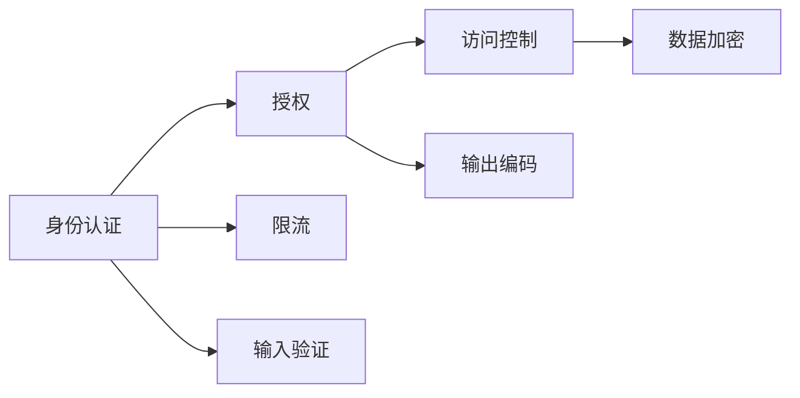
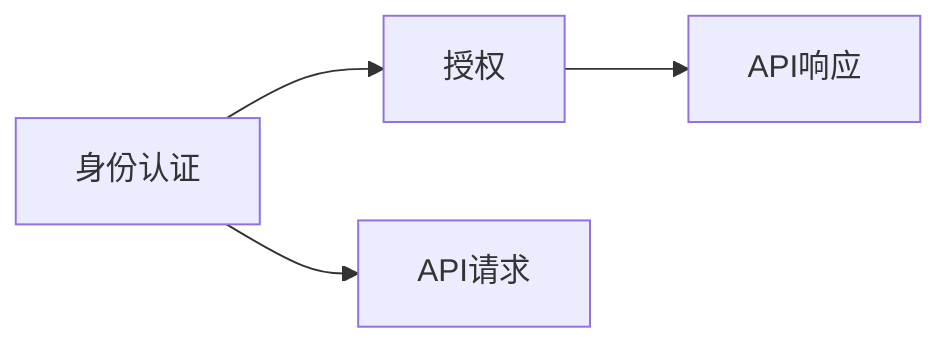
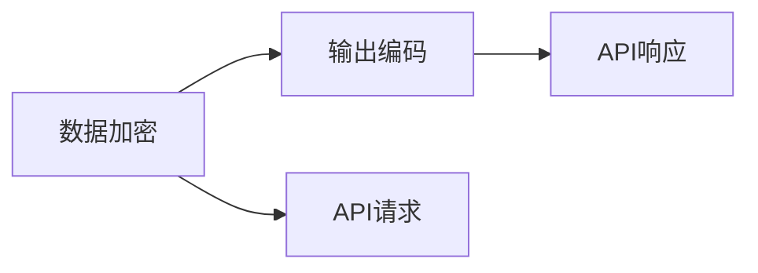
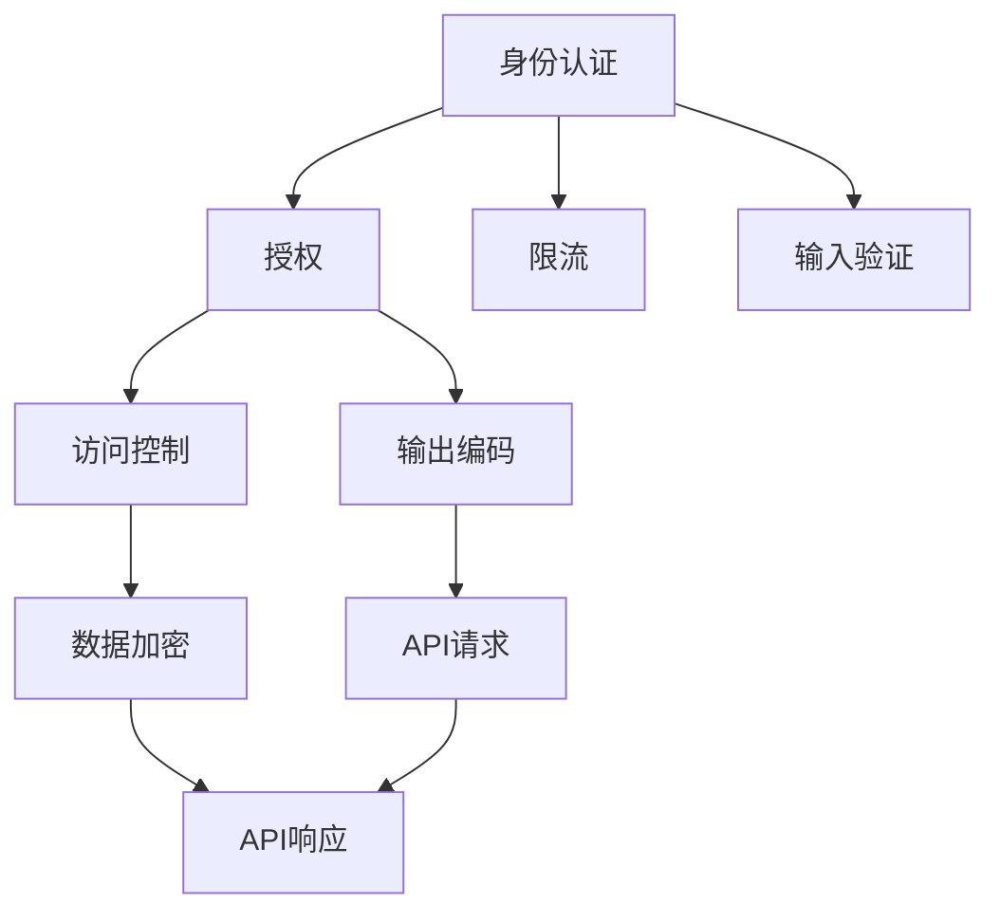

                 

# 安全 API 设计的详细步骤

## 1. 背景介绍

### 1.1 问题由来
在现代软件开发中，API（Application Programming Interface，应用编程接口）成为了不可或缺的一部分。API不仅提高了软件系统的模块化程度和复用性，也促进了不同系统之间的互操作性。然而，随着API的重要性日益凸显，API的安全性问题也愈发显著。API攻击事件层出不穷，包括数据泄露、服务拒绝、注入攻击等，给企业带来了巨大的损失。因此，设计一个安全可靠的API成为了当前软件开发的重要挑战。

### 1.2 问题核心关键点
API设计中的安全问题主要集中在以下几个方面：
- **身份认证与授权**：确保API请求来源的可信性，防止恶意用户访问或滥用API。
- **输入验证与过滤**：防止API输入数据中的恶意代码或异常数据导致的安全漏洞。
- **访问控制与限流**：确保API服务能够安全、可靠地提供给授权用户，防止过载和滥用。
- **数据加密与传输安全**：确保API传输过程中的数据不被篡改或窃听。

本文将围绕以上核心关键点，详细介绍如何设计一个安全可靠的API。

### 1.3 问题研究意义
安全API设计不仅是保障企业数据安全和个人隐私的重要手段，也是提升API系统稳定性和可靠性的关键。通过设计安全的API，可以防止API被攻击者利用，减少安全事件的发生，保护企业的资产和声誉。同时，安全的API设计还能提高用户对API的信任度，促进API的广泛使用和应用。因此，安全API设计对于构建安全、可靠的软件系统具有重要意义。

## 2. 核心概念与联系

### 2.1 核心概念概述

为更好地理解安全API设计的细节，本节将介绍几个密切相关的核心概念：

- **身份认证（Authentication）**：确认用户身份的过程，通常通过用户名、密码、令牌等方式进行。
- **授权（Authorization）**：基于身份认证的结果，对用户访问资源进行权限控制，确保用户只能访问其权限范围内的API。
- **访问控制（Access Control）**：在身份认证和授权的基础上，对用户请求的API进行细粒度的控制，防止未经授权的访问。
- **限流（Rate Limiting）**：限制API服务的请求频率，防止API服务被恶意滥用。
- **输入验证（Input Validation）**：对API输入数据进行严格的检查和过滤，防止恶意代码或异常数据造成安全漏洞。
- **输出编码（Output Encoding）**：对API输出数据进行编码，确保数据在传输过程中不被篡改。
- **数据加密（Data Encryption）**：对传输的数据进行加密，防止数据在传输过程中被窃听或篡改。

这些核心概念之间的逻辑关系可以通过以下Mermaid流程图来展示：



这个流程图展示了几大核心概念之间的关系：

1. 身份认证是授权的前提，授权是访问控制的基础。
2. 限流和输入验证是保障API安全性的重要手段。
3. 输出编码和数据加密则是保障数据传输安全的关键技术。

### 2.2 概念间的关系

这些核心概念之间存在着紧密的联系，形成了安全API设计的完整生态系统。下面我通过几个Mermaid流程图来展示这些概念之间的关系。

#### 2.2.1 身份认证与授权的关系



这个流程图展示了身份认证和授权的基本流程。身份认证通过验证用户身份，生成授权令牌，授权则基于该令牌对用户请求进行权限控制。

#### 2.2.2 输入验证与限流的关系


这个流程图展示了输入验证和限流的基本流程。输入验证对API请求进行严格的检查和过滤，防止恶意代码或异常数据进入API系统，限流则进一步限制了API请求的频率，防止滥用。

#### 2.2.3 数据加密与输出编码的关系



这个流程图展示了数据加密和输出编码的基本流程。数据加密对传输的数据进行加密，防止数据在传输过程中被窃听或篡改，输出编码则进一步保证了数据在传输过程中的完整性和正确性。

### 2.3 核心概念的整体架构

最后，我们用一个综合的流程图来展示这些核心概念在大规模API系统中的整体架构：



这个综合流程图展示了从身份认证到数据加密的整个流程。API请求首先经过身份认证和授权，确保请求来源的合法性。接着，请求进入限流和输入验证环节，防止恶意请求和异常数据。最终，数据在输出编码和数据加密的保护下，安全地传输至API响应，保证了API的安全性和可靠性。

## 3. 核心算法原理 & 具体操作步骤
### 3.1 算法原理概述

安全API设计主要基于以下算法原理：

- **身份认证算法**：通过用户名、密码、令牌等方式验证用户身份，确保API请求来源的合法性。
- **授权算法**：基于身份认证的结果，对用户访问资源进行权限控制，确保用户只能访问其权限范围内的API。
- **访问控制算法**：在身份认证和授权的基础上，对用户请求的API进行细粒度的控制，防止未经授权的访问。
- **限流算法**：限制API服务的请求频率，防止API服务被恶意滥用。
- **输入验证算法**：对API输入数据进行严格的检查和过滤，防止恶意代码或异常数据造成安全漏洞。
- **输出编码算法**：对API输出数据进行编码，确保数据在传输过程中不被篡改。
- **数据加密算法**：对传输的数据进行加密，防止数据在传输过程中被窃听或篡改。

### 3.2 算法步骤详解

以下是安全API设计的详细步骤：

**步骤1：身份认证（Authentication）**

1. 用户输入用户名和密码。
2. 系统对用户名和密码进行验证，验证通过则生成身份令牌。
3. 系统将身份令牌与用户ID一起存储在认证服务器中。

**步骤2：授权（Authorization）**

1. 用户请求API时，携带身份令牌。
2. 系统从认证服务器中获取该令牌对应的用户ID。
3. 系统根据用户ID从授权服务器中获取用户的访问权限列表。
4. 系统对用户请求的API进行权限检查，确保用户只能访问其权限范围内的API。

**步骤3：访问控制（Access Control）**

1. 在授权的基础上，系统对用户请求的API进行细粒度的控制，防止未经授权的访问。
2. 系统检查请求参数、URL、请求方法等，确保请求符合预期。

**步骤4：限流（Rate Limiting）**

1. 对API请求的频率进行限制，防止恶意滥用。
2. 系统对每个用户或IP地址的请求次数进行计数，超过阈值则拒绝请求。

**步骤5：输入验证（Input Validation）**

1. 对API输入数据进行严格的检查和过滤，防止恶意代码或异常数据造成安全漏洞。
2. 系统检查输入数据的格式、类型、长度等，确保数据符合预期。

**步骤6：输出编码（Output Encoding）**

1. 对API输出数据进行编码，确保数据在传输过程中不被篡改。
2. 系统对输出数据进行base64编码、HTML编码等操作。

**步骤7：数据加密（Data Encryption）**

1. 对传输的数据进行加密，防止数据在传输过程中被窃听或篡改。
2. 系统对传输数据进行AES加密、RSA加密等操作。

### 3.3 算法优缺点

安全API设计的算法具有以下优点：

- **保障安全**：通过身份认证、授权、访问控制、限流、输入验证、输出编码、数据加密等手段，保障API的安全性和可靠性。
- **易于实现**：每个步骤都有成熟的算法和框架支持，易于实现。
- **灵活性高**：可以根据具体需求，灵活调整每个步骤的策略和参数，确保API的安全性。

同时，安全API设计的算法也存在一些缺点：

- **复杂度高**：每个步骤都需要严格的控制和验证，系统复杂度较高。
- **性能开销大**：每一步的验证和控制都会增加系统的负担，影响API的性能。

### 3.4 算法应用领域

安全API设计在以下领域得到了广泛应用：

- **金融领域**：金融API需要处理敏感数据，如账户信息、交易记录等，必须保障数据的安全性和隐私性。
- **电子商务领域**：电商API需要处理大量用户数据，如订单信息、支付信息等，必须保障数据的完整性和一致性。
- **社交网络领域**：社交网络API需要处理用户数据和行为数据，必须保障数据的安全性和隐私性。
- **物联网领域**：物联网API需要处理大量的设备数据，必须保障数据的安全性和可靠性。

## 4. 数学模型和公式 & 详细讲解  
### 4.1 数学模型构建

安全API设计的数学模型主要涉及以下几方面：

- **身份认证模型**：通过用户名、密码、令牌等方式验证用户身份。
- **授权模型**：基于身份认证的结果，对用户访问资源进行权限控制。
- **访问控制模型**：在身份认证和授权的基础上，对用户请求的API进行细粒度的控制。
- **限流模型**：限制API服务的请求频率，防止恶意滥用。
- **输入验证模型**：对API输入数据进行严格的检查和过滤。
- **输出编码模型**：对API输出数据进行编码，确保数据在传输过程中不被篡改。
- **数据加密模型**：对传输的数据进行加密，防止数据在传输过程中被窃听或篡改。

### 4.2 公式推导过程

以下我们以OAuth 2.0身份认证协议为例，推导其基本流程的数学模型。

OAuth 2.0是一种常用的身份认证协议，其基本流程包括：

1. 用户向授权服务器请求授权，授权服务器生成授权码。
2. 用户将授权码传递给API服务器，API服务器向授权服务器请求用户信息。
3. 授权服务器验证授权码，返回用户信息。

根据OAuth 2.0的流程，可以建立以下数学模型：

**步骤1：用户向授权服务器请求授权**

1. 用户输入用户名和密码。
2. 系统对用户名和密码进行验证，验证通过则生成身份令牌。

$$
\begin{aligned}
& \text{输入：} \text{用户名}, \text{密码} \\
& \text{输出：} \text{身份令牌}
\end{aligned}
$$

**步骤2：用户将授权码传递给API服务器**

1. 用户携带身份令牌和授权码请求API。

$$
\begin{aligned}
& \text{输入：} \text{身份令牌}, \text{授权码} \\
& \text{输出：} \text{API请求}
\end{aligned}
$$

**步骤3：API服务器向授权服务器请求用户信息**

1. 根据授权码，API服务器向授权服务器请求用户信息。

$$
\begin{aligned}
& \text{输入：} \text{授权码} \\
& \text{输出：} \text{用户信息}
\end{aligned}
$$

**步骤4：授权服务器验证授权码**

1. 授权服务器验证授权码，返回用户信息。

$$
\begin{aligned}
& \text{输入：} \text{授权码} \\
& \text{输出：} \text{用户信息}
\end{aligned}
$$

通过以上数学模型的推导，可以清晰地理解OAuth 2.0身份认证协议的基本流程和核心算法。

### 4.3 案例分析与讲解

以一个简单的API为例，展示安全API设计的实现过程：

假设有一个API，用于查询用户的订单信息。API需要验证用户身份，确保用户只能访问其授权范围内的订单信息。API的详细设计如下：

**步骤1：身份认证（Authentication）**

1. 用户输入用户名和密码。
2. 系统对用户名和密码进行验证，验证通过则生成身份令牌。
3. 系统将身份令牌与用户ID一起存储在认证服务器中。

**步骤2：授权（Authorization）**

1. 用户请求API时，携带身份令牌。
2. 系统从认证服务器中获取该令牌对应的用户ID。
3. 系统根据用户ID从授权服务器中获取用户的访问权限列表。
4. 系统对用户请求的API进行权限检查，确保用户只能访问其权限范围内的API。

**步骤3：访问控制（Access Control）**

1. 在授权的基础上，系统对用户请求的API进行细粒度的控制，防止未经授权的访问。
2. 系统检查请求参数、URL、请求方法等，确保请求符合预期。

**步骤4：限流（Rate Limiting）**

1. 对API请求的频率进行限制，防止恶意滥用。
2. 系统对每个用户或IP地址的请求次数进行计数，超过阈值则拒绝请求。

**步骤5：输入验证（Input Validation）**

1. 对API输入数据进行严格的检查和过滤，防止恶意代码或异常数据造成安全漏洞。
2. 系统检查输入数据的格式、类型、长度等，确保数据符合预期。

**步骤6：输出编码（Output Encoding）**

1. 对API输出数据进行编码，确保数据在传输过程中不被篡改。
2. 系统对输出数据进行base64编码、HTML编码等操作。

**步骤7：数据加密（Data Encryption）**

1. 对传输的数据进行加密，防止数据在传输过程中被窃听或篡改。
2. 系统对传输数据进行AES加密、RSA加密等操作。

## 5. 项目实践：代码实例和详细解释说明
### 5.1 开发环境搭建

在进行安全API设计时，我们需要准备好开发环境。以下是使用Python进行Flask框架开发的环境配置流程：

1. 安装Python：从官网下载并安装Python，选择合适的版本。
2. 安装Flask：使用pip安装Flask框架。
3. 创建虚拟环境：使用venv创建虚拟环境，激活虚拟环境。
4. 安装Flask扩展：安装Flask-RESTful、Flask-Security等扩展，以便实现API的认证和授权功能。
5. 安装数据库：安装MySQL、PostgreSQL等数据库，以便存储用户信息和API请求记录。

完成上述步骤后，即可在虚拟环境中开始安全API设计的实现。

### 5.2 源代码详细实现

以下是一个使用Flask框架实现的安全API的示例代码：

```python
from flask import Flask, request, jsonify
from flask_restful import Resource, Api
from flask_security import Security, SQLAlchemyUserDatastore, UserMixin, RoleMixin, login_required
from flask_sqlalchemy import SQLAlchemy
from itsdangerous import TimedJSONWebSignatureSerializer as Serializer

app = Flask(__name__)
api = Api(app)

# 配置数据库
app.config['SQLALCHEMY_DATABASE_URI'] = 'sqlite:///data.db'
app.config['SQLALCHEMY_TRACK_MODIFICATIONS'] = False
db = SQLAlchemy(app)

# 定义用户和角色模型
roles_users = db.Table('roles_users',
                       db.Column('user_id', db.Integer(), db.ForeignKey('user.id')),
                       db.Column('role_id', db.Integer(), db.ForeignKey('role.id')))

class Role(db.Model, RoleMixin):
    id = db.Column(db.Integer(), primary_key=True)
    name = db.Column(db.String(80), unique=True)

class User(db.Model, UserMixin):
    id = db.Column(db.Integer(), primary_key=True)
    email = db.Column(db.String(255), unique=True)
    password = db.Column(db.String(255))
    active = db.Column(db.Boolean())
    roles = db.relationship('Role', secondary=roles_users, backref=db.backref('users', lazy='dynamic'))

# 配置认证和授权
user_datastore = SQLAlchemyUserDatastore(db, User, Role)
security = Security(app, user_datastore)

# 定义API资源
class UserListResource(Resource):
    decorators = [login_required]

    def get(self):
        users = User.query.all()
        return jsonify([{'id': user.id, 'email': user.email} for user in users])

class OrderListResource(Resource):
    decorators = [login_required]

    def get(self):
        orders = Order.query.all()
        return jsonify([{'id': order.id, 'user_id': order.user_id, 'amount': order.amount} for order in orders])

# 定义API接口
api.add_resource(UserListResource, '/users')
api.add_resource(OrderListResource, '/orders')

if __name__ == '__main__':
    app.run(debug=True)
```

在上述代码中，我们使用了Flask框架，并结合Flask-RESTful和Flask-Security扩展，实现了基本的认证和授权功能。具体来说：

1. 首先定义了用户和角色模型，并通过Flask-Security扩展进行身份认证和授权。
2. 然后定义了API资源，其中`UserListResource`和`OrderListResource`分别用于获取用户和订单信息。
3. 最后通过API接口，暴露出这些资源的API接口。

### 5.3 代码解读与分析

让我们再详细解读一下关键代码的实现细节：

**用户和角色模型**：
- `Role`和`User`类分别表示角色和用户，通过SQLAlchemy扩展进行持久化存储。
- `roles_users`表用于存储用户和角色的关联关系，确保用户只能访问其授权范围内的API。

**认证和授权**：
- `SQLAlchemyUserDatastore`用于存储用户信息，支持身份认证和授权。
- `login_required`装饰器用于保护API资源，确保用户必须登录后才能访问。

**API资源**：
- `UserListResource`和`OrderListResource`分别用于获取用户和订单信息，通过`decorators`属性指定必须登录才能访问。

**API接口**：
- `api.add_resource`用于将资源绑定到API接口，方便通过URL访问。

**运行代码**：
- 启动Flask应用，并通过浏览器访问API接口。

### 5.4 运行结果展示

假设我们在本地启动Flask应用，并访问API接口，可以获取用户和订单信息。例如，访问`/users`接口，可以看到所有用户的信息：

```
[
    {"id": 1, "email": "user1@example.com"},
    {"id": 2, "email": "user2@example.com"}
]
```

在实际应用中，我们还可以对API接口进行进一步的优化，如增加输入验证、输出编码、数据加密等安全措施，以确保API的安全性和可靠性。

## 6. 实际应用场景
### 6.1 智能客服系统

在智能客服系统中，API的安全性显得尤为重要。客户输入的信息可能包含敏感数据，如身份证号、银行卡号等，必须确保数据的安全性和隐私性。

**安全设计**：
- **身份认证**：通过OAuth 2.0协议，确保客服系统只接受经过授权的API请求。
- **授权控制**：对用户请求的API进行细粒度的控制，确保用户只能访问其授权范围内的信息。
- **输入验证**：对用户输入的数据进行严格的检查和过滤，防止恶意代码或异常数据造成安全漏洞。
- **数据加密**：对传输的数据进行加密，防止数据在传输过程中被窃听或篡改。

**实际应用**：
- **会话管理**：通过OAuth 2.0协议，对每个会话进行管理，确保会话的有效性。
- **数据存储**：将客户输入的数据存储在数据库中，对敏感数据进行加密存储。
- **API接口**：对API接口进行细粒度的控制，确保API请求的安全性。

### 6.2 金融交易平台

金融交易平台需要处理大量的敏感数据，如交易记录、账户余额等，必须保障数据的安全性和隐私性。

**安全设计**：
- **身份认证**：通过OAuth 2.0协议，确保交易平台只接受经过授权的API请求。
- **授权控制**：对用户请求的API进行细粒度的控制，确保用户只能访问其授权范围内的数据。
- **输入验证**：对用户输入的数据进行严格的检查和过滤，防止恶意代码或异常数据造成安全漏洞。
- **数据加密**：对传输的数据进行加密，防止数据在传输过程中被窃听或篡改。

**实际应用**：
- **API接口**：对API接口进行细粒度的控制，确保API请求的安全性。
- **数据存储**：将交易数据存储在数据库中，对敏感数据进行加密存储。
- **会话管理**：通过OAuth 2.0协议，对每个会话进行管理，确保会话的有效性。

### 6.3 医疗信息平台

医疗信息平台需要处理大量的敏感数据，如病历记录、治疗方案等，必须保障数据的安全性和隐私性。

**安全设计**：
- **身份认证**：通过OAuth 2.0协议，确保医疗平台只接受经过授权的API请求。
- **授权控制**：对用户请求的API进行细粒度的控制，确保用户只能访问其授权范围内的数据。
- **输入验证**：对用户输入的数据进行严格的检查和过滤，防止恶意代码或异常数据造成安全漏洞。
- **数据加密**：对传输的数据进行加密，防止数据在传输过程中被窃听或篡改。

**实际应用**：
- **API接口**：对API接口进行细粒度的控制，确保API请求的安全性。
- **数据存储**：将医疗数据存储在数据库中，对敏感数据进行加密存储。
- **会话管理**：通过OAuth 2.0协议，对每个会话进行管理，确保会话的有效性。

## 7. 工具和资源推荐
### 7.1 学习资源推荐

为了帮助开发者系统掌握安全API设计的理论基础和实践技巧，这里推荐一些优质的学习资源：

1. 《API安全实战》系列博文：深入浅出地介绍了API安全的基本概念和实践方法。
2. CS261《Web应用程序设计与安全》课程：斯坦福大学开设的Web安全课程，涵盖各种Web安全攻防技术。
3. 《Web安全基础》书籍：系统介绍了Web安全的基本原理和攻防技术，适合入门和进阶学习。
4. OWASP网站：开放式Web应用安全项目，提供了大量Web安全攻防技术的学习资源和工具。
5. 《Flask安全指南》书籍：详细介绍了Flask框架的安全特性和最佳实践，适合Flask开发者参考。

通过对这些资源的学习实践，相信你一定能够快速掌握安全API设计的精髓，并用于解决实际的API安全问题。
###  7.2 开发工具推荐

高效的开发离不开优秀的工具支持。以下是几款用于安全API设计开发的常用工具：

1. Flask框架：轻量级的Web框架，易于上手，适合快速原型开发。
2. OAuth 2.0协议：广泛使用的身份认证协议，支持多种身份认证方式。
3. Flask-RESTful扩展：用于构建RESTful API的扩展，支持API资源的快速定义和部署。
4. Flask-Security扩展：用于实现认证和授权功能的扩展，支持多种认证方式和授权策略。
5. Itsdangerous库：用于生成和验证JSON Web Token的安全库。
6. SQLAlchemy库：用于持久化存储的ORM库，支持多种数据库和数据模型。

合理利用这些工具，可以显著提升安全API设计的开发效率，加快创新迭代的步伐。

### 7.3 相关论文推荐

安全API设计的研究源于学界的持续研究。以下是几篇奠基性的相关论文，推荐阅读：

1. OAuth 2.0：一种常用的身份认证协议，定义了OAuth 2.0的授权流程和协议规范。
2. OWASP Top 10：开放式Web应用安全项目，列出了Web应用十大常见安全风险和防护措施。
3. Web安全攻防技术：介绍了各种Web安全攻防技术，如SQL注入、XSS攻击、CSRF攻击等。
4. API安全指南：介绍了API安全的常见威胁和防护措施，如身份认证、授权控制、数据加密等。
5. OAuth 2.0最佳实践：介绍了OAuth 2.0协议的最佳实践，包括授权流程、参数验证、令牌管理等。

这些论文代表了大语言模型微调技术的发展脉络。通过学习这些前沿成果，可以帮助研究者把握学科前进方向，激发更多的创新灵感。

除上述资源外，还有一些值得关注的前沿资源，帮助开发者紧跟安全API设计技术的最新进展，例如：

1. arXiv论文预印本：人工智能领域最新研究成果的发布平台，包括大量尚未发表的前沿工作，学习前沿技术的必读资源。
2. 业界技术博客：如OWASP、Google Web、Mozilla等顶尖实验室的官方博客，第一时间分享他们的最新研究成果和洞见。
3. 技术会议直播：如OWASP Top 10、Web安全大会等，能够聆听到大佬们的前沿分享，开拓视野。
4. GitHub热门项目：在GitHub上Star、Fork数最多的Web安全相关项目，往往代表了该技术领域的发展趋势和最佳实践，值得去学习和贡献。
5. 行业分析报告：各大咨询公司如McKinsey、PwC等针对Web安全行业的分析报告，有助于从商业视角审视技术趋势，把握应用价值

