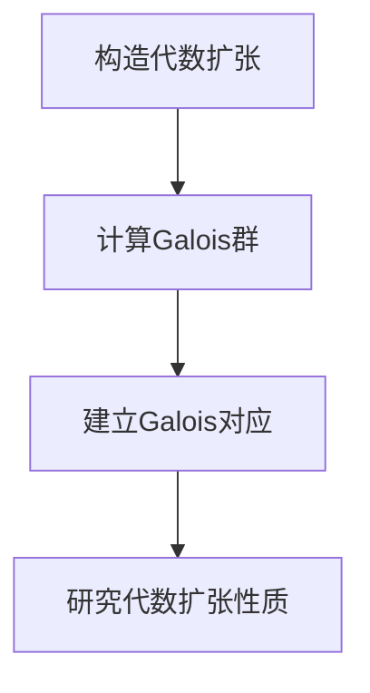

# 代数群引论：3.2 Galois上同调

## 1. 背景介绍

### 1.1 问题的由来

代数群论是研究群的代数结构及其性质的一门数学分支。在代数群论中,Galois理论是一个极其重要的理论,它为解决代数方程提供了一种全新的思路和方法。Galois理论的核心概念之一是Galois上同调,它描述了代数扩张与其Galois群之间的内在联系。

### 1.2 研究现状

Galois上同调的概念最早由著名数学家埃瓦里斯特·加洛瓦(Évariste Galois)在19世纪初提出。加洛瓦通过研究代数方程的可解性,发现了群论与代数方程之间的深刻联系。他的工作奠定了Galois理论的基础,并为后续的代数发展开辟了新的道路。

近代数学家对Galois上同调进行了深入研究,发展出了更加完备和精细的理论体系。著名数学家埃米尔·阿尔丁(Emil Artin)在20世纪初对Galois上同调作出了重大贡献,他的著作《代数学的几何思想》(Geometric Algebra)对Galois上同调进行了系统性阐述。

### 1.3 研究意义

Galois上同调理论在代数学、代数几何学和代数数论等领域具有广泛的应用。它不仅为解决代数方程提供了强有力的工具,同时也为研究代数结构的性质和代数扩张的行为提供了新的视角和方法。Galois上同调理论在数论、密码学、代数几何编码理论等领域都有重要应用。

### 1.4 本文结构

本文将从以下几个方面对Galois上同调进行深入探讨:

1. 核心概念与联系
2. 核心算法原理与具体操作步骤
3. 数学模型和公式详细讲解与举例说明
4. 项目实践:代码实例和详细解释说明
5. 实际应用场景
6. 工具和资源推荐
7. 总结:未来发展趋势与挑战
8. 附录:常见问题与解答

## 2. 核心概念与联系

Galois上同调理论涉及到许多核心概念,这些概念相互关联,构成了一个完整的理论体系。以下是一些关键概念:

1. **代数扩张(Algebraic Extension)**: 代数扩张是指在一个基本代数系统(如有理数域Q)上构造出一个更大的代数系统(如复数域C)的过程。代数扩张是Galois理论的研究对象。

2. **Galois群(Galois Group)**: 对于一个代数扩张,我们可以定义一个与之对应的Galois群,它是保持该扩张的自同构群。Galois群描述了代数扩张的对称性质。

3. **Galois对应(Galois Correspondence)**: Galois对应建立了代数扩张的子扩张与其Galois群的子群之间的一一对应关系。这是Galois理论的核心内容之一。

4. **可解性(Solvability)**: 可解性问题是Galois理论研究的重要课题之一,即判断一个代数方程是否可以通过有限次代数运算和根式运算来解出。Galois上同调理论为解决这一问题提供了有力工具。

5. **基本定理(Fundamental Theorem)**: Galois理论的基本定理阐述了Galois对应的具体形式,并为研究代数扩张的结构提供了理论基础。

这些核心概念相互关联,共同构成了Galois上同调理论的理论框架。理解这些概念及其联系,对于掌握Galois理论至关重要。

## 3. 核心算法原理与具体操作步骤

### 3.1 算法原理概述

Galois上同调理论的核心算法原理是建立代数扩张与其Galois群之间的对应关系,从而研究代数扩张的结构和性质。算法的主要步骤如下:

1. 构造代数扩张
2. 计算Galois群
3. 建立Galois对应
4. 利用Galois对应研究代数扩张的性质

该算法的关键在于计算Galois群和建立Galois对应。这需要一些代数运算和群论知识作为基础。

### 3.2 算法步骤详解

下面我们将详细介绍Galois上同调算法的具体步骤:

#### 步骤1: 构造代数扩张

给定一个基本代数系统(如有理数域Q)和一个代数方程,我们可以通过adjoining该方程的根来构造一个代数扩张。例如,对于方程$x^2 - 2 = 0$,我们可以在有理数域Q上adjoining$\sqrt{2}$来构造实数域R,即$R = Q(\sqrt{2})$。

#### 步骤2: 计算Galois群

对于构造出的代数扩张,我们需要计算其Galois群。Galois群是保持该扩张的自同构群,它描述了扩张的对称性质。

计算Galois群的具体步骤如下:

1. 列出所有自同构映射
2. 验证这些映射是否保持代数运算
3. 构造自同构映射组成的群

例如,对于扩张$Q(\sqrt{2})$,其Galois群只有两个元素:恒等映射和将$\sqrt{2}$映射为$-\sqrt{2}$的映射。

#### 步骤3: 建立Galois对应

建立Galois对应是Galois上同调理论的核心部分。Galois对应建立了代数扩张的子扩张与其Galois群的子群之间的一一对应关系。

具体来说,对于一个代数扩张$L/K$及其Galois群$G$,我们有:

- 每个$G$的子群$H$对应着$L$的一个子扩张$L^H$,其中$L^H$是由$H$不变元素组成的集合。
- 每个$L$的子扩张$M$对应着$G$的一个子群$G(M/K)$,其中$G(M/K)$是保持$M$不变的自同构映射组成的集合。

这种对应关系被称为Galois对应,它是Galois理论的核心内容之一。

#### 步骤4: 研究代数扩张的性质

利用建立的Galois对应,我们可以研究代数扩张的各种性质,如:

- 扩张的次数
- 扩张的可解性
- 扩张的分裂性质
- 扩张的规范基
- 等等

通过研究Galois群的结构,我们可以得到关于代数扩张的重要信息和结论。

### 3.3 算法优缺点

Galois上同调算法的优点在于:

- 提供了一种全新的研究代数扩张的方法
- 将代数扩张的性质与群论联系起来,使问题更加清晰
- 为解决代数方程的可解性问题提供了有力工具

但同时,该算法也存在一些缺点:

- 计算Galois群可能会变得非常复杂,尤其是对于高次代数扩张
- 需要掌握一定的代数和群论知识作为基础
- 对于一些特殊情况,算法可能无法给出明确的结论

### 3.4 算法应用领域

Galois上同调算法在以下领域有广泛应用:

- 代数学:研究代数扩张的结构和性质
- 代数几何学:研究代数曲线和代数曲面的性质
- 代数数论:研究代数数论中的一些重要问题,如reciprocity laws
- 密码学:在有限域上的应用
- 代数几何编码理论:在构造代数几何码时使用Galois群

总的来说,Galois上同调理论为研究代数结构提供了一种强有力的工具,在数学的多个分支领域都有重要应用。

## 4. 数学模型和公式详细讲解与举例说明

### 4.1 数学模型构建

在研究Galois上同调时,我们需要构建一些数学模型来描述相关概念和性质。以下是一些常见的数学模型:

1. **代数扩张模型**

   我们可以用一个tower of fields来表示代数扩张:

   $$
   K \subseteq L \subseteq M
   $$

   其中$K$是基本代数系统,如有理数域$\mathbb{Q}$;$L$是一个代数扩张,如$\mathbb{Q}(\sqrt{2})$;$M$是$L$的进一步扩张,如$\mathbb{Q}(\sqrt{2}, \sqrt{3})$。

2. **Galois群模型**

   对于一个代数扩张$L/K$,我们可以定义其Galois群$\operatorname{Gal}(L/K)$,它是保持$L$不变的$K$到$L$的自同构映射组成的群。

   Galois群描述了代数扩张的对称性质,它是一个有限群。我们可以用群论中的概念和性质来研究Galois群的结构。

3. **Galois对应模型**

   Galois对应建立了代数扩张的子扩张与其Galois群的子群之间的一一对应关系。具体来说,对于扩张$L/K$及其Galois群$G$,我们有:

   - 每个$G$的子群$H$对应着$L$的一个子扩张$L^H$
   - 每个$L$的子扩张$M$对应着$G$的一个子群$G(M/K)$

   这种对应关系可以用以下数学模型表示:

   $$
   \begin{aligned}
   H &\mapsto L^H \
   M &\mapsto G(M/K)
   \end{aligned}
   $$

通过构建这些数学模型,我们可以更好地理解和研究Galois上同调理论中的概念和性质。

### 4.2 公式推导过程

在Galois上同调理论中,有一些重要的公式需要推导和证明。下面我们将介绍其中一个公式的推导过程。

**定理**: 设$L/K$是一个代数扩张,其Galois群为$G$。对于$L$的任意子扩张$M$,我们有:

$$
[L:M] = [G:G(M/K)]
$$

其中$[L:M]$表示$L$相对于$M$的次数,$[G:G(M/K)]$表示$G$相对于$G(M/K)$的指数。

**证明**:

1) 首先,我们定义$L$上的一个等价关系$\sim_M$:对于$\alpha, \beta \in L$,如果$\sigma(\alpha) = \beta$对某个$\sigma \in G(M/K)$成立,那么$\alpha \sim_M \beta$。

2) 验证$\sim_M$确实是一个等价关系。

   - 反身性:对于任意$\alpha \in L$,由$\operatorname{id} \in G(M/K)$,我们有$\alpha \sim_M \alpha$。
   - 对称性:若$\alpha \sim_M \beta$,那么存在$\sigma \in G(M/K)$使得$\sigma(\alpha) = \beta$。由于$\sigma^{-1} \in G(M/K)$,我们有$\sigma^{-1}(\beta) = \alpha$,因此$\beta \sim_M \alpha$。
   - 传递性:若$\alpha \sim_M \beta$且$\beta \sim_M \gamma$,那么存在$\sigma_1, \sigma_2 \in G(M/K)$使得$\sigma_1(\alpha) = \beta$且$\sigma_2(\beta) = \gamma$。由于$\sigma_2 \circ \sigma_1 \in G(M/K)$,我们有$(\sigma_2 \circ \sigma_1)(\alpha) = \gamma$,因此$\alpha \sim_M \gamma$。

3) 由等价关系的性质,我们可以将$L$划分为若干个等价类$\{\alpha\}$,其中$\{\alpha\} = \{\beta \in L \mid \beta \sim_M \alpha\}$。

4) 注意到对于任意$\sigma \in G$和$\alpha \in L$,我们有$\sigma(\{\alpha\}) = \{\sigma(\alpha)\}$。这意味着$G$作用于等价类集合$L/\sim_M$。

5) 进一步,我们可以证明$G(M/K)$是$L/\sim_M$上的stabilizer,即$G(M/K) = \{\sigma \in G \mid \sigma(\{\alpha\}) = \{\alpha\}, \forall \{\alpha\} \in L/\sim_M\}$。

6) 由轨道-稳态子群定理,我们知道$|L/\sim_M| = [G:G(M