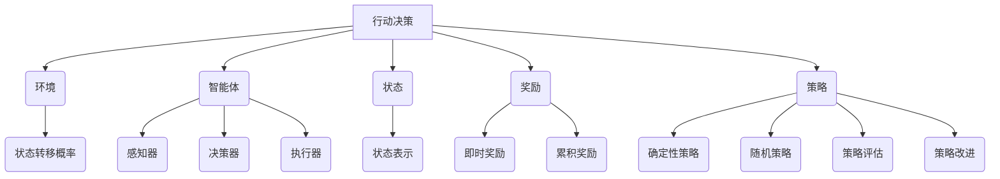

# 行动（Action）是指基于环境和规划做出的动作

## 1. 背景介绍

### 1.1 问题的由来

在人工智能领域中,行动(Action)是一个核心概念。智能体(Agent)需要根据当前环境状态和目标,选择合适的行动来实现预期目标。这种基于环境感知和规划的行动决策过程,是赋予智能体自主性和适应性的关键。

传统的软件系统往往是基于预先编码的规则和流程运行,缺乏对环境变化的感知和响应能力。而智能体通过持续感知环境、分析状态、制定规划,并根据规划执行相应行动,从而实现与环境的交互和适应。

### 1.2 研究现状

行动决策是人工智能领域的核心研究课题之一,已经产生了诸多理论模型和算法,如马尔可夫决策过程(MDP)、强化学习(Reinforcement Learning)、规划算法(Planning Algorithms)等。这些理论和算法为智能体的行动决策提供了有力支撑。

目前,行动决策技术已广泛应用于机器人控制、自动驾驶、游戏AI、智能调度等领域,展现出巨大的应用潜力和价值。

### 1.3 研究意义

行动决策技术是赋予智能体自主性和适应性的关键,对于构建真正智能的系统至关重要。通过对行动决策机理的深入研究,我们可以:

1. 提升智能体对复杂环境的感知和理解能力
2. 优化智能体的决策过程,做出更合理、更高效的行动选择
3. 增强智能体的适应性和鲁棒性,应对不确定因素和环境变化
4. 探索人类智能的本质,为发展通用人工智能(AGI)奠定理论基础

### 1.4 本文结构

本文将全面介绍行动决策的核心概念、算法原理、数学模型、实际应用等内容,旨在为读者提供系统的理解。文章主要包括以下几个部分:

1. 核心概念与联系
2. 核心算法原理与具体操作步骤
3. 数学模型和公式详细讲解与案例分析
4. 项目实践:代码实例和详细解释说明
5. 实际应用场景
6. 工具和资源推荐
7. 总结:未来发展趋势与挑战
8. 附录:常见问题与解答

## 2. 核心概念与联系

行动决策涉及多个核心概念,了解这些概念及其内在联系,对于掌握整个理论体系至关重要。

- **环境(Environment)**:智能体所处的外部世界,包括所有可观测的对象、事件和条件。
- **智能体(Agent)**:能够感知环境、做出决策并执行行动的主体,通常由感知器、决策器和执行器组成。
- **状态(State)**:描述环境当前情况的一组观测值或特征,是智能体做出行动决策的基础。
- **奖励(Reward)**:对智能体当前行动的评价反馈,可分为即时奖励和累积奖励。
- **策略(Policy)**:智能体在每个状态下选择行动的规则或函数映射,可以是确定性的或随机的。
- **状态转移概率(State Transition Probability)**:描述在执行某个行动后,环境从一个状态转移到另一状态的概率分布。

这些概念相互关联、相互作用,共同构成了行动决策的理论框架。智能体根据感知到的环境状态,结合策略选择合适的行动,并根据行动的结果获得奖励反馈,进而优化策略,形成一个闭环过程。

## 3. 核心算法原理与具体操作步骤

### 3.1 算法原理概述

行动决策算法的核心目标是找到一个最优策略,使智能体在环境中获得最大的累积奖励。根据环境的不同特性,主要算法可分为以下几类:

1. **马尔可夫决策过程(MDP)**: 适用于完全可观测、满足马尔可夫性质的确定性环境。
2. **部分可观测马尔可夫决策过程(POMDP)**: 适用于部分可观测、满足马尔可夫性质的确定性环境。
3. **强化学习(Reinforcement Learning)**: 适用于未知环境,通过试错和奖励反馈来学习最优策略。
4. **规划算法(Planning Algorithms)**: 适用于已知环境模型的情况,通过构建规划树或图来搜索最优路径。

上述算法均涉及策略评估(Policy Evaluation)和策略改进(Policy Improvement)两个核心步骤,通过不断迭代优化策略,最终收敛到最优解。

### 3.2 算法步骤详解

以值迭代(Value Iteration)算法为例,其步骤如下:

1. 初始化状态值函数 $V(s)$ 为任意值
2. 对每个状态 $s$,计算其值函数:

$$V(s) \leftarrow \max_{a} \sum_{s'} P(s'|s,a)[R(s,a,s') + \gamma V(s')]$$

其中:
- $a$ 为可选行动
- $P(s'|s,a)$ 为从状态 $s$ 执行行动 $a$ 后,转移到状态 $s'$ 的概率
- $R(s,a,s')$ 为从状态 $s$ 执行行动 $a$ 到达状态 $s'$ 的即时奖励
- $\gamma$ 为折现因子,控制未来奖励的重要程度

3. 重复步骤2,直到值函数收敛
4. 从值函数 $V(s)$ 导出最优策略 $\pi^*(s)$:

$$\pi^*(s) = \arg\max_{a} \sum_{s'} P(s'|s,a)[R(s,a,s') + \gamma V(s')]$$

值迭代通过自洽方程(Bellman方程)不断更新状态值函数,最终得到最优策略。该算法适用于已知环境模型(状态转移概率和奖励函数)的情况。

### 3.3 算法优缺点

上述算法各有优缺点:

- **MDP和POMDP**:
  - 优点:理论基础扎实,可以得到最优解
  - 缺点:需要已知环境模型,计算复杂度高
- **强化学习**:
  - 优点:无需事先了解环境模型,可以通过试错学习
  - 缺点:收敛速度较慢,可能陷入局部最优
- **规划算法**:
  - 优点:搜索效率较高,可处理大规模问题
  - 缺点:需要已知环境模型,解的质量取决于启发式函数

在实际应用中,往往需要根据具体问题特点选择合适的算法,或结合多种算法的优点。

### 3.4 算法应用领域

行动决策算法已广泛应用于多个领域:

- **机器人控制**:使机器人能够根据传感器数据做出移动、操作等决策
- **自动驾驶**:车辆根据路况、交通信号等环境信息做出转向、加速等决策
- **游戏AI**:游戏AI根据游戏状态做出移动、攻击等行动决策
- **智能调度**:根据资源状况、任务需求做出作业调度决策
- **对话系统**:根据对话上下文做出自然语言回复决策
- **网络路由**:根据网络拥塞情况做出分组传输路由决策

## 4. 数学模型和公式详细讲解与举例说明

### 4.1 数学模型构建

行动决策问题通常建模为马尔可夫决策过程(MDP):

$$\langle \mathcal{S}, \mathcal{A}, \mathcal{P}, \mathcal{R}, \gamma \rangle$$

其中:

- $\mathcal{S}$ 是状态集合
- $\mathcal{A}$ 是行动集合
- $\mathcal{P}$ 是状态转移概率函数,定义为 $\mathcal{P}(s'|s,a) = \Pr(S_{t+1}=s'|S_t=s, A_t=a)$
- $\mathcal{R}$ 是奖励函数,定义为 $\mathcal{R}(s,a,s')= \mathbb{E}[R_{t+1}|S_t=s, A_t=a, S_{t+1}=s']$
- $\gamma \in [0,1)$ 是折现因子,控制未来奖励的重视程度

目标是找到一个策略 $\pi: \mathcal{S} \rightarrow \mathcal{A}$,使得期望累积折现奖励最大:

$$\max_{\pi} \mathbb{E}_{\pi}\left[ \sum_{t=0}^{\infty} \gamma^t R_{t+1} \right]$$

### 4.2 公式推导过程

对于任意策略 $\pi$,定义状态值函数 $V^{\pi}(s)$ 为从状态 $s$ 开始执行策略 $\pi$ 所能获得的期望累积折现奖励:

$$V^{\pi}(s) = \mathbb{E}_{\pi}\left[ \sum_{t=0}^{\infty} \gamma^t R_{t+1} | S_0 = s \right]$$

根据贝尔曼期望方程,可推导出:

$$V^{\pi}(s) = \sum_a \pi(a|s) \sum_{s'} \mathcal{P}(s'|s,a) \left[ \mathcal{R}(s,a,s') + \gamma V^{\pi}(s') \right]$$

进一步定义行动值函数 $Q^{\pi}(s,a)$ 为从状态 $s$ 执行行动 $a$,之后遵循策略 $\pi$ 所能获得的期望累积折现奖励:

$$Q^{\pi}(s,a) = \mathbb{E}_{\pi}\left[ \sum_{t=0}^{\infty} \gamma^t R_{t+1} | S_0 = s, A_0 = a \right]$$

则有:

$$Q^{\pi}(s,a) = \sum_{s'} \mathcal{P}(s'|s,a) \left[ \mathcal{R}(s,a,s') + \gamma V^{\pi}(s') \right]$$

$$V^{\pi}(s) = \sum_a \pi(a|s) Q^{\pi}(s,a)$$

上述方程为求解最优策略 $\pi^*$ 奠定了基础。

### 4.3 案例分析与讲解

考虑一个机器人导航的例子,状态 $s$ 表示机器人在二维平面上的位置和方向,行动 $a$ 表示前进、左转或右转。

假设状态转移概率为:

$$\mathcal{P}(s'|s,a) = \begin{cases}
0.8, & \text{if } s' \text{ is the intended state after executing } a \text{ from } s\
0.1, & \text{if } s' \text{ is one step clockwise from the intended state}\
0.1, & \text{if } s' \text{ is one step counter-clockwise from the intended state}\
0, & \text{otherwise}
\end{cases}$$

即机器人有 80% 的概率执行正确的行动,10% 的概率偏转一个单位,10% 的概率反向偏转一个单位。

奖励函数设置为:当机器人到达目标位置时获得 +1 的奖励,其他情况下奖励为 0。

通过值迭代算法求解该 MDP 问题,可以得到最优策略,指导机器人有效到达目标位置。

### 4.4 常见问题解答

**Q: 为什么需要引入折现因子 $\gamma$?**

A: 折现因子 $\gamma$ 的作用是控制未来奖励的重视程度。当 $\gamma=0$ 时,智能体只关注即时奖励;当 $\gamma \approx 1$ 时,智能体更加重视长期累积奖励。适当设置 $\gamma$ 可以权衡即时奖励和长期目标,避免做出短视的决策。

**Q: 如何处理连续状态和行动空间?**

A: 对于连续状态和行动空间,可以采用函数逼近的方法,如使用神经网络来拟合状态值函数或行动值函