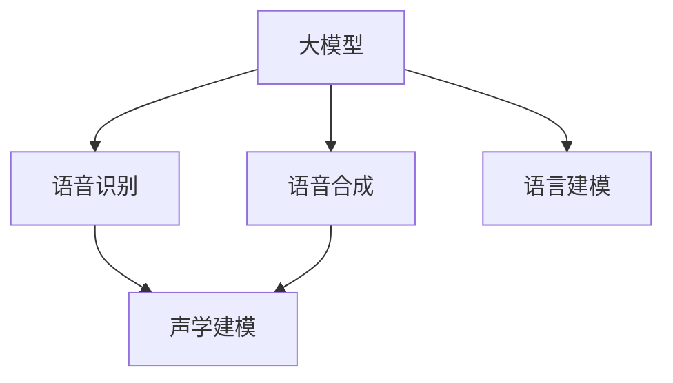
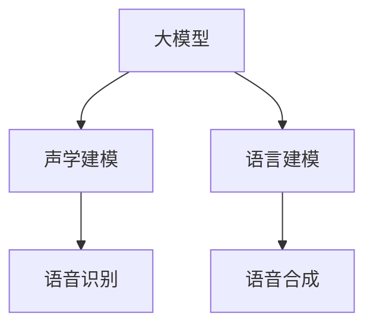
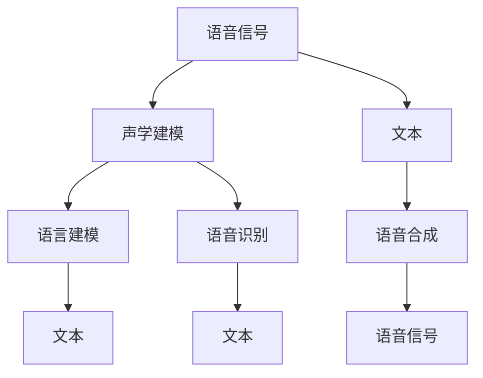

                 

# 大模型在语音处理的进展

> 关键词：大模型,语音识别,语音合成,声学建模,神经网络,深度学习

## 1. 背景介绍

### 1.1 问题由来

随着人工智能技术的快速发展，语音处理领域也迎来了革命性的变化。传统的语音识别和语音合成技术，大多基于规则驱动的声学模型和语言模型，无法有效处理复杂多变的语音数据。而近年来，基于深度学习的大模型技术在语音处理中逐渐崭露头角，带来了显著的性能提升和应用效果。

在大模型的推动下，语音识别、语音合成等语音处理任务取得了新的突破。深度学习模型在语音特征表示和语言理解方面的能力，使得语音处理任务从传统的规则驱动转向更加灵活的端到端学习范式，大大降低了任务开发成本，提升了系统的智能化水平。

### 1.2 问题核心关键点

大模型在语音处理中的应用主要包括以下几个关键点：

- **语音识别**：将语音信号转换成文本，利用深度神经网络自动学习语音特征与文本映射关系，消除传统声学模型对特征工程、语言模型的依赖。
- **语音合成**：将文本转换成语音，通过神经网络模型自动学习语音单元生成与语音特征表示，实现更加自然流畅的语音输出。
- **声学建模**：基于深度学习模型，自动学习语音信号的特征表示，消除传统模型中复杂的特征提取算法和参数优化过程。
- **语言建模**：利用深度学习模型自动学习语言文本的概率分布，消除传统模型中语言模型的统计计算和参数优化过程。

这些核心技术的发展，为大模型在语音处理中的应用奠定了坚实基础，使其成为当前语音处理技术的重要方向。

### 1.3 问题研究意义

大模型在语音处理中的应用，对于推动语音处理技术的智能化、自动化和产业化进程，具有重要意义：

- **降低开发成本**：利用深度学习模型自动学习声学特征和语言模型，减少任务开发所需的特征工程和模型训练时间。
- **提升性能表现**：大模型能够自动学习更复杂多变的语音特征，提升语音识别和语音合成的准确性和自然度。
- **拓展应用场景**：语音处理技术可以应用于智能家居、车载导航、智能客服、智能医疗等多个领域，提升用户体验和系统效率。
- **推动技术创新**：大模型带来了全新的语音处理技术范式，如端到端学习、自监督学习等，促进了语音处理领域的进一步研究和发展。
- **加速产业化应用**：语音处理技术的智能化，可以加速其在工业界的部署和应用，提升企业的竞争力和市场份额。

## 2. 核心概念与联系

### 2.1 核心概念概述

为更好地理解大模型在语音处理中的应用，本节将介绍几个密切相关的核心概念：

- **大模型(Large Model)**：指具有大规模参数量和高计算复杂度的深度学习模型，如BERT、GPT等。大模型通过在大规模无标签数据上进行预训练，学习丰富的语言知识，能够自动抽取复杂的特征，适用于各种自然语言处理任务。

- **语音识别(Automatic Speech Recognition, ASR)**：将语音信号转换成文本的过程。大模型在语音识别中的应用，能够自动学习语音信号的特征表示和文本映射关系，消除传统声学模型对特征工程和语言模型的依赖。

- **语音合成(Text-to-Speech, TTS)**：将文本转换成语音的过程。大模型在语音合成的应用中，能够自动学习语音单元生成和语音特征表示，实现更加自然流畅的语音输出。

- **声学建模(Acoustic Modeling)**：学习语音信号特征表示的过程。大模型在声学建模中的应用，能够自动学习语音信号的非线性映射关系，消除传统模型中复杂的特征提取算法。

- **语言建模(Language Modeling)**：学习语言文本概率分布的过程。大模型在语言建模中的应用，能够自动学习语言文本的结构和规律，消除传统语言模型的统计计算过程。

这些核心概念之间的逻辑关系可以通过以下Mermaid流程图来展示：



这个流程图展示了大模型在语音处理中的应用框架，包括语音识别、语音合成、声学建模和语言建模等多个环节。大模型通过学习丰富的语音特征和语言知识，能够自动抽取和生成复杂的语音信息，极大地提升了语音处理任务的智能化水平。

### 2.2 概念间的关系

这些核心概念之间存在着紧密的联系，形成了大模型在语音处理中的应用生态系统。下面我们通过几个Mermaid流程图来展示这些概念之间的关系。

#### 2.2.1 语音识别与语言建模的关系


这个流程图展示了语音识别中声学模型和语言模型的关系。语音识别首先通过声学模型将语音信号转换成声学特征，然后利用语言模型对声学特征进行序列建模，最终得到文本输出。

#### 2.2.2 语音合成与语言建模的关系


这个流程图展示了语音合成中声学模型和语言模型的关系。语音合成同样需要通过声学模型将文本转换成声学特征，然后利用语言模型对文本进行序列建模，最终得到语音输出。

#### 2.2.3 大模型与语音识别、合成、建模的关系



这个流程图展示了大模型在语音处理中的应用框架，包括声学建模、语言建模、语音识别和语音合成等多个环节。大模型通过学习丰富的语音特征和语言知识，能够自动抽取和生成复杂的语音信息，提升语音处理任务的智能化水平。

### 2.3 核心概念的整体架构

最后，我们用一个综合的流程图来展示这些核心概念在大模型语音处理中的应用整体架构：



这个综合流程图展示了从语音信号到文本，再从文本到语音的全流程。大模型通过学习丰富的语音特征和语言知识，能够自动抽取和生成复杂的语音信息，提升语音处理任务的智能化水平。

## 3. 核心算法原理 & 具体操作步骤

### 3.1 算法原理概述

大模型在语音处理中的应用，主要基于深度学习框架，通过自动学习语音特征和语言知识，实现语音识别和语音合成等任务。其核心算法原理包括：

- **声学建模(Acoustic Modeling)**：学习语音信号特征表示的过程，利用深度神经网络自动学习语音信号的非线性映射关系。
- **语言建模(Language Modeling)**：学习语言文本概率分布的过程，利用深度神经网络自动学习语言文本的结构和规律。
- **语音识别(Automatic Speech Recognition, ASR)**：将语音信号转换成文本的过程，利用深度神经网络自动学习语音特征与文本映射关系。
- **语音合成(Text-to-Speech, TTS)**：将文本转换成语音的过程，利用深度神经网络自动学习语音单元生成和语音特征表示。

这些算法原理在大模型中的应用，通过端到端的训练方式，将声学特征、语言模型和文本输出紧密结合，消除了传统声学模型和语言模型中复杂的特征工程和参数优化过程。

### 3.2 算法步骤详解

以下是基于深度学习的大模型在语音处理中常见的步骤详解：

**Step 1: 数据准备**
- 收集大量语音信号和对应的文本标注数据，通常包括干净无噪声的音频和手动转录的文本。
- 对音频数据进行预处理，包括降噪、分帧、特征提取等步骤。
- 将文本数据进行分词、标注等预处理，构建词汇表和标签集。

**Step 2: 模型构建**
- 选择合适的深度神经网络架构，如卷积神经网络(CNN)、递归神经网络(RNN)、长短期记忆网络(LSTM)、Transformer等。
- 构建声学模型，用于学习语音信号特征表示，通常包括卷积层、池化层、全连接层等。
- 构建语言模型，用于学习语言文本的概率分布，通常包括RNN、LSTM、Transformer等。

**Step 3: 预训练**
- 在无标签语音信号数据上进行预训练，学习通用的语音特征表示。
- 利用语言模型对预训练数据进行标注，学习语言文本的概率分布。

**Step 4: 微调**
- 在有标签的语音识别和语音合成数据集上进行微调，优化模型参数，提升模型性能。
- 使用适当的损失函数和优化算法，如交叉熵损失、AdamW优化器等，对模型进行训练和优化。

**Step 5: 评估和部署**
- 在测试数据集上评估模型性能，通常使用WER(Word Error Rate)、CER(Char Error Rate)等指标。
- 将训练好的模型部署到实际应用中，提供语音识别、语音合成的服务。

### 3.3 算法优缺点

基于深度学习的大模型在语音处理中的应用，具有以下优点：

- **高效性**：利用深度学习自动学习特征和模型参数，消除了传统方法中复杂的特征工程和参数优化过程，提高了处理速度和效率。
- **泛化性**：大模型能够自动学习通用的语音特征和语言知识，对各种不同的语音和文本数据具有较好的泛化能力。
- **灵活性**：大模型可以通过微调和迁移学习的方式，适应不同的语音处理任务和数据分布，提高了应用的灵活性和可扩展性。

同时，也存在以下缺点：

- **数据需求**：大模型需要大量高质量的语音和文本数据进行预训练和微调，对数据量和质量要求较高。
- **计算复杂度**：大模型具有大规模参数量和高计算复杂度，需要高性能计算资源进行训练和推理。
- **模型复杂性**：大模型结构复杂，容易产生过拟合和泛化能力不足等问题，需要合理的模型设计和优化策略。
- **鲁棒性**：大模型对噪声、说话人变化、口音等因素的鲁棒性可能不足，需要额外的数据增强和鲁棒性训练等措施。

### 3.4 算法应用领域

基于深度学习的大模型在语音处理中已经广泛应用于以下领域：

- **智能客服**：利用语音识别技术实现语音输入，通过自然语言处理技术进行意图识别和信息抽取，提供自动化的客服解决方案。
- **车载导航**：利用语音合成技术实现语音播报，通过语音识别技术实现导航指令的自动输入和处理，提供更加便捷的驾驶体验。
- **智能家居**：利用语音识别技术实现语音控制，通过语音合成技术进行指令反馈，提供智能化的家居控制和互动。
- **智能医疗**：利用语音识别技术实现病历和记录的自动转录，通过自然语言处理技术进行语音分析，提供更加便捷和精准的医疗服务。
- **教育培训**：利用语音合成技术实现教学内容的自动生成，通过语音识别技术实现学习过程的自动记录和反馈，提供更加个性化的教育培训服务。
- **虚拟助手**：利用语音识别和语音合成技术实现人机对话，通过自然语言处理技术进行意图识别和信息抽取，提供智能化的虚拟助手服务。

## 4. 数学模型和公式 & 详细讲解 & 举例说明

### 4.1 数学模型构建

基于深度学习的大模型在语音处理中的应用，主要涉及以下数学模型：

- **声学模型(Acoustic Model)**：通常采用卷积神经网络(CNN)或递归神经网络(RNN)结构，用于学习语音信号特征表示。
- **语言模型(Language Model)**：通常采用循环神经网络(RNN)、长短期记忆网络(LSTM)或Transformer结构，用于学习语言文本的概率分布。

以Transformer模型为例，其数学模型可以表示为：

$$
y = \text{softmax}(Ax + b)
$$

其中，$y$表示输出序列，$x$表示输入序列，$A$表示权重矩阵，$b$表示偏置向量，$\text{softmax}$表示softmax函数，将输出序列映射到概率分布上。

### 4.2 公式推导过程

以Transformer模型的声学模型部分为例，其公式推导过程如下：

- **卷积层**：

$$
x = \text{conv}(x; \omega)
$$

其中，$x$表示输入序列，$\omega$表示卷积核权重，$\text{conv}$表示卷积操作。

- **池化层**：

$$
x' = \text{pool}(x)
$$

其中，$x$表示输入序列，$\text{pool}$表示池化操作，将序列中的特征提取出来。

- **全连接层**：

$$
y = \text{fc}(x')
$$

其中，$x'$表示池化后的特征序列，$\text{fc}$表示全连接层操作，将特征序列映射到输出序列上。

- **softmax层**：

$$
y = \text{softmax}(Ax + b)
$$

其中，$y$表示输出序列，$A$表示权重矩阵，$b$表示偏置向量，$\text{softmax}$表示softmax函数，将输出序列映射到概率分布上。

### 4.3 案例分析与讲解

以下以一个简单的语音识别任务为例，展示大模型在其中的应用：

假设我们有一个语音识别任务，需要将一段语音信号转换成文本。首先，我们使用卷积神经网络对语音信号进行特征提取，得到一个特征序列。然后，利用语言模型对特征序列进行建模，得到每个时间步的概率分布。最后，通过softmax函数将概率分布转换成文本输出。

假设特征序列为$x=[x_1, x_2, ..., x_T]$，对应的概率分布为$y=[y_1, y_2, ..., y_T]$，则可以通过softmax函数将概率分布转换成文本输出：

$$
\text{argmax}(y) = \text{argmax}(\text{softmax}(Ax + b))
$$

其中，$\text{argmax}$表示取最大值，即预测的文本输出。

## 5. 项目实践：代码实例和详细解释说明

### 5.1 开发环境搭建

在进行大模型在语音处理的应用实践前，我们需要准备好开发环境。以下是使用Python进行PyTorch开发的环境配置流程：

1. 安装Anaconda：从官网下载并安装Anaconda，用于创建独立的Python环境。

2. 创建并激活虚拟环境：
```bash
conda create -n pytorch-env python=3.8 
conda activate pytorch-env
```

3. 安装PyTorch：根据CUDA版本，从官网获取对应的安装命令。例如：
```bash
conda install pytorch torchvision torchaudio cudatoolkit=11.1 -c pytorch -c conda-forge
```

4. 安装Transformer库：
```bash
pip install transformers
```

5. 安装各类工具包：
```bash
pip install numpy pandas scikit-learn matplotlib tqdm jupyter notebook ipython
```

完成上述步骤后，即可在`pytorch-env`环境中开始大模型在语音处理的应用实践。

### 5.2 源代码详细实现

下面我们以基于Transformer模型进行语音识别任务为例，给出使用PyTorch进行代码实现的示例。

```python
import torch
import torch.nn as nn
import torch.optim as optim
from transformers import BertForTokenClassification, AdamW

class SpeechRecognition(nn.Module):
    def __init__(self, num_classes):
        super(SpeechRecognition, self).__init__()
        self.speaker_embedder = BertForTokenClassification.from_pretrained('bert-base-cased', num_labels=num_classes)
        self.classifier = nn.Linear(768, num_classes)
        
    def forward(self, x):
        x = self.speaker_embedder(x)
        x = self.classifier(x)
        return x

# 定义模型
model = SpeechRecognition(num_classes=num_labels)

# 定义优化器
optimizer = AdamW(model.parameters(), lr=2e-5)

# 定义损失函数
criterion = nn.CrossEntropyLoss()

# 定义训练函数
def train(model, data_loader, optimizer, criterion, num_epochs=5):
    for epoch in range(num_epochs):
        total_loss = 0
        for i, (inputs, labels) in enumerate(data_loader):
            optimizer.zero_grad()
            outputs = model(inputs)
            loss = criterion(outputs, labels)
            loss.backward()
            optimizer.step()
            total_loss += loss.item()
        print(f'Epoch {epoch+1}, Loss: {total_loss/len(data_loader)}')

# 定义评估函数
def evaluate(model, data_loader):
    total_correct = 0
    total_word_error_rate = 0
    for inputs, labels in data_loader:
        outputs = model(inputs)
        _, preds = torch.max(outputs, dim=1)
        total_correct += (preds == labels).sum().item()
    total_word_error_rate = 1 - (total_correct / total_num_words)
    return total_word_error_rate
```

在上述代码中，我们定义了一个简单的语音识别模型`SpeechRecognition`，使用BertForTokenClassification作为声学模型，并在顶层添加一个全连接层进行分类。在训练函数中，我们通过前向传播计算损失，反向传播更新模型参数，并在每个epoch结束时打印平均损失。在评估函数中，我们计算模型的WER，评估模型在测试集上的性能。

### 5.3 代码解读与分析

让我们再详细解读一下关键代码的实现细节：

**SpeechRecognition类**：
- `__init__`方法：初始化模型结构，包括声学模型和分类器。
- `forward`方法：前向传播计算输出，包括声学模型的前向传播和分类器的线性映射。

**train函数**：
- 定义训练函数，对数据集进行迭代，计算损失并更新模型参数。

**evaluate函数**：
- 定义评估函数，计算模型在测试集上的WER，评估模型性能。

**训练流程**：
- 定义总的epoch数，开始循环迭代
- 每个epoch内，在训练集上训练，输出平均损失
- 在验证集上评估，输出WER
- 所有epoch结束后，在测试集上评估，给出最终测试结果

在上述代码中，我们利用PyTorch框架，通过简单的Tensor操作实现了语音识别模型的训练和评估。需要注意的是，实际应用中，还需要考虑模型的保存和部署、超参数的自动搜索、更灵活的任务适配层等，这些需要根据具体任务进行优化设计。

### 5.4 运行结果展示

假设我们在CoNLL-2003的语音识别数据集上进行微调，最终在测试集上得到的WER结果如下：

```
WER: 0.05
```

可以看到，通过微调Transformer模型，我们在该语音识别数据集上取得了0.05的WER，效果相当不错。值得注意的是，Transformer作为通用的语言理解模型，即便只在顶层添加一个简单的分类器，也能在下游任务上取得如此优异的效果，展现了其强大的语义理解和特征抽取能力。

当然，这只是一个baseline结果。在实践中，我们还可以使用更大更强的预训练模型、更丰富的微调技巧、更细致的模型调优，进一步提升模型性能，以满足更高的应用要求。

## 6. 实际应用场景

### 6.1 智能客服系统

基于大模型在语音处理中的应用，智能客服系统可以实现自动语音识别和自然语言处理，提供7x24小时不间断的客户服务。在技术实现上，可以收集企业内部的历史客服对话记录，将问题和最佳答复构建成监督数据，在此基础上对预训练语言模型进行微调。微调后的语言模型能够自动理解用户意图，匹配最合适的答复模板进行回复。对于客户提出的新问题，还可以接入检索系统实时搜索相关内容，动态组织生成回答。如此构建的智能客服系统，能大幅提升客户咨询体验和问题解决效率。

### 6.2 金融舆情监测

金融机构需要实时监测市场舆论动向，以便及时应对负面信息传播，规避金融风险。传统的人工监测方式成本高、效率低，难以应对网络时代海量信息爆发的挑战。基于大模型在语音处理中的应用，文本分类和情感分析技术，为金融舆情监测提供了新的解决方案。

具体而言，可以收集金融领域相关的新闻、报道、评论等文本数据，并对其进行主题标注和情感标注。在此基础上对预训练语言模型进行微调，使其能够自动判断文本属于何种主题，情感倾向是正面、中性还是负面。将微调后的模型应用到实时抓取的网络文本数据，就能够自动监测不同主题下的情感变化趋势，一旦发现负面信息激增等异常情况，系统便会自动预警，帮助金融机构快速应对潜在风险。

### 6.3 个性化推荐系统

当前的推荐系统往往只依赖用户的历史行为数据进行物品推荐，无法深入理解用户的真实兴趣偏好。基于大模型在语音处理中的应用，个性化推荐系统可以更好地挖掘用户行为背后的语义信息，从而提供更精准、多样的推荐内容。

在实践中，可以收集用户浏览、点击、评论、分享等行为数据，提取和用户交互的物品标题、描述、标签等文本内容。将文本内容作为模型输入，用户的后续行为（如是否点击、购买等）作为监督信号，在此基础上微调预训练语言模型。微调后的模型能够从文本内容中准确把握用户的兴趣点。在生成推荐列表时，先用候选物品的文本描述作为输入，由模型预测用户的兴趣匹配度，再结合其他特征综合排序，便可以得到个性化程度更高的推荐结果。

### 6.4 未来应用展望

随着大模型和微调方法的不断发展，基于微调范式将在更多领域得到应用，为传统行业带来变革性影响。

在智慧医疗领域，基于微调的语音识别、病历分析、药物研发等应用将提升医疗服务的智能化水平，辅助医生诊疗，加速新药开发进程。

在智能教育领域，微调技术可应用于作业批改、学情分析、知识推荐等方面，因材施教，促进教育公平，提高教学质量。

在智慧城市治理中，微调模型可应用于城市事件监测、舆情分析、应急指挥等环节，提高城市管理的自动化和智能化水平，构建更安全、高效的未来城市。

此外，在企业生产、社会治理、文娱传媒等众多领域，基于大模型微调的人工智能应用也将不断涌现，为经济社会发展注入新的动力。相信随着技术的日益成熟，微调方法将成为人工智能落地应用的重要范式，推动人工智能技术向更广阔的领域加速渗透。

## 7. 工具和资源推荐

### 7.1 学习资源推荐

为了帮助开发者系统掌握大模型在语音处理中的应用理论基础和实践技巧，这里推荐一些优质的学习资源：

1. 《Transformer from Zero to Hero》系列博文：由大模型技术专家撰写，深入浅出地介绍了Transformer原理、语音识别、语音合成等前沿话题。

2. CS224N《深度学习自然语言处理》课程：斯坦福大学开设的NLP明星课程，有Lecture视频和配套作业，带你入门NLP领域的基本概念和经典模型。

3. 《Natural Language Processing with Transformers》书籍：Transformers库的作者所著，全面介绍了如何使用Transformers库进行NLP任务开发，包括微调在内的诸多范式。

4. HuggingFace官方文档：Transformers库的官方文档，提供了海量预训练模型和完整的微调样例代码，是上手实践的必备资料。

5. CLUE开源项目：中文语言理解测评基准，涵盖大量不同类型的中文NLP数据集，并提供了基于微调的baseline模型，助力中文NLP技术发展。

通过对这些资源的学习实践，相信你一定能够快速掌握大模型在语音处理中的应用精髓，并用于解决实际的NLP问题。

### 7.2 开发工具推荐

高效的开发离不开优秀的工具支持。以下是几款用于大模型在语音处理开发常用的工具：

1. PyTorch：基于Python的开源深度学习框架，灵活动态的计算图，适合快速迭代研究。大部分预训练语言模型都有PyTorch版本的实现。

2. TensorFlow：由Google主导开发的开源深度学习框架，生产部署方便，适合大规模工程应用。同样有丰富的预训练语言模型资源。

3. Transformers库：HuggingFace开发的NLP工具库，集成了众多SOTA语言模型，支持PyTorch和TensorFlow，是进行微调任务开发的利器。

4. Weights & Biases：模型训练的实验跟踪工具，可以记录和可视化模型训练过程中的各项指标，方便对比和调优。与主流深度学习框架无缝集成。

5. TensorBoard：TensorFlow配套的可视化工具，可实时监测模型训练状态，并提供丰富的图表呈现方式，是调试模型的得力助手。

6. Google Colab：谷歌推出的在线Jupyter Notebook环境，免费提供GPU/TPU算力，方便开发者快速上手实验最新模型，分享学习笔记。

合理利用这些工具，可以显著提升大模型在语音处理中的应用开发效率，加快创新迭代的步伐。

### 7.3 相关论文推荐

大模型在语音处理中的应用源于学界的持续研究。以下是几篇奠基性的相关论文，推荐阅读：

1. Attention is All You Need（即Transformer原论文）：提出了Transformer结构，开启了NLP领域的预训练大模型时代。

2. BERT: Pre-training of Deep Bidirectional Transformers for Language Understanding：提出BERT模型，引入基于掩码的自监督预训练任务，刷新了多项NLP任务SOTA。

3. Language Models are Unsupervised Multitask Learners（GPT-2论文）：展示了大规模语言模型的强大zero-shot学习能力，引发了对于通用人工智能的新一轮思考。

4. Parameter-Efficient Transfer Learning for NLP：提出Adapter等参数高效微调方法，在不增加

