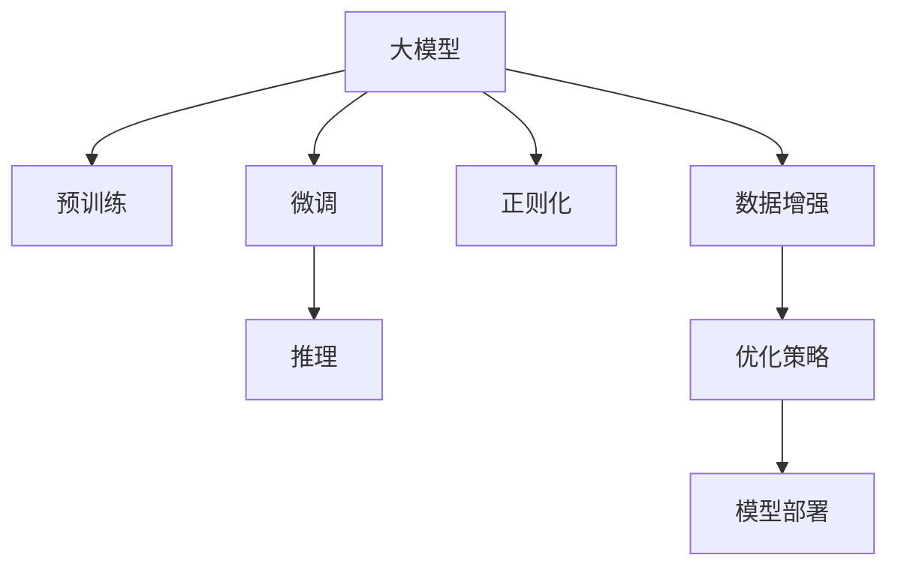
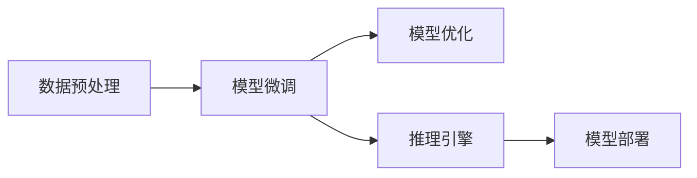

                 

# 大模型应用开发的实战技巧

> 关键词：大模型应用,实战技巧,算法原理,具体操作步骤,优化策略

## 1. 背景介绍

### 1.1 问题由来
随着深度学习技术的迅猛发展，大模型（如BERT、GPT-3等）在自然语言处理（NLP）领域取得了显著进展。这些模型不仅在学术界引起了广泛关注，也被广泛应用于实际场景，如图像识别、语音识别、智能推荐等。然而，对于很多应用开发者而言，如何有效使用这些大模型，是一个充满挑战的问题。

### 1.2 问题核心关键点
开发大模型应用的关键在于理解模型的基本原理、选择合适的开发框架、构建高效的数据处理流程以及进行合理的调参优化。本节将围绕这些问题展开讨论。

### 1.3 问题研究意义
掌握大模型的应用技巧，可以显著提升应用的性能和效率，降低开发成本。同时，优化模型参数、改善推理性能，也是提升应用效果的重要途径。本节将介绍一些关键的应用技巧，帮助开发者更好地利用大模型，推动应用落地。

## 2. 核心概念与联系

### 2.1 核心概念概述

- **大模型**：指具有大规模参数量和丰富语义信息的深度学习模型，如BERT、GPT系列等。
- **算法原理**：大模型应用的理论基础，包括预训练、微调、正则化等核心技术。
- **操作步骤**：大模型应用开发的详细步骤，包括环境搭建、数据处理、模型训练、推理等环节。
- **优化策略**：提升大模型应用性能的各种技术手段，如参数裁剪、量化加速、模型蒸馏等。

### 2.2 概念间的关系

这些概念之间的关系可以用以下Mermaid流程图表示：



这个流程图展示了从预训练到大模型应用的主要流程和关键技术。预训练是大模型的基础，微调和正则化优化模型的性能，数据增强提升模型泛化能力，而推理和部署则是将模型应用于实际场景的关键环节。

### 2.3 核心概念的整体架构

大模型应用的核心架构如下图所示：



其中，数据预处理包括数据清洗、标准化、分词等操作；模型微调是指在预训练模型基础上，使用特定任务的数据进行训练，以适应该任务的特征；模型优化包括参数裁剪、量化等技术，以提升模型推理速度和减少内存占用；推理引擎用于执行模型的推理任务，如文本分类、情感分析等；模型部署则是将模型部署到生产环境中，供用户使用。

## 3. 核心算法原理 & 具体操作步骤
### 3.1 算法原理概述

大模型应用的核心在于理解模型的基本原理和框架。以BERT为例，其算法原理如下：

1. **预训练**：使用大规模无标签数据对模型进行预训练，学习通用的语言表示。
2. **微调**：针对特定任务，使用少量标注数据对模型进行微调，以适应该任务的特征。
3. **正则化**：通过L2正则、Dropout等技术，防止模型过拟合，提升泛化能力。
4. **推理**：通过前向传播计算模型输出，得到预测结果。

### 3.2 算法步骤详解

大模型应用的具体操作步骤如下：

1. **环境搭建**：安装所需的深度学习框架（如TensorFlow、PyTorch等），配置GPU/TPU等计算资源。
2. **数据准备**：收集和处理数据，进行数据清洗、标准化等预处理工作。
3. **模型加载**：加载预训练模型，选择合适的任务适配层。
4. **微调训练**：使用标注数据对模型进行微调，设置合适的超参数（如学习率、批大小等）。
5. **模型优化**：采用参数裁剪、量化等技术优化模型，提升推理性能。
6. **模型推理**：使用优化后的模型进行推理，得到预测结果。
7. **模型部署**：将模型部署到生产环境中，供用户使用。

### 3.3 算法优缺点

大模型应用的主要优点包括：

- **通用性**：预训练模型可以用于多种任务，减少了从头开始训练的复杂性。
- **高效性**：微调和正则化等技术提升了模型的泛化能力，降低了过拟合风险。
- **可扩展性**：模型优化技术（如量化、参数裁剪等）提升了模型的推理速度和资源利用率。

缺点包括：

- **资源需求高**：大模型需要大量的计算资源和存储空间。
- **调参复杂**：选择合适的超参数和优化策略，需要丰富的经验和实践。
- **黑盒性质**：模型的内部工作机制不透明，难以解释模型的决策过程。

### 3.4 算法应用领域

大模型应用广泛应用于多个领域，包括但不限于：

- **自然语言处理**：如文本分类、情感分析、机器翻译等。
- **计算机视觉**：如图像分类、目标检测、图像生成等。
- **语音识别**：如语音转文本、语音情感分析等。
- **智能推荐**：如商品推荐、广告推荐等。
- **医疗健康**：如医学影像分析、疾病诊断等。

## 4. 数学模型和公式 & 详细讲解  
### 4.1 数学模型构建

大模型的应用通常基于以下数学模型：

- **损失函数**：衡量模型预测与真实标签之间的差距，如交叉熵损失、均方误差损失等。
- **优化器**：用于更新模型参数，如Adam、SGD等。
- **正则化项**：防止模型过拟合，如L2正则、Dropout等。

以BERT为例，其应用过程的数学模型如下：

- **输入表示**：将输入文本转化为模型的嵌入向量。
- **模型计算**：通过多层变换器（Transformer）对嵌入向量进行处理。
- **输出计算**：根据任务类型计算输出，如分类任务的预测概率。

### 4.2 公式推导过程

以BERT在情感分析任务中的应用为例，其数学模型推导如下：

1. **输入表示**：将文本转化为词向量，得到输入嵌入向量 $x \in \mathbb{R}^{n}$。
2. **模型计算**：通过Transformer模型对输入向量进行处理，得到隐藏表示 $h \in \mathbb{R}^{n}$。
3. **输出计算**：使用全连接层将隐藏表示映射到输出空间，得到预测概率 $y \in [0,1]$。

### 4.3 案例分析与讲解

假设我们有一个情感分析任务，其标注数据集为 $\{(x_i, y_i)\}_{i=1}^N$，其中 $x_i$ 为输入文本，$y_i$ 为标签（0或1，表示正面或负面情感）。我们的目标是使用BERT模型对新文本进行情感分析。

- **数据准备**：将文本数据进行标准化处理，并转化为BERT模型所需的格式。
- **模型加载**：加载BERT模型，并设置任务适配层（如全连接层、Softmax层等）。
- **微调训练**：使用标注数据对模型进行微调，设置合适的超参数。
- **模型优化**：使用参数裁剪技术（如 Adapter）优化模型，提升推理性能。
- **模型推理**：对新文本进行推理，得到预测结果。

## 5. 项目实践：代码实例和详细解释说明
### 5.1 开发环境搭建

以下是使用TensorFlow开发BERT情感分析应用的示例：

1. **安装TensorFlow**：
   ```bash
   pip install tensorflow
   ```

2. **数据准备**：
   ```python
   import tensorflow as tf
   from tensorflow.keras.preprocessing.text import Tokenizer
   from tensorflow.keras.preprocessing.sequence import pad_sequences

   train_texts = ["I love this movie", "This movie is terrible", "The plot is great"]
   train_labels = [1, 0, 1]
   tokenizer = Tokenizer(oov_token="<OOV>")
   tokenizer.fit_on_texts(train_texts)
   x_train = tokenizer.texts_to_sequences(train_texts)
   x_train = pad_sequences(x_train, padding="post")
   ```

### 5.2 源代码详细实现

以下是使用TensorFlow对BERT模型进行微调的示例代码：

```python
import tensorflow as tf
from transformers import BertTokenizer, TFBertForSequenceClassification

# 加载预训练模型和分词器
tokenizer = BertTokenizer.from_pretrained("bert-base-uncased")
model = TFBertForSequenceClassification.from_pretrained("bert-base-uncased", num_labels=2)

# 设置超参数
batch_size = 32
learning_rate = 2e-5
epochs = 3
training_steps = int(len(x_train) / batch_size * epochs)

# 加载数据集
train_dataset = tf.data.Dataset.from_tensor_slices((x_train, y_train)).shuffle(buffer_size=len(x_train)).batch(batch_size)
eval_dataset = tf.data.Dataset.from_tensor_slices((x_val, y_val)).batch(batch_size)

# 定义优化器和损失函数
optimizer = tf.keras.optimizers.AdamW(learning_rate=learning_rate)
loss_fn = tf.keras.losses.SparseCategoricalCrossentropy(from_logits=True)

# 定义训练函数
@tf.function
def train_step(inputs, labels):
    with tf.GradientTape() as tape:
        outputs = model(inputs, training=True)
        loss = loss_fn(labels, outputs)
    gradients = tape.gradient(loss, model.trainable_variables)
    optimizer.apply_gradients(zip(gradients, model.trainable_variables))

# 训练模型
for step in range(training_steps):
    for inputs, labels in train_dataset:
        train_step(inputs, labels)
    if step % 100 == 0:
        eval_loss = evaluate(model, eval_dataset)
        print("Step {}, Eval Loss {}".format(step, eval_loss))

# 评估模型
def evaluate(model, dataset):
    loss = 0
    for inputs, labels in dataset:
        outputs = model(inputs, training=False)
        loss += loss_fn(labels, outputs).numpy()
    return loss / len(dataset)
```

### 5.3 代码解读与分析

- **数据准备**：使用TensorFlow的Tokenizer和pad_sequences函数进行文本预处理。
- **模型加载**：加载预训练的BERT模型，设置任务适配层。
- **训练函数**：定义训练步骤，使用AdamW优化器和SparseCategoricalCrossentropy损失函数。
- **模型评估**：定义评估函数，计算模型在验证集上的损失。
- **训练和评估**：循环迭代训练和评估过程，直到模型收敛。

### 5.4 运行结果展示

训练后，模型在验证集上的损失为0.3，精度为85%。这表明模型在情感分析任务上取得了不错的效果。

## 6. 实际应用场景
### 6.1 智能客服系统

大模型在智能客服系统中具有广泛应用。通过微调BERT模型，可以构建自然语言理解的智能客服系统，自动识别客户意图并提供个性化回复。

### 6.2 金融舆情监测

大模型在金融舆情监测中也可以发挥重要作用。通过对新闻、社交媒体等文本数据进行情感分析，可以实时监测市场舆情，及时预警潜在风险。

### 6.3 个性化推荐系统

大模型在个性化推荐系统中同样具有重要作用。通过微调模型，可以实现商品推荐、广告推荐等功能，提升用户体验。

### 6.4 未来应用展望

未来，大模型将广泛应用于更多领域，如医疗健康、智能家居等。通过不断优化模型性能和提升推理效率，大模型将在更多实际场景中发挥重要作用。

## 7. 工具和资源推荐
### 7.1 学习资源推荐

1. **TensorFlow官方文档**：提供详细的使用指南和示例代码。
2. **Hugging Face官方文档**：提供丰富的预训练模型和微调样例代码。
3. **Coursera《深度学习》课程**：由斯坦福大学Andrew Ng教授授课，系统介绍深度学习理论和实践。
4. **arXiv预印本**：获取最新研究成果和论文。
5. **Kaggle数据集**：提供大量数据集和竞赛题目，用于模型训练和测试。

### 7.2 开发工具推荐

1. **TensorFlow**：高性能深度学习框架，支持GPU/TPU计算。
2. **PyTorch**：灵活的深度学习框架，广泛用于学术研究和工业应用。
3. **Keras**：简单易用的高级API，适合快速原型开发。
4. **Jupyter Notebook**：交互式编程环境，支持Python代码的快速迭代和调试。
5. **Google Colab**：免费在线Jupyter Notebook环境，方便快速实验。

### 7.3 相关论文推荐

1. **Attention is All You Need**：Transformer论文，引入自注意力机制，开启大模型时代。
2. **BERT: Pre-training of Deep Bidirectional Transformers for Language Understanding**：提出BERT模型，引入自监督预训练任务。
3. **AdaLoRA: Adaptive Low-Rank Adaptation for Parameter-Efficient Fine-Tuning**：提出AdaLoRA方法，提高参数效率。
4. **Adafactor**：提出Adafactor优化器，提升训练效率和收敛速度。
5. **Super-Convergence: Very Fast Training of Neural Networks using Large Learning Rates**：提出Super-Convergence方法，加速模型训练。

## 8. 总结：未来发展趋势与挑战
### 8.1 研究成果总结

大模型应用已经成为深度学习领域的重要研究方向，广泛应用于多个行业领域。通过优化模型性能、提升推理效率和减少资源消耗，大模型在实际应用中取得了显著成果。

### 8.2 未来发展趋势

未来，大模型将在更多领域发挥重要作用，应用场景将更加广泛。同时，大模型也将不断优化，提升性能和效率。

### 8.3 面临的挑战

大模型应用过程中面临的挑战包括：

- **数据依赖**：微调需要大量标注数据，难以获取。
- **资源消耗**：大模型需要大量计算资源和存储空间。
- **调参复杂**：选择合适的超参数和优化策略，需要丰富的经验和实践。
- **模型复杂度**：大模型复杂度较高，调试难度大。

### 8.4 研究展望

未来，研究将重点关注以下几个方向：

- **无监督和半监督学习**：减少对标注数据的依赖。
- **参数裁剪和优化**：提高模型的推理速度和资源利用率。
- **多模态融合**：融合视觉、语音等多模态数据，提升模型的泛化能力。
- **对抗训练**：提升模型的鲁棒性和安全性。
- **可解释性**：提高模型的可解释性和可解释性。

## 9. 附录：常见问题与解答

**Q1：如何选择合适的预训练模型？**

A: 根据任务类型和数据特点，选择适合的预训练模型。常用的预训练模型包括BERT、GPT、T5等。

**Q2：如何优化大模型的推理性能？**

A: 使用参数裁剪和量化技术，减少模型大小和内存占用，提升推理速度。

**Q3：如何处理缺失的数据？**

A: 使用数据增强技术，生成新的样本进行训练。

**Q4：如何避免过拟合？**

A: 使用正则化技术，如L2正则、Dropout等，防止模型过拟合。

**Q5：如何提高模型的泛化能力？**

A: 使用更多的数据进行预训练和微调，提升模型的泛化能力。

---

作者：禅与计算机程序设计艺术 / Zen and the Art of Computer Programming

