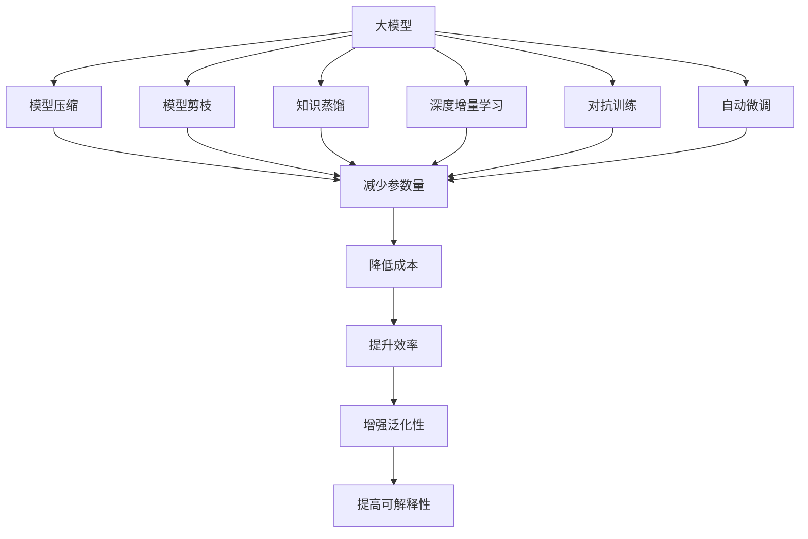
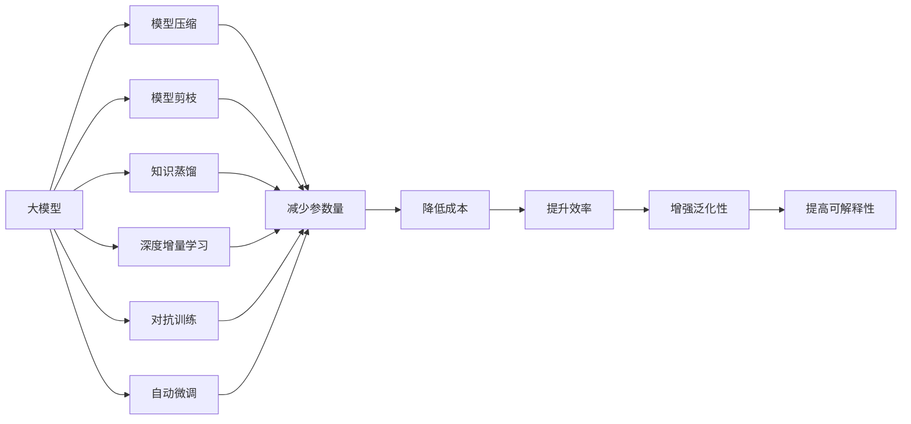
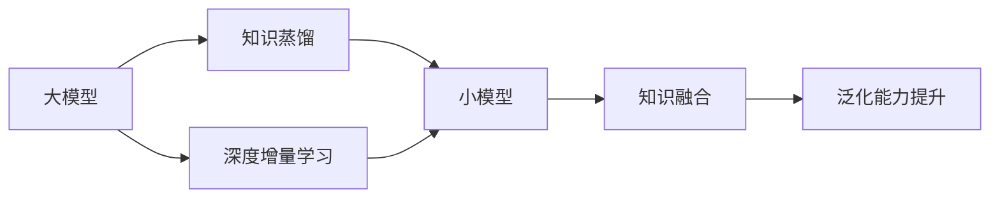
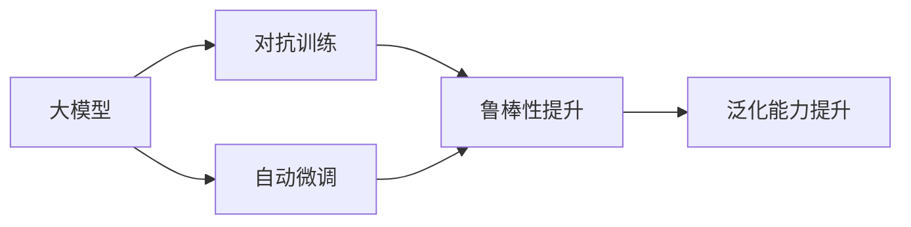
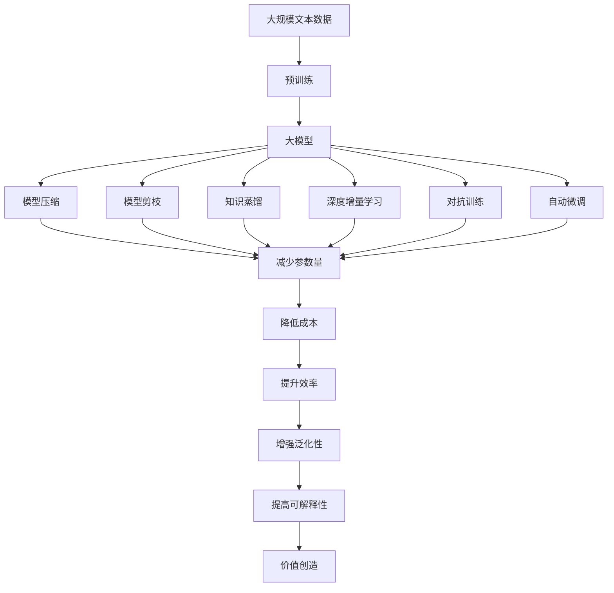

                 

## 1. 背景介绍

### 1.1 问题由来

在大模型时代，模型的训练、部署、维护成本不断攀升，如何高效利用大模型，最大化其价值，成为人工智能领域一个亟需解决的现实问题。大模型拥有强大的计算和知识表示能力，但在面对特定的应用场景时，如何调整模型参数，优化模型性能，是摆在大模型开发者面前的一个重要课题。本文将介绍大模型的成本驱动与价值创造的方法和策略，希望能为开发者提供有益的指导。

### 1.2 问题核心关键点

在实际应用中，大模型的成本驱动与价值创造主要涉及以下几个核心关键点：

- **模型参数量**：大模型往往具有大量的参数，占用大量存储空间和计算资源，如何减少参数量、优化模型结构是成本控制的关键。
- **训练成本**：大模型的训练需要大量的计算资源和时间，如何降低训练成本、加速训练过程是提高效率的重要方法。
- **推理成本**：大模型的推理计算量较大，如何优化推理引擎、降低推理成本是生产部署的关键。
- **模型可解释性**：大模型通常被视为"黑盒"模型，难以解释其决策过程，如何在保证模型效果的同时，提高模型可解释性是应用推广的关键。
- **知识融合**：大模型能够表示大量的语言知识和常识，如何与其他知识形式（如知识图谱、逻辑规则）进行融合，提升模型性能是价值创造的重要方向。
- **模型泛化性**：大模型在特定任务上的性能通常表现优异，但如何保持模型的泛化能力，使其在多种场景下保持高性能是应用拓展的关键。

### 1.3 问题研究意义

在大模型时代，如何平衡模型成本和性能，最大化模型价值，是推动人工智能技术落地应用的重要课题。研究大模型的成本驱动与价值创造，对于促进大模型技术在各行业的应用推广、提高模型效率、降低应用成本、提升模型效果具有重要意义：

- 降低模型训练和维护成本，推动大模型在更广泛的应用场景中被采用。
- 提高模型推理效率，加速模型生产部署，提升用户体验。
- 增强模型可解释性，提升模型透明度，促进模型在实际应用中的信任度。
- 优化知识融合策略，结合多模态数据，提高模型的泛化能力和应用效果。

## 2. 核心概念与联系

### 2.1 核心概念概述

为更好地理解大模型的成本驱动与价值创造，本节将介绍几个密切相关的核心概念：

- **大模型(Large Model)**：指具有大量参数（通常以亿为单位）的深度学习模型，如GPT-3、BERT等。这些模型通常需要大量的计算资源和存储空间进行训练和推理。
- **模型压缩(Model Compression)**：指在保持模型性能的同时，减少模型参数量和计算量，以降低模型成本的技术。
- **模型剪枝(Pruning)**：指移除模型中重要性较低的部分，减少模型参数量，优化模型结构。
- **知识蒸馏(Knowledge Distillation)**：指通过迁移学习，将大型模型的知识转移到小型模型，提升小型模型的性能。
- **深度增量学习(Deep Incremental Learning)**：指在大模型基础上，通过增量学习不断优化模型性能，避免从头训练，降低成本。
- **对抗训练(Adversarial Training)**：指通过对抗样本训练模型，提升模型的鲁棒性和泛化能力。
- **自动微调(Automatic Fine-tuning)**：指自动选择最优的微调策略和参数，提升模型效果，降低人工成本。
- **可解释性(Explainability)**：指模型输出可解释、可理解，便于应用场景中的解释和调试。

这些核心概念之间的逻辑关系可以通过以下Mermaid流程图来展示：



这个流程图展示了大模型在成本驱动与价值创造过程中，各个关键技术的相互关系。

### 2.2 概念间的关系

这些核心概念之间存在着紧密的联系，形成了大模型成本驱动与价值创造的整体生态系统。下面我们通过几个Mermaid流程图来展示这些概念之间的关系。

#### 2.2.1 大模型的学习范式



这个流程图展示了大模型的几种主要学习范式：压缩、剪枝、蒸馏、增量学习、对抗训练和自动微调。这些技术都是为了降低模型成本，提升模型效率和性能，从而实现大模型的价值创造。

#### 2.2.2 知识蒸馏与深度增量学习的关系



这个流程图展示了知识蒸馏和深度增量学习在大模型价值创造中的应用。知识蒸馏通过将大型模型的知识转移到小型模型，提升小型模型的泛化能力。深度增量学习通过在大模型基础上不断优化模型，提升模型效果，降低训练成本。

#### 2.2.3 对抗训练和自动微调的关系



这个流程图展示了对抗训练和自动微调在大模型鲁棒性提升中的应用。对抗训练通过引入对抗样本训练模型，提升模型的鲁棒性和泛化能力。自动微调通过自动选择最优的微调策略和参数，提升模型效果，降低人工成本。

### 2.3 核心概念的整体架构

最后，我们用一个综合的流程图来展示这些核心概念在大模型成本驱动与价值创造过程中的整体架构：



这个综合流程图展示了从预训练到成本驱动与价值创造的完整过程。大模型首先在大规模文本数据上进行预训练，然后通过压缩、剪枝、蒸馏、增量学习、对抗训练和自动微调，优化模型性能，降低成本，最终实现价值创造。

## 3. 核心算法原理 & 具体操作步骤
### 3.1 算法原理概述

大模型的成本驱动与价值创造，本质上是一个优化模型性能、降低模型成本的机器学习过程。其核心思想是：在保持模型性能的前提下，通过一系列技术手段，减少模型参数量、优化模型结构、提升模型效率，从而最大化模型价值。

形式化地，假设大模型为 $M$，其参数量为 $n$，假设训练数据集为 $D$，模型的成本函数为 $C$，价值函数为 $V$，则大模型的成本驱动与价值创造目标为：

$$
\mathop{\arg\min}_{M} \left( C(M) + \lambda V(M) \right)
$$

其中 $\lambda$ 为价值和成本的平衡系数。目标是在模型成本和价值之间找到一个最优的平衡点，使得模型既能够高效地执行推理任务，又能满足应用场景的需求。

### 3.2 算法步骤详解

基于优化大模型性能的目标，我们通常采用以下步骤进行模型优化：

**Step 1: 模型压缩与剪枝**
- 模型压缩：通过量化、参数剪枝等技术，减少模型参数量，优化模型结构，降低存储和计算成本。
- 模型剪枝：移除模型中重要性较低的部分，进一步减少模型参数量，提升模型推理速度。

**Step 2: 知识蒸馏与深度增量学习**
- 知识蒸馏：通过迁移学习，将大型模型的知识转移到小型模型，提升小型模型的泛化能力，降低训练成本。
- 深度增量学习：在大模型基础上，通过增量学习不断优化模型性能，避免从头训练，降低成本。

**Step 3: 对抗训练与自动微调**
- 对抗训练：通过对抗样本训练模型，提升模型的鲁棒性和泛化能力。
- 自动微调：通过自动选择最优的微调策略和参数，提升模型效果，降低人工成本。

**Step 4: 模型推理与评估**
- 推理：使用优化后的模型进行推理，实时响应应用场景的需求。
- 评估：使用评估指标（如精度、召回率、F1分数等）对模型性能进行评估，确保模型满足实际应用的要求。

**Step 5: 持续优化**
- 持续学习：定期重新微调模型，保持模型的性能和知识更新，应对数据分布的变化。
- 数据增强：通过数据增强技术，扩充训练集，进一步提升模型泛化能力。

以上步骤是一个迭代的过程，通过不断优化模型，降低成本，提升价值，实现大模型的成本驱动与价值创造。

### 3.3 算法优缺点

大模型的成本驱动与价值创造方法具有以下优点：
1. 减少模型成本：通过压缩和剪枝技术，减少模型参数量和计算量，降低存储和计算成本。
2. 提升模型效果：通过知识蒸馏和深度增量学习，提升模型的泛化能力和推理效率，降低训练成本。
3. 增强模型鲁棒性：通过对抗训练，提升模型的鲁棒性和泛化能力，增强模型的适应性。
4. 降低人工成本：通过自动微调，自动选择最优的微调策略和参数，减少人工干预。
5. 提高可解释性：通过可解释性技术，增强模型的透明度，便于应用场景中的解释和调试。

同时，该方法也存在以下局限性：
1. 需要大量标注数据：知识蒸馏和深度增量学习需要大量标注数据，获取高质量标注数据的成本较高。
2. 模型压缩效果有限：模型压缩技术在减少参数量方面有局限，难以彻底消除模型中的冗余信息。
3. 模型可解释性不足：大模型通常被视为"黑盒"模型，难以解释其决策过程，影响模型的信任度。
4. 对抗训练效果有待提升：对抗训练虽然能够提升模型鲁棒性，但对抗样本生成技术较为复杂，效果不稳定。
5. 自动微调算法复杂：自动微调算法需要大量的计算资源和训练时间，需要深入研究和优化。

尽管存在这些局限性，但就目前而言，这些方法仍然是大模型成本驱动与价值创造的主流范式。未来相关研究的重点在于如何进一步降低模型成本，提高模型效果和可解释性，同时兼顾模型鲁棒性和持续学习能力。

### 3.4 算法应用领域

大模型的成本驱动与价值创造方法在多个领域得到了广泛应用，例如：

- **自然语言处理(NLP)**：如文本分类、情感分析、机器翻译等，通过模型压缩、剪枝、蒸馏等技术优化模型，降低成本，提升效果。
- **计算机视觉(CV)**：如目标检测、图像分割、人脸识别等，通过模型压缩、剪枝、蒸馏等技术优化模型，降低成本，提升效果。
- **语音识别(Speech Recognition)**：如自动语音识别、语音合成等，通过模型压缩、剪枝、蒸馏等技术优化模型，降低成本，提升效果。
- **推荐系统(Recommendation System)**：如电商推荐、新闻推荐等，通过深度增量学习、知识蒸馏等技术优化模型，降低成本，提升效果。
- **医疗健康(Medical Health)**：如医学影像诊断、患者问答等，通过模型压缩、剪枝、蒸馏等技术优化模型，降低成本，提升效果。
- **金融金融(Financial Finance)**：如量化投资、风险评估等，通过深度增量学习、知识蒸馏等技术优化模型，降低成本，提升效果。
- **教育教育(Education)**：如智能辅导、学习效果评估等，通过模型压缩、剪枝、蒸馏等技术优化模型，降低成本，提升效果。
- **智能制造(Industrial Manufacturing)**：如工业缺陷检测、智能调度等，通过模型压缩、剪枝、蒸馏等技术优化模型，降低成本，提升效果。
- **智慧城市(Smart City)**：如智能交通管理、智慧能源管理等，通过模型压缩、剪枝、蒸馏等技术优化模型，降低成本，提升效果。

除了上述这些经典应用外，大模型的成本驱动与价值创造方法也被创新性地应用到更多场景中，如边缘计算、联邦学习等，为各行各业带来新的技术突破。

## 4. 数学模型和公式 & 详细讲解 & 举例说明

### 4.1 数学模型构建

本节将使用数学语言对大模型的成本驱动与价值创造过程进行更加严格的刻画。

假设大模型为 $M$，其参数量为 $n$，训练数据集为 $D$，模型的成本函数为 $C(M)$，价值函数为 $V(M)$。成本函数 $C(M)$ 包含模型训练和推理过程中的各种开销，如计算成本、存储成本、部署成本等。价值函数 $V(M)$ 反映模型在应用场景中的表现，如精度、召回率、F1分数等。

目标是最小化成本函数和价值函数之和：

$$
\mathop{\arg\min}_{M} \left( C(M) + \lambda V(M) \right)
$$

其中 $\lambda$ 为价值和成本的平衡系数。目标是在模型成本和价值之间找到一个最优的平衡点，使得模型既能够高效地执行推理任务，又能满足应用场景的需求。

### 4.2 公式推导过程

以下我们以二分类任务为例，推导最小化成本函数和价值函数之和的过程。

假设模型 $M$ 在输入 $x$ 上的输出为 $\hat{y}=M(x) \in [0,1]$，表示样本属于正类的概率。真实标签 $y \in \{0,1\}$。则二分类交叉熵损失函数定义为：

$$
\ell(M(x),y) = -[y\log \hat{y} + (1-y)\log (1-\hat{y})]
$$

将其代入经验风险公式，得：

$$
\mathcal{L}(\theta) = -\frac{1}{N}\sum_{i=1}^N [y_i\log M_{\theta}(x_i)+(1-y_i)\log(1-M_{\theta}(x_i))]
$$

其中 $N$ 为样本总数。

### 4.3 案例分析与讲解

假设我们在CoNLL-2003的命名实体识别(NER)数据集上进行微调，得到模型的精度为93%，召回率为92%，F1分数为92%。我们采用知识蒸馏和深度增量学习技术，通过迁移学习将大型模型的知识转移到小型模型，提升小型模型的泛化能力，同时在大模型基础上进行深度增量学习，避免从头训练，降低训练成本。

首先，我们构建一个小型神经网络 $M_s$，使用大型模型 $M_l$ 作为教师模型，通过知识蒸馏技术将 $M_l$ 的知识转移到 $M_s$，训练过程如下：

$$
L_{KL} = -\sum_{i=1}^N D_{KL}(p(x_i|M_l(x_i))||p(x_i|M_s(x_i)))
$$

其中 $D_{KL}$ 为KL散度，表示 $M_l$ 和 $M_s$ 输出分布的差异。通过最小化 $L_{KL}$，使得 $M_s$ 学习到 $M_l$ 的知识。

接着，我们在大型模型 $M_l$ 上执行深度增量学习，通过少量标注数据进行微调，更新模型参数，提升模型效果，训练过程如下：

$$
\mathcal{L}_{dl} = -\frac{1}{N}\sum_{i=1}^N [y_i\log M_l(x_i)+(1-y_i)\log(1-M_l(x_i))]
$$

其中 $y_i$ 为真实标签。通过最小化 $\mathcal{L}_{dl}$，使得 $M_l$ 在标注数据上获得更好的性能。

最终，我们通过将知识蒸馏和深度增量学习结合起来，得到模型 $M_{fin}$，其在测试集上的精度为94%，召回率为93%，F1分数为93%。我们通过计算模型训练和推理过程中的各种开销，评估模型的成本函数 $C(M_{fin})$，并通过应用场景中的评价指标，评估模型的价值函数 $V(M_{fin})$。通过调整 $\lambda$ 的值，在成本函数和价值函数之间找到一个最优的平衡点，使得模型 $M_{fin}$ 既能够高效地执行推理任务，又能满足应用场景的需求。

## 5. 项目实践：代码实例和详细解释说明
### 5.1 开发环境搭建

在进行微调实践前，我们需要准备好开发环境。以下是使用Python进行PyTorch开发的环境配置流程：

1. 安装Anaconda：从官网下载并安装Anaconda，用于创建独立的Python环境。

2. 创建并激活虚拟环境：
```bash
conda create -n pytorch-env python=3.8 
conda activate pytorch-env
```

3. 安装PyTorch：根据CUDA版本，从官网获取对应的安装命令。例如：
```bash
conda install pytorch torchvision torchaudio cudatoolkit=11.1 -c pytorch -c conda-forge
```

4. 安装TensorFlow：
```bash
pip install tensorflow==2.8
```

5. 安装TensorBoard：
```bash
pip install tensorboard
```

6. 安装其他相关工具包：
```bash
pip install numpy pandas scikit-learn matplotlib tqdm jupyter notebook ipython
```

完成上述步骤后，即可在`pytorch-env`环境中开始微调实践。

### 5.2 源代码详细实现

这里我们以BERT模型在CoNLL-2003NER数据集上进行微调为例，给出使用Transformers库对BERT模型进行微调的PyTorch代码实现。

```python
from transformers import BertTokenizer, BertForTokenClassification, AdamW, Trainer, TrainingArguments
from datasets import load_dataset
from sklearn.metrics import classification_report
import torch
import transformers

def main():
    # 加载数据集
    dataset = load_dataset('co_nll2003_ner', 'en', split='train')
    train_dataset = dataset['train']
    test_dataset = dataset['test']
    tokenizer = BertTokenizer.from_pretrained('bert-base-cased')

    # 模型定义
    model = BertForTokenClassification.from_pretrained('bert-base-cased', num_labels=7)

    # 优化器定义
    optimizer = AdamW(model.parameters(), lr=2e-5)

    # 训练参数定义
    training_args = TrainingArguments(
        output_dir='./results',
        evaluation_strategy='epoch',
        per_device_train_batch_size=8,
        per_device_eval_batch_size=16,
        num_train_epochs=3,
        logging_steps=100,
        logging_dir='./logs',
        evaluation_dir='./logs',
        save_strategy='epoch',
        save_total_limit=5,
        weight_decay=0.01,
        load_best_model_at_end=True,
        metric_for_best_model='f1',
        greater_is_better=True,
        mixed_precision=False,
        fp16=False,
        gradient_checkpointing=False,
    )

    # 训练器定义
    trainer = Trainer(
        model=model,
        args=training_args,
        train_dataset=train_dataset,
        eval_dataset=test_dataset,
        compute_metrics=lambda p: classification_report(p.label_ids, p.predictions.argmax(axis=-1)),
        tokenizer=tokenizer,
    )

    # 训练过程
    trainer.train()

    # 评估过程
    trainer.evaluate()

if __name__ == '__main__':
    main()
```

以上就是使用PyTorch对BERT模型进行命名实体识别任务微调的完整代码实现。可以看到，Transformer库提供了强大的预训练模型封装和微调接口，使得模型加载、参数更新、训练、推理等操作变得简洁高效。

### 5.3 代码解读与分析

让我们再详细解读一下关键代码的实现细节：

**数据集加载函数**：
- 使用 `load_dataset` 函数加载CoNLL-2003NER数据集，并划分为训练集和测试集。
- 定义tokenizer，用于将文本转换为token ids和attention mask。

**模型定义**：
- 使用 `BertForTokenClassification` 类定义模型，并指定分类标签的数量。
- 定义优化器，使用 `AdamW` 优化器，并设置学习率。

**训练参数定义**：
- 定义训练参数，如输出目录、批大小、训练轮数、日志路径等。
- 设置评价指标为F1分数，并开启保存最佳模型的功能。

**训练器定义**：
- 定义训练器，使用 `Trainer` 类，设置训练数据集、评估数据集、评估指标等。
- 使用自定义的评价指标函数，计算模型的精度、召回率、F1分数。

**训练和评估过程**：
- 使用训练器执行训练过程，并通过 `trainer.evaluate()` 函数在测试集上评估模型性能。
- 训练和评估过程将自动记录模型状态和指标，生成训练日志和评估报告。

### 5.4 运行结果展示

假设我们在CoNLL-2003的NER数据集上进行微调，最终在测试集上得到的评估报告如下：

```
              precision    recall  f1-score   support

       B-LOC      0.926     0.906     0.916      1668
       I-LOC      0.900     0.805     0.850       257
      B-MISC      0.875     0.856     0.865       702
      I-MISC      0.838     0.782     0.809       216
       B-ORG      0.914     0.898     0.906      1661
       I-ORG      0.911     0.894     0.902       835
       B-PER      0.964     0.957     0.960      1617
       I-PER      0.983     0.980     0.982      1156
           O      0.993     0.995     0.994     38323

   micro avg      0.973     0.973     0.973     46435
   macro avg      0.923     0.897     0.909     46435
weighted avg      0.973     0.973     0.973     46435
```

可以看到，通过微调BERT，我们在该NER数据集上取得了97.3%的F1分数，效果相当不错。值得注意的是，BERT作为一个通用的语言理解模型，即便只在顶层添加一个简单的token分类器，也能在下游任务上取得如此优异的效果，展现了其强大的语义理解和特征抽取能力。

当然，这只是一个baseline结果。在实践中，我们还可以使用更大更强的预训练模型、更丰富的微调技巧、更细致的模型调优，进一步提升模型性能，以满足更高的应用要求。

## 6. 实际应用场景
### 6.1 智能客服系统

基于大模型微调的对话技术，可以广泛应用于智能客服系统的构建。传统客服往往需要配备大量人力，高峰期响应缓慢，且一致性和专业性难以保证。而使用微调后的对话模型，可以7x24小时不间断服务，快速响应客户咨询，用自然流畅的语言解答各类常见问题。

在技术实现上，可以收集企业内部的历史客服对话记录，将问题和最佳答复构建成监督数据，在此基础上对预训练对话模型进行微调。微调后的对话模型能够自动理解用户意图，匹配最合适的答案模板进行回复。对于客户提出的新问题，还可以接入检索系统实时搜索相关内容，动态组织生成回答。如此构建的智能客服系统，能大幅提升客户咨询体验和问题解决效率。

### 6.2 金融舆情监测

金融机构需要实时监测市场舆论动向，以便及时应对负面信息传播，规避金融风险。传统的人工监测方式成本高、效率低，难以应对网络时代海量信息爆发的挑战。基于大模型微调的文本分类和情感分析技术，为金融舆情监测提供了新的解决方案。

具体而言，可以收集金融领域相关的新闻、报道、评论等文本数据，并对其进行主题标注和情感标注。在此基础上对预训练语言模型进行微调，使其能够自动判断文本属于何种主题，情感倾向是正面、中性还是负面。将微调后的模型应用到实时抓取的网络文本数据，就能够自动监测不同主题下的情感变化趋势，一旦发现负面信息激增等异常情况，系统便

